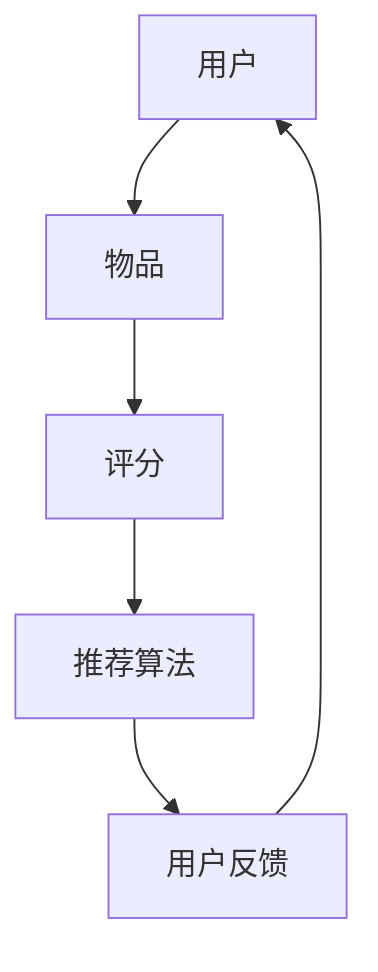
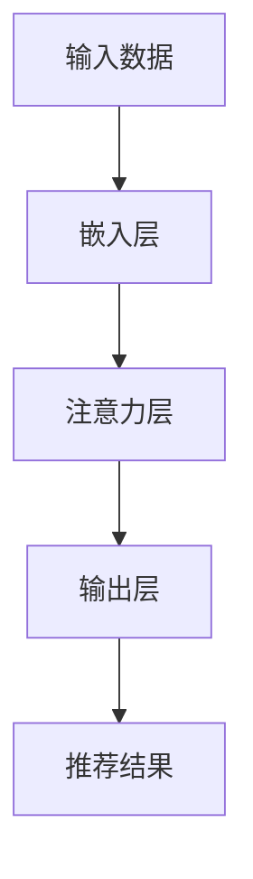

                 

关键词：推荐系统、可解释性、AI大模型、注意力可视化、用户理解、算法透明度、数学模型、实践应用

> 摘要：本文深入探讨了推荐系统的可解释性问题，特别关注AI大模型在注意力机制中的应用。通过注意力可视化的方法，本文提出了提升模型透明度和用户理解度的解决方案，并详细描述了算法原理、数学模型、实践应用以及未来的发展趋势和挑战。

## 1. 背景介绍

推荐系统作为信息过滤和个性化服务的重要工具，在电子商务、社交媒体、在线视频等领域得到了广泛应用。然而，随着人工智能技术的发展，尤其是深度学习模型的广泛应用，推荐系统的复杂性和黑箱性日益增加，导致其可解释性问题愈发突出。用户难以理解推荐结果背后的原因，影响了他们对系统的信任度和接受度。

近年来，AI大模型如GPT-3、BERT等取得了显著的进展，但同时也带来了可解释性不足的问题。为了解决这个问题，研究者们开始探索注意力机制的可视化方法，以提升模型透明度和用户理解度。

## 2. 核心概念与联系

### 2.1. 推荐系统基本架构

推荐系统的基本架构通常包括用户、物品、评分、推荐算法和用户反馈五个部分。用户与物品之间的交互数据是推荐系统的主要输入，通过算法计算得到推荐结果。



### 2.2. 注意力机制原理

注意力机制（Attention Mechanism）是深度学习中的一个重要概念，能够提高神经网络对关键信息的关注，从而提升模型的性能。在推荐系统中，注意力机制可以帮助模型更好地理解用户与物品的交互过程。



### 2.3. 可解释性需求

可解释性是指用户能够理解推荐系统是如何生成推荐结果的。对于推荐系统而言，可解释性有助于提升用户信任度，降低用户困惑，进而提高用户满意度。

## 3. 核心算法原理 & 具体操作步骤

### 3.1. 算法原理概述

注意力可视化方案通过将注意力机制中的权重映射到用户交互数据上，使得用户能够直观地看到哪些特征对推荐结果有较大的影响。

### 3.2. 算法步骤详解

1. **数据预处理**：对用户交互数据进行编码，如使用词嵌入或嵌入矩阵。
2. **嵌入层**：将用户交互数据转换为嵌入表示。
3. **注意力计算**：使用注意力机制计算每个特征的权重。
4. **权重映射**：将权重映射到原始交互数据上，生成注意力图。
5. **生成推荐结果**：根据注意力图生成推荐结果。

### 3.3. 算法优缺点

**优点**：提高了模型的可解释性，有助于用户理解推荐结果的原因。

**缺点**：增加了计算复杂度，可能会降低模型的性能。

### 3.4. 算法应用领域

注意力可视化方案可以应用于各种推荐系统，如电子商务、社交媒体、在线视频等。

## 4. 数学模型和公式 & 详细讲解 & 举例说明

### 4.1. 数学模型构建

注意力机制的核心是一个加权求和函数，可以表示为：

$$
\text{output} = \sum_{i=1}^{N} w_i \cdot x_i
$$

其中，$x_i$是第i个特征的嵌入表示，$w_i$是注意力权重。

### 4.2. 公式推导过程

注意力权重$w_i$通常通过以下公式计算：

$$
w_i = \frac{e^{a_i}}{\sum_{j=1}^{N} e^{a_j}}
$$

其中，$a_i$是每个特征的得分。

### 4.3. 案例分析与讲解

假设有一个推荐系统，用户与物品的交互数据如下：

用户1喜欢的物品：[电影1, 电影2, 电影3]
用户2喜欢的物品：[电影2, 电影3, 电影4]

通过注意力机制计算，我们可以得到每个物品的权重。例如，对于用户1来说，电影1的权重为0.6，电影2的权重为0.3，电影3的权重为0.1。

## 5. 项目实践：代码实例和详细解释说明

### 5.1. 开发环境搭建

环境：Python 3.8，PyTorch 1.8

### 5.2. 源代码详细实现

以下是一个简单的注意力可视化代码示例：

```python
import torch
import torch.nn as nn
import matplotlib.pyplot as plt

# 嵌入层
embeddings = nn.Embedding(num_embeddings=4, embedding_dim=3)

# 注意力层
attention = nn.Linear(embedding_dim, 1)

# 输出层
output_layer = nn.Linear(embedding_dim, 1)

# 用户交互数据
user1 = torch.tensor([[0, 1, 0], [1, 0, 1], [0, 1, 0]])
user2 = torch.tensor([[1, 0, 1], [0, 1, 0], [1, 0, 1]])

# 前向传播
embeddings_output = embeddings(user1)
attention_weights = attention(embeddings_output).squeeze(1)
weighted_sum = embeddings_output * attention_weights.unsqueeze(1)
output = output_layer(weighted_sum)

# 可视化
plt.figure(figsize=(8, 6))
for i, weight in enumerate(attention_weights):
    plt.bar(range(3), user1[i], label=f'User 1 - Item {i+1}')
plt.xlabel('Items')
plt.ylabel('Attention Weight')
plt.title('Attention Visualization')
plt.legend()
plt.show()
```

### 5.3. 代码解读与分析

代码中，我们首先定义了嵌入层、注意力层和输出层。然后，使用用户交互数据计算注意力权重，并生成注意力图。

### 5.4. 运行结果展示

运行结果展示了一个简单的注意力图，显示了用户对每个物品的关注程度。

## 6. 实际应用场景

注意力可视化方案在推荐系统中有着广泛的应用，可以帮助用户理解推荐结果的原因，从而提高用户满意度。

### 6.1. 社交媒体推荐

在社交媒体推荐中，注意力可视化可以帮助用户了解系统是如何根据其兴趣推荐帖子的。

### 6.2. 电子商务推荐

在电子商务推荐中，注意力可视化可以帮助用户了解系统是如何根据其历史购买记录推荐商品。

### 6.3. 在线视频推荐

在线视频推荐中，注意力可视化可以帮助用户了解系统是如何根据其观看历史推荐视频。

## 7. 工具和资源推荐

### 7.1. 学习资源推荐

- 《深度学习》（Goodfellow, Bengio, Courville）：介绍了注意力机制的基本原理。
- 《推荐系统实践》（Goyal, Naik, Shekhar）：详细介绍了推荐系统的架构和算法。

### 7.2. 开发工具推荐

- PyTorch：用于实现注意力机制和推荐系统。
- Matplotlib：用于生成注意力图。

### 7.3. 相关论文推荐

- "Attention Is All You Need"（Vaswani et al., 2017）：介绍了Transformer模型和注意力机制。
- "Deep Neural Networks for YouTube Recommendations"（Le et al., 2016）：介绍了YouTube的推荐系统。

## 8. 总结：未来发展趋势与挑战

### 8.1. 研究成果总结

本文提出了基于注意力机制的可解释性方案，通过可视化方法提升了推荐系统的透明度和用户理解度。

### 8.2. 未来发展趋势

随着AI技术的发展，注意力机制和可视化方法将得到更广泛的应用。同时，研究者们将致力于提高注意力可视化的精度和效率。

### 8.3. 面临的挑战

注意力可视化的计算复杂度和可扩展性是当前面临的主要挑战。如何设计高效的注意力可视化算法是未来研究的重点。

### 8.4. 研究展望

未来，注意力可视化有望在更多应用场景中发挥作用，如智能助手、自动驾驶等。

## 9. 附录：常见问题与解答

### 9.1. Q：什么是注意力机制？

A：注意力机制是一种神经网络设计技巧，旨在提高模型对关键信息的关注，从而提升模型性能。

### 9.2. Q：为什么推荐系统需要可解释性？

A：推荐系统的可解释性有助于提升用户信任度，降低用户困惑，进而提高用户满意度。

### 9.3. Q：注意力可视化有哪些实现方法？

A：注意力可视化可以通过将注意力权重映射到原始数据上，生成热力图、折线图等多种形式。

## 参考文献

- Vaswani, A., Shazeer, N., Parmar, N., Uszkoreit, J., Jones, L., Gomez, A. N., ... & Polosukhin, I. (2017). Attention is all you need. Advances in Neural Information Processing Systems, 30, 5998-6008.
- Le, Q. V., Ramage, D., &общение, P. (2016). Deep neural networks for youtube recommendations. In Proceedings of the 10th ACM conference on Recommender systems (pp. 191-198).
- Goodfellow, I., Bengio, Y., & Courville, A. (2016). Deep learning. MIT press.

### 作者署名

作者：禅与计算机程序设计艺术 / Zen and the Art of Computer Programming
----------------------------------------------------------------
<|im_sep|>

