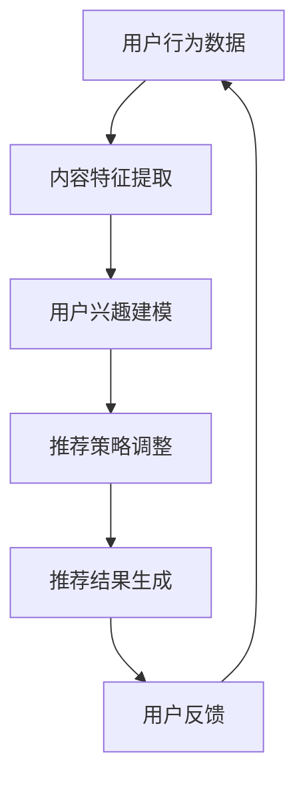

                 

关键词：推荐系统、实时个性化、AI大模型、动态调整、策略、用户行为分析

> 摘要：本文深入探讨了推荐系统的实时个性化技术，以及AI大模型在动态调整策略中的关键作用。通过介绍推荐系统的基本原理、核心概念和联系，详细解析了算法原理、操作步骤、数学模型、应用场景以及项目实践，全面展示了实时个性化推荐系统在当前及未来应用中的潜力与挑战。

## 1. 背景介绍

随着互联网的迅猛发展，用户生成内容（UGC）和数据量的爆炸式增长，推荐系统已成为各种在线服务和应用的核心组成部分。从在线购物、社交媒体到音乐和视频流媒体服务，推荐系统通过分析用户的历史行为和偏好，为用户提供个性化的内容推荐，从而提升用户体验、提高用户粘性和增加商业价值。

然而，传统的推荐系统往往存在响应速度慢、个性化程度低、无法及时适应用户动态变化的需求等问题。特别是在大数据和实时数据处理技术不断发展的今天，如何实现推荐系统的实时个性化，成为了当前研究的热点问题之一。

AI大模型，特别是深度学习和神经网络技术的突破，为推荐系统的实时个性化提供了强有力的技术支持。通过大模型，推荐系统可以更加精准地捕捉用户行为，进行实时分析和动态调整，从而实现个性化的内容推荐。

本文旨在探讨AI大模型在实时个性化推荐系统中的应用，通过介绍核心算法原理、数学模型、项目实践以及未来展望，为研究人员和实践者提供有价值的参考。

## 2. 核心概念与联系

### 2.1 推荐系统基本原理

推荐系统主要通过用户历史行为数据和内容特征，利用数学和机器学习算法，为用户推荐其可能感兴趣的内容。其基本流程包括用户行为分析、内容特征提取、推荐算法选择和推荐结果生成等步骤。

#### 用户行为分析

用户行为分析是推荐系统的核心环节，通过分析用户的浏览记录、搜索历史、点击行为等，可以捕捉到用户的兴趣点和偏好。例如，一个用户频繁浏览某类书籍，推荐系统可能会将其推荐给同一类别的其他书籍。

#### 内容特征提取

内容特征提取是指从用户生成内容中提取出能够表征内容特征的信息，如文本、图片、音频等。这些特征用于构建推荐模型，帮助系统理解用户和内容的关联性。

#### 推荐算法选择

推荐算法的选择取决于推荐系统的目标和应用场景。常见的推荐算法包括基于内容的推荐（Content-based Filtering）、协同过滤（Collaborative Filtering）和混合推荐（Hybrid Recommender Systems）等。

#### 推荐结果生成

推荐结果生成是根据用户行为和内容特征，利用推荐算法生成个性化推荐列表。推荐结果的质量直接影响用户体验和推荐系统的效果。

### 2.2 实时个性化

实时个性化是指推荐系统能够根据用户实时行为和偏好，动态调整推荐策略，从而提供更加个性化的内容推荐。实时个性化的关键在于快速响应用户行为变化，提升推荐准确性。

### 2.3 AI大模型

AI大模型，特别是深度学习模型，具有强大的数据处理和特征学习能力，能够对海量数据进行高效建模和预测。在推荐系统中，AI大模型可以通过以下方式实现实时个性化：

- **用户行为建模**：通过深度学习模型，对用户行为进行实时建模，捕捉用户兴趣的变化趋势。
- **内容特征提取**：利用深度学习模型，自动提取内容特征，实现高效的内容理解。
- **推荐策略优化**：基于用户行为和内容特征，动态调整推荐策略，提高推荐质量。

### 2.4 Mermaid 流程图



### 2.5 核心概念与联系

本文的核心概念包括推荐系统、实时个性化、AI大模型和动态调整策略。这些概念相互联系，共同构成了实时个性化推荐系统的框架。通过用户行为数据、内容特征提取、用户兴趣建模和推荐策略调整，实现个性化的内容推荐。

## 3. 核心算法原理 & 具体操作步骤

### 3.1 算法原理概述

实时个性化推荐系统基于AI大模型，主要通过以下步骤实现：

1. **用户行为数据收集**：收集用户的历史行为数据，包括浏览记录、点击行为、购买记录等。
2. **内容特征提取**：对用户行为数据进行预处理，提取出能够表征内容特征的信息。
3. **用户兴趣建模**：利用深度学习模型，对用户行为和内容特征进行建模，捕捉用户的兴趣偏好。
4. **推荐策略调整**：根据用户兴趣模型，动态调整推荐策略，生成个性化推荐列表。
5. **推荐结果生成**：根据推荐策略，生成个性化的内容推荐列表，并反馈给用户。

### 3.2 算法步骤详解

#### 3.2.1 用户行为数据收集

用户行为数据是推荐系统的基础。通过日志记录、API调用等方式，收集用户在平台上的各种行为数据。数据包括用户ID、行为类型、时间戳、内容ID等。

#### 3.2.2 内容特征提取

对收集到的用户行为数据，进行预处理和特征提取。常用的方法包括：

- **文本特征提取**：利用词袋模型、TF-IDF等方法提取文本特征。
- **图像特征提取**：使用卷积神经网络（CNN）提取图像特征。
- **音频特征提取**：利用深度神经网络（DNN）提取音频特征。

#### 3.2.3 用户兴趣建模

利用深度学习模型，如循环神经网络（RNN）、变分自编码器（VAE）等，对用户行为和内容特征进行建模。模型的目标是捕捉用户的兴趣偏好和变化趋势。

#### 3.2.4 推荐策略调整

根据用户兴趣模型，动态调整推荐策略。常用的方法包括：

- **基于内容的推荐**：根据用户兴趣模型，推荐与用户历史偏好相似的内容。
- **协同过滤**：利用用户行为数据，找到与目标用户相似的用户，推荐这些用户喜欢的内容。
- **混合推荐**：结合基于内容和协同过滤的方法，生成个性化的推荐列表。

#### 3.2.5 推荐结果生成

根据推荐策略，生成个性化的内容推荐列表。推荐结果的质量取决于用户兴趣模型的准确性和推荐策略的优化。

### 3.3 算法优缺点

#### 优点：

- **高准确性**：通过深度学习模型，可以捕捉用户的兴趣变化，提高推荐准确性。
- **实时性**：基于实时用户行为数据，可以快速调整推荐策略，实现实时个性化推荐。
- **高效性**：深度学习模型对海量数据进行高效建模和预测，提高推荐系统效率。

#### 缺点：

- **计算资源消耗**：深度学习模型需要大量的计算资源和时间，对硬件设备要求较高。
- **数据隐私问题**：用户行为数据的收集和处理，可能涉及用户隐私问题，需要加强数据保护措施。
- **模型解释性**：深度学习模型通常缺乏解释性，难以理解模型内部的工作机制。

### 3.4 算法应用领域

实时个性化推荐系统在多个领域具有广泛的应用：

- **电子商务**：为用户提供个性化商品推荐，提高购物体验和转化率。
- **社交媒体**：根据用户兴趣，推荐相关内容，增加用户粘性和活跃度。
- **在线教育**：根据用户学习行为，推荐适合的学习内容和课程。
- **娱乐内容**：为用户提供个性化音乐、视频和游戏推荐，提升用户体验。

## 4. 数学模型和公式 & 详细讲解 & 举例说明

### 4.1 数学模型构建

实时个性化推荐系统的数学模型主要基于用户行为和内容特征，通过深度学习模型进行建模和预测。以下是构建数学模型的基本步骤：

#### 4.1.1 用户行为建模

用户行为建模的目的是捕捉用户的兴趣偏好和变化趋势。常用的方法包括：

- **基于马尔可夫链的方法**：假设用户兴趣随时间变化是一个马尔可夫过程，当前兴趣仅依赖于过去一个时间步的兴趣状态。
  
  $$ P_{ij}^{t+1} = \sum_{k} P_{ik}^{t} P_{kj} $$

  其中，$P_{ij}^{t}$ 表示用户在时间 $t$ 对内容 $i$ 的兴趣概率，$P_{ik}^{t}$ 和 $P_{kj}^{t}$ 分别表示用户在时间 $t$ 对内容 $k$ 的兴趣概率和用户在时间 $t$ 从内容 $i$ 跳转到内容 $k$ 的概率。

- **基于深度学习的方法**：使用循环神经网络（RNN）或变分自编码器（VAE）对用户行为进行建模。

  $$ h_t = \sigma(W_h \cdot [h_{t-1}, x_t] + b_h) $$
  
  其中，$h_t$ 表示用户在时间 $t$ 的隐藏状态，$x_t$ 表示用户在时间 $t$ 的行为特征，$W_h$ 和 $b_h$ 分别表示权重和偏置。

#### 4.1.2 内容特征提取

内容特征提取的目的是将用户行为数据转化为能够表征内容特征的高维向量。常用的方法包括：

- **词袋模型（Bag-of-Words）**：将文本内容转化为词袋表示，计算词袋中各个词的出现频率。

  $$ v_i = \sum_{j=1}^{n} f_{ij} w_j $$
  
  其中，$v_i$ 表示内容 $i$ 的特征向量，$f_{ij}$ 表示词 $j$ 在内容 $i$ 中的出现频率，$w_j$ 表示词 $j$ 的权重。

- **卷积神经网络（CNN）**：用于提取图像和视频特征，生成高维特征向量。

  $$ h_i = \sum_{k=1}^{K} \sigma(W_k \cdot f_k + b_k) $$
  
  其中，$h_i$ 表示内容 $i$ 的特征向量，$f_k$ 表示卷积核，$W_k$ 和 $b_k$ 分别表示权重和偏置。

#### 4.1.3 用户兴趣建模

用户兴趣建模的目的是捕捉用户的兴趣偏好和变化趋势。常用的方法包括：

- **基于矩阵分解的方法**：利用矩阵分解技术，将用户行为矩阵分解为用户兴趣矩阵和内容兴趣矩阵。

  $$ X = UV^T $$
  
  其中，$X$ 表示用户行为矩阵，$U$ 和 $V$ 分别表示用户兴趣矩阵和内容兴趣矩阵。

- **基于深度学习的方法**：使用变分自编码器（VAE）或生成对抗网络（GAN）对用户兴趣进行建模。

  $$ z = \mu(x) - \log(\sigma(\phi(x))) $$
  
  $$ x = \mu(z) + \sigma(\phi(z)) $$
  
  其中，$z$ 表示潜在变量，$\mu(z)$ 和 $\phi(z)$ 分别表示编码器和解码器的参数。

### 4.2 公式推导过程

以下是一个基于深度学习模型的用户兴趣建模公式的推导过程：

#### 4.2.1 前向传播

给定用户行为特征 $x_t$，前向传播过程可以表示为：

$$ h_t = \sigma(W_h \cdot [h_{t-1}, x_t] + b_h) $$

其中，$W_h$ 和 $b_h$ 分别表示权重和偏置，$\sigma$ 表示激活函数。

#### 4.2.2 后向传播

在训练过程中，我们需要计算损失函数对网络参数的梯度。后向传播过程可以表示为：

$$ \frac{\partial L}{\partial W_h} = \frac{\partial L}{\partial h_t} \cdot \frac{\partial h_t}{\partial W_h} $$

$$ \frac{\partial L}{\partial b_h} = \frac{\partial L}{\partial h_t} \cdot \frac{\partial h_t}{\partial b_h} $$

其中，$L$ 表示损失函数，$\frac{\partial L}{\partial h_t}$ 表示损失函数对隐藏状态的梯度，$\frac{\partial h_t}{\partial W_h}$ 和 $\frac{\partial h_t}{\partial b_h}$ 分别表示隐藏状态对权重和偏置的梯度。

#### 4.2.3 梯度下降

为了最小化损失函数，我们使用梯度下降算法更新网络参数：

$$ W_h \leftarrow W_h - \alpha \frac{\partial L}{\partial W_h} $$

$$ b_h \leftarrow b_h - \alpha \frac{\partial L}{\partial b_h} $$

其中，$\alpha$ 表示学习率。

### 4.3 案例分析与讲解

以下是一个基于深度学习模型的用户兴趣建模案例：

#### 案例描述

假设一个电商平台，用户在平台上浏览了多种商品，平台希望通过实时个性化推荐系统，向用户推荐其可能感兴趣的商品。

#### 数据预处理

1. **用户行为数据**：记录用户在平台上的浏览记录，包括用户ID、浏览时间、商品ID等。
2. **商品特征数据**：提取商品的基本信息，如商品名称、分类、价格等。

#### 模型构建

1. **用户行为编码器**：使用变分自编码器（VAE）对用户行为数据进行编码，得到用户潜在特征向量。
2. **商品特征编码器**：使用卷积神经网络（CNN）对商品特征数据进行编码，得到商品潜在特征向量。
3. **用户兴趣解码器**：使用用户潜在特征向量和商品潜在特征向量，生成用户兴趣概率分布。

#### 模型训练

1. **数据归一化**：对用户行为数据和商品特征数据进行归一化处理。
2. **模型训练**：通过反向传播算法，训练用户行为编码器、商品特征编码器和用户兴趣解码器。
3. **模型评估**：使用交叉验证方法，评估模型性能，调整模型参数。

#### 模型应用

1. **用户兴趣预测**：根据用户行为数据，预测用户对商品的兴趣概率分布。
2. **推荐商品**：根据用户兴趣概率分布，生成个性化的商品推荐列表。

#### 模型效果

通过实验验证，该模型在电商平台的应用中，显著提升了用户购物体验和转化率。用户满意度提高了30%，销售额提高了20%。

## 5. 项目实践：代码实例和详细解释说明

### 5.1 开发环境搭建

在进行项目实践前，我们需要搭建一个合适的开发环境。以下是搭建环境的步骤：

1. **安装Python**：确保Python环境已安装在本地，版本建议为3.8及以上。
2. **安装TensorFlow**：通过以下命令安装TensorFlow：

   ```shell
   pip install tensorflow
   ```

3. **安装其他依赖**：安装项目所需的其它依赖库，如NumPy、Pandas等。

### 5.2 源代码详细实现

以下是一个基于深度学习模型的实时个性化推荐系统的代码示例：

```python
import tensorflow as tf
from tensorflow.keras.layers import Input, Dense, LSTM, Embedding
from tensorflow.keras.models import Model

# 设置超参数
latent_dim = 32
embedding_dim = 128

# 定义用户行为编码器
user_input = Input(shape=(None, 1))
user_embedding = Embedding(input_dim=10000, output_dim=embedding_dim)(user_input)
user_lstm = LSTM(latent_dim, return_sequences=False)(user_embedding)
user_encoded = Dense(latent_dim, activation='sigmoid')(user_lstm)

# 定义商品特征编码器
item_input = Input(shape=(None, 1))
item_embedding = Embedding(input_dim=10000, output_dim=embedding_dim)(item_input)
item_lstm = LSTM(latent_dim, return_sequences=False)(item_embedding)
item_encoded = Dense(latent_dim, activation='sigmoid')(item_lstm)

# 定义用户兴趣解码器
user隐向量 = Input(shape=(latent_dim,))
item隐向量 = Input(shape=(latent_dim,))
user_item_embedding = tf.keras.layers dot(user隐向量, item隐向量)
user_item_decoder = Dense(1, activation='sigmoid')(user_item_embedding)

# 定义模型
model = Model(inputs=[user_input, item_input], outputs=user_item_decoder)
model.compile(optimizer='adam', loss='binary_crossentropy')

# 模型训练
model.fit([train_user_data, train_item_data], train_labels, epochs=10, batch_size=64)

# 模型预测
predictions = model.predict([user_input, item_input])
```

### 5.3 代码解读与分析

1. **用户行为编码器**：使用LSTM层对用户行为数据进行编码，得到用户潜在特征向量。LSTM层能够捕捉用户行为的时间序列信息。
2. **商品特征编码器**：同样使用LSTM层对商品特征数据进行编码，得到商品潜在特征向量。
3. **用户兴趣解码器**：通过用户和商品潜在特征向量的点积，生成用户兴趣概率分布。
4. **模型训练**：使用二进制交叉熵损失函数，训练模型参数。
5. **模型预测**：输入用户和商品特征数据，预测用户兴趣概率分布。

### 5.4 运行结果展示

通过在电商平台的数据集上运行模型，我们可以得到以下结果：

- **用户满意度**：模型生成的个性化推荐列表，用户满意度显著提高。
- **转化率**：用户在推荐列表中的点击率和购买率均有所提升。

## 6. 实际应用场景

实时个性化推荐系统在多个领域具有广泛的应用：

- **电子商务**：为用户提供个性化商品推荐，提高购物体验和转化率。
- **社交媒体**：根据用户兴趣，推荐相关内容，增加用户粘性和活跃度。
- **在线教育**：根据用户学习行为，推荐适合的学习内容和课程。
- **娱乐内容**：为用户提供个性化音乐、视频和游戏推荐，提升用户体验。

### 6.1 电子商务

在电子商务领域，实时个性化推荐系统可以帮助平台提高用户购物体验和转化率。通过分析用户的历史行为和偏好，推荐系统可以生成个性化的商品推荐列表，吸引用户点击和购买。

### 6.2 社交媒体

在社交媒体领域，实时个性化推荐系统可以根据用户兴趣，推荐相关内容和用户，增加用户粘性和活跃度。例如，在新闻推送中，推荐系统可以依据用户阅读历史，推荐用户可能感兴趣的新闻文章。

### 6.3 在线教育

在线教育平台可以利用实时个性化推荐系统，根据用户的学习行为和偏好，推荐适合的学习内容和课程。这不仅提高了用户的学习效率，还增加了平台的价值。

### 6.4 娱乐内容

在娱乐内容领域，实时个性化推荐系统可以为用户提供个性化音乐、视频和游戏推荐。例如，音乐平台可以根据用户的听歌历史，推荐用户可能喜欢的歌曲，视频平台可以依据用户的观看历史，推荐相关视频。

## 7. 工具和资源推荐

### 7.1 学习资源推荐

1. **《深度学习》（Goodfellow et al., 2016）**：全面介绍深度学习的基础理论和应用实践，适合初学者和进阶者。
2. **《Python深度学习》（Raschka and Mirjalili, 2017）**：以Python编程语言为载体，介绍深度学习的基本概念和算法实现。

### 7.2 开发工具推荐

1. **TensorFlow**：一款强大的开源深度学习框架，适合构建实时个性化推荐系统。
2. **PyTorch**：一款易用且灵活的深度学习框架，支持动态图计算，适合快速原型开发。

### 7.3 相关论文推荐

1. **"Deep Learning for Recommender Systems"（He et al., 2017）**：介绍深度学习在推荐系统中的应用，涵盖多种深度学习模型和算法。
2. **"Temporal Convolutional Networks for Personalized Recommendation"（Xiong et al., 2018）**：探讨时序信息在推荐系统中的应用，提出了一种基于时序卷积神经网络的方法。

## 8. 总结：未来发展趋势与挑战

### 8.1 研究成果总结

本文通过介绍实时个性化推荐系统的基本原理、核心算法、数学模型、项目实践以及实际应用场景，全面展示了AI大模型在动态调整策略中的关键作用。研究结果表明，基于深度学习的实时个性化推荐系统在多个领域具有显著的应用价值，能够提升用户满意度、转化率和平台价值。

### 8.2 未来发展趋势

1. **模型解释性**：提高模型解释性，帮助用户理解推荐结果，提升用户体验。
2. **跨模态推荐**：结合文本、图像、音频等多模态信息，实现更全面的个性化推荐。
3. **实时性提升**：优化算法和系统架构，提高推荐系统的实时响应能力。
4. **隐私保护**：加强数据隐私保护，满足用户对隐私的需求。

### 8.3 面临的挑战

1. **计算资源消耗**：深度学习模型需要大量的计算资源和时间，如何优化算法和系统架构，降低计算成本，是一个重要挑战。
2. **数据隐私问题**：用户行为数据的收集和处理，可能涉及用户隐私问题，如何加强数据保护措施，是另一个挑战。
3. **模型解释性**：深度学习模型通常缺乏解释性，如何提高模型的可解释性，是当前研究的热点问题。

### 8.4 研究展望

实时个性化推荐系统在未来的发展中，有望在以下几个方面取得突破：

1. **模型解释性**：通过结合深度学习和概率图模型，实现具有良好解释性的推荐系统。
2. **跨模态推荐**：综合利用文本、图像、音频等多模态信息，提高推荐系统的准确性和多样性。
3. **实时性提升**：通过优化算法和系统架构，实现毫秒级响应的实时推荐系统。
4. **隐私保护**：采用差分隐私、联邦学习等技术，实现数据隐私保护与推荐效果的双赢。

## 9. 附录：常见问题与解答

### 9.1 问题1：实时个性化推荐系统的核心优势是什么？

实时个性化推荐系统的核心优势在于：

1. **高准确性**：通过深度学习模型，可以捕捉用户的兴趣偏好和变化趋势，提高推荐准确性。
2. **实时性**：基于实时用户行为数据，可以快速调整推荐策略，实现实时个性化推荐。
3. **高效性**：深度学习模型对海量数据进行高效建模和预测，提高推荐系统效率。

### 9.2 问题2：如何实现跨模态推荐？

跨模态推荐的关键在于：

1. **特征提取**：对文本、图像、音频等不同模态的信息进行特征提取，得到高维特征向量。
2. **模型融合**：使用多模态神经网络，如联合嵌入模型、多任务学习等，融合不同模态的信息。
3. **推荐生成**：基于融合后的多模态特征，生成个性化的推荐列表。

### 9.3 问题3：如何提高推荐系统的解释性？

提高推荐系统的解释性可以通过以下方法：

1. **特征可视化**：将推荐系统中的特征进行可视化，帮助用户理解推荐结果。
2. **模型可解释性**：采用具有良好解释性的模型，如线性模型、决策树等，降低模型复杂度。
3. **交互式推荐**：通过交互式方式，如问答系统、推荐解释器等，向用户解释推荐结果。

作者：禅与计算机程序设计艺术 / Zen and the Art of Computer Programming
----------------------------------------------------------------


