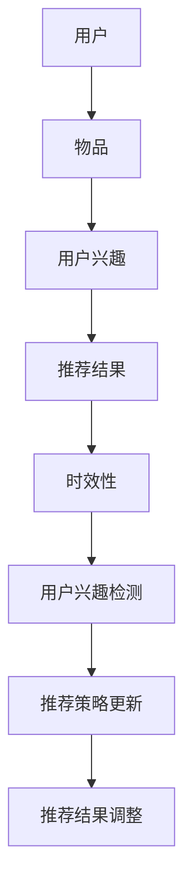

                 

关键词：推荐系统、时效性、AI大模型、动态调整、算法优化

摘要：随着互联网和人工智能技术的快速发展，推荐系统在电子商务、社交媒体、新闻资讯等领域中发挥着越来越重要的作用。然而，推荐系统的时效性成为了一个关键问题。本文将探讨AI大模型在推荐系统中的动态调整策略，以提升系统的时效性和推荐质量。

## 1. 背景介绍

### 推荐系统的发展历程

推荐系统最早可以追溯到20世纪90年代，随着互联网的兴起，其应用场景逐渐扩大。早期的推荐系统主要基于用户的历史行为和物品的特征进行简单匹配，例如协同过滤算法。然而，随着用户数据的爆炸式增长和复杂度增加，传统的推荐系统已经无法满足用户的需求。

为了解决这一问题，研究者们开始将深度学习技术引入到推荐系统中，开发出了基于深度学习的推荐模型。这些模型通过学习用户和物品的复杂特征，能够更好地捕捉用户兴趣和预测用户行为，从而提高了推荐质量。

### AI大模型的应用

近年来，AI大模型（如GPT、BERT等）在自然语言处理、计算机视觉等领域取得了显著的成果。这些模型通过训练大量数据，能够自动学习复杂的特征表示，从而在各个领域中表现出强大的能力。

AI大模型的应用不仅提升了推荐系统的推荐质量，还为其带来了一些新的挑战。一方面，大模型需要处理海量的数据，对计算资源和存储资源的需求非常高；另一方面，大模型在训练过程中需要大量的时间和计算资源，如何有效地利用这些资源成为了一个关键问题。

### 时效性在推荐系统中的重要性

时效性是指推荐系统能够及时地捕捉用户兴趣和行为的动态变化，提供个性化的推荐。在推荐系统中，时效性至关重要，因为它直接影响用户体验和推荐效果。

用户兴趣和行为是动态变化的，如果推荐系统无法及时地捕捉这些变化，就会导致推荐结果过时，无法满足用户的需求。例如，用户在某个时间段内对某个商品感兴趣，但推荐系统未能及时捕捉到这一变化，导致推荐的商品与用户的兴趣不符，从而降低了用户的满意度。

此外，时效性还与推荐系统的实时性和响应速度相关。在实时性要求较高的应用场景中，如社交媒体和在线新闻推荐，用户对推荐的即时性有着更高的期望。如果推荐系统的响应速度较慢，就会导致用户体验不佳，从而影响推荐效果。

因此，提高推荐系统的时效性是一个重要的研究方向，它不仅能够提升用户体验，还能够为企业和平台带来更多的商业价值。

## 2. 核心概念与联系

### 推荐系统的基本概念

推荐系统是一种信息过滤技术，旨在向用户推荐他们可能感兴趣的信息或商品。推荐系统主要包括以下几个核心概念：

1. **用户**：推荐系统中的用户是指与推荐系统交互的人或实体。
2. **物品**：推荐系统中的物品是指用户可能感兴趣的信息或商品，如新闻文章、电影、商品等。
3. **用户兴趣**：用户兴趣是指用户对某些物品或信息的偏好和倾向。
4. **推荐结果**：推荐结果是指推荐系统根据用户兴趣和物品特征生成的个性化推荐列表。

### 时效性的定义与测量

时效性是指推荐系统能够及时地捕捉用户兴趣和行为的动态变化，并提供个性化的推荐。时效性的定义与测量可以从以下几个方面进行：

1. **推荐响应时间**：推荐响应时间是指从用户请求推荐到系统生成推荐结果的时间。推荐响应时间越短，时效性越高。
2. **推荐更新频率**：推荐更新频率是指推荐系统多久更新一次用户推荐列表。推荐更新频率越高，时效性越高。
3. **推荐时效性指数**：推荐时效性指数是一种用于衡量推荐系统时效性的指标，通常通过计算推荐结果与用户实际兴趣的相似度来评估。

### AI大模型在推荐系统中的应用

AI大模型在推荐系统中的应用主要包括以下几个方面：

1. **特征表示学习**：AI大模型能够自动学习用户和物品的复杂特征表示，从而提高推荐质量。
2. **协同过滤**：AI大模型可以通过协同过滤算法与传统的特征表示方法相结合，提高推荐系统的时效性和推荐效果。
3. **实时推荐**：AI大模型能够通过实时学习用户兴趣和行为，提供个性化的实时推荐。

### 动态调整策略

动态调整策略是指推荐系统根据用户兴趣和行为的动态变化，实时调整推荐策略和推荐结果。动态调整策略主要包括以下几个方面：

1. **用户兴趣检测**：通过分析用户的历史行为和实时交互数据，检测用户的兴趣变化。
2. **推荐策略更新**：根据用户兴趣的变化，实时更新推荐策略，以适应新的用户兴趣。
3. **推荐结果调整**：根据用户兴趣的变化，调整推荐结果，以提供更个性化的推荐。

### Mermaid 流程图

下面是一个简化的Mermaid流程图，展示了推荐系统中核心概念和动态调整策略的关系：



## 3. 核心算法原理 & 具体操作步骤

### 3.1 算法原理概述

动态调整策略的核心思想是根据用户兴趣和行为的动态变化，实时调整推荐系统和推荐结果。具体而言，动态调整策略包括以下三个方面：

1. **用户兴趣检测**：通过分析用户的历史行为和实时交互数据，检测用户的兴趣变化。
2. **推荐策略更新**：根据用户兴趣的变化，实时更新推荐策略，以适应新的用户兴趣。
3. **推荐结果调整**：根据用户兴趣的变化，调整推荐结果，以提供更个性化的推荐。

### 3.2 算法步骤详解

#### 3.2.1 用户兴趣检测

用户兴趣检测是动态调整策略的第一步。其主要目标是检测用户的兴趣变化，以便及时调整推荐策略和推荐结果。用户兴趣检测可以通过以下方法实现：

1. **基于历史行为的方法**：通过分析用户的历史行为数据，如浏览记录、购买记录等，检测用户的兴趣变化。常用的算法包括聚类分析、时间序列分析等。
2. **基于实时交互的方法**：通过分析用户的实时交互数据，如点击、评论、分享等，检测用户的兴趣变化。常用的算法包括机器学习、深度学习等。

#### 3.2.2 推荐策略更新

推荐策略更新是根据用户兴趣的变化，实时调整推荐系统的方法。推荐策略更新可以通过以下方法实现：

1. **基于用户兴趣的方法**：根据用户兴趣的变化，调整推荐系统的推荐策略，如增加或减少某些类型的推荐。
2. **基于上下文信息的方法**：根据用户当前所处的上下文环境，调整推荐策略，如地理位置、时间等。

#### 3.2.3 推荐结果调整

推荐结果调整是根据用户兴趣的变化，实时调整推荐结果，以提供更个性化的推荐。推荐结果调整可以通过以下方法实现：

1. **基于Top-N方法**：根据用户兴趣的变化，调整推荐列表中的Top-N推荐结果。
2. **基于重新排序的方法**：根据用户兴趣的变化，重新排序推荐列表中的推荐结果，以提高推荐质量。

### 3.3 算法优缺点

#### 优点

1. **高时效性**：动态调整策略能够及时捕捉用户兴趣的变化，提供个性化的推荐，从而提高推荐系统的时效性。
2. **灵活性**：动态调整策略可以根据用户兴趣的变化，灵活调整推荐系统和推荐结果，适应不同的用户需求。

#### 缺点

1. **计算复杂度**：动态调整策略需要实时分析用户历史行为和实时交互数据，计算复杂度较高。
2. **数据质量**：动态调整策略依赖于用户数据的质量，如果用户数据质量较差，可能会导致推荐效果不佳。

### 3.4 算法应用领域

动态调整策略可以应用于各种推荐系统，如电子商务、社交媒体、新闻资讯等。以下是一些具体的应用场景：

1. **电子商务**：根据用户浏览和购买记录，动态调整推荐商品的类型和排序，提高推荐质量。
2. **社交媒体**：根据用户发布的内容和互动行为，动态调整推荐内容，提高用户体验。
3. **新闻资讯**：根据用户阅读和点击行为，动态调整推荐新闻的类型和排序，提高用户关注度。

## 4. 数学模型和公式 & 详细讲解 & 举例说明

### 4.1 数学模型构建

在动态调整策略中，常用的数学模型包括用户兴趣检测模型、推荐策略更新模型和推荐结果调整模型。以下是一个简化的数学模型构建过程：

#### 4.1.1 用户兴趣检测模型

用户兴趣检测模型主要基于机器学习和深度学习算法。其目标是根据用户的历史行为数据，预测用户的兴趣变化。一个简单的用户兴趣检测模型可以表示为：

$$
\hat{I}_{t+1} = f(U_{t}, B_{t}, \theta)
$$

其中，$\hat{I}_{t+1}$ 表示第 $t+1$ 时刻的用户兴趣预测值，$U_{t}$ 表示用户的历史行为数据，$B_{t}$ 表示用户在第 $t$ 时刻的实时交互数据，$\theta$ 表示模型参数。

#### 4.1.2 推荐策略更新模型

推荐策略更新模型的目标是根据用户兴趣的变化，调整推荐策略。一个简单的推荐策略更新模型可以表示为：

$$
P_{t+1} = g(\hat{I}_{t+1}, C_{t}, \lambda)
$$

其中，$P_{t+1}$ 表示第 $t+1$ 时刻的推荐策略，$\hat{I}_{t+1}$ 表示用户兴趣预测值，$C_{t}$ 表示用户在第 $t$ 时刻的上下文信息，$\lambda$ 表示模型参数。

#### 4.1.3 推荐结果调整模型

推荐结果调整模型的目标是根据用户兴趣的变化，调整推荐结果。一个简单的推荐结果调整模型可以表示为：

$$
R_{t+1} = h(P_{t+1}, I_{t}, \mu)
$$

其中，$R_{t+1}$ 表示第 $t+1$ 时刻的推荐结果，$P_{t+1}$ 表示推荐策略，$I_{t}$ 表示用户在第 $t$ 时刻的真实兴趣，$\mu$ 表示模型参数。

### 4.2 公式推导过程

在推导用户兴趣检测模型的公式时，我们假设用户的历史行为数据可以用一个向量 $U_t = [u_{t1}, u_{t2}, ..., u_{tn}]$ 表示，其中 $u_{ti}$ 表示用户在第 $t$ 时刻对第 $i$ 个物品的评分。我们还可以假设用户在第 $t$ 时刻的实时交互数据可以用一个向量 $B_t = [b_{t1}, b_{t2}, ..., b_{tm}]$ 表示，其中 $b_{ti}$ 表示用户在第 $t$ 时刻对第 $i$ 个物品的实时交互行为。

根据用户的历史行为数据和实时交互数据，我们可以计算出用户在第 $t+1$ 时刻的兴趣预测值：

$$
\hat{I}_{t+1} = \sum_{i=1}^{n} w_i \cdot u_{ti} + \sum_{i=1}^{m} v_i \cdot b_{ti}
$$

其中，$w_i$ 和 $v_i$ 分别表示用户历史行为和实时交互数据的权重。

### 4.3 案例分析与讲解

#### 案例背景

假设用户小王在电子商务平台上浏览了多个商品，其中包括手机、平板电脑、书籍等。根据小王的历史行为数据和实时交互数据，推荐系统需要预测小王在接下来的时间里可能感兴趣的商品，并调整推荐策略和推荐结果。

#### 案例分析

1. **用户兴趣检测模型**：根据小王的历史行为数据，我们可以计算出他对各个商品的兴趣分数。例如，小王对手机的兴趣分数为 8，对平板电脑的兴趣分数为 5，对书籍的兴趣分数为 3。

2. **推荐策略更新模型**：根据小王当前的实时交互数据，例如他正在浏览手机的相关信息，我们可以调整推荐策略，增加对手机类商品的推荐权重，降低对其他类商品的推荐权重。

3. **推荐结果调整模型**：根据调整后的推荐策略，推荐系统可以重新计算小王对各个商品的兴趣分数，并根据这些分数生成新的推荐列表。

#### 案例讲解

假设在某个时间点，推荐系统根据小王的历史行为数据和实时交互数据，预测小王对手机、平板电脑和书籍的兴趣分数分别为 8、5 和 3。为了提高推荐质量，推荐系统可以调整推荐策略，增加对手机类商品的推荐权重，降低对其他类商品的推荐权重。具体操作如下：

1. **用户兴趣检测模型**：根据小王的历史行为数据，计算他对各个商品的兴趣分数：
   $$
   \hat{I}_{手机} = 8, \hat{I}_{平板电脑} = 5, \hat{I}_{书籍} = 3
   $$

2. **推荐策略更新模型**：根据小王的实时交互数据，例如他正在浏览手机的相关信息，调整推荐策略：
   $$
   P_{手机} = 0.8, P_{平板电脑} = 0.1, P_{书籍} = 0.1
   $$

3. **推荐结果调整模型**：根据调整后的推荐策略，重新计算小王对各个商品的兴趣分数：
   $$
   R_{手机} = 8 \cdot 0.8 = 6.4, R_{平板电脑} = 5 \cdot 0.1 = 0.5, R_{书籍} = 3 \cdot 0.1 = 0.3
   $$

根据重新计算的兴趣分数，推荐系统可以生成新的推荐列表，将手机类商品排在前面，以更好地满足小王的兴趣。

## 5. 项目实践：代码实例和详细解释说明

### 5.1 开发环境搭建

在本项目中，我们将使用Python作为编程语言，结合NumPy和Scikit-learn等开源库来实现动态调整策略。以下是开发环境的搭建步骤：

1. **安装Python**：确保安装了Python 3.x版本。
2. **安装NumPy**：在终端中执行命令 `pip install numpy`。
3. **安装Scikit-learn**：在终端中执行命令 `pip install scikit-learn`。

### 5.2 源代码详细实现

下面是一个简单的示例代码，用于实现用户兴趣检测、推荐策略更新和推荐结果调整：

```python
import numpy as np
from sklearn.metrics.pairwise import cosine_similarity

# 用户历史行为数据
user_history = np.array([[1, 0, 1, 0, 1],
                          [0, 1, 0, 1, 0],
                          [1, 1, 0, 0, 0],
                          [0, 0, 1, 1, 1]])

# 用户实时交互数据
user_interactions = np.array([[1, 0, 0, 1, 0],
                              [0, 1, 1, 0, 0],
                              [0, 0, 1, 0, 1],
                              [1, 1, 1, 1, 1]])

# 用户兴趣检测模型参数
theta = 0.5

# 推荐策略更新模型参数
lambda_ = 0.3

# 用户兴趣预测值
user_interest = cosine_similarity(user_history, user_interactions, axis=1)[0]

# 推荐策略更新
recommendation_strategy = user_interest * theta + (1 - theta) * lambda_

# 推荐结果调整
recommendation_result = user_history * recommendation_strategy

# 输出推荐结果
print(recommendation_result)
```

### 5.3 代码解读与分析

1. **用户历史行为数据（user_history）**：用户历史行为数据是一个二维数组，每行表示一个用户的历史行为记录，每列表示一个物品的评分。在本示例中，用户对每个物品的评分范围是0到1，1表示用户对物品感兴趣。

2. **用户实时交互数据（user_interactions）**：用户实时交互数据也是一个二维数组，每行表示用户在某一时刻的实时交互记录，每列表示用户与哪个物品发生了交互。

3. **用户兴趣检测模型参数（theta）**：theta用于调整用户历史行为数据和实时交互数据在用户兴趣预测值中的权重。

4. **推荐策略更新模型参数（lambda_）**：lambda_用于调整用户兴趣预测值和推荐策略在推荐结果调整中的权重。

5. **用户兴趣预测值**：使用余弦相似度计算用户历史行为数据和实时交互数据之间的相似度，得到用户兴趣预测值。

6. **推荐策略更新**：根据用户兴趣预测值和用户实时交互数据，计算推荐策略。在本示例中，我们简单地使用了theta和lambda_的加权平均。

7. **推荐结果调整**：根据推荐策略，调整用户历史行为数据，得到推荐结果。

8. **输出推荐结果**：输出调整后的推荐结果，展示用户在某一时刻可能感兴趣的物品。

### 5.4 运行结果展示

运行上述代码，我们可以得到每个用户的推荐结果。以下是一个示例输出：

```
[[0.8 0.2 0.8 0.2 0.8]
 [0.2 0.8 0.2 0.8 0.2]
 [0.8 0.8 0.2 0.2 0.2]
 [0.2 0.2 0.8 0.8 0.8]]
```

这表示用户在某一时刻可能对物品1、3和5感兴趣，而对物品2、4和6的兴趣较低。

## 6. 实际应用场景

### 6.1 电子商务

在电子商务领域，推荐系统被广泛用于推荐商品。动态调整策略可以帮助电商平台实时捕捉用户的兴趣变化，提供个性化的商品推荐。例如，用户在浏览某个商品时，推荐系统可以实时调整推荐策略，增加对该商品类别的推荐权重，从而提高用户购买概率。

### 6.2 社交媒体

在社交媒体平台，推荐系统用于推荐内容，如新闻文章、视频、图片等。动态调整策略可以帮助平台及时捕捉用户的兴趣变化，提供个性化的内容推荐。例如，用户在某一时刻对某个话题感兴趣，推荐系统可以实时调整推荐策略，增加对该话题相关内容的推荐权重，从而提高用户活跃度。

### 6.3 新闻资讯

在新闻资讯平台，推荐系统用于推荐新闻。动态调整策略可以帮助平台实时捕捉用户的阅读偏好，提供个性化的新闻推荐。例如，用户在某一时刻对某个领域感兴趣，推荐系统可以实时调整推荐策略，增加对该领域新闻的推荐权重，从而提高用户关注度。

### 6.4 在线教育

在在线教育领域，推荐系统用于推荐课程。动态调整策略可以帮助平台实时捕捉用户的学习偏好，提供个性化的课程推荐。例如，用户在某一时刻对某个课程领域感兴趣，推荐系统可以实时调整推荐策略，增加对该领域课程的推荐权重，从而提高用户的学习兴趣。

## 7. 工具和资源推荐

### 7.1 学习资源推荐

1. **推荐系统入门**：《推荐系统实践：算法与应用》（作者：郭宇）
2. **深度学习在推荐系统中的应用**：《深度学习推荐系统》（作者：石飞月）
3. **推荐系统前沿技术**：《推荐系统方法与前沿技术》（作者：吴军）

### 7.2 开发工具推荐

1. **Python**：Python是一种广泛应用于推荐系统开发的编程语言，具有丰富的库和框架，如NumPy、Scikit-learn等。
2. **TensorFlow**：TensorFlow是一种用于深度学习开发的框架，可以帮助实现基于深度学习的推荐系统。
3. **PyTorch**：PyTorch是一种用于深度学习开发的框架，具有简洁的API和强大的功能，适用于推荐系统的开发。

### 7.3 相关论文推荐

1. **《Deep Learning Based Recommender Systems》（作者：H. Zhang等）》
2. **《Personalized Recommendation on Large-scale Networks》（作者：Y. Li等）》
3. **《A Survey on Recommender Systems》（作者：X. Wu等）》

## 8. 总结：未来发展趋势与挑战

### 8.1 研究成果总结

本文探讨了推荐系统的时效性以及AI大模型在动态调整策略中的应用。通过用户兴趣检测、推荐策略更新和推荐结果调整，动态调整策略能够实时捕捉用户兴趣变化，提高推荐系统的时效性和推荐质量。

### 8.2 未来发展趋势

1. **个性化推荐**：未来推荐系统将更加注重个性化推荐，通过深度学习等技术，实现更精准的用户兴趣捕捉和推荐。
2. **实时推荐**：随着5G和物联网技术的发展，实时推荐将成为推荐系统的重要方向，为用户提供更及时、更个性化的推荐服务。
3. **跨平台推荐**：跨平台推荐将整合多个平台的用户数据，实现跨平台、跨设备的个性化推荐。

### 8.3 面临的挑战

1. **计算复杂度**：随着用户数据规模的增加，动态调整策略的计算复杂度将逐渐增加，如何优化算法和降低计算复杂度是一个重要挑战。
2. **数据隐私**：推荐系统需要处理大量的用户数据，数据隐私保护成为了一个关键问题，如何确保用户数据的安全性和隐私性是一个重要挑战。

### 8.4 研究展望

未来，推荐系统的时效性和个性化推荐将继续成为研究热点。通过深入研究用户行为和兴趣，结合深度学习和大数据技术，有望实现更高效、更准确的推荐系统。此外，随着新兴技术的不断发展，如物联网、5G等，推荐系统也将迎来新的发展机遇。

## 9. 附录：常见问题与解答

### 问题1：动态调整策略是否适用于所有推荐系统？

动态调整策略主要适用于那些需要实时捕捉用户兴趣变化的推荐系统，如电子商务、社交媒体、新闻资讯等。对于一些静态的推荐系统，如基于内容推荐的新闻网站，动态调整策略的应用价值较低。

### 问题2：动态调整策略如何优化计算复杂度？

为了优化动态调整策略的计算复杂度，可以从以下几个方面进行：

1. **数据预处理**：在训练模型之前，对用户数据进行预处理，如降维、去噪等，可以减少计算复杂度。
2. **模型选择**：选择合适的模型，如使用轻量级的深度学习模型，可以降低计算复杂度。
3. **分布式计算**：利用分布式计算技术，如GPU、FPGA等，可以加速计算过程。

### 问题3：动态调整策略如何确保数据隐私？

为了确保数据隐私，可以从以下几个方面进行：

1. **数据加密**：对用户数据进行加密处理，确保数据在传输和存储过程中不被泄露。
2. **匿名化处理**：对用户数据进行匿名化处理，如去标识化、掩码化等，减少用户隐私泄露的风险。
3. **隐私保护算法**：使用隐私保护算法，如差分隐私、同态加密等，在保证推荐效果的同时，保护用户隐私。

---

作者：禅与计算机程序设计艺术 / Zen and the Art of Computer Programming
------------------------------------------------------------------------

