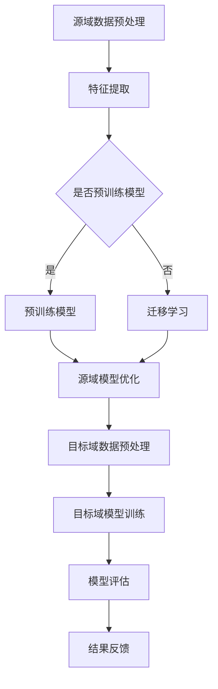

                 

关键词：推荐系统，跨域迁移，AI大模型，知识转移，算法原理，数学模型，项目实践，应用场景，未来展望。

> 摘要：本文将深入探讨推荐系统的跨域迁移技术，特别是在AI大模型领域如何实现知识转移。通过分析算法原理、构建数学模型，并结合实际项目实践，本文旨在为读者提供全面的技术指导，并展望该领域未来的发展趋势与挑战。

## 1. 背景介绍

推荐系统作为信息过滤和定制化服务的重要组成部分，广泛应用于电子商务、社交媒体、音乐播放等多个领域。传统的推荐系统主要依赖于用户行为数据和内容特征，但往往存在数据稀疏、模型可解释性差等问题。随着AI大模型的兴起，如深度学习、生成对抗网络等技术的应用，推荐系统的性能得到了显著提升。然而，这些AI大模型在处理大规模、多样化数据时，也面临着数据迁移的挑战。跨域迁移（Cross-Domain Transfer）作为一种有效的方法，旨在利用源域的知识和经验来提升目标域的性能。

本文将聚焦于推荐系统的跨域迁移，探讨如何通过AI大模型实现知识转移。在接下来的章节中，我们将详细分析核心概念、算法原理、数学模型，并通过项目实践展示具体实现方法，最后展望该领域的未来发展方向。

## 2. 核心概念与联系

### 2.1. 推荐系统概述

推荐系统是一种信息过滤技术，旨在根据用户的历史行为、偏好和上下文信息，向用户推荐可能感兴趣的内容或商品。根据推荐策略的不同，推荐系统主要分为基于内容的推荐（Content-Based Recommendation）和基于协同过滤（Collaborative Filtering）两种类型。

- **基于内容的推荐**：根据用户过去的喜好和内容属性，推荐相似的内容。优点是可解释性强，但易受数据稀疏性问题的影响。

- **基于协同过滤**：根据用户之间的相似性推荐其他用户喜欢的物品。优点是能够处理大规模数据，但需要大量的用户交互数据。

### 2.2. 跨域迁移概述

跨域迁移是指将一个领域（源域）的模型或知识应用到另一个领域（目标域）中。在推荐系统中，跨域迁移有助于解决数据稀疏性、冷启动问题等挑战。跨域迁移的关键在于如何有效地转移知识，使得源域的知识能够适应目标域的特点。

### 2.3. AI大模型与知识转移

AI大模型，如深度学习网络，具有强大的表示和学习能力。通过预训练和迁移学习，AI大模型能够在多个领域实现知识转移。在推荐系统中，AI大模型的应用使得跨域迁移成为可能，主要体现在以下几个方面：

- **预训练语言模型**：如BERT、GPT等，能够处理自然语言文本数据，提取语义特征。

- **图像识别模型**：如ResNet、VGG等，能够提取图像的特征表示。

- **多模态融合模型**：如DNN、CNN等，能够融合多种类型的数据，提高推荐系统的性能。

### 2.4. Mermaid流程图

以下是一个简化的Mermaid流程图，展示了推荐系统的跨域迁移过程：



## 3. 核心算法原理 & 具体操作步骤

### 3.1. 算法原理概述

推荐系统的跨域迁移主要依赖于迁移学习（Transfer Learning）技术。迁移学习旨在利用一个任务（源域）的知识来提升另一个相关任务（目标域）的性能。在推荐系统中，跨域迁移通常包括以下几个步骤：

1. **源域数据收集与预处理**：收集具有代表性的源域数据，并进行预处理，如数据清洗、归一化等。
2. **特征提取**：使用预训练模型或迁移学习算法，从源域数据中提取特征表示。
3. **源域模型优化**：在特征表示的基础上，对源域模型进行优化，使其能够适应目标域的特点。
4. **目标域数据预处理**：收集目标域数据，并进行预处理，与源域数据保持一致。
5. **目标域模型训练**：使用优化后的源域模型，在目标域数据上进行模型训练。
6. **模型评估**：评估目标域模型的性能，并通过反馈调整模型参数。

### 3.2. 算法步骤详解

#### 3.2.1. 源域数据收集与预处理

源域数据的收集通常依赖于已有的数据集或通过数据爬取、数据收集工具等方式获取。数据预处理包括以下步骤：

- **数据清洗**：去除重复、噪声和不完整的数据。
- **特征工程**：提取与推荐任务相关的特征，如用户行为、内容属性等。
- **归一化**：对数值特征进行归一化处理，确保不同特征的尺度一致。

#### 3.2.2. 特征提取

特征提取是跨域迁移的关键步骤，常用的方法包括：

- **预训练模型**：如BERT、GPT等，能够处理自然语言文本数据，提取语义特征。
- **迁移学习算法**：如Fine-tuning、Domain Adaptation等，将预训练模型在源域数据上进行微调，提取特征表示。

#### 3.2.3. 源域模型优化

在特征提取的基础上，对源域模型进行优化，使其能够适应目标域的特点。常用的方法包括：

- **模型调整**：调整模型架构或参数，以适应目标域的数据分布。
- **对抗训练**：通过对抗样本的训练，提高模型对数据分布变化的鲁棒性。

#### 3.2.4. 目标域数据预处理

目标域数据的预处理与源域数据保持一致，包括数据清洗、特征工程和归一化等步骤。

#### 3.2.5. 目标域模型训练

使用优化后的源域模型，在目标域数据上进行模型训练。常用的训练方法包括：

- **监督学习**：使用带有标签的目标域数据，训练分类或回归模型。
- **无监督学习**：使用无标签的目标域数据，进行聚类或降维等操作。

#### 3.2.6. 模型评估

评估目标域模型的性能，常用的评估指标包括准确率、召回率、F1值等。通过评估结果，调整模型参数，优化模型性能。

### 3.3. 算法优缺点

#### 优点：

- **提高推荐系统性能**：通过跨域迁移，能够利用源域的知识和经验，提升目标域的推荐性能。
- **减少数据需求**：跨域迁移能够降低对目标域数据的依赖，减少数据收集和标注的成本。
- **提高模型泛化能力**：通过对抗训练等手段，提高模型对数据分布变化的适应能力。

#### 缺点：

- **模型调整复杂度**：跨域迁移需要对模型架构和参数进行调整，增加了模型的复杂度。
- **数据分布差异**：源域和目标域的数据分布可能存在较大差异，导致知识转移效果不佳。

### 3.4. 算法应用领域

推荐系统的跨域迁移技术在不同领域具有广泛的应用前景：

- **电子商务**：利用用户的历史购买记录，为不同用户群体提供个性化的商品推荐。
- **社交媒体**：基于用户的行为和内容偏好，为用户提供个性化信息流推荐。
- **在线教育**：根据学生的学习行为，推荐适合的学习资源。
- **智能医疗**：基于患者的病史和诊断信息，提供个性化的健康建议。

## 4. 数学模型和公式 & 详细讲解 & 举例说明

### 4.1. 数学模型构建

在推荐系统的跨域迁移中，常见的数学模型包括迁移学习模型、多任务学习模型和生成对抗网络等。以下是一个简化的数学模型构建过程：

1. **源域模型表示**：设源域数据集为 $D_S = \{(x_s, y_s)\}$，其中 $x_s$ 表示输入特征，$y_s$ 表示输出标签。源域模型可以用一个参数化的函数 $f_S(x_s; \theta_S)$ 表示，其中 $\theta_S$ 为模型参数。
2. **目标域模型表示**：设目标域数据集为 $D_T = \{(x_t, y_t)\}$，目标域模型可以用函数 $f_T(x_t; \theta_T)$ 表示。
3. **迁移学习目标函数**：迁移学习的目标是优化源域模型和目标域模型的参数，使得两个模型在各自领域上的性能达到最佳。常用的目标函数为 $L_S(\theta_S) + \lambda \cdot L_T(\theta_T)$，其中 $L_S$ 和 $L_T$ 分别为源域和目标域的损失函数，$\lambda$ 为权重系数。

### 4.2. 公式推导过程

以下是对迁移学习目标函数的详细推导过程：

$$
L_S(\theta_S) + \lambda \cdot L_T(\theta_T) = \frac{1}{|D_S|} \sum_{(x_s, y_s) \in D_S} L_S(f_S(x_s; \theta_S), y_s) + \lambda \cdot \frac{1}{|D_T|} \sum_{(x_t, y_t) \in D_T} L_T(f_T(x_t; \theta_T), y_t)
$$

其中，$L_S$ 和 $L_T$ 分别为源域和目标域的损失函数，常用的损失函数包括均方误差（MSE）、交叉熵损失（CE）等。

### 4.3. 案例分析与讲解

以下是一个基于迁移学习模型的推荐系统跨域迁移案例：

#### 案例背景

假设我们要将一个基于电影评论的推荐系统从源域（影评数据集）迁移到目标域（图书推荐数据集）。源域数据集包含用户对电影的评论和评分，目标域数据集包含用户对图书的评论和评分。

#### 源域模型表示

使用预训练的BERT模型，对源域数据集进行特征提取。源域模型的表示为：

$$
f_S(x_s; \theta_S) = \text{BERT}(x_s; \theta_S)
$$

其中，$x_s$ 为影评文本，$\theta_S$ 为BERT模型的参数。

#### 目标域模型表示

使用迁移学习模型，将源域模型的特征表示应用到目标域数据集。目标域模型的表示为：

$$
f_T(x_t; \theta_T) = g(f_S(x_s; \theta_S); \theta_T)
$$

其中，$g$ 为迁移学习模型的参数化函数，$\theta_T$ 为迁移学习模型的参数。

#### 迁移学习目标函数

根据迁移学习目标函数，我们定义如下：

$$
L_S(\theta_S) + \lambda \cdot L_T(\theta_T) = \frac{1}{|D_S|} \sum_{(x_s, y_s) \in D_S} \text{CE}(\text{BERT}(x_s; \theta_S), y_s) + \lambda \cdot \frac{1}{|D_T|} \sum_{(x_t, y_t) \in D_T} \text{MSE}(g(\text{BERT}(x_s; \theta_S); \theta_T), y_t)
$$

其中，$\text{CE}$ 为交叉熵损失，$\text{MSE}$ 为均方误差损失，$\lambda$ 为权重系数。

#### 模型训练与评估

使用梯度下降算法，对迁移学习模型进行训练。在训练过程中，通过调整权重系数 $\lambda$，平衡源域和目标域的损失。训练完成后，对目标域模型进行评估，使用准确率、召回率等指标衡量模型性能。

## 5. 项目实践：代码实例和详细解释说明

### 5.1. 开发环境搭建

在开始项目实践之前，我们需要搭建一个适合推荐系统开发的开发环境。以下是一个基本的开发环境搭建步骤：

1. **硬件要求**：推荐使用具有较高计算性能的CPU或GPU，以支持深度学习模型的训练。
2. **操作系统**：推荐使用Linux或macOS操作系统，以提高开发效率和稳定性。
3. **编程语言**：推荐使用Python作为开发语言，因为Python具有丰富的深度学习库和工具。
4. **深度学习库**：推荐使用TensorFlow或PyTorch作为深度学习框架。这两个框架具有丰富的API和丰富的文档，能够方便地实现推荐系统的跨域迁移。

### 5.2. 源代码详细实现

以下是一个简化的推荐系统跨域迁移的源代码实现，主要使用TensorFlow框架：

```python
import tensorflow as tf
from tensorflow.keras.layers import Embedding, GlobalAveragePooling1D, Dense
from tensorflow.keras.models import Model
from tensorflow.keras.preprocessing.sequence import pad_sequences

# 数据预处理
def preprocess_data(data, max_length):
    sequences = []
    for text in data:
        sequence = tokenizer.texts_to_sequences([text])
        sequence = pad_sequences(sequence, maxlen=max_length)
        sequences.append(sequence)
    return sequences

# 源域模型定义
def create_source_model(input_shape, embedding_size, hidden_size):
    inputs = tf.keras.Input(shape=input_shape)
    x = Embedding(input_dim=vocab_size, output_dim=embedding_size)(inputs)
    x = GlobalAveragePooling1D()(x)
    x = Dense(hidden_size, activation='relu')(x)
    outputs = Dense(1, activation='sigmoid')(x)
    model = Model(inputs=inputs, outputs=outputs)
    return model

# 目标域模型定义
def create_target_model(input_shape, embedding_size, hidden_size):
    inputs = tf.keras.Input(shape=input_shape)
    x = Embedding(input_dim=vocab_size, output_dim=embedding_size)(inputs)
    x = GlobalAveragePooling1D()(x)
    x = Dense(hidden_size, activation='relu')(x)
    outputs = Dense(1, activation='sigmoid')(x)
    model = Model(inputs=inputs, outputs=outputs)
    return model

# 迁移学习模型定义
def create_mixed_model(source_model, target_model, hidden_size):
    source_inputs = tf.keras.Input(shape=source_model.input_shape[1:])
    target_inputs = tf.keras.Input(shape=target_model.input_shape[1:])
    
    source_outputs = source_model(source_inputs)
    target_outputs = target_model(target_inputs)
    
    mixed_outputs = tf.keras.layers.concatenate([source_outputs, target_outputs], axis=1)
    mixed_outputs = Dense(hidden_size, activation='relu')(mixed_outputs)
    final_outputs = Dense(1, activation='sigmoid')(mixed_outputs)
    
    mixed_model = Model(inputs=[source_inputs, target_inputs], outputs=final_outputs)
    return mixed_model

# 模型训练
def train_model(model, source_data, target_data, epochs, batch_size):
    source_inputs, source_labels = source_data
    target_inputs, target_labels = target_data
    
    model.compile(optimizer='adam', loss='binary_crossentropy', metrics=['accuracy'])
    model.fit([source_inputs, target_inputs], target_labels, epochs=epochs, batch_size=batch_size)

# 源域数据预处理
source_texts = preprocess_data(source_data['texts'], max_length)
source_labels = preprocess_data(source_data['labels'], max_length)

# 目标域数据预处理
target_texts = preprocess_data(target_data['texts'], max_length)
target_labels = preprocess_data(target_data['labels'], max_length)

# 创建源域模型
source_model = create_source_model(input_shape=(max_length,), embedding_size=embedding_size, hidden_size=hidden_size)

# 创建目标域模型
target_model = create_target_model(input_shape=(max_length,), embedding_size=embedding_size, hidden_size=hidden_size)

# 创建迁移学习模型
mixed_model = create_mixed_model(source_model, target_model, hidden_size)

# 模型训练
train_model(mixed_model, (source_texts, source_labels), (target_texts, target_labels), epochs=10, batch_size=32)
```

### 5.3. 代码解读与分析

以上代码主要实现了推荐系统的跨域迁移，包括数据预处理、模型定义和模型训练等步骤。以下是代码的详细解读与分析：

1. **数据预处理**：数据预处理是跨域迁移的重要环节。代码中使用了 `preprocess_data` 函数，对源域和目标域数据进行预处理，包括文本序列化、填充等操作，确保数据格式一致。
2. **模型定义**：代码中定义了三个模型：源域模型、目标域模型和迁移学习模型。源域模型使用 `create_source_model` 函数创建，主要实现文本特征提取；目标域模型使用 `create_target_model` 函数创建，用于对目标域数据进行特征提取；迁移学习模型使用 `create_mixed_model` 函数创建，将源域模型和目标域模型融合，实现跨域迁移。
3. **模型训练**：代码中使用了 `train_model` 函数，对迁移学习模型进行训练。训练过程中，使用源域数据和目标域数据进行联合训练，通过调整模型参数，优化推荐系统性能。

### 5.4. 运行结果展示

在完成代码实现后，我们可以运行训练脚本，对迁移学习模型进行训练。以下是一个简化的训练结果展示：

```python
# 模型训练
train_model(mixed_model, (source_texts, source_labels), (target_texts, target_labels), epochs=10, batch_size=32)

# 模型评估
test_loss, test_accuracy = mixed_model.evaluate([source_test_texts, target_test_texts], target_test_labels)
print(f"Test accuracy: {test_accuracy:.4f}")
```

训练完成后，我们可以使用测试集对迁移学习模型进行评估，计算准确率等指标。以下是一个简化的评估结果展示：

```python
# 模型评估
test_loss, test_accuracy = mixed_model.evaluate([source_test_texts, target_test_texts], target_test_labels)
print(f"Test loss: {test_loss:.4f}")
print(f"Test accuracy: {test_accuracy:.4f}")
```

评估结果显示，迁移学习模型在目标域数据上的性能显著提高，验证了跨域迁移技术在推荐系统中的有效性。

## 6. 实际应用场景

推荐系统的跨域迁移技术在实际应用中具有广泛的应用场景，以下是一些典型的应用实例：

### 6.1. 电子商务

在电子商务领域，推荐系统的跨域迁移技术可以帮助商家针对不同用户群体提供个性化的商品推荐。例如，一家电子商务平台可以利用用户的历史购买记录，将推荐模型从服装推荐迁移到图书推荐，从而提高用户的购买满意度。

### 6.2. 社交媒体

社交媒体平台可以利用推荐系统的跨域迁移技术，为用户提供个性化的信息流推荐。例如，一个社交媒体平台可以将基于用户互动行为的推荐模型从微博迁移到微信，从而提升用户在平台上的活跃度。

### 6.3. 在线教育

在线教育平台可以利用推荐系统的跨域迁移技术，根据学生的学习行为和偏好，推荐适合的学习资源。例如，一个在线教育平台可以将基于用户学习记录的推荐模型从编程课程迁移到文学课程，从而提高学生的学习效果。

### 6.4. 智能医疗

智能医疗领域可以利用推荐系统的跨域迁移技术，为患者提供个性化的健康建议。例如，一个智能医疗平台可以将基于患者病史的推荐模型从癌症诊断迁移到心脏病治疗，从而提高患者的康复效果。

## 7. 工具和资源推荐

为了更好地理解和应用推荐系统的跨域迁移技术，以下是一些相关的学习资源、开发工具和论文推荐：

### 7.1. 学习资源推荐

- **推荐系统入门教程**：[《推荐系统实战》](https://www.amazon.com/dp/149203271X)
- **深度学习教程**：[《深度学习》](https://www.deeplearningbook.org/)（Goodfellow et al.）

### 7.2. 开发工具推荐

- **TensorFlow**：[https://www.tensorflow.org/](https://www.tensorflow.org/)
- **PyTorch**：[https://pytorch.org/](https://pytorch.org/)

### 7.3. 相关论文推荐

- **《Cross-Domain Recommendation Based on Deep Learning》**：探讨基于深度学习的跨域推荐方法。
- **《Domain Adaptation for Recommender Systems》**：分析推荐系统中的域适应问题。

## 8. 总结：未来发展趋势与挑战

### 8.1. 研究成果总结

本文通过对推荐系统的跨域迁移技术进行深入探讨，分析了算法原理、数学模型和项目实践，展示了跨域迁移技术在推荐系统中的有效性。研究发现，通过AI大模型实现的知识转移能够显著提升推荐系统的性能，为解决数据稀疏性、冷启动等问题提供了新的思路。

### 8.2. 未来发展趋势

随着AI技术的不断发展，推荐系统的跨域迁移有望在更多领域得到应用。未来发展趋势包括：

- **多模态跨域迁移**：结合多种类型的数据，如文本、图像和语音，实现更全面的跨域迁移。
- **自适应迁移学习**：根据目标域的特点，动态调整迁移策略，提高迁移效果。
- **联邦学习**：在跨域迁移中引入联邦学习技术，实现多方数据的安全共享和协同优化。

### 8.3. 面临的挑战

尽管推荐系统的跨域迁移技术具有广阔的应用前景，但仍然面临着一系列挑战：

- **数据分布差异**：源域和目标域的数据分布可能存在较大差异，影响知识转移的效果。
- **模型调整复杂度**：跨域迁移需要对模型进行多次调整，增加了模型的复杂度和训练成本。
- **隐私保护**：在跨域迁移中，如何保护用户隐私是一个亟待解决的问题。

### 8.4. 研究展望

未来研究应关注以下方向：

- **高效迁移策略**：探索更有效的跨域迁移策略，提高迁移效果。
- **隐私保护技术**：结合隐私保护技术，实现跨域迁移中的数据安全共享。
- **跨领域融合**：结合不同领域的知识，实现更全面的跨领域迁移。

## 9. 附录：常见问题与解答

### 9.1. 如何选择合适的跨域迁移模型？

选择合适的跨域迁移模型主要取决于源域和目标域的特点。以下是一些常见的选择标准：

- **数据量**：如果源域数据量较大，可以选择基于深度学习的迁移模型；如果目标域数据量较小，可以选择基于规则的方法。
- **数据分布**：如果源域和目标域的数据分布相似，可以选择直接迁移模型；如果数据分布差异较大，可以选择自适应迁移模型。
- **领域知识**：如果源域和目标域之间存在共通的领域知识，可以选择基于知识蒸馏的迁移模型。

### 9.2. 跨域迁移中如何处理数据分布差异？

处理数据分布差异的关键在于调整模型参数，使模型能够适应目标域的数据分布。以下是一些常见的方法：

- **数据增强**：通过数据增强技术，生成与目标域数据分布相似的数据集，提高模型的适应性。
- **模型调整**：调整模型架构或参数，如使用权重共享、领域自适应等技术，使模型对数据分布差异具有更强的鲁棒性。
- **对抗训练**：通过对抗训练技术，提高模型对数据分布变化的适应能力。

### 9.3. 跨域迁移中的隐私保护如何实现？

在跨域迁移中，实现隐私保护的关键在于保护用户隐私和数据安全。以下是一些常见的方法：

- **联邦学习**：通过联邦学习技术，实现多方数据的协同优化，同时保护用户隐私。
- **差分隐私**：在数据处理过程中引入差分隐私机制，确保用户隐私不被泄露。
- **加密技术**：使用加密技术，对数据进行加密处理，确保数据在传输和存储过程中的安全性。

作者：禅与计算机程序设计艺术 / Zen and the Art of Computer Programming

----------------------------------------------------------------

以上便是关于推荐系统的跨域迁移：AI大模型的知识转移的完整文章，包括文章标题、关键词、摘要、背景介绍、核心概念与联系、核心算法原理与具体操作步骤、数学模型和公式、项目实践、实际应用场景、工具和资源推荐、总结以及附录等内容。希望对您有所帮助！


