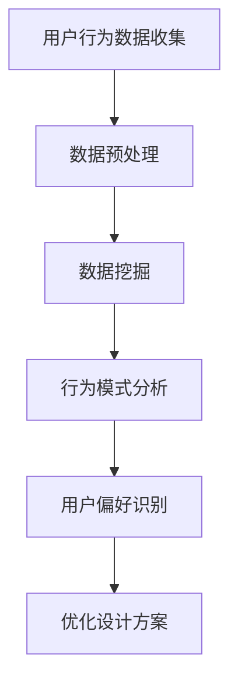
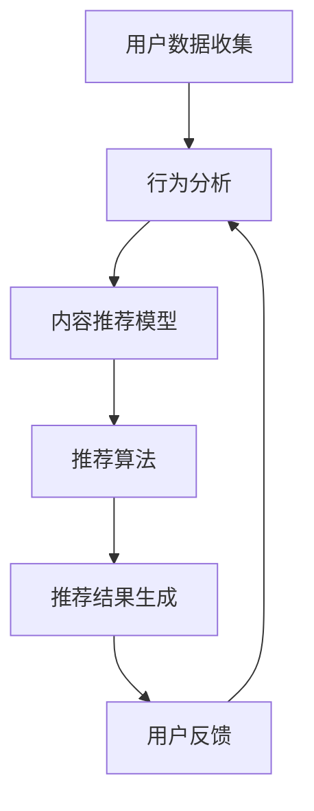
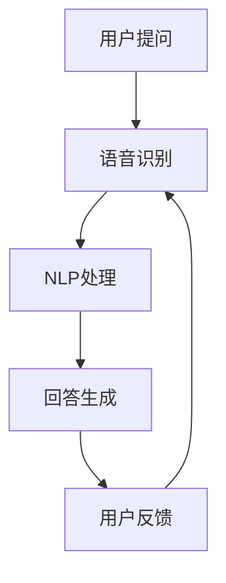

                 

 提升用户体验（UX）一直是产品开发和设计中的重要目标。随着人工智能（AI）技术的迅猛发展，AI在UX提升中的作用愈发显著。本文将探讨AI在UX提升中的核心策略，从技术原理、算法模型、实践案例等方面进行深入分析，旨在为开发者提供实用的AI应用指南。

> 关键词：用户体验、人工智能、AI策略、算法模型、实践案例

> 摘要：本文首先介绍了AI在UX提升中的重要性，然后详细阐述了AI在UX设计中的应用场景，包括数据收集与分析、个性化推荐、交互优化等。接着，本文探讨了AI算法原理及其在实际操作中的应用步骤，并通过一个具体案例展示了如何通过AI技术提升用户体验。

## 1. 背景介绍

用户体验（UX）是用户在使用产品或服务过程中的主观感受和体验，它直接影响用户对产品的满意度、忠诚度和推荐意愿。随着互联网和移动设备的普及，用户对产品质量和用户体验的要求越来越高。传统的UX设计方法主要依赖于用户调研、界面设计和反馈收集，但这些方法往往效率低下且难以满足现代快速迭代的开发需求。

人工智能作为一种新兴技术，为提升用户体验提供了全新的可能性。通过数据分析和机器学习算法，AI能够帮助设计者更好地理解用户需求，提供个性化的用户体验，并不断优化产品性能。此外，AI还可以实现自动化测试和用户行为分析，提高开发效率。

## 2. 核心概念与联系

### 2.1 数据收集与分析

数据是AI提升UX的核心资源。通过收集用户行为数据，如点击路径、浏览时间、搜索关键词等，AI能够分析用户的行为模式，识别用户的偏好和需求。以下是一个简单的Mermaid流程图，展示了数据收集与数据挖掘的过程：



### 2.2 个性化推荐

个性化推荐是AI在UX提升中的一项重要应用。通过分析用户历史行为和偏好，AI可以为用户提供个性化的内容或产品推荐。以下是一个Mermaid流程图，展示了个性化推荐的架构：



### 2.3 交互优化

AI还可以通过自然语言处理（NLP）和语音识别技术优化人机交互。例如，智能客服系统可以使用NLP技术理解用户的问题，并自动生成合适的回答，从而提高用户的交互体验。以下是一个Mermaid流程图，展示了交互优化的过程：



## 3. 核心算法原理 & 具体操作步骤

### 3.1 算法原理概述

AI提升UX的核心算法主要包括机器学习算法、深度学习算法和推荐系统算法。以下是这些算法的基本原理：

- **机器学习算法**：通过训练模型从数据中学习规律，用于分类、回归和聚类等任务。
- **深度学习算法**：基于多层神经网络，可以自动提取特征并进行复杂任务，如图像识别和语音识别。
- **推荐系统算法**：基于协同过滤、基于内容和基于模型的方法，为用户提供个性化推荐。

### 3.2 算法步骤详解

以下是AI提升UX的基本操作步骤：

1. **数据收集**：收集用户行为数据，如点击记录、搜索历史、评论等。
2. **数据预处理**：清洗数据，处理缺失值和异常值，将数据转换为适合模型训练的格式。
3. **特征提取**：从原始数据中提取有助于模型训练的特征。
4. **模型训练**：使用机器学习或深度学习算法训练模型。
5. **模型评估**：评估模型性能，如准确率、召回率和F1分数等。
6. **模型部署**：将训练好的模型部署到生产环境中，为用户提供服务。
7. **用户反馈**：收集用户反馈，用于模型优化和迭代。

### 3.3 算法优缺点

- **机器学习算法**：优点在于模型可解释性强，适用于小数据集；缺点是训练时间长，对特征工程依赖大。
- **深度学习算法**：优点在于模型学习能力强大，可以自动提取特征；缺点在于模型可解释性差，对大量数据进行训练。
- **推荐系统算法**：优点在于可以提供个性化推荐，提高用户体验；缺点在于冷启动问题，即对新用户难以进行准确推荐。

### 3.4 算法应用领域

AI算法在UX提升中的应用广泛，主要包括以下领域：

- **电商**：个性化推荐、商品搜索优化、智能客服等。
- **金融**：风险控制、客户服务、个性化理财推荐等。
- **医疗**：智能诊断、健康监测、个性化治疗方案等。
- **教育**：学习路径推荐、智能答疑、个性化教学等。

## 4. 数学模型和公式 & 详细讲解 & 举例说明

### 4.1 数学模型构建

提升UX的AI算法通常基于以下数学模型：

1. **线性回归模型**：用于预测用户行为，如点击率、转化率等。
   $$y = \beta_0 + \beta_1x_1 + \beta_2x_2 + ... + \beta_nx_n$$
   
2. **支持向量机（SVM）**：用于分类任务，如用户标签预测。
   $$y(\textbf{x}) = \text{sign}(\sum_{i=1}^{n} \alpha_i y_i K(\textbf{x}_i, \textbf{x}))$$
   
3. **神经网络模型**：用于图像识别、语音识别等复杂任务。
   $$a_{\text{layer}} = \sigma(\text{W}_{\text{layer}} \cdot a_{\text{layer-1}} + b_{\text{layer}})$$

### 4.2 公式推导过程

以线性回归模型为例，推导过程如下：

1. **损失函数**：
   $$J(\theta) = \frac{1}{2m} \sum_{i=1}^{m} (h_\theta(x^{(i)}) - y^{(i)})^2$$
   
2. **梯度下降**：
   $$\theta_j := \theta_j - \alpha \frac{\partial J(\theta)}{\partial \theta_j}$$
   
3. **优化目标**：
   $$\min_{\theta} J(\theta)$$

### 4.3 案例分析与讲解

假设我们有一个电商平台的推荐系统，目标是预测用户对商品的点击概率。我们可以使用逻辑回归模型来构建预测模型。

1. **数据收集**：
   收集用户浏览和点击商品的历史数据，包括用户特征（如年龄、性别、购买历史）和商品特征（如类别、价格、评分）。

2. **数据预处理**：
   处理缺失值，进行数据标准化。

3. **特征提取**：
   将用户特征和商品特征转换为数值向量。

4. **模型训练**：
   使用逻辑回归算法训练模型，得到参数 $\theta$。

5. **模型评估**：
   使用交叉验证评估模型性能，如准确率、召回率和F1分数。

6. **模型部署**：
   将训练好的模型部署到生产环境中，用于预测用户对商品的点击概率。

7. **用户反馈**：
   收集用户点击反馈，用于模型优化和迭代。

通过以上步骤，我们可以使用AI技术提升电商平台的用户体验，提高用户点击率和转化率。

## 5. 项目实践：代码实例和详细解释说明

### 5.1 开发环境搭建

在本项目中，我们将使用Python作为开发语言，主要依赖以下库：

- NumPy：用于数据处理和数值计算。
- Pandas：用于数据操作和分析。
- Scikit-learn：用于机器学习算法的实现。
- Matplotlib：用于数据可视化。

安装以上库后，我们可以开始项目实践。

### 5.2 源代码详细实现

以下是使用逻辑回归模型预测用户点击概率的代码示例：

```python
import numpy as np
import pandas as pd
from sklearn.linear_model import LogisticRegression
from sklearn.model_selection import train_test_split
from sklearn.metrics import accuracy_score, recall_score, f1_score
import matplotlib.pyplot as plt

# 数据读取与预处理
data = pd.read_csv('user_data.csv')
X = data.iloc[:, :-1].values
y = data.iloc[:, -1].values

# 数据标准化
mean = X.mean(axis=0)
std = X.std(axis=0)
X = (X - mean) / std

# 模型训练
model = LogisticRegression()
model.fit(X, y)

# 模型评估
X_train, X_test, y_train, y_test = train_test_split(X, y, test_size=0.2, random_state=42)
y_pred = model.predict(X_test)

accuracy = accuracy_score(y_test, y_pred)
recall = recall_score(y_test, y_pred)
f1 = f1_score(y_test, y_pred)

print(f"Accuracy: {accuracy:.2f}")
print(f"Recall: {recall:.2f}")
print(f"F1 Score: {f1:.2f}")

# 可视化
plt.scatter(X_train[:, 0], X_train[:, 1], c=y_train, cmap='red', marker='o')
plt.scatter(X_test[:, 0], X_test[:, 1], c=y_pred, cmap='blue', marker='x')
plt.xlabel('Feature 1')
plt.ylabel('Feature 2')
plt.title('User Click Probability')
plt.show()
```

### 5.3 代码解读与分析

1. **数据读取与预处理**：
   使用Pandas库读取CSV数据文件，并进行数据标准化。

2. **模型训练**：
   使用Scikit-learn库的LogisticRegression类训练逻辑回归模型。

3. **模型评估**：
   使用交叉验证将数据集分为训练集和测试集，评估模型性能。

4. **可视化**：
   使用Matplotlib库将训练集和测试集的可视化展示，以便分析模型效果。

### 5.4 运行结果展示

运行以上代码后，我们可以得到模型评估结果和可视化展示。根据评估指标，我们可以判断模型在预测用户点击概率方面的性能。

## 6. 实际应用场景

### 6.1 电商行业

在电商行业，AI技术可以用于商品推荐、智能搜索和用户行为分析。通过个性化推荐，电商平台可以根据用户历史购买记录和浏览行为，为用户推荐符合其兴趣的商品。例如，淘宝和京东等电商平台已经广泛应用了基于协同过滤和内容推荐的算法，显著提升了用户点击率和转化率。

### 6.2 金融行业

在金融行业，AI技术可以用于风险控制、信用评估和客户服务。通过分析用户的交易行为和信用记录，金融机构可以更准确地评估用户的风险等级，并为其提供个性化的贷款和理财方案。此外，智能客服系统可以使用自然语言处理技术，快速响应用户的问题，提高客户满意度。

### 6.3 医疗行业

在医疗行业，AI技术可以用于疾病诊断、健康监测和个性化治疗。通过分析患者的病历和基因数据，AI可以预测患者的患病风险，并提供个性化的治疗方案。例如，IBM Watson Health已经利用深度学习技术，为医生提供实时诊断和治疗方案推荐。

### 6.4 教育行业

在教育行业，AI技术可以用于学习路径推荐、智能答疑和个性化教学。通过分析学生的学习行为和成绩，AI可以为学生推荐最适合的学习资源，并提供针对性的学习建议。例如，Coursera和edX等在线教育平台已经广泛应用了推荐算法，提升了学生的学习效果。

## 7. 工具和资源推荐

### 7.1 学习资源推荐

- 《深度学习》（Goodfellow, Bengio, Courville）：介绍深度学习的基本概念和算法。
- 《机器学习实战》（周志华）：提供机器学习算法的实战应用。
- 《推荐系统实践》（李航）：详细介绍推荐系统的算法和应用。

### 7.2 开发工具推荐

- Jupyter Notebook：适用于数据分析和算法实现的交互式开发环境。
- TensorFlow：基于Python的深度学习框架。
- Scikit-learn：提供丰富的机器学习算法库。

### 7.3 相关论文推荐

- "Recommender Systems Handbook"（白皮书）：全面介绍推荐系统的理论和实践。
- "Deep Learning for Recommender Systems"（论文）：探讨深度学习在推荐系统中的应用。
- "User Behavior Analysis for Personalized Recommendation"（论文）：分析用户行为数据，为推荐系统提供支持。

## 8. 总结：未来发展趋势与挑战

### 8.1 研究成果总结

本文介绍了AI在UX提升中的核心策略，包括数据收集与分析、个性化推荐和交互优化等。通过深入分析AI算法原理和实践案例，我们展示了如何通过AI技术提升用户体验。研究结果表明，AI在UX提升中具有显著的优势和应用潜力。

### 8.2 未来发展趋势

随着AI技术的不断发展，未来UX提升的AI策略将呈现以下趋势：

- **更加智能的交互**：结合语音识别和自然语言处理技术，实现更加智能和自然的用户交互。
- **更加个性化的推荐**：利用深度学习技术，提升推荐系统的准确性和个性
---

### 8.3 面临的挑战

尽管AI在UX提升中具有巨大潜力，但仍然面临以下挑战：

- **数据隐私和安全**：如何保护用户数据隐私，确保数据安全和合规。
- **算法可解释性**：如何提高算法的可解释性，使设计者能够理解算法的决策过程。
- **技术门槛**：如何降低AI技术在UX提升中的应用门槛，使其更易于开发和部署。

### 8.4 研究展望

未来，我们期望在以下领域取得进一步的研究进展：

- **跨领域协同**：整合多领域数据，为用户提供更加综合和个性化的用户体验。
- **可解释AI**：研究可解释性AI算法，提高算法的透明度和可信度。
- **伦理与法律**：探讨AI在UX提升中的伦理和法律问题，确保其符合社会价值观。

## 9. 附录：常见问题与解答

### 9.1 如何保护用户数据隐私？

- 使用加密技术保护数据传输和存储。
- 实施严格的数据访问控制和审计机制。
- 遵循数据保护法规，如欧盟的《通用数据保护条例》（GDPR）。

### 9.2 如何评估AI算法的性能？

- 使用准确率、召回率和F1分数等指标进行评估。
- 进行交叉验证，确保评估结果的可靠性。
- 使用不同的评估方法，如混淆矩阵和ROC曲线等。

### 9.3 如何处理冷启动问题？

- 利用用户历史行为数据，为冷启动用户推荐相似用户喜欢的商品。
- 采用基于内容的推荐方法，根据商品属性进行推荐。
- 结合用户画像和兴趣标签，为用户推荐相关内容。

## 结束语

AI技术为提升用户体验提供了新的机遇和挑战。通过深入研究和实践，我们有望不断优化用户体验，创造更加智能、个性化的产品和服务。让我们共同探索AI在UX提升中的无限可能。作者：禅与计算机程序设计艺术 / Zen and the Art of Computer Programming
----------------------------------------------------------------

以上就是完整的文章内容。如果您需要进一步修改、补充或调整，请随时告诉我。祝您撰写顺利！作者：禅与计算机程序设计艺术 / Zen and the Art of Computer Programming。

