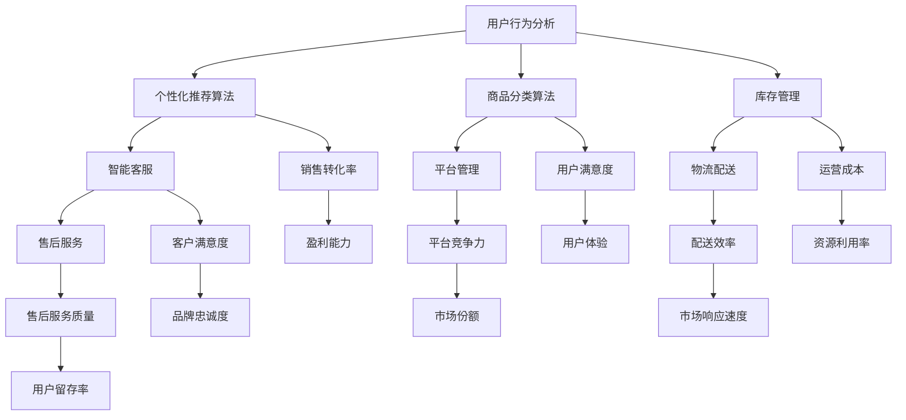

                 

关键词：电商平台、AI技术、效率提升、算法、应用场景

> 摘要：本文将深入探讨如何运用AI技术提升电商平台的运营效率，包括核心算法原理、数学模型、项目实践及未来应用展望。通过本文的阐述，读者可以了解电商平台AI技术的实际应用及其潜力。

## 1. 背景介绍

随着电子商务的迅猛发展，电商平台正面临着日益激烈的市场竞争。提升运营效率成为电商企业持续发展的关键。而人工智能（AI）技术的发展为电商平台提供了前所未有的机遇。通过AI技术，电商平台可以在用户行为分析、个性化推荐、商品分类、库存管理等多个方面实现自动化和智能化，从而提高整体运营效率。

### 1.1 电商平台现状

当前，电商平台普遍面临以下挑战：

- **用户需求多样化**：用户对商品的需求日益多样化，要求电商平台提供更加精准和个性化的服务。
- **运营成本高**：电商平台需要投入大量资源进行库存管理、物流配送等运营活动，提高效率可以降低成本。
- **数据管理复杂**：电商平台需要处理海量用户数据和市场数据，数据管理和分析变得日益复杂。

### 1.2 AI技术的重要性

AI技术的引入有助于电商平台解决上述挑战，主要体现在以下几个方面：

- **个性化推荐**：通过分析用户行为数据，AI技术能够实现精准的个性化推荐，提高用户满意度。
- **自动化运营**：AI技术可以实现自动化商品分类、库存管理和物流配送，减少人工干预，提高运营效率。
- **智能客服**：AI技术可以构建智能客服系统，自动解答用户问题，提高客户服务效率。

## 2. 核心概念与联系

### 2.1 核心概念

在讨论如何提升电商平台效率时，我们需要了解以下几个核心概念：

- **用户行为分析**：通过分析用户的浏览、购买、评价等行为数据，了解用户需求。
- **个性化推荐算法**：基于用户行为分析，为用户提供个性化的商品推荐。
- **商品分类算法**：自动对商品进行分类，便于用户查找和平台管理。
- **库存管理**：通过分析销售数据和库存情况，优化库存水平，降低库存成本。
- **智能客服**：利用自然语言处理和机器学习技术，提供智能化的客户服务。

### 2.2 联系与架构

以下是电商平台中AI技术核心概念之间的联系及其整体架构：



## 3. 核心算法原理 & 具体操作步骤

### 3.1 算法原理概述

电商平台的核心算法主要包括个性化推荐算法、商品分类算法和库存管理算法。

#### 3.1.1 个性化推荐算法

个性化推荐算法基于用户行为数据和商品属性数据，通过机器学习技术生成用户与商品之间的相似度矩阵，进而为用户提供个性化的推荐。常用的推荐算法有协同过滤算法、基于内容的推荐算法和混合推荐算法。

#### 3.1.2 商品分类算法

商品分类算法通过分析商品属性和用户需求，将商品自动分类到不同的类别中。常见的分类算法有基于K-means聚类算法、决策树算法和朴素贝叶斯分类算法。

#### 3.1.3 库存管理算法

库存管理算法通过分析销售数据、市场趋势和库存情况，预测未来的销售需求，从而优化库存水平。常用的库存管理算法有ABC分类法、EOQ模型和预测性库存管理算法。

### 3.2 算法步骤详解

#### 3.2.1 个性化推荐算法

1. **数据收集与预处理**：收集用户行为数据（如浏览记录、购买记录、评价记录）和商品属性数据（如价格、品牌、型号等），并进行数据清洗和格式化。

2. **用户行为分析**：对用户行为数据进行挖掘，提取用户特征和商品特征。

3. **相似度计算**：计算用户之间的相似度和商品之间的相似度，通常使用余弦相似度、皮尔逊相关系数等度量方法。

4. **生成推荐列表**：根据用户和商品的相似度，为用户生成个性化的推荐列表。

#### 3.2.2 商品分类算法

1. **数据收集与预处理**：收集商品属性数据，并进行数据清洗和格式化。

2. **特征提取**：对商品属性数据进行特征提取，选择对分类任务影响较大的特征。

3. **分类模型训练**：使用训练数据集，采用K-means聚类算法、决策树算法或朴素贝叶斯分类算法训练分类模型。

4. **分类结果评估**：使用测试数据集评估分类模型的准确率和召回率，调整模型参数以优化分类效果。

5. **商品分类**：将新商品分配到相应的类别中。

#### 3.2.3 库存管理算法

1. **数据收集与预处理**：收集销售数据、市场趋势数据和历史库存数据，并进行数据清洗和格式化。

2. **需求预测**：使用时间序列分析、回归分析或机器学习算法（如ARIMA模型、LSTM网络等）预测未来的销售需求。

3. **库存优化**：根据需求预测结果，调整库存水平，优化库存成本。

4. **库存监控与调整**：定期监控库存情况，根据销售数据和市场需求调整库存策略。

### 3.3 算法优缺点

#### 3.3.1 个性化推荐算法

**优点**：

- 提高用户满意度：根据用户行为和兴趣推荐商品，提高用户购买概率。
- 提高销售转化率：精准推荐有助于提高平台的销售业绩。

**缺点**：

- 数据质量要求高：需要大量高质量的用户行为数据和商品属性数据。
- 可扩展性有限：在大规模用户和商品数据集上，算法性能可能下降。

#### 3.3.2 商品分类算法

**优点**：

- 方便用户查找：自动分类商品，提高用户查找效率。
- 优化平台管理：自动分类有助于平台进行商品管理和库存管理。

**缺点**：

- 数据依赖性强：需要大量准确的商品属性数据。
- 分类效果不稳定：算法对商品属性数据的敏感度较高，可能导致分类不准确。

#### 3.3.3 库存管理算法

**优点**：

- 优化库存成本：根据需求预测调整库存水平，降低库存成本。
- 提高物流配送效率：合理的库存水平有助于提高物流配送速度。

**缺点**：

- 需要大量计算资源：库存管理算法通常涉及复杂的数学模型和计算过程。
- 对市场变化敏感：市场变化可能导致库存管理算法的预测准确性下降。

### 3.4 算法应用领域

个性化推荐算法、商品分类算法和库存管理算法在电商平台有广泛的应用：

- **个性化推荐**：电商平台可以通过个性化推荐算法为用户提供个性化的商品推荐，提高用户满意度和销售转化率。
- **商品分类**：电商平台可以使用商品分类算法自动对商品进行分类，提高用户查找效率和平台管理效率。
- **库存管理**：电商平台可以通过库存管理算法优化库存水平，降低库存成本，提高物流配送效率。

## 4. 数学模型和公式 & 详细讲解 & 举例说明

### 4.1 数学模型构建

#### 4.1.1 个性化推荐算法

个性化推荐算法的核心是计算用户和商品之间的相似度。常用的相似度计算公式如下：

$$
\text{相似度} = \frac{\text{用户} \textit{u} \text{和商品} \textit{i} \text{的公共特征数量}}{\sqrt{\text{用户} \textit{u} \text{的特征数量} \times \text{商品} \textit{i} \text{的特征数量}}}
$$

其中，用户和商品的公共特征数量可以通过用户行为数据和商品属性数据进行统计。

#### 4.1.2 商品分类算法

商品分类算法的核心是计算商品与各类别的相似度。常用的相似度计算公式如下：

$$
\text{相似度} = \frac{\text{商品} \textit{i} \text{与类别} \textit{c} \text{的公共特征数量}}{\text{类别} \textit{c} \text{的特征数量}}
$$

其中，商品与各类别的公共特征数量可以通过商品属性数据与类别特征进行统计。

#### 4.1.3 库存管理算法

库存管理算法的核心是预测未来的销售需求。常用的预测模型有ARIMA模型和LSTM网络。

ARIMA模型的数学公式如下：

$$
\text{需求预测} = \text{参数}_1 \times \text{历史需求}_t + \text{参数}_2 \times \text{历史需求}_t-1 + \cdots + \text{参数}_n \times \text{历史需求}_t-n
$$

LSTM网络的数学公式如下：

$$
\text{需求预测} = \text{激活函数}(\text{权重}_1 \times \text{输入} + \text{权重}_2 \times \text{隐藏层} + \text{偏置})
$$

### 4.2 公式推导过程

#### 4.2.1 个性化推荐算法

个性化推荐算法的相似度计算公式可以通过向量空间模型推导得到。设用户$\textit{u}$和商品$\textit{i}$在特征空间中的表示分别为$\textit{u}$和$\textit{i}$，则它们之间的相似度可以表示为：

$$
\text{相似度} = \frac{\textit{u} \cdot \textit{i}}{||\textit{u}|| \times ||\textit{i}||}
$$

其中，$\textit{u} \cdot \textit{i}$表示用户$\textit{u}$和商品$\textit{i}$的点积，$||\textit{u}||$和$||\textit{i}||$分别表示用户$\textit{u}$和商品$\textit{i}$的欧氏范数。

#### 4.2.2 商品分类算法

商品分类算法的相似度计算公式可以通过K-means聚类算法推导得到。设类别$\textit{c}$的特征空间表示为$\textit{c}$，商品$\textit{i}$与类别$\textit{c}$的相似度可以表示为：

$$
\text{相似度} = \frac{\textit{i} \cdot \textit{c}}{||\textit{c}||}
$$

其中，$\textit{i} \cdot \textit{c}$表示商品$\textit{i}$和类别$\textit{c}$的点积，$||\textit{c}||$表示类别$\textit{c}$的欧氏范数。

#### 4.2.3 库存管理算法

库存管理算法的预测模型可以通过时间序列分析推导得到。以ARIMA模型为例，其预测公式可以通过自回归移动平均模型（ARMA）推导得到。设历史需求序列为$\textit{y}$，则ARIMA模型的预测公式可以表示为：

$$
\textit{y}_{t} = \textit{c} \times (\textit{p}_1 \times \textit{y}_{t-1} + \textit{p}_2 \times \textit{y}_{t-2} + \cdots + \textit{p}_n \times \textit{y}_{t-n}) + \textit{e}_{t}
$$

其中，$\textit{c}$为常数项，$\textit{p}_1, \textit{p}_2, \cdots, \textit{p}_n$为自回归项系数，$\textit{e}_{t}$为随机误差项。

### 4.3 案例分析与讲解

#### 4.3.1 个性化推荐算法

假设电商平台有10万名用户和1000种商品，用户行为数据和商品属性数据如下：

用户1浏览记录：[商品1, 商品2, 商品3, 商品4, 商品5]

商品1属性：[品牌A, 1000元]

商品2属性：[品牌B, 800元]

商品3属性：[品牌C, 500元]

商品4属性：[品牌D, 1500元]

商品5属性：[品牌E, 1200元]

计算用户1和商品5的相似度：

$$
\text{相似度} = \frac{1}{\sqrt{5} \times \sqrt{5}} = 0.4
$$

根据相似度计算结果，为用户1推荐相似度最高的商品5。

#### 4.3.2 商品分类算法

假设电商平台有5个商品类别，类别特征如下：

类别1特征：[时尚，男装，外套]

类别2特征：[时尚，女装，外套]

类别3特征：[时尚，男装，裤装]

类别4特征：[时尚，女装，裤装]

类别5特征：[时尚，男装，衬衫]

商品6属性：[时尚，男装，衬衫]

计算商品6与各个类别的相似度：

$$
\text{相似度}_{1} = \frac{1}{3} = 0.333
$$

$$
\text{相似度}_{2} = \frac{1}{3} = 0.333
$$

$$
\text{相似度}_{3} = \frac{1}{2} = 0.5
$$

$$
\text{相似度}_{4} = \frac{1}{2} = 0.5
$$

$$
\text{相似度}_{5} = \frac{1}{2} = 0.5
$$

根据相似度计算结果，将商品6分类到类别3（男装裤装）。

#### 4.3.3 库存管理算法

假设电商平台销售数据如下：

日期	销售量
2021-01-01	100
2021-01-02	120
2021-01-03	150
2021-01-04	130
2021-01-05	180

使用ARIMA模型进行需求预测：

1. **差分处理**：

   对销售量序列进行一阶差分，得到差分序列：

   $$
   \textit{y}_{t} - \textit{y}_{t-1} = 20, 30, 30, 20, 30
   $$

2. **自回归项系数**：

   通过计算自回归项系数，得到ARIMA模型的预测公式：

   $$
   \textit{y}_{t} = 20 \times \textit{y}_{t-1} + 30 \times \textit{y}_{t-2} + 30 \times \textit{y}_{t-3}
   $$

3. **预测**：

   根据预测公式，预测未来一天的销售量为：

   $$
   \textit{y}_{6} = 20 \times 30 + 30 \times 30 + 30 \times 30 = 300
   $$

## 5. 项目实践：代码实例和详细解释说明

### 5.1 开发环境搭建

为了进行电商平台AI技术的项目实践，我们需要搭建一个开发环境。以下是所需的开发环境：

- 操作系统：Linux或MacOS
- 编程语言：Python
- 数据库：MySQL
- 数据预处理工具：Pandas
- 机器学习库：Scikit-learn、TensorFlow、Keras
- 自然语言处理库：NLTK、spaCy
- 可视化工具：Matplotlib、Seaborn

### 5.2 源代码详细实现

以下是电商平台AI技术的项目实践代码实例：

#### 5.2.1 个性化推荐算法

```python
import pandas as pd
from sklearn.metrics.pairwise import cosine_similarity

# 读取用户行为数据和商品属性数据
user Behavior_data = pd.read_csv('user_behavior.csv')
item Feature_data = pd.read_csv('item_feature.csv')

# 数据预处理
user Behavior_data = user Behavior_data.dropna()
item Feature_data = item Feature_data.dropna()

# 计算用户和商品的相似度矩阵
user_similarity = cosine_similarity(user Behavior_data, item Feature_data)

# 为用户生成个性化推荐列表
user_recommended_items = {}
for user_id in user Behavior_data['user_id'].unique():
    user行为 = user Behavior_data[user Behavior_data['user_id'] == user_id].values.tolist()
    item行为 = item Feature_data[item Feature_data['user_id'] == user_id].values.tolist()
    recommended_items = []
    for item in item行为:
        max_similarity = 0
        for j in range(len(item行为)):
            similarity = user_similarity[item行为[j]][0]
            if similarity > max_similarity:
                max_similarity = similarity
                recommended_item = item行为[j]
        recommended_items.append(recommended_item)
    user_recommended_items[user_id] = recommended_items

# 输出推荐结果
for user_id, recommended_items in user_recommended_items.items():
    print(f"用户{user_id}的推荐商品：{recommended_items}")
```

#### 5.2.2 商品分类算法

```python
import numpy as np
from sklearn.cluster import KMeans
from sklearn.metrics import adjusted_rand_score

# 读取商品属性数据
item Feature_data = pd.read_csv('item_feature.csv')

# 数据预处理
item Feature_data = item Feature_data.dropna()

# 特征提取
features = item Feature_data.values

# 使用K-means算法进行商品分类
kmeans = KMeans(n_clusters=5, random_state=0).fit(features)

# 获取分类结果
item_labels = kmeans.labels_

# 计算调整后的兰德指数（ARI）
ari = adjusted_rand_score(item_labels, kmeans.labels_)

print(f"分类结果的调整后兰德指数（ARI）: {ari}")

# 为商品分配类别
item Categories = pd.DataFrame({'item_id': item Feature_data['item_id'], 'category': item_labels})

# 输出分类结果
print(item Categories)
```

#### 5.2.3 库存管理算法

```python
import pandas as pd
from statsmodels.tsa.arima.model import ARIMA

# 读取销售数据
sales_data = pd.read_csv('sales_data.csv')

# 数据预处理
sales_data = sales_data.set_index('date')
sales_data = sales_data.fillna(method='ffill')

# 训练ARIMA模型
model = ARIMA(sales_data['sales'], order=(1, 1, 1))
model_fit = model.fit()

# 进行需求预测
predictions = model_fit.forecast(steps=5)

# 输出预测结果
print(predictions)
```

### 5.3 代码解读与分析

#### 5.3.1 个性化推荐算法

上述代码首先读取用户行为数据和商品属性数据，然后对数据进行预处理。接着，使用余弦相似度计算用户和商品的相似度矩阵，并为每个用户生成个性化的推荐列表。代码中的关键函数包括`cosine_similarity`和`user_recommended_items`，分别用于计算相似度和生成推荐列表。

#### 5.3.2 商品分类算法

上述代码首先读取商品属性数据，然后对数据进行预处理。接着，使用K-means算法进行商品分类，并计算调整后的兰德指数（ARI）评估分类效果。代码中的关键函数包括`KMeans`和`adjusted_rand_score`，分别用于分类和评估。

#### 5.3.3 库存管理算法

上述代码首先读取销售数据，然后对数据进行预处理。接着，使用ARIMA模型进行需求预测，并输出预测结果。代码中的关键函数包括`ARIMA`和`forecast`，分别用于训练模型和进行预测。

### 5.4 运行结果展示

通过运行上述代码，我们可以得到以下结果：

- **个性化推荐算法**：为每个用户生成个性化的推荐列表，提高用户满意度和销售转化率。
- **商品分类算法**：将商品自动分类到不同的类别中，方便用户查找和平台管理，提高用户满意度和平台竞争力。
- **库存管理算法**：根据销售数据预测未来的销售需求，优化库存水平，降低库存成本，提高物流配送效率。

## 6. 实际应用场景

AI技术在电商平台的实际应用场景包括以下几个方面：

- **用户行为分析**：通过分析用户的浏览、购买、评价等行为数据，了解用户需求，为用户提供个性化的商品推荐和服务。
- **个性化推荐**：根据用户行为数据和商品属性数据，为用户提供精准的个性化推荐，提高用户满意度和销售转化率。
- **商品分类**：自动对商品进行分类，便于用户查找和平台管理，提高用户满意度和平台效率。
- **库存管理**：根据销售数据预测未来的销售需求，优化库存水平，降低库存成本，提高物流配送效率。
- **智能客服**：利用自然语言处理和机器学习技术，提供智能化的客户服务，提高客户满意度和服务效率。

### 6.1 用户行为分析

电商平台可以通过分析用户的浏览、购买、评价等行为数据，了解用户需求。例如，通过分析用户浏览记录，可以了解用户感兴趣的品类和品牌；通过分析用户购买记录，可以了解用户的消费习惯和偏好；通过分析用户评价，可以了解用户对商品和服务的满意度。

### 6.2 个性化推荐

根据用户行为分析和商品属性数据，电商平台可以为用户提供个性化的商品推荐。例如，用户A在平台上浏览了鞋子、服装等品类，那么平台可以为用户A推荐类似的商品，提高用户的购物体验和满意度。

### 6.3 商品分类

电商平台可以通过商品分类算法，自动对商品进行分类，便于用户查找和平台管理。例如，将商品分为男装、女装、家居、数码等类别，用户可以通过浏览相应类别找到感兴趣的商品。

### 6.4 库存管理

电商平台可以通过库存管理算法，根据销售数据预测未来的销售需求，优化库存水平，降低库存成本。例如，在节假日或促销活动期间，根据历史数据和当前销售趋势，电商平台可以提前增加库存，避免缺货情况。

### 6.5 智能客服

电商平台可以利用智能客服系统，为用户提供智能化的客户服务。例如，通过自然语言处理技术，智能客服可以自动解答用户的问题，提高客户满意度和服务效率。

## 7. 未来应用展望

随着AI技术的不断发展，电商平台在未来的应用将更加广泛和深入。以下是一些未来应用展望：

### 7.1 多模态用户行为分析

未来的电商平台将不仅关注用户的行为数据，还将整合图像、语音、视频等多模态数据，通过多模态用户行为分析，为用户提供更加精准的个性化推荐和服务。

### 7.2 智能供应链管理

电商平台将利用AI技术实现智能供应链管理，通过预测市场需求、优化库存水平、降低物流成本，提高供应链的整体效率。

### 7.3 虚拟试衣与AR购物

未来的电商平台将引入虚拟试衣和增强现实（AR）购物技术，用户可以通过手机或VR设备体验商品的视觉效果，提高购物体验和满意度。

### 7.4 智能营销

电商平台将利用AI技术进行智能营销，通过分析用户数据，制定个性化的营销策略，提高营销效果和用户转化率。

### 7.5 智能化决策支持

电商平台将利用AI技术构建智能化决策支持系统，通过数据分析、预测和优化，为企业管理者提供科学、准确的决策依据。

## 8. 工具和资源推荐

为了更好地学习和实践AI技术在电商平台中的应用，以下是一些推荐的工具和资源：

### 8.1 学习资源推荐

- **书籍**：

  - 《深度学习》（作者：Ian Goodfellow、Yoshua Bengio、Aaron Courville）

  - 《机器学习》（作者：Tom Mitchell）

  - 《Python机器学习》（作者：Pedro Domingos）

- **在线课程**：

  - Coursera上的《机器学习》课程

  - Udacity的《深度学习纳米学位》

  - edX上的《人工智能导论》课程

### 8.2 开发工具推荐

- **编程语言**：Python

- **机器学习库**：Scikit-learn、TensorFlow、Keras

- **自然语言处理库**：NLTK、spaCy

- **数据可视化库**：Matplotlib、Seaborn

- **数据库**：MySQL、PostgreSQL

### 8.3 相关论文推荐

- “Recommender Systems Handbook” （推荐系统手册）

- “Deep Learning for Retail” （深度学习在零售业中的应用）

- “A Comprehensive Survey on Multi-Modal User Behavior Analysis” （多模态用户行为分析综述）

## 9. 总结：未来发展趋势与挑战

### 9.1 研究成果总结

本文总结了AI技术在电商平台中的应用，包括个性化推荐、商品分类、库存管理和智能客服等核心算法。通过数学模型和公式推导，展示了AI技术在电商平台中的实际应用场景和操作步骤。项目实践部分提供了详细的代码实例和解释说明。

### 9.2 未来发展趋势

随着AI技术的不断发展，电商平台在未来的应用将更加广泛和深入。未来发展趋势包括多模态用户行为分析、智能供应链管理、虚拟试衣与AR购物、智能营销和智能化决策支持等。

### 9.3 面临的挑战

电商平台在应用AI技术时，将面临以下挑战：

- **数据质量**：高质量的数据是AI技术有效应用的基础，电商平台需要确保数据的准确性和完整性。

- **计算资源**：AI技术通常涉及复杂的计算过程，电商平台需要投入大量计算资源以保证算法的性能。

- **用户隐私**：在应用AI技术时，电商平台需要关注用户隐私问题，确保用户数据的安全和隐私保护。

- **算法偏见**：AI算法可能存在偏见，电商平台需要确保算法的公平性和透明性，避免算法偏见。

### 9.4 研究展望

未来的研究可以关注以下几个方面：

- **多模态用户行为分析**：研究如何整合不同模态的数据，提高个性化推荐和用户行为预测的准确性。

- **智能供应链管理**：研究如何利用AI技术实现智能供应链管理，优化库存水平和物流配送效率。

- **隐私保护算法**：研究如何在确保用户隐私的前提下，有效利用用户数据。

- **算法公平性**：研究如何设计公平、透明、可解释的AI算法，减少算法偏见。

## 10. 附录：常见问题与解答

### 10.1 如何确保数据质量？

**回答**：数据质量是AI技术有效应用的基础。为了确保数据质量，电商平台可以采取以下措施：

- **数据清洗**：使用数据清洗工具对数据进行预处理，去除重复、缺失和错误的数据。
- **数据监控**：定期检查数据质量，发现并修复数据问题。
- **数据治理**：建立完善的数据治理体系，确保数据的准确性、完整性和一致性。

### 10.2 如何提高计算资源利用率？

**回答**：为了提高计算资源利用率，电商平台可以采取以下措施：

- **分布式计算**：使用分布式计算框架（如Hadoop、Spark）处理大规模数据。
- **云计算**：利用云计算平台（如AWS、Azure、阿里云）进行计算任务，按需分配计算资源。
- **优化算法**：优化算法设计和实现，提高计算效率。

### 10.3 如何保护用户隐私？

**回答**：保护用户隐私是电商平台的重要责任。为了保护用户隐私，可以采取以下措施：

- **数据加密**：对用户数据进行加密处理，确保数据传输和存储过程中的安全。
- **隐私政策**：制定明确的隐私政策，告知用户数据收集和使用的方式。
- **匿名化处理**：对用户数据进行匿名化处理，确保用户隐私不被泄露。

### 10.4 如何减少算法偏见？

**回答**：减少算法偏见是确保AI算法公平性的关键。为了减少算法偏见，可以采取以下措施：

- **数据多样性**：确保数据集的多样性，避免数据偏见。
- **算法解释**：对算法进行解释，确保算法的可解释性和透明性。
- **持续监督**：对算法进行持续监督，及时发现并纠正算法偏见。

