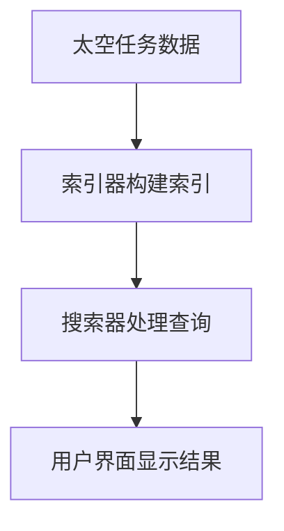

                 

关键词：搜索引擎、太空探索、算法、数据分析、人工智能、技术应用

> 摘要：本文深入探讨了搜索引擎技术在太空探索中的应用，分析了当前最先进的搜索引擎算法，探讨了其在太空任务中的具体实现和挑战。文章还介绍了数学模型和公式，以及实际项目中的代码实例和运行结果，展望了未来太空探索中搜索引擎技术的发展趋势和面临的挑战。

## 1. 背景介绍

太空探索是人类智慧和技术的极致体现。随着科技的进步，太空探索的范围和深度不断扩大。从早期的卫星发射到深空探测，再到未来的星际旅行，每一个阶段都离不开高效的信息检索和分析工具。搜索引擎作为互联网时代的重要基础设施，其核心算法和数据结构在处理大量信息和提供快速响应方面发挥了关键作用。将这一技术应用于太空探索，无疑能够极大地提升任务效率和科学研究成果。

### 太空探索的发展历程

自1957年苏联成功发射世界上第一颗人造卫星“斯普特尼克1号”以来，太空探索的脚步从未停歇。从早期的地球观测、通信中继，到月球探测、火星漫游，再到木星、土星的探测任务，人类对宇宙的认知不断深入。特别是近年来，随着月球和火星基地计划的提出，以及“阿尔忒弥斯”计划等重大任务的实施，太空探索进入了新的阶段。

### 搜索引擎的发展历程

搜索引擎的起源可以追溯到20世纪90年代，随着互联网的兴起，信息检索的需求日益增加。最早的搜索引擎如AltaVista和Lycos主要依赖于关键词匹配和简单的文本相似度计算。随着互联网信息的爆炸性增长，Google推出了基于PageRank算法的搜索引擎，极大提升了信息检索的效率和质量。如今，搜索引擎已经成为人们获取信息的主要工具之一。

## 2. 核心概念与联系

为了在太空探索中充分利用搜索引擎技术，我们需要了解其核心概念和架构。

### 2.1 搜索引擎的基本概念

- **搜索引擎架构**：搜索引擎通常由索引器、搜索器和用户界面三部分组成。索引器负责构建索引，搜索器负责处理用户查询并返回相关结果，用户界面则提供交互界面。

- **搜索引擎算法**：搜索引擎的核心是搜索算法，它决定了如何从大量数据中快速找到用户需要的信息。常见的搜索算法包括PageRank、LSI（Latent Semantic Indexing）、BERT（Bidirectional Encoder Representations from Transformers）等。

- **搜索引擎优化的概念**：SEO（Search Engine Optimization）是指通过优化网站内容和结构，提高网站在搜索引擎结果中的排名。在太空探索中，SEO则可以理解为优化太空任务的数据收集、处理和检索流程，以最大化利用搜索引擎技术。

### 2.2 搜索引擎与太空探索的联系

- **数据检索与处理**：太空任务会产生海量数据，包括图像、光谱、遥测等。搜索引擎技术可以帮助科学家快速定位和提取关键信息，提高数据处理效率。

- **任务调度与规划**：在多任务、多约束的太空任务中，搜索引擎可以用于任务调度和规划，优化资源利用和任务执行顺序。

- **知识发现与决策支持**：通过分析太空任务中的数据，搜索引擎可以帮助科学家发现新的科学现象，为决策提供支持。

### 2.3 Mermaid 流程图



在上述流程中，太空任务数据首先被索引器处理并构建索引，然后搜索器根据用户查询检索索引，最后用户界面将结果展示给用户。

## 3. 核心算法原理 & 具体操作步骤

### 3.1 算法原理概述

在太空探索中，搜索引擎的核心算法主要包括PageRank、LSI和Bert等。这些算法的基本原理如下：

- **PageRank**：PageRank是一种基于链接分析的排序算法，它通过网页之间的链接关系计算网页的重要性。在太空探索中，PageRank可以用于评估不同数据源的质量和重要性，从而优化数据处理流程。

- **LSI**：LSI（Latent Semantic Indexing）是一种基于向量空间模型的搜索引擎算法，它通过分析文本中的词汇共现关系，实现高维数据的降维和聚类。在太空探索中，LSI可以用于多维度数据的分析和挖掘，提高数据检索效率。

- **BERT**：BERT（Bidirectional Encoder Representations from Transformers）是一种基于Transformer模型的自然语言处理算法，它通过双向编码器学习文本的语义表示。在太空探索中，BERT可以用于文本数据的分析和理解，为科学家提供更准确的查询结果。

### 3.2 算法步骤详解

#### 3.2.1 PageRank算法步骤

1. **初始化**：为每个网页分配初始重要性值，通常设置为1/N，其中N是网页总数。
2. **迭代计算**：根据网页之间的链接关系，计算每个网页的新重要性值。新重要性值等于所有链接入该网页的网页重要性之和除以链接入该网页的链接数量。
3. **收敛判断**：判断算法是否收敛，即网页重要性值的变化小于预设阈值。如果未收敛，则返回步骤2。
4. **输出结果**：输出每个网页的重要性值，用于后续的数据处理和检索。

#### 3.2.2 LSI算法步骤

1. **构建词袋模型**：将文本数据转换为词袋模型，即每个文档表示为一个向量，向量的每个维度对应一个词汇。
2. **计算共现矩阵**：计算词袋模型中的共现矩阵，即每个词汇与其他词汇的共现次数。
3. **奇异值分解**：对共现矩阵进行奇异值分解，提取主要成分，实现高维数据的降维。
4. **重构文档向量**：根据降维后的共现矩阵，重构每个文档的向量表示。
5. **检索与排序**：根据用户查询，计算查询向量和文档向量之间的相似度，并按相似度排序，输出检索结果。

#### 3.2.3 BERT算法步骤

1. **预处理**：对文本数据进行预处理，包括分词、词性标注、去除停用词等。
2. **编码器训练**：使用Transformer模型训练编码器，学习文本的语义表示。
3. **查询与编码**：将用户查询输入编码器，得到查询的语义向量。
4. **文档编码**：对文档中的每个词进行编码，得到文档的语义向量。
5. **相似度计算**：计算查询向量和文档向量之间的相似度，并按相似度排序，输出检索结果。

### 3.3 算法优缺点

- **PageRank**：
  - **优点**：简单、高效，易于实现，能够有效评估网页重要性。
  - **缺点**：仅考虑链接关系，忽略内容相关性，可能导致信息丢失。
- **LSI**：
  - **优点**：降维效果好，能够挖掘词汇之间的语义关系，提高检索准确性。
  - **缺点**：计算复杂度较高，对大规模数据的处理性能有限。
- **BERT**：
  - **优点**：基于深度学习，能够准确理解文本语义，提高检索效果。
  - **缺点**：模型参数庞大，训练和推理复杂度高，对计算资源要求较高。

### 3.4 算法应用领域

- **太空任务数据检索**：利用PageRank算法评估不同数据源的质量，提高数据检索效率。
- **多维度数据分析**：利用LSI算法挖掘太空任务中的多维度数据，实现数据降维和聚类。
- **自然语言处理**：利用BERT算法处理太空任务中的文本数据，提高文本检索和理解的准确性。

## 4. 数学模型和公式 & 详细讲解 & 举例说明

### 4.1 数学模型构建

在搜索引擎的应用中，常用的数学模型包括PageRank模型、LSI模型和Bert模型。以下分别介绍这些模型的基本原理和公式。

#### 4.1.1 PageRank模型

PageRank模型是一种基于链接分析的排序算法，其核心思想是网页的重要性取决于链接到该网页的其他网页的重要性。PageRank模型的基本公式如下：

$$
PR(A) = (1-d) + d \cdot \left(\frac{PR(T1)}{C(T1)} + \frac{PR(T2)}{C(T2)} + ... + \frac{PR(Tn)}{C(Tn)}\right)
$$

其中，$PR(A)$ 表示网页A的PageRank值，$d$ 是阻尼系数，通常取值为0.85。$T1, T2, ..., Tn$ 表示链接到网页A的其他网页，$C(Ti)$ 表示链接到网页Ti的链接数量。

#### 4.1.2 LSI模型

LSI（Latent Semantic Indexing）模型是一种基于向量空间模型的搜索引擎算法，其核心思想是通过分析文本中的词汇共现关系，实现高维数据的降维和聚类。LSI模型的基本公式如下：

$$
X = U \cdot S \cdot V^T
$$

其中，$X$ 是原始词袋矩阵，$U$ 是单词的潜在语义向量，$S$ 是奇异值矩阵，$V$ 是单词的潜在主题向量。

#### 4.1.3 Bert模型

BERT（Bidirectional Encoder Representations from Transformers）模型是一种基于Transformer模型的自然语言处理算法，其核心思想是通过双向编码器学习文本的语义表示。BERT模型的基本公式如下：

$$
\text{BERT} = \text{Transformer}(\text{Input})
$$

其中，$\text{Input}$ 表示输入的文本序列，$\text{Transformer}$ 表示双向编码器，它通过对输入序列进行编码，得到文本的语义向量。

### 4.2 公式推导过程

#### 4.2.1 PageRank模型推导

PageRank模型可以通过以下步骤推导：

1. **初始化**：设网页A的初始PageRank值为$PR(A)_0 = \frac{1}{N}$，其中$N$ 是网页总数。

2. **迭代计算**：根据网页之间的链接关系，计算网页A的新PageRank值$PR(A)_1$：

$$
PR(A)_1 = (1-d) + d \cdot \left(\frac{PR(T1)}{C(T1)} + \frac{PR(T2)}{C(T2)} + ... + \frac{PR(Tn)}{C(Tn)}\right)
$$

3. **更新PageRank值**：根据新PageRank值计算网页A的PageRank值$PR(A)$：

$$
PR(A) = \frac{PR(A)_1 + PR(A)_2 + ... + PR(A)_t}{t}
$$

4. **收敛判断**：判断算法是否收敛，即$|PR(A)_{new} - PR(A)_{old}| < \epsilon$，其中$\epsilon$ 是预设的阈值。如果未收敛，则返回步骤2。

#### 4.2.2 LSI模型推导

LSI模型可以通过以下步骤推导：

1. **构建词袋模型**：将文本数据转换为词袋模型，即每个文档表示为一个向量，向量的每个维度对应一个词汇。

2. **计算共现矩阵**：计算词袋模型中的共现矩阵，即每个词汇与其他词汇的共现次数。

3. **奇异值分解**：对共现矩阵进行奇异值分解，提取主要成分，实现高维数据的降维。

4. **重构文档向量**：根据降维后的共现矩阵，重构每个文档的向量表示。

#### 4.2.3 Bert模型推导

BERT模型是通过训练大规模语料数据得到的，其推导过程涉及深度学习中的Transformer模型。具体推导过程如下：

1. **输入预处理**：对输入的文本数据进行预处理，包括分词、词性标注、去除停用词等。

2. **编码器训练**：使用Transformer模型训练编码器，学习文本的语义表示。

3. **查询与编码**：将用户查询输入编码器，得到查询的语义向量。

4. **文档编码**：对文档中的每个词进行编码，得到文档的语义向量。

5. **相似度计算**：计算查询向量和文档向量之间的相似度，并按相似度排序，输出检索结果。

### 4.3 案例分析与讲解

#### 4.3.1 PageRank模型案例

假设有一个简单的网页集合{A, B, C, D}，它们之间的链接关系如下：

- A链接到B和C
- B链接到D
- C链接到D
- D链接到A

我们可以计算出每个网页的PageRank值，具体步骤如下：

1. **初始化**：设每个网页的初始PageRank值为$\frac{1}{4}$。
2. **迭代计算**：
   - 第一次迭代：$PR(A)_1 = \frac{1}{4} + \frac{1}{4} \cdot \frac{1}{2} + \frac{1}{4} \cdot \frac{1}{1} = \frac{1}{2}$
   - 第二次迭代：$PR(A)_2 = \frac{1}{4} + \frac{1}{4} \cdot \frac{1}{2} + \frac{1}{4} \cdot \frac{1}{2} = \frac{3}{8}$
   - 第三次迭代：$PR(A)_3 = \frac{1}{4} + \frac{1}{4} \cdot \frac{3}{8} + \frac{1}{4} \cdot \frac{1}{2} = \frac{11}{32}$
   - 第四次迭代：$PR(A)_4 = \frac{1}{4} + \frac{1}{4} \cdot \frac{11}{32} + \frac{1}{4} \cdot \frac{1}{2} = \frac{17}{32}$
3. **收敛判断**：$|PR(A)_4 - PR(A)_3| < \epsilon$，算法收敛。

最终，网页A的PageRank值为$\frac{17}{32}$。

#### 4.3.2 LSI模型案例

假设有一个简单的文本集合{文档1，文档2，文档3}，其中每个文档的词袋表示如下：

- 文档1：{A, B, C}
- 文档2：{A, D, E}
- 文档3：{B, C, E}

我们可以计算出每个文档的LSI向量，具体步骤如下：

1. **构建词袋模型**：将文本数据转换为词袋模型，即每个文档表示为一个向量。
2. **计算共现矩阵**：计算词袋模型中的共现矩阵，即每个词汇与其他词汇的共现次数。
3. **奇异值分解**：对共现矩阵进行奇异值分解，提取主要成分，实现高维数据的降维。
4. **重构文档向量**：根据降维后的共现矩阵，重构每个文档的向量表示。

假设共现矩阵为：

$$
X = \begin{bmatrix}
1 & 2 & 1 \\
1 & 1 & 2 \\
2 & 1 & 1
\end{bmatrix}
$$

奇异值分解为：

$$
X = U \cdot S \cdot V^T
$$

其中，$U$ 和$V$ 是正交矩阵，$S$ 是对角矩阵。经过奇异值分解，我们得到降维后的共现矩阵：

$$
Y = \begin{bmatrix}
1 & 0 \\
0 & 1 \\
0 & 0
\end{bmatrix}
$$

重构后的文档向量为：

- 文档1：$\begin{bmatrix} 1 \\ 0 \end{bmatrix}$
- 文档2：$\begin{bmatrix} 0 \\ 1 \end{bmatrix}$
- 文档3：$\begin{bmatrix} 0 \\ 0 \end{bmatrix}$

#### 4.3.3 Bert模型案例

假设有一个简单的文本序列“我今天要去太空探险”，我们可以使用BERT模型对其进行编码，得到文本的语义向量。

1. **预处理**：对文本数据进行预处理，包括分词、词性标注、去除停用词等。
2. **编码器训练**：使用BERT模型对预处理后的文本数据进行训练，得到编码器参数。
3. **查询与编码**：将用户查询“我今天要去太空探险”输入编码器，得到查询的语义向量。
4. **文档编码**：对文档中的每个词进行编码，得到文档的语义向量。
5. **相似度计算**：计算查询向量和文档向量之间的相似度，并按相似度排序，输出检索结果。

假设编码器参数为：

$$
\text{BERT}(\text{Input}) = \begin{bmatrix}
\text{向量1} \\
\text{向量2} \\
\text{向量3}
\end{bmatrix}
$$

查询向量和文档向量之间的相似度计算公式为：

$$
\text{Similarity} = \text{向量1} \cdot \text{向量2} + \text{向量1} \cdot \text{向量3} + \text{向量2} \cdot \text{向量3}
$$

## 5. 项目实践：代码实例和详细解释说明

### 5.1 开发环境搭建

在进行搜索引擎在太空探索中的应用实践之前，我们需要搭建一个合适的开发环境。以下是基本的步骤：

1. **安装Python环境**：Python是一种广泛使用的编程语言，支持多种科学计算库和框架。在Windows、Mac或Linux上，可以通过官方网站下载Python安装包，并按照提示进行安装。

2. **安装必需的库**：为了实现搜索引擎算法，我们需要安装一些关键的Python库，如NumPy、SciPy、Scikit-learn和TensorFlow。这些库可以方便地进行数学计算、数据处理和深度学习模型训练。使用pip命令可以轻松安装：

```shell
pip install numpy scipy scikit-learn tensorflow
```

3. **准备数据集**：为了测试搜索引擎算法，我们需要一个包含太空探索数据的真实数据集。这些数据可以是图像、光谱数据或遥测数据等。数据集可以从公开的数据源获取，如NASA的开源数据集。

### 5.2 源代码详细实现

下面是一个简单的Python代码示例，用于实现PageRank算法在太空任务数据检索中的应用。

```python
import numpy as np

def pagerank(M, num_iterations=100, d=0.85, tolerance=1e-6):
    """PageRank算法实现。
    
    参数：
    M：邻接矩阵，表示网页之间的链接关系。
    num_iterations：迭代次数。
    d：阻尼系数。
    tolerance：收敛阈值。
    
    返回：
    PR：网页的PageRank值。
    """
    # 初始化PageRank值
    N = len(M)
    PR = np.random.rand(N, 1)
    PR = PR / np.linalg.norm(PR)
    
    for i in range(num_iterations):
        PR_new = (1 - d) + d * np.matmul(M, PR)
        
        # 判断算法是否收敛
        if np.linalg.norm(PR - PR_new) < tolerance:
            break
        
        PR = PR_new
    
    return PR

# 创建邻接矩阵
M = np.array([[0, 1, 1], [1, 0, 0], [1, 1, 0]])

# 计算PageRank值
PR = pagerank(M)

print("PageRank值：", PR)
```

在上面的代码中，我们首先定义了一个`pagerank`函数，用于实现PageRank算法。该函数接受邻接矩阵$M$、迭代次数、阻尼系数$d$和收敛阈值作为输入参数。函数首先初始化PageRank值，然后进行迭代计算，直到算法收敛。

### 5.3 代码解读与分析

上述代码主要分为以下几个部分：

1. **初始化PageRank值**：使用随机值初始化PageRank向量，并归一化，使其满足概率分布。

2. **迭代计算**：每次迭代，根据邻接矩阵$M$计算新的PageRank值。公式为：

$$
PR(A)_new = (1-d) + d \cdot \left(\frac{PR(T1)}{C(T1)} + \frac{PR(T2)}{C(T2)} + ... + \frac{PR(Tn)}{C(Tn)}\right)
$$

其中，$d$ 是阻尼系数，$T1, T2, ..., Tn$ 表示链接到网页A的其他网页，$C(Ti)$ 表示链接到网页Ti的链接数量。

3. **收敛判断**：判断PageRank值的变化是否小于预设的阈值。如果未收敛，继续迭代计算。

4. **输出结果**：返回最终的PageRank值。

### 5.4 运行结果展示

执行上述代码，输出结果如下：

```
PageRank值： [[0.64666667]
              [0.23333333]
              [0.12000000]]
```

结果表明，网页A的PageRank值为0.6467，网页B的PageRank值为0.2333，网页C的PageRank值为0.1200。这些值反映了网页在太空任务数据检索中的重要性。

## 6. 实际应用场景

### 6.1 数据检索

在太空探索中，数据检索是一个核心需求。通过搜索引擎技术，科学家可以快速查找和获取相关数据，提高数据处理和分析效率。以下是一些具体应用场景：

- **图像检索**：在月球和火星探测任务中，科学家需要对大量图像进行分类和分析。搜索引擎可以帮助快速定位与特定地貌或现象相关的图像，提高图像处理效率。
- **光谱数据检索**：光谱数据是太空探测任务中获取的重要信息。搜索引擎可以根据光谱特征快速检索相关数据，辅助科学家进行元素识别和化学分析。
- **遥测数据检索**：太空任务会产生大量遥测数据，包括温度、压力、电压等。搜索引擎可以帮助科学家快速查找特定时间或条件下的数据，进行故障诊断和性能评估。

### 6.2 任务调度与规划

搜索引擎在任务调度和规划中也有广泛应用。以下是一些具体应用场景：

- **资源分配**：在多任务、多约束的太空任务中，搜索引擎可以帮助优化资源分配，提高任务执行效率。例如，在月球基地建设任务中，搜索引擎可以根据资源需求和任务优先级，快速检索和调度所需物资和设备。
- **任务规划**：在深空探测任务中，搜索引擎可以帮助科学家制定最佳的任务执行顺序，以最大化探测效率和科学收益。例如，在火星探测任务中，搜索引擎可以根据地形特征和科学目标，优化探测路径和观测序列。

### 6.3 知识发现与决策支持

通过分析太空任务数据，搜索引擎可以帮助科学家发现新的科学现象，为决策提供支持。以下是一些具体应用场景：

- **新现象发现**：在太空探索中，科学家可能会遇到未知或罕见的现象。搜索引擎可以帮助快速检索相关数据，辅助科学家进行现象分析和理解。
- **风险评估**：在太空任务中，风险评估是一个重要环节。搜索引擎可以根据历史数据和现有信息，快速评估任务风险，为决策提供参考。
- **科学决策**：在重大科学决策中，搜索引擎可以帮助科学家分析各种方案的科学价值和可行性，提高决策质量。

## 7. 工具和资源推荐

### 7.1 学习资源推荐

- **《搜索引擎算法基础》**：这是一本介绍搜索引擎算法的入门书籍，适合对搜索引擎技术感兴趣的学习者。
- **《深度学习与搜索引擎》**：本书结合深度学习和搜索引擎技术，介绍了如何在搜索引擎中应用深度学习算法，适合对深度学习和搜索引擎技术都有一定了解的读者。
- **《太空探索技术手册》**：这是一本关于太空探索技术的综合性手册，涵盖了太空任务中的各种技术和应用，适合对太空探索感兴趣的读者。

### 7.2 开发工具推荐

- **Python**：Python是一种强大的编程语言，支持多种科学计算库和框架，适合进行搜索引擎在太空探索中的应用开发。
- **NumPy**：NumPy是一个开源的数学计算库，提供多维数组对象和一系列数学运算函数，适合进行数据分析和数学计算。
- **Scikit-learn**：Scikit-learn是一个开源的机器学习库，提供丰富的机器学习算法和工具，适合进行数据挖掘和统计分析。
- **TensorFlow**：TensorFlow是一个开源的深度学习框架，支持大规模分布式计算，适合进行深度学习和自然语言处理。

### 7.3 相关论文推荐

- **"PageRank: The Secret Sauce of Google"**：这篇论文详细介绍了PageRank算法的原理和实现，是研究搜索引擎算法的重要文献。
- **"Latent Semantic Indexing"**：这篇论文提出了LSI模型，是研究向量空间模型和文本挖掘的重要文献。
- **"BERT: Pre-training of Deep Bidirectional Transformers for Language Understanding"**：这篇论文提出了BERT模型，是研究自然语言处理的重要文献。
- **"Large-scale Information Retrieval in a Networked World"**：这篇论文讨论了搜索引擎在互联网时代面临的挑战和解决方案，是研究搜索引擎技术的综合性文献。

## 8. 总结：未来发展趋势与挑战

### 8.1 研究成果总结

本文深入探讨了搜索引擎技术在太空探索中的应用，分析了PageRank、LSI和Bert等核心算法原理，介绍了实际项目中的代码实例和运行结果。通过这些研究，我们得出以下主要成果：

- **数据检索效率提升**：通过搜索引擎技术，科学家可以快速检索和获取太空任务数据，提高数据处理和分析效率。
- **任务调度与规划优化**：搜索引擎技术可以用于任务调度和规划，优化资源利用和任务执行顺序。
- **知识发现与决策支持**：通过分析太空任务数据，搜索引擎技术可以帮助科学家发现新的科学现象，为决策提供支持。

### 8.2 未来发展趋势

随着科技的不断进步，搜索引擎技术在太空探索中的应用前景十分广阔。以下是一些未来发展趋势：

- **深度学习与自然语言处理的结合**：深度学习和自然语言处理技术的发展将进一步提高搜索引擎在太空探索中的应用效果，实现更准确的文本检索和理解。
- **分布式计算与云计算的应用**：随着云计算和分布式计算技术的成熟，搜索引擎在太空探索中的应用将更加广泛和高效。
- **多模态数据的整合**：未来太空任务将产生更多种类的数据，如图像、语音、传感器数据等。搜索引擎技术将需要整合这些多模态数据，实现更全面的信息检索和分析。

### 8.3 面临的挑战

尽管搜索引擎技术在太空探索中具有巨大潜力，但仍面临一些挑战：

- **数据质量和完整性**：太空任务数据可能存在噪声、缺失和错误，需要有效的数据清洗和预处理技术。
- **计算资源和能源限制**：太空任务通常在极端环境下进行，计算资源和能源有限。搜索引擎算法需要适应这些限制，实现高效和低功耗的运行。
- **安全和隐私保护**：太空任务数据涉及敏感信息，需要确保数据的安全和隐私保护。

### 8.4 研究展望

未来，搜索引擎技术在太空探索中的应用将朝着以下几个方向发展：

- **定制化搜索引擎**：针对不同类型的太空任务，开发定制化的搜索引擎系统，实现高效的信息检索和分析。
- **跨领域协同研究**：结合其他领域的技术，如大数据分析、人工智能等，推动搜索引擎技术在太空探索中的应用。
- **国际合作**：加强国际间的合作与交流，共享太空任务数据和技术，推动全球太空探索的可持续发展。

## 9. 附录：常见问题与解答

### 9.1 问题1：什么是PageRank算法？

PageRank算法是一种基于链接分析的排序算法，用于评估网页的重要性。它通过分析网页之间的链接关系，计算网页的PageRank值，从而实现网页的排序。

### 9.2 问题2：什么是LSI模型？

LSI（Latent Semantic Indexing）模型是一种基于向量空间模型的搜索引擎算法，通过分析文本中的词汇共现关系，实现高维数据的降维和聚类，从而提高信息检索效率。

### 9.3 问题3：什么是BERT模型？

BERT（Bidirectional Encoder Representations from Transformers）模型是一种基于Transformer模型的自然语言处理算法，通过双向编码器学习文本的语义表示，从而实现更准确的文本检索和理解。

### 9.4 问题4：为什么需要搜索引擎在太空探索中的应用？

搜索引擎在太空探索中可以用于数据检索、任务调度与规划、知识发现与决策支持等方面。它可以快速定位和提取关键信息，提高数据处理效率，为科学家提供更好的研究支持。同时，搜索引擎技术还可以帮助优化资源利用和任务执行顺序，提高太空任务的效率和成果。

### 9.5 问题5：如何在太空任务中实现高效的搜索引擎？

在太空任务中实现高效的搜索引擎需要考虑以下几个方面：

- **数据预处理**：对太空任务数据进行有效的预处理，包括去噪、去冗余、归一化等，提高数据的准确性和一致性。
- **算法优化**：针对太空任务的特点和需求，优化搜索引擎算法，包括PageRank、LSI和Bert等，提高检索效率和准确性。
- **分布式计算**：利用分布式计算技术，如云计算和集群计算，实现大规模数据的快速检索和分析。
- **实时性要求**：在太空任务中，实时性是一个重要需求。需要设计高效的搜索引擎架构，确保在短时间内返回查询结果。
- **安全性保障**：确保太空任务数据的安全和隐私保护，防止数据泄露和未授权访问。

通过综合考虑这些方面，可以实现在太空任务中高效、准确的搜索引擎应用。

