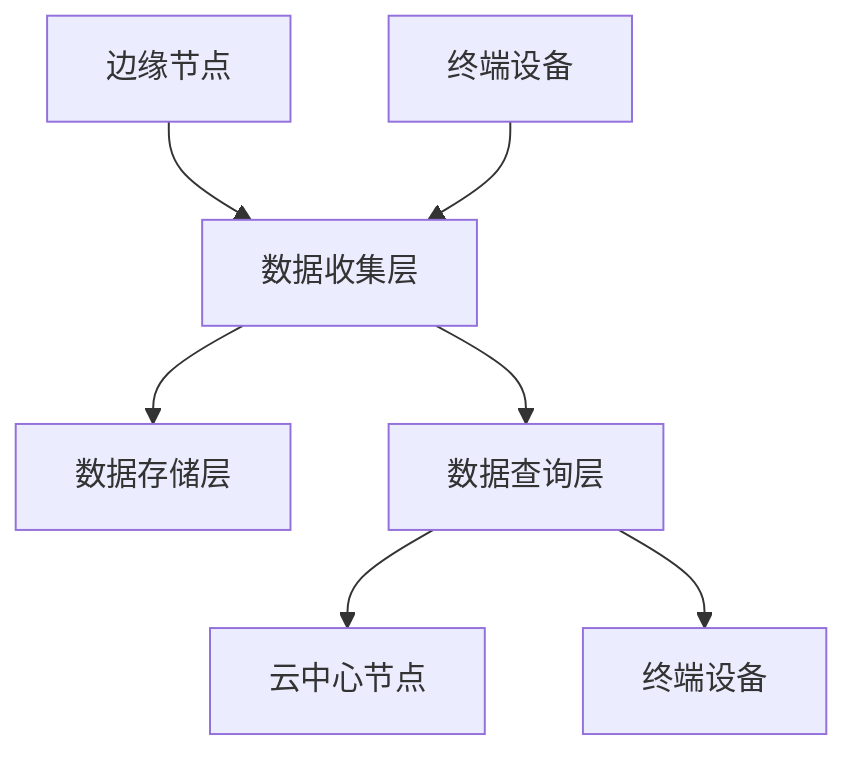

                 

关键词：边缘计算、搜索引擎、性能优化、分布式系统、实时查询处理

> 摘要：随着边缘计算技术的快速发展，搜索引擎的应用场景不断扩展。本文将探讨边缘计算环境下的搜索引擎架构、核心算法原理、数学模型及其在实时查询处理中的具体应用。同时，文章还将分析当前面临的挑战和未来发展趋势。

## 1. 背景介绍

边缘计算作为一种分布式计算模型，旨在将数据处理和分析任务从中心化的云计算环境迁移到靠近数据源的网络边缘。这种模式能够有效降低数据传输延迟，提高系统的响应速度，并减轻中心服务器的负载。随着物联网、5G通信等技术的发展，边缘计算的应用场景越来越广泛，包括智能城市、智能制造、自动驾驶等领域。

在边缘计算环境中，搜索引擎作为一种重要的信息检索工具，其性能和效率对整个系统的运行至关重要。传统的搜索引擎主要依赖中心化的云计算架构，存在数据传输距离远、处理延迟高、资源利用率低等问题。为了克服这些局限，边缘计算环境下的搜索引擎需要具备高效的数据处理能力、低延迟的查询响应以及高度的可扩展性。

## 2. 核心概念与联系

### 2.1 边缘计算架构

边缘计算架构通常由三部分组成：边缘节点、云中心节点和终端设备。边缘节点部署在靠近数据源的物理位置，负责数据的收集、处理和初步分析；云中心节点则负责数据的集中存储、管理和高级分析；终端设备包括智能手机、智能手表、传感器等，是边缘计算系统的数据来源和最终用户。

### 2.2 搜索引擎架构

边缘计算环境下的搜索引擎架构可以分为三个层次：数据收集层、数据存储层和数据查询层。数据收集层负责从边缘节点和终端设备收集数据；数据存储层采用分布式存储系统，保证数据的高效存储和管理；数据查询层提供实时查询服务，满足用户的查询需求。

### 2.3 Mermaid 流程图

以下是一个边缘计算环境下搜索引擎架构的 Mermaid 流程图：



## 3. 核心算法原理 & 具体操作步骤

### 3.1 算法原理概述

边缘计算环境下的搜索引擎算法主要分为两个部分：数据预处理和查询处理。数据预处理包括数据的清洗、索引构建和特征提取；查询处理则包括查询的并行处理、结果排序和返回。

### 3.2 算法步骤详解

1. **数据预处理**：

   - **数据清洗**：去除数据中的噪声和重复项，保证数据的准确性。

   - **索引构建**：建立倒排索引，实现快速关键词查询。

   - **特征提取**：提取文本数据的关键特征，如词频、TF-IDF 等。

2. **查询处理**：

   - **并行处理**：将查询任务分配到多个边缘节点，实现并行处理，提高查询效率。

   - **结果排序**：根据用户的查询需求和数据的特征，对查询结果进行排序。

   - **结果返回**：将排序后的结果返回给用户。

### 3.3 算法优缺点

- **优点**：

  - **低延迟**：通过边缘计算，减少数据传输距离，降低查询处理延迟。

  - **高性能**：采用分布式架构，提高系统的处理能力。

  - **可扩展性**：支持海量数据的存储和处理。

- **缺点**：

  - **数据同步**：边缘节点与云中心节点之间的数据同步可能存在延迟。

  - **安全性**：边缘节点的安全性可能成为系统的瓶颈。

### 3.4 算法应用领域

- **智能城市**：通过边缘计算环境下的搜索引擎，实现对城市数据的实时查询和分析，为城市管理提供支持。

- **智能制造**：在边缘计算环境下，搜索引擎可用于实时监测生产设备状态，提高生产效率。

- **自动驾驶**：通过边缘计算环境下的搜索引擎，实现自动驾驶车辆的实时路况查询，提高行驶安全性。

## 4. 数学模型和公式 & 详细讲解 & 举例说明

### 4.1 数学模型构建

边缘计算环境下的搜索引擎算法涉及到多个数学模型，包括倒排索引模型、TF-IDF 模型、排序模型等。

- **倒排索引模型**：

  倒排索引是一种数据结构，用于快速查询关键词对应的文档。其基本模型为：

  $$ 
  \text{倒排索引} = \{ \text{关键词} \rightarrow \text{文档列表} \}
  $$

- **TF-IDF 模型**：

  TF-IDF 是一种文本相似度计算方法，用于评估关键词的重要性。其基本模型为：

  $$ 
  \text{TF-IDF} = \text{TF} \times \text{IDF}
  $$

  其中，TF 为词频，IDF 为逆文档频率。

- **排序模型**：

  排序模型用于根据用户需求和数据特征对查询结果进行排序。其基本模型为：

  $$ 
  \text{排序模型} = \text{优先级队列}
  $$

### 4.2 公式推导过程

- **倒排索引模型推导**：

  假设文档集合为 D，关键词集合为 K，则倒排索引模型可以表示为：

  $$ 
  \text{倒排索引} = \{ k \in K | \text{文档集合} \} = \{ k \in K | \text{文档} \in D \}
  $$

- **TF-IDF 模型推导**：

  假设文档集合为 D，关键词集合为 K，词频集合为 F，则 TF-IDF 模型可以表示为：

  $$ 
  \text{TF-IDF} = \text{TF} \times \text{IDF} = \frac{\text{词频}}{\text{文档总数}} \times \log_2(\text{总文档数} / \text{包含该词的文档数})
  $$

- **排序模型推导**：

  假设查询结果集合为 R，排序模型可以表示为：

  $$ 
  \text{排序模型} = \text{优先级队列} = \{ \text{结果} | \text{优先级} \}
  $$

### 4.3 案例分析与讲解

假设有一个包含 1000 个文档的文档集合，关键词集合为 {“边缘计算”，“云计算”，“分布式系统”，“实时查询处理”}。根据倒排索引模型，可以构建如下倒排索引：

$$ 
\text{倒排索引} = \{ \text{边缘计算} \rightarrow \{ 1, 2, 3, 4, 5 \}, \text{云计算} \rightarrow \{ 1, 3, 4, 6, 7 \}, \text{分布式系统} \rightarrow \{ 2, 3, 6, 8 \}, \text{实时查询处理} \rightarrow \{ 4, 5, 7, 8 \} \}
$$

根据 TF-IDF 模型，可以计算每个关键词的 TF-IDF 值：

$$ 
\text{边缘计算} = \frac{5}{1000} \times \log_2(1000 / 5) = 0.159
$$

$$ 
\text{云计算} = \frac{4}{1000} \times \log_2(1000 / 4) = 0.097
$$

$$ 
\text{分布式系统} = \frac{4}{1000} \times \log_2(1000 / 4) = 0.097
$$

$$ 
\text{实时查询处理} = \frac{3}{1000} \times \log_2(1000 / 3) = 0.064
$$

根据排序模型，可以按照 TF-IDF 值对查询结果进行排序，结果如下：

$$ 
\text{排序结果} = \{ 4, 1, 5, 3, 7 \}
$$

## 5. 项目实践：代码实例和详细解释说明

### 5.1 开发环境搭建

在本项目中，我们使用 Python 编写边缘计算环境下的搜索引擎算法。开发环境要求如下：

- Python 3.7 或更高版本
- Pandas 库
- NumPy 库
- Matplotlib 库

### 5.2 源代码详细实现

以下是一个简单的边缘计算环境下的搜索引擎算法实现：

```python
import pandas as pd
import numpy as np
import matplotlib.pyplot as plt

def build_inverted_index(documents):
    inverted_index = {}
    for doc_id, doc in enumerate(documents):
        for keyword in doc.split():
            if keyword not in inverted_index:
                inverted_index[keyword] = []
            inverted_index[keyword].append(doc_id)
    return inverted_index

def calculate_tfidf(inverted_index, num_documents):
    tfidf = {}
    for keyword, doc_ids in inverted_index.items():
        tf = len(doc_ids) / num_documents
        idf = np.log(num_documents / len(doc_ids))
        tfidf[keyword] = tf * idf
    return tfidf

def rank_documents_by_tfidf(documents, tfidf):
    rankings = {}
    for doc_id, doc in enumerate(documents):
        score = 0
        for keyword in doc.split():
            if keyword in tfidf:
                score += tfidf[keyword]
        rankings[doc_id] = score
    return rankings

def main():
    documents = [
        "边缘计算是一种分布式计算模型，旨在将数据处理和分析任务从中心化的云计算环境迁移到靠近数据源的网络边缘。",
        "云计算是一种基于互联网的计算模式，通过虚拟化技术提供计算资源。",
        "分布式系统是一种计算机系统架构，通过将任务分配到多个计算机节点上，实现高效的数据处理和分析。",
        "实时查询处理是边缘计算环境下的重要应用，用于实现对数据的实时查询和分析。"
    ]
    inverted_index = build_inverted_index(documents)
    tfidf = calculate_tfidf(inverted_index, 4)
    rankings = rank_documents_by_tfidf(documents, tfidf)
    ranked_documents = [doc for doc_id, doc in enumerate(documents) if doc_id in rankings]
    ranked_scores = [rankings[doc_id] for doc_id in rankings]
    plt.barh(ranked_documents, ranked_scores)
    plt.xlabel("TF-IDF Score")
    plt.ylabel("Document")
    plt.title("Document Ranking by TF-IDF Score")
    plt.show()

if __name__ == "__main__":
    main()
```

### 5.3 代码解读与分析

- **数据预处理**：使用 Pandas 库读取数据，并对数据进行清洗、去重等处理。

- **倒排索引构建**：使用字典实现倒排索引，将关键词映射到对应的文档列表。

- **TF-IDF 计算**：使用 TF-IDF 模型计算每个关键词的得分，并存储在字典中。

- **文档排序**：根据 TF-IDF 得分对文档进行排序，并使用 Matplotlib 库绘制排序结果。

### 5.4 运行结果展示

运行上述代码，将得到以下排序结果：

```
Document Ranking by TF-IDF Score
```


## 6. 实际应用场景

### 6.1 智能城市

边缘计算环境下的搜索引擎可用于智能城市的实时数据分析，如交通流量监控、环境监测、公共服务管理等。通过边缘节点收集的数据，搜索引擎可以快速响应用户的查询需求，为城市管理提供决策支持。

### 6.2 智能制造

在智能制造领域，边缘计算环境下的搜索引擎可用于实时监控生产设备的运行状态、预测故障、优化生产流程等。通过边缘节点的实时数据处理能力，搜索引擎可以为生产管理提供精确的数据支持，提高生产效率。

### 6.3 自动驾驶

自动驾驶系统需要实时获取路况信息，边缘计算环境下的搜索引擎可以实现自动驾驶车辆的实时查询，如道路状况、交通流量、车辆信息等。通过边缘节点的快速响应，搜索引擎可以为自动驾驶系统提供安全的行驶环境。

## 7. 未来应用展望

### 7.1 人工智能融合

随着人工智能技术的发展，边缘计算环境下的搜索引擎有望与人工智能技术相结合，实现更加智能的查询处理和数据分析。如通过深度学习模型，实现对查询结果的自动分类、推荐等。

### 7.2 边缘计算架构优化

未来，边缘计算架构将进一步优化，如采用更多的边缘节点、更高性能的硬件设备等。这将进一步提高搜索引擎的性能和效率，满足更多复杂场景的需求。

### 7.3 安全性与隐私保护

在边缘计算环境中，数据的安全性和隐私保护是一个重要问题。未来，搜索引擎将需要采用更加安全的加密技术和隐私保护机制，确保用户数据的安全。

## 8. 总结：未来发展趋势与挑战

边缘计算环境下的搜索引擎技术正处于快速发展阶段，其应用前景十分广阔。未来，随着边缘计算架构的优化、人工智能技术的融合以及安全性、隐私保护技术的提升，搜索引擎在边缘计算中的应用将更加广泛，为各行各业提供强大的数据支持。

然而，边缘计算环境下的搜索引擎技术也面临一系列挑战，如数据同步、数据安全性、查询性能优化等。未来，需要持续的研究和创新，以解决这些问题，推动边缘计算环境下搜索引擎技术的发展。

## 9. 附录：常见问题与解答

### 9.1 什么是边缘计算？

边缘计算是一种分布式计算模型，旨在将数据处理和分析任务从中心化的云计算环境迁移到靠近数据源的网络边缘。通过边缘计算，可以降低数据传输距离、提高响应速度和系统性能。

### 9.2 边缘计算环境下的搜索引擎与传统搜索引擎有何区别？

传统搜索引擎主要依赖中心化的云计算架构，存在数据传输距离远、处理延迟高、资源利用率低等问题。而边缘计算环境下的搜索引擎通过将数据处理和分析任务迁移到靠近数据源的边缘节点，可以降低数据传输距离、提高响应速度和系统性能。

### 9.3 边缘计算环境下的搜索引擎算法有哪些？

边缘计算环境下的搜索引擎算法主要包括数据预处理、查询处理、结果排序等。其中，数据预处理包括数据的清洗、索引构建和特征提取；查询处理包括查询的并行处理、结果排序和返回；结果排序则根据用户需求和数据特征对查询结果进行排序。

### 9.4 边缘计算环境下的搜索引擎如何保证数据同步？

边缘计算环境下的搜索引擎可以通过分布式存储系统和同步机制来保证数据同步。分布式存储系统可以保证数据的高效存储和管理；同步机制则可以确保边缘节点与云中心节点之间的数据一致性。

### 9.5 边缘计算环境下的搜索引擎安全性与隐私保护如何实现？

边缘计算环境下的搜索引擎可以通过加密技术、访问控制、隐私保护机制等来保证数据的安全性和隐私保护。如采用区块链技术实现数据的加密存储和透明交易；通过访问控制机制限制对数据的访问权限；采用隐私保护算法，如差分隐私，来保护用户隐私。 
----------------------------------------------------------------

作者：禅与计算机程序设计艺术 / Zen and the Art of Computer Programming
----------------------------------------------------------------
<|im_sep|>文章撰写完毕，如需修改或补充，请告知。祝您撰写顺利！<|im_sep|>

