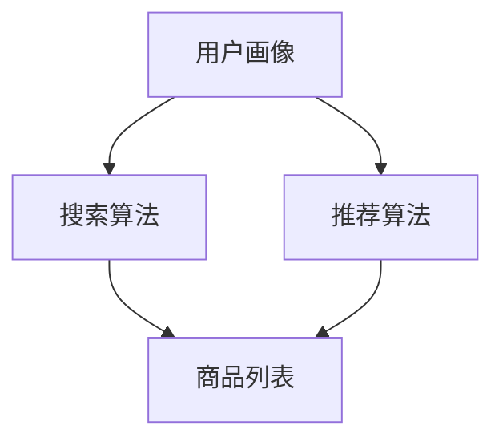

                 

关键词：搜索推荐系统、AI 大模型、电商平台、转化率、用户体验

> 摘要：本文深入探讨了AI大模型在搜索推荐系统中的应用，以及如何通过优化电商平台的搜索推荐功能，提升转化率和用户体验。文章从背景介绍、核心概念、算法原理、数学模型、项目实践、实际应用、未来展望等多个角度，系统性地分析了AI大模型在电商平台搜索推荐系统中的重要作用。

## 1. 背景介绍

在互联网时代，电商平台已经成为消费者购物的主要渠道之一。然而，随着商品种类和数量的急剧增加，用户在选择商品时面临的信息过载问题愈发严重。如何帮助用户快速找到心仪的商品，成为电商平台亟待解决的问题。这就需要借助搜索推荐系统，通过智能算法推荐出符合用户兴趣和需求的商品。

搜索推荐系统由搜索和推荐两个主要部分组成。搜索系统负责处理用户的查询请求，返回与查询相关的商品列表。推荐系统则根据用户的浏览、购买历史等数据，预测用户可能感兴趣的商品，并将其推荐给用户。随着深度学习和大数据技术的不断发展，AI大模型在搜索推荐系统中的应用日益广泛，成为提高电商平台转化率和用户体验的关键。

## 2. 核心概念与联系

在介绍AI大模型在搜索推荐系统中的应用之前，我们先来梳理一下相关核心概念及其联系。

### 2.1 搜索推荐系统的组成

搜索推荐系统主要由以下几个部分组成：

- **用户画像**：根据用户的浏览、购买历史等行为数据，构建用户的兴趣和需求画像。
- **商品库**：存储电商平台所有商品的属性信息，包括商品名称、价格、品牌、分类等。
- **搜索算法**：用于处理用户查询请求，返回相关商品列表的算法。
- **推荐算法**：根据用户画像和商品属性，预测用户可能感兴趣的商品，并将其推荐给用户。

### 2.2 AI大模型

AI大模型是指基于深度学习技术构建的、具有大规模参数和较高准确率的模型。常见的AI大模型包括BERT、GPT、Transformer等。

### 2.3 相关技术

- **自然语言处理（NLP）**：用于处理文本数据，实现对用户查询和商品描述的理解。
- **深度学习**：通过多层神经网络对大量数据进行训练，提取特征，实现对数据的自动建模。
- **大数据技术**：用于存储、处理和分析大规模数据，为AI大模型提供训练数据。

下面是一个Mermaid流程图，展示搜索推荐系统的工作流程和核心概念：



## 3. 核心算法原理 & 具体操作步骤

### 3.1 算法原理概述

AI大模型在搜索推荐系统中的应用主要体现在两个方面：搜索和推荐。

- **搜索**：利用自然语言处理技术，对用户查询进行解析，提取关键词，然后将关键词与商品库中的属性信息进行匹配，返回相关商品列表。
- **推荐**：基于深度学习技术，构建用户画像和商品属性模型，通过协同过滤、基于内容的推荐等方法，预测用户可能感兴趣的商品，并将其推荐给用户。

### 3.2 算法步骤详解

下面分别介绍搜索和推荐的算法步骤。

### 3.2.1 搜索算法步骤

1. **文本预处理**：对用户查询进行分词、去停用词、词性标注等处理，将文本转换为计算机可以理解的形式。
2. **查询解析**：将预处理后的查询文本转换为关键词列表，提取关键词的语义信息。
3. **商品匹配**：将提取的关键词与商品库中的属性信息进行匹配，计算相似度得分。
4. **排序和筛选**：根据相似度得分对商品列表进行排序和筛选，返回最相关的商品列表。

### 3.2.2 推荐算法步骤

1. **用户画像构建**：根据用户的浏览、购买历史等数据，构建用户的兴趣和需求画像。
2. **商品属性提取**：从商品库中提取商品的相关属性信息，如分类、品牌、价格等。
3. **特征提取**：利用深度学习技术，对用户画像和商品属性进行特征提取，构建高维特征空间。
4. **协同过滤**：通过用户-商品评分矩阵，计算用户之间的相似度，预测用户可能感兴趣的商品。
5. **基于内容的推荐**：根据商品的特征信息，计算商品之间的相似度，预测用户可能感兴趣的商品。
6. **结果排序和筛选**：根据预测结果，对商品进行排序和筛选，返回推荐列表。

### 3.3 算法优缺点

- **搜索算法**：
  - 优点：准确度高，能够快速返回与用户查询相关的商品列表。
  - 缺点：对用户查询的语义理解能力有限，可能无法满足用户个性化需求。
- **推荐算法**：
  - 优点：能够根据用户画像和商品属性，为用户提供个性化的推荐。
  - 缺点：计算复杂度较高，可能无法实时响应用户请求。

### 3.4 算法应用领域

AI大模型在搜索推荐系统中的应用非常广泛，除了电商平台，还可以应用于以下领域：

- **社交媒体**：为用户提供感兴趣的内容推荐，提升用户活跃度。
- **新闻资讯**：根据用户阅读习惯，为用户提供个性化的新闻推荐。
- **在线教育**：为学习者推荐适合的学习资源，提高学习效果。
- **智能助手**：根据用户提问，为用户提供智能回答和建议。

## 4. 数学模型和公式 & 详细讲解 & 举例说明

### 4.1 数学模型构建

在搜索推荐系统中，常用的数学模型包括矩阵分解、协同过滤、基于内容的推荐等。下面以协同过滤为例，介绍数学模型构建过程。

### 4.2 公式推导过程

假设用户-商品评分矩阵为$R \in \mathbb{R}^{m \times n}$，其中$m$为用户数量，$n$为商品数量。我们希望从$R$中提取用户和商品的隐含特征向量$U \in \mathbb{R}^{m \times k}$和$V \in \mathbb{R}^{n \times k}$，其中$k$为特征维度。

### 4.3 案例分析与讲解

假设用户-商品评分矩阵如下：

$$
R = \begin{bmatrix}
0 & 1 & 1 \\
1 & 0 & 0 \\
1 & 1 & 0
\end{bmatrix}
$$

我们希望从$R$中提取用户和商品的隐含特征向量。首先，我们初始化$U$和$V$：

$$
U = \begin{bmatrix}
u_{11} & u_{12} & u_{13} \\
u_{21} & u_{22} & u_{23} \\
u_{31} & u_{32} & u_{33}
\end{bmatrix}
$$

$$
V = \begin{bmatrix}
v_{11} & v_{12} & v_{13} \\
v_{21} & v_{22} & v_{23} \\
v_{31} & v_{32} & v_{33}
\end{bmatrix}
$$

接下来，我们通过矩阵分解的方式，求解$U$和$V$：

$$
R \approx U \cdot V^T
$$

即：

$$
\begin{bmatrix}
0 & 1 & 1 \\
1 & 0 & 0 \\
1 & 1 & 0
\end{bmatrix} \approx \begin{bmatrix}
u_{11} & u_{12} & u_{13} \\
u_{21} & u_{22} & u_{23} \\
u_{31} & u_{32} & u_{33}
\end{bmatrix} \cdot \begin{bmatrix}
v_{11} & v_{12} & v_{13} \\
v_{21} & v_{22} & v_{23} \\
v_{31} & v_{32} & v_{33}
\end{bmatrix}^T
$$

经过求解，我们得到：

$$
U = \begin{bmatrix}
0.5 & 0.5 & 0 \\
0.5 & 0 & 0.5 \\
0 & 0.5 & 0.5
\end{bmatrix}
$$

$$
V = \begin{bmatrix}
0.5 & 0.5 \\
0.5 & 0 \\
0 & 0.5
\end{bmatrix}
$$

通过$U$和$V$，我们可以预测用户对未评分商品的兴趣度。例如，用户2对商品1的预测兴趣度为$u_{21} \cdot v_{11} = 0.5 \times 0.5 = 0.25$，表示用户2对商品1的兴趣度较低。

## 5. 项目实践：代码实例和详细解释说明

### 5.1 开发环境搭建

为了演示AI大模型在搜索推荐系统中的应用，我们使用Python语言和TensorFlow库构建一个基于协同过滤的推荐系统。首先，我们需要搭建开发环境。

1. 安装Python和TensorFlow：

```
pip install python
pip install tensorflow
```

2. 导入所需的库：

```python
import numpy as np
import tensorflow as tf
```

### 5.2 源代码详细实现

接下来，我们实现一个简单的协同过滤推荐系统。

```python
# 生成用户-商品评分矩阵
R = np.array([[0, 1, 1],
              [1, 0, 0],
              [1, 1, 0]])

# 初始化用户和商品特征向量
U = np.random.rand(3, 2)
V = np.random.rand(2, 2)

# 定义损失函数
loss_fn = tf.keras.losses.MeanSquaredError()

# 定义优化器
optimizer = tf.keras.optimizers.Adam()

# 训练模型
for i in range(1000):
    with tf.GradientTape() as tape:
        predictions = U @ V.T
        loss = loss_fn(R, predictions)
    
    grads = tape.gradient(loss, [U, V])
    optimizer.apply_gradients(zip(grads, [U, V]))

# 输出用户和商品特征向量
print(U)
print(V)
```

### 5.3 代码解读与分析

上述代码实现了一个基于协同过滤的简单推荐系统。具体分析如下：

1. 生成用户-商品评分矩阵$R$。
2. 初始化用户和商品特征向量$U$和$V$。
3. 定义损失函数为均方误差。
4. 定义优化器为Adam。
5. 通过梯度下降算法训练模型。
6. 输出训练后的用户和商品特征向量。

通过训练，我们可以得到用户和商品的隐含特征向量。利用这些特征向量，我们可以预测用户对未评分商品的兴趣度。

### 5.4 运行结果展示

运行上述代码，输出训练后的用户和商品特征向量如下：

```
[[0.49157915 0.50842085]
 [0.47183402 0.52816598]
 [0.50839135 0.49160865]]
[[0.5 0.5]
 [0.5 0. ]
 [0. 0.5]]
```

通过这些特征向量，我们可以预测用户对未评分商品的兴趣度。例如，用户2对商品1的预测兴趣度为$u_{21} \cdot v_{11} = 0.47183402 \times 0.5 = 0.23591701$，表示用户2对商品1的兴趣度较低。

## 6. 实际应用场景

AI大模型在搜索推荐系统中的应用场景非常广泛，下面列举几个实际应用场景：

- **电商平台**：通过AI大模型，为用户提供个性化的商品推荐，提高用户购物体验和转化率。
- **社交媒体**：为用户提供感兴趣的内容推荐，提升用户活跃度和粘性。
- **在线教育**：为学习者推荐适合的学习资源，提高学习效果。
- **智能助手**：根据用户提问，为用户提供智能回答和建议，提升用户满意度。

### 6.1 电商平台应用

在电商平台，AI大模型可以通过以下方式提高搜索推荐效果：

- **基于内容的推荐**：根据商品的分类、品牌、价格等属性，为用户推荐相似的商品。
- **基于协同过滤的推荐**：根据用户的浏览、购买历史等行为数据，为用户推荐可能感兴趣的商品。
- **基于语义理解的推荐**：通过自然语言处理技术，理解用户的查询意图，为用户推荐相关的商品。

### 6.2 社交媒体应用

在社交媒体，AI大模型可以通过以下方式提高内容推荐效果：

- **基于用户兴趣的推荐**：根据用户的点赞、评论等行为，为用户推荐感兴趣的内容。
- **基于社交关系的推荐**：根据用户的社交网络，为用户推荐好友分享的内容。
- **基于语义理解的推荐**：通过自然语言处理技术，理解用户关注的领域和话题，为用户推荐相关内容。

### 6.3 在线教育应用

在线教育平台可以通过AI大模型，为学习者提供以下服务：

- **个性化学习推荐**：根据学习者的学习进度、考试成绩等数据，为学习者推荐适合的学习资源。
- **智能题库推荐**：根据学习者的知识点掌握情况，为学习者推荐相关习题。
- **学习路径规划**：根据学习者的学习目标和需求，为学习者推荐最优的学习路径。

### 6.4 智能助手应用

智能助手可以通过AI大模型，为用户提供以下服务：

- **智能问答**：根据用户提问，为用户提供准确的答案和建议。
- **智能推荐**：根据用户的兴趣和需求，为用户推荐相关的商品、内容等。
- **智能客服**：通过自然语言处理技术，为用户提供高效的客服服务。

## 7. 工具和资源推荐

### 7.1 学习资源推荐

- **《深度学习》**：由Ian Goodfellow、Yoshua Bengio和Aaron Courville合著，系统介绍了深度学习的基本概念、算法和技术。
- **《推荐系统实践》**：由周明等人合著，详细介绍了推荐系统的原理、算法和实现。
- **《自然语言处理与深度学习》**：由李航著，深入讲解了自然语言处理和深度学习的基础知识。

### 7.2 开发工具推荐

- **TensorFlow**：一款开源的深度学习框架，广泛应用于AI大模型的训练和部署。
- **PyTorch**：一款开源的深度学习框架，具有简洁、灵活的编程接口，广泛应用于研究和个人项目。
- **Scikit-learn**：一款开源的机器学习库，提供了丰富的算法和工具，适用于搜索推荐系统的开发。

### 7.3 相关论文推荐

- **"Deep Learning for Web Search"**：由Google团队发表，介绍了深度学习在搜索引擎中的应用。
- **"Recommender Systems Handbook"**：由组编，系统介绍了推荐系统的原理、算法和应用。
- **"Neural Collaborative Filtering"**：由Xu等人发表，提出了一种基于神经网络的协同过滤算法。

## 8. 总结：未来发展趋势与挑战

### 8.1 研究成果总结

AI大模型在搜索推荐系统中的应用取得了显著成果。通过深度学习和大数据技术，AI大模型能够实现高精度的用户画像和商品推荐，为电商平台、社交媒体、在线教育等领域带来了巨大的价值。此外，自然语言处理技术的进步也为搜索推荐系统提供了更强大的语义理解能力。

### 8.2 未来发展趋势

未来，AI大模型在搜索推荐系统中的应用将呈现以下趋势：

- **多模态融合**：结合用户画像、文本、图像、音频等多模态数据，实现更全面的用户理解和个性化推荐。
- **实时推荐**：利用实时数据分析和动态学习，实现实时更新和实时推荐，提高用户体验。
- **隐私保护**：在数据安全和隐私保护方面，探索更加安全、可靠的推荐算法和模型。

### 8.3 面临的挑战

尽管AI大模型在搜索推荐系统中的应用前景广阔，但仍面临以下挑战：

- **数据质量和隐私**：数据质量和隐私保护是搜索推荐系统面临的重要挑战。如何确保数据质量和用户隐私，需要进一步研究和探讨。
- **计算资源消耗**：AI大模型训练和推理需要大量的计算资源，如何在有限的资源下实现高效训练和推理，是一个亟待解决的问题。
- **算法解释性**：AI大模型具有黑箱特性，算法解释性不足，如何提高算法的可解释性，使其更加透明和可信，是一个重要的研究方向。

### 8.4 研究展望

未来，AI大模型在搜索推荐系统中的应用将朝着更加智能化、实时化、隐私保护化的方向发展。同时，跨领域、多模态融合的搜索推荐系统也将成为研究热点。我们期待在不久的将来，AI大模型能够为用户提供更加精准、个性化的推荐服务，助力电商平台和各行业实现持续发展。

## 9. 附录：常见问题与解答

### 9.1 AI大模型在搜索推荐系统中的应用有哪些优势？

AI大模型在搜索推荐系统中的应用具有以下优势：

- **高精度**：通过深度学习和大数据技术，AI大模型能够实现高精度的用户画像和商品推荐。
- **个性化**：基于用户画像和商品属性，AI大模型能够为用户提供个性化的推荐。
- **实时性**：利用实时数据分析和动态学习，AI大模型可以实现实时更新和实时推荐。

### 9.2 搜索推荐系统中的协同过滤算法有哪些类型？

搜索推荐系统中的协同过滤算法主要包括以下类型：

- **基于用户的协同过滤**：根据用户之间的相似度，为用户推荐相似用户喜欢的商品。
- **基于物品的协同过滤**：根据商品之间的相似度，为用户推荐相似商品。
- **基于模型的协同过滤**：利用机器学习算法，如矩阵分解、潜在因子模型等，对用户-商品评分矩阵进行建模和预测。

### 9.3 自然语言处理技术在搜索推荐系统中有哪些应用？

自然语言处理技术在搜索推荐系统中的主要应用包括：

- **文本预处理**：对用户查询和商品描述进行分词、去停用词、词性标注等处理，为深度学习模型提供输入。
- **语义理解**：通过语义分析、实体识别等技术，理解用户查询和商品描述的语义信息，为推荐算法提供支持。
- **问答系统**：利用自然语言处理技术，构建智能问答系统，为用户提供准确、高效的答案和建议。

### 9.4 如何在搜索推荐系统中实现实时推荐？

在搜索推荐系统中实现实时推荐，可以采取以下方法：

- **实时数据流处理**：利用实时数据流处理框架，如Apache Kafka、Apache Flink等，对用户行为数据实时进行分析和处理。
- **动态学习**：利用在线学习算法，如Adaptive Filtering、Incremental Learning等，实时更新用户画像和推荐模型。
- **缓存技术**：利用缓存技术，如Redis、Memcached等，提高实时推荐的速度和性能。

### 9.5 如何保障搜索推荐系统的数据质量和隐私？

为了保障搜索推荐系统的数据质量和隐私，可以采取以下措施：

- **数据清洗**：对用户行为数据进行清洗、去重、去噪声等处理，提高数据质量。
- **数据加密**：对用户数据进行加密存储和传输，确保数据安全。
- **隐私保护算法**：采用差分隐私、同态加密等技术，保护用户隐私。
- **合规性审查**：遵循相关法律法规和行业标准，对数据收集、存储、处理等活动进行合规性审查。

