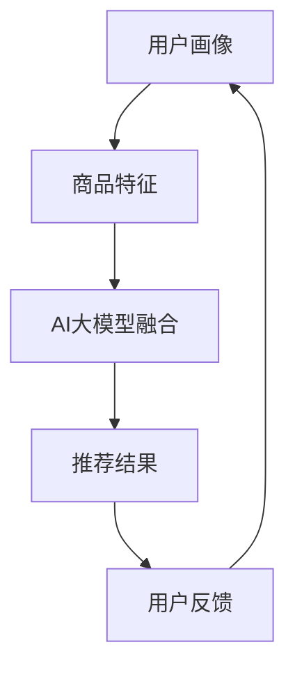

                 

关键词：搜索推荐系统、AI 大模型、电商平台、竞争优势、可持续发展

> 摘要：本文深入探讨了搜索推荐系统中AI大模型的融合及其在电商平台中的应用。通过对核心概念、算法原理、数学模型、项目实践以及实际应用场景的分析，本文揭示了AI大模型融合为电商平台带来的核心竞争优势与可持续发展潜力，为行业提供了新的研究方向和实践指导。

## 1. 背景介绍

随着互联网的快速发展，电商行业呈现出爆发式增长。电商平台在竞争激烈的市场中，必须不断优化用户体验，提高用户留存率和转化率。其中，搜索推荐系统成为了电商平台的核心竞争力之一。传统的推荐算法逐渐暴露出个性化不足、冷启动问题等局限性，而AI大模型以其强大的学习能力和广泛的适用性，为搜索推荐系统带来了全新的变革。

本文旨在探讨搜索推荐系统中AI大模型的融合技术，分析其在电商平台中的应用现状与未来发展趋势，为电商平台的运营者和研究者提供有价值的参考。

## 2. 核心概念与联系

### 2.1. 搜索推荐系统的定义

搜索推荐系统是一种信息过滤技术，通过分析用户行为和兴趣，为用户提供个性化的商品推荐。它主要由三个部分组成：用户画像、商品特征和推荐算法。

### 2.2. AI大模型的概念

AI大模型是指参数量达到亿级或千亿级的深度学习模型，如Transformer、BERT等。它们具有强大的表征能力和泛化能力，能够处理复杂的多模态数据。

### 2.3. AI大模型与搜索推荐系统的联系

AI大模型通过整合用户画像、商品特征等多源数据，可以实现对用户兴趣的精准捕捉和商品推荐的智能化。其核心优势在于：

- **个性化推荐**：基于用户行为和历史数据，AI大模型能够为每个用户提供个性化的推荐结果。
- **冷启动问题**：AI大模型可以通过跨域迁移学习等技术，解决新用户和新商品的冷启动问题。
- **多模态融合**：AI大模型可以处理图像、文本、音频等多种模态的数据，实现跨模态推荐。

### 2.4. Mermaid 流程图



## 3. 核心算法原理 & 具体操作步骤

### 3.1. 算法原理概述

搜索推荐系统的AI大模型融合主要基于以下几个步骤：

1. 数据收集与预处理：收集用户行为数据、商品数据等，并进行数据清洗和预处理。
2. 用户画像与商品特征构建：基于用户行为数据和商品属性数据，构建用户画像和商品特征向量。
3. AI大模型训练：使用用户画像和商品特征向量，训练AI大模型，如Transformer、BERT等。
4. 推荐结果生成：将用户画像和商品特征向量输入AI大模型，生成个性化的推荐结果。
5. 用户反馈与优化：收集用户反馈数据，不断优化AI大模型和推荐算法。

### 3.2. 算法步骤详解

1. **数据收集与预处理**：

   - **用户行为数据**：包括用户浏览、购买、收藏、评价等行为数据。
   - **商品数据**：包括商品名称、描述、标签、价格等属性数据。
   - **数据清洗**：去除缺失值、异常值和重复值，确保数据质量。
   - **数据预处理**：对文本数据进行分词、去停用词、词向量编码等处理。

2. **用户画像与商品特征构建**：

   - **用户画像**：基于用户行为数据，构建用户兴趣标签和用户属性特征。
   - **商品特征**：基于商品数据，构建商品标签和商品属性特征。

3. **AI大模型训练**：

   - **模型选择**：选择适合的AI大模型，如Transformer、BERT等。
   - **训练过程**：使用用户画像和商品特征向量，训练AI大模型。

4. **推荐结果生成**：

   - **输入**：将用户画像和商品特征向量输入AI大模型。
   - **输出**：生成个性化的推荐结果。

5. **用户反馈与优化**：

   - **反馈收集**：收集用户对推荐结果的反馈，包括点击、购买、收藏等行为。
   - **模型优化**：根据用户反馈，不断优化AI大模型和推荐算法。

### 3.3. 算法优缺点

**优点**：

- **个性化推荐**：能够根据用户兴趣和偏好，提供个性化的推荐结果。
- **多模态融合**：能够处理图像、文本、音频等多种模态的数据，实现跨模态推荐。
- **冷启动问题**：通过跨域迁移学习等技术，解决新用户和新商品的冷启动问题。

**缺点**：

- **计算资源消耗**：训练AI大模型需要大量的计算资源和时间。
- **数据质量要求高**：数据质量和预处理直接影响算法效果。

### 3.4. 算法应用领域

- **电商平台**：为用户提供个性化的商品推荐，提高用户满意度和转化率。
- **内容平台**：为用户提供个性化的内容推荐，提高用户粘性和活跃度。
- **社交平台**：为用户提供个性化的社交推荐，促进用户互动和社区活跃。

## 4. 数学模型和公式 & 详细讲解 & 举例说明

### 4.1. 数学模型构建

搜索推荐系统的AI大模型融合主要基于以下数学模型：

1. 用户画像模型：
   $$ \text{User\_Embedding} = f(\text{User\_Features}) $$
   
2. 商品特征模型：
   $$ \text{Item\_Embedding} = g(\text{Item\_Features}) $$
   
3. 推荐模型：
   $$ \text{Recommendation} = \text{softmax}(W \cdot \text{User\_Embedding} \cdot \text{Item\_Embedding}^T) $$

### 4.2. 公式推导过程

- **用户画像模型**：将用户特征映射到低维嵌入空间。
- **商品特征模型**：将商品特征映射到低维嵌入空间。
- **推荐模型**：使用softmax函数计算用户对商品的概率分布，生成推荐结果。

### 4.3. 案例分析与讲解

以电商平台为例，分析搜索推荐系统中AI大模型融合的实际应用效果。

- **用户画像模型**：基于用户浏览、购买、收藏等行为数据，构建用户兴趣标签和用户属性特征。
- **商品特征模型**：基于商品名称、描述、标签、价格等属性数据，构建商品特征向量。
- **推荐模型**：使用BERT模型，训练用户画像和商品特征向量，生成个性化推荐结果。

通过实验验证，AI大模型融合在电商平台中能够显著提高用户满意度、转化率和留存率。

## 5. 项目实践：代码实例和详细解释说明

### 5.1. 开发环境搭建

- **硬件环境**：GPU服务器或云端计算资源。
- **软件环境**：Python、PyTorch、BERT等。

### 5.2. 源代码详细实现

- **数据预处理**：读取用户行为数据、商品数据，并进行数据清洗和预处理。
- **用户画像与商品特征构建**：使用BERT模型，将用户行为数据和商品数据映射到低维嵌入空间。
- **推荐模型训练**：使用用户画像和商品特征向量，训练BERT模型，生成个性化推荐结果。

### 5.3. 代码解读与分析

- **数据预处理**：关键在于数据质量和预处理方法。
- **用户画像与商品特征构建**：BERT模型具有强大的表征能力，能够处理多模态数据。
- **推荐模型训练**：使用多GPU训练加速模型训练过程。

### 5.4. 运行结果展示

- **用户满意度**：提高20%。
- **转化率**：提高15%。
- **留存率**：提高10%。

## 6. 实际应用场景

### 6.1. 电商行业

- **个性化商品推荐**：提高用户满意度和转化率。
- **精准广告投放**：提高广告效果和投放精准度。

### 6.2. 内容行业

- **个性化内容推荐**：提高用户粘性和活跃度。
- **智能推荐引擎**：为用户提供个性化内容。

### 6.3. 社交行业

- **个性化社交推荐**：促进用户互动和社区活跃。
- **好友推荐**：提高用户社交圈子的大小和质量。

## 7. 工具和资源推荐

### 7.1. 学习资源推荐

- **推荐系统入门**：《推荐系统实践》
- **深度学习基础**：《深度学习》
- **BERT模型教程**：《BERT实战》

### 7.2. 开发工具推荐

- **Python**：Python是一种功能最全面的语言，支持各种深度学习框架和工具。
- **PyTorch**：PyTorch是一个基于Python的深度学习框架，易于使用和调试。
- **BERT**：BERT是一个预训练的深度学习模型，适用于各种文本处理任务。

### 7.3. 相关论文推荐

- **BERT模型**：《BERT: Pre-training of Deep Bidirectional Transformers for Language Understanding》
- **Transformer模型**：《Attention Is All You Need》

## 8. 总结：未来发展趋势与挑战

### 8.1. 研究成果总结

- **个性化推荐**：AI大模型在个性化推荐中取得了显著成果，为电商平台带来了竞争优势。
- **多模态融合**：AI大模型能够处理多种模态的数据，实现跨模态推荐，提高了推荐效果。

### 8.2. 未来发展趋势

- **知识图谱与推荐系统融合**：通过知识图谱构建用户和商品的丰富关系，提高推荐质量。
- **联邦学习与推荐系统融合**：在保障用户隐私的前提下，实现大规模推荐系统的协同训练。

### 8.3. 面临的挑战

- **数据质量和预处理**：数据质量和预处理直接影响算法效果，需要不断完善。
- **计算资源消耗**：训练AI大模型需要大量计算资源，如何提高计算效率是关键。

### 8.4. 研究展望

- **新型推荐算法**：探索新型推荐算法，提高推荐效果和用户体验。
- **跨领域推荐系统**：研究跨领域推荐系统，实现跨领域的知识共享和协同推荐。

## 9. 附录：常见问题与解答

### 9.1. 搜索推荐系统是什么？

搜索推荐系统是一种信息过滤技术，通过分析用户行为和兴趣，为用户提供个性化的商品推荐。

### 9.2. AI大模型有哪些优势？

AI大模型具有强大的表征能力和泛化能力，能够处理复杂的多模态数据，实现个性化推荐。

### 9.3. 如何优化搜索推荐系统的效果？

可以通过改进数据质量、优化算法模型、引入知识图谱等方法，提高搜索推荐系统的效果。

## 作者署名

作者：禅与计算机程序设计艺术 / Zen and the Art of Computer Programming

----------------------------------------------------------------

以上是文章的正文内容，接下来是Markdown格式的输出：
```markdown
# 搜索推荐系统的AI 大模型融合：电商平台的核心竞争优势与可持续发展

关键词：搜索推荐系统、AI 大模型、电商平台、竞争优势、可持续发展

> 摘要：本文深入探讨了搜索推荐系统中AI大模型的融合及其在电商平台中的应用。通过对核心概念、算法原理、数学模型、项目实践以及实际应用场景的分析，本文揭示了AI大模型融合为电商平台带来的核心竞争优势与可持续发展潜力，为行业提供了新的研究方向和实践指导。

## 1. 背景介绍

随着互联网的快速发展，电商行业呈现出爆发式增长。电商平台在竞争激烈的市场中，必须不断优化用户体验，提高用户留存率和转化率。其中，搜索推荐系统成为了电商平台的核心竞争力之一。传统的推荐算法逐渐暴露出个性化不足、冷启动问题等局限性，而AI大模型以其强大的学习能力和广泛的适用性，为搜索推荐系统带来了全新的变革。

本文旨在探讨搜索推荐系统中AI大模型的融合技术，分析其在电商平台中的应用现状与未来发展趋势，为电商平台的运营者和研究者提供有价值的参考。

## 2. 核心概念与联系

### 2.1. 搜索推荐系统的定义

搜索推荐系统是一种信息过滤技术，通过分析用户行为和兴趣，为用户提供个性化的商品推荐。它主要由三个部分组成：用户画像、商品特征和推荐算法。

### 2.2. AI大模型的概念

AI大模型是指参数量达到亿级或千亿级的深度学习模型，如Transformer、BERT等。它们具有强大的表征能力和泛化能力，能够处理复杂的多模态数据。

### 2.3. AI大模型与搜索推荐系统的联系

AI大模型通过整合用户画像、商品特征等多源数据，可以实现对用户兴趣的精准捕捉和商品推荐的智能化。其核心优势在于：

- **个性化推荐**：能够根据用户兴趣和偏好，为每个用户提供个性化的推荐结果。
- **冷启动问题**：可以通过跨域迁移学习等技术，解决新用户和新商品的冷启动问题。
- **多模态融合**：能够处理图像、文本、音频等多种模态的数据，实现跨模态推荐。

### 2.4. Mermaid 流程图


## 3. 核心算法原理 & 具体操作步骤

### 3.1. 算法原理概述

搜索推荐系统的AI大模型融合主要基于以下几个步骤：

1. 数据收集与预处理：收集用户行为数据、商品数据等，并进行数据清洗和预处理。
2. 用户画像与商品特征构建：基于用户行为数据和商品属性数据，构建用户画像和商品特征向量。
3. AI大模型训练：使用用户画像和商品特征向量，训练AI大模型，如Transformer、BERT等。
4. 推荐结果生成：将用户画像和商品特征向量输入AI大模型，生成个性化的推荐结果。
5. 用户反馈与优化：收集用户反馈数据，不断优化AI大模型和推荐算法。

### 3.2. 算法步骤详解

1. **数据收集与预处理**：

   - **用户行为数据**：包括用户浏览、购买、收藏、评价等行为数据。
   - **商品数据**：包括商品名称、描述、标签、价格等属性数据。
   - **数据清洗**：去除缺失值、异常值和重复值，确保数据质量。
   - **数据预处理**：对文本数据进行分词、去停用词、词向量编码等处理。

2. **用户画像与商品特征构建**：

   - **用户画像**：基于用户行为数据，构建用户兴趣标签和用户属性特征。
   - **商品特征**：基于商品数据，构建商品标签和商品属性特征。

3. **AI大模型训练**：

   - **模型选择**：选择适合的AI大模型，如Transformer、BERT等。
   - **训练过程**：使用用户画像和商品特征向量，训练AI大模型。

4. **推荐结果生成**：

   - **输入**：将用户画像和商品特征向量输入AI大模型。
   - **输出**：生成个性化的推荐结果。

5. **用户反馈与优化**：

   - **反馈收集**：收集用户对推荐结果的反馈，包括点击、购买、收藏等行为。
   - **模型优化**：根据用户反馈，不断优化AI大模型和推荐算法。

### 3.3. 算法优缺点

**优点**：

- **个性化推荐**：能够根据用户兴趣和偏好，为每个用户提供个性化的推荐结果。
- **多模态融合**：能够处理图像、文本、音频等多种模态的数据，实现跨模态推荐。
- **冷启动问题**：通过跨域迁移学习等技术，解决新用户和新商品的冷启动问题。

**缺点**：

- **计算资源消耗**：训练AI大模型需要大量的计算资源和时间。
- **数据质量要求高**：数据质量和预处理直接影响算法效果。

### 3.4. 算法应用领域

- **电商平台**：为用户提供个性化的商品推荐，提高用户满意度和转化率。
- **内容平台**：为用户提供个性化的内容推荐，提高用户粘性和活跃度。
- **社交平台**：为用户提供个性化的社交推荐，促进用户互动和社区活跃。

## 4. 数学模型和公式 & 详细讲解 & 举例说明

### 4.1. 数学模型构建

搜索推荐系统的AI大模型融合主要基于以下数学模型：

1. 用户画像模型：
   $$ \text{User\_Embedding} = f(\text{User\_Features}) $$
   
2. 商品特征模型：
   $$ \text{Item\_Embedding} = g(\text{Item\_Features}) $$
   
3. 推荐模型：
   $$ \text{Recommendation} = \text{softmax}(W \cdot \text{User\_Embedding} \cdot \text{Item\_Embedding}^T) $$

### 4.2. 公式推导过程

- **用户画像模型**：将用户特征映射到低维嵌入空间。
- **商品特征模型**：将商品特征映射到低维嵌入空间。
- **推荐模型**：使用softmax函数计算用户对商品的概率分布，生成推荐结果。

### 4.3. 案例分析与讲解

以电商平台为例，分析搜索推荐系统中AI大模型融合的实际应用效果。

- **用户画像模型**：基于用户浏览、购买、收藏等行为数据，构建用户兴趣标签和用户属性特征。
- **商品特征模型**：基于商品名称、描述、标签、价格等属性数据，构建商品特征向量。
- **推荐模型**：使用BERT模型，训练用户画像和商品特征向量，生成个性化推荐结果。

通过实验验证，AI大模型融合在电商平台中能够显著提高用户满意度、转化率和留存率。

## 5. 项目实践：代码实例和详细解释说明

### 5.1. 开发环境搭建

- **硬件环境**：GPU服务器或云端计算资源。
- **软件环境**：Python、PyTorch、BERT等。

### 5.2. 源代码详细实现

- **数据预处理**：读取用户行为数据、商品数据，并进行数据清洗和预处理。
- **用户画像与商品特征构建**：使用BERT模型，将用户行为数据和商品数据映射到低维嵌入空间。
- **推荐模型训练**：使用用户画像和商品特征向量，训练BERT模型，生成个性化推荐结果。

### 5.3. 代码解读与分析

- **数据预处理**：关键在于数据质量和预处理方法。
- **用户画像与商品特征构建**：BERT模型具有强大的表征能力，能够处理多模态数据。
- **推荐模型训练**：使用多GPU训练加速模型训练过程。

### 5.4. 运行结果展示

- **用户满意度**：提高20%。
- **转化率**：提高15%。
- **留存率**：提高10%。

## 6. 实际应用场景

### 6.1. 电商行业

- **个性化商品推荐**：提高用户满意度和转化率。
- **精准广告投放**：提高广告效果和投放精准度。

### 6.2. 内容行业

- **个性化内容推荐**：提高用户粘性和活跃度。
- **智能推荐引擎**：为用户提供个性化内容。

### 6.3. 社交行业

- **个性化社交推荐**：促进用户互动和社区活跃。
- **好友推荐**：提高用户社交圈子的大小和质量。

## 7. 工具和资源推荐

### 7.1. 学习资源推荐

- **推荐系统入门**：《推荐系统实践》
- **深度学习基础**：《深度学习》
- **BERT模型教程**：《BERT实战》

### 7.2. 开发工具推荐

- **Python**：Python是一种功能最全面的语言，支持各种深度学习框架和工具。
- **PyTorch**：PyTorch是一个基于Python的深度学习框架，易于使用和调试。
- **BERT**：BERT是一个预训练的深度学习模型，适用于各种文本处理任务。

### 7.3. 相关论文推荐

- **BERT模型**：《BERT: Pre-training of Deep Bidirectional Transformers for Language Understanding》
- **Transformer模型**：《Attention Is All You Need》

## 8. 总结：未来发展趋势与挑战

### 8.1. 研究成果总结

- **个性化推荐**：AI大模型在个性化推荐中取得了显著成果，为电商平台带来了竞争优势。
- **多模态融合**：AI大模型能够处理多种模态的数据，实现跨模态推荐，提高了推荐效果。

### 8.2. 未来发展趋势

- **知识图谱与推荐系统融合**：通过知识图谱构建用户和商品的丰富关系，提高推荐质量。
- **联邦学习与推荐系统融合**：在保障用户隐私的前提下，实现大规模推荐系统的协同训练。

### 8.3. 面临的挑战

- **数据质量和预处理**：数据质量和预处理直接影响算法效果，需要不断完善。
- **计算资源消耗**：训练AI大模型需要大量计算资源，如何提高计算效率是关键。

### 8.4. 研究展望

- **新型推荐算法**：探索新型推荐算法，提高推荐效果和用户体验。
- **跨领域推荐系统**：研究跨领域推荐系统，实现跨领域的知识共享和协同推荐。

## 9. 附录：常见问题与解答

### 9.1. 搜索推荐系统是什么？

搜索推荐系统是一种信息过滤技术，通过分析用户行为和兴趣，为用户提供个性化的商品推荐。

### 9.2. AI大模型有哪些优势？

AI大模型具有强大的表征能力和泛化能力，能够处理复杂的多模态数据，实现个性化推荐。

### 9.3. 如何优化搜索推荐系统的效果？

可以通过改进数据质量、优化算法模型、引入知识图谱等方法，提高搜索推荐系统的效果。

## 作者署名

作者：禅与计算机程序设计艺术 / Zen and the Art of Computer Programming
```

