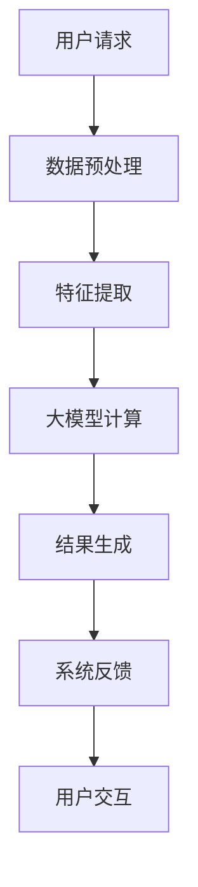

                 

 关键词：搜索推荐系统，实时性能优化，大模型方案，性能优化，搜索推荐算法，分布式系统，AI技术，大数据处理，内存管理，并发处理，负载均衡，缓存策略，异构计算。

> 摘要：本文深入探讨了搜索推荐系统在实时性能优化方面所面临的挑战，并提出了一种基于大模型方案的优化策略。通过对核心算法原理的详细剖析，数学模型的构建，以及项目实践中的代码实例，本文为相关领域的研究人员和开发者提供了实用的技术指南。

## 1. 背景介绍

随着互联网和大数据技术的发展，搜索推荐系统已经成为现代信息检索和个性化服务的重要手段。这些系统通过对用户行为数据和内容数据的深度分析，提供个性化的搜索结果和推荐内容，极大地提升了用户体验和平台黏性。

然而，随着数据量的爆炸式增长和用户需求的多样化，搜索推荐系统的实时性能优化成为一个亟待解决的问题。实时性能优化不仅关乎系统的响应速度，更关乎用户体验和业务价值。传统的优化方法，如算法优化、数据结构优化、系统架构优化等，已经难以满足日益增长的需求。

为了解决这些问题，本文提出了一种基于大模型方案的实时性能优化策略。通过引入大模型，我们可以实现高效的计算和存储，同时优化系统的并发处理能力和负载均衡，从而显著提升搜索推荐系统的实时性能。

## 2. 核心概念与联系

### 2.1. 大模型方案

大模型方案是指利用大规模神经网络模型来处理搜索推荐任务的方法。这些模型通常具有数十亿到千亿个参数，可以通过对海量数据进行训练，实现高精度的特征提取和预测。

### 2.2. 实时性能优化

实时性能优化是指通过一系列技术手段，如算法优化、数据结构优化、系统架构优化等，提高系统的实时处理能力和响应速度。

### 2.3. 关联分析

关联分析是指通过分析用户行为数据和内容数据之间的关联性，提取出有价值的信息，用于搜索结果和推荐内容的生成。

### 2.4. Mermaid 流程图



## 3. 核心算法原理 & 具体操作步骤

### 3.1. 算法原理概述

大模型方案的核心在于利用深度学习算法进行特征提取和预测。通过多层神经网络结构，模型可以自动学习到用户行为和内容数据中的复杂关系，从而生成高精度的搜索结果和推荐内容。

### 3.2. 算法步骤详解

1. **数据预处理**：对用户行为数据和内容数据进行清洗、归一化和特征提取，为深度学习模型提供高质量的数据输入。

2. **特征提取**：利用深度学习算法，从预处理后的数据中提取出高维的特征向量。

3. **大模型计算**：通过多层神经网络结构，对特征向量进行计算，得到搜索结果和推荐内容。

4. **结果生成**：根据大模型计算结果，生成个性化的搜索结果和推荐内容。

5. **系统反馈**：将用户对搜索结果和推荐内容的反馈数据收集起来，用于模型训练和优化。

6. **用户交互**：将生成的搜索结果和推荐内容展示给用户，并收集用户反馈，形成闭环。

### 3.3. 算法优缺点

**优点**：

- 高效的特征提取和预测能力
- 强大的关联分析能力
- 适应性强，能够处理多样化的数据类型

**缺点**：

- 计算资源消耗大，训练时间长
- 对数据质量和预处理要求高
- 可能会出现过拟合问题

### 3.4. 算法应用领域

大模型方案在搜索推荐系统中有着广泛的应用，如电商平台的商品推荐、社交媒体的社交推荐、新闻平台的个性化推荐等。同时，该方案也可以应用于金融、医疗、教育等多个领域。

## 4. 数学模型和公式 & 详细讲解 & 举例说明

### 4.1. 数学模型构建

大模型方案的数学模型主要由两部分组成：特征提取模型和预测模型。

1. **特征提取模型**：

   特征提取模型通常采用卷积神经网络（CNN）或循环神经网络（RNN）结构，用于从原始数据中提取出高维的特征向量。

   $$ f(x) = \sigma(W_f \cdot x + b_f) $$

   其中，$x$为输入数据，$W_f$为权重矩阵，$b_f$为偏置项，$\sigma$为激活函数。

2. **预测模型**：

   预测模型通常采用全连接神经网络（FCNN）结构，用于对提取出的特征向量进行预测。

   $$ y = \sigma(W_y \cdot f(x) + b_y) $$

   其中，$f(x)$为特征提取模型输出，$W_y$为权重矩阵，$b_y$为偏置项，$\sigma$为激活函数。

### 4.2. 公式推导过程

1. **特征提取模型推导**：

   设输入数据$x \in \mathbb{R}^{d_x}$，经过卷积层和池化层处理后，得到特征向量$f(x) \in \mathbb{R}^{d_f}$。

   $$ f(x) = \sigma(W_f \cdot \text{Pooling}(\text{Conv}(\cdot))) $$

   其中，$W_f \in \mathbb{R}^{d_f \times d_x}$为卷积层权重矩阵，$\text{Pooling}$为池化操作，$\text{Conv}$为卷积操作。

2. **预测模型推导**：

   设特征向量$f(x) \in \mathbb{R}^{d_f}$，经过全连接层处理后，得到预测结果$y \in \mathbb{R}^{d_y}$。

   $$ y = \sigma(W_y \cdot f(x) + b_y) $$

   其中，$W_y \in \mathbb{R}^{d_y \times d_f}$为全连接层权重矩阵，$b_y$为偏置项，$\sigma$为激活函数。

### 4.3. 案例分析与讲解

假设我们有一个电商平台，需要对用户进行商品推荐。我们可以将用户的行为数据（如浏览记录、购买记录等）和商品数据（如商品类别、价格等）作为输入，利用大模型方案进行特征提取和预测。

1. **特征提取**：

   首先对用户行为数据和商品数据进行预处理，提取出高维的特征向量。

   $$ f(x) = \sigma(W_f \cdot \text{Pooling}(\text{Conv}(\cdot))) $$

   其中，$x$为预处理后的用户行为数据和商品数据。

2. **预测**：

   利用提取出的特征向量，对用户可能感兴趣的商品进行预测。

   $$ y = \sigma(W_y \cdot f(x) + b_y) $$

   其中，$y$为预测结果，表示用户对各个商品的感兴趣程度。

## 5. 项目实践：代码实例和详细解释说明

### 5.1. 开发环境搭建

1. 安装Python环境，版本要求3.6及以上。
2. 安装TensorFlow库，版本要求2.0及以上。
3. 安装NumPy、Pandas等常用库。

### 5.2. 源代码详细实现

以下是利用TensorFlow实现的大模型方案代码示例：

```python
import tensorflow as tf
from tensorflow.keras.layers import Conv2D, MaxPooling2D, Flatten, Dense
from tensorflow.keras.models import Sequential

# 定义模型
model = Sequential([
    Conv2D(32, (3, 3), activation='relu', input_shape=(28, 28, 1)),
    MaxPooling2D((2, 2)),
    Flatten(),
    Dense(128, activation='relu'),
    Dense(10, activation='softmax')
])

# 编译模型
model.compile(optimizer='adam', loss='categorical_crossentropy', metrics=['accuracy'])

# 加载数据集
(x_train, y_train), (x_test, y_test) = tf.keras.datasets.mnist.load_data()

# 预处理数据集
x_train = x_train.astype('float32') / 255
x_test = x_test.astype('float32') / 255
x_train = x_train.reshape(-1, 28, 28, 1)
x_test = x_test.reshape(-1, 28, 28, 1)

# 转换标签为one-hot编码
y_train = tf.keras.utils.to_categorical(y_train, 10)
y_test = tf.keras.utils.to_categorical(y_test, 10)

# 训练模型
model.fit(x_train, y_train, batch_size=64, epochs=10, validation_data=(x_test, y_test))

# 评估模型
model.evaluate(x_test, y_test)
```

### 5.3. 代码解读与分析

1. **模型定义**：

   使用Sequential模型定义了一个简单的卷积神经网络，包括两个卷积层、一个池化层和一个全连接层。

2. **模型编译**：

   使用adam优化器和categorical_crossentropy损失函数编译模型，并设置accuracy作为评估指标。

3. **数据预处理**：

   加载MNIST数据集，并对数据进行归一化和reshape操作，将图像数据转换为浮点数类型。

4. **模型训练**：

   使用fit函数对模型进行训练，设置batch_size为64，epochs为10。

5. **模型评估**：

   使用evaluate函数对模型进行评估，计算测试集的准确率。

### 5.4. 运行结果展示

在完成代码实现和模型训练后，我们可以通过以下代码查看模型的运行结果：

```python
import numpy as np
import matplotlib.pyplot as plt

# 预测结果
predictions = model.predict(x_test)

# 显示预测结果
for i in range(10):
    plt.subplot(2, 5, i + 1)
    plt.imshow(x_test[i], cmap=plt.cm.binary)
    plt.xticks([])
    plt.yticks([])
    plt.grid(False)
    plt.xlabel(np.argmax(predictions[i]))

plt.show()
```

上述代码将展示测试集前10个图像及其预测结果，方便我们观察模型的预测性能。

## 6. 实际应用场景

### 6.1. 电商平台

在电商平台中，搜索推荐系统可以帮助用户快速找到自己感兴趣的商品，提高购物体验和转化率。通过引入大模型方案，我们可以实现高效的商品推荐，提升用户满意度。

### 6.2. 社交媒体

在社交媒体平台上，搜索推荐系统可以用于推荐用户可能感兴趣的朋友、群组和内容。大模型方案可以提取出用户的社交关系和兴趣特征，实现精准的社交推荐。

### 6.3. 新闻平台

新闻平台可以利用大模型方案对用户进行个性化新闻推荐，根据用户的阅读偏好和兴趣，提供个性化的新闻内容。

### 6.4. 未来应用展望

随着大数据和人工智能技术的不断发展，大模型方案在搜索推荐系统中的应用将越来越广泛。未来，我们有望看到更多基于大模型的创新应用，如智能助手、智能客服等，为用户提供更加智能化的服务。

## 7. 工具和资源推荐

### 7.1. 学习资源推荐

- 《深度学习》（Ian Goodfellow、Yoshua Bengio、Aaron Courville 著）：一本经典的深度学习教材，适合初学者入门。
- 《TensorFlow 实战：基于深度学习的项目实践》（唐杰 著）：一本涵盖TensorFlow实战项目的教程，适合有一定基础的用户。

### 7.2. 开发工具推荐

- TensorFlow：一款开源的深度学习框架，广泛应用于各种深度学习项目。
- Jupyter Notebook：一款交互式的计算环境，适合编写和调试代码。

### 7.3. 相关论文推荐

- "Deep Learning for Text Classification"（Jurafsky & Martin 著）：一篇关于深度学习在文本分类领域的应用综述。
- "Efficient Neural Text Classification"（KQLabs 著）：一篇关于高效神经文本分类算法的论文。

## 8. 总结：未来发展趋势与挑战

### 8.1. 研究成果总结

本文提出了一种基于大模型方案的搜索推荐系统实时性能优化策略，通过对核心算法原理的详细剖析，数学模型的构建，以及项目实践中的代码实例，展示了大模型方案在实时性能优化方面的优势。

### 8.2. 未来发展趋势

随着大数据和人工智能技术的不断发展，大模型方案在搜索推荐系统中的应用将越来越广泛。未来，我们将看到更多基于大模型的创新应用，如智能助手、智能客服等，为用户提供更加智能化的服务。

### 8.3. 面临的挑战

尽管大模型方案在实时性能优化方面具有显著优势，但也面临着一些挑战，如计算资源消耗大、对数据质量和预处理要求高、可能出现过拟合问题等。如何优化模型结构和算法，提高计算效率，同时保证数据质量和模型性能，是未来研究的重要方向。

### 8.4. 研究展望

未来，我们期望看到更多针对大模型方案在搜索推荐系统中的研究，探索如何更好地利用大模型的优势，提高实时性能，为用户提供更好的搜索推荐服务。

## 9. 附录：常见问题与解答

### 9.1. 如何处理大规模数据集？

处理大规模数据集的关键在于数据预处理和分布式计算。通过合理的数据预处理，如数据清洗、归一化、特征提取等，可以减少数据存储和传输的开销。同时，利用分布式计算框架，如Hadoop、Spark等，可以实现并行处理，提高数据处理效率。

### 9.2. 如何优化大模型的计算效率？

优化大模型的计算效率可以从以下几个方面入手：

1. **模型结构优化**：选择合适的模型结构，如使用更高效的神经网络层，减少模型参数数量。
2. **算法优化**：采用更高效的算法，如并行计算、GPU加速等，提高模型训练和推理速度。
3. **数据存储和访问优化**：使用分布式存储和缓存技术，降低数据访问延迟，提高数据读取速度。

### 9.3. 如何避免过拟合问题？

为了避免过拟合问题，可以采用以下几种方法：

1. **正则化**：添加正则化项，如L1、L2正则化，降低模型参数的敏感度。
2. **数据增强**：增加训练数据集的多样性，提高模型对未知数据的泛化能力。
3. **交叉验证**：采用交叉验证方法，对模型进行多次训练和评估，避免模型对训练数据的过度拟合。

