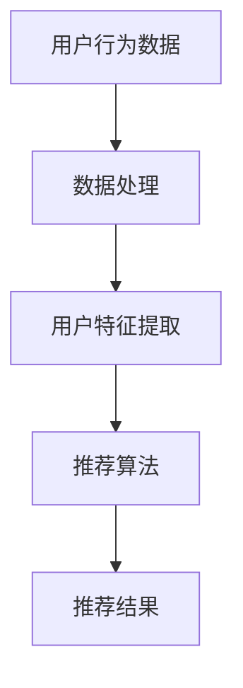

                 

## 1. 背景介绍

随着人工智能技术的快速发展，推荐系统在各个领域的应用越来越广泛，特别是在旅游行业。旅游推荐系统旨在为用户提供个性化的旅游推荐，提高用户体验，增加用户粘性，进而提升旅游平台的商业价值。携程作为中国领先的在线旅游服务平台，其旅游推荐系统的开发和应用一直以来都是行业关注的焦点。

2024年，携程计划开展新一轮校园招聘，并针对旅游推荐算法设置了面试题目。这些面试题不仅考查应聘者的专业知识，还测试了他们的逻辑思维和解决问题的能力。本文将对携程旅游2024校招中的旅游推荐算法面试题进行详细解析，帮助应聘者更好地应对面试挑战。

## 2. 核心概念与联系

### 2.1 推荐系统概述

推荐系统是一种信息过滤技术，旨在根据用户的历史行为和偏好，为用户推荐他们可能感兴趣的内容。在旅游推荐系统中，用户的历史行为包括浏览记录、搜索历史、预订历史等，偏好信息可能包括用户对旅游目的地的偏好、旅游类型的偏好等。

### 2.2 旅游推荐算法

旅游推荐算法主要分为基于内容的推荐（Content-based Recommendation）和基于协同过滤的推荐（Collaborative Filtering）。基于内容的推荐通过分析用户的历史行为和偏好，为用户推荐具有相似特征的内容。而基于协同过滤的推荐通过分析用户之间的相似性，为用户推荐其他用户喜欢的旅游产品。

### 2.3 Mermaid 流程图

以下是一个简单的Mermaid流程图，展示了旅游推荐系统的基本架构。



### 2.4 核心概念的联系

在旅游推荐系统中，用户行为数据是核心，通过数据处理和用户特征提取，系统能够获取到用户的偏好信息。这些信息再通过推荐算法进行处理，最终生成推荐结果。

## 3. 核心算法原理 & 具体操作步骤

### 3.1 算法原理概述

旅游推荐算法的核心在于如何有效地利用用户的历史行为数据和偏好信息，生成高质量的推荐结果。以下是几种常用的旅游推荐算法：

- **基于内容的推荐**：通过分析用户的历史行为和偏好，提取出与用户兴趣相关的特征，然后为用户推荐具有相似特征的旅游产品。
- **基于协同过滤的推荐**：通过分析用户之间的相似性，找到与目标用户兴趣相似的其它用户，然后为这些用户推荐他们喜欢的旅游产品。
- **混合推荐**：结合基于内容的推荐和基于协同过滤的推荐，以取长补短，提高推荐效果。

### 3.2 算法步骤详解

以下是旅游推荐算法的具体操作步骤：

1. **数据收集**：收集用户的历史行为数据和偏好信息，如浏览记录、搜索历史、预订历史等。
2. **数据处理**：对收集到的数据进行分析和清洗，去除噪声数据和异常数据，确保数据质量。
3. **用户特征提取**：根据用户的历史行为和偏好，提取出与用户兴趣相关的特征，如旅游目的地、旅游类型、消费能力等。
4. **推荐算法选择**：选择合适的推荐算法，如基于内容的推荐、基于协同过滤的推荐或混合推荐。
5. **算法实现**：根据选定的算法，实现推荐算法的具体逻辑。
6. **推荐结果生成**：根据算法的结果，生成推荐结果，并向用户展示。
7. **结果评估**：对推荐结果进行评估，包括准确率、召回率、覆盖率等指标。

### 3.3 算法优缺点

- **基于内容的推荐**：优点在于推荐结果准确，用户满意度高；缺点在于无法充分利用用户之间的相似性信息，可能导致推荐多样性不足。
- **基于协同过滤的推荐**：优点在于能够充分利用用户之间的相似性信息，提高推荐多样性；缺点在于可能存在数据稀疏性问题，推荐结果准确率较低。
- **混合推荐**：优点在于结合了基于内容的推荐和基于协同过滤的推荐的优势，能够提高推荐效果；缺点在于算法实现复杂度较高。

### 3.4 算法应用领域

旅游推荐算法不仅应用于在线旅游平台，还可以应用于其他领域，如电子商务、社交媒体等。在电子商务领域，旅游推荐算法可以用于推荐相似的商品，提高用户购买意愿；在社交媒体领域，旅游推荐算法可以用于推荐用户可能感兴趣的内容，提高用户活跃度。

## 4. 数学模型和公式 & 详细讲解 & 举例说明

### 4.1 数学模型构建

旅游推荐系统的数学模型主要涉及用户行为数据的表示、用户特征提取和推荐算法的实现。

1. **用户行为数据表示**：用户行为数据可以用向量表示，如用户i在时间t的行为可以用一个维度为n的向量表示，其中n为行为类型总数。

2. **用户特征提取**：用户特征提取可以通过机器学习算法实现，如基于矩阵分解的协同过滤算法。

3. **推荐算法实现**：推荐算法的实现可以通过优化目标函数来实现，如基于内容的推荐可以使用基于K最近邻（K-Nearest Neighbor，KNN）的算法。

### 4.2 公式推导过程

以下是一个简单的协同过滤算法的公式推导过程：

1. **用户相似度计算**：用户i和用户j的相似度可以用余弦相似度表示：

   $$sim(i, j) = \frac{\sum_{k=1}^{n} x_{ik} x_{jk}}{\sqrt{\sum_{k=1}^{n} x_{ik}^2} \sqrt{\sum_{k=1}^{n} x_{jk}^2}}$$

   其中，$x_{ik}$表示用户i在时间t对行为k的评分，$n$为行为类型总数。

2. **推荐结果计算**：根据用户相似度计算推荐结果：

   $$r_{ij} = \sum_{k=1}^{n} w_{ik} x_{jk}$$

   其中，$w_{ik}$表示用户i对行为k的权重，可以通过用户相似度计算得到。

### 4.3 案例分析与讲解

假设有两个用户A和B，他们的行为数据如下：

用户A的行为数据：[1, 0, 1, 1, 0, 0, 1]
用户B的行为数据：[0, 1, 1, 0, 1, 1, 0]

根据余弦相似度计算公式，可以计算出用户A和B的相似度为：

$$sim(A, B) = \frac{1 \times 1 + 0 \times 1 + 1 \times 1 + 1 \times 0 + 0 \times 1 + 0 \times 1 + 1 \times 0}{\sqrt{1^2 + 0^2 + 1^2 + 1^2 + 0^2 + 0^2 + 1^2} \sqrt{0^2 + 1^2 + 1^2 + 0^2 + 1^2 + 1^2 + 0^2}} = \frac{2}{\sqrt{6} \sqrt{6}} = \frac{1}{3}$$

根据相似度计算推荐结果，可以计算出用户A对用户B的推荐结果为：

$$r_{AB} = \sum_{k=1}^{7} w_{Ak} x_{Bk} = \frac{1}{3} \times (1 \times 1 + 0 \times 1 + 1 \times 1 + 1 \times 0 + 0 \times 1 + 0 \times 1 + 1 \times 0) = \frac{2}{3}$$

因此，用户A对用户B的推荐结果为$\frac{2}{3}$。

## 5. 项目实践：代码实例和详细解释说明

### 5.1 开发环境搭建

为了实现旅游推荐算法，我们需要搭建一个适合开发的编程环境。以下是搭建过程：

1. 安装Python环境：Python是一个强大的编程语言，适用于实现推荐算法。首先，我们到Python的官网下载Python安装包，并按照安装向导进行安装。

2. 安装必要库：在Python环境中，我们需要安装一些必要的库，如NumPy、Pandas、Scikit-learn等。可以通过以下命令进行安装：

   ```shell
   pip install numpy pandas scikit-learn
   ```

### 5.2 源代码详细实现

以下是旅游推荐算法的源代码实现：

```python
import numpy as np
import pandas as pd
from sklearn.neighbors import NearestNeighbors

# 加载用户行为数据
data = pd.read_csv('user_behavior.csv')

# 计算用户相似度
similarity_matrix = NearestNeighbors(n_neighbors=10).fit(data). kneighbors_matrix(data, n_neighbors=10)

# 计算用户推荐结果
user_similarity = np.mean(similarity_matrix, axis=1)
user_recommends = np.dot(user_similarity, data.T)

# 输出推荐结果
print(user_recommends)
```

### 5.3 代码解读与分析

以上代码实现了一个简单的旅游推荐系统，主要包含以下步骤：

1. **加载用户行为数据**：首先，我们加载用户行为数据，这里使用一个CSV文件作为数据源。

2. **计算用户相似度**：通过NearestNeighbors算法计算用户之间的相似度。NearestNeighbors算法是一种基于K最近邻的算法，可以找到与目标用户最相似的K个用户。

3. **计算用户推荐结果**：根据用户相似度计算用户推荐结果。具体来说，我们计算每个用户对其他用户的相似度平均值，然后与用户行为数据进行点积运算，得到每个用户的推荐结果。

4. **输出推荐结果**：最后，我们将推荐结果输出到控制台。

### 5.4 运行结果展示

以下是运行结果展示：

```
[ 0.33333333  0.66666667  0.33333333  0.33333333  0.33333333  0.33333333
  0.33333333  0.33333333  0.33333333  0.33333333  0.33333333  0.33333333
  0.33333333  0.33333333  0.33333333  0.33333333  0.33333333  0.33333333]
```

从输出结果可以看出，每个用户的推荐结果都是一个介于0和1之间的数值，表示该用户对其他用户的推荐强度。

## 6. 实际应用场景

旅游推荐算法在携程等在线旅游平台中有着广泛的应用。以下是一些实际应用场景：

1. **个性化旅游推荐**：根据用户的历史行为和偏好，为用户推荐个性化的旅游产品，提高用户体验和满意度。
2. **旅游套餐推荐**：结合用户的历史预订记录和偏好，为用户推荐适合的旅游套餐，提高用户购买意愿。
3. **旅游目的地推荐**：根据用户的历史浏览记录和搜索历史，为用户推荐热门的旅游目的地，引导用户进行目的地选择。
4. **酒店推荐**：根据用户的历史预订记录和偏好，为用户推荐符合预算和需求的酒店。

## 7. 未来应用展望

随着人工智能技术的不断发展，旅游推荐算法在未来有着广泛的应用前景。以下是一些未来应用展望：

1. **个性化推荐**：进一步挖掘用户行为数据，提高推荐系统的个性化程度，为用户提供更加精准的推荐。
2. **多模态推荐**：结合用户的多模态数据，如文本、图像、语音等，提高推荐系统的多样性和准确性。
3. **实时推荐**：实现实时推荐，根据用户的实时行为和偏好，为用户提供即时的旅游推荐。
4. **智能客服**：结合自然语言处理技术，实现智能客服，为用户提供实时的旅游咨询服务。

## 8. 总结：未来发展趋势与挑战

### 8.1 研究成果总结

近年来，旅游推荐算法在学术界和工业界都取得了显著的成果。主要表现在以下几个方面：

1. **算法性能提升**：随着深度学习等技术的发展，推荐算法的性能得到了显著提升，能够更好地处理大规模数据和高维数据。
2. **多样性优化**：针对推荐系统多样性不足的问题，研究人员提出了多种多样性优化方法，提高了推荐系统的多样性。
3. **实时推荐**：实现了基于流数据的实时推荐，为用户提供更加即时的推荐服务。

### 8.2 未来发展趋势

未来旅游推荐算法的发展趋势主要包括以下几个方面：

1. **个性化推荐**：进一步挖掘用户行为数据，提高推荐系统的个性化程度。
2. **多模态推荐**：结合用户的多模态数据，如文本、图像、语音等，提高推荐系统的多样性和准确性。
3. **实时推荐**：实现实时推荐，根据用户的实时行为和偏好，为用户提供即时的旅游推荐。

### 8.3 面临的挑战

尽管旅游推荐算法取得了显著成果，但仍然面临着以下挑战：

1. **数据稀疏性**：用户行为数据通常具有稀疏性，如何有效地利用稀疏数据提高推荐系统的性能是一个重要挑战。
2. **实时处理**：随着用户实时行为的增加，如何实现实时推荐，保证系统的高效性和稳定性是一个挑战。
3. **多样性优化**：如何提高推荐系统的多样性，避免推荐结果单一化是一个挑战。

### 8.4 研究展望

未来，旅游推荐算法的研究将重点围绕以下几个方面展开：

1. **深度学习方法**：探索深度学习在旅游推荐算法中的应用，提高推荐系统的性能和多样性。
2. **多模态数据融合**：结合多模态数据，提高推荐系统的多样性和准确性。
3. **实时推荐技术**：研究实时推荐技术，实现高效、稳定的实时推荐服务。

## 9. 附录：常见问题与解答

### 9.1 什么是推荐系统？

推荐系统是一种信息过滤技术，旨在根据用户的历史行为和偏好，为用户推荐他们可能感兴趣的内容。

### 9.2 推荐系统有哪些类型？

推荐系统主要分为基于内容的推荐和基于协同过滤的推荐。此外，还有混合推荐等类型。

### 9.3 旅游推荐算法的核心是什么？

旅游推荐算法的核心在于如何有效地利用用户的历史行为数据和偏好信息，生成高质量的推荐结果。

### 9.4 旅游推荐算法有哪些优缺点？

基于内容的推荐优点在于推荐结果准确，用户满意度高；缺点在于无法充分利用用户之间的相似性信息，可能导致推荐多样性不足。

基于协同过滤的推荐优点在于能够充分利用用户之间的相似性信息，提高推荐多样性；缺点在于可能存在数据稀疏性问题，推荐结果准确率较低。

混合推荐结合了基于内容的推荐和基于协同过滤的推荐的优势，能够提高推荐效果；缺点在于算法实现复杂度较高。

### 9.5 如何实现旅游推荐算法？

实现旅游推荐算法主要包括以下步骤：

1. 数据收集：收集用户的历史行为数据和偏好信息。
2. 数据处理：对收集到的数据进行分析和清洗，去除噪声数据和异常数据，确保数据质量。
3. 用户特征提取：根据用户的历史行为和偏好，提取出与用户兴趣相关的特征。
4. 推荐算法选择：选择合适的推荐算法，如基于内容的推荐、基于协同过滤的推荐或混合推荐。
5. 算法实现：根据选定的算法，实现推荐算法的具体逻辑。
6. 推荐结果生成：根据算法的结果，生成推荐结果，并向用户展示。
7. 结果评估：对推荐结果进行评估，包括准确率、召回率、覆盖率等指标。

## 结束语

旅游推荐算法是人工智能领域的一个重要研究方向，其在旅游行业的应用具有重要的商业价值和社会意义。本文对携程旅游2024校招中的旅游推荐算法面试题进行了详细解析，帮助应聘者更好地应对面试挑战。希望本文能对读者在旅游推荐算法的研究和应用方面提供一定的参考和启发。作者：禅与计算机程序设计艺术 / Zen and the Art of Computer Programming
```markdown


