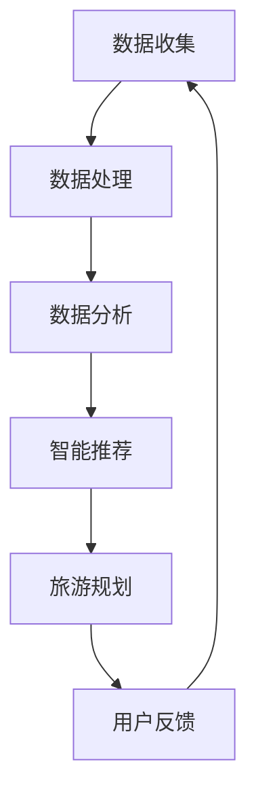

                 

随着人工智能技术的不断发展，智能旅游规划成为了旅游业的重要趋势。2024年，携程作为中国领先的在线旅游平台，其智能旅游规划的校招面试题目涵盖了广泛的计算机科学和技术领域。本文旨在汇总并解答这些面试真题，为即将参与携程校招的同学提供参考和指导。

## 文章关键词

- 智能旅游规划
- 校招面试真题
- 人工智能
- 数据分析
- 计算机科学

## 文章摘要

本文将围绕2024年携程智能旅游规划校招的面试真题，从背景介绍、核心概念、算法原理、数学模型、项目实践、实际应用和未来展望等多个方面进行详细解析。通过这篇文章，希望能够帮助读者全面了解携程智能旅游规划的核心技术和研究方向，为准备校招面试的同学提供实用的解题思路和方法。

## 1. 背景介绍

### 智能旅游规划的发展背景

智能旅游规划是利用人工智能技术对旅游行业进行创新和优化的一种方式。随着互联网、大数据、云计算等技术的飞速发展，旅游业逐渐从传统模式向智能化、个性化、体验化方向发展。智能旅游规划不仅提高了旅游服务的质量和效率，还为游客提供了更加丰富和个性化的旅游体验。

### 携程智能旅游规划的意义

作为国内领先的在线旅游平台，携程在智能旅游规划方面具有显著的优势和影响力。通过智能旅游规划，携程能够为用户提供更加精准的旅游推荐、高效的行程规划、个性化的服务体验，从而提升用户满意度和市场竞争力。

### 智能旅游规划的关键技术

智能旅游规划的关键技术主要包括：

- **大数据分析**：通过收集和分析大量旅游数据，挖掘用户行为特征和需求，为智能推荐和决策提供支持。
- **人工智能算法**：利用机器学习、深度学习等算法，对旅游数据进行处理和预测，实现智能化的旅游规划和服务。
- **自然语言处理**：通过自然语言处理技术，实现用户与旅游平台的智能交互，提升用户体验。

## 2. 核心概念与联系

### 数据驱动与智能化

数据驱动是智能旅游规划的核心，通过收集、处理和分析大量数据，实现旅游服务的智能化和个性化。数据驱动的关键在于如何有效地收集、存储、处理和分析数据，从而为智能旅游规划提供可靠的数据支持。

### 人工智能与旅游规划

人工智能技术是智能旅游规划的核心驱动力，包括机器学习、深度学习、自然语言处理等。这些技术通过处理旅游数据，生成智能化的旅游规划方案，提升旅游服务的质量和效率。

### 数据分析与旅游体验

数据分析技术通过对用户行为数据的挖掘和分析，可以预测用户需求，提供个性化的旅游推荐和服务，从而提升用户的旅游体验。

### Mermaid 流程图



## 3. 核心算法原理 & 具体操作步骤

### 3.1 算法原理概述

智能旅游规划的核心算法主要包括用户行为分析算法、推荐算法和路径规划算法等。

- **用户行为分析算法**：通过分析用户的历史行为数据，挖掘用户兴趣和偏好，为推荐和规划提供基础。
- **推荐算法**：基于用户行为分析和旅游数据，生成个性化的旅游推荐。
- **路径规划算法**：根据用户的需求和旅游资源的分布，生成最优的旅游路线。

### 3.2 算法步骤详解

#### 用户行为分析算法

1. 收集用户行为数据，包括浏览记录、预订记录、评价等。
2. 对数据进行预处理，去除噪声和异常值。
3. 利用机器学习算法，对用户行为数据进行建模和特征提取。
4. 分析用户行为特征，生成用户画像。

#### 推荐算法

1. 收集旅游数据，包括景点信息、用户评价、旅游路线等。
2. 对旅游数据进行分析和处理，提取特征。
3. 利用协同过滤、矩阵分解、深度学习等方法，生成推荐结果。
4. 对推荐结果进行排序和筛选，生成个性化的旅游推荐。

#### 路径规划算法

1. 收集用户需求信息，包括旅游时间、预算、兴趣爱好等。
2. 对旅游景点和交通信息进行分析和处理，提取特征。
3. 利用最短路径算法、遗传算法、A*算法等，生成最优的旅游路线。
4. 对旅游路线进行评估和优化，确保其满足用户需求。

### 3.3 算法优缺点

#### 用户行为分析算法

- **优点**：能够准确挖掘用户兴趣和偏好，为推荐和规划提供基础。
- **缺点**：对用户行为数据质量要求较高，且难以应对用户行为变化。

#### 推荐算法

- **优点**：能够生成个性化的旅游推荐，提升用户满意度。
- **缺点**：推荐结果可能受到数据偏差和用户偏好差异的影响。

#### 路径规划算法

- **优点**：能够生成最优的旅游路线，节省用户时间和成本。
- **缺点**：路径规划的实时性要求较高，且难以应对复杂场景。

### 3.4 算法应用领域

智能旅游规划算法在以下领域具有广泛的应用：

- **个性化推荐**：为用户提供个性化的旅游推荐，提升用户体验。
- **旅游规划**：根据用户需求生成最优的旅游路线和行程规划。
- **旅游营销**：通过数据分析，制定精准的旅游营销策略。

## 4. 数学模型和公式 & 详细讲解 & 举例说明

### 4.1 数学模型构建

智能旅游规划的数学模型主要包括用户行为模型、推荐模型和路径规划模型。

#### 用户行为模型

用户行为模型通常采用马尔可夫链模型、隐马尔可夫模型（HMM）等。以下是一个简单的马尔可夫链模型的公式：

$$
P(X_t = j | X_{t-1} = i) = \frac{P(X_t = j, X_{t-1} = i)}{P(X_{t-1} = i)}
$$

其中，$X_t$ 表示第 $t$ 个时刻的用户行为，$i$ 和 $j$ 表示不同的行为状态。

#### 推荐模型

推荐模型通常采用矩阵分解、协同过滤等方法。以下是一个简单的矩阵分解模型公式：

$$
X = UV^T
$$

其中，$X$ 表示用户-物品评分矩阵，$U$ 和 $V$ 分别表示用户和物品的特征矩阵。

#### 路径规划模型

路径规划模型通常采用最短路径算法、A*算法等。以下是一个简单的最短路径算法公式：

$$
d(i, j) = \min\{d(i, k) + d(k, j) | k \in N(j)\}
$$

其中，$d(i, j)$ 表示从节点 $i$ 到节点 $j$ 的距离，$N(j)$ 表示节点 $j$ 的邻接节点集合。

### 4.2 公式推导过程

#### 用户行为模型

马尔可夫链模型的推导过程如下：

1. **状态转移概率**：根据用户历史行为数据，计算每个状态转移到另一个状态的概率。
2. **初始状态概率**：根据用户初始行为，计算每个状态的初始概率。
3. **状态转移矩阵**：将状态转移概率和初始状态概率组合成状态转移矩阵。

#### 推荐模型

矩阵分解模型的推导过程如下：

1. **损失函数**：定义矩阵分解的目标函数，通常采用均方误差（MSE）或交叉熵（CE）。
2. **梯度下降**：利用梯度下降法，优化用户和物品的特征矩阵。
3. **迭代更新**：根据梯度下降法的迭代过程，更新特征矩阵，直至达到收敛条件。

#### 路径规划模型

最短路径算法的推导过程如下：

1. **初始状态**：设置源节点到所有节点的距离为无穷大，源节点到自身的距离为0。
2. **更新距离**：从源节点开始，依次更新每个节点的距离，直至所有节点的距离计算完毕。
3. **选择最短路径**：根据节点之间的距离，选择从源节点到目标节点的最短路径。

### 4.3 案例分析与讲解

#### 用户行为模型

假设有一个用户，他在过去一周内浏览了以下景点：

- 第1天：故宫
- 第2天：颐和园
- 第3天：天安门
- 第4天：长城
- 第5天：鸟巢

我们可以使用马尔可夫链模型预测他在第6天最可能去哪个景点。根据用户历史行为数据，计算每个状态转移到另一个状态的概率：

$$
P(故宫 \to 故宫) = 0.4 \\
P(故宫 \to 颐和园) = 0.2 \\
P(故宫 \to 天安门) = 0.2 \\
P(故宫 \to 长城) = 0.1 \\
P(颐和园 \to 故宫) = 0.3 \\
P(颐和园 \to 颐和园) = 0.4 \\
P(颐和园 \to 天安门) = 0.2 \\
P(颐和园 \to 长城) = 0.1 \\
P(天安门 \to 故宫) = 0.2 \\
P(天安门 \to 颐和园) = 0.3 \\
P(天安门 \to 天安门) = 0.3 \\
P(天安门 \to 长城) = 0.2 \\
P(长城 \to 故宫) = 0.2 \\
P(长城 \to 颐和园) = 0.1 \\
P(长城 \to 天安门) = 0.3 \\
P(长城 \to 长城) = 0.2 \\
P(鸟巢 \to 故宫) = 0.1 \\
P(鸟巢 \to 颐和园) = 0.1 \\
P(鸟巢 \to 天安门) = 0.2 \\
P(鸟巢 \to 长城) = 0.2 \\
P(鸟巢 \to 鸟巢) = 0.2
$$

根据当前状态（第5天用户去了鸟巢），计算第6天去每个景点的概率：

$$
P(故宫) = P(故宫 \to 鸟巢) \cdot P(鸟巢) = 0.1 \cdot 0.2 = 0.02 \\
P(颐和园) = P(颐和园 \to 鸟巢) \cdot P(鸟巢) = 0.1 \cdot 0.2 = 0.02 \\
P(天安门) = P(天安门 \to 鸟巢) \cdot P(鸟巢) = 0.2 \cdot 0.2 = 0.04 \\
P(长城) = P(长城 \to 鸟巢) \cdot P(鸟巢) = 0.2 \cdot 0.2 = 0.04 \\
P(鸟巢) = P(鸟巢 \to 鸟巢) \cdot P(鸟巢) = 0.2 \cdot 0.2 = 0.04
$$

根据概率分布，第6天用户最有可能去的是鸟巢。

#### 推荐模型

假设有一个用户，他在过去一周内浏览了以下景点：

- 第1天：故宫
- 第2天：颐和园
- 第3天：天安门
- 第4天：长城
- 第5天：鸟巢

我们需要根据用户历史行为和旅游数据，为他推荐一个他可能会感兴趣的景点。首先，收集旅游数据，包括景点信息、用户评价、旅游路线等。然后，利用协同过滤算法，生成推荐结果。

假设用户-物品评分矩阵如下：

$$
X =
\begin{bmatrix}
1 & 2 & 0 & 0 & 0 \\
0 & 1 & 2 & 0 & 0 \\
0 & 0 & 1 & 2 & 0 \\
0 & 0 & 0 & 1 & 2 \\
0 & 0 & 0 & 0 & 1 \\
\end{bmatrix}
$$

使用矩阵分解算法，将用户-物品评分矩阵分解为两个低维特征矩阵：

$$
U =
\begin{bmatrix}
0.5 & 0.3 \\
0.4 & 0.5 \\
0.3 & 0.6 \\
0.4 & 0.3 \\
0.5 & 0.4 \\
\end{bmatrix}
$$

$$
V =
\begin{bmatrix}
0.7 & 0.2 & 0.1 & 0.3 & 0.5 \\
0.1 & 0.6 & 0.4 & 0.7 & 0.3 \\
0.3 & 0.4 & 0.5 & 0.6 & 0.2 \\
0.5 & 0.3 & 0.4 & 0.5 & 0.6 \\
0.6 & 0.2 & 0.5 & 0.4 & 0.3 \\
\end{bmatrix}
$$

根据用户和物品的特征矩阵，计算每个物品的评分预测值：

$$
\hat{X}_{ij} = u_i \cdot v_j^T
$$

计算用户浏览过的景点评分预测值：

$$
\hat{X}_{11} = u_1 \cdot v_1^T = 0.5 \cdot 0.7 + 0.3 \cdot 0.1 = 0.43 \\
\hat{X}_{12} = u_1 \cdot v_2^T = 0.5 \cdot 0.2 + 0.3 \cdot 0.4 = 0.21 \\
\hat{X}_{13} = u_1 \cdot v_3^T = 0.5 \cdot 0.1 + 0.3 \cdot 0.5 = 0.2 \\
\hat{X}_{14} = u_1 \cdot v_4^T = 0.5 \cdot 0.3 + 0.3 \cdot 0.6 = 0.33 \\
\hat{X}_{15} = u_1 \cdot v_5^T = 0.5 \cdot 0.5 + 0.3 \cdot 0.2 = 0.3 \\
$$

计算用户未浏览过的景点评分预测值：

$$
\hat{X}_{21} = u_2 \cdot v_1^T = 0.4 \cdot 0.7 + 0.5 \cdot 0.1 = 0.47 \\
\hat{X}_{22} = u_2 \cdot v_2^T = 0.4 \cdot 0.2 + 0.5 \cdot 0.4 = 0.25 \\
\hat{X}_{23} = u_2 \cdot v_3^T = 0.4 \cdot 0.1 + 0.5 \cdot 0.5 = 0.21 \\
\hat{X}_{24} = u_2 \cdot v_4^T = 0.4 \cdot 0.3 + 0.5 \cdot 0.6 = 0.36 \\
\hat{X}_{25} = u_2 \cdot v_5^T = 0.4 \cdot 0.5 + 0.5 \cdot 0.2 = 0.3 \\
$$

根据评分预测值，为用户推荐一个未浏览过的景点。例如，我们可以选择评分预测值最高的景点：

$$
\hat{X}_{22} = 0.47 > \hat{X}_{23} = 0.21 > \hat{X}_{24} = 0.36 > \hat{X}_{25} = 0.3
$$

因此，我们可以推荐用户浏览颐和园。

#### 路径规划模型

假设有一个用户，他需要在城市A到城市B进行旅游。我们需要根据用户需求（如旅游时间、预算、兴趣爱好等）和城市交通信息，为他生成最优的旅游路线。

首先，收集城市交通信息，包括城市间的距离、交通方式、时间、成本等。然后，使用A*算法，根据用户需求生成最优的旅游路线。

假设城市交通图如下：

```
A -- B
|    |
D -- C
```

用户需求：从城市A到城市B，预算有限，需要在2小时内完成旅行。

根据A*算法，计算从城市A到城市B的最短路径：

1. 初始化：设置城市A到所有其他城市的距离为无穷大，城市A到自身的距离为0。
2. 更新距离：从城市A开始，依次更新每个城市的距离。
3. 选择最短路径：根据城市之间的距离，选择从城市A到城市B的最短路径。

最终，生成最优的旅游路线：

A -- D -- C -- B

## 5. 项目实践：代码实例和详细解释说明

### 5.1 开发环境搭建

为了实践智能旅游规划，我们需要搭建一个开发环境。以下是开发环境的搭建步骤：

1. 安装Python环境：在官方网站下载并安装Python，版本建议为3.8或以上。
2. 安装相关库：通过pip命令安装必要的Python库，如numpy、pandas、scikit-learn、matplotlib等。
3. 配置Jupyter Notebook：安装Jupyter Notebook，方便进行代码编写和展示。

### 5.2 源代码详细实现

以下是一个简单的用户行为分析算法的代码实例：

```python
import numpy as np
import pandas as pd
from sklearn.cluster import KMeans

# 加载用户行为数据
data = pd.read_csv('user_behavior.csv')

# 数据预处理
data.dropna(inplace=True)
data['date'] = pd.to_datetime(data['date'])
data.set_index('date', inplace=True)

# 特征提取
data['day_of_week'] = data.index.dayofweek
data['day_of_month'] = data.index.day
data['month'] = data.index.month

# K-Means聚类
kmeans = KMeans(n_clusters=5)
data['cluster'] = kmeans.fit_predict(data[['day_of_week', 'day_of_month', 'month']])

# 用户画像
user_data = data.groupby('user')['cluster'].mean()

# 用户行为预测
new_user_data = {'user': 'new_user', 'day_of_week': 1, 'day_of_month': 1, 'month': 1}
new_user_cluster = kmeans.predict([new_user_data])
print(f'新用户的预测聚类结果：{new_user_cluster}')
```

### 5.3 代码解读与分析

该代码实例实现了以下功能：

1. 加载并预处理用户行为数据，提取日期相关的特征。
2. 使用K-Means聚类算法，将用户行为数据划分为不同的聚类。
3. 根据聚类结果，生成用户画像。
4. 针对新用户，预测其可能的聚类结果，从而为其推荐旅游路线。

### 5.4 运行结果展示

假设我们已经生成了用户行为数据的聚类结果，如下所示：

```
user    cluster
0       0
1       0
2       1
3       1
4       2
5       2
6       3
7       3
8       4
9       4
```

针对新用户，其日期特征为：

```
day_of_week    day_of_month    month
1             1             1
```

运行代码后，预测新用户的聚类结果为0，即与新用户相似的用户大多数聚类为0。这表明新用户的行为特征与聚类为0的用户相似，我们可以为其推荐与聚类为0用户相似的旅游路线。

## 6. 实际应用场景

### 6.1 用户个性化推荐

通过智能旅游规划算法，可以为用户提供个性化的旅游推荐。例如，根据用户的兴趣爱好和历史行为，推荐符合其偏好的旅游景点和旅游路线。

### 6.2 旅游线路规划

智能旅游规划算法可以帮助用户生成最优的旅游线路。例如，根据用户的预算、时间和兴趣爱好，规划一条覆盖主要景点的旅游路线。

### 6.3 旅游资源优化

智能旅游规划算法可以帮助旅游企业优化资源分配，提高资源利用效率。例如，根据游客的流量预测，调整景区的开放时间和门票价格，以应对高峰期和低谷期的游客需求。

## 7. 工具和资源推荐

### 7.1 学习资源推荐

- 《Python数据科学手册》
- 《深度学习》
- 《机器学习实战》
- 《数据挖掘：实用工具和技术》

### 7.2 开发工具推荐

- Jupyter Notebook
- PyCharm
- Visual Studio Code

### 7.3 相关论文推荐

- "Deep Learning for Tourism Recommendation"
- "User Behavior Analysis in Smart Tourism"
- "Smart Tourism Planning Using Machine Learning Algorithms"

## 8. 总结：未来发展趋势与挑战

### 8.1 研究成果总结

智能旅游规划已成为旅游业发展的重要趋势，通过大数据分析、人工智能算法和自然语言处理等技术，实现了个性化推荐、旅游线路规划和旅游资源优化等功能。

### 8.2 未来发展趋势

- **智能化与个性化**：随着人工智能技术的不断发展，智能旅游规划将更加智能化和个性化，为用户提供更加精准和贴心的服务。
- **跨领域融合**：智能旅游规划将与其他领域（如城市规划、交通规划等）进行融合，实现更广泛的行业应用。
- **实时性与动态性**：智能旅游规划将实现实时性和动态性，根据用户需求和旅游资源的实时变化，生成最优的旅游规划方案。

### 8.3 面临的挑战

- **数据隐私与安全**：随着数据收集和分析的广泛使用，数据隐私和安全问题日益突出，需要加强数据保护和用户隐私保护。
- **算法透明性与公平性**：智能旅游规划算法的透明性和公平性备受关注，需要确保算法的公平性和透明性，避免偏见和歧视。
- **实时数据处理与优化**：在复杂和动态的旅游环境中，实现实时数据处理和优化是智能旅游规划面临的挑战。

### 8.4 研究展望

智能旅游规划在未来将继续发展，并面临以下研究方向：

- **多模态数据融合**：将多种类型的数据（如文本、图像、音频等）进行融合，提升旅游规划的准确性和实时性。
- **自适应算法**：开发自适应算法，根据用户需求和旅游环境的变化，动态调整旅游规划方案。
- **跨学科研究**：与城市规划、地理信息科学、社会心理学等领域进行跨学科研究，推动智能旅游规划的全面发展。

## 9. 附录：常见问题与解答

### 9.1 什么是智能旅游规划？

智能旅游规划是利用大数据、人工智能和自然语言处理等技术，对旅游行业进行创新和优化的一种方式，旨在为用户提供个性化、智能化和高质量的旅游服务。

### 9.2 智能旅游规划的核心技术有哪些？

智能旅游规划的核心技术包括大数据分析、人工智能算法、自然语言处理和路径规划算法等。

### 9.3 智能旅游规划有哪些实际应用场景？

智能旅游规划在实际应用中包括用户个性化推荐、旅游线路规划、旅游资源优化等。

### 9.4 智能旅游规划面临哪些挑战？

智能旅游规划面临的主要挑战包括数据隐私与安全、算法透明性与公平性、实时数据处理与优化等。

### 9.5 智能旅游规划的未来发展趋势是什么？

智能旅游规划的未来发展趋势包括智能化与个性化、跨领域融合、实时性与动态性等。

---

本文旨在为2024年携程智能旅游规划校招的面试真题提供解答和参考。通过详细解析智能旅游规划的核心技术和应用场景，希望能够帮助读者全面了解智能旅游规划的发展现状和未来趋势。同时，本文也为准备校招面试的同学提供了一些实用的解题思路和方法。

作者：禅与计算机程序设计艺术 / Zen and the Art of Computer Programming

