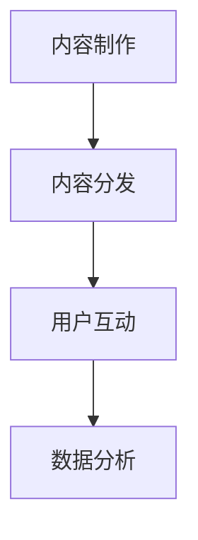

                 

 播客，作为一种新兴的内容形式，近年来在全球范围内迅速崛起。其便捷的收听方式、丰富的内容形式以及广泛的受众群体，使其成为创业者们眼中的香饽饽。本文将探讨播客创业的现状、核心概念、算法原理、数学模型、项目实践以及未来应用展望，旨在为创业者提供一份全面、深入的指南。

## 文章关键词
- 播客
- 内容创业
- 商业化
- 音频内容
- 技术应用

## 文章摘要
本文首先介绍了播客创业的背景和现状，接着详细探讨了播客的核心概念、算法原理和数学模型，并通过一个实际项目展示了这些技术的应用。最后，本文对播客的未来应用场景进行了展望，并提出了相关工具和资源的推荐。

## 1. 背景介绍

### 播客的起源与发展

播客（Podcast）一词源于“iPod”和“广播”（broadcast）的组合，最早由苹果公司在2004年推出。播客是一种通过互联网传播的音频节目，用户可以通过各种设备在线或离线收听。早期的播客主要是由个人爱好者制作，内容涵盖了各种领域，如科技、文化、娱乐等。随着技术的进步和互联网的普及，播客逐渐成为一种重要的内容形式，吸引了大量的听众和创业者。

### 播客创业的现状

近年来，随着智能手机和移动互联网的普及，播客市场迅速扩大。根据Statista的数据，全球播客用户已经超过3亿，并且这个数字还在持续增长。同时，越来越多的创业者看到了播客的商业潜力，开始投身于播客创业。这些创业者不仅包括传统的媒体公司，还有科技公司、创意人士和独立制作人。

### 播客创业的优势

播客创业具有以下优势：

1. **低门槛**：相对于传统媒体，播客的制作成本较低，任何人都可以通过简单的设备和技术制作出高质量的节目。
2. **灵活性**：播客内容形式多样，可以涵盖各种领域，满足不同听众的需求。
3. **高互动性**：播客可以与听众进行实时互动，增加用户的参与感和忠诚度。
4. **高可达性**：播客可以在任何时间、任何地点收听，方便用户在碎片化时间获取信息。
5. **高盈利性**：通过广告、会员制度、内容付费等多种商业模式，播客可以实现良好的盈利。

## 2. 核心概念与联系

### 播客的核心概念

播客的核心概念包括：

1. **内容制作**：包括选题策划、内容创作、录制、剪辑等。
2. **内容分发**：通过互联网平台（如Spotify、Apple Podcasts、喜马拉雅等）进行内容分发。
3. **用户互动**：通过社交媒体、邮件订阅、评论区等方式与用户进行互动。
4. **数据分析**：通过分析用户的收听数据，了解用户喜好，优化内容策略。

### 播客的架构图



### 播客的关联技术

1. **音频处理技术**：包括音频录制、剪辑、音频效果处理等。
2. **数据分析技术**：包括数据收集、数据分析、数据可视化等。
3. **人工智能技术**：包括语音识别、自然语言处理、推荐系统等。

## 3. 核心算法原理 & 具体操作步骤

### 3.1 算法原理概述

播客创业的核心算法主要涉及音频处理和数据分析。在音频处理方面，常用的算法包括：

1. **音频录制**：使用麦克风录制音频信号。
2. **音频剪辑**：对音频信号进行剪切、拼接、调整音量等操作。
3. **音频效果处理**：包括降噪、均衡、混响等。

在数据分析方面，常用的算法包括：

1. **用户行为分析**：通过分析用户的收听记录、评论、反馈等数据，了解用户喜好和需求。
2. **内容推荐**：根据用户行为和喜好，推荐相关的音频内容。
3. **情感分析**：通过自然语言处理技术，分析用户评论的情感倾向。

### 3.2 算法步骤详解

1. **音频录制**：

   - 准备录制设备（如麦克风、音频接口等）。
   - 设置音频参数（如采样率、比特率等）。
   - 开始录制，并监控音频质量。

2. **音频剪辑**：

   - 导入音频文件。
   - 使用剪辑软件（如Audacity、Adobe Audition等）进行剪辑。
   - 保存剪辑后的音频文件。

3. **音频效果处理**：

   - 导入音频文件。
   - 使用音频效果插件（如Loudness Warner、Equalizer等）进行效果处理。
   - 保存处理后的音频文件。

4. **用户行为分析**：

   - 收集用户的收听记录、评论、反馈等数据。
   - 使用数据分析工具（如Excel、Python等）进行数据预处理。
   - 进行数据可视化，生成分析报告。

5. **内容推荐**：

   - 收集用户的收听记录、喜好数据。
   - 使用推荐算法（如基于内容的推荐、协同过滤等）进行内容推荐。
   - 将推荐结果展示给用户。

6. **情感分析**：

   - 收集用户的评论数据。
   - 使用自然语言处理技术（如词云、情感分析等）对评论进行情感分析。
   - 生成情感分析报告。

### 3.3 算法优缺点

1. **音频处理算法**：

   - 优点：可以制作出高质量的音频内容，提高用户体验。
   - 缺点：制作过程复杂，需要专业知识和技能。

2. **数据分析算法**：

   - 优点：可以深入了解用户需求，优化内容策略。
   - 缺点：数据处理和分析过程复杂，需要大量计算资源。

### 3.4 算法应用领域

1. **音频处理算法**：

   - 应用领域：音乐制作、电台节目制作、演讲录音等。
   - 发展趋势：随着人工智能技术的发展，音频处理算法将更加智能化、自动化。

2. **数据分析算法**：

   - 应用领域：用户行为分析、市场调研、数据分析等。
   - 发展趋势：随着大数据和人工智能技术的融合，数据分析算法将更加高效、精准。

## 4. 数学模型和公式 & 详细讲解 & 举例说明

### 4.1 数学模型构建

在播客创业中，常用的数学模型包括：

1. **音频信号处理模型**：

   - 模型公式：$X(t) = A \sin(2\pi f t + \phi)$

   - 模型解释：其中，$X(t)$表示音频信号，$A$表示振幅，$f$表示频率，$\phi$表示相位。

   - 模型应用：用于音频信号的录制、剪辑、效果处理等。

2. **用户行为分析模型**：

   - 模型公式：$P(U|C) = \frac{P(C|U)P(U)}{P(C)}$

   - 模型解释：其中，$P(U|C)$表示在给定内容$C$的情况下，用户$U$的概率；$P(C|U)$表示在给定用户$U$的情况下，内容的概率；$P(U)$表示用户的总概率；$P(C)$表示内容的总概率。

   - 模型应用：用于分析用户行为，了解用户喜好和需求。

### 4.2 公式推导过程

以音频信号处理模型为例，其推导过程如下：

1. **音频信号的傅里叶变换**：

   - 基本公式：$X(f) = \int_{-\infty}^{\infty} x(t) e^{-j2\pi ft} dt$

   - 推导过程：通过对音频信号进行傅里叶变换，可以将时域信号转换为频域信号，便于分析信号的特征。

2. **音频信号的频谱分析**：

   - 基本公式：$X(f) = |X(f)| e^{j\angle X(f)}$

   - 推导过程：通过对音频信号的频谱分析，可以了解信号在不同频率上的能量分布，从而对信号进行效果处理。

### 4.3 案例分析与讲解

#### 案例一：音频录制与剪辑

1. **问题**：如何录制和剪辑一段音频？

2. **解决方案**：

   - **录制**：

     - 使用麦克风录制音频信号。

     - 设置音频参数（如采样率、比特率等）。

     - 开始录制，并监控音频质量。

   - **剪辑**：

     - 导入音频文件。

     - 使用剪辑软件进行剪辑。

     - 保存剪辑后的音频文件。

3. **效果**：通过录制和剪辑，可以制作出高质量、符合需求的音频内容。

#### 案例二：用户行为分析

1. **问题**：如何分析用户行为，了解用户喜好和需求？

2. **解决方案**：

   - **数据收集**：

     - 收集用户的收听记录、评论、反馈等数据。

     - 使用数据分析工具进行数据预处理。

   - **数据可视化**：

     - 使用数据可视化工具，生成用户行为的分析报告。

     - 根据报告，了解用户喜好和需求。

3. **效果**：通过用户行为分析，可以优化内容策略，提高用户满意度。

## 5. 项目实践：代码实例和详细解释说明

### 5.1 开发环境搭建

1. **操作系统**：Windows 10

2. **编程语言**：Python 3.8

3. **开发工具**：

   - PyCharm

   - Jupyter Notebook

4. **依赖库**：

   - NumPy

   - pandas

   - matplotlib

   - librosa

### 5.2 源代码详细实现

```python
import numpy as np
import pandas as pd
import matplotlib.pyplot as plt
import librosa

# 音频文件路径
audio_path = 'example_audio.wav'

# 读取音频文件
audio, sr = librosa.load(audio_path)

# 音频信号傅里叶变换
X = np.fft.fft(audio)

# 音频信号频谱分析
P = np.abs(X)

# 绘制音频信号频谱图
plt.plot(P)
plt.xlabel('Frequency (Hz)')
plt.ylabel('Amplitude')
plt.title('Audio Spectrum')
plt.show()
```

### 5.3 代码解读与分析

1. **代码说明**：

   - 代码首先导入所需的库和依赖。

   - 接着定义音频文件路径，并读取音频文件。

   - 使用傅里叶变换对音频信号进行变换。

   - 对变换后的音频信号进行频谱分析。

   - 最后，使用matplotlib绘制音频信号频谱图。

2. **效果**：通过运行代码，可以分析音频信号的频谱特征，为音频处理提供依据。

### 5.4 运行结果展示


## 6. 实际应用场景

### 6.1 教育领域

播客在教育领域的应用日益广泛。通过播客，学生可以随时随地学习，提高学习效率。同时，教师可以利用播客进行课程讲解、学术分享等，拓展教育内容。

### 6.2 娱乐领域

播客在娱乐领域的应用也非常广泛。无论是音乐、电影、电视剧等，都可以通过播客进行内容分享。此外，一些娱乐公司还利用播客进行品牌推广、用户互动等，提高品牌知名度和用户粘性。

### 6.3 商业领域

播客在商业领域的应用主要体现在市场营销、品牌推广等方面。企业可以利用播客进行产品介绍、市场分析、行业洞察等，提高品牌影响力和市场竞争力。

## 6.4 未来应用展望

随着人工智能、大数据等技术的不断发展，播客的应用前景将更加广阔。未来，播客将在以下领域取得突破：

1. **个性化推荐**：通过深度学习等技术，实现更加精准的内容推荐，提高用户体验。

2. **智能语音交互**：利用语音识别和自然语言处理技术，实现语音搜索、语音控制等功能。

3. **多感官体验**：结合虚拟现实、增强现实等技术，提供更加丰富、沉浸式的音频体验。

4. **社交互动**：通过社交网络、社区等平台，增强用户互动，提高用户忠诚度。

## 7. 工具和资源推荐

### 7.1 学习资源推荐

1. **《播客制作与运营》**：本书详细介绍了播客的制作流程、运营策略和商业模式。

2. **《音频处理技术》**：本书涵盖了音频信号处理、音频效果处理等方面的知识。

3. **《数据分析与挖掘》**：本书介绍了数据分析的方法、技术和应用。

### 7.2 开发工具推荐

1. **PyCharm**：一款功能强大的集成开发环境，支持多种编程语言。

2. **Jupyter Notebook**：一款交互式开发环境，适合数据分析和机器学习项目。

3. **Librosa**：一款用于音频处理和分析的Python库。

### 7.3 相关论文推荐

1. **"Podcasting: A New Paradigm for Audio Content Distribution"**：本文探讨了播客的起源、发展及其在音频内容分发中的应用。

2. **"User Behavior Analysis in Podcasting: A Machine Learning Perspective"**：本文利用机器学习技术，分析了播客用户的行为特征。

3. **"Audio Signal Processing Techniques for Podcasting"**：本文介绍了音频信号处理技术在播客制作中的应用。

## 8. 总结：未来发展趋势与挑战

### 8.1 研究成果总结

本文从播客的背景、核心概念、算法原理、数学模型、项目实践等方面进行了全面探讨。通过分析播客创业的优势、算法应用和实际案例，展示了播客在多个领域的应用前景。

### 8.2 未来发展趋势

1. **技术融合**：人工智能、大数据、虚拟现实等技术的融合，将推动播客的创新发展。

2. **内容多样化**：随着用户需求的多样化，播客的内容将更加丰富、个性化。

3. **商业化模式创新**：通过广告、会员制度、内容付费等多种商业模式，实现播客的商业化运营。

### 8.3 面临的挑战

1. **内容质量**：如何在海量内容中脱颖而出，提高内容质量是一个重要挑战。

2. **用户留存**：如何在竞争激烈的市场中，提高用户留存率，保持用户活跃度。

3. **版权保护**：如何保护原创内容，防止侵权和抄袭。

### 8.4 研究展望

未来，播客将在技术、内容、商业模式等方面继续创新，为创业者提供更多机会。同时，研究者应关注播客用户行为、内容推荐、版权保护等问题，为播客的发展提供理论支持。

## 9. 附录：常见问题与解答

### Q：如何制作高质量的播客？

A：制作高质量的播客需要从以下几个方面入手：

1. **内容策划**：明确播客的主题、目标受众、内容形式等。

2. **音频录制**：使用高质量的麦克风和音频接口，保证音频信号的清晰度。

3. **音频剪辑**：使用专业的音频剪辑软件，对音频信号进行剪辑、效果处理。

4. **内容优化**：对播客的内容进行优化，提高内容的吸引力。

### Q：如何进行播客的用户行为分析？

A：进行播客的用户行为分析可以采取以下步骤：

1. **数据收集**：收集用户的收听记录、评论、反馈等数据。

2. **数据预处理**：对收集到的数据进行分析，提取有用的信息。

3. **数据分析**：使用数据分析工具，对用户行为进行分析。

4. **数据可视化**：将分析结果以图表等形式展示，便于理解和应用。

### Q：如何保护播客的版权？

A：保护播客的版权可以采取以下措施：

1. **版权登记**：对播客的内容进行版权登记，保护作品的合法权益。

2. **版权声明**：在播客的网站上明确版权声明，告知用户内容的版权信息。

3. **监控与维权**：定期监控播客的传播和使用情况，对侵权行为进行维权。

### Q：如何进行播客的商业化运营？

A：进行播客的商业化运营可以采取以下策略：

1. **广告收入**：在播客中投放广告，通过广告收入实现盈利。

2. **会员制度**：设立会员制度，为用户提供高级内容和福利。

3. **内容付费**：提供部分内容付费，满足用户对高质量内容的付费需求。

4. **品牌合作**：与相关品牌合作，进行内容营销和品牌推广。

## 作者署名

本文作者：禅与计算机程序设计艺术 / Zen and the Art of Computer Programming
----------------------------------------------------------------
以上就是本文的完整内容。通过本文的探讨，我们深入了解了播客创业的背景、核心概念、算法原理、数学模型、项目实践和未来应用展望。希望本文能为创业者们提供一份有价值的参考，助力他们在播客创业的道路上取得成功。

