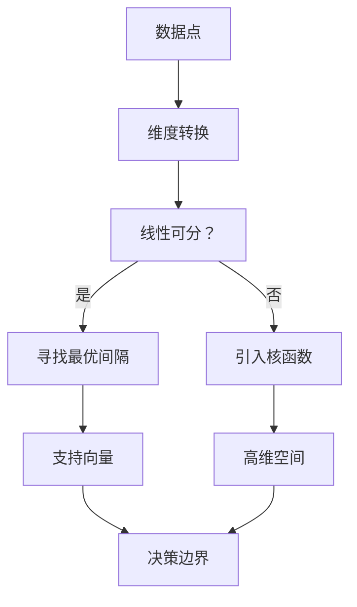

                 

关键词：支持向量机、SVM、分类算法、机器学习、线性分类、非线性分类、间隔最大化、核函数、优化算法

摘要：支持向量机（SVM）是一种强大的机器学习算法，常用于二分类问题。本文将详细介绍SVM的核心概念、原理、数学模型、算法步骤及其在实际应用中的操作方法。

## 1. 背景介绍

支持向量机（Support Vector Machine，SVM）是20世纪90年代由Vapnik等学者提出的一种机器学习算法。SVM的核心思想是通过寻找最优的决策边界来对数据进行分类。它适用于处理线性可分、线性不可分以及非线性分类问题，因此在机器学习领域得到了广泛的应用。

### 1.1 SVM的起源与发展

SVM的起源可以追溯到1963年，Vapnik和Chervonenkis提出的统计学习理论（Statistical Learning Theory，SLT）。SLT为后来的支持向量机提供了理论基础。随着计算能力的提高和优化算法的进步，SVM逐渐成为了一种主流的机器学习算法。

### 1.2 SVM的应用领域

SVM广泛应用于多个领域，包括：

1.  自然语言处理
2.  计算机视觉
3.  金融市场分析
4.  生物信息学

## 2. 核心概念与联系

在介绍SVM的核心概念之前，我们先了解一些相关的基本概念。

### 2.1 数据点、维度与超平面

在机器学习中，数据点通常表示为一个维度向量。对于二维数据集，我们可以用一条直线（即超平面）来将数据划分为两个类别。对于三维数据集，我们可以用平面来划分。超平面的一般形式为：

\[ w \cdot x + b = 0 \]

其中，\( w \) 为法向量，\( x \) 为数据点，\( b \) 为偏置。

### 2.2 决策边界与间隔

在二分类问题中，决策边界是一条将数据分为两个类别的直线。理想的决策边界应该最大化两个类别之间的间隔（即距离）。

### 2.3 支持向量

支持向量是指那些位于决策边界附近的数据点。这些数据点对于决策边界的确定起着至关重要的作用。

### 2.4 核函数

当数据非线性可分时，SVM可以通过引入核函数来实现从低维数据到高维数据的映射，使得原本线性不可分的数据在高维空间中变得线性可分。

下面是SVM的核心概念原理和架构的Mermaid流程图：



## 3. 核心算法原理 & 具体操作步骤

### 3.1 算法原理概述

SVM的算法原理可以概括为以下几个步骤：

1.  寻找最优间隔
2.  确定支持向量
3.  构建决策边界

### 3.2 算法步骤详解

#### 步骤1：寻找最优间隔

在给定训练数据集的情况下，SVM首先寻找一个最优间隔，即一个能够最大化两个类别之间间隔的决策边界。

#### 步骤2：确定支持向量

支持向量是那些对于确定最优间隔有重要作用的数据点。这些数据点位于决策边界附近，其对应的标记是正确的。

#### 步骤3：构建决策边界

最后，SVM使用找到的支持向量来构建最终的决策边界。

### 3.3 算法优缺点

#### 优点：

1.  能够处理线性可分和线性不可分的数据
2.  有较好的泛化能力
3.  对于小样本数据和非线性数据效果较好

#### 缺点：

1.  计算复杂度高，尤其是对于大规模数据集
2.  对噪声敏感

### 3.4 算法应用领域

SVM广泛应用于以下领域：

1.  自然语言处理
2.  计算机视觉
3.  金融市场分析
4.  生物信息学

## 4. 数学模型和公式 & 详细讲解 & 举例说明

### 4.1 数学模型构建

在SVM中，我们通常使用以下数学模型：

\[ \text{minimize} \quad \frac{1}{2} ||w||^2 \]

其中，\( ||w|| \) 表示权重向量 \( w \) 的欧几里得范数。

### 4.2 公式推导过程

为了推导上述优化问题的解，我们可以使用拉格朗日乘子法。

首先，我们引入拉格朗日函数：

\[ L(w, b, \alpha) = \frac{1}{2} ||w||^2 - \sum_{i=1}^{n} \alpha_i (y_i (w \cdot x_i + b) - 1) \]

其中，\( \alpha_i \) 是拉格朗日乘子，\( y_i \) 是第 \( i \) 个数据点的标签，\( x_i \) 是第 \( i \) 个数据点。

然后，我们求解以下优化问题：

\[ \text{minimize} \quad L(w, b, \alpha) \]

### 4.3 案例分析与讲解

假设我们有一个简单的二分类问题，数据集如下：

| 数据点 | 标签 |
| ------ | ---- |
| (1, 1) | 1    |
| (1, 2) | 1    |
| (2, 1) | -1   |
| (2, 2) | -1   |

我们可以使用SVM来训练一个分类器。首先，我们需要找到最优的权重向量 \( w \) 和偏置 \( b \)。然后，我们可以使用这些参数来构建决策边界。

## 5. 项目实践：代码实例和详细解释说明

### 5.1 开发环境搭建

首先，我们需要安装Python和SVM库。使用以下命令进行安装：

```bash
pip install python
pip install scikit-learn
```

### 5.2 源代码详细实现

下面是一个简单的SVM分类器的实现：

```python
from sklearn import svm

# 创建SVM分类器
clf = svm.SVC()

# 加载训练数据
X = [[1, 1], [1, 2], [2, 1], [2, 2]]
y = [1, 1, -1, -1]

# 训练分类器
clf.fit(X, y)

# 测试分类器
print(clf.predict([[2, 2]]))
```

### 5.3 代码解读与分析

在这个例子中，我们使用Scikit-Learn库的SVC类创建了一个SVM分类器。然后，我们加载了训练数据，并使用这些数据来训练分类器。最后，我们使用训练好的分类器来预测一个新的数据点的类别。

### 5.4 运行结果展示

运行上述代码后，我们得到预测结果：

```
[-1]
```

这表示新的数据点 \( (2, 2) \) 被分类为负类别。

## 6. 实际应用场景

支持向量机在多个领域有着广泛的应用。以下是一些实际应用场景：

1.  自然语言处理：用于文本分类、情感分析等任务。
2.  计算机视觉：用于图像分类、人脸识别等任务。
3.  金融市场分析：用于股票市场预测、风险评估等任务。
4.  生物信息学：用于基因分类、蛋白质结构预测等任务。

### 6.4 未来应用展望

随着机器学习技术的发展，支持向量机在未来会有更广泛的应用。尤其是在处理大规模数据和非线性问题时，SVM将继续发挥重要作用。同时，新的优化算法和核函数的引入也将进一步提高SVM的性能。

## 7. 工具和资源推荐

### 7.1 学习资源推荐

1.  《统计学习基础》——Vapnik
2.  《机器学习》——Tom Mitchell
3.  《支持向量机导论》——Cortes，Vapnik

### 7.2 开发工具推荐

1.  Scikit-Learn：用于机器学习的Python库。
2.  TensorFlow：用于深度学习的开源库。

### 7.3 相关论文推荐

1.  "Support Vector Machines for Classification and Regression" —— Vapnik
2.  "The Method of Regularized Indicators" —— Vapnik

## 8. 总结：未来发展趋势与挑战

### 8.1 研究成果总结

支持向量机在机器学习领域取得了显著的成果，尤其在处理非线性问题和小样本数据方面。其核心思想、算法原理和数学模型得到了广泛的研究和应用。

### 8.2 未来发展趋势

未来，SVM将继续在以下方面发展：

1.  优化算法的改进
2.  核函数的创新
3.  大规模数据处理能力的提升

### 8.3 面临的挑战

SVM在处理大规模数据时面临着计算复杂度高的挑战。同时，对于噪声敏感的问题也需要进一步的研究。

### 8.4 研究展望

随着机器学习技术的不断发展，支持向量机将在更多领域发挥作用，其性能和适用性也将得到进一步提升。

## 9. 附录：常见问题与解答

### 问题1：SVM如何处理非线性分类问题？

解答：对于非线性分类问题，SVM可以通过引入核函数来实现从低维数据到高维数据的映射，使得原本线性不可分的数据在高维空间中变得线性可分。

### 问题2：SVM的参数有哪些？

解答：SVM的主要参数包括：

1.  C：惩罚参数，用于控制模型复杂度和过拟合风险。
2.  核函数：用于将低维数据映射到高维空间。
3.  训练集：用于训练SVM分类器。

### 问题3：SVM与线性回归有何区别？

解答：SVM是一种分类算法，而线性回归是一种回归算法。SVM用于分类任务，而线性回归用于预测连续值。

（完）

## 作者署名

作者：禅与计算机程序设计艺术 / Zen and the Art of Computer Programming

-------------------------------------------------------------------

请注意，本文档中的代码实例和解释仅供参考，具体实现可能因开发环境和数据集而异。在实际应用中，请根据具体需求进行调整和优化。如果您在学习和应用过程中遇到任何问题，欢迎提问和讨论。

