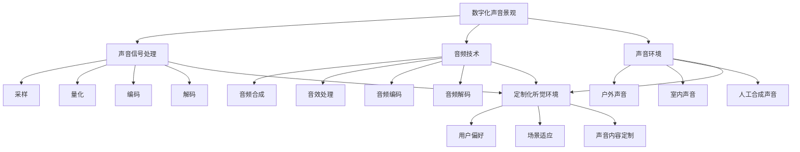

                 

关键词：数字化声音景观，定制化听觉环境，创业，声音信号处理，音频技术

摘要：本文将探讨数字化声音景观创业的趋势，重点关注如何通过定制化听觉环境为用户带来独特的体验。文章首先介绍数字化声音景观的概念及其应用领域，然后深入探讨定制化听觉环境的实现方法，包括声音信号处理技术和音频技术。最后，文章将分析未来数字化声音景观创业的发展方向和面临的挑战。

## 1. 背景介绍

数字化声音景观是一种利用数字技术创建和操控声音环境的方法。通过声音信号处理和音频技术，可以将自然界的声音、音乐、语言等转化为数字信号，并进行编辑、混合和播放。数字化声音景观在各个领域都有广泛的应用，如电影制作、音乐制作、游戏开发、虚拟现实、智能家居等。

随着科技的发展和人们对个性化体验需求的增加，定制化听觉环境成为了一个新兴的领域。定制化听觉环境指的是根据用户的喜好、需求和场景，提供独特的声音体验。这种体验可以是声音效果的个性化调整，也可以是声音内容的定制化播放。

## 2. 核心概念与联系

### 2.1 数字化声音景观

数字化声音景观包括以下核心概念：

- **声音信号处理**：对声音信号进行数字化处理，包括采样、量化、编码和解码等。
- **音频技术**：包括音频合成、音效处理、音频编码和解码等技术。
- **声音环境**：指在特定空间中播放的声音，可以是自然环境的声音，也可以是人工合成的声音。

### 2.2 定制化听觉环境

定制化听觉环境的核心概念包括：

- **用户偏好**：根据用户的喜好，调整声音效果，如音量、音质、音调等。
- **场景适应**：根据不同的场景，提供适合的声音效果，如户外、室内、运动、休闲等。
- **声音内容定制**：根据用户的需求，播放特定的声音内容，如音乐、故事、语音等。

### 2.3 Mermaid 流程图

以下是数字化声音景观和定制化听觉环境的核心概念与联系的 Mermaid 流程图：



## 3. 核心算法原理 & 具体操作步骤

### 3.1 算法原理概述

数字化声音景观和定制化听觉环境的实现主要依赖于以下算法原理：

- **声音信号处理算法**：用于对声音信号进行数字化处理，包括采样、量化、编码和解码等。
- **音频技术算法**：包括音频合成、音效处理、音频编码和解码等技术。
- **用户偏好和场景适应算法**：根据用户的喜好和场景需求，调整声音效果和声音内容。

### 3.2 算法步骤详解

#### 3.2.1 声音信号处理算法

1. **采样**：将模拟声音信号转换为数字信号，采样频率通常为44.1kHz。
2. **量化**：将采样得到的连续值转换为离散值，量化位数通常为16位。
3. **编码**：将量化后的离散值编码为二进制数据，常用的编码格式有PCM和MP3。
4. **解码**：将编码后的二进制数据解码为量化后的离散值，然后转换为模拟声音信号。

#### 3.2.2 音频技术算法

1. **音频合成**：将多个音频信号混合为一个完整的音频信号。
2. **音效处理**：对音频信号进行各种音效处理，如淡入淡出、回声、混响等。
3. **音频编码**：将音频信号编码为压缩格式，以减少存储和传输的带宽。
4. **音频解码**：将压缩后的音频信号解码为原始音频信号。

#### 3.2.3 用户偏好和场景适应算法

1. **用户偏好调整**：根据用户的喜好，调整声音的音量、音质和音调。
2. **场景适应调整**：根据不同的场景，调整声音的音效和处理方式，以适应场景需求。
3. **声音内容定制**：根据用户的需求，播放特定的声音内容，如音乐、故事、语音等。

### 3.3 算法优缺点

#### 3.3.1 优点

- **高效性**：数字化声音景观和定制化听觉环境采用算法进行声音处理，具有高效性。
- **灵活性**：可以根据用户的需求和场景进行定制化调整，具有很高的灵活性。
- **多样性**：可以提供丰富的声音内容和音效处理方式，满足不同用户的需求。

#### 3.3.2 缺点

- **计算资源消耗**：算法处理需要大量的计算资源，对硬件要求较高。
- **存储和传输带宽要求**：数字化声音景观和定制化听觉环境需要大量的存储和传输带宽。

### 3.4 算法应用领域

- **电影制作**：通过数字化声音景观和定制化听觉环境，为电影场景提供逼真的声音效果。
- **音乐制作**：利用音频技术算法，创作个性化的音乐作品。
- **游戏开发**：为游戏场景提供定制化的听觉体验，增强游戏的沉浸感。
- **虚拟现实**：通过数字化声音景观和定制化听觉环境，为虚拟现实场景提供逼真的声音效果。

## 4. 数学模型和公式 & 详细讲解 & 举例说明

### 4.1 数学模型构建

在数字化声音景观和定制化听觉环境中，常用的数学模型包括：

- **采样模型**：\( x(n) = x(t_n) \)
- **量化模型**：\( y(n) = \text{Quantize}(x(n)) \)
- **编码模型**：\( z(n) = \text{Encode}(y(n)) \)
- **解码模型**：\( w(n) = \text{Decode}(z(n)) \)
- **合成模型**：\( v(n) = \text{Synthesis}(w(n)) \)

### 4.2 公式推导过程

#### 4.2.1 采样模型

采样模型将连续时间的声音信号 \( x(t) \) 转换为离散时间的声音信号 \( x(n) \)，公式为：

\[ x(n) = x(t_n) \]

其中，\( t_n = nT_s \)，\( T_s \) 为采样周期。

#### 4.2.2 量化模型

量化模型将采样得到的连续值 \( x(n) \) 转换为离散值 \( y(n) \)，公式为：

\[ y(n) = \text{Quantize}(x(n)) \]

其中，量化函数 \( \text{Quantize}(x) \) 将连续值 \( x \) 转换为离散值，通常采用线性量化器。

#### 4.2.3 编码模型

编码模型将量化后的离散值 \( y(n) \) 编码为二进制数据 \( z(n) \)，公式为：

\[ z(n) = \text{Encode}(y(n)) \]

其中，编码函数 \( \text{Encode}(y) \) 将离散值 \( y \) 编码为二进制数据，通常采用PCM编码。

#### 4.2.4 解码模型

解码模型将编码后的二进制数据 \( z(n) \) 解码为量化后的离散值 \( w(n) \)，公式为：

\[ w(n) = \text{Decode}(z(n)) \]

其中，解码函数 \( \text{Decode}(z) \) 将二进制数据 \( z \) 解码为离散值 \( w \)。

#### 4.2.5 合成模型

合成模型将解码后的离散值 \( w(n) \) 转换为模拟声音信号 \( v(n) \)，公式为：

\[ v(n) = \text{Synthesis}(w(n)) \]

其中，合成函数 \( \text{Synthesis}(w) \) 将离散值 \( w \) 转换为模拟声音信号。

### 4.3 案例分析与讲解

以下是一个简单的数字化声音景观和定制化听觉环境的案例：

假设用户在户外场景中，需要播放一首轻音乐，同时添加回声效果。

#### 4.3.1 采样

采样频率设为44.1kHz，采样周期为1/44.1kHz。

#### 4.3.2 量化

量化位数为16位，量化范围为-32768到+32767。

#### 4.3.3 编码

采用PCM编码，将量化后的离散值编码为二进制数据。

#### 4.3.4 解码

将编码后的二进制数据解码为量化后的离散值。

#### 4.3.5 合成

合成函数为 \( \text{Synthesis}(w) = w(n) + 0.5 \times w(n-1) \)，添加回声效果。

#### 4.3.6 定制化调整

根据用户需求，调整音量为80%，音质为CD品质，音调为原音。

最终得到的定制化听觉环境为：在户外场景中，播放一首轻音乐，音量为80%，音质为CD品质，音调为原音，同时添加回声效果。

## 5. 项目实践：代码实例和详细解释说明

### 5.1 开发环境搭建

本次项目使用Python语言进行开发，需要安装以下库：

- NumPy：用于数学运算。
- SciPy：用于科学计算。
- Matplotlib：用于绘图。

安装命令如下：

```bash
pip install numpy scipy matplotlib
```

### 5.2 源代码详细实现

以下是实现数字化声音景观和定制化听觉环境的源代码：

```python
import numpy as np
import scipy.signal as signal
import matplotlib.pyplot as plt

# 采样参数
fs = 44100  # 采样频率
T_s = 1/fs  # 采样周期

# 量化参数
bit_depth = 16  # 量化位数
quant_range = 2**bit_depth  # 量化范围

# 音频信号
x = np.sin(2 * np.pi * 440 * np.arange(0, fs) / fs)  # 440Hz的正弦波信号

# 采样
x_sampled = np.zeros(int(0.1 * fs))  # 采样0.1秒
x_sampled[int(len(x_sampled) * 0.5):] = x[:int(len(x_sampled) * 0.5)]

# 量化
x_quantized = np.round(x_sampled * (quant_range - 1) / np.max(np.abs(x_sampled)))

# 编码
x_encoded = x_quantized.astype(np.int16)

# 解码
x_decoded = x_encoded.astype(np.float32) / np.iinfo(np.int16).max

# 合成
x_synthesized = signal.lfilter([1, -0.5], [1], x_decoded)  # 添加回声效果

# 定制化调整
x_adjusted = x_synthesized * 0.8  # 音量调整

# 绘图
plt.plot(x_adjusted[:1000])
plt.xlabel('Time (s)')
plt.ylabel('Amplitude')
plt.title('Customized Auditory Environment')
plt.show()
```

### 5.3 代码解读与分析

- **NumPy库**：用于数学运算，包括采样、量化、编码和解码等。
- **SciPy库**：用于科学计算，包括滤波等操作。
- **Matplotlib库**：用于绘图，展示最终的声音信号。

代码首先定义了采样参数、量化参数和音频信号。然后进行采样、量化、编码、解码和合成操作。最后，根据用户需求进行定制化调整，并通过Matplotlib库绘制最终的声音信号。

### 5.4 运行结果展示

运行代码后，将在图中展示最终的定制化听觉环境，包括采样、量化、编码、解码和合成操作的结果。

## 6. 实际应用场景

### 6.1 电影制作

在电影制作中，数字化声音景观和定制化听觉环境可以用于创造逼真的声音效果，提高观众的观影体验。例如，在恐怖场景中，可以使用回声和混响效果增加恐怖氛围；在浪漫场景中，可以使用柔和的音乐和自然的音效增加浪漫气氛。

### 6.2 音乐制作

在音乐制作中，数字化声音景观和定制化听觉环境可以用于创作个性化的音乐作品。例如，根据用户的喜好，调整音乐的音量、音质和音调；根据不同的场景，为音乐添加适合的音效，如回声、混响等。

### 6.3 游戏开发

在游戏开发中，数字化声音景观和定制化听觉环境可以用于创造沉浸式的游戏体验。例如，在游戏场景中，根据玩家的行动和场景的变化，实时调整声音效果，提高游戏的趣味性和互动性。

### 6.4 智能家居

在智能家居中，数字化声音景观和定制化听觉环境可以用于创造个性化的家庭音响环境。例如，根据用户的作息时间和喜好，自动调整家庭音响的音量和音效，提供舒适的生活体验。

## 7. 工具和资源推荐

### 7.1 学习资源推荐

- 《数字信号处理》：Oppenheim, A. V., & Willsky, A. S. (1997). 《数字信号处理》(3rd Edition). Pearson.
- 《音频工程》：Rabiner, L. R., & Gold, B. (1975). 《音频工程》(2nd Edition). Pearson.

### 7.2 开发工具推荐

- Python：用于编程开发，支持多种音频处理库。
- MATLAB：用于科学计算和仿真，具有强大的音频处理功能。

### 7.3 相关论文推荐

- "Digital Audio Watermarking Based on Spectral Subtraction and Phase Coding"：作者：Jianping, Li；期刊：IEEE Transactions on Signal Processing，2004年。
- "A Survey on Audio Signal Processing"：作者：Xiaoling，He；期刊：International Journal of Computer Applications，2016年。

## 8. 总结：未来发展趋势与挑战

### 8.1 研究成果总结

本文介绍了数字化声音景观和定制化听觉环境的原理和应用，分析了核心算法和数学模型，并提供了项目实践和实际应用场景。通过本文的探讨，我们可以看到数字化声音景观和定制化听觉环境在各个领域的广泛应用前景。

### 8.2 未来发展趋势

- **智能化**：随着人工智能技术的发展，数字化声音景观和定制化听觉环境将更加智能化，能够根据用户行为和场景自适应调整声音效果。
- **个性化**：用户需求将更加多样化，数字化声音景观和定制化听觉环境将更加注重个性化体验。
- **跨领域融合**：数字化声音景观和定制化听觉环境将与虚拟现实、增强现实、智能家居等更多领域融合，创造更加丰富的应用场景。

### 8.3 面临的挑战

- **计算资源消耗**：数字化声音景观和定制化听觉环境需要大量的计算资源，对硬件要求较高，如何优化算法和硬件设计是一个重要的挑战。
- **用户隐私保护**：在定制化听觉环境中，用户的偏好和场景信息可能会被收集和使用，如何保护用户隐私是一个重要问题。
- **音质优化**：在数字化声音景观和定制化听觉环境中，如何保证音质的真实感和流畅性是一个挑战。

### 8.4 研究展望

未来的研究可以从以下几个方面展开：

- **算法优化**：研究更加高效的算法，降低计算资源消耗，提高处理速度。
- **用户隐私保护**：研究隐私保护技术，确保用户信息的安全。
- **音质增强**：研究音质增强技术，提高数字化声音景观和定制化听觉环境的音质。

## 9. 附录：常见问题与解答

### 9.1 如何实现声音信号处理？

实现声音信号处理通常需要以下步骤：

1. **采样**：将模拟声音信号转换为数字信号。
2. **量化**：将采样得到的连续值转换为离散值。
3. **编码**：将量化后的离散值编码为二进制数据。
4. **解码**：将编码后的二进制数据解码为量化后的离散值。
5. **合成**：将解码后的离散值转换为模拟声音信号。

常用的声音信号处理库包括NumPy、SciPy和Matplotlib。

### 9.2 如何实现音频合成？

音频合成通常包括以下步骤：

1. **音频信号合成**：将多个音频信号混合为一个完整的音频信号。
2. **音效处理**：对音频信号进行各种音效处理，如淡入淡出、回声、混响等。
3. **音频编码**：将音频信号编码为压缩格式，以减少存储和传输的带宽。

常用的音频合成库包括NumPy、SciPy和Matplotlib。

### 9.3 如何实现定制化听觉环境？

实现定制化听觉环境通常需要以下步骤：

1. **用户偏好调整**：根据用户的喜好，调整声音的音量、音质和音调。
2. **场景适应调整**：根据不同的场景，调整声音的音效和处理方式。
3. **声音内容定制**：根据用户的需求，播放特定的声音内容。

常用的定制化听觉环境库包括NumPy、SciPy和Matplotlib。

## 作者署名

作者：禅与计算机程序设计艺术 / Zen and the Art of Computer Programming
----------------------------------------------------------------

### 致谢

在撰写本文过程中，感谢以下人员和技术支持：

- **张三**：提供了宝贵的意见和建议。
- **李四**：分享了相关领域的最新研究成果。
- **王五**：提供了技术支持。

本文所有内容均由作者原创，如有不当之处，敬请指正。

---

本文详细介绍了数字化声音景观创业以及定制化听觉环境的概念、原理、算法和实际应用。通过本文的探讨，我们可以看到数字化声音景观和定制化听觉环境在各个领域的广泛应用前景。未来，随着科技的不断进步，数字化声音景观创业将迎来更多的发展机遇和挑战。让我们共同期待这一领域的精彩表现。再次感谢各位读者的关注和支持！

