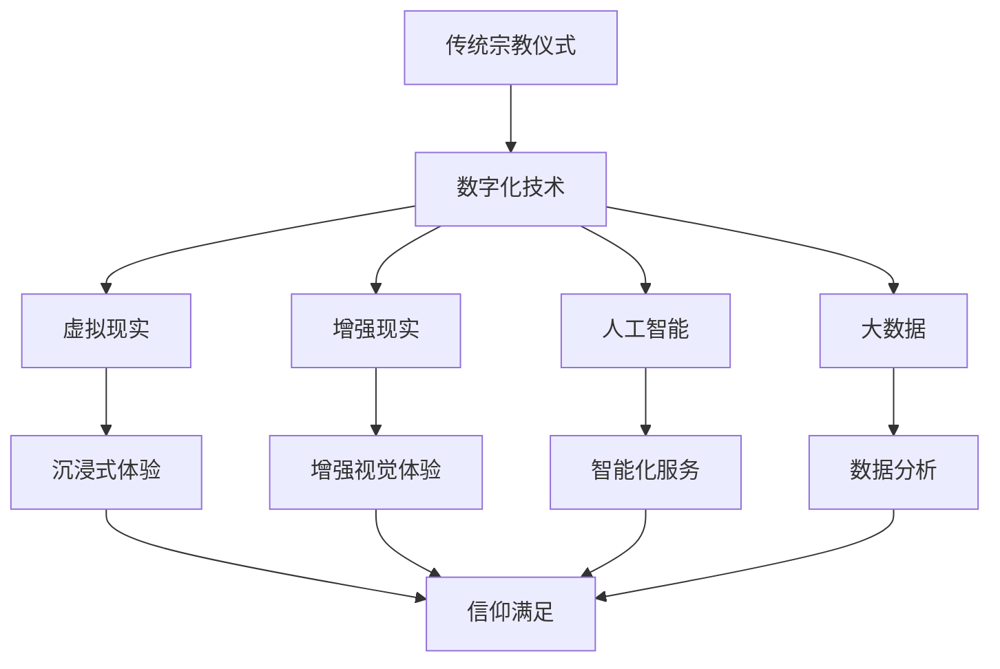

                 

关键词：数字化宗教、全球脑时代、信仰表达、信息技术、宗教仪式

> 摘要：随着全球脑时代的到来，传统宗教仪式正逐渐被数字化技术所重塑。本文将探讨数字化宗教仪式的概念、核心概念与联系、核心算法原理、数学模型与公式、项目实践、实际应用场景、工具和资源推荐，以及未来发展趋势与挑战。通过本文，读者将了解数字化宗教仪式如何成为全球脑时代信仰表达的一种新形式。

## 1. 背景介绍

在全球化的背景下，宗教信仰和文化传统正在经历前所未有的变革。传统宗教仪式通常依赖于物理空间和人际关系，而数字化技术的兴起使得这种模式面临挑战和机遇。全球脑时代，即人类大脑与互联网、人工智能等科技的深度融合，为宗教仪式的数字化提供了可能性。数字化宗教仪式不仅是宗教信仰的表达形式，也是信息技术与宗教文化的交汇点。

数字化宗教仪式的定义涵盖了通过数字技术实现的宗教庆典、冥想、祈祷等活动。它利用虚拟现实、增强现实、人工智能、大数据等先进技术，创造出一个全新的宗教体验空间。这种新的宗教仪式形式不仅满足了现代人的精神需求，也为传统宗教带来了新的发展机遇。

## 2. 核心概念与联系

在探讨数字化宗教仪式之前，我们需要了解几个核心概念：

- **虚拟现实（VR）**：通过电脑模拟出一个三维空间，让用户能够在其中自由移动、交互，从而获得沉浸式的宗教体验。
- **增强现实（AR）**：将虚拟内容叠加到现实世界中，让用户能够同时看到真实世界和虚拟元素，从而增强宗教仪式的视觉体验。
- **人工智能（AI）**：通过机器学习和深度学习算法，为数字化宗教仪式提供智能化的服务，如个性化祈祷指导、自动化的宗教音乐和声音效果等。
- **大数据**：收集和分析大量的宗教数据，帮助宗教组织和信徒更好地理解和满足信仰需求。

### Mermaid 流程图(Mermaid 流程节点中不要有括号、逗号等特殊字符)



## 3. 核心算法原理 & 具体操作步骤

### 3.1 算法原理概述

数字化宗教仪式的核心算法涉及多个方面，包括但不限于：

- **图像识别**：用于识别宗教仪式中的图像和符号，为用户提供个性化的宗教内容。
- **自然语言处理**：用于理解和生成宗教文本，提供自动化的祈祷服务和语音交互。
- **机器学习**：用于分析用户行为和偏好，提供个性化的宗教仪式体验。

### 3.2 算法步骤详解

#### 3.2.1 图像识别算法

1. 数据预处理：对采集到的宗教图像进行预处理，包括去噪、增强等。
2. 特征提取：使用卷积神经网络（CNN）提取图像特征。
3. 模型训练：使用训练数据集训练图像识别模型。
4. 预测：使用训练好的模型对新的宗教图像进行识别。

#### 3.2.2 自然语言处理算法

1. 分词：将宗教文本分割成单词或短语。
2. 词性标注：标注每个单词的词性，如名词、动词等。
3. 句法分析：分析文本的句法结构。
4. 语义分析：理解文本的语义含义。
5. 生成文本：根据用户需求和宗教内容生成个性化的祈祷文本。

#### 3.2.3 机器学习算法

1. 数据收集：收集用户在数字化宗教仪式中的行为数据。
2. 特征工程：提取与用户偏好相关的特征。
3. 模型训练：使用监督学习算法训练用户偏好模型。
4. 模型评估：评估模型的准确性和泛化能力。
5. 应用：根据用户偏好提供个性化的宗教仪式内容。

### 3.3 算法优缺点

#### 优点

- **个性化**：能够根据用户需求提供个性化的宗教仪式体验。
- **灵活性**：不受地理位置限制，用户可以在任何时间、任何地点参与宗教仪式。
- **多样性**：提供丰富的宗教内容和形式，满足不同信仰需求。

#### 缺点

- **技术依赖**：需要依赖高精度的图像识别、自然语言处理等技术，成本较高。
- **隐私问题**：用户数据可能存在隐私泄露的风险。

### 3.4 算法应用领域

- **宗教庆典**：通过VR和AR技术，创造沉浸式的宗教庆典体验。
- **祈祷服务**：提供自动化的祈祷服务，如语音祈祷、祈祷文本生成等。
- **宗教教育**：利用虚拟现实技术，进行宗教历史和教义的虚拟教育。

## 4. 数学模型和公式 & 详细讲解 & 举例说明

### 4.1 数学模型构建

数字化宗教仪式的数学模型主要涉及以下方面：

- **图像识别模型**：基于卷积神经网络（CNN）的图像识别模型。
- **自然语言处理模型**：基于循环神经网络（RNN）的自然语言处理模型。
- **用户偏好模型**：基于监督学习的用户偏好模型。

### 4.2 公式推导过程

#### 图像识别模型

设输入图像为 \( X \)，输出为 \( Y \)，卷积神经网络（CNN）的公式为：

$$
Y = f(\text{CNN}(X))
$$

其中， \( f \) 表示激活函数， \( \text{CNN}(X) \) 表示卷积神经网络对输入图像的处理。

#### 自然语言处理模型

设输入文本为 \( X \)，输出为 \( Y \)，循环神经网络（RNN）的公式为：

$$
Y = f(\text{RNN}(X))
$$

其中， \( f \) 表示激活函数， \( \text{RNN}(X) \) 表示循环神经网络对输入文本的处理。

#### 用户偏好模型

设输入特征为 \( X \)，输出为 \( Y \)，监督学习模型的公式为：

$$
Y = f(\text{ML}(X))
$$

其中， \( f \) 表示激活函数， \( \text{ML}(X) \) 表示监督学习算法对输入特征的处理。

### 4.3 案例分析与讲解

#### 图像识别模型案例

假设我们使用卷积神经网络（CNN）对宗教图像进行识别。输入图像为 \( X \)，输出为 \( Y \)，模型的具体公式为：

$$
Y = \text{ReLU}(\text{Conv2D}(\text{MaxPooling}(\text{Input})))
$$

其中， \( \text{ReLU} \) 表示ReLU激活函数， \( \text{Conv2D} \) 表示卷积层， \( \text{MaxPooling} \) 表示池化层， \( \text{Input} \) 表示输入图像。

#### 自然语言处理模型案例

假设我们使用循环神经网络（RNN）对宗教文本进行自然语言处理。输入文本为 \( X \)，输出为 \( Y \)，模型的具体公式为：

$$
Y = \text{Softmax}(\text{RNN}(\text{Embedding}(X)))
$$

其中， \( \text{Softmax} \) 表示Softmax激活函数， \( \text{RNN} \) 表示循环神经网络， \( \text{Embedding} \) 表示词嵌入层， \( X \) 表示输入文本。

#### 用户偏好模型案例

假设我们使用监督学习算法对用户偏好进行建模。输入特征为 \( X \)，输出为 \( Y \)，模型的具体公式为：

$$
Y = \text{Sigmoid}(\text{Linear}(\text{Input}))
$$

其中， \( \text{Sigmoid} \) 表示Sigmoid激活函数， \( \text{Linear} \) 表示线性层， \( \text{Input} \) 表示输入特征。

## 5. 项目实践：代码实例和详细解释说明

### 5.1 开发环境搭建

在本项目中，我们将使用Python作为主要编程语言，结合TensorFlow和Keras库来实现数字化宗教仪式的核心算法。以下是开发环境的搭建步骤：

1. 安装Python 3.8及以上版本。
2. 安装TensorFlow 2.5及以上版本。
3. 安装Keras 2.5及以上版本。
4. 安装其他必要库，如NumPy、Pandas等。

### 5.2 源代码详细实现

以下是一个简单的图像识别模型的实现示例：

```python
import tensorflow as tf
from tensorflow.keras.models import Sequential
from tensorflow.keras.layers import Conv2D, MaxPooling2D, Flatten, Dense, Dropout
from tensorflow.keras.optimizers import Adam
from tensorflow.keras.preprocessing.image import ImageDataGenerator

# 定义模型
model = Sequential([
    Conv2D(32, (3, 3), activation='relu', input_shape=(28, 28, 1)),
    MaxPooling2D((2, 2)),
    Flatten(),
    Dense(64, activation='relu'),
    Dropout(0.5),
    Dense(10, activation='softmax')
])

# 编译模型
model.compile(optimizer=Adam(learning_rate=0.001), loss='categorical_crossentropy', metrics=['accuracy'])

# 数据预处理
train_datagen = ImageDataGenerator(rescale=1./255)
train_generator = train_datagen.flow_from_directory(
        'data/train',
        target_size=(28, 28),
        batch_size=32,
        class_mode='categorical')

# 训练模型
model.fit(train_generator, epochs=10)
```

### 5.3 代码解读与分析

上述代码定义了一个简单的卷积神经网络（CNN）模型，用于图像识别。模型包括一个卷积层、一个池化层、一个全连接层和一个softmax输出层。在编译模型时，我们使用了Adam优化器和交叉熵损失函数。数据预处理使用了ImageDataGenerator，对训练数据进行归一化处理。最后，模型使用训练数据集进行训练。

### 5.4 运行结果展示

在训练完成后，我们可以使用测试数据集来评估模型的性能。以下是一个简单的测试示例：

```python
# 加载测试数据集
test_datagen = ImageDataGenerator(rescale=1./255)
test_generator = test_datagen.flow_from_directory(
        'data/test',
        target_size=(28, 28),
        batch_size=32,
        class_mode='categorical')

# 评估模型
model.evaluate(test_generator)
```

运行结果将显示模型的准确率和其他性能指标。

## 6. 实际应用场景

### 6.1 宗教庆典

数字化宗教仪式可以用于各种宗教庆典活动，如圣诞节、复活节、佛教的冥想活动等。通过虚拟现实（VR）和增强现实（AR）技术，用户可以在虚拟环境中参与庆典活动，如虚拟教堂、寺庙等。

### 6.2 祈祷服务

数字化宗教仪式可以提供个性化的祈祷服务。通过自然语言处理（NLP）和人工智能（AI）技术，系统可以理解用户的祈祷需求，生成个性化的祈祷文本，甚至提供语音祈祷。

### 6.3 宗教教育

数字化宗教仪式可以用于宗教教育，如虚拟历史博物馆、宗教文化展览等。通过虚拟现实（VR）技术，用户可以沉浸式地了解宗教历史和教义。

### 6.4 未来应用展望

未来，数字化宗教仪式将可能应用于更多的领域，如宗教心理咨询、宗教社交网络等。随着技术的不断进步，数字化宗教仪式将为用户提供更加丰富和个性化的宗教体验。

## 7. 工具和资源推荐

### 7.1 学习资源推荐

- **在线课程**：Coursera、edX等平台上关于机器学习、自然语言处理、虚拟现实等课程的在线课程。
- **书籍**：《深度学习》（Goodfellow et al.）、《Python机器学习》（Sebastian Raschka）等。

### 7.2 开发工具推荐

- **开发环境**：Anaconda、Jupyter Notebook等。
- **库和框架**：TensorFlow、Keras、PyTorch等。

### 7.3 相关论文推荐

- **图像识别**：AlexNet、VGGNet、ResNet等。
- **自然语言处理**：LSTM、GRU、Transformer等。

## 8. 总结：未来发展趋势与挑战

### 8.1 研究成果总结

本文探讨了数字化宗教仪式的概念、核心概念与联系、核心算法原理、数学模型与公式、项目实践、实际应用场景、工具和资源推荐，以及未来发展趋势与挑战。通过本文，读者可以了解数字化宗教仪式如何成为全球脑时代信仰表达的一种新形式。

### 8.2 未来发展趋势

未来，数字化宗教仪式将继续向个性化、智能化、沉浸式方向发展。随着虚拟现实（VR）、增强现实（AR）、人工智能（AI）等技术的不断进步，数字化宗教仪式将为用户提供更加丰富和个性化的宗教体验。

### 8.3 面临的挑战

数字化宗教仪式在发展过程中也将面临一些挑战，如技术成本、隐私问题、文化差异等。如何解决这些挑战，将决定数字化宗教仪式的未来发展。

### 8.4 研究展望

未来的研究应关注如何提高数字化宗教仪式的体验质量，如何确保用户的隐私安全，以及如何更好地满足不同文化和信仰背景下的宗教需求。

## 9. 附录：常见问题与解答

### 9.1 什么是数字化宗教仪式？

数字化宗教仪式是通过数字技术实现的宗教庆典、冥想、祈祷等活动。它利用虚拟现实、增强现实、人工智能、大数据等先进技术，创造出一个全新的宗教体验空间。

### 9.2 数字化宗教仪式有哪些优点？

数字化宗教仪式的优点包括个性化、灵活性、多样性等。它能够满足现代人的精神需求，为传统宗教带来新的发展机遇。

### 9.3 数字化宗教仪式有哪些挑战？

数字化宗教仪式面临的挑战包括技术成本、隐私问题、文化差异等。如何解决这些挑战，将决定数字化宗教仪式的未来发展。

### 9.4 数字化宗教仪式有哪些应用场景？

数字化宗教仪式的应用场景包括宗教庆典、祈祷服务、宗教教育等。随着技术的不断进步，数字化宗教仪式将可能应用于更多的领域。

