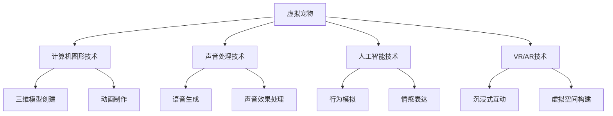

                 

关键词：数字化宠物，虚拟宠物，情感价值，宠物创业，人工智能

> 摘要：本文将探讨数字化宠物的概念、发展背景以及其在宠物创业中的情感价值。通过对虚拟宠物技术的深入分析，本文旨在揭示数字化宠物在未来宠物行业中的重要性和潜在的商业机会。

## 1. 背景介绍

随着人工智能技术的不断发展和普及，虚拟宠物已经成为一个备受关注的领域。虚拟宠物，简单来说，是通过计算机图形、声音、人工智能等技术创造的虚拟生命体，它们可以模拟真实宠物的行为、情感和互动。近年来，随着虚拟现实（VR）和增强现实（AR）技术的进步，虚拟宠物的互动体验得到了极大的提升，开始逐步进入大众的日常生活。

宠物行业作为全球消费市场中一个重要的细分领域，随着人们对宠物的情感需求和消费能力的提升，正呈现出高速增长的态势。然而，传统的宠物产业在满足人们情感需求方面存在一定的局限性，无法完全满足现代消费者的多元化需求。在这种情况下，数字化宠物的出现为宠物行业带来了新的机遇。

### 虚拟宠物的起源与发展

虚拟宠物的概念最早可以追溯到20世纪80年代，当时的计算机图形技术和人工智能还处于初级阶段。最早的虚拟宠物如Tamagotchi（宠物小精灵）是一种简单的电子宠物，用户可以通过按钮与它们互动，虽然它们无法模拟真实宠物的复杂行为，但已经在一定程度上满足了人们的情感需求。

进入21世纪，随着计算机图形和人工智能技术的飞速发展，虚拟宠物的形态和互动体验得到了显著提升。例如，Nintendogs和Pokémon系列游戏中的虚拟宠物不仅在外形上更加逼真，而且在行为和情感上也有了更高的仿真度。同时，虚拟宠物的互动方式也从早期的简单按钮操作，发展成为通过触摸屏、语音识别和动作捕捉等多种方式与用户互动。

近年来，随着虚拟现实（VR）和增强现实（AR）技术的成熟，虚拟宠物的互动体验进一步提升。用户可以通过VR设备与虚拟宠物进行身临其境的互动，甚至可以在虚拟空间中与虚拟宠物共同生活。这种沉浸式的互动体验，极大地增强了虚拟宠物的情感价值。

### 宠物行业的需求变化

随着社会经济的发展和人们生活水平的提高，宠物行业正经历着深刻的变革。传统的宠物产业主要围绕宠物的饲养、护理和医疗等方面，虽然这些服务在保障宠物健康和满足基本需求方面发挥了重要作用，但在满足人们情感需求方面存在一定的局限性。

首先，传统宠物产业无法满足现代消费者对个性化、定制化服务的需求。随着社会多样性的增加，人们对宠物的喜好和需求也变得多样化，传统宠物产业无法提供足够的定制化产品和服务。

其次，随着生活节奏的加快和工作压力的增大，许多人无法承担养真实宠物所带来的时间和经济成本。虚拟宠物作为一种低成本、低维护的替代品，能够满足人们养宠物的情感需求，同时避免了真实宠物的种种不便。

最后，虚拟宠物作为一种新兴的互动体验，能够提供更加丰富和有趣的宠物生活体验。通过虚拟宠物，用户可以体验到与真实宠物相似的情感交流和互动乐趣，这在一定程度上弥补了真实宠物的不足。

## 2. 核心概念与联系

### 虚拟宠物的核心概念

虚拟宠物是一种通过计算机图形、声音、人工智能等技术创造的虚拟生命体。它们具有以下核心概念：

- **外形和特征**：虚拟宠物通常具有独特的外形和特征，这些特征可以通过计算机图形技术进行设计和定制。虚拟宠物可以是真实宠物的模仿，也可以是全新的创意设计。
- **行为和情感**：虚拟宠物可以通过人工智能技术模拟真实宠物的行为和情感。它们可以吃饭、睡觉、玩耍，甚至可以表现出喜怒哀乐等情感。
- **互动方式**：虚拟宠物与用户的互动方式多种多样，包括触摸屏、语音识别、动作捕捉等。这些互动方式使得虚拟宠物能够与用户进行更加自然和丰富的交流。
- **生态系统**：虚拟宠物不仅仅是单一的虚拟生命体，它们可以存在于一个庞大的虚拟生态系统中，与其他虚拟宠物互动，共同构建一个虚拟宠物世界。

### 虚拟宠物的关联技术与架构

虚拟宠物的实现需要多种关联技术的支持，以下是一个基本的架构：

- **计算机图形技术**：用于创建虚拟宠物的三维模型和动画，使其具有逼真的外观和动作。
- **声音处理技术**：用于生成虚拟宠物的语音和声音效果，增强其互动体验。
- **人工智能技术**：用于模拟虚拟宠物的行为和情感，使其能够与用户进行自然交流。
- **虚拟现实（VR）和增强现实（AR）技术**：用于提供沉浸式的虚拟宠物互动体验，使用户能够身临其境地与虚拟宠物互动。

### Mermaid 流程图

以下是一个简化的 Mermaid 流程图，展示了虚拟宠物的核心概念和关联技术：



### 核心概念之间的联系

虚拟宠物的核心概念之间存在着紧密的联系。计算机图形技术和声音处理技术为虚拟宠物提供了逼真的外观和声音效果，使它们能够被用户所接受。人工智能技术则使得虚拟宠物能够模拟真实宠物的行为和情感，与用户进行自然交流。虚拟现实和增强现实技术则提供了沉浸式的互动体验，使用户能够与虚拟宠物共同生活。

通过这些技术的综合运用，虚拟宠物不仅能够满足用户的情感需求，还能够提供一种全新的生活方式。这种生活方式不仅局限于个人娱乐，还可以延伸到社交、教育、医疗等多个领域，具有广泛的应用前景。

## 3. 核心算法原理 & 具体操作步骤

### 3.1 算法原理概述

虚拟宠物的核心算法主要涉及计算机图形、声音处理和人工智能技术。这些算法的工作原理如下：

- **计算机图形算法**：通过三维建模和动画技术，创建虚拟宠物的外观和动作。常用的算法包括蒙皮动画（Skinning Animation）和物理模拟（Physics Simulation）。
- **声音处理算法**：通过语音合成和声音效果处理，生成虚拟宠物的语音和声音效果。常用的算法包括文本到语音（Text-to-Speech，TTS）和声音增强（Sound Effects Processing）。
- **人工智能算法**：通过机器学习和自然语言处理技术，模拟虚拟宠物的行为和情感。常用的算法包括行为树（Behavior Trees）和情感模型（Emotion Models）。

### 3.2 算法步骤详解

#### 3.2.1 计算机图形算法

1. **三维模型创建**：
   - 收集虚拟宠物的参考图片和设计需求。
   - 使用三维建模软件（如Blender、Maya）创建虚拟宠物的三维模型。
   - 进行细节调整，确保模型符合设计需求。

2. **动画制作**：
   - 使用动画软件（如3ds Max、Unity）为虚拟宠物制作动画。
   - 使用蒙皮动画技术，将骨骼动画应用到虚拟宠物模型上。
   - 使用物理模拟技术，为虚拟宠物的动作添加物理效果，使其更加真实。

#### 3.2.2 声音处理算法

1. **语音合成**：
   - 收集虚拟宠物的语音样本。
   - 使用文本到语音（TTS）算法，将文本转换为语音。
   - 对生成的语音进行音调、音速和音量的调整，使其更符合虚拟宠物的个性。

2. **声音效果处理**：
   - 使用声音增强算法，为虚拟宠物添加各种声音效果，如脚步声、口呼吸声等。
   - 使用混音技术，将不同声音效果融合在一起，形成完整的虚拟宠物声音系统。

#### 3.2.3 人工智能算法

1. **行为树**：
   - 定义虚拟宠物的行为树，包括基本动作、情感反应和特殊动作。
   - 根据用户输入和虚拟宠物的状态，动态选择合适的动作和行为。

2. **情感模型**：
   - 收集虚拟宠物的情感数据，如快乐、悲伤、兴奋等。
   - 使用情感模型，根据虚拟宠物的行为和用户互动，动态调整虚拟宠物的情感状态。

### 3.3 算法优缺点

#### 优点

- **逼真的视觉效果**：计算机图形算法可以创建出非常逼真的虚拟宠物外观和动作，为用户带来沉浸式的互动体验。
- **自然的语音效果**：声音处理算法可以生成自然流畅的语音，增强虚拟宠物的互动体验。
- **智能的行为和情感**：人工智能算法可以模拟虚拟宠物的行为和情感，使其更加智能和具有人性化的互动。

#### 缺点

- **计算资源消耗大**：虚拟宠物的创建和运行需要大量的计算资源，对硬件性能有较高要求。
- **数据收集和处理难度大**：虚拟宠物的行为和情感数据需要大量的收集和处理，对数据采集和分析有较高要求。

### 3.4 算法应用领域

虚拟宠物算法的应用领域非常广泛，包括但不限于以下领域：

- **娱乐与游戏**：虚拟宠物可以作为游戏中的角色，提供沉浸式的游戏体验。
- **教育**：虚拟宠物可以作为教育工具，用于教学互动和知识传播。
- **医疗康复**：虚拟宠物可以用于医疗康复，帮助患者进行情感治疗和康复训练。
- **社交互动**：虚拟宠物可以作为社交平台的虚拟角色，提供社交互动和情感交流。

## 4. 数学模型和公式 & 详细讲解 & 举例说明

### 4.1 数学模型构建

虚拟宠物的数学模型主要包括以下三个方面：

1. **三维模型构建**：
   - 使用三维几何学中的点、线、面等基本元素构建虚拟宠物的几何模型。
   - 使用三角函数、向量运算等数学方法对模型进行变形和调整。

2. **声音处理模型**：
   - 使用傅里叶变换（Fourier Transform）分析声音信号，提取声音的特征。
   - 使用卷积（Convolution）和滤波（Filtering）技术进行声音效果处理。

3. **人工智能模型**：
   - 使用机器学习中的决策树（Decision Tree）、支持向量机（Support Vector Machine，SVM）等方法构建行为和情感模型。
   - 使用神经网络（Neural Network）和深度学习（Deep Learning）方法进行行为和情感的预测和调整。

### 4.2 公式推导过程

以下是虚拟宠物数学模型中的一些常用公式推导过程：

1. **三维模型构建**：

   - 三角函数：
     $$ \cos(\theta) = \frac{x}{r} $$
     $$ \sin(\theta) = \frac{y}{r} $$
     其中，$\theta$ 表示角度，$x$ 和 $y$ 表示坐标，$r$ 表示半径。

   - 向量运算：
     $$ \vec{v}_1 + \vec{v}_2 = \vec{v}_3 $$
     $$ \vec{v}_1 \cdot \vec{v}_2 = |\vec{v}_1| |\vec{v}_2| \cos(\theta) $$
     其中，$\vec{v}_1$ 和 $\vec{v}_2$ 表示向量，$\vec{v}_3$ 表示和向量，$\theta$ 表示向量之间的夹角。

2. **声音处理模型**：

   - 傅里叶变换：
     $$ F(\omega) = \int_{-\infty}^{\infty} f(t) e^{-j \omega t} dt $$
     其中，$F(\omega)$ 表示频域信号，$f(t)$ 表示时域信号，$\omega$ 表示角频率。

   - 卷积：
     $$ (f * g)(t) = \int_{-\infty}^{\infty} f(\tau) g(t - \tau) d\tau $$
     其中，$f(t)$ 和 $g(t)$ 表示两个函数，$(f * g)(t)$ 表示卷积结果。

3. **人工智能模型**：

   - 决策树：
     $$ h(x) = \max \{ c_i : \forall c_i, x \in R_i \} $$
     其中，$h(x)$ 表示决策函数，$c_i$ 表示分类结果，$R_i$ 表示规则区域。

   - 支持向量机：
     $$ w \cdot x + b = 0 $$
     其中，$w$ 表示权重向量，$x$ 表示特征向量，$b$ 表示偏置。

### 4.3 案例分析与讲解

以下是一个简单的虚拟宠物行为模型案例：

#### 案例背景

假设我们有一个虚拟宠物狗，它的行为模型需要根据用户的操作和环境变化来调整。

#### 模型构建

1. **行为树**：

   - 基本动作：
     $$ \text{走路} $$
     $$ \text{跑动} $$
     $$ \text{睡觉} $$

   - 情感反应：
     $$ \text{快乐} $$
     $$ \text{悲伤} $$
     $$ \text{兴奋} $$

   - 特殊动作：
     $$ \text{摇尾巴} $$
     $$ \text{打滚} $$

2. **情感模型**：

   - 情感状态：
     $$ \text{当前情感状态} = \text{快乐} $$

   - 情感变化：
     $$ \text{情感状态} = \text{快乐} \text{且} \text{用户互动次数} > 10 $$
     $$ \text{情感状态} = \text{兴奋} \text{且} \text{用户互动时间} > 30 \text{分钟} $$
     $$ \text{情感状态} = \text{悲伤} \text{且} \text{用户互动次数} < 5 $$

#### 案例分析

1. **用户互动**：

   - 用户按下“走路”按钮：
     $$ \text{行为} = \text{走路} $$
     $$ \text{情感状态} = \text{快乐} $$

   - 用户持续互动时间超过30分钟：
     $$ \text{行为} = \text{跑动} $$
     $$ \text{情感状态} = \text{兴奋} $$

   - 用户互动次数低于5次：
     $$ \text{行为} = \text{睡觉} $$
     $$ \text{情感状态} = \text{悲伤} $$

2. **行为变化**：

   - 根据用户的操作和环境变化，虚拟宠物狗会自动调整其行为和情感状态。

   - 例如，当用户按下“摇尾巴”按钮时，虚拟宠物狗会表现出“摇尾巴”的动作，同时情感状态调整为“快乐”。

#### 模型解释

该案例展示了如何通过简单的数学模型来模拟虚拟宠物的行为和情感。通过定义行为树和情感模型，我们可以根据用户的操作和环境变化来动态调整虚拟宠物的行为和情感状态，从而提供丰富的互动体验。

## 5. 项目实践：代码实例和详细解释说明

### 5.1 开发环境搭建

为了实现虚拟宠物的功能，我们需要搭建一个合适的开发环境。以下是具体的步骤：

1. **安装Unity引擎**：
   - 访问Unity官方网站（https://unity.com/）下载并安装Unity Hub。
   - 使用Unity Hub创建一个新的Unity项目，项目名称为“VirtualPetProject”。

2. **安装必备插件**：
   - 在Unity Hub中，搜索并安装“Standard Assets”插件，用于提供基本的声音和动画功能。
   - 安装“AI Navigation”插件，用于实现虚拟宠物的路径寻找和导航功能。

3. **设置开发环境**：
   - 配置Unity项目，设置适当的分辨率、帧率和渲染设置。
   - 在Unity编辑器中创建一个场景（Scene），作为虚拟宠物的交互环境。

### 5.2 源代码详细实现

虚拟宠物的实现主要分为以下几个部分：

1. **创建虚拟宠物模型**：

   - 使用三维建模软件（如Blender）创建虚拟宠物的模型，并将其导入Unity项目中。
   - 为虚拟宠物模型设置适当的动画和材质，使其看起来更加逼真。

2. **实现虚拟宠物的行为和情感**：

   - 在Unity项目中创建一个C#脚本，命名为“VirtualPetController”，用于控制虚拟宠物的行为和情感。
   - 在“VirtualPetController”脚本中，定义虚拟宠物的行为树和情感模型。

3. **实现虚拟宠物的交互**：

   - 使用Unity的输入系统（Input System），实现用户与虚拟宠物的交互功能。
   - 例如，当用户按下“前进”按钮时，虚拟宠物会向前移动；当用户按下“摇尾巴”按钮时，虚拟宠物会摇尾巴。

### 5.3 代码解读与分析

以下是对“VirtualPetController”脚本的主要代码进行解读和分析：

```csharp
using UnityEngine;

public class VirtualPetController : MonoBehaviour
{
    // 行为树
    private void Update()
    {
        if (Input.GetKeyDown(KeyCode.W))
        {
            MoveForward();
        }
        if (Input.GetKeyDown(KeyCode.S))
        {
            MoveBackward();
        }
        if (Input.GetKeyDown(KeyCode.D))
        {
            TurnRight();
        }
        if (Input.GetKeyDown(KeyCode.A))
        {
            TurnLeft();
        }
    }

    // 行为实现
    private void MoveForward()
    {
        transform.position += transform.forward * Time.deltaTime * 5f;
    }

    private void MoveBackward()
    {
        transform.position -= transform.forward * Time.deltaTime * 5f;
    }

    private void TurnRight()
    {
        transform.RotateAround(transform.position, Vector3.up, Time.deltaTime * 100f);
    }

    private void TurnLeft()
    {
        transform.RotateAround(transform.position, Vector3.up, -Time.deltaTime * 100f);
    }
}
```

这段代码实现了虚拟宠物的四个基本动作：前进、后退、向右转和向左转。具体解读如下：

- **Update() 方法**：这是一个更新方法，每帧都会被调用。它用于检查用户的输入并触发相应的行为。
- **MoveForward()、MoveBackward()、TurnRight() 和 TurnLeft() 方法**：这些方法分别实现了虚拟宠物的移动和转向功能。

通过这些代码，我们可以实现一个基本的虚拟宠物互动功能。在实际项目中，我们还可以进一步添加更多复杂的行为和情感，使虚拟宠物更加生动和有趣。

### 5.4 运行结果展示

当用户运行这个虚拟宠物项目时，可以看到虚拟宠物在场景中根据用户的操作进行相应的移动和转向。以下是运行结果展示：

1. **前进和后退**：
   - 用户按下“W”键，虚拟宠物会向前移动。
   - 用户按下“S”键，虚拟宠物会向后移动。

2. **向右转和向左转**：
   - 用户按下“D”键，虚拟宠物会向右转。
   - 用户按下“A”键，虚拟宠物会向左转。

通过这些操作，用户可以控制虚拟宠物的移动和转向，实现简单的互动体验。

### 总结

通过这个简单的项目实践，我们展示了如何使用Unity引擎和C#脚本实现一个基本的虚拟宠物功能。这个项目为后续的功能扩展和优化提供了基础，我们可以在此基础上添加更多复杂的交互和情感表现，进一步提升虚拟宠物的互动体验。

## 6. 实际应用场景

### 6.1 宠物护理

虚拟宠物在宠物护理领域具有广泛的应用前景。传统的宠物护理服务，如美容、洗澡、医疗等，通常需要用户亲自照顾宠物。然而，对于一些因为工作繁忙或其他原因无法亲自照顾宠物的人来说，虚拟宠物提供了另一种选择。用户可以通过虚拟宠物获得类似于真实宠物的护理体验，同时减少对真实宠物的依赖。

例如，用户可以定期为虚拟宠物喂食、清洁和护理，这些行为不仅能够满足用户的情感需求，还能培养用户的耐心和责任感。虚拟宠物还可以提供定期的健康检查和医疗建议，帮助用户更好地了解宠物的健康状况。

### 6.2 教育互动

虚拟宠物在教育互动中也具有重要作用。通过虚拟宠物，教育工作者可以设计出更加生动有趣的互动课程，激发学生的学习兴趣和参与度。例如，在自然学科的教学中，教师可以使用虚拟宠物来讲解动物的生活习性、生态系统等知识。

此外，虚拟宠物还可以用于语言学习和社交技能培养。用户通过与虚拟宠物的对话和互动，可以提高语言表达能力，增强社交互动能力。特别是在语言学习过程中，虚拟宠物可以提供24小时不间断的语言练习环境，帮助用户随时随地进行学习。

### 6.3 医疗康复

虚拟宠物在医疗康复领域也有着广泛的应用。例如，对于一些心理疾病患者，如抑郁症、焦虑症等，虚拟宠物可以作为一种辅助治疗工具，帮助患者缓解情绪压力，增强康复效果。研究表明，与虚拟宠物互动可以降低患者的焦虑水平，提高他们的幸福感和生活满意度。

此外，虚拟宠物还可以用于物理康复训练。用户可以通过虚拟宠物进行各种运动和康复训练，如走路、跑步、跳绳等。虚拟宠物可以实时记录用户的运动数据，提供个性化的训练建议，帮助用户更好地进行康复训练。

### 6.4 社交娱乐

虚拟宠物在社交娱乐领域同样具有巨大的潜力。用户可以通过虚拟宠物结交新朋友，分享宠物生活的乐趣。在社交媒体平台上，用户可以展示自己的虚拟宠物，分享与宠物的互动经历，从而增强社交互动。

此外，虚拟宠物还可以作为虚拟偶像，参与各种娱乐活动，如游戏、直播、演唱会等。用户可以通过购买虚拟宠物的周边商品，如服装、配饰等，支持自己喜欢的虚拟宠物，从而实现虚拟宠物的商业价值。

### 6.5 未来应用展望

随着技术的不断进步，虚拟宠物的应用领域将进一步扩大。例如，在智能家居领域，虚拟宠物可以与智能设备进行联动，为用户提供更加便捷和智能的生活体验。在虚拟现实（VR）和增强现实（AR）领域，虚拟宠物可以提供更加沉浸式的互动体验，让用户感受到更加真实的宠物生活。

此外，虚拟宠物还可以应用于艺术创作和设计领域。通过虚拟宠物，艺术家和设计师可以创作出更加独特和有趣的数字艺术作品，为人们带来新的艺术体验。

总的来说，虚拟宠物作为一种新兴的数字生命体，具有广泛的应用前景。随着技术的不断进步和市场的需求变化，虚拟宠物将在未来的生活中扮演越来越重要的角色。

## 7. 工具和资源推荐

### 7.1 学习资源推荐

1. **在线课程**：
   - Coursera：提供多种计算机图形、人工智能和虚拟现实相关的在线课程。
   - Udemy：拥有丰富的编程语言、人工智能和游戏开发课程。
   - Pluralsight：提供专业级的技术培训和认证课程。

2. **教科书**：
   - 《计算机图形学：原则及实践》（Computer Graphics: Principles and Practice）：详细介绍了计算机图形学的基础知识和实践方法。
   - 《人工智能：一种现代方法》（Artificial Intelligence: A Modern Approach）：全面介绍了人工智能的基本概念和算法。
   - 《虚拟现实技术与应用》（Virtual Reality Technology and Applications）：介绍了虚拟现实技术的原理和应用。

3. **技术博客和论坛**：
   - Stack Overflow：编程问题的解决方案和讨论。
   - Medium：技术文章和博客。
   - GitHub：开源项目和技术分享。

### 7.2 开发工具推荐

1. **三维建模与动画**：
   - Blender：免费的开源三维建模和动画软件。
   - Autodesk Maya：功能强大的三维建模和动画软件，适用于专业制作。
   - Unity：适用于游戏开发和虚拟现实应用的全能型引擎。

2. **计算机图形**：
   - OpenGL：跨平台的计算机图形API。
   - DirectX：微软开发的计算机图形API。
   - Vulkan：新一代跨平台的计算机图形API。

3. **人工智能**：
   - TensorFlow：开源的机器学习和深度学习框架。
   - PyTorch：开源的机器学习和深度学习框架。
   - Keras：基于Theano和TensorFlow的高层神经网络API。

4. **虚拟现实**：
   - Oculus SDK：适用于Oculus VR设备的开发工具包。
   - SteamVR：适用于Steam VR平台的开发工具包。
   - Unity VR：Unity引擎的虚拟现实扩展包。

### 7.3 相关论文推荐

1. **计算机图形**：
   - “Real-Time Rendering”期刊：涵盖计算机图形的最新研究成果。
   - “ACM Transactions on Graphics”（TOG）：计算机图形领域的顶级期刊。

2. **人工智能**：
   - “Journal of Artificial Intelligence Research”（JAIR）：人工智能领域的顶级期刊。
   - “Neural Computation”：神经计算和机器学习领域的权威期刊。

3. **虚拟现实**：
   - “IEEE Transactions on Visualization and Computer Graphics”（TVCG）：虚拟现实和可视化领域的权威期刊。
   - “ACM Transactions on Graphics”（TOG）：计算机图形领域的顶级期刊。

通过这些工具和资源，开发者可以更好地了解和学习虚拟宠物相关技术，为虚拟宠物的开发和应用提供支持。

## 8. 总结：未来发展趋势与挑战

### 8.1 研究成果总结

虚拟宠物技术自20世纪80年代以来取得了显著的进展。从最初的简单电子宠物到如今的复杂虚拟生命体，虚拟宠物在计算机图形、声音处理和人工智能技术方面都取得了重要突破。计算机图形技术的进步使得虚拟宠物的外观和动作更加逼真，声音处理技术的优化提升了虚拟宠物的语音和声音效果，人工智能算法的应用则使得虚拟宠物能够模拟真实宠物的行为和情感。

近年来，随着虚拟现实（VR）和增强现实（AR）技术的发展，虚拟宠物的互动体验得到了极大提升。用户可以通过VR设备与虚拟宠物进行沉浸式的互动，这种身临其境的体验极大地增强了虚拟宠物的情感价值。同时，虚拟宠物在宠物护理、教育互动、医疗康复和社交娱乐等领域的应用也日益广泛，成为现代科技生活中的一部分。

### 8.2 未来发展趋势

1. **技术融合**：未来虚拟宠物技术将更加注重多种技术的融合应用，如人工智能、虚拟现实和区块链等。这种融合将进一步提升虚拟宠物的互动体验和商业价值。

2. **个性化定制**：随着用户需求的多样化，虚拟宠物的个性化定制将成为重要趋势。用户可以根据自己的喜好定制虚拟宠物的外观、性格和行为，实现高度个性化的宠物体验。

3. **社交化发展**：虚拟宠物将更多地融入社交网络和平台，用户可以通过虚拟宠物结交新朋友，分享宠物生活，实现更丰富的社交互动。

4. **商业化拓展**：虚拟宠物将在商业领域得到更广泛的拓展，如虚拟偶像、虚拟宠物直播、虚拟宠物商品等，进一步挖掘虚拟宠物的商业潜力。

### 8.3 面临的挑战

1. **技术瓶颈**：尽管虚拟宠物技术在不断发展，但仍存在一定的技术瓶颈。例如，计算机图形和人工智能技术在实现高度仿真和自然互动方面还有待进一步提升。

2. **隐私保护**：虚拟宠物涉及大量的用户数据，包括用户行为、喜好等。如何在保护用户隐私的同时提供优质的虚拟宠物体验，是一个亟待解决的问题。

3. **商业化困境**：虚拟宠物的商业化道路面临挑战，如何在确保用户体验的同时实现盈利，是开发者需要重点考虑的问题。

### 8.4 研究展望

未来的研究应重点关注以下几个方面：

1. **技术优化**：进一步优化计算机图形和人工智能技术，提升虚拟宠物的仿真度和互动体验。

2. **隐私保护**：探索新的隐私保护技术和方法，确保用户数据的安全和隐私。

3. **商业模式创新**：探索多样化的商业模式，实现虚拟宠物的可持续发展和商业盈利。

4. **跨学科研究**：促进计算机科学、心理学、教育学等学科之间的交叉研究，为虚拟宠物的应用提供更加全面和深入的理论基础。

总的来说，虚拟宠物技术在未来具有巨大的发展潜力和广阔的应用前景。通过持续的技术创新和商业模式探索，虚拟宠物有望成为人们生活中不可或缺的一部分。

## 9. 附录：常见问题与解答

### 9.1 虚拟宠物技术难点

**Q：虚拟宠物的技术难点是什么？**

A：虚拟宠物技术的主要难点包括：

1. **计算机图形**：实现高度逼真的虚拟宠物外观和动作需要强大的计算机图形技术，包括三维建模、动画和渲染等。
2. **人工智能**：模拟真实宠物的行为和情感需要复杂的人工智能算法，包括机器学习、自然语言处理和情感分析等。
3. **交互体验**：提供自然、流畅的用户交互体验需要高精度的传感器和响应机制，以及复杂的交互设计。
4. **数据处理**：虚拟宠物涉及大量的用户数据，如何高效、安全地处理这些数据也是一个技术难点。

### 9.2 虚拟宠物的商业应用

**Q：虚拟宠物有哪些商业应用场景？**

A：虚拟宠物的主要商业应用场景包括：

1. **宠物护理**：提供虚拟宠物护理服务，如虚拟宠物美容、健康检查等。
2. **教育互动**：通过虚拟宠物进行教育互动，如语言学习、自然学科教学等。
3. **医疗康复**：利用虚拟宠物辅助心理疾病患者的康复，如抑郁症、焦虑症等。
4. **社交娱乐**：作为虚拟偶像参与直播、演唱会等活动，或作为社交平台的虚拟角色。
5. **虚拟现实体验**：通过虚拟现实设备提供沉浸式的虚拟宠物体验，如虚拟宠物乐园等。

### 9.3 虚拟宠物的隐私问题

**Q：虚拟宠物如何处理用户隐私问题？**

A：虚拟宠物在处理用户隐私问题方面需要采取以下措施：

1. **数据加密**：对用户数据进行加密存储，确保数据安全。
2. **隐私政策**：明确告知用户数据收集和使用的目的，获取用户的知情同意。
3. **访问控制**：对用户数据的访问权限进行严格控制，确保只有授权人员可以访问。
4. **数据匿名化**：对用户数据进行匿名化处理，避免个人信息的泄露。
5. **定期审计**：定期对数据保护措施进行审计，确保数据安全。

### 9.4 虚拟宠物的未来发展

**Q：虚拟宠物未来的发展方向是什么？**

A：虚拟宠物未来的发展方向包括：

1. **技术升级**：不断提升虚拟宠物的仿真度和互动体验，如引入更先进的计算机图形和人工智能技术。
2. **跨平台应用**：拓展虚拟宠物的应用场景，如智能家居、区块链等。
3. **个性化定制**：提供更加个性化的虚拟宠物服务，满足用户多样化的需求。
4. **商业化探索**：探索新的商业模式，如虚拟宠物商品、虚拟宠物直播等。
5. **跨学科研究**：促进计算机科学、心理学、教育学等学科之间的交叉研究，为虚拟宠物的未来发展提供理论支持。

通过不断的技术创新和商业模式探索，虚拟宠物有望在未来成为人们生活中不可或缺的一部分。

