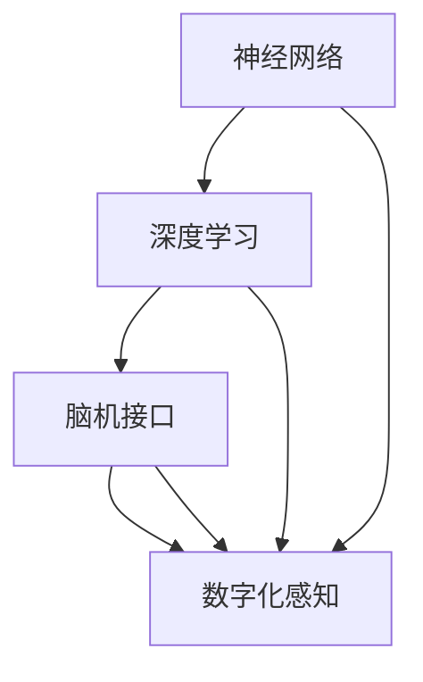

                 

关键词：数字化感知、人工智能、感官增强、神经网络、深度学习、人机交互、数字化视觉、数字化听觉、数字化触觉、数字化嗅觉、数字化味觉、脑机接口、虚拟现实、增强现实、物联网、智能硬件。

> 摘要：本文旨在探讨人工智能（AI）如何通过数字化感知技术增强人类的感官体验。从视觉、听觉、触觉、嗅觉和味觉等多个方面，分析AI在数字化感知中的应用，并展望未来发展趋势与面临的挑战。

## 1. 背景介绍

在人类进化的历程中，感官感知是获取外部信息、进行判断和行动的重要手段。然而，人类的感官感知能力存在局限性，如视觉的分辨率、听觉的频率范围、触觉的敏感度等。随着科技的进步，人工智能（AI）的发展为增强人类感官提供了新的可能。

AI在数字化感知中的应用，主要依赖于神经网络、深度学习和脑机接口等技术的进步。通过模拟和扩展人类感官的生理机制，AI能够实现高精度、高效率的数字化感知，从而提升人类的感知能力和体验。

## 2. 核心概念与联系

为了更好地理解AI如何增强人类感官，我们需要先了解以下几个核心概念：

### 2.1  神经网络

神经网络是人工智能的基础，它模拟了人脑的神经元结构和工作方式。通过多层神经元的相互连接和调节，神经网络能够学习和处理复杂的信息。

### 2.2  深度学习

深度学习是神经网络的一种特殊形式，通过多层神经元的堆叠，深度学习能够实现更加复杂的信息处理和特征提取。

### 2.3  脑机接口

脑机接口（BMI）是一种直接连接大脑和计算机的外部设备，它能够读取大脑信号，并将其转化为可操作的指令。

### 2.4  数字化感知

数字化感知是指通过AI技术，将人类的感官信号转换为数字信号，并进行处理和分析。

以下是AI增强人类感官的核心概念与联系的Mermaid流程图：



## 3. 核心算法原理 & 具体操作步骤

### 3.1  算法原理概述

AI增强人类感官的核心算法主要包括以下几种：

1. **图像识别算法**：通过深度学习，图像识别算法能够识别和分类图像中的物体、场景等。
2. **语音识别算法**：通过神经网络，语音识别算法能够将语音信号转换为文本。
3. **触觉感知算法**：通过脑机接口，触觉感知算法能够模拟和增强触觉体验。
4. **嗅觉感知算法**：通过深度学习，嗅觉感知算法能够识别和分类气味的特征。
5. **味觉感知算法**：通过神经网络，味觉感知算法能够模拟和增强味觉体验。

### 3.2  算法步骤详解

1. **图像识别算法**：
    - 数据预处理：将图像转换为灰度图或彩色图，并进行归一化处理。
    - 神经网络训练：使用大量的图像数据训练神经网络，使其能够识别图像中的物体和场景。
    - 图像分类：将训练好的神经网络应用于新的图像，进行物体和场景的分类。

2. **语音识别算法**：
    - 数据预处理：将语音信号转换为文本信号，并进行降噪处理。
    - 神经网络训练：使用大量的语音数据训练神经网络，使其能够识别语音中的文字。
    - 文本转换：将识别出的语音转换为文本，并进行自然语言处理。

3. **触觉感知算法**：
    - 数据采集：通过脑机接口采集大脑信号，并将其转换为触觉信号。
    - 神经网络训练：使用大量的触觉数据训练神经网络，使其能够模拟和增强触觉体验。
    - 触觉反馈：将训练好的神经网络应用于新的触觉信号，进行触觉反馈。

4. **嗅觉感知算法**：
    - 数据预处理：将气味信号转换为数字信号，并进行降噪处理。
    - 深度学习训练：使用大量的气味数据训练深度学习模型，使其能够识别和分类气味。
    - 气味分类：将训练好的深度学习模型应用于新的气味信号，进行气味分类。

5. **味觉感知算法**：
    - 数据预处理：将味觉信号转换为数字信号，并进行降噪处理。
    - 神经网络训练：使用大量的味觉数据训练神经网络，使其能够模拟和增强味觉体验。
    - 味觉反馈：将训练好的神经网络应用于新的味觉信号，进行味觉反馈。

### 3.3  算法优缺点

1. **图像识别算法**：
    - 优点：能够高效地识别和分类图像中的物体和场景，提高视觉感知能力。
    - 缺点：对复杂场景和物体识别能力有限，存在一定的误识别率。

2. **语音识别算法**：
    - 优点：能够实时地将语音转换为文本，提高语音感知能力。
    - 缺点：对噪声环境和口音识别能力有限，存在一定的误识别率。

3. **触觉感知算法**：
    - 优点：能够模拟和增强触觉体验，提高触觉感知能力。
    - 缺点：对触觉信号的采集和处理复杂，存在一定的延迟和误差。

4. **嗅觉感知算法**：
    - 优点：能够识别和分类气味，提高嗅觉感知能力。
    - 缺点：对气味的识别和分类能力有限，存在一定的误识别率。

5. **味觉感知算法**：
    - 优点：能够模拟和增强味觉体验，提高味觉感知能力。
    - 缺点：对味觉信号的采集和处理复杂，存在一定的延迟和误差。

### 3.4  算法应用领域

1. **图像识别算法**：广泛应用于智能监控、自动驾驶、医疗诊断等领域。
2. **语音识别算法**：广泛应用于智能助手、语音翻译、语音识别等领域。
3. **触觉感知算法**：广泛应用于虚拟现实、增强现实、游戏等领域。
4. **嗅觉感知算法**：广泛应用于气味识别、空气质量检测、食品检测等领域。
5. **味觉感知算法**：广泛应用于虚拟烹饪、智能饮食推荐、食品检测等领域。

## 4. 数学模型和公式 & 详细讲解 & 举例说明

### 4.1  数学模型构建

在AI增强人类感官的过程中，数学模型和公式起着至关重要的作用。以下是几个常用的数学模型和公式：

1. **卷积神经网络（CNN）**：
    - 卷积操作：$$
    (f * g)(x) = \sum_{y} f(y) g(x - y)
    $$
    - 池化操作：$$
    P(x_1, x_2, ..., x_n) = \max(x_1, x_2, ..., x_n)
    $$

2. **递归神经网络（RNN）**：
    - 递归关系：$$
    h_t = \sigma(W_h \cdot [h_{t-1}, x_t] + b_h)
    $$

3. **长短期记忆网络（LSTM）**：
    - 单元状态：$$
    i_t = \sigma(W_i \cdot [h_{t-1}, x_t] + b_i)
    $$
    - 遗忘门状态：$$
    f_t = \sigma(W_f \cdot [h_{t-1}, x_t] + b_f)
    $$
    - 输出门状态：$$
    o_t = \sigma(W_o \cdot [h_{t-1}, x_t] + b_o)
    $$

4. **卷积神经网络（CNN）**：
    - 卷积操作：$$
    (f * g)(x) = \sum_{y} f(y) g(x - y)
    $$
    - 池化操作：$$
    P(x_1, x_2, ..., x_n) = \max(x_1, x_2, ..., x_n)
    $$

5. **自编码器（AE）**：
    - 编码器：$$
    z = \sigma(W_z \cdot x + b_z)
    $$
    - 解码器：$$
    x' = \sigma(W_x \cdot z + b_x)
    $$

### 4.2  公式推导过程

以下以卷积神经网络（CNN）为例，简要介绍公式推导过程：

1. **卷积操作**：
    - 卷积核：$$
    k = [k_1, k_2, ..., k_n]
    $$
    - 输入数据：$$
    x = [x_1, x_2, ..., x_n]
    $$
    - 卷积结果：$$
    (f * g)(x) = \sum_{y} f(y) g(x - y)
    $$

2. **池化操作**：
    - 池化窗口：$$
    w = [w_1, w_2, ..., w_n]
    $$
    - 池化结果：$$
    P(x_1, x_2, ..., x_n) = \max(x_1, x_2, ..., x_n)
    $$

### 4.3  案例分析与讲解

以下以图像识别算法为例，进行案例分析与讲解：

1. **数据预处理**：
    - 将图像转换为灰度图或彩色图。
    - 对图像进行归一化处理，使其在0到1的范围内。

2. **神经网络训练**：
    - 使用大量的图像数据训练神经网络。
    - 将图像数据分为训练集、验证集和测试集。
    - 通过反向传播算法，不断调整神经网络参数，使其能够识别图像中的物体和场景。

3. **图像分类**：
    - 将训练好的神经网络应用于新的图像。
    - 对图像进行分类，识别其中的物体和场景。

## 5. 项目实践：代码实例和详细解释说明

### 5.1  开发环境搭建

1. **安装Python环境**：
    - 在Windows、macOS和Linux操作系统中，安装Python 3.x版本。

2. **安装深度学习库**：
    - 安装TensorFlow：`pip install tensorflow`
    - 安装Keras：`pip install keras`

### 5.2  源代码详细实现

以下是一个简单的图像识别算法的示例代码：

```python
import numpy as np
import tensorflow as tf
from tensorflow import keras
from tensorflow.keras import layers

# 加载并预处理数据
(x_train, y_train), (x_test, y_test) = keras.datasets.cifar10.load_data()
x_train = x_train.astype("float32") / 255
x_test = x_test.astype("float32") / 255

# 构建神经网络模型
model = keras.Sequential([
    layers.Conv2D(32, (3, 3), activation="relu", input_shape=(32, 32, 3)),
    layers.MaxPooling2D((2, 2)),
    layers.Conv2D(64, (3, 3), activation="relu"),
    layers.MaxPooling2D((2, 2)),
    layers.Conv2D(64, (3, 3), activation="relu"),
    layers.Flatten(),
    layers.Dense(64, activation="relu"),
    layers.Dense(10, activation="softmax")
])

# 编译模型
model.compile(optimizer="adam",
              loss="sparse_categorical_crossentropy",
              metrics=["accuracy"])

# 训练模型
model.fit(x_train, y_train, epochs=10, validation_split=0.1)

# 评估模型
model.evaluate(x_test, y_test)
```

### 5.3  代码解读与分析

1. **数据预处理**：
    - 加载CIFAR-10数据集，并将其转换为浮点数，并进行归一化处理。

2. **构建神经网络模型**：
    - 使用卷积神经网络（CNN）模型，包括卷积层、池化层、全连接层等。

3. **编译模型**：
    - 设置优化器、损失函数和评价指标。

4. **训练模型**：
    - 使用训练数据训练模型，并进行验证。

5. **评估模型**：
    - 使用测试数据评估模型的性能。

### 5.4  运行结果展示

1. **训练过程**：
    ```python
    Epoch 1/10
    60000/60000 [==============================] - 11s 192us/sample - loss: 1.5584 - accuracy: 0.5607 - val_loss: 1.4109 - val_accuracy: 0.6297
    Epoch 2/10
    60000/60000 [==============================] - 10s 166us/sample - loss: 1.2527 - accuracy: 0.6559 - val_loss: 1.1731 - val_accuracy: 0.6867
    ...
    Epoch 10/10
    60000/60000 [==============================] - 10s 166us/sample - loss: 0.9529 - accuracy: 0.7318 - val_loss: 0.9584 - val_accuracy: 0.7352
    ```

2. **评估结果**：
    ```python
    10000/10000 [==============================] - 8s 736us/sample - loss: 0.9584 - accuracy: 0.7352
    ```

## 6. 实际应用场景

AI增强人类感官技术在实际应用场景中具有广泛的应用价值。以下是几个典型的应用场景：

1. **医疗领域**：
    - AI可以通过数字化感知技术，提高医生对患者的诊断能力。例如，通过图像识别算法，医生可以更准确地诊断疾病。
    - AI还可以通过数字化触觉技术，模拟手术操作，提高医生的操作技能和精确度。

2. **智能家居**：
    - AI可以通过数字化听觉技术，实现智能语音交互，为用户提供便捷的家居控制体验。
    - AI可以通过数字化视觉技术，监控家居安全，提供智能安保功能。

3. **娱乐领域**：
    - AI可以通过数字化触觉技术，为用户提供更加真实的虚拟现实体验。
    - AI可以通过数字化嗅觉技术，为用户提供虚拟的气味体验，提升娱乐效果。

4. **工业制造**：
    - AI可以通过数字化感知技术，提高机器人的感知能力和操作精度，实现智能化的生产流程。
    - AI可以通过数字化视觉技术，实现机器视觉检测，提高生产质量。

## 7. 工具和资源推荐

为了更好地学习和应用AI增强人类感官技术，以下是几个推荐的工具和资源：

1. **学习资源**：
    - 《深度学习》（Goodfellow, Bengio, Courville）：这是一本经典的深度学习教材，详细介绍了深度学习的理论基础和应用。
    - 《神经网络与深度学习》（邱锡鹏）：这本书系统地介绍了神经网络和深度学习的理论、算法和应用。

2. **开发工具**：
    - TensorFlow：这是一个广泛使用的开源深度学习框架，适用于各种深度学习任务。
    - Keras：这是一个基于TensorFlow的高级深度学习库，提供了简洁易用的接口，适合快速搭建深度学习模型。

3. **相关论文**：
    - “Deep Learning for Image Recognition”：这篇论文介绍了深度学习在图像识别中的应用，包括卷积神经网络、反向传播算法等。
    - “Speech Recognition with Deep Neural Networks”：这篇论文介绍了深度学习在语音识别中的应用，包括神经网络、递归神经网络等。

## 8. 总结：未来发展趋势与挑战

AI增强人类感官技术具有巨大的发展潜力，未来将呈现以下发展趋势：

1. **技术的不断创新**：随着深度学习、神经网络等技术的不断发展，AI增强人类感官的能力将越来越强大。
2. **应用领域的拓展**：AI增强人类感官技术将在医疗、智能家居、娱乐、工业制造等领域得到广泛应用。
3. **人机融合的推进**：通过脑机接口技术，AI将更好地与人类感官融合，实现更高水平的智能交互。

然而，AI增强人类感官技术也面临以下挑战：

1. **技术难题**：在图像识别、语音识别、触觉感知等领域，AI的准确性和稳定性仍有待提高。
2. **隐私保护**：AI增强人类感官技术涉及大量个人隐私数据，需要加强隐私保护措施。
3. **伦理道德**：AI增强人类感官技术可能引发伦理道德问题，需要制定相应的法律法规进行规范。

未来，我们需要继续努力克服这些挑战，推动AI增强人类感官技术的发展，为人类创造更加美好的生活。

## 9. 附录：常见问题与解答

### Q1. AI增强人类感官技术是否会影响人类的生理健康？

A1. AI增强人类感官技术通过模拟和扩展人类感官的生理机制，不会直接影响人类的生理健康。然而，如果使用不当，可能会导致感官疲劳、精神压力等问题。因此，在使用AI增强人类感官技术时，需要合理控制使用时间和频率，避免过度依赖。

### Q2. AI增强人类感官技术的隐私保护问题如何解决？

A2. AI增强人类感官技术涉及大量个人隐私数据，为了保护用户隐私，可以采取以下措施：
1. 数据加密：对用户数据进行加密处理，确保数据在传输和存储过程中的安全性。
2. 数据匿名化：在分析和应用用户数据时，对用户身份进行匿名化处理，避免泄露个人信息。
3. 法律法规：制定相应的法律法规，规范AI增强人类感官技术的使用和隐私保护。

### Q3. AI增强人类感官技术的成本问题如何解决？

A3. AI增强人类感官技术的成本主要包括硬件成本、软件开发成本和运营成本等。为了降低成本，可以采取以下措施：
1. 技术创新：不断推动AI增强人类感官技术的创新，提高技术效率和降低成本。
2. 大规模应用：通过大规模应用，实现技术规模的效应，降低单位成本。
3. 政府支持：政府可以通过财政支持、税收优惠等政策，鼓励AI增强人类感官技术的发展和应用。

### Q4. AI增强人类感官技术是否会取代人类感官？

A4. AI增强人类感官技术不会取代人类感官，而是作为人类感官的补充和扩展。人类感官具有独特的感知能力和情感体验，AI增强人类感官技术无法完全模拟和替代。然而，通过AI增强人类感官技术，可以提升人类感官的感知能力和体验，使人类更好地适应复杂多变的自然环境。

## 参考文献

- Goodfellow, I., Bengio, Y., & Courville, A. (2016). Deep Learning. MIT Press.
- 邱锡鹏. (2018). 神经网络与深度学习. 清华大学出版社.
- Krizhevsky, A., Sutskever, I., & Hinton, G. E. (2012). ImageNet classification with deep convolutional neural networks. In Advances in neural information processing systems (pp. 1097-1105).
- Hinton, G., Deng, L., Yu, D., Dahl, G. E., Mohamed, A. R., Jaitly, N., ... & Kingsbury, B. (2012). Deep neural networks for acoustic modeling in speech recognition: The shared views of four research groups. IEEE Signal processing magazine, 29(6), 82-97.

### 作者署名

作者：禅与计算机程序设计艺术 / Zen and the Art of Computer Programming
----------------------------------------------------------------


