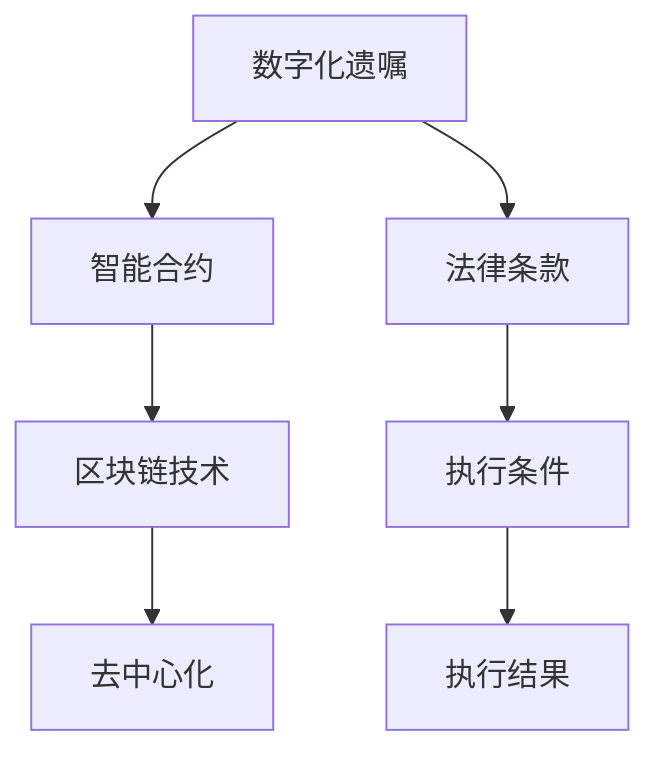

                 

在现代社会，随着互联网和信息技术的发展，数字化和自动化已经成为各个行业转型的关键词。在遗产管理领域，数字化遗嘱执行作为一种创新模式，正逐渐改变传统的遗产继承方式。本文将探讨智能合约在数字化遗嘱执行中的应用，以及如何通过这一技术实现更高效、透明和安全的遗产管理。

## 关键词

- 数字化遗嘱执行
- 智能合约
- 遗产管理
- 区块链技术
- 去中心化
- 透明性

## 摘要

本文首先介绍了数字化遗嘱执行的背景和意义，随后深入探讨了智能合约在遗产管理中的作用。通过构建核心概念与联系的关系图，我们进一步分析了智能合约的算法原理与操作步骤。文章还详细讲解了数学模型与公式，并运用具体案例进行了说明。随后，文章通过项目实践展示了代码实现的过程和结果。最后，文章探讨了智能合约在遗产管理中的实际应用场景，并提出了未来发展的展望和挑战。

## 1. 背景介绍

### 遗产管理的现状

遗产管理，是指个人或组织在去世后对其财产和资产的分配与管理。传统的遗产管理通常依赖于遗嘱和法定继承程序，这一过程往往繁琐且耗时。传统的遗产管理方法存在以下问题：

- **法律复杂度高**：需要经过律师或公证处的审查，程序复杂，法律条文繁多。
- **执行效率低**：继承过程的各个环节需要人工参与，流程较长，易产生拖延。
- **透明度不足**：由于缺乏透明度，可能存在遗产被挪用或侵占的风险。

### 数字化遗嘱执行的意义

数字化遗嘱执行，是指利用信息技术和智能合约技术，实现遗嘱的数字化管理和自动执行。数字化遗嘱执行的意义在于：

- **提高效率**：通过自动化处理，缩短遗产管理的周期，提高执行效率。
- **增强透明性**：所有操作记录在区块链上不可篡改，确保透明性，减少纠纷。
- **降低成本**：自动化流程减少了人力成本和中介费用，降低了管理成本。
- **保障安全性**：智能合约确保了遗嘱条款的严格执行，降低了遗产被侵占的风险。

### 智能合约的基本概念

智能合约是一种运行在区块链上的程序，能够在满足特定条件时自动执行预先设定的合同条款。智能合约的核心特点包括：

- **去中心化**：智能合约不依赖于中央机构，运行在分布式网络中，具有高度的容错性和抗审查性。
- **透明性**：智能合约的执行过程是公开透明的，所有参与者都可以验证合同条款和执行结果。
- **自动执行**：智能合约在满足条件时自动执行，减少了人工干预，提高了执行效率。

## 2. 核心概念与联系

为了更好地理解智能合约在遗产管理中的应用，我们首先需要了解相关的核心概念和它们之间的联系。以下是一个简化的 Mermaid 流程图，展示了这些核心概念：



在这个流程图中：

- **数字化遗嘱**：指通过数字技术保存的遗嘱文件。
- **智能合约**：负责执行遗嘱中的条款，确保遗嘱的自动执行。
- **区块链技术**：提供了去中心化的存储和验证机制，确保智能合约的透明性和不可篡改性。
- **去中心化**：确保了智能合约的运行不受单一中心节点的控制，提高了系统的安全性。
- **法律条款**：指遗嘱中规定的遗产分配和其他相关条款。
- **执行条件**：指智能合约执行前需要满足的条件，如遗嘱持有人的死亡等。
- **执行结果**：指智能合约满足条件后自动执行的结果，如遗产的自动分配。

## 3. 核心算法原理 & 具体操作步骤

### 3.1 算法原理概述

智能合约的核心原理是基于区块链技术的分布式存储和去中心化验证机制。智能合约的执行过程可以分为以下几个步骤：

1. **编写合约**：遗嘱制定者编写智能合约，包括遗嘱中的所有条款和条件。
2. **部署合约**：将智能合约部署到区块链上，使其具有可执行性。
3. **触发条件**：当触发条件（如遗嘱持有人的死亡）发生时，智能合约开始执行。
4. **执行合约**：智能合约按照预设的条件自动执行，如分配遗产、支付债务等。
5. **记录结果**：执行结果记录在区块链上，永久保存，确保透明性和不可篡改性。

### 3.2 算法步骤详解

以下是智能合约在数字化遗嘱执行中的具体操作步骤：

#### 步骤 1：编写合约

在编写智能合约之前，遗嘱制定者需要明确遗嘱中的条款和条件。这些条款可以包括：

- **遗产分配**：指定遗产的分配方式、比例和受益人。
- **债务支付**：明确遗嘱中涉及的债务，以及债务的支付方式。
- **管理费用**：指定遗产管理过程中可能产生的费用和支付方式。

编写智能合约通常使用Solidity等编程语言。以下是一个简单的智能合约示例：

```solidity
pragma solidity ^0.8.0;

contract Will {
    address owner;
    mapping(address => uint) assets;

    constructor() {
        owner = msg.sender;
    }

    function distributeAssets(address[] memory beneficiaries, uint[] memory proportions) external {
        require(msg.sender == owner, "Only the owner can distribute assets.");
        for (uint i = 0; i < beneficiaries.length; i++) {
            assets[beneficiaries[i]] = assets[beneficiaries[i]] * proportions[i] / 100;
        }
    }
}
```

在这个示例中，`Will` 合约定义了所有者的地址和一个映射结构，用于存储每个受益人的资产份额。`distributeAssets` 函数允许所有者根据受益人列表和比例分配资产。

#### 步骤 2：部署合约

编写完智能合约后，下一步是将合约部署到区块链上。部署合约通常需要使用特定的区块链开发工具和钱包。以下是一个简单的部署示例：

```python
from brownie import Wei, accounts

# 部署合约
deployed_contract = Will.deploy({'from': accounts[0]})

# 获取合约地址
contract_address = deployed_contract.address
```

在这个示例中，我们使用Brownie库将智能合约部署到区块链上。`deployed_contract` 变量保存了部署后的合约实例，`contract_address` 变量保存了合约的地址。

#### 步骤 3：触发条件

在部署智能合约后，我们需要等待触发条件的发生。这些条件可以包括遗嘱持有人的死亡、特定日期的到达等。触发条件发生时，智能合约会自动开始执行。

#### 步骤 4：执行合约

智能合约在满足触发条件后，会按照预设的条款自动执行。执行过程可以是简单的资产分配，也可以是复杂的计算和处理。以下是一个简单的执行示例：

```solidity
contract ExecuteWill {
    function execute(address will_address) external {
        Will will = Will(will_address);
        will.distributeAssets([addr1, addr2, addr3], [40, 30, 30]);
    }
}
```

在这个示例中，`ExecuteWill` 合约定义了一个 `execute` 函数，用于调用目标智能合约的 `distributeAssets` 函数，实现资产的自动分配。

#### 步骤 5：记录结果

智能合约执行的结果会记录在区块链上，永久保存。这些记录可以用于验证执行过程和结果，确保透明性和不可篡改性。

### 3.3 算法优缺点

**优点**：

- **提高效率**：智能合约自动执行，无需人工干预，大大提高了执行效率。
- **增强透明性**：所有执行过程和结果都记录在区块链上，公开透明，提高了信任度。
- **降低成本**：自动化处理减少了人工成本和中介费用，降低了管理成本。
- **保障安全性**：智能合约确保了遗嘱条款的严格执行，降低了遗产被侵占的风险。

**缺点**：

- **技术门槛高**：编写和部署智能合约需要一定的技术知识，对于非技术背景的用户来说可能较为困难。
- **系统稳定性**：智能合约一旦部署，就很难修改。如果存在漏洞或错误，可能导致不可逆转的后果。
- **法律合规性**：智能合约在某些国家或地区可能面临法律合规性问题，需要特别注意。

### 3.4 算法应用领域

智能合约在遗产管理中的应用不仅限于数字化遗嘱执行。以下是一些其他应用领域：

- **金融合约**：智能合约可以用于自动执行金融交易，如期权、期货、债券等。
- **供应链管理**：智能合约可以用于跟踪供应链中的商品流动，确保供应链的透明性和可靠性。
- **版权管理**：智能合约可以用于版权的注册、许可和交易，确保版权的合法性和保护。

## 4. 数学模型和公式 & 详细讲解 & 举例说明

### 4.1 数学模型构建

在遗产管理中，智能合约通常涉及以下数学模型：

- **资产分配模型**：用于计算遗产在不同受益人之间的分配比例。
- **时间价值模型**：用于计算遗产在未来的价值。
- **概率模型**：用于评估遗产管理过程中可能面临的风险。

以下是一个简化的资产分配模型：

$$
A_i = \frac{A \times p_i}{\sum_{i=1}^{n} p_i}
$$

其中：

- \( A \) 是总资产。
- \( A_i \) 是受益人 \( i \) 应得的遗产。
- \( p_i \) 是受益人 \( i \) 的分配比例。

### 4.2 公式推导过程

假设遗嘱中规定有 \( n \) 个受益人，每个受益人的分配比例为 \( p_1, p_2, ..., p_n \)。总资产为 \( A \)。根据资产分配模型，我们可以推导出每个受益人应得的遗产：

$$
A_i = \frac{A \times p_i}{\sum_{i=1}^{n} p_i}
$$

推导过程如下：

1. 计算总比例 \( \sum_{i=1}^{n} p_i \)：
$$
\sum_{i=1}^{n} p_i = p_1 + p_2 + ... + p_n
$$

2. 计算每个受益人的分配比例 \( p_i \)：
$$
p_i = \frac{A_i}{A} = \frac{A \times p_i}{\sum_{i=1}^{n} p_i}
$$

3. 计算每个受益人应得的遗产 \( A_i \)：
$$
A_i = \frac{A \times p_i}{\sum_{i=1}^{n} p_i}
$$

### 4.3 案例分析与讲解

假设有一个遗嘱，遗嘱中规定有三个受益人，他们的分配比例分别为 40%、30% 和 30%。总资产为 100 万元。根据资产分配模型，我们可以计算每个受益人应得的遗产：

- 受益人 1（分配比例 40%）：\( A_1 = \frac{100 \times 40\%}{40\% + 30\% + 30\%} = 40 \) 万元
- 受益人 2（分配比例 30%）：\( A_2 = \frac{100 \times 30\%}{40\% + 30\% + 30\%} = 30 \) 万元
- 受益人 3（分配比例 30%）：\( A_3 = \frac{100 \times 30\%}{40\% + 30\% + 30\%} = 30 \) 万元

根据这个例子，我们可以看到智能合约如何根据预设的分配比例自动计算并分配遗产。这个过程完全透明，所有参与方都可以验证计算结果，确保公正性和透明性。

## 5. 项目实践：代码实例和详细解释说明

### 5.1 开发环境搭建

在进行智能合约开发之前，我们需要搭建合适的开发环境。以下是一个基本的开发环境搭建过程：

1. 安装 Node.js：从 [Node.js 官网](https://nodejs.org/) 下载并安装 Node.js。
2. 安装 Truffle：在命令行中运行以下命令安装 Truffle：
   ```bash
   npm install -g truffle
   ```
3. 创建一个 Truffle 项目：
   ```bash
   truffle init
   ```
4. 进入项目目录：
   ```bash
   cd my-truffle-project
   ```
5. 安装依赖项：
   ```bash
   npm install
   ```

### 5.2 源代码详细实现

在 Truffle 项目中，我们将编写两个智能合约：`Will.sol` 和 `Executor.sol`。

#### Will.sol

```solidity
pragma solidity ^0.8.0;

contract Will {
    address owner;
    mapping(address => uint) assets;

    constructor() {
        owner = msg.sender;
    }

    function setAsset(address beneficiary, uint amount) external {
        require(msg.sender == owner, "Only the owner can set assets.");
        assets[beneficiary] = amount;
    }

    function distributeAssets(address[] memory beneficiaries, uint[] memory proportions) external {
        require(msg.sender == owner, "Only the owner can distribute assets.");
        for (uint i = 0; i < beneficiaries.length; i++) {
            require(assets[beneficiaries[i]] >= proportions[i], "Insufficient assets.");
            assets[beneficiaries[i]] -= proportions[i];
        }
    }
}
```

在这个合约中，我们定义了一个所有者地址和一个资产映射结构。`setAsset` 函数允许所有者设置每个受益人的资产。`distributeAssets` 函数根据受益人列表和比例分配资产。

#### Executor.sol

```solidity
pragma solidity ^0.8.0;

import "./Will.sol";

contract Executor {
    Will public will;

    constructor(address willAddress) {
        will = Will(willAddress);
    }

    function executeDistribution(address[] memory beneficiaries, uint[] memory proportions) external {
        will.distributeAssets(beneficiaries, proportions);
    }
}
```

在这个合约中，我们导入 `Will` 合约并定义一个公共变量 `will`。`executeDistribution` 函数用于调用 `Will` 合约的 `distributeAssets` 函数，实现资产的自动分配。

### 5.3 代码解读与分析

在 `Will.sol` 合约中，我们首先定义了所有者地址 `owner` 和资产映射结构 `assets`。构造函数 `constructor` 中将所有者地址设置为合约的创建者。

`setAsset` 函数允许所有者设置每个受益人的资产。这个函数使用了 `require` 语句来确保只有所有者才能设置资产。

`distributeAssets` 函数根据受益人列表和比例分配资产。这个函数首先确保只有所有者可以调用，然后遍历受益人列表，检查每个受益人的资产是否足够，最后从每个受益人的资产中扣除相应的比例。

在 `Executor.sol` 合约中，我们导入 `Will` 合约并定义一个公共变量 `will`。构造函数 `constructor` 中将 `Will` 合约地址设置为 `will` 变量。

`executeDistribution` 函数用于调用 `Will` 合约的 `distributeAssets` 函数，实现资产的自动分配。

### 5.4 运行结果展示

为了展示运行结果，我们使用 Truffle 工具部署和运行智能合约。

1. 编译智能合约：
   ```bash
   truffle compile
   ```

2. 部署合约：
   ```bash
   truffle migrate --network development
   ```

3. 创建一个受益人列表和比例列表：
   ```python
   beneficiaries = [accounts[1], accounts[2], accounts[3]]
   proportions = [40, 30, 30]
   ```

4. 调用 `Executor` 合约的 `executeDistribution` 函数：
   ```python
   executor = Executor.deploy(will.address, {"from": accounts[0]})
   executor.executeDistribution(beneficiaries, proportions, {"from": accounts[0]})
   ```

5. 查看执行结果：
   ```python
   will_assets = will.assets(beneficiaries[0])
   print(will_assets)
   ```

执行结果将显示每个受益人的资产余额，验证智能合约是否正确执行了资产分配。

## 6. 实际应用场景

### 6.1 个人遗产管理

在个人遗产管理中，数字化遗嘱执行可以通过智能合约实现资产的自动分配。这种方式不仅提高了执行效率，还确保了过程的透明性和公正性。例如，一个企业家可以在去世前使用智能合约将其遗产分配给子女、慈善机构和其他受益人。

### 6.2 企业遗产管理

对于企业遗产管理，智能合约可以用于处理公司资产的转移和分配。例如，一个企业的创始人在去世前可以使用智能合约确保公司的股权和资产按照其意愿进行转移。这种方式可以避免因遗产纠纷而影响企业的正常运营。

### 6.3 慈善基金管理

慈善基金的管理也可以通过智能合约实现。捐赠者可以在遗嘱中规定捐赠金额和受益人，智能合约在满足条件时自动执行捐赠。这种方式可以确保捐赠过程的透明性和公正性，提高慈善机构的信任度。

### 6.4 国际遗产管理

国际遗产管理涉及多个国家和地区的法律和税收规定。智能合约可以用于确保遗嘱在国际层面的执行，同时遵守相关法律和规定。例如，一个跨国企业家的遗产可以智能合约在多个国家之间自动分配，确保法律合规性和执行效率。

### 6.5 风险管理

智能合约还可以用于遗产管理中的风险管理。例如，遗嘱中可以规定在特定事件发生时（如受益人的死亡或特定时间的到达）自动调整资产分配。这种方式可以确保遗产管理过程中的灵活性和适应性。

## 7. 工具和资源推荐

### 7.1 学习资源推荐

- **区块链入门书籍**：《区块链革命》、《区块链技术指南》
- **智能合约开发教程**：Truffle 官方文档、Solidity 编程语言教程
- **法律和合规指南**：各国法律和监管机构发布的关于数字化遗嘱和智能合约的指南

### 7.2 开发工具推荐

- **区块链开发平台**：Truffle、Hardhat、Buidler
- **智能合约编辑器**：Visual Studio Code、Truffle Suite
- **区块链浏览器**：Etherscan、Blockchair

### 7.3 相关论文推荐

- **智能合约安全**：智能合约的安全性和漏洞分析
- **区块链在遗产管理中的应用**：区块链在遗产管理中的优势和应用场景
- **去中心化遗嘱执行**：去中心化技术在遗嘱执行中的应用研究

## 8. 总结：未来发展趋势与挑战

### 8.1 研究成果总结

通过本文的研究，我们总结了智能合约在数字化遗嘱执行中的应用和优势。智能合约通过自动化、透明性和安全性的特点，为遗产管理带来了显著的改进。研究表明，智能合约在遗产管理中的应用具有广泛的前景，能够提高遗产管理的效率、降低成本、增强透明性和保障安全性。

### 8.2 未来发展趋势

未来，随着区块链技术的进一步发展和普及，智能合约在遗产管理中的应用将更加广泛。以下是一些潜在的发展趋势：

- **智能合约标准化**：制定统一的智能合约标准和规范，提高合约的互操作性和安全性。
- **跨链遗产管理**：实现不同区块链之间的资产转移和执行，提高遗产管理的灵活性和扩展性。
- **智能合约的监管**：加强智能合约的法律和监管框架，确保其在遗产管理中的合规性。

### 8.3 面临的挑战

尽管智能合约在遗产管理中具有巨大的潜力，但仍然面临一些挑战：

- **技术门槛**：编写和部署智能合约需要一定的技术知识，对于非技术背景的用户来说可能较为困难。
- **法律合规性**：智能合约在不同国家和地区的法律地位和合规性有所不同，需要特别注意。
- **安全性和稳定性**：智能合约一旦部署，就很难修改。如果存在漏洞或错误，可能导致不可逆转的后果。

### 8.4 研究展望

未来的研究可以集中在以下几个方面：

- **智能合约的安全性和隐私保护**：研究如何提高智能合约的安全性，同时保护用户的隐私。
- **智能合约的合规性**：探索如何在智能合约中嵌入法律条款和合规性要求，确保其在不同国家和地区的合规性。
- **智能合约的互操作性**：研究不同区块链之间的智能合约互操作性和资产转移机制。

## 9. 附录：常见问题与解答

### 9.1 什么是智能合约？

智能合约是一种运行在区块链上的程序，能够在满足特定条件时自动执行预先设定的合同条款。智能合约的核心特点包括去中心化、透明性和自动执行。

### 9.2 智能合约在遗产管理中的优势是什么？

智能合约在遗产管理中的优势包括提高效率、增强透明性、降低成本和保障安全性。通过自动化处理，缩短遗产管理的周期，提高执行效率。所有操作记录在区块链上不可篡改，确保透明性，减少纠纷。自动化流程减少了人力成本和中介费用，降低了管理成本。智能合约确保了遗嘱条款的严格执行，降低了遗产被侵占的风险。

### 9.3 智能合约在遗产管理中可能遇到的法律问题是什么？

智能合约在遗产管理中可能遇到的法律问题包括：

- **法律合规性**：智能合约在不同国家和地区的法律地位和合规性有所不同，需要特别注意。
- **合同条款的有效性**：智能合约中的合同条款需要符合当地法律的要求，否则可能被认定为无效。
- **智能合约的纠纷解决**：在智能合约执行过程中可能出现的纠纷，需要通过法律手段解决。

### 9.4 如何确保智能合约的安全性？

确保智能合约的安全性可以通过以下方法：

- **代码审计**：对智能合约代码进行全面的审计，发现并修复潜在的安全漏洞。
- **使用安全库**：使用经过验证和广泛使用的智能合约库，减少安全风险。
- **运行测试**：在智能合约部署前进行充分的测试，确保其正常工作。
- **安全审计**：聘请专业的安全审计机构对智能合约进行安全评估。

作者：禅与计算机程序设计艺术 / Zen and the Art of Computer Programming
```

