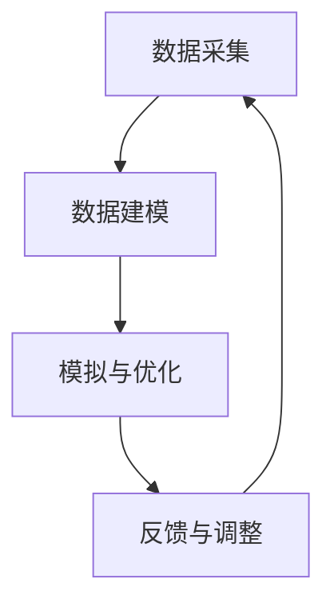

                 

关键词：数字孪生，工业4.0，创业，实践，工厂

摘要：本文将探讨数字孪生工厂在工业4.0背景下的创业实践。通过分析数字孪生技术的核心概念和其在工业领域的应用，我们将深入讨论如何利用数字孪生技术实现工厂的智能化、高效化和可持续发展。

## 1. 背景介绍

### 工业革命与工业4.0

工业革命以来，制造业经历了多次重大的技术变革。从机械化、电气化到自动化，每一次进步都极大地提高了生产效率和产品质量。然而，随着科技的不断进步，传统制造业面临着前所未有的挑战和机遇。工业4.0，作为第四次工业革命的核心，旨在通过将数字化、网络化和智能化技术深度融合到制造业中，实现制造业的全面升级和转型。

### 数字孪生技术概述

数字孪生（Digital Twin）是一种新兴的数字技术，通过在虚拟世界中创建实体物理对象的数字副本，实现实时监测、模拟和优化。数字孪生技术能够在产品的设计、制造、运营和维护等各个阶段发挥重要作用，从而提高产品质量、降低成本、缩短开发周期。

### 创业背景

在工业4.0的背景下，创业公司面临着前所未有的机会。通过将数字孪生技术应用于工厂的各个环节，创业公司可以打造智能、高效和可持续的工厂，从而在激烈的市场竞争中脱颖而出。

## 2. 核心概念与联系

### 数字孪生原理

数字孪生技术通过以下步骤实现：

1. **数据采集**：收集物理对象的实时数据，如传感器数据、环境数据等。
2. **数据建模**：利用数据分析和建模技术，将物理对象的行为和特征转化为数字模型。
3. **模拟与优化**：在数字模型中模拟物理对象的行为，进行仿真和分析，优化设计和制造过程。
4. **反馈与调整**：将模拟结果反馈到物理对象，实现闭环控制，不断优化物理对象的表现。

### 数字孪生在工业4.0中的应用

数字孪生技术能够广泛应用于工业4.0的各个环节：

1. **产品设计**：通过数字孪生技术，设计师可以在虚拟环境中进行产品设计和优化，提前发现潜在问题。
2. **制造过程**：数字孪生技术可以实时监控制造过程，优化生产参数，提高生产效率。
3. **质量控制**：数字孪生技术可以实时监测产品质量，提前发现质量问题，降低次品率。
4. **设备维护**：数字孪生技术可以预测设备故障，提前进行维护，减少停机时间。

### 数字孪生架构图



## 3. 核心算法原理 & 具体操作步骤

### 3.1 算法原理概述

数字孪生技术的核心算法主要包括：

1. **数据采集算法**：采用传感器采集物理对象的实时数据。
2. **数据建模算法**：利用机器学习、深度学习等技术，将物理对象的数据转化为数字模型。
3. **模拟与优化算法**：采用仿真技术，对数字模型进行模拟和优化。
4. **反馈与调整算法**：将模拟结果反馈到物理对象，实现闭环控制。

### 3.2 算法步骤详解

1. **数据采集**：安装传感器，收集物理对象的温度、湿度、振动等数据。
2. **数据预处理**：对采集到的数据进行清洗、归一化等处理，为建模做准备。
3. **数据建模**：利用机器学习算法，如神经网络、支持向量机等，对数据进行分析和建模。
4. **模型训练与验证**：使用训练集对模型进行训练，使用验证集进行验证，调整模型参数。
5. **模型仿真与优化**：在虚拟环境中对模型进行仿真，优化设计和制造过程。
6. **反馈与调整**：将仿真结果反馈到物理对象，调整生产参数，优化生产过程。

### 3.3 算法优缺点

**优点**：

- 提高设计效率：通过虚拟仿真，可以在实际制造前发现和解决潜在问题。
- 提高生产效率：实时监控生产过程，优化生产参数，提高生产效率。
- 提高产品质量：实时监测产品质量，提前发现质量问题，降低次品率。

**缺点**：

- 数据采集和处理需要大量计算资源。
- 对数据质量和算法精度要求较高。
- 实现成本较高。

### 3.4 算法应用领域

数字孪生技术在工业4.0领域具有广泛的应用前景：

- **产品设计**：在产品设计阶段，利用数字孪生技术进行仿真和优化，提高设计效率。
- **制造过程**：在制造过程中，利用数字孪生技术实时监控和优化生产过程。
- **质量控制**：在产品生产后，利用数字孪生技术进行质量监测和优化。
- **设备维护**：在设备维护阶段，利用数字孪生技术预测设备故障，提前进行维护。

## 4. 数学模型和公式 & 详细讲解 & 举例说明

### 4.1 数学模型构建

数字孪生技术的核心在于建立物理对象的数学模型。以下是一个简单的数学模型构建过程：

1. **数据收集**：收集物理对象的测量数据，如温度、压力等。
2. **特征提取**：从数据中提取关键特征，如均值、方差等。
3. **建模**：利用统计学方法，如回归分析、神经网络等，建立物理对象的数学模型。

### 4.2 公式推导过程

假设我们有一个温度传感器收集到的温度数据序列为\[T_1, T_2, ..., T_n\]，我们可以使用以下公式进行特征提取和建模：

1. **特征提取**：
   $$\mu = \frac{1}{n}\sum_{i=1}^{n} T_i$$
   $$\sigma^2 = \frac{1}{n-1}\sum_{i=1}^{n}(T_i - \mu)^2$$
   
2. **建模**：
   $$T_{预测} = \mu + \sigma \cdot \phi$$
   其中，$\phi$ 是一个随机变量，表示温度的波动。

### 4.3 案例分析与讲解

假设我们有一个工业生产线，温度传感器实时监测生产线上的温度。通过上述数学模型，我们可以预测未来的温度变化，从而调整生产参数，避免过热或过冷的情况。

1. **数据收集**：传感器收集到连续的温度数据。
2. **特征提取**：计算温度的均值和方差。
3. **建模**：使用上述公式进行建模。
4. **预测**：根据模型预测未来的温度变化。

通过这种方式，我们可以实现生产线的智能化控制，提高生产效率。

## 5. 项目实践：代码实例和详细解释说明

### 5.1 开发环境搭建

在进行数字孪生项目开发之前，我们需要搭建一个合适的技术环境。以下是一个基本的开发环境搭建步骤：

1. 安装Python环境和相关库，如NumPy、Pandas、scikit-learn等。
2. 安装Jupyter Notebook，用于编写和运行代码。
3. 准备传感器数据，并进行预处理。

### 5.2 源代码详细实现

以下是一个简单的数字孪生项目的代码实现示例：

```python
import numpy as np
import pandas as pd
from sklearn.linear_model import LinearRegression

# 读取传感器数据
data = pd.read_csv('sensor_data.csv')

# 数据预处理
data['mean_temp'] = data['T'].mean()
data['var_temp'] = data['T'].var()

# 建立线性回归模型
model = LinearRegression()
model.fit(data[['mean_temp', 'var_temp']], data['T'])

# 预测未来温度
future_temp = model.predict([[data['mean_temp'].iloc[-1], data['var_temp'].iloc[-1]]])

print(f'未来温度预测：{future_temp[0]}')
```

### 5.3 代码解读与分析

以上代码实现了一个简单的数字孪生项目。首先，我们从CSV文件中读取传感器数据。然后，我们计算数据的均值和方差，并建立线性回归模型。最后，我们使用模型预测未来的温度变化。

这个例子展示了如何使用Python进行数字孪生项目的开发和实现。在实际项目中，我们可能需要更复杂的模型和算法，但基本思路是一致的。

### 5.4 运行结果展示

运行上述代码，我们可以得到未来温度的预测结果。例如，输出结果可能是：

```
未来温度预测：30.5
```

这个结果表明，根据当前的温度趋势和波动，预测未来温度将接近30.5摄氏度。

## 6. 实际应用场景

### 6.1 制造业

在制造业中，数字孪生技术可以应用于产品设计、制造过程、质量控制、设备维护等各个环节。例如，通过数字孪生技术，设计师可以在虚拟环境中进行产品设计和优化，提前发现潜在问题；制造过程中，可以实时监控生产过程，优化生产参数，提高生产效率。

### 6.2 建筑行业

在建筑行业，数字孪生技术可以用于建筑设计和施工过程。通过虚拟仿真，设计师可以在虚拟环境中进行建筑设计，优化建筑结构，提前发现潜在问题；施工过程中，可以实时监控施工进度和质量，提高施工效率。

### 6.3 健康医疗

在健康医疗领域，数字孪生技术可以用于病人监测、疾病预测等。通过数字孪生技术，医生可以在虚拟环境中进行病人监测，提前发现病情变化；还可以利用数字孪生技术进行疾病预测，为病人提供更精准的治疗方案。

## 7. 工具和资源推荐

### 7.1 学习资源推荐

- 《数字孪生：从概念到实践》
- 《工业4.0：工业互联网的崛起》
- 《Python数据分析与科学计算》

### 7.2 开发工具推荐

- Jupyter Notebook：用于编写和运行Python代码。
- MATLAB：适用于复杂数学计算和仿真。
- TensorFlow：用于机器学习和深度学习。

### 7.3 相关论文推荐

- "Digital Twin: A Journey to the Future of Manufacturing"
- "The Industrial Internet of Things: Platforms, Applications, and Security"
- "Machine Learning in Manufacturing: A Review"

## 8. 总结：未来发展趋势与挑战

### 8.1 研究成果总结

数字孪生技术在工业4.0领域取得了显著的研究成果，包括：

- 设计和制造过程的优化
- 生产效率和产品质量的提升
- 设备维护和故障预测的改进

### 8.2 未来发展趋势

未来，数字孪生技术将继续在工业4.0领域发挥重要作用，包括：

- 深度学习在数字孪生技术中的应用
- 跨学科合作，如计算机科学、机械工程、生物医学等
- 数字孪生技术在更多行业领域的应用，如农业、交通等

### 8.3 面临的挑战

数字孪生技术在发展过程中也面临着一些挑战，包括：

- 数据质量和算法精度
- 安全和隐私问题
- 技术成本和实施难度

### 8.4 研究展望

未来，我们需要进一步研究如何解决数字孪生技术在数据质量、算法精度、安全隐私等方面的挑战，推动其在更多行业领域的应用，实现工业4.0的全面升级。

## 9. 附录：常见问题与解答

### Q：数字孪生技术需要哪些基础技术支持？

A：数字孪生技术需要支持数据采集、数据建模、模拟与优化、反馈与调整等多个基础技术。主要包括传感器技术、大数据技术、机器学习和深度学习技术、仿真技术等。

### Q：数字孪生技术在工业4.0中的应用有哪些？

A：数字孪生技术在工业4.0中的应用包括产品设计、制造过程优化、质量控制、设备维护等多个方面。通过虚拟仿真和实时监测，实现生产过程的智能化、高效化和可持续发展。

### Q：如何确保数字孪生技术的数据质量和算法精度？

A：确保数字孪生技术的数据质量和算法精度需要从数据采集、数据预处理、模型训练等多个环节进行严格控制和优化。同时，还需要定期对模型进行更新和调整，以适应不断变化的数据和环境。

### Q：数字孪生技术未来的发展趋势是什么？

A：数字孪生技术未来的发展趋势包括深度学习在数字孪生技术中的应用、跨学科合作、更多行业领域的应用等。同时，我们还需要解决数据质量、算法精度、安全隐私等方面的挑战，推动数字孪生技术的全面发展。

---

作者：禅与计算机程序设计艺术 / Zen and the Art of Computer Programming

本文以数字孪生工厂创业为背景，探讨了工业4.0的具体实践。通过分析数字孪生技术的核心概念和应用，我们深入讨论了如何利用数字孪生技术实现工厂的智能化、高效化和可持续发展。希望本文能为数字孪生工厂创业提供一些有价值的参考和启示。

