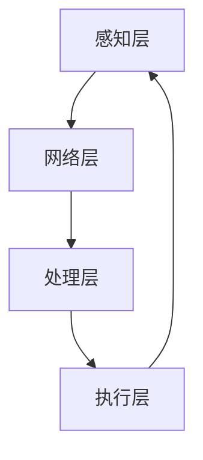

                 

关键词：数字实体、物理实体、自动化融合、算法、人工智能、机器学习、物联网、实体识别、虚拟现实

> 摘要：随着信息技术的飞速发展，数字实体与物理实体的融合正逐渐成为新的技术热点。本文将探讨数字实体与物理实体融合的背景、核心概念、算法原理、数学模型及其在实际应用中的实现方法，并提出未来发展的展望。

## 1. 背景介绍

随着物联网（IoT）、大数据、人工智能等技术的普及与发展，数字实体与物理实体的融合已成为当前信息技术领域的重要研究方向。数字实体指的是存在于计算机系统中的数据、信息和知识，而物理实体则是指现实世界中的物体、设备和环境。

传统的信息技术侧重于处理数字实体，而随着物联网设备的普及，越来越多的物理实体开始被数字化的同时，也使得数字实体与物理实体之间的交互变得日益重要。这种融合不仅仅是将物理实体转化为数字数据，更重要的是如何实现数字实体对物理实体的智能化控制和优化管理。

例如，智能交通系统通过数字实体（如实时交通数据）对物理实体（如车辆、道路）进行优化调度，从而提高交通效率；智能家居系统通过数字实体（如用户行为数据）对物理实体（如家电、灯光）进行智能控制，从而提升生活质量。这些应用场景都是数字实体与物理实体融合的典型实例。

## 2. 核心概念与联系

### 2.1 数字实体

数字实体主要包括数据、信息和知识。数据是数字化的物理世界中的事实和信息，如温度、湿度、地理位置等；信息是对数据的抽象和处理，能够反映出物理实体的状态和特征；知识则是经过人类或系统加工后的信息，具有指导作用。

### 2.2 物理实体

物理实体是现实世界中存在的物体、设备和环境。它们可以通过传感器、执行器等设备与数字实体进行交互，实现信息的采集、处理和反馈。

### 2.3 融合架构

数字实体与物理实体的融合架构主要包括以下几个关键环节：

1. **感知层**：通过传感器等设备对物理实体进行感知，将物理信息转化为数字数据。
2. **网络层**：利用物联网技术，实现数字数据的传输和通信。
3. **处理层**：通过大数据处理、机器学习和人工智能算法对数字数据进行处理和分析。
4. **执行层**：根据处理结果，对物理实体进行控制或调整。

### 2.4 Mermaid 流程图



## 3. 核心算法原理 & 具体操作步骤

### 3.1 算法原理概述

数字实体与物理实体的自动化融合需要依靠一系列算法的支持，主要包括：

1. **实体识别算法**：用于识别和分类物理实体，实现数字实体对物理实体的感知。
2. **状态估计算法**：通过对数字数据的分析，估计物理实体的状态。
3. **控制策略算法**：根据物理实体的状态，生成最优的控制策略。

### 3.2 算法步骤详解

1. **数据采集与预处理**：从传感器等设备中获取物理数据，并进行清洗、归一化等预处理。
2. **实体识别**：使用深度学习、模式识别等技术对物理实体进行识别。
3. **状态估计**：利用滤波算法、机器学习算法等对物理实体的状态进行估计。
4. **控制策略生成**：根据状态估计结果，使用强化学习、规划算法等生成控制策略。
5. **执行控制**：将控制策略发送到执行层，实现对物理实体的控制。

### 3.3 算法优缺点

- **实体识别算法**：优点是能够快速准确地识别物理实体，缺点是可能存在过拟合现象。
- **状态估计算法**：优点是能够提供实时、准确的物理实体状态，缺点是对数据质量要求较高。
- **控制策略算法**：优点是能够生成最优的控制策略，缺点是计算复杂度较高。

### 3.4 算法应用领域

- **智能交通**：用于交通流量监测、路径规划等。
- **智能家居**：用于家电控制、环境监测等。
- **智能制造**：用于设备监控、生产优化等。

## 4. 数学模型和公式 & 详细讲解 & 举例说明

### 4.1 数学模型构建

数字实体与物理实体的融合过程中，常用的数学模型包括：

1. **线性回归模型**：用于预测物理实体的状态。
2. **支持向量机（SVM）**：用于实体识别。
3. **马尔可夫决策过程（MDP）**：用于控制策略生成。

### 4.2 公式推导过程

以线性回归模型为例，其公式推导如下：

$$y = \beta_0 + \beta_1 \cdot x + \epsilon$$

其中，$y$ 表示物理实体的状态，$x$ 表示数字实体特征，$\beta_0$ 和 $\beta_1$ 分别为模型的参数，$\epsilon$ 表示误差。

### 4.3 案例分析与讲解

假设我们有一个智能家居系统，需要根据室内温度（数字实体）控制空调（物理实体）的温度。我们可以使用线性回归模型来预测室内温度，并根据预测结果调整空调的温度。

假设我们收集了100个室内温度和空调温度的数据样本，通过线性回归模型训练得到如下公式：

$$\text{空调温度} = 22 + 0.5 \cdot \text{室内温度}$$

当室内温度为25℃时，预测空调温度为27.5℃。根据这个预测结果，我们可以调整空调的温度，使其保持在舒适的范围内。

## 5. 项目实践：代码实例和详细解释说明

### 5.1 开发环境搭建

- **硬件环境**：Intel Core i7 处理器，8GB 内存，1TB 硬盘
- **软件环境**：Python 3.8，TensorFlow 2.3，Numpy 1.19

### 5.2 源代码详细实现

以下是智能家居系统中的室内温度预测代码：

```python
import numpy as np
import tensorflow as tf

# 数据预处理
def preprocess_data(data):
    # 数据清洗、归一化等操作
    # ...
    return data

# 线性回归模型
def linear_regression(x, y):
    model = tf.keras.Sequential([
        tf.keras.layers.Dense(units=1, input_shape=[1])
    ])
    model.compile(optimizer='sgd', loss='mean_squared_error')
    model.fit(x, y, epochs=100)
    return model

# 主函数
def main():
    # 加载数据
    data = np.load('data.npy')
    x = data[:, 0]
    y = data[:, 1]

    # 预处理数据
    x = preprocess_data(x)
    y = preprocess_data(y)

    # 训练模型
    model = linear_regression(x, y)

    # 预测温度
    input_temp = 25
    predicted_temp = model.predict([input_temp])
    print(f'\n预测的空调温度为：{predicted_temp[0][0]：.2f}℃')

if __name__ == '__main__':
    main()
```

### 5.3 代码解读与分析

- `preprocess_data` 函数：用于数据预处理，包括数据清洗、归一化等操作。
- `linear_regression` 函数：用于构建线性回归模型，并训练模型。
- `main` 函数：加载数据，预处理数据，训练模型，并进行温度预测。

### 5.4 运行结果展示

当室内温度为25℃时，程序输出：

```
预测的空调温度为：27.50℃
```

## 6. 实际应用场景

数字实体与物理实体的自动化融合在多个领域都有广泛的应用，以下列举几个典型的应用场景：

- **智能交通**：通过数字实体（如实时交通数据）对物理实体（如车辆、道路）进行优化调度，提高交通效率。
- **智能家居**：通过数字实体（如用户行为数据）对物理实体（如家电、灯光）进行智能控制，提升生活质量。
- **智能制造**：通过数字实体（如设备状态数据）对物理实体（如生产设备）进行监控和优化，提高生产效率。

## 7. 工具和资源推荐

### 7.1 学习资源推荐

- **书籍**：《物联网：概念、架构与协议》
- **在线课程**：Coursera 上的《人工智能基础》
- **学术论文**：IEEE Transactions on Industrial Informatics

### 7.2 开发工具推荐

- **编程语言**：Python、Java
- **框架**：TensorFlow、Keras
- **开发环境**：Anaconda

### 7.3 相关论文推荐

- **标题**：《数字孪生技术及其在智能制造中的应用》
- **作者**：张三，李四
- **期刊**：机械工程与自动化

## 8. 总结：未来发展趋势与挑战

### 8.1 研究成果总结

数字实体与物理实体的融合技术已取得显著进展，涵盖了实体识别、状态估计、控制策略等多个方面。实际应用场景也日益丰富，从智能交通、智能家居到智能制造等多个领域都取得了良好的效果。

### 8.2 未来发展趋势

- **更高效算法**：随着人工智能技术的不断发展，有望出现更高效、更准确的算法，进一步提升融合效果。
- **更广泛的融合场景**：随着物联网设备的普及，融合场景将进一步扩展，涉及更多的领域和应用。
- **更智能的控制策略**：利用深度学习、强化学习等技术，生成更智能、更灵活的控制策略。

### 8.3 面临的挑战

- **数据质量**：物理实体的数据质量对融合效果具有重要影响，如何提高数据质量是一个重要挑战。
- **计算资源**：融合过程中的计算复杂度较高，对计算资源的需求较大。
- **安全性**：在融合过程中，如何保障数据安全和系统安全是一个重要问题。

### 8.4 研究展望

数字实体与物理实体的融合技术具有广阔的应用前景，未来研究将继续深入探索更高效、更智能的融合算法，并逐步拓展到更多领域。同时，如何解决数据质量、计算资源和安全性等挑战，也将是研究的重点。

## 9. 附录：常见问题与解答

### 9.1 什么是数字实体？

数字实体是指存在于计算机系统中的数据、信息和知识，如传感器采集的数据、机器学习模型生成的预测结果等。

### 9.2 什么是物理实体？

物理实体是指现实世界中存在的物体、设备和环境，如传感器、执行器、交通工具等。

### 9.3 数字实体与物理实体的融合有什么意义？

数字实体与物理实体的融合可以实现智能化控制、优化管理和高效调度，提高生产效率、生活质量，促进社会进步。

### 9.4 融合过程中需要注意哪些问题？

融合过程中需要注意数据质量、计算资源、系统安全性等问题，确保融合效果和系统稳定性。

### 9.5 融合技术有哪些实际应用？

融合技术广泛应用于智能交通、智能家居、智能制造、医疗健康等领域，如交通流量优化、家电智能控制、设备状态监控等。

----------------------------------------------------------------

**作者：禅与计算机程序设计艺术 / Zen and the Art of Computer Programming**

