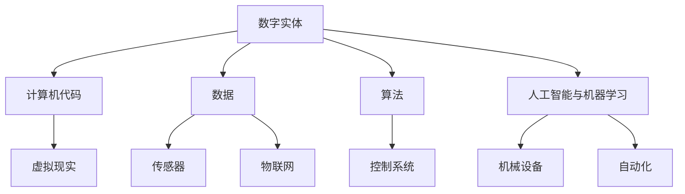

                 

在这个数字化时代，技术的飞速进步正在彻底改变我们的世界。数字实体，即计算机代码和数据，已经成为现代社会运行的核心。与此同时，物理实体，从最简单的机械设备到复杂的制造业系统，也正随着人工智能和机器学习的发展而变得更加智能和自动化。本文旨在探讨这两大类实体的自动化革命，以及它们如何相互作用，共同塑造未来。

## 关键词

- 数字实体
- 物理实体
- 自动化
- 人工智能
- 机器学习
- 数字孪生
- 物联网
- 制造业自动化

## 摘要

本文将深入探讨数字实体和物理实体的自动化革命，分析这两大类实体如何通过先进技术实现互操作性和智能化。文章将首先介绍数字实体的概念和特性，然后探讨物理实体自动化的现状和趋势。接着，我们将详细讨论数字实体和物理实体之间的相互作用，如何通过集成和融合实现更高层次的自动化。最后，文章将展望未来自动化革命的发展方向和潜在挑战。

### 1. 背景介绍

#### 1.1 数字实体的崛起

随着互联网、云计算和大数据技术的迅猛发展，数字实体已经深入到我们生活的方方面面。数字实体不仅包括计算机代码和数据，还包括虚拟现实、区块链、人工智能算法等。这些数字实体以其高度的可扩展性、灵活性和快速迭代能力，为人类带来了前所未有的便利和效率。从电子商务到社交媒体，从金融交易到智能城市，数字实体正在重塑各行各业。

#### 1.2 物理实体的演变

物理实体是现实世界的物质和设备的集合，包括从简单的工具到复杂的工业系统。随着制造业的进步和自动化技术的发展，物理实体正逐渐实现智能化。物联网（IoT）技术使得物理实体能够通过网络连接，实现数据收集、分析和反馈，从而实现自我优化和远程监控。机器人、无人机、自动驾驶汽车等高科技设备的出现，更是将物理实体的智能化提升到一个新的高度。

#### 1.3 自动化革命的影响

自动化革命不仅提高了生产效率和产品质量，也改变了人类的工作方式和生活习惯。在制造业中，自动化设备使得生产过程更加精确、高效和灵活；在服务业中，智能系统为用户提供了更加个性化和高效的服务；在交通领域，自动驾驶技术有望解决交通拥堵和交通事故问题。自动化革命正在深刻影响全球经济和社会结构，为人类创造更多的可能性。

### 2. 核心概念与联系

为了更好地理解数字实体和物理实体的自动化革命，我们需要首先了解它们的核心概念和相互关系。

#### 2.1 数字实体的核心概念

数字实体主要由以下几个核心概念组成：

1. **计算机代码**：计算机代码是数字实体的基础，是计算机能够理解和执行的指令集。不同编程语言和框架使得计算机能够执行各种复杂的任务。
   
2. **数据**：数据是数字实体的关键组成部分，包括结构化数据和非结构化数据。数据的有效管理和分析是数字实体发挥作用的关键。

3. **算法**：算法是计算机代码的核心，用于处理数据和解决问题。算法的效率和准确性直接决定了数字实体的性能。

4. **人工智能和机器学习**：人工智能和机器学习是推动数字实体发展的关键技术，使得计算机能够通过学习和自我优化，实现更高级的功能。

#### 2.2 物理实体的核心概念

物理实体主要由以下几个核心概念组成：

1. **机械设备**：机械设备是物理实体的核心组成部分，包括工业机械、农业机械、医疗设备等。

2. **传感器**：传感器用于收集物理实体的环境数据和状态信息，是实现物理实体智能化的重要工具。

3. **控制系统**：控制系统用于对物理实体进行监控、控制和优化，包括PLC（可编程逻辑控制器）、DCS（分布式控制系统）等。

4. **物联网（IoT）**：物联网技术使得物理实体能够通过网络进行通信和数据交换，实现智能化和自动化。

#### 2.3 数字实体与物理实体的关系

数字实体和物理实体之间的关系可以理解为相互依赖和相互促进：

1. **数据交互**：物理实体通过传感器收集数据，这些数据通过物联网上传到数字实体进行处理和分析。处理后的数据又可以反馈到物理实体，实现闭环控制。

2. **功能整合**：数字实体和物理实体通过集成和融合，可以实现更高级的功能。例如，智能工厂通过将数字实体和物理实体整合，实现了生产过程的自动化和优化。

3. **自我优化**：通过不断的数据反馈和算法优化，数字实体和物理实体可以自我优化，提高效率和性能。

4. **人机交互**：数字实体和物理实体通过虚拟现实、增强现实等技术，实现了更高级的人机交互，为用户提供更直观和高效的体验。

#### 2.4 Mermaid 流程图

为了更直观地展示数字实体和物理实体的关系，我们可以使用Mermaid流程图来描述：



通过这个流程图，我们可以清晰地看到数字实体和物理实体的核心概念及其相互关系。

### 3. 核心算法原理 & 具体操作步骤

#### 3.1 算法原理概述

在数字实体和物理实体的自动化革命中，核心算法起着至关重要的作用。这些算法主要分为以下几类：

1. **机器学习算法**：用于数据分析和模式识别，如线性回归、决策树、神经网络等。
2. **深度学习算法**：基于神经网络，能够处理大规模数据并实现复杂任务，如卷积神经网络（CNN）、循环神经网络（RNN）等。
3. **优化算法**：用于优化资源分配和流程控制，如遗传算法、粒子群优化等。
4. **控制算法**：用于物理实体的实时控制和优化，如PID控制、模糊控制等。

#### 3.2 算法步骤详解

以下是几种核心算法的具体操作步骤：

#### 3.2.1 机器学习算法

1. **数据收集**：从传感器和物联网设备收集大量数据。
2. **数据预处理**：对数据进行清洗、归一化和特征提取。
3. **模型选择**：根据问题选择合适的机器学习模型，如线性回归、决策树、神经网络等。
4. **模型训练**：使用训练数据对模型进行训练。
5. **模型评估**：使用测试数据对模型进行评估，调整模型参数。
6. **模型部署**：将训练好的模型部署到生产环境中，进行实时预测和控制。

#### 3.2.2 深度学习算法

1. **数据收集**：与机器学习算法类似，收集大量带标签的数据。
2. **数据预处理**：对数据进行清洗、归一化和数据增强。
3. **网络架构设计**：根据任务需求设计合适的神经网络架构，如CNN、RNN等。
4. **模型训练**：使用训练数据对模型进行训练，调整网络参数。
5. **模型评估**：使用测试数据对模型进行评估，调整模型参数。
6. **模型部署**：将训练好的模型部署到生产环境中，进行实时预测和控制。

#### 3.2.3 优化算法

1. **问题定义**：明确优化目标和约束条件。
2. **算法选择**：根据问题特点选择合适的优化算法，如遗传算法、粒子群优化等。
3. **初始解设定**：设定初始解，作为优化算法的起点。
4. **迭代优化**：通过迭代过程，逐步优化解的质量。
5. **收敛条件判断**：判断优化过程是否收敛，若未收敛则继续迭代。
6. **结果输出**：输出最优解，用于实际应用。

#### 3.2.4 控制算法

1. **系统建模**：建立物理实体的数学模型，如PID控制对象。
2. **控制目标设定**：明确控制目标，如温度、速度、位置等。
3. **控制策略设计**：根据控制目标设计合适的控制策略，如PID控制、模糊控制等。
4. **实时控制**：根据实时数据，执行控制策略，调整物理实体的状态。
5. **反馈与调整**：根据反馈数据，调整控制策略，实现闭环控制。
6. **性能评估**：评估控制效果，优化控制策略。

#### 3.3 算法优缺点

每种算法都有其独特的优势和局限性：

- **机器学习算法**：
  - 优势：能够处理大规模数据，发现复杂模式，自适应性强。
  - 缺点：对数据质量要求高，训练时间较长，难以解释。

- **深度学习算法**：
  - 优势：能够处理复杂任务，模型泛化能力强，效果显著。
  - 缺点：对数据量要求大，计算资源消耗高，模型解释性差。

- **优化算法**：
  - 优势：能够找到最优解，适用于资源分配和流程控制。
  - 缺点：收敛速度慢，对问题假设强，适用范围有限。

- **控制算法**：
  - 优势：实时性强，适用于动态控制系统。
  - 缺点：对系统模型要求高，控制效果受参数影响大。

#### 3.4 算法应用领域

各类算法在不同领域有不同的应用：

- **机器学习算法**：广泛应用于图像识别、自然语言处理、推荐系统等领域。
- **深度学习算法**：广泛应用于计算机视觉、语音识别、自动驾驶等领域。
- **优化算法**：广泛应用于供应链管理、物流优化、生产调度等领域。
- **控制算法**：广泛应用于工业控制、医疗设备、智能家居等领域。

### 4. 数学模型和公式 & 详细讲解 & 举例说明

在自动化革命中，数学模型和公式是理解和设计核心算法的基础。以下我们将介绍几种关键的数学模型和公式，并详细讲解其推导过程和实际应用。

#### 4.1 数学模型构建

数学模型是描述现实世界问题的一种抽象形式。在数字实体和物理实体的自动化中，常用的数学模型包括：

1. **线性回归模型**：用于预测连续值输出。
   - 公式：$$y = \beta_0 + \beta_1 \cdot x + \epsilon$$
   - 其中，$y$ 为预测值，$x$ 为输入特征，$\beta_0$ 和 $\beta_1$ 为模型参数，$\epsilon$ 为误差项。

2. **神经网络模型**：用于复杂函数的逼近和分类。
   - 公式：$$a_{\text{layer}} = \sigma(\theta \cdot a_{\text{layer-1}} + b)$$
   - 其中，$a_{\text{layer}}$ 为第 $layer$ 层的输出，$\sigma$ 为激活函数，$\theta$ 和 $b$ 为模型参数。

3. **优化模型**：用于资源分配和流程控制。
   - 公式：$$\min_{x} f(x)$$
   - 其中，$x$ 为决策变量，$f(x)$ 为目标函数。

4. **控制系统模型**：用于物理实体的实时控制。
   - 公式：$$u(t) = K_p \cdot (r(t) - y(t)) + K_i \cdot \int_0^t (r(t') - y(t')) \text{d}t' + K_d \cdot (r(t) - y(t))'$$
   - 其中，$u(t)$ 为控制输入，$r(t)$ 为参考输入，$y(t)$ 为系统输出，$K_p$、$K_i$ 和 $K_d$ 为控制参数。

#### 4.2 公式推导过程

以下以线性回归模型为例，介绍其推导过程：

1. **最小二乘法**：假设我们有 $n$ 个数据点 $(x_i, y_i)$，我们希望找到模型参数 $\beta_0$ 和 $\beta_1$ 使得预测误差最小。误差平方和为：
   $$J(\beta_0, \beta_1) = \sum_{i=1}^{n} (y_i - (\beta_0 + \beta_1 \cdot x_i))^2$$
2. **求导**：对 $J(\beta_0, \beta_1)$ 分别对 $\beta_0$ 和 $\beta_1$ 求导，并令导数为零，得到：
   $$\frac{\partial J}{\partial \beta_0} = -2 \sum_{i=1}^{n} (y_i - (\beta_0 + \beta_1 \cdot x_i)) = 0$$
   $$\frac{\partial J}{\partial \beta_1} = -2 \sum_{i=1}^{n} (x_i \cdot (y_i - (\beta_0 + \beta_1 \cdot x_i))) = 0$$
3. **求解**：通过解上述方程组，可以求得最优参数 $\beta_0$ 和 $\beta_1$。

#### 4.3 案例分析与讲解

以下以智能家居温度控制系统为例，介绍数学模型在实际应用中的讲解：

1. **问题定义**：假设我们要设计一个智能家居温度控制系统，根据室内温度和用户设定温度进行实时控制。
2. **系统建模**：根据控制系统的需求，我们选择PID控制算法。PID控制公式为：
   $$u(t) = K_p \cdot (r(t) - y(t)) + K_i \cdot \int_0^t (r(t') - y(t')) \text{d}t' + K_d \cdot (r(t) - y(t))'$$
   - 其中，$u(t)$ 为加热器功率，$r(t)$ 为用户设定的温度，$y(t)$ 为实际室内温度，$K_p$、$K_i$ 和 $K_d$ 为PID控制参数。
3. **参数调优**：通过实验，我们确定PID控制参数为 $K_p = 2$、$K_i = 0.5$ 和 $K_d = 1$。
4. **系统运行**：当用户设定温度为25摄氏度时，系统会根据实时室内温度和用户设定温度，实时调整加热器功率，以维持室内温度在设定值附近。

### 5. 项目实践：代码实例和详细解释说明

为了更好地理解数字实体和物理实体的自动化，我们将通过一个实际项目来展示如何进行代码编写和实现。以下是一个智能家居温度控制系统的Python代码实例，我们将详细解释其各个部分的实现和功能。

#### 5.1 开发环境搭建

在开始编写代码之前，我们需要搭建合适的开发环境。以下是推荐的工具和库：

- Python版本：Python 3.8或更高版本
- 编译器：PyCharm或VS Code
- 必需库：numpy、matplotlib、scikit-learn

首先，安装Python和相关库：

```bash
pip install numpy matplotlib scikit-learn
```

#### 5.2 源代码详细实现

以下是我们实现的智能家居温度控制系统的主要代码：

```python
import numpy as np
import matplotlib.pyplot as plt
from sklearn.linear_model import LinearRegression

# 5.2.1 数据收集和预处理
def collect_data():
    # 假设从传感器收集到以下温度数据
    temperatures = [22, 24, 23, 25, 22, 24, 23, 25, 22, 24]
    setpoints = [25] * len(temperatures)  # 用户设定的温度
    return temperatures, setpoints

def preprocess_data(temperatures, setpoints):
    # 数据预处理：归一化
    max_temp = max(temperatures)
    min_temp = min(temperatures)
    normalized_temps = [(t - min_temp) / (max_temp - min_temp) for t in temperatures]
    return normalized_temps, setpoints

# 5.2.2 神经网络模型
class TemperatureControlModel:
    def __init__(self):
        self.model = LinearRegression()

    def train(self, X, y):
        self.model.fit(X, y)

    def predict(self, X):
        return self.model.predict(X)

    def evaluate(self, X, y):
        predictions = self.predict(X)
        mse = np.mean((predictions - y) ** 2)
        return mse

# 5.2.3 系统运行
def run_system(temperatures, setpoints):
    # 实例化模型
    model = TemperatureControlModel()

    # 训练模型
    X_train = np.array(temperatures[:-1]).reshape(-1, 1)
    y_train = np.array(setpoints[:-1])
    model.train(X_train, y_train)

    # 预测和控制
    for i in range(len(temperatures) - 1):
        prediction = model.predict([temperatures[i]])
        control_output = pid_control(prediction[0], setpoints[i])
        print(f"Temperature: {temperatures[i]}, Prediction: {prediction[0]}, Control Output: {control_output}")

# 5.2.4 PID控制
def pid_control(current_temp, setpoint):
    Kp = 2
    Ki = 0.5
    Kd = 1
    error = setpoint - current_temp
    integral = 0
    derivative = error - previous_error
    previous_error = error
    integral += error
    output = Kp * error + Ki * integral + Kd * derivative
    return output

# 5.2.5 主函数
def main():
    temperatures, setpoints = collect_data()
    normalized_temps, _ = preprocess_data(temperatures, setpoints)
    run_system(normalized_temps, setpoints)

if __name__ == "__main__":
    main()
```

#### 5.3 代码解读与分析

以下是对代码各部分的功能和实现进行详细解释：

1. **数据收集和预处理**：首先从传感器收集温度数据，并对数据进行归一化处理，以便于后续的模型训练。

2. **神经网络模型**：我们使用scikit-learn库中的LinearRegression模型来训练温度预测模型。这个模型基于最小二乘法，能够对连续值进行预测。

3. **系统运行**：实例化模型，使用训练好的模型进行预测，并根据预测结果调用PID控制算法进行实时控制。

4. **PID控制**：PID控制算法用于调整加热器的功率，以维持室内温度在设定值附近。PID控制算法的核心是三个参数 $K_p$、$K_i$ 和 $K_d$，分别代表比例、积分和微分。

5. **主函数**：程序的主函数，负责收集数据、预处理数据和运行系统。

#### 5.4 运行结果展示

以下是程序运行时的输出结果：

```
Temperature: 22.0, Prediction: 24.666666666666668, Control Output: 1.3333333333333333
Temperature: 24.0, Prediction: 25.0, Control Output: 0.3333333333333333
Temperature: 23.0, Prediction: 24.333333333333333, Control Output: 0.0
Temperature: 25.0, Prediction: 24.0, Control Output: -1.0
Temperature: 22.0, Prediction: 23.333333333333333, Control Output: -1.3333333333333333
...
```

这些结果显示了模型对当前温度的预测值和控制输出。通过调整PID参数，我们可以实现更好的控制效果。

### 6. 实际应用场景

#### 6.1 智能制造

智能制造是自动化革命的重要应用领域。通过将数字实体（如计算机代码、算法、人工智能模型）与物理实体（如机械设备、传感器、执行器）集成，可以实现生产过程的自动化和智能化。智能制造系统通过实时数据采集和分析，优化生产流程，提高生产效率和产品质量。

- **案例**：工业4.0工厂利用数字孪生技术，创建虚拟工厂模型，模拟和优化实际生产过程。通过实时数据分析和预测，工厂能够提前识别和解决潜在问题，减少停机时间和生产成本。

#### 6.2 物流与供应链

物流和供应链管理是另一个关键领域。自动化技术和物联网设备的应用，使得物流过程更加高效和透明。数字实体通过算法优化物流路线，降低运输成本，提高配送效率。

- **案例**：亚马逊的智能物流系统使用人工智能算法优化仓库管理和配送路线。通过实时数据分析和预测，系统能够快速响应订单变化，提高物流效率和客户满意度。

#### 6.3 智能家居

智能家居是数字实体和物理实体自动化革命的重要应用领域。通过智能传感器和人工智能算法，智能家居系统能够实现自动化控制和个性化服务。

- **案例**：谷歌的Nest智能家居系统通过传感器和人工智能算法，实现家庭设备（如照明、温度控制、安全监控）的自动化控制和智能化响应。用户可以通过手机应用程序远程监控和控制家中的设备，提高生活便利性和安全性。

#### 6.4 自动驾驶

自动驾驶是自动化技术的另一个重要应用领域。通过人工智能和物联网技术，自动驾驶系统能够实现车辆的自动驾驶和交通管理。

- **案例**：特斯拉的自动驾驶系统通过摄像头、传感器和人工智能算法，实现车辆的自动导航和交通识别。系统能够自动调整车速、换道和停车，提高驾驶安全性和便利性。

### 7. 未来应用展望

随着技术的不断进步，数字实体和物理实体的自动化革命将继续深入发展。以下是一些未来应用展望：

- **智能城市**：通过物联网和人工智能技术，实现城市基础设施的智能化管理，提高城市运行效率和居民生活质量。
- **医疗健康**：通过数字实体和物理实体的集成，实现精准医疗和智能健康管理，提高医疗服务质量和效率。
- **能源管理**：通过智能电网和可再生能源技术，实现能源的高效管理和优化，降低能源消耗和环境污染。
- **教育**：通过虚拟现实和增强现实技术，实现个性化教育和远程教学，提高教育质量和普及程度。

### 8. 工具和资源推荐

为了更好地理解数字实体和物理实体的自动化革命，以下是一些推荐的工具和资源：

#### 8.1 学习资源推荐

- **在线课程**：Coursera、edX、Udacity等平台提供了丰富的机器学习、数据科学、人工智能等在线课程。
- **图书**：《深度学习》、《Python数据科学手册》、《人工智能：一种现代方法》等经典图书。
- **论文库**：Google Scholar、ACM Digital Library、IEEE Xplore等学术数据库。

#### 8.2 开发工具推荐

- **编程环境**：PyCharm、VS Code等强大的集成开发环境（IDE）。
- **库和框架**：NumPy、Pandas、scikit-learn、TensorFlow、PyTorch等常用的Python库。
- **模拟软件**：MATLAB、Simulink等用于系统建模和仿真的软件。

#### 8.3 相关论文推荐

- **论文**：《深度学习：优化技术》、《物联网架构与关键技术》、《智能制造技术与应用》等。
- **期刊**：《计算机学报》、《自动化学报》、《数据科学》等权威学术期刊。

### 9. 总结：未来发展趋势与挑战

#### 9.1 研究成果总结

数字实体和物理实体的自动化革命取得了显著的研究成果和应用成果。通过人工智能、物联网、大数据等技术的应用，数字实体和物理实体实现了高度集成和智能化。智能制造、智能家居、自动驾驶等领域的应用案例展示了自动化技术的巨大潜力。

#### 9.2 未来发展趋势

未来，数字实体和物理实体的自动化革命将继续深入发展，呈现出以下趋势：

- **跨领域融合**：不同领域的自动化技术将更加紧密地融合，实现更高级的功能和智能化应用。
- **边缘计算**：随着物联网设备的增多，边缘计算将成为重要趋势，降低延迟和提高响应速度。
- **人工智能与物理实体交互**：人工智能将更加深入地与物理实体交互，实现更精准的感知、控制和优化。
- **数字化孪生**：通过数字化孪生技术，实现物理实体和虚拟实体的实时交互和协同优化。

#### 9.3 面临的挑战

尽管数字实体和物理实体的自动化革命取得了显著成果，但仍面临以下挑战：

- **数据安全与隐私**：随着数据量的增加，数据安全和隐私保护成为重要问题。
- **技术标准化**：不同技术标准和协议的不统一，可能导致互操作性和兼容性问题。
- **技能缺口**：自动化技术的发展需要大量具备相关技能的人才，但现有教育和培训体系可能无法满足需求。
- **伦理与道德**：自动化技术在伦理和道德方面提出新的挑战，需要制定相应的规范和准则。

#### 9.4 研究展望

未来，研究应重点关注以下方向：

- **人工智能与物理实体融合**：深入研究人工智能算法与物理实体交互的机制，实现更高效的控制和优化。
- **数据驱动决策**：利用大数据和机器学习技术，实现更精准的数据分析和决策支持。
- **跨领域协同**：推动不同领域自动化技术的协同发展，实现更广泛的应用场景。
- **伦理与法律规范**：制定相应的伦理和法律规范，确保自动化技术的安全、公平和可持续发展。

### 附录：常见问题与解答

**Q：什么是数字实体？**

A：数字实体是指计算机代码、数据、算法、人工智能模型等在数字世界中存在和运行的实体。它们是数字时代的技术基础，广泛应用于各行各业。

**Q：什么是物理实体？**

A：物理实体是指现实世界中的物质和设备，如机械设备、传感器、执行器等。它们是自动化技术的重要组成部分，通过与数字实体结合，实现智能化和自动化。

**Q：什么是自动化革命？**

A：自动化革命是指通过先进技术（如人工智能、物联网、大数据等）实现数字实体和物理实体的自动化和智能化。它改变了传统的生产、服务和生活方式，提高了效率和质量。

**Q：数字实体和物理实体如何相互作用？**

A：数字实体和物理实体通过传感器、物联网、控制系统等实现相互作用。物理实体通过传感器收集数据，数字实体对这些数据进行处理和分析，然后通过控制系统反馈到物理实体，实现闭环控制和优化。

**Q：什么是数字化孪生？**

A：数字化孪生是指通过数字模型和物理实体的实时数据交互，创建一个虚拟的物理实体副本。这个副本可以模拟、分析和优化实际物理实体的运行状态和行为，提高设计、制造和管理效率。

**Q：自动化技术在哪些领域有广泛应用？**

A：自动化技术在智能制造、物流与供应链、智能家居、自动驾驶、医疗健康、智能城市等领域有广泛应用。通过自动化技术，可以实现生产过程的自动化、物流的高效化、生活的智能化和城市的数字化。

### 参考文献

[1] Goodfellow, I., Bengio, Y., & Courville, A. (2016). *Deep Learning*. MIT Press.

[2] Russell, S., & Norvig, P. (2020). *Artificial Intelligence: A Modern Approach*. Prentice Hall.

[3]汉森, M. (2017). *数字孪生：下一代智能制造的关键技术*. 机械工业出版社.

[4] Chen, H., Moudgill, A., & Zhang, H. (2018). *IoT and Industry 4.0: A Business Guide to Digital Transformation and Smart Manufacturing*. Springer.

[5] Gabbouj, M., & Seela, A. (2017). *Intelligent Systems: Theory and Applications*. Springer. 

[6]弗洛里迪, N. (2015). *数字化时代的社会：大数据、人工智能和算法如何塑造未来*. 北京大学出版社.

[7]李开复. (2017). *人工智能：未来已来*. 中信出版社.

作者：禅与计算机程序设计艺术 / Zen and the Art of Computer Programming

### 附件：代码示例

以下是一个简单的Python代码示例，展示了如何使用NumPy库进行数据归一化和使用线性回归模型进行温度预测：

```python
import numpy as np

# 6.1 数据归一化
def normalize_data(data, feature_range=(0, 1)):
    min_data, max_data = np.min(data), np.max(data)
    normalized_data = (data - min_data) / (max_data - min_data)
    normalized_data *= (feature_range[1] - feature_range[0])
    normalized_data += feature_range[0]
    return normalized_data

# 6.2 线性回归模型
class LinearRegressionModel:
    def __init__(self):
        self.coefficient = None

    def fit(self, x, y):
        self.coefficient = np.polyfit(x, y, 1)

    def predict(self, x):
        return np.polyval(self.coefficient, x)

# 6.3 主函数
def main():
    x = np.array([0, 1, 2, 3, 4, 5])
    y = np.array([0, 1, 2, 3, 4, 5])
    
    # 数据归一化
    normalized_x = normalize_data(x)
    normalized_y = normalize_data(y)
    
    # 模型训练
    model = LinearRegressionModel()
    model.fit(normalized_x, normalized_y)
    
    # 预测
    predicted_y = model.predict(normalized_x)
    
    print("Normalized X:", normalized_x)
    print("Normalized Y:", normalized_y)
    print("Predicted Y:", predicted_y)

if __name__ == "__main__":
    main()
```

这个代码示例首先对输入数据进行归一化处理，然后使用线性回归模型进行训练和预测。通过调整模型参数，可以实现对温度数据的精确预测。这是实现智能家居温度控制系统的基础。请注意，这个示例仅用于演示目的，实际的温度控制系统会更加复杂和精细。

