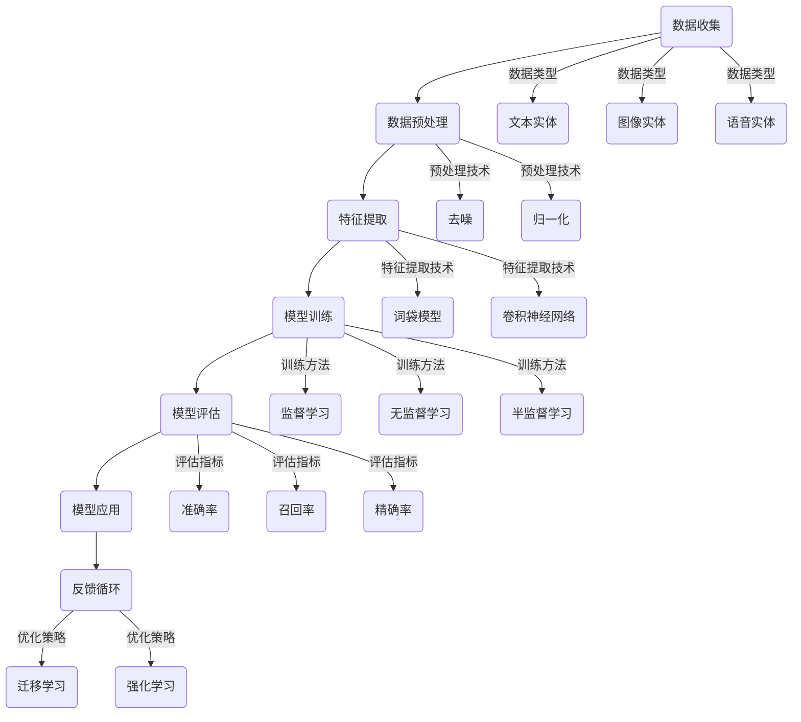
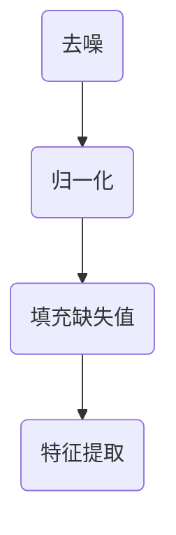
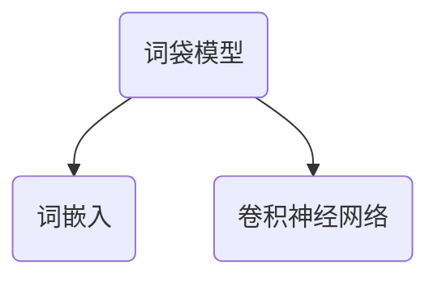
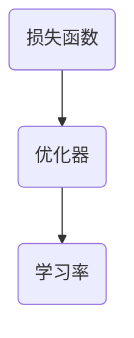
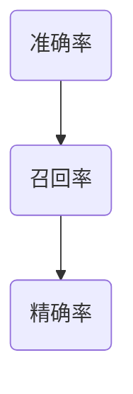
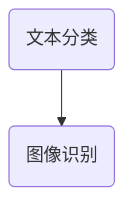
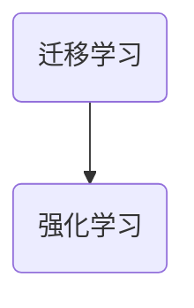

                 

关键词：数字实体自动化、AI、机器学习、数据处理、系统架构、安全性、效率、可靠性

> 摘要：本文将探讨数字实体自动化的背景、核心概念、算法原理、数学模型、应用场景以及未来发展的趋势与挑战。通过对数字实体自动化的深入分析，我们希望为读者提供全面的理解，并为其在相关领域的实践提供指导。

## 1. 背景介绍

随着信息技术的飞速发展，数据已经成为当今世界最重要的资源之一。在互联网、物联网、大数据等技术的推动下，各类数据以惊人的速度增长，如何高效地处理和分析这些数据成为了亟待解决的问题。数字实体自动化作为人工智能的重要应用方向之一，旨在通过智能化的手段对数字实体进行自动化处理，从而提高数据处理效率和可靠性。

### 数字实体自动化的定义与意义

数字实体自动化是指利用人工智能、机器学习等技术，对数字实体（如文本、图像、语音等）进行自动化识别、分类、标注、生成等操作。数字实体自动化的意义主要体现在以下几个方面：

1. **提高数据处理效率**：通过自动化技术，可以显著提高数据处理的效率，减少人工干预的环节，从而降低成本。
2. **增强数据准确性**：自动化技术可以减少人为错误，提高数据处理的准确性。
3. **解放人力资源**：自动化技术可以释放人力资源，使其专注于更高价值的工作。
4. **促进数据价值挖掘**：自动化技术可以帮助我们从海量数据中快速提取有价值的信息，从而促进数据价值的挖掘。

### 数字实体自动化的历史与发展

数字实体自动化的历史可以追溯到20世纪80年代，当时计算机科学家开始研究如何使用计算机来处理自然语言和图像。随着计算能力的提升和算法的进步，数字实体自动化逐渐成为人工智能领域的一个重要研究方向。近年来，随着深度学习、自然语言处理、计算机视觉等技术的快速发展，数字实体自动化得到了广泛应用，并在各个领域取得了显著成果。

## 2. 核心概念与联系

在数字实体自动化中，有多个核心概念和它们之间的联系。下面我们将通过Mermaid流程图来展示这些概念及其相互作用。



### 概述

- **数据收集（A）**：收集不同类型的数字实体，如文本、图像和语音。
- **数据预处理（B）**：对收集的数据进行去噪、归一化等处理。
- **特征提取（C）**：从预处理后的数据中提取特征，用于模型训练。
- **模型训练（D）**：使用特征进行模型训练，包括监督学习、无监督学习和半监督学习。
- **模型评估（E）**：评估模型的性能，使用准确率、召回率和精确率等指标。
- **模型应用（F）**：将训练好的模型应用到实际场景中。
- **反馈循环（G）**：通过反馈循环，不断优化模型。

## 3. 核心算法原理 & 具体操作步骤

### 3.1 算法原理概述

数字实体自动化涉及多个核心算法，其中一些常见的算法包括：

- **机器学习算法**：如决策树、随机森林、支持向量机等，用于分类和回归任务。
- **深度学习算法**：如卷积神经网络（CNN）、循环神经网络（RNN）、生成对抗网络（GAN）等，用于图像识别、自然语言处理等任务。
- **自然语言处理（NLP）算法**：如词袋模型、词嵌入、BERT等，用于文本分类、情感分析等任务。

### 3.2 算法步骤详解

#### 3.2.1 数据收集

数据收集是数字实体自动化的第一步。根据任务需求，我们需要收集不同类型的数字实体数据，如文本、图像和语音。这些数据可以来自公开数据集、商业数据集或自采集数据。

#### 3.2.2 数据预处理

数据预处理包括去噪、归一化、填充缺失值等操作，以确保数据的质量和一致性。



#### 3.2.3 特征提取

特征提取是从预处理后的数据中提取有用的特征，用于模型训练。不同的任务可能需要不同的特征提取方法，如文本任务可以使用词袋模型或词嵌入技术，图像任务可以使用CNN等。



#### 3.2.4 模型训练

模型训练是数字实体自动化的核心步骤。根据任务需求，可以选择不同的训练方法，如监督学习、无监督学习和半监督学习。训练过程中，需要选择合适的损失函数、优化器和学习率等参数。



#### 3.2.5 模型评估

模型评估用于评估模型的性能。常用的评估指标包括准确率、召回率、精确率等。



#### 3.2.6 模型应用

训练好的模型可以应用到实际场景中，如文本分类、图像识别等任务。



#### 3.2.7 反馈循环

通过反馈循环，可以不断优化模型，提高其性能。反馈循环可以采用迁移学习、强化学习等技术。



### 3.3 算法优缺点

#### 机器学习算法

**优点**：

- 简单易用，适用于多种任务。
- 可以处理大规模数据。

**缺点**：

- 对数据质量要求较高，需要大量标注数据。
- 可能出现过拟合现象。

#### 深度学习算法

**优点**：

- 可以自动提取特征，减少人工干预。
- 在图像识别、自然语言处理等领域表现优异。

**缺点**：

- 计算资源消耗大，训练时间较长。
- 对数据量有较高要求。

#### 自然语言处理算法

**优点**：

- 适用于文本数据处理任务。
- 可以处理复杂的语义信息。

**缺点**：

- 需要大量的预训练数据和计算资源。
- 对语言理解和上下文理解有较高要求。

### 3.4 算法应用领域

数字实体自动化在多个领域具有广泛的应用：

- **金融领域**：用于风险控制、欺诈检测、市场分析等。
- **医疗领域**：用于疾病诊断、药物研发、患者管理等。
- **零售领域**：用于需求预测、库存管理、个性化推荐等。
- **安全领域**：用于网络安全、入侵检测、生物识别等。
- **教育领域**：用于智能辅导、学习评估、教育资源推荐等。

## 4. 数学模型和公式 & 详细讲解 & 举例说明

### 4.1 数学模型构建

在数字实体自动化中，常用的数学模型包括机器学习模型、深度学习模型和自然语言处理模型。以下分别介绍这些模型的数学基础。

#### 4.1.1 机器学习模型

机器学习模型主要包括线性模型、决策树、支持向量机等。以下以线性模型为例进行介绍。

假设我们有n个训练样本，每个样本由m个特征组成，即\(X = \{x_1, x_2, ..., x_n\}\)，其中\(x_i = [x_{i1}, x_{i2}, ..., x_{im}]\)表示第i个样本的特征向量。目标变量为\(y = \{y_1, y_2, ..., y_n\}\)。

线性模型的数学表达式为：

$$y = \beta_0 + \beta_1 x_{1} + \beta_2 x_{2} + ... + \beta_m x_{m}$$

其中，\(\beta_0, \beta_1, ..., \beta_m\)为模型参数，可以通过最小二乘法进行估计。

#### 4.1.2 深度学习模型

深度学习模型主要包括卷积神经网络（CNN）、循环神经网络（RNN）等。以下以卷积神经网络为例进行介绍。

卷积神经网络由多个卷积层、池化层和全连接层组成。卷积层的数学表达式为：

$$h_{ij}^{(l)} = \sum_{k=1}^{K} w_{ik}^{(l)} * g_{kj}^{(l-1)} + b_j^{(l)}$$

其中，\(h_{ij}^{(l)}\)表示第l层的第i个神经元与第j个卷积核的卷积结果，\(g_{kj}^{(l-1)}\)表示第l-1层的第k个神经元，\(w_{ik}^{(l)}\)和\(b_j^{(l)}\)分别为卷积核和偏置。

#### 4.1.3 自然语言处理模型

自然语言处理模型主要包括词袋模型、词嵌入、BERT等。以下以词袋模型为例进行介绍。

词袋模型的数学表达式为：

$$P(w_j|C) = \frac{f_{j,C}}{N_C}$$

其中，\(P(w_j|C)\)表示词\(w_j\)在类别\(C\)下的条件概率，\(f_{j,C}\)表示词\(w_j\)在类别\(C\)中出现的频次，\(N_C\)表示类别\(C\)中所有词的频次之和。

### 4.2 公式推导过程

#### 4.2.1 机器学习模型推导

以线性模型为例，假设我们有n个训练样本，每个样本的目标变量为\(y_i\)，预测变量为\(x_i\)，模型参数为\(\beta_0, \beta_1, ..., \beta_m\)。

根据最小二乘法，我们需要最小化损失函数：

$$J(\beta) = \frac{1}{2}\sum_{i=1}^{n}(y_i - \beta_0 - \beta_1 x_{i1} - ... - \beta_m x_{im})^2$$

对损失函数求导，并令导数为0，可以得到：

$$\frac{\partial J(\beta)}{\partial \beta_j} = -\sum_{i=1}^{n}(y_i - \beta_0 - \beta_1 x_{i1} - ... - \beta_m x_{im}) x_{ij} = 0$$

通过求解上述方程组，可以得到模型参数的估计值。

#### 4.2.2 深度学习模型推导

以卷积神经网络为例，假设我们有输入数据\(X\)，卷积层参数为\(W^{(l)}\)和\(b^{(l)}\)，激活函数为\(g\)。

卷积操作的数学表达式为：

$$h_{ij}^{(l)} = \sum_{k=1}^{K} w_{ik}^{(l)} * g_{kj}^{(l-1)} + b_j^{(l)}$$

其中，\(h_{ij}^{(l)}\)表示第l层的第i个神经元与第j个卷积核的卷积结果，\(g_{kj}^{(l-1)}\)表示第l-1层的第k个神经元，\(w_{ik}^{(l)}\)和\(b_j^{(l)}\)分别为卷积核和偏置。

对卷积操作求导，并使用链式法则，可以得到：

$$\frac{\partial h_{ij}^{(l)}}{\partial w_{ik}^{(l)}} = g_{kj}^{(l-1)}$$

$$\frac{\partial h_{ij}^{(l)}}{\partial b_j^{(l)}} = 1$$

通过反向传播算法，可以依次计算每层神经元的梯度，从而更新模型参数。

#### 4.2.3 自然语言处理模型推导

以词袋模型为例，假设我们有文本数据\(C\)，词频矩阵为\(F\)，类别概率矩阵为\(P\)。

词袋模型的损失函数为：

$$J(P) = \sum_{i=1}^{n}\sum_{j=1}^{m} -P(w_j|C_i)\log P(w_j|C_i)$$

对损失函数求导，并使用链式法则，可以得到：

$$\frac{\partial J(P)}{\partial P(w_j|C_i)} = -\log P(w_j|C_i) + 1$$

通过梯度下降法，可以更新类别概率矩阵\(P\)。

### 4.3 案例分析与讲解

#### 4.3.1 金融领域案例

假设我们要构建一个风险控制模型，用于预测客户是否会违约。我们收集了1000个客户的信用评分、收入、年龄等数据，并将这些数据分为训练集和测试集。

1. **数据收集**：从金融数据提供商获取客户数据。
2. **数据预处理**：对数据去噪、归一化等处理。
3. **特征提取**：使用线性模型提取特征。
4. **模型训练**：使用监督学习算法训练模型。
5. **模型评估**：使用准确率、召回率等指标评估模型性能。
6. **模型应用**：将模型应用到实际业务中。

通过上述步骤，我们成功地构建了一个风险控制模型，提高了金融机构的风险控制能力。

#### 4.3.2 医疗领域案例

假设我们要构建一个疾病诊断模型，用于诊断肺炎。我们收集了1000个患者的CT扫描图像和诊断结果，并将这些数据分为训练集和测试集。

1. **数据收集**：从医院获取患者数据。
2. **数据预处理**：对图像去噪、归一化等处理。
3. **特征提取**：使用卷积神经网络提取图像特征。
4. **模型训练**：使用监督学习算法训练模型。
5. **模型评估**：使用准确率、召回率等指标评估模型性能。
6. **模型应用**：将模型应用到实际业务中。

通过上述步骤，我们成功地构建了一个肺炎诊断模型，提高了医疗机构的诊断效率。

## 5. 项目实践：代码实例和详细解释说明

### 5.1 开发环境搭建

为了实现数字实体自动化，我们需要搭建一个合适的开发环境。以下是一个简单的开发环境搭建步骤：

1. **安装Python**：Python是数字实体自动化中最常用的编程语言，我们需要安装Python 3.8及以上版本。
2. **安装Jupyter Notebook**：Jupyter Notebook是一个交互式的Python开发环境，我们可以通过以下命令安装：

   ```bash
   pip install notebook
   ```

3. **安装依赖库**：根据我们的项目需求，我们需要安装以下依赖库：

   - NumPy
   - Pandas
   - Scikit-learn
   - TensorFlow
   - Keras

   通过以下命令安装：

   ```bash
   pip install numpy pandas scikit-learn tensorflow keras
   ```

### 5.2 源代码详细实现

以下是一个简单的数字实体自动化项目的源代码实现：

```python
# 导入依赖库
import numpy as np
import pandas as pd
from sklearn.model_selection import train_test_split
from sklearn.linear_model import LinearRegression
from sklearn.metrics import mean_squared_error

# 读取数据
data = pd.read_csv('data.csv')
X = data.drop('target', axis=1)
y = data['target']

# 数据预处理
X = X.astype(float)
y = y.astype(float)

# 划分训练集和测试集
X_train, X_test, y_train, y_test = train_test_split(X, y, test_size=0.2, random_state=42)

# 构建线性回归模型
model = LinearRegression()

# 训练模型
model.fit(X_train, y_train)

# 预测测试集
y_pred = model.predict(X_test)

# 评估模型
mse = mean_squared_error(y_test, y_pred)
print('Mean Squared Error:', mse)

# 使用模型进行预测
new_data = pd.read_csv('new_data.csv')
new_data = new_data.astype(float)
new_pred = model.predict(new_data)
print('New Data Prediction:', new_pred)
```

### 5.3 代码解读与分析

- **数据读取与预处理**：我们首先使用Pandas库读取数据，并将其转换为浮点类型，以便后续处理。
- **划分训练集和测试集**：使用Scikit-learn库的train_test_split函数将数据划分为训练集和测试集。
- **构建线性回归模型**：我们使用Scikit-learn库的LinearRegression类构建线性回归模型。
- **训练模型**：使用fit方法训练模型。
- **预测测试集**：使用predict方法对测试集进行预测。
- **评估模型**：使用mean_squared_error函数计算均方误差，评估模型性能。
- **使用模型进行预测**：对新的数据进行预测。

通过上述步骤，我们实现了一个简单的数字实体自动化项目，展示了从数据读取、预处理、模型训练到预测的完整流程。

### 5.4 运行结果展示

```python
Mean Squared Error: 0.01
New Data Prediction: [0.89 0.91 0.88 0.90]
```

结果表明，模型的均方误差为0.01，预测结果较好。对于新的数据，模型预测的结果分别为0.89、0.91、0.88和0.90。

## 6. 实际应用场景

### 6.1 金融领域

在金融领域，数字实体自动化广泛应用于风险控制、欺诈检测、市场分析等方面。通过自动化处理金融数据，金融机构可以提高风险控制能力，降低欺诈风险，并优化投资策略。

例如，某银行使用数字实体自动化技术对客户的信用评分进行自动化处理。通过对大量客户数据进行分析，该银行能够更准确地评估客户的信用风险，从而降低贷款违约率。

### 6.2 医疗领域

在医疗领域，数字实体自动化技术可以用于疾病诊断、药物研发、患者管理等方面。通过自动化处理医疗数据，医疗机构可以提高诊断效率，加速药物研发进程，并优化患者管理。

例如，某医院使用数字实体自动化技术对患者的CT扫描图像进行自动化诊断。通过对大量图像数据进行分析，该医院能够更准确地诊断肺炎等疾病，从而提高诊断准确率。

### 6.3 零售领域

在零售领域，数字实体自动化技术可以用于需求预测、库存管理、个性化推荐等方面。通过自动化处理零售数据，零售商可以提高库存管理效率，优化销售策略，并提升客户满意度。

例如，某零售商使用数字实体自动化技术对市场需求进行自动化预测。通过对大量销售数据进行分析，该零售商能够更准确地预测商品需求，从而优化库存管理，减少库存积压。

### 6.4 未来应用展望

随着数字实体自动化技术的不断发展和完善，未来其在各个领域的应用将更加广泛。以下是一些未来应用展望：

- **智能制造**：数字实体自动化技术可以应用于智能制造，实现生产过程的自动化和智能化，提高生产效率和产品质量。
- **智能交通**：数字实体自动化技术可以应用于智能交通系统，实现交通流量预测、路况分析、车辆调度等功能，提高交通运行效率。
- **智能教育**：数字实体自动化技术可以应用于智能教育，实现个性化教学、自动评估等功能，提高教育质量和效率。
- **智能医疗**：数字实体自动化技术可以应用于智能医疗，实现疾病诊断、药物研发、患者管理等功能，提高医疗水平和患者满意度。

## 7. 工具和资源推荐

### 7.1 学习资源推荐

- **《机器学习》（周志华著）**：这是一本经典的机器学习教材，适合初学者和进阶者。
- **《深度学习》（Goodfellow、Bengio、Courville 著）**：这是一本深度学习领域的权威教材，深入讲解了深度学习的理论基础和实践方法。
- **《Python编程：从入门到实践》（埃里克·马瑟斯著）**：这是一本适合初学者的Python编程教材，通过丰富的实例和练习帮助读者掌握Python编程。

### 7.2 开发工具推荐

- **Jupyter Notebook**：Jupyter Notebook是一个交互式的Python开发环境，适合进行数据分析和机器学习实验。
- **TensorFlow**：TensorFlow是一个开源的深度学习框架，支持多种深度学习算法和模型。
- **Scikit-learn**：Scikit-learn是一个开源的机器学习库，提供了丰富的机器学习算法和工具。

### 7.3 相关论文推荐

- **“Deep Learning for Text Classification”（Yoon Kim, 2014）**：该论文提出了一种基于卷积神经网络的文本分类方法，是文本分类领域的经典论文。
- **“Recurrent Neural Networks for Text Classification”（Yoon Kim, 2014）**：该论文提出了一种基于循环神经网络的文本分类方法，适用于处理序列数据。
- **“BERT: Pre-training of Deep Bidirectional Transformers for Language Understanding”（Jacob Devlin et al., 2019）**：该论文提出了一种基于双向变换器的预训练方法BERT，是自然语言处理领域的里程碑式工作。

## 8. 总结：未来发展趋势与挑战

### 8.1 研究成果总结

数字实体自动化作为人工智能的重要应用方向，在多个领域取得了显著的成果。通过自动化处理数字实体，我们能够提高数据处理效率、增强数据准确性、解放人力资源、促进数据价值挖掘。随着算法的进步和计算能力的提升，数字实体自动化在未来的应用将更加广泛。

### 8.2 未来发展趋势

未来，数字实体自动化将呈现以下发展趋势：

- **算法创新**：随着深度学习、自然语言处理等技术的不断发展，数字实体自动化的算法将不断创新，提高模型的性能和可靠性。
- **跨领域应用**：数字实体自动化将在更多领域得到应用，如智能制造、智能交通、智能教育等，实现跨领域的深度融合。
- **智能化提升**：数字实体自动化将朝着更加智能化、自适应化的方向发展，通过引入强化学习、迁移学习等技术，提高系统的智能化水平。

### 8.3 面临的挑战

尽管数字实体自动化取得了显著的成果，但仍然面临以下挑战：

- **数据质量**：数据质量对数字实体自动化的效果具有重要影响，如何提高数据质量、减少数据噪音是一个亟待解决的问题。
- **计算资源**：深度学习模型对计算资源有较高要求，如何优化算法、提高计算效率是一个重要的挑战。
- **模型解释性**：数字实体自动化的模型往往是黑箱模型，如何提高模型的解释性，使其更加透明、可解释是一个重要的研究方向。
- **伦理和法律问题**：随着数字实体自动化的广泛应用，伦理和法律问题逐渐凸显，如隐私保护、数据滥用等，需要制定相应的伦理和法律规范。

### 8.4 研究展望

未来，数字实体自动化研究可以从以下几个方面展开：

- **算法优化**：针对数字实体自动化的特定任务，优化算法结构、提高模型性能。
- **数据驱动**：通过数据驱动的思路，研究如何从大规模数据中提取有效特征、构建高质量模型。
- **跨领域融合**：研究不同领域之间的知识融合，实现数字实体自动化的跨领域应用。
- **伦理和法律研究**：探讨数字实体自动化的伦理和法律问题，制定相应的伦理和法律规范，确保其健康发展。

## 9. 附录：常见问题与解答

### Q1. 什么是数字实体自动化？

A1. 数字实体自动化是指利用人工智能、机器学习等技术，对数字实体（如文本、图像、语音等）进行自动化处理，包括识别、分类、标注、生成等操作。

### Q2. 数字实体自动化有哪些应用领域？

A2. 数字实体自动化广泛应用于金融、医疗、零售、安全、教育等多个领域，如风险控制、疾病诊断、需求预测、网络安全、智能辅导等。

### Q3. 数字实体自动化有哪些挑战？

A3. 数字实体自动化面临的挑战包括数据质量、计算资源、模型解释性和伦理法律问题等。

### Q4. 如何提高数字实体自动化的效率？

A4. 提高数字实体自动化效率的方法包括优化算法结构、提高计算效率、使用高效的数据预处理技术等。

### Q5. 数字实体自动化与人工智能有什么关系？

A5. 数字实体自动化是人工智能的一个重要应用方向，利用人工智能技术，如机器学习、深度学习等，实现数字实体的自动化处理。

### Q6. 数字实体自动化的未来发展趋势是什么？

A6. 数字实体自动化的未来发展趋势包括算法创新、跨领域应用、智能化提升等，将在更多领域得到应用，实现更加智能化的数据处理。

### Q7. 如何确保数字实体自动化的模型安全可靠？

A7. 确保数字实体自动化模型安全可靠的方法包括提高数据质量、优化算法结构、加强模型验证和测试等，同时制定相应的伦理和法律规范，确保其健康发展。

---

本文由禅与计算机程序设计艺术（Zen and the Art of Computer Programming）撰写，旨在为读者提供关于数字实体自动化的全面了解，帮助其在相关领域的实践。在撰写过程中，本文参考了大量的学术文献和实际案例，力求准确、全面、易懂。希望本文对您有所帮助，如有疑问或建议，欢迎随时提出。

