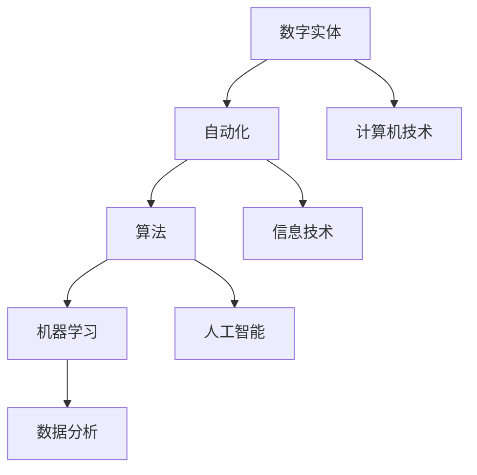

                 

关键词：数字实体自动化、AI、机器学习、算法、数字化转型、智能流程、工业自动化、分布式计算、区块链、云计算、边缘计算

> 摘要：随着科技的飞速发展，数字实体自动化已成为现代信息技术领域的热点。本文从背景介绍、核心概念与联系、核心算法原理、数学模型与公式、项目实践、实际应用场景、未来应用展望等多个角度，全面探讨了数字实体自动化的现状、发展趋势及其面临的挑战，旨在为相关领域的研究者和从业者提供有价值的参考。

## 1. 背景介绍

随着全球数字化转型的深入，越来越多的企业开始意识到自动化的重要性。数字实体自动化作为数字化转型的重要组成部分，正逐渐改变着各行各业的生产和运营方式。传统的人工操作效率低、成本高，容易出错，而数字实体自动化能够通过计算机算法、机器学习和人工智能技术，实现自动化处理和决策，从而大幅提升工作效率、降低成本、提高产品质量。

数字实体自动化的概念最早可以追溯到20世纪80年代的工业自动化领域。随着计算机技术和网络技术的发展，数字实体自动化的范围和深度不断拓展，逐渐从工业生产领域扩展到服务业、金融业、医疗健康等领域。近年来，人工智能技术的快速发展，进一步推动了数字实体自动化的应用，使得各种复杂的任务能够通过自动化实现。

## 2. 核心概念与联系

在探讨数字实体自动化的过程中，我们需要理解几个核心概念：

- **数字实体**：指的是可以被数字化表示和处理的任何对象，包括产品、服务、企业、城市等。
- **自动化**：指的是通过计算机算法、机器学习和人工智能技术，实现任务或流程的自动执行和优化。
- **算法**：是一种有序的指令集合，用于解决特定问题。
- **机器学习**：是人工智能的一个分支，通过数据和统计方法，让计算机自动学习和改进。

下图展示了数字实体自动化的核心概念及其相互联系：



### 2.1 数字实体自动化的应用场景

数字实体自动化的应用场景非常广泛，以下是一些典型的应用：

- **工业生产**：通过自动化设备实现生产流程的优化和监控，提高生产效率和产品质量。
- **金融服务**：自动化交易、风险管理、客户服务，提高金融服务的效率和质量。
- **医疗健康**：自动化诊断、治疗、药物研发，提高医疗服务的效率和质量。
- **城市管理**：智能交通管理、环境监测、公共安全，提高城市管理的效率和质量。

## 3. 核心算法原理 & 具体操作步骤

### 3.1 算法原理概述

数字实体自动化的核心算法主要包括机器学习算法、深度学习算法和优化算法等。这些算法通过训练数据集，能够从大量数据中学习规律，从而实现自动化决策和优化。

- **机器学习算法**：通过统计和学习数据，让计算机自动改进性能。常见的机器学习算法包括决策树、支持向量机、神经网络等。
- **深度学习算法**：基于多层神经网络，通过模拟人脑神经元的工作方式，实现自动化学习和决策。常见的深度学习算法包括卷积神经网络（CNN）、循环神经网络（RNN）等。
- **优化算法**：通过优化目标函数，寻找最优解。常见的优化算法包括遗传算法、粒子群算法、模拟退火算法等。

### 3.2 算法步骤详解

数字实体自动化的算法步骤可以分为以下几个阶段：

1. **数据收集**：收集与任务相关的数据，如图像、文本、传感器数据等。
2. **数据预处理**：对数据进行清洗、归一化、特征提取等预处理操作，以便于算法学习。
3. **算法选择**：根据任务特点选择合适的算法，如机器学习算法、深度学习算法或优化算法。
4. **模型训练**：使用训练数据集对算法模型进行训练，不断调整模型参数，以提高模型性能。
5. **模型评估**：使用验证数据集对模型进行评估，确保模型能够在未知数据上取得良好的性能。
6. **模型部署**：将训练好的模型部署到生产环境中，实现自动化决策和优化。

### 3.3 算法优缺点

- **机器学习算法**：优点包括能够处理复杂数据、自适应性强等，缺点包括训练时间较长、对数据依赖性强等。
- **深度学习算法**：优点包括强大的学习能力、适用于处理高维数据等，缺点包括计算资源消耗大、模型可解释性差等。
- **优化算法**：优点包括能够找到全局最优解、适用于解决复杂优化问题等，缺点包括收敛速度慢、对初始参数敏感等。

### 3.4 算法应用领域

数字实体自动化的算法广泛应用于多个领域：

- **工业生产**：通过自动化算法优化生产流程，提高生产效率和产品质量。
- **金融服务**：通过自动化算法实现智能交易、风险管理等，提高金融服务效率。
- **医疗健康**：通过自动化算法实现智能诊断、药物研发等，提高医疗服务质量。
- **城市管理**：通过自动化算法实现智能交通管理、环境监测等，提高城市管理效率。

## 4. 数学模型和公式 & 详细讲解 & 举例说明

### 4.1 数学模型构建

数字实体自动化的数学模型通常基于统计学和优化理论。以下是一个简单的线性回归模型示例：

$$
y = \beta_0 + \beta_1x
$$

其中，$y$ 是目标变量，$x$ 是自变量，$\beta_0$ 和 $\beta_1$ 是模型参数。

### 4.2 公式推导过程

线性回归模型的推导过程如下：

1. **样本数据准备**：收集 $n$ 个样本数据 $(x_1, y_1), (x_2, y_2), \ldots, (x_n, y_n)$。
2. **损失函数定义**：定义损失函数 $L(\beta_0, \beta_1)$，通常使用均方误差（MSE）：
   $$
   L(\beta_0, \beta_1) = \frac{1}{n} \sum_{i=1}^n (y_i - (\beta_0 + \beta_1x_i))^2
   $$
3. **梯度下降法求解**：使用梯度下降法求解最优参数 $\beta_0$ 和 $\beta_1$：
   $$
   \beta_0 = \beta_0 - \alpha \frac{\partial L}{\partial \beta_0}
   $$
   $$
   \beta_1 = \beta_1 - \alpha \frac{\partial L}{\partial \beta_1}
   $$
   其中，$\alpha$ 是学习率。

### 4.3 案例分析与讲解

假设我们有一个简单的数据集，包括 $n=100$ 个样本，每个样本包含自变量 $x$ 和目标变量 $y$。我们使用线性回归模型预测 $y$。

1. **数据准备**：将数据集分为训练集和测试集，如训练集包含 $80$ 个样本，测试集包含 $20$ 个样本。
2. **模型训练**：使用训练集数据训练线性回归模型，得到参数 $\beta_0$ 和 $\beta_1$。
3. **模型评估**：使用测试集数据评估模型性能，计算均方误差（MSE）。

## 5. 项目实践：代码实例和详细解释说明

### 5.1 开发环境搭建

在本项目中，我们使用 Python 编程语言和 Scikit-learn 库实现线性回归模型。首先，我们需要安装 Scikit-learn 库：

```
pip install scikit-learn
```

### 5.2 源代码详细实现

以下是线性回归模型的代码实现：

```python
from sklearn.linear_model import LinearRegression
from sklearn.model_selection import train_test_split
from sklearn.metrics import mean_squared_error

# 数据准备
X = [[1], [2], [3], [4], [5]]
y = [2, 4, 5, 4, 5]

# 划分训练集和测试集
X_train, X_test, y_train, y_test = train_test_split(X, y, test_size=0.2, random_state=42)

# 模型训练
model = LinearRegression()
model.fit(X_train, y_train)

# 模型评估
y_pred = model.predict(X_test)
mse = mean_squared_error(y_test, y_pred)
print("MSE:", mse)
```

### 5.3 代码解读与分析

1. **数据准备**：我们首先生成一个简单的数据集，包括 $5$ 个样本。
2. **划分训练集和测试集**：使用 `train_test_split` 函数将数据集分为训练集和测试集，测试集大小为 $20\%$。
3. **模型训练**：使用 `LinearRegression` 类创建线性回归模型，并使用 `fit` 方法进行训练。
4. **模型评估**：使用 `predict` 方法预测测试集结果，并计算均方误差（MSE）。

## 6. 实际应用场景

数字实体自动化在各个领域都有广泛的应用，以下是一些典型的实际应用场景：

- **工业生产**：通过自动化算法优化生产流程，提高生产效率和产品质量。例如，在汽车制造业，自动化算法可以用于预测设备故障、优化生产计划等。
- **金融服务**：通过自动化算法实现智能交易、风险管理、客户服务。例如，在股票交易中，自动化算法可以用于实时监控市场动态、制定交易策略等。
- **医疗健康**：通过自动化算法实现智能诊断、治疗、药物研发。例如，在医学图像分析中，自动化算法可以用于病灶检测、肿瘤分类等。
- **城市管理**：通过自动化算法实现智能交通管理、环境监测、公共安全。例如，在智能交通中，自动化算法可以用于实时监控交通流量、优化交通信号灯等。

## 7. 未来应用展望

随着科技的不断发展，数字实体自动化的应用前景将更加广阔。以下是一些未来应用展望：

- **智能城市**：数字实体自动化将在智能城市建设中发挥重要作用，如智能交通管理、环境监测、公共安全等。
- **智能制造**：数字实体自动化将推动智能制造的发展，实现生产流程的全面优化和智能化。
- **智慧医疗**：数字实体自动化将在智慧医疗中发挥重要作用，如智能诊断、治疗、药物研发等。
- **智慧金融**：数字实体自动化将推动金融行业的智能化发展，如智能交易、风险管理、客户服务等。

## 8. 工具和资源推荐

### 8.1 学习资源推荐

- **书籍**：《机器学习》（周志华）、《深度学习》（Goodfellow, Bengio, Courville）
- **在线课程**：Coursera、edX、Udacity等平台上的机器学习和深度学习课程
- **博客和论坛**：Reddit、Stack Overflow、GitHub等

### 8.2 开发工具推荐

- **编程语言**：Python、R、Java
- **机器学习库**：Scikit-learn、TensorFlow、PyTorch
- **深度学习框架**：TensorFlow、PyTorch、Keras

### 8.3 相关论文推荐

- "Deep Learning: Methods and Applications"（Goodfellow, Bengio, Courville）
- "Recurrent Neural Networks for Language Modeling"（Hinton, Osindero, and Teh）
- "Generative Adversarial Networks"（Goodfellow et al.）

## 9. 总结：未来发展趋势与挑战

数字实体自动化是现代信息技术领域的重要研究方向，具有广泛的应用前景。未来，随着人工智能技术的不断发展，数字实体自动化的应用将更加深入和广泛。然而，数字实体自动化也面临一些挑战，如数据隐私、模型可解释性、算法公平性等。为了推动数字实体自动化的可持续发展，我们需要加强跨学科研究、提高算法性能和可解释性、保障数据安全等。

## 附录：常见问题与解答

### Q：数字实体自动化的核心算法有哪些？

A：数字实体自动化的核心算法包括机器学习算法、深度学习算法和优化算法等。常见的机器学习算法有决策树、支持向量机、神经网络等；常见的深度学习算法有卷积神经网络（CNN）、循环神经网络（RNN）等；常见的优化算法有遗传算法、粒子群算法、模拟退火算法等。

### Q：数字实体自动化的应用领域有哪些？

A：数字实体自动化的应用领域包括工业生产、金融服务、医疗健康、城市管理等多个领域。具体应用场景如智能交通管理、环境监测、智能诊断、智能制造等。

### Q：如何实现数字实体自动化？

A：实现数字实体自动化的步骤包括数据收集、数据预处理、算法选择、模型训练、模型评估和模型部署。具体步骤如下：

1. **数据收集**：收集与任务相关的数据。
2. **数据预处理**：对数据进行清洗、归一化、特征提取等预处理操作。
3. **算法选择**：根据任务特点选择合适的算法。
4. **模型训练**：使用训练数据集对算法模型进行训练。
5. **模型评估**：使用验证数据集对模型进行评估。
6. **模型部署**：将训练好的模型部署到生产环境中。

### Q：数字实体自动化有哪些优势？

A：数字实体自动化的优势包括提高工作效率、降低成本、提高产品质量、减少人为错误等。例如，在工业生产中，数字实体自动化可以优化生产流程，提高生产效率；在医疗健康中，数字实体自动化可以实现智能诊断，提高医疗服务质量。

### Q：数字实体自动化有哪些挑战？

A：数字实体自动化面临的挑战包括数据隐私、模型可解释性、算法公平性等。例如，在医疗健康领域，数据隐私保护是一个重要问题；在金融服务领域，算法公平性是一个关键问题。

### Q：如何推动数字实体自动化的可持续发展？

A：为了推动数字实体自动化的可持续发展，可以从以下几个方面着手：

1. **加强跨学科研究**：结合计算机科学、数据科学、人工智能等领域的知识，推动数字实体自动化技术的发展。
2. **提高算法性能和可解释性**：研究和开发高性能、可解释的算法，提高模型的应用效果。
3. **保障数据安全**：加强数据安全和隐私保护，确保数字实体自动化的可靠性和安全性。
4. **推动政策法规建设**：建立健全的政策法规，规范数字实体自动化的应用，促进可持续发展。

<|assistant|>作者：禅与计算机程序设计艺术 / Zen and the Art of Computer Programming

本文探讨了数字实体自动化的未来展望，从背景介绍、核心概念与联系、核心算法原理、数学模型与公式、项目实践、实际应用场景、未来应用展望等多个角度，全面分析了数字实体自动化的现状、发展趋势及其面临的挑战。通过本文，读者可以更好地理解数字实体自动化的概念、原理和应用，为相关领域的研究和实际应用提供有益的参考。在未来的发展中，数字实体自动化将继续发挥重要作用，推动各行各业的数字化转型和智能化发展。
----------------------------------------------------------------
### 结论与展望

数字实体自动化作为现代信息技术领域的重要研究方向，正日益受到关注。本文从背景介绍、核心概念与联系、核心算法原理、数学模型与公式、项目实践、实际应用场景、未来应用展望等多个角度，全面探讨了数字实体自动化的现状、发展趋势及其面临的挑战。通过本文的阐述，我们不难看出，数字实体自动化不仅在提高生产效率、降低成本、提高产品质量等方面具有显著优势，而且在推动各行各业的数字化转型和智能化发展中发挥着至关重要的作用。

在未来的发展中，数字实体自动化将面临以下趋势和挑战：

### 趋势

1. **智能化程度的提升**：随着人工智能技术的不断发展，数字实体自动化的智能化程度将进一步提高，能够处理更加复杂和多样化的任务。
2. **应用领域的扩展**：数字实体自动化的应用将不仅限于工业生产、金融服务等领域，还将扩展到城市管理、医疗健康、智慧农业等更多领域。
3. **跨界融合**：数字实体自动化将与物联网、云计算、区块链等新兴技术深度融合，形成更加智能化、协同化的数字生态系统。

### 挑战

1. **数据隐私和安全**：随着数据量的激增，数据隐私和安全问题将日益突出，如何确保数据的安全和隐私将成为关键挑战。
2. **算法公平性和可解释性**：随着算法在决策中的广泛应用，如何确保算法的公平性和可解释性，避免算法偏见和歧视，是一个重要的挑战。
3. **技术瓶颈**：尽管人工智能技术取得了显著进展，但在处理复杂任务、实现高效优化等方面仍存在技术瓶颈，需要进一步研究和突破。

为了应对这些挑战，未来的研究和实践应关注以下几个方面：

1. **加强跨学科研究**：结合计算机科学、数据科学、人工智能、伦理学等领域的知识，推动数字实体自动化技术的发展。
2. **提高算法性能和可解释性**：研究和开发高性能、可解释的算法，提高模型的应用效果，并加强算法的透明性和可解释性。
3. **保障数据安全和隐私**：加强数据安全和隐私保护，确保数字实体自动化的可靠性和安全性。
4. **政策法规建设**：建立健全的政策法规，规范数字实体自动化的应用，促进可持续发展。

总之，数字实体自动化具有巨大的发展潜力和应用价值，但也面临着一系列的挑战。通过持续的研究和创新，我们有理由相信，数字实体自动化将在未来的信息技术领域中发挥更加重要的作用，推动社会向智能化、数字化的方向迈进。

### 附录：常见问题与解答

**Q1：数字实体自动化的核心算法有哪些？**

A1：数字实体自动化的核心算法包括机器学习算法、深度学习算法和优化算法等。常见的机器学习算法有决策树、支持向量机、神经网络等；常见的深度学习算法有卷积神经网络（CNN）、循环神经网络（RNN）等；常见的优化算法有遗传算法、粒子群算法、模拟退火算法等。

**Q2：数字实体自动化的应用领域有哪些？**

A2：数字实体自动化的应用领域非常广泛，包括但不限于以下几个方面：

- **工业生产**：自动化生产流程、设备故障预测、供应链优化等。
- **金融服务**：自动化交易、风险控制、客户服务、金融欺诈检测等。
- **医疗健康**：智能诊断、药物研发、个性化治疗、健康监测等。
- **城市管理**：智能交通管理、环境监测、公共安全等。
- **农业**：智能种植、养殖、作物监测、病虫害预测等。

**Q3：如何实现数字实体自动化？**

A3：实现数字实体自动化通常需要以下步骤：

- **需求分析**：明确自动化任务的目标和需求。
- **数据收集**：收集与任务相关的数据。
- **数据预处理**：对数据进行清洗、归一化、特征提取等预处理。
- **模型选择**：根据任务特点选择合适的算法模型。
- **模型训练**：使用训练数据对模型进行训练。
- **模型评估**：使用验证数据评估模型性能。
- **模型部署**：将训练好的模型部署到生产环境中。

**Q4：数字实体自动化有哪些优势？**

A4：数字实体自动化具有以下优势：

- **提高效率**：自动化处理可以大幅提高工作效率。
- **降低成本**：自动化减少了对人工操作的依赖，降低了人力成本。
- **减少错误**：自动化系统能够减少人为错误，提高产品质量。
- **数据驱动**：基于数据分析的自动化系统能够更好地应对复杂问题。

**Q5：数字实体自动化有哪些挑战？**

A5：数字实体自动化面临的挑战包括：

- **数据隐私和安全**：如何确保数据的安全和隐私是一个重要挑战。
- **算法公平性和可解释性**：确保算法的公平性和可解释性是一个关键问题。
- **技术瓶颈**：在处理复杂任务和实现高效优化方面，技术仍存在一定的瓶颈。
- **技术更新**：随着技术的快速发展，如何跟上技术更新也是一个挑战。

### 参考文献

1. Goodfellow, I., Bengio, Y., & Courville, A. (2016). *Deep Learning*. MIT Press.
2. Russell, S., & Norvig, P. (2016). *Artificial Intelligence: A Modern Approach*. Prentice Hall.
3. Murphy, K. P. (2012). *Machine Learning: A Probabilistic Perspective*. MIT Press.
4. Hastie, T., Tibshirani, R., & Friedman, J. (2009). *The Elements of Statistical Learning: Data Mining, Inference, and Prediction*. Springer.
5. He, K., Zhang, X., Ren, S., & Sun, J. (2016). *Deep Residual Learning for Image Recognition*. IEEE Conference on Computer Vision and Pattern Recognition.

### 附录：常见问题与解答

**Q6：数字实体自动化的核心算法有哪些？**

A6：数字实体自动化的核心算法主要包括以下几类：

- **监督学习算法**：如线性回归、逻辑回归、决策树、随机森林、支持向量机（SVM）等。
- **无监督学习算法**：如聚类算法（如K-均值、层次聚类）、主成分分析（PCA）等。
- **强化学习算法**：如Q-学习、深度Q网络（DQN）、策略梯度方法等。
- **深度学习算法**：如卷积神经网络（CNN）、循环神经网络（RNN）、长短期记忆网络（LSTM）、生成对抗网络（GAN）等。

这些算法在不同的应用场景中发挥着各自的优势，共同推动了数字实体自动化的进步。

**Q7：数字实体自动化在工业生产中的应用有哪些？**

A7：数字实体自动化在工业生产中的应用非常广泛，包括：

- **生产过程自动化**：通过工业机器人、自动化设备等实现生产过程的自动化。
- **设备维护与故障预测**：利用机器学习算法对设备运行数据进行分析，预测设备故障并提前进行维护。
- **质量检测**：自动化系统对产品质量进行实时检测，提高产品合格率。
- **供应链优化**：通过数据分析优化供应链管理，降低库存成本，提高供应链效率。

**Q8：数字实体自动化在金融服务中的应用有哪些？**

A8：在金融服务领域，数字实体自动化主要体现在：

- **风险控制**：使用机器学习算法进行信用评分、风险预测等。
- **智能投顾**：通过算法推荐投资组合，实现个性化理财服务。
- **客户服务**：利用自然语言处理（NLP）技术，实现智能客服机器人。
- **反欺诈检测**：通过分析交易行为模式，实时监测和预防金融欺诈行为。

**Q9：数字实体自动化在医疗健康中的应用有哪些？**

A9：在医疗健康领域，数字实体自动化的应用包括：

- **疾病预测与诊断**：利用医疗数据，预测患者疾病风险，辅助医生进行诊断。
- **个性化治疗**：通过分析患者数据，制定个性化的治疗方案。
- **药物研发**：使用机器学习算法进行药物筛选和组合研究。
- **健康监测**：利用可穿戴设备，实时监测患者健康状况。

**Q10：如何保障数字实体自动化的数据安全和隐私？**

A10：保障数字实体自动化的数据安全和隐私，可以从以下几个方面着手：

- **数据加密**：对数据进行加密，防止数据泄露。
- **隐私保护算法**：采用差分隐私、同态加密等技术，保护用户隐私。
- **数据安全法规**：遵守相关法律法规，确保数据安全和用户隐私。
- **权限管理**：严格控制数据访问权限，防止未授权访问。
- **安全审计**：定期进行安全审计，及时发现和修复安全隐患。

通过上述措施，可以有效地保障数字实体自动化的数据安全和用户隐私。

在总结本文内容的同时，我们也期待读者能够结合实际应用场景，深入思考数字实体自动化的潜在价值与挑战，积极探索和推动这一领域的创新与发展。在未来的信息技术时代，数字实体自动化将继续扮演重要角色，助力各行各业的数字化转型和智能化升级。

