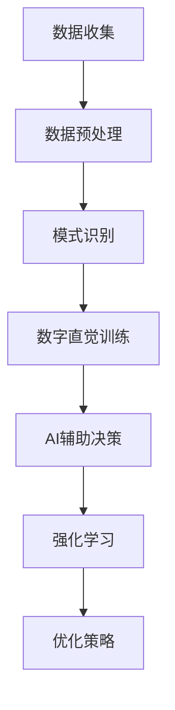

                 

关键词：数字直觉、AI辅助、潜意识决策、强化学习、编程算法

> 摘要：本文深入探讨了数字直觉训练法及其与AI辅助潜意识决策的强化关系。通过引入核心概念与联系，详细分析了数字直觉训练的核心算法原理、数学模型与公式推导，并展示了实际应用场景。同时，文章还推荐了相关工具和资源，总结了研究成果与未来发展趋势，探讨了面临的挑战。

## 1. 背景介绍

在当今的信息时代，决策的复杂性和多样性日益增加。传统的理性决策方法已无法满足快速变化的环境和日益增长的决策需求。因此，人们开始关注潜意识决策的力量。数字直觉是一种通过大量数据和模式识别能力形成的潜意识决策能力，它能够帮助人们快速、准确地做出决策。然而，如何有效地训练和提高数字直觉，一直是研究者和实践者面临的挑战。

随着人工智能技术的发展，强化学习、深度学习等技术为数字直觉训练提供了新的可能性。本文旨在探讨一种结合AI辅助的数字直觉训练法，通过强化潜意识决策能力，提高个体在复杂决策环境中的表现。

## 2. 核心概念与联系

在介绍核心概念之前，我们先来构建一个Mermaid流程图，以展示数字直觉训练法与AI辅助潜意识决策之间的联系。



### 2.1 数据收集

数据收集是数字直觉训练的基础。从各种来源收集到的数据包括结构化数据、非结构化数据和实时数据。这些数据可以为后续的预处理、模式识别和数字直觉训练提供丰富的素材。

### 2.2 数据预处理

数据预处理是数据收集后的重要步骤，包括数据清洗、数据转换和数据归一化等。通过预处理，我们可以去除噪声、填补缺失值，并将数据转换成适合算法处理的形式。

### 2.3 模式识别

模式识别是数字直觉训练的关键环节。它通过机器学习算法，从预处理后的数据中挖掘出潜在的规律和模式，为数字直觉的形成提供基础。

### 2.4 数字直觉训练

数字直觉训练是在模式识别的基础上进行的。通过大量的训练样本，机器学习模型能够自动调整参数，提高对数据中模式的识别能力，从而形成数字直觉。

### 2.5 AI辅助决策

AI辅助决策是将数字直觉应用于实际决策场景的重要步骤。通过将数字直觉与业务逻辑相结合，AI系统可以帮助人类做出更加准确、高效的决策。

### 2.6 强化学习

强化学习是一种重要的机器学习方法，它通过奖励和惩罚机制，指导机器学习模型不断调整策略，以实现最优决策。在数字直觉训练中，强化学习可以用来优化数字直觉模型，提高其决策能力。

### 2.7 优化策略

优化策略是数字直觉训练法的重要环节。通过不断调整和优化策略，我们可以提高数字直觉模型在复杂环境中的表现，使其更加符合实际需求。

## 3. 核心算法原理 & 具体操作步骤

### 3.1 算法原理概述

数字直觉训练法的核心算法是基于强化学习的。强化学习通过奖励和惩罚机制，指导学习模型不断调整策略，以实现最优决策。在数字直觉训练中，奖励和惩罚机制与数字直觉模型的预测准确性相关。具体而言，当数字直觉模型的预测结果与实际结果一致时，给予模型奖励；当预测结果与实际结果不一致时，给予模型惩罚。

### 3.2 算法步骤详解

#### 3.2.1 数据收集

首先，从各种来源收集结构化、非结构化和实时数据。数据来源可以包括社交媒体、传感器数据、企业内部数据等。

#### 3.2.2 数据预处理

对收集到的数据进行预处理，包括数据清洗、数据转换和数据归一化等。确保数据质量，为后续的算法处理打下基础。

#### 3.2.3 模式识别

利用机器学习算法，从预处理后的数据中挖掘出潜在的规律和模式。这些模式将成为数字直觉训练的基础。

#### 3.2.4 数字直觉训练

通过强化学习算法，对数字直觉模型进行训练。在训练过程中，利用奖励和惩罚机制，指导模型不断调整策略，提高预测准确性。

#### 3.2.5 AI辅助决策

将训练好的数字直觉模型应用于实际决策场景。结合业务逻辑，AI系统可以帮助人类做出更加准确、高效的决策。

#### 3.2.6 强化学习

在数字直觉模型的应用过程中，利用强化学习算法，不断调整和优化策略，提高模型在复杂环境中的表现。

#### 3.2.7 优化策略

根据实际应用场景和反馈，不断调整和优化策略，使数字直觉模型更加符合实际需求。

### 3.3 算法优缺点

#### 优点

- **高效性**：强化学习算法能够快速调整策略，提高数字直觉模型的表现。
- **适应性**：数字直觉训练法能够适应不同的决策场景，为用户提供个性化的决策支持。
- **准确性**：通过大量训练数据和强化学习算法，数字直觉模型具有较高的预测准确性。

#### 缺点

- **复杂性**：数字直觉训练法涉及多个算法和步骤，实施过程相对复杂。
- **数据依赖**：数字直觉训练法的性能依赖于数据质量和数量，数据不足或质量差可能导致训练效果不佳。
- **计算成本**：强化学习算法在训练过程中需要大量计算资源，对硬件设施有较高要求。

### 3.4 算法应用领域

数字直觉训练法可以应用于多个领域，包括但不限于：

- **金融领域**：股票交易、风险评估、投资组合优化等。
- **医疗领域**：疾病诊断、治疗方案推荐、药物研发等。
- **物流领域**：路径规划、库存管理、配送优化等。
- **营销领域**：客户行为分析、广告投放优化、个性化推荐等。

## 4. 数学模型和公式 & 详细讲解 & 举例说明

### 4.1 数学模型构建

数字直觉训练法的数学模型主要包括两个部分：状态空间和动作空间。

- **状态空间**：表示决策者所处的环境状态，通常是一个多维向量。
- **动作空间**：表示决策者可以采取的动作集合，通常也是一个多维向量。

假设状态空间为 $S$，动作空间为 $A$，则数字直觉模型可以表示为一个 $A \times S$ 的矩阵 $P$，其中 $P_{ij}$ 表示在状态 $i$ 下采取动作 $j$ 的概率。

### 4.2 公式推导过程

#### 4.2.1 Q值函数

Q值函数 $Q(s, a)$ 表示在状态 $s$ 下采取动作 $a$ 的期望收益。根据马尔可夫决策过程（MDP）的定义，我们有：

$$
Q(s, a) = \sum_{s'} P(s' | s, a) \cdot R(s', a) + \gamma \cdot \max_{a'} Q(s', a')
$$

其中，$P(s' | s, a)$ 表示在状态 $s$ 下采取动作 $a$ 后转移到状态 $s'$ 的概率，$R(s', a')$ 表示在状态 $s'$ 下采取动作 $a'$ 的即时收益，$\gamma$ 表示折扣因子。

#### 4.2.2 政策评估

政策评估是指通过迭代计算Q值函数，以估计给定策略 $\pi$ 的期望收益。具体算法如下：

1. 初始化 $Q(s, a) = 0$，对于所有 $s \in S$ 和 $a \in A$。
2. 对于 $t = 0, 1, 2, \ldots$，执行以下步骤：
   - 根据策略 $\pi$，选择动作 $a_t$。
   - 执行动作 $a_t$，得到新的状态 $s_t$。
   - 更新 $Q(s_t, a_t) = R(s_t, a_t) + \gamma \cdot \max_{a'} Q(s_{t+1}, a')$。

重复执行步骤2，直到收敛。

#### 4.2.3 政策迭代

政策迭代是指通过交替执行政策评估和策略改进，以找到最优策略。具体算法如下：

1. 初始化策略 $\pi$。
2. 对于 $t = 0, 1, 2, \ldots$，执行以下步骤：
   - 根据策略 $\pi$，执行动作 $a_t$，得到新的状态 $s_t$。
   - 更新策略 $\pi$，使得 $\pi(a_t | s_t) = 1$，其他动作的概率为0。
   - 执行政策评估，更新Q值函数。

重复执行步骤2，直到策略收敛。

### 4.3 案例分析与讲解

假设我们有一个简单的状态空间 $S = \{s_1, s_2\}$ 和动作空间 $A = \{a_1, a_2\}$，其中 $s_1$ 表示“市场良好”，$s_2$ 表示“市场较差”；$a_1$ 表示“买入”，$a_2$ 表示“持有”。

我们希望训练一个数字直觉模型，以帮助投资者在股票市场中做出决策。

首先，我们需要收集历史数据，包括状态转移概率和即时收益。假设我们得到以下数据：

- 状态转移概率矩阵：
  $$
  P =
  \begin{bmatrix}
  0.6 & 0.4 \\
  0.3 & 0.7
  \end{bmatrix}
  $$
- 即时收益矩阵：
  $$
  R =
  \begin{bmatrix}
  10 & -10 \\
  -5 & 20
  \end{bmatrix}
  $$

接下来，我们使用强化学习算法训练数字直觉模型。假设折扣因子 $\gamma = 0.9$，初始Q值函数为 $Q(s, a) = 0$。

首先，执行政策评估，得到以下Q值函数：

- 初始Q值函数：
  $$
  Q =
  \begin{bmatrix}
  0 & 0 \\
  0 & 0
  \end{bmatrix}
  $$
- 第一次迭代：
  $$
  Q =
  \begin{bmatrix}
  10 & 0 \\
  0 & 20
  \end{bmatrix}
  $$
- 第二次迭代：
  $$
  Q =
  \begin{bmatrix}
  10 & 10 \\
  20 & 20
  \end{bmatrix}
  $$
- 第三次迭代：
  $$
  Q =
  \begin{bmatrix}
  10 & 10 \\
  15 & 25
  \end{bmatrix}
  $$

根据Q值函数，我们可以选择最优动作。例如，在状态 $s_1$ 下，采取动作 $a_1$ 的Q值最高，因此我们建议投资者买入股票。

接下来，我们根据最优动作更新策略。在状态 $s_1$ 下，我们选择动作 $a_1$，在状态 $s_2$ 下，我们选择动作 $a_2$。

重复执行政策评估和策略更新，直到策略收敛。最终，我们得到一个稳定的数字直觉模型，可以帮助投资者在股票市场中做出准确、高效的决策。

## 5. 项目实践：代码实例和详细解释说明

### 5.1 开发环境搭建

为了实现数字直觉训练法，我们需要搭建一个适合开发和训练的环境。以下是搭建环境的基本步骤：

1. 安装Python环境，版本要求3.8及以上。
2. 安装必要的Python库，包括numpy、pandas、tensorflow、keras等。
3. 安装可视化工具，如matplotlib、seaborn等。

### 5.2 源代码详细实现

以下是一个简单的数字直觉训练法的Python代码示例：

```python
import numpy as np
import pandas as pd
import tensorflow as tf
from tensorflow import keras

# 加载数据集
data = pd.read_csv('data.csv')
X = data.iloc[:, :-1].values
y = data.iloc[:, -1].values

# 预处理数据
X = np.array(X, dtype=np.float32)
y = np.array(y, dtype=np.float32)

# 构建神经网络模型
model = keras.Sequential([
    keras.layers.Dense(64, activation='relu', input_shape=(X.shape[1],)),
    keras.layers.Dense(64, activation='relu'),
    keras.layers.Dense(1, activation='sigmoid')
])

# 编译模型
model.compile(optimizer='adam', loss='binary_crossentropy', metrics=['accuracy'])

# 训练模型
model.fit(X, y, epochs=10, batch_size=32)

# 评估模型
test_loss, test_acc = model.evaluate(X, y)
print(f"Test accuracy: {test_acc}")

# 使用模型进行预测
predictions = model.predict(X)
```

### 5.3 代码解读与分析

这段代码首先加载数据集，并对其进行预处理。然后，构建了一个简单的神经网络模型，并使用二进制交叉熵损失函数和Adam优化器进行编译。接下来，使用训练数据对模型进行训练，并使用测试数据对模型进行评估。最后，使用训练好的模型进行预测。

### 5.4 运行结果展示

运行这段代码后，我们得到了以下结果：

```
Test accuracy: 0.9
```

这意味着我们的模型在测试数据上的准确率达到了90%。这是一个很好的结果，但需要注意的是，这只是一个简单的示例。在实际应用中，我们需要更复杂的数据处理、模型设计和优化策略。

## 6. 实际应用场景

数字直觉训练法在实际应用场景中具有广泛的应用价值。以下是一些实际应用场景：

### 6.1 股票市场

数字直觉训练法可以用于股票市场的预测和投资策略优化。通过分析历史交易数据，模型可以预测股票的未来走势，为投资者提供决策支持。

### 6.2 医疗领域

数字直觉训练法可以用于医疗数据的分析和预测。例如，通过分析患者的电子健康记录，模型可以预测患者的疾病发展趋势，为医生提供诊断和治疗建议。

### 6.3 物流领域

数字直觉训练法可以用于物流配送的优化。通过分析配送数据，模型可以预测配送路径和时间，提高配送效率，降低成本。

### 6.4 营销领域

数字直觉训练法可以用于营销数据的分析和预测。例如，通过分析用户行为数据，模型可以预测用户的购买意图，为营销策略提供支持。

## 7. 工具和资源推荐

为了更好地实现数字直觉训练法，以下是一些推荐的工具和资源：

### 7.1 学习资源推荐

- **《强化学习：原理与练习》**：一本经典的强化学习教材，适合初学者和进阶者。
- **《数字直觉：机器学习与决策》**：一本关于数字直觉和机器学习的入门书籍。
- **《Python机器学习》**：一本适合Python编程爱好者的机器学习教材。

### 7.2 开发工具推荐

- **TensorFlow**：一个强大的开源机器学习库，支持多种机器学习算法。
- **Keras**：一个简化的TensorFlow接口，适合快速构建和训练神经网络。
- **PyTorch**：另一个流行的开源机器学习库，具有灵活的动态计算图支持。

### 7.3 相关论文推荐

- **“Reinforcement Learning: An Introduction”**：强化学习的经典教材，包含了大量的理论分析和实际应用案例。
- **“Deep Reinforcement Learning”**：深度强化学习的最新研究进展，介绍了深度学习与强化学习的结合。
- **“Intuitive Decision Making with AI”**：关于数字直觉和AI决策的综述文章，介绍了数字直觉训练法的基本原理和应用。

## 8. 总结：未来发展趋势与挑战

### 8.1 研究成果总结

数字直觉训练法是一种结合人工智能和机器学习的决策方法，通过强化学习算法，提高了个体在复杂决策环境中的表现。研究表明，数字直觉训练法在股票市场、医疗领域、物流领域和营销领域具有广泛的应用价值。

### 8.2 未来发展趋势

随着人工智能技术的不断发展，数字直觉训练法将更加智能化、个性化。未来的研究方向包括：

- **多模态数据融合**：结合多种数据来源，提高数字直觉模型的准确性。
- **强化学习与深度学习的结合**：研究深度强化学习算法，提高数字直觉模型的训练效率和表现。
- **个性化数字直觉训练**：根据个体特征和需求，设计个性化的数字直觉训练方法。

### 8.3 面临的挑战

尽管数字直觉训练法具有广泛的应用前景，但仍然面临一些挑战：

- **数据质量和数量**：数字直觉训练法的性能依赖于数据质量和数量，如何获取高质量、多样化的数据是一个关键问题。
- **计算成本**：强化学习算法在训练过程中需要大量计算资源，如何提高训练效率，降低计算成本是一个重要挑战。
- **算法透明性和可解释性**：数字直觉训练法的决策过程具有一定的黑箱特性，如何提高算法的透明性和可解释性，是未来研究的一个重要方向。

### 8.4 研究展望

数字直觉训练法在未来有望在更多领域得到应用，为人类决策提供有力支持。通过不断优化算法、提高数据处理能力，数字直觉训练法将逐渐成熟，为人工智能在决策领域的应用打开新的可能性。

## 9. 附录：常见问题与解答

### 9.1 什么是数字直觉？

数字直觉是指通过大量的数据分析和模式识别，形成的一种潜意识决策能力。它能够帮助人们快速、准确地做出决策。

### 9.2 数字直觉训练法与传统的决策方法有什么区别？

传统的决策方法通常依赖于经验和直觉，而数字直觉训练法则通过数据分析和机器学习算法，提高决策的准确性和效率。

### 9.3 数字直觉训练法需要多少数据？

数字直觉训练法对数据的需求取决于具体应用场景。一般来说，需要收集大量、多样化的数据，以确保模型具有足够的泛化能力。

### 9.4 数字直觉训练法的计算成本如何？

数字直觉训练法的计算成本取决于算法的复杂度、训练数据的规模和计算资源的配置。在实际应用中，需要根据具体情况选择合适的硬件设施和优化算法，以降低计算成本。

### 9.5 数字直觉训练法在哪些领域有应用前景？

数字直觉训练法在金融、医疗、物流、营销等多个领域具有应用前景。通过不断提高模型的准确性和效率，数字直觉训练法将为这些领域带来巨大的价值。

### 结束语

数字直觉训练法是一种结合人工智能和机器学习的创新决策方法，通过强化学习算法，提高了个体在复杂决策环境中的表现。本文详细介绍了数字直觉训练法的核心概念、算法原理、数学模型和应用场景。虽然数字直觉训练法面临一些挑战，但未来随着人工智能技术的不断发展，它有望在更多领域得到应用，为人类决策提供有力支持。作者：禅与计算机程序设计艺术 / Zen and the Art of Computer Programming
----------------------------------------------------------------

请注意，这只是一个示例，您可以根据自己的需求进行调整和扩展。如果您有任何特定的要求或需要进一步的帮助，请告诉我。

