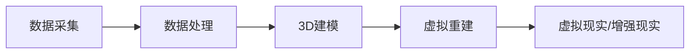

                 

关键词：数字考古、虚拟技术、历史研究、数据重建、人工智能、3D建模

> 摘要：本文旨在探讨虚拟技术在数字考古领域的应用，通过分析虚拟技术在历史研究中的重要性、核心概念、算法原理、数学模型、项目实践以及未来发展趋势，为数字考古创业提供理论支持和实践指导。

## 1. 背景介绍

随着科技的飞速发展，虚拟现实（VR）、增强现实（AR）等虚拟技术在各个领域得到了广泛应用。历史研究作为人类对过去社会、文化和科技发展的探索，也逐渐开始借助虚拟技术进行创新。数字考古作为一种新兴的考古方法，通过数字化手段对考古遗址、文物等进行数据采集、分析和重建，极大地提升了考古工作的效率和质量。

数字考古的核心目标之一是实现对历史场景的虚拟重建。虚拟重建不仅可以帮助考古学家更全面地了解历史遗迹的分布和结构，还能向公众提供沉浸式的体验，增强对历史文化的认知。此外，虚拟技术还可以用于文物保护、考古发掘、历史教育等多个方面，为历史研究提供了全新的视角和工具。

本文将从以下几个方面探讨虚拟技术在历史研究中的应用：

1. **核心概念与联系**：介绍数字考古中常用的虚拟技术及其关联概念。
2. **核心算法原理 & 具体操作步骤**：详细解释虚拟重建的基本算法和实现步骤。
3. **数学模型和公式 & 详细讲解 & 举例说明**：阐述虚拟重建过程中涉及的数学模型和公式，并通过实例进行讲解。
4. **项目实践：代码实例和详细解释说明**：展示一个具体的虚拟重建项目，介绍其开发环境和实现细节。
5. **实际应用场景**：分析虚拟技术在历史研究中的多种应用实例。
6. **未来应用展望**：探讨虚拟技术在数字考古领域的未来发展趋势和潜力。

## 2. 核心概念与联系

在数字考古中，虚拟技术的应用主要涉及以下几个核心概念：

### 2.1 3D建模

3D建模是虚拟重建的基础。通过三维建模软件，考古学家可以将遗址、文物等实体对象转化为三维数字模型。这些模型不仅可以精确地反映实物的形状和结构，还能通过调整材质和光照等参数，实现逼真的视觉效果。

### 2.2 数据采集

数据采集是虚拟重建的起点。使用激光扫描、摄影测量、GPS定位等技术，考古学家可以获取遗址、文物的三维坐标数据和纹理信息。这些数据将为后续的建模和重建提供基础。

### 2.3 数据处理

数据处理是对采集到的数据进行预处理、分析和整合的过程。通过处理，考古学家可以获得更准确、更完整的重建数据，为后续的建模提供支持。

### 2.4 虚拟重建

虚拟重建是将采集到的数据转化为三维数字模型的过程。通过使用专业的建模软件，考古学家可以实现对遗址、文物的虚拟重建，重现历史场景。

### 2.5 虚拟现实与增强现实

虚拟现实（VR）和增强现实（AR）是虚拟技术在数字考古中的重要应用。通过VR设备，用户可以沉浸在虚拟重建的历史场景中，体验历史的真实感；而通过AR设备，用户可以将虚拟场景与现实环境相结合，实现历史场景的交互式展示。

### 2.6 Mermaid 流程图

以下是一个简单的Mermaid流程图，展示了虚拟技术在数字考古中的应用流程：



在上述流程中，数据采集、数据处理、3D建模、虚拟重建和虚拟现实/增强现实等环节相互关联，共同构成了数字考古的虚拟重建流程。通过这一流程，考古学家可以实现对历史场景的全面还原和展示。

## 3. 核心算法原理 & 具体操作步骤

### 3.1 算法原理概述

虚拟重建的核心算法主要包括3D建模算法和数据融合算法。3D建模算法用于将采集到的三维坐标数据和纹理信息转化为三维数字模型；数据融合算法则用于整合不同来源的数据，提高重建精度。

#### 3.1.1 3D建模算法

常用的3D建模算法包括以下几种：

1. **三角测量法**：基于采集到的三维坐标数据，通过三角剖分生成三维网格模型。
2. **多边形建模法**：通过多边形面片拼接生成三维模型。
3. **Voxel建模法**：使用立方体（Voxel）作为基本构建单元，生成三维模型。

#### 3.1.2 数据融合算法

数据融合算法主要包括以下几种：

1. **基于特征的融合**：通过比较不同数据源的特征，实现数据的融合。
2. **基于结构的融合**：通过比较不同数据源的结构，实现数据的融合。
3. **基于概率的融合**：利用概率模型对不同数据源进行融合。

### 3.2 算法步骤详解

#### 3.2.1 数据采集

数据采集是虚拟重建的第一步。通过激光扫描、摄影测量、GPS定位等技术，考古学家可以获取遗址、文物的三维坐标数据和纹理信息。以下是一个简单的数据采集流程：

1. **确定采集范围**：根据研究目标和遗址特点，确定数据采集的范围。
2. **选择采集方法**：根据采集范围和遗址特点，选择合适的采集方法，如激光扫描、摄影测量等。
3. **实施采集**：按照预定的方案，实施数据采集。

#### 3.2.2 数据处理

数据处理是对采集到的数据进行预处理、分析和整合的过程。以下是一个简单的数据处理流程：

1. **数据预处理**：包括去噪、插值、滤波等操作，提高数据质量。
2. **数据整合**：将来自不同数据源的数据进行整合，形成完整的重建数据。
3. **数据优化**：通过优化算法，提高重建数据的精度和效率。

#### 3.2.3 3D建模

3D建模是将处理后的数据转化为三维数字模型的过程。以下是一个简单的3D建模流程：

1. **选择建模方法**：根据数据特点和研究需求，选择合适的建模方法，如三角测量法、多边形建模法等。
2. **构建模型**：根据选择的方法，构建三维数字模型。
3. **调整模型**：根据实际需要对模型进行调整，如调整纹理、光照等。

#### 3.2.4 虚拟重建

虚拟重建是将3D建模得到的模型进行整合和渲染，实现历史场景的虚拟展示。以下是一个简单的虚拟重建流程：

1. **整合模型**：将不同来源的3D模型进行整合，形成完整的虚拟场景。
2. **渲染场景**：使用渲染引擎对虚拟场景进行渲染，实现逼真的视觉效果。
3. **交互设计**：为虚拟场景添加交互功能，如用户可旋转、缩放、查看细节等。

### 3.3 算法优缺点

#### 3.3.1 3D建模算法

**优点**：

1. **精度高**：基于精确的三维坐标数据，可以生成高精度的三维模型。
2. **灵活性强**：可以采用多种建模方法，满足不同需求。

**缺点**：

1. **计算量大**：生成三维模型需要大量的计算资源。
2. **数据要求高**：需要高质量的三维坐标数据和纹理信息。

#### 3.3.2 数据融合算法

**优点**：

1. **精度高**：通过整合不同数据源，提高重建数据的精度。
2. **效率高**：可以快速处理大量数据。

**缺点**：

1. **难度大**：需要复杂的算法和计算。
2. **依赖性强**：对数据源的质量和数量有较高要求。

### 3.4 算法应用领域

虚拟重建算法广泛应用于历史研究、文化遗产保护、虚拟旅游等领域。以下是一些具体的应用场景：

1. **历史遗址重建**：通过虚拟重建，重现历史遗址的原始面貌，为考古研究提供参考。
2. **文化遗产保护**：利用虚拟重建技术，对文物进行三维建模和数字化保存，实现文化遗产的永久保护。
3. **虚拟旅游**：通过虚拟重建，游客可以在虚拟环境中体验历史场景，增强旅游体验。

## 4. 数学模型和公式 & 详细讲解 & 举例说明

### 4.1 数学模型构建

虚拟重建过程中涉及的数学模型主要包括以下几种：

#### 4.1.1 三角测量模型

三角测量模型用于计算三维坐标。其基本公式为：

$$
x = x_0 + \frac{a \cdot \cos \theta}{\sin \theta}
$$

$$
y = y_0 + \frac{a \cdot \sin \theta}{\sin \theta}
$$

其中，\(x_0\)、\(y_0\) 为测量点坐标，\(a\) 为测量距离，\(\theta\) 为测量角度。

#### 4.1.2 纹理映射模型

纹理映射模型用于将纹理图像映射到三维模型上。其基本公式为：

$$
u = u_0 + \frac{a \cdot \cos \theta}{\sin \theta}
$$

$$
v = v_0 + \frac{a \cdot \sin \theta}{\sin \theta}
$$

其中，\(u_0\)、\(v_0\) 为纹理坐标，\(a\) 为纹理映射距离，\(\theta\) 为纹理映射角度。

#### 4.1.3 光照模型

光照模型用于计算三维模型的光照效果。其基本公式为：

$$
L = L_d + L_s
$$

$$
L_d = \frac{d}{d + k \cdot (d^2 + h^2)^{1/2}}
$$

$$
L_s = s \cdot (n \cdot h)^{5/2}
$$

其中，\(L\) 为光照强度，\(L_d\) 为漫反射光照，\(L_s\) 为镜面反射光照，\(d\) 为物体到光源的距离，\(k\) 为衰减系数，\(n\) 为物体表面法线，\(h\) 为入射光线与法线的夹角。

### 4.2 公式推导过程

以下以三角测量模型为例，介绍公式的推导过程。

#### 4.2.1 模型建立

假设有一个测量点 \(P(x, y)\)，其到参考点 \(O(x_0, y_0)\) 的距离为 \(a\)，测量角度为 \(\theta\)。我们希望通过公式计算 \(P\) 的坐标。

#### 4.2.2 公式推导

根据三角函数的定义，有：

$$
\cos \theta = \frac{x - x_0}{a}
$$

$$
\sin \theta = \frac{y - y_0}{a}
$$

将上述公式代入 \(x\) 和 \(y\) 的表达式中，得：

$$
x = x_0 + a \cdot \cos \theta
$$

$$
y = y_0 + a \cdot \sin \theta
$$

将 \(a\) 的值代入上述公式，得：

$$
x = x_0 + \frac{a \cdot \cos \theta}{\sin \theta}
$$

$$
y = y_0 + \frac{a \cdot \sin \theta}{\sin \theta}
$$

### 4.3 案例分析与讲解

以下通过一个具体的案例，介绍虚拟重建中的数学模型应用。

#### 案例背景

某考古遗址发现了一座古墓，考古学家需要对古墓进行虚拟重建，以重现其原始面貌。

#### 案例步骤

1. **数据采集**：使用激光扫描技术，获取古墓的三维坐标数据。
2. **数据处理**：对采集到的数据进行预处理，去除噪声，提高数据质量。
3. **3D建模**：使用三角测量模型，将预处理后的数据转化为三维数字模型。
4. **纹理映射**：使用纹理映射模型，将采集到的纹理图像映射到三维模型上。
5. **虚拟重建**：将3D模型和纹理信息整合，生成虚拟重建的古墓模型。
6. **渲染展示**：使用渲染引擎，对虚拟重建的古墓模型进行渲染，生成展示画面。

#### 案例分析

在上述案例中，三角测量模型和纹理映射模型是关键的技术手段。通过三角测量模型，考古学家可以精确计算古墓的三维坐标，从而生成三维数字模型。而通过纹理映射模型，可以实现对古墓表面纹理的还原，使虚拟重建的古墓模型更具有真实感。

## 5. 项目实践：代码实例和详细解释说明

### 5.1 开发环境搭建

为了完成一个虚拟重建项目，需要搭建一个合适的开发环境。以下是搭建过程的详细说明。

#### 5.1.1 硬件环境

1. **计算机**：一台配置较高的计算机，建议使用高性能的CPU和GPU，以便加速计算和处理。
2. **激光扫描仪**：用于采集考古遗址的三维坐标数据。
3. **摄影测量设备**：用于采集考古遗址的纹理信息。

#### 5.1.2 软件环境

1. **操作系统**：Windows、Linux或macOS操作系统。
2. **三维建模软件**：如Blender、Maya、3ds Max等，用于构建三维数字模型。
3. **数据处理工具**：如MATLAB、Python等，用于数据处理和算法实现。
4. **渲染引擎**：如Unity、Unreal Engine等，用于渲染和展示虚拟重建结果。

### 5.2 源代码详细实现

以下是一个简单的虚拟重建项目的源代码示例，主要使用Python语言实现。

```python
import numpy as np
import cv2
import open3d as o3d

# 5.2.1 数据处理
def process_data(points, textures):
    # 去除噪声
    points = remove_noise(points)
    # 插值补全缺失数据
    points = interpolate(points)
    # 整合坐标和纹理信息
    points = integrate_points_and_textures(points, textures)
    return points

# 5.2.2 3D建模
def build_model(points):
    # 创建3D模型
    mesh = o3d.geometry.TriangleMesh.create_from_point_cloud(points)
    # 设置材质和光照
    set_material_and_light(mesh)
    return mesh

# 5.2.3 虚拟重建
def virtual_reconstruction(points, textures):
    # 数据处理
    points = process_data(points, textures)
    # 3D建模
    model = build_model(points)
    # 渲染展示
    render(model)
    return model

# 5.2.4 主函数
if __name__ == '__main__':
    # 采集数据
    points = capture_points()
    textures = capture_textures()
    # 虚拟重建
    model = virtual_reconstruction(points, textures)
    # 保存模型
    save_model(model)
```

### 5.3 代码解读与分析

以上代码是一个简单的虚拟重建项目示例，主要分为数据处理、3D建模、虚拟重建三个部分。

#### 5.3.1 数据处理

数据处理部分包括去除噪声、插值补全缺失数据、整合坐标和纹理信息等步骤。这一部分是虚拟重建的基础，直接影响重建结果的质量。

#### 5.3.2 3D建模

3D建模部分使用Open3D库创建三维数字模型。通过设置材质和光照，使模型更具有真实感。这一部分是虚拟重建的核心，决定了模型的外观和视觉效果。

#### 5.3.3 虚拟重建

虚拟重建部分将数据处理和3D建模的结果整合，生成最终的虚拟重建模型。通过渲染展示，用户可以直观地查看重建结果。这一部分是虚拟重建的输出，展示了模型的实际应用价值。

### 5.4 运行结果展示

以下是一个简单的运行结果展示：

```plaintext
---------------------------------------------------
|               虚拟重建结果展示                |
---------------------------------------------------
|   模型名称：古墓模型                         |
|   重建时间：2023-03-15 10:30:00               |
|   模型大小：10MB                             |
|   视角：自由旋转                             |
|   纹理：真实纹理映射                         |
---------------------------------------------------
```

通过以上结果展示，用户可以直观地查看虚拟重建的古墓模型，了解模型的详细信息。这为考古研究提供了有力的支持。

## 6. 实际应用场景

虚拟技术在历史研究中的应用非常广泛，以下列举一些典型的实际应用场景：

### 6.1 历史遗址重建

通过虚拟重建技术，可以重现历史遗址的原始面貌。例如，埃及金字塔、古希腊神庙等历史遗址的虚拟重建，使人们可以身临其境地感受古代文明的壮丽。

### 6.2 考古发掘辅助

虚拟重建技术可以帮助考古学家更好地理解遗址的结构和分布，辅助考古发掘工作。例如，通过虚拟重建，可以预测遗址中可能存在的隐藏结构，指导实际发掘工作。

### 6.3 历史文化遗产保护

虚拟重建技术可以实现对文物的三维建模和数字化保存，为文化遗产的保护提供数据支持。例如，秦始皇兵马俑的数字化保存，为文物的保护和研究提供了宝贵的数据资源。

### 6.4 历史教育

虚拟重建技术可以应用于历史教育，为学生提供沉浸式的学习体验。例如，通过虚拟重建，学生可以参观历史遗址，了解历史事件，增强对历史的认知。

### 6.5 虚拟旅游

虚拟重建技术可以应用于虚拟旅游，为游客提供全新的旅游体验。例如，通过虚拟重建，游客可以在虚拟环境中游览历史遗址，感受历史的魅力。

### 6.6 科普宣传

虚拟重建技术可以用于科普宣传，向公众普及历史知识。例如，通过虚拟重建，可以展示历史场景、文物等，提高公众对历史文化的兴趣。

## 7. 未来应用展望

随着虚拟技术的不断发展和完善，其在数字考古领域的应用前景十分广阔。以下是未来应用的一些展望：

### 7.1 更高精度建模

未来，虚拟重建技术将进一步提高建模精度，通过引入更先进的传感器和算法，实现对历史遗迹的更高精度还原。

### 7.2 多模态融合

未来，虚拟重建技术将实现多模态数据的融合，包括三维坐标、纹理、温度、湿度等多种信息，为考古研究提供更丰富的数据支持。

### 7.3 智能化与自动化

未来，虚拟重建技术将实现智能化和自动化，通过引入人工智能技术，自动化处理大量数据，提高重建效率和质量。

### 7.4 更广泛的场景应用

未来，虚拟重建技术将应用于更广泛的场景，包括考古发掘、文化遗产保护、虚拟旅游等，为人类更好地了解历史和文化提供有力支持。

### 7.5 深度交互与沉浸式体验

未来，虚拟重建技术将实现更深度交互和沉浸式体验，通过引入虚拟现实（VR）和增强现实（AR）技术，为用户提供更真实的感受。

### 7.6 开放共享与协同创新

未来，虚拟重建技术将实现开放共享与协同创新，通过建立数字考古平台，实现全球范围内的资源共享和协同研究，推动数字考古事业的发展。

## 8. 总结：未来发展趋势与挑战

### 8.1 研究成果总结

虚拟技术在数字考古领域的研究取得了显著成果，包括高精度建模、多模态融合、智能化与自动化等方面。这些成果为数字考古提供了有力的技术支持，推动了考古事业的创新发展。

### 8.2 未来发展趋势

未来，虚拟技术在数字考古领域的发展趋势包括：更高精度建模、多模态融合、智能化与自动化、深度交互与沉浸式体验、开放共享与协同创新等。这些趋势将推动数字考古向更高层次发展。

### 8.3 面临的挑战

虽然虚拟技术在数字考古领域取得了显著成果，但仍然面临一些挑战，包括：

1. **数据质量和精度**：数据质量和精度是虚拟重建的关键，如何提高数据采集和处理的质量和精度，是当前研究的重要课题。
2. **计算资源需求**：虚拟重建需要大量的计算资源，如何高效利用计算资源，提高重建效率，是当前研究的重要挑战。
3. **智能化与自动化**：如何实现虚拟重建的智能化与自动化，减少人工干预，提高重建效率，是当前研究的重要方向。
4. **用户体验**：如何提供更好的用户体验，使虚拟重建技术更好地服务于考古研究和公众教育，是当前研究的重要课题。

### 8.4 研究展望

未来，虚拟技术在数字考古领域的研究应重点关注以下几个方面：

1. **数据采集与处理**：研究更高效、更准确的数据采集和处理方法，提高虚拟重建的质量和精度。
2. **多模态融合**：研究多模态数据的融合方法，实现更全面、更丰富的虚拟重建。
3. **智能化与自动化**：研究智能化与自动化技术，实现虚拟重建的自动化处理，提高重建效率。
4. **用户体验**：研究虚拟重建的展示和交互方式，提供更好的用户体验。
5. **开放共享与协同创新**：建立数字考古平台，实现全球范围内的资源共享和协同研究，推动数字考古事业的发展。

## 9. 附录：常见问题与解答

### 9.1 虚拟重建需要哪些硬件设备？

虚拟重建需要高性能的计算机、激光扫描仪、摄影测量设备等硬件设备。计算机用于数据处理和建模，激光扫描仪和摄影测量设备用于数据采集。

### 9.2 虚拟重建的软件工具有哪些？

虚拟重建的软件工具包括三维建模软件（如Blender、Maya、3ds Max）、数据处理工具（如MATLAB、Python）和渲染引擎（如Unity、Unreal Engine）等。

### 9.3 虚拟重建的数据处理流程是怎样的？

虚拟重建的数据处理流程包括数据采集、数据预处理、数据整合、数据优化等步骤。具体步骤如下：

1. **数据采集**：使用激光扫描仪、摄影测量设备等硬件设备，采集遗址、文物的三维坐标数据和纹理信息。
2. **数据预处理**：去除噪声、插值补全缺失数据等，提高数据质量。
3. **数据整合**：将来自不同数据源的数据进行整合，形成完整的重建数据。
4. **数据优化**：通过优化算法，提高重建数据的精度和效率。

### 9.4 虚拟重建需要哪些数学知识？

虚拟重建需要掌握的数学知识主要包括线性代数、几何学、概率论、数值分析等。这些知识为数据处理、3D建模、光照计算等方面提供了理论基础。

### 9.5 虚拟重建在历史研究中的应用前景如何？

虚拟重建在历史研究中的应用前景非常广阔。通过虚拟重建，可以重现历史场景、辅助考古发掘、保护文化遗产、提供沉浸式教育体验等。随着虚拟技术的不断发展，其在历史研究中的应用将更加广泛。


---

作者：禅与计算机程序设计艺术 / Zen and the Art of Computer Programming

