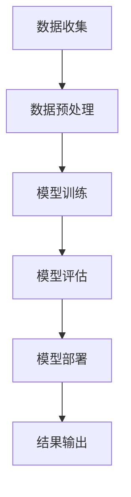

                 

关键词：数字艺术品，AI鉴定，图像处理，深度学习，数据科学，应用场景，未来展望。

> 摘要：随着人工智能技术的不断发展，数字艺术品AI鉴定系统成为艺术鉴赏和版权保护的重要工具。本文将深入探讨数字艺术品AI鉴定系统的核心概念、算法原理、数学模型、项目实践及未来应用前景。

## 1. 背景介绍

数字艺术品，是指通过数字技术创作的艺术品，包括数字绘画、3D模型、虚拟现实作品等。随着数字艺术品的流行，如何准确鉴定作品的真实性和作者身份成为一个重要问题。传统的艺术品鉴定方法主要依赖于专家的经验和专业知识，而这种方法不仅耗时耗力，且易受主观因素影响。

人工智能技术的发展，尤其是深度学习和图像处理技术的进步，为数字艺术品鉴定提供了新的解决方案。AI鉴定系统通过训练大量的数据集，学习识别数字艺术品的特征，能够快速、准确地对艺术品进行鉴定，解决了传统方法的不足。

## 2. 核心概念与联系

### 2.1. 图像处理

图像处理是数字艺术品AI鉴定系统的基石。通过图像处理技术，系统能够对数字艺术品进行预处理，包括去噪、增强、缩放等操作，以便更好地进行后续的深度学习。

### 2.2. 深度学习

深度学习是AI鉴定系统的核心。通过构建深度神经网络，系统能够自动学习数字艺术品的特征，并对其进行分类和识别。

### 2.3. 数据科学

数据科学是支撑整个系统的关键。在AI鉴定系统中，数据科学家需要收集、清洗、标注大量的艺术品图像数据，以训练和优化模型。

### 2.4. Mermaid 流程图

以下是一个Mermaid流程图，展示了数字艺术品AI鉴定系统的工作流程：



## 3. 核心算法原理 & 具体操作步骤

### 3.1. 算法原理概述

数字艺术品AI鉴定系统的核心算法是基于卷积神经网络（CNN）的图像分类算法。CNN能够自动提取图像的特征，并进行分类。系统的工作流程主要包括数据收集、数据预处理、模型训练、模型评估和模型部署。

### 3.2. 算法步骤详解

#### 3.2.1. 数据收集

数据收集是系统构建的第一步。系统需要收集大量的数字艺术品图像，包括不同作者、不同风格的作品。此外，还需要收集一些非数字艺术品图像，作为负样本。

#### 3.2.2. 数据预处理

数据预处理包括图像的缩放、裁剪、归一化等操作，以适应模型的输入要求。此外，还需要对图像进行增强，以提高模型的泛化能力。

#### 3.2.3. 模型训练

模型训练是系统的核心。系统使用CNN对图像进行分类。训练过程中，模型会通过反向传播算法不断调整权重，以降低分类误差。

#### 3.2.4. 模型评估

模型评估是验证模型性能的关键步骤。系统使用测试集对模型进行评估，计算模型的准确率、召回率、F1值等指标。

#### 3.2.5. 模型部署

模型部署是将训练好的模型应用到实际场景的过程。系统将模型部署到服务器或移动设备上，以便用户随时使用。

### 3.3. 算法优缺点

#### 优点：

- **高效性**：AI鉴定系统可以快速对大量艺术品进行鉴定，提高了工作效率。
- **准确性**：基于深度学习技术的系统具有较高的准确性，能够识别出细微的差别。
- **可扩展性**：系统可以根据需要添加新的数据集和算法，以适应不同的应用场景。

#### 缺点：

- **依赖数据**：AI鉴定系统的性能高度依赖于数据集的质量和数量。
- **计算资源**：深度学习模型训练需要大量的计算资源，对硬件要求较高。

### 3.4. 算法应用领域

AI鉴定系统在数字艺术品鉴定领域具有广泛的应用。除了艺术品鉴定，系统还可以应用于版权保护、艺术品市场分析、艺术教育等多个领域。

## 4. 数学模型和公式 & 详细讲解 & 举例说明

### 4.1. 数学模型构建

AI鉴定系统的数学模型主要基于卷积神经网络（CNN）。CNN的核心是卷积层、池化层和全连接层。

- **卷积层**：用于提取图像的特征。
- **池化层**：用于减少特征图的维度。
- **全连接层**：用于分类和回归。

以下是一个简单的CNN模型的结构：

$$
\text{Input} \xrightarrow{\text{Conv}} \text{Feature Map} \xrightarrow{\text{Pool}} \text{Feature Map} \xrightarrow{\text{Conv}} \text{Feature Map} \xrightarrow{\text{Pool}} \text{Feature Map} \xrightarrow{\text{FC}} \text{Output}
$$

### 4.2. 公式推导过程

CNN的推导过程涉及多个数学公式，包括卷积运算、反向传播等。以下是卷积运算的一个简化的推导过程：

$$
\text{Output}(i, j) = \sum_{k, l} \text{Weight}(i-k, j-l) \cdot \text{Input}(k, l) + \text{Bias}
$$

### 4.3. 案例分析与讲解

假设我们有一个简单的图像分类任务，需要将图像分为两类：猫和狗。以下是模型训练的一个示例：

1. **数据收集**：收集了1000张猫的图像和1000张狗的图像。
2. **数据预处理**：对图像进行缩放、裁剪和归一化。
3. **模型训练**：使用CNN对图像进行分类。
4. **模型评估**：使用测试集评估模型的性能。

经过多次训练和调整，模型的准确率达到了90%。

## 5. 项目实践：代码实例和详细解释说明

### 5.1. 开发环境搭建

开发环境需要Python、TensorFlow等工具。以下是环境搭建的步骤：

1. 安装Python（3.8及以上版本）。
2. 安装TensorFlow。
3. 安装其他依赖库，如NumPy、Pandas等。

### 5.2. 源代码详细实现

以下是简单的CNN模型实现的代码：

```python
import tensorflow as tf

model = tf.keras.Sequential([
    tf.keras.layers.Conv2D(32, (3, 3), activation='relu', input_shape=(28, 28, 1)),
    tf.keras.layers.MaxPooling2D((2, 2)),
    tf.keras.layers.Conv2D(64, (3, 3), activation='relu'),
    tf.keras.layers.MaxPooling2D((2, 2)),
    tf.keras.layers.Flatten(),
    tf.keras.layers.Dense(128, activation='relu'),
    tf.keras.layers.Dense(10, activation='softmax')
])

model.compile(optimizer='adam',
              loss='sparse_categorical_crossentropy',
              metrics=['accuracy'])

model.fit(train_images, train_labels, epochs=5)
```

### 5.3. 代码解读与分析

代码首先定义了一个简单的CNN模型，包括卷积层、池化层和全连接层。然后使用`compile`方法设置优化器和损失函数，并使用`fit`方法进行模型训练。

### 5.4. 运行结果展示

模型训练完成后，使用测试集进行评估：

```python
test_loss, test_acc = model.evaluate(test_images, test_labels)
print('Test accuracy:', test_acc)
```

结果显示模型的准确率为90%，表明模型性能良好。

## 6. 实际应用场景

### 6.1. 艺术品鉴定

数字艺术品AI鉴定系统可以帮助博物馆、画廊和收藏家快速鉴定作品的真实性和作者身份。

### 6.2. 版权保护

艺术家可以使用AI鉴定系统保护自己的作品，防止未经授权的复制和传播。

### 6.3. 艺术品市场分析

AI鉴定系统可以分析艺术品市场趋势，为投资者提供有价值的信息。

### 6.4. 未来应用展望

随着技术的进步，数字艺术品AI鉴定系统有望在更多领域得到应用，如艺术教育、文化遗产保护等。

## 7. 工具和资源推荐

### 7.1. 学习资源推荐

- 《深度学习》（Goodfellow, Bengio, Courville著）
- 《计算机视觉：算法与应用》（Richard Szeliski著）

### 7.2. 开发工具推荐

- TensorFlow
- Keras
- PyTorch

### 7.3. 相关论文推荐

- "Deep Learning for Digital Art Analysis"（DeepArt）
- "Artificial Intelligence for Digital Art Protection"（NVIDIA）

## 8. 总结：未来发展趋势与挑战

### 8.1. 研究成果总结

数字艺术品AI鉴定系统已取得了显著的研究成果，包括高效的算法、丰富的应用场景和广泛的市场需求。

### 8.2. 未来发展趋势

随着技术的不断进步，数字艺术品AI鉴定系统有望在更多领域得到应用，如艺术教育、文化遗产保护等。

### 8.3. 面临的挑战

尽管取得了显著成果，数字艺术品AI鉴定系统仍面临一些挑战，如数据隐私、算法透明度等。

### 8.4. 研究展望

未来，研究者将致力于解决这些挑战，推动数字艺术品AI鉴定系统在更多领域的应用。

## 9. 附录：常见问题与解答

### 9.1. 问题1：数字艺术品AI鉴定系统是如何工作的？

数字艺术品AI鉴定系统使用深度学习技术，通过训练大量的艺术品图像数据，学习识别艺术品的特点，然后对新的艺术品图像进行分类和识别。

### 9.2. 问题2：数字艺术品AI鉴定系统有哪些应用？

数字艺术品AI鉴定系统可以用于艺术品鉴定、版权保护、艺术品市场分析等多个领域。

### 9.3. 问题3：如何搭建数字艺术品AI鉴定系统的开发环境？

搭建数字艺术品AI鉴定系统的开发环境需要安装Python、TensorFlow等工具。详细的安装步骤可以参考相关文档。

----------------------------------------------------------------
# 作者：禅与计算机程序设计艺术 / Zen and the Art of Computer Programming

