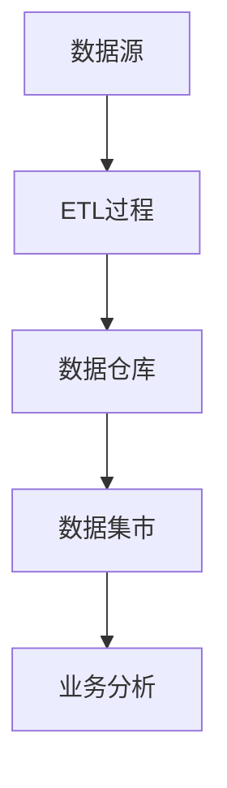

                 

### 关键词：数据仓库，原理，架构，算法，代码实例，大数据处理，数据库管理，数据建模，数据分析

> **摘要：**本文旨在深入解析数据仓库的基本原理、架构设计、核心算法及其实际应用。通过代码实例讲解，帮助读者掌握数据仓库的开发和优化技巧，为企业大数据战略的实施提供指导。

## 1. 背景介绍

在当今信息爆炸的时代，数据已经成为了企业的重要资产。如何高效地管理和分析数据，以支持决策制定和业务增长，成为了一个关键问题。数据仓库作为大数据处理的核心架构，承担着数据存储、整合、分析和查询的重要任务。

### 数据仓库的定义

数据仓库是一个集成化的数据环境，用于支持企业决策制定。它通过对多个数据源的数据进行抽取、转换、加载（ETL），形成一个统一的数据模型，以便于查询和分析。

### 数据仓库的重要性

1. **数据集成与一致性**：数据仓库能够整合来自不同来源的数据，消除数据冗余，保证数据的一致性。
2. **决策支持**：通过数据仓库，企业可以快速获取准确的数据分析结果，为决策提供有力支持。
3. **业务增长**：数据仓库可以帮助企业更好地理解客户需求，优化产品和服务，推动业务增长。

## 2. 核心概念与联系

### 数据仓库的三个层次

1. **数据源**：包括企业内部的数据库、文件系统、外部数据源等。
2. **数据仓库**：存储经过ETL过程处理后的数据。
3. **数据集市**：根据不同业务需求，对数据仓库中的数据进行再加工，形成用于特定业务分析的数据集合。

### 核心概念原理和架构的 Mermaid 流程图



### 数据仓库与数据库的区别

- **数据库**：主要用于日常事务处理，数据结构相对简单，实时性要求高。
- **数据仓库**：用于数据分析，数据结构复杂，数据量大，实时性要求相对较低。

## 3. 核心算法原理 & 具体操作步骤

### 3.1 算法原理概述

数据仓库中的核心算法包括数据抽取、转换和加载（ETL）。这些算法是数据仓库构建和运行的基础。

### 3.2 算法步骤详解

1. **数据抽取**：从数据源中抽取所需数据。
2. **数据转换**：对抽取的数据进行清洗、格式化、转换等操作。
3. **数据加载**：将转换后的数据加载到数据仓库中。

### 3.3 算法优缺点

- **优点**：提高数据一致性，支持复杂查询，优化数据分析效率。
- **缺点**：数据仓库构建和维护成本高，数据实时性较低。

### 3.4 算法应用领域

数据仓库广泛应用于金融、电信、电商、制造等行业，用于客户分析、市场研究、风险管理等业务场景。

## 4. 数学模型和公式 & 详细讲解 & 举例说明

### 4.1 数学模型构建

数据仓库的数学模型主要包括数据建模和统计分析模型。

### 4.2 公式推导过程

数据仓库中常用的数学公式包括数据一致性检查、数据清洗和转换等。以下是一个示例公式：

$$
一致性检查 = \sum_{i=1}^{n} |X_i - Y_i| / n
$$

其中，$X_i$ 和 $Y_i$ 分别代表数据仓库中的两个相同数据项，$n$ 是数据项的总数。

### 4.3 案例分析与讲解

假设我们有一个电商数据仓库，其中包含用户的购买记录。我们可以使用统计分析模型来分析用户的购买行为，例如计算用户的平均购买金额、购买频率等。

## 5. 项目实践：代码实例和详细解释说明

### 5.1 开发环境搭建

本文将使用Python语言和Apache Hadoop平台进行数据仓库的实践。请按照以下步骤搭建开发环境：

1. 安装Python和Hadoop
2. 配置Hadoop集群
3. 安装PyHive库

### 5.2 源代码详细实现

以下是一个简单的数据仓库项目示例：

```python
from pyhive import hive

# 连接到Hive数据库
conn = hive.Connection(host='localhost', port=10000)

# 创建数据仓库表
conn.execute('''
    CREATE TABLE IF NOT EXISTS user_purchase(
        user_id INT,
        product_id INT,
        purchase_amount DECIMAL(10, 2),
        purchase_date DATE
    )
''')

# 加载数据到数据仓库
conn.execute('''
    LOAD DATA INPATH '/path/to/user_purchase_data.csv'
    INTO TABLE user_purchase
    FORMAT AS CSV
    DELIMITER ','
    ESCAPED BY '"'
    LINES TERMINATED BY '\n'
''')

# 执行数据分析查询
result = conn.execute('''
    SELECT
        user_id,
        AVG(purchase_amount) as average_purchase_amount,
        COUNT(*) as purchase_frequency
    FROM
        user_purchase
    GROUP BY
        user_id
''')

# 打印查询结果
for row in result:
    print(row)
```

### 5.3 代码解读与分析

上述代码实现了一个简单的数据仓库项目，包括表创建、数据加载和数据分析查询。通过PyHive库，我们可以轻松地与Hive数据库交互，执行复杂的数据操作。

### 5.4 运行结果展示

运行上述代码后，我们将得到用户购买记录的平均购买金额和购买频率等分析结果。这些结果可以帮助企业更好地理解客户需求，优化产品和服务。

## 6. 实际应用场景

### 6.1 客户分析

通过数据仓库，企业可以对客户进行细分，了解不同客户群体的购买行为，制定有针对性的营销策略。

### 6.2 风险管理

数据仓库可以帮助企业实时监控风险，通过分析交易数据，识别潜在的风险因素，及时采取措施降低风险。

### 6.3 运营优化

数据仓库可以支持企业对业务运营的全面监控和分析，优化资源配置，提高运营效率。

## 7. 工具和资源推荐

### 7.1 学习资源推荐

1. 《大数据架构与云计算》
2. 《数据仓库与数据挖掘》
3. 《Hadoop实战》

### 7.2 开发工具推荐

1. Apache Hadoop
2. Apache Hive
3. PyHive

### 7.3 相关论文推荐

1. "Data Warehouse Systems: A Theoretical Introduction"
2. "Hadoop: The Definitive Guide"
3. "Data Warehousing in the Cloud"

## 8. 总结：未来发展趋势与挑战

### 8.1 研究成果总结

数据仓库技术在过去几十年中取得了显著的进展，实现了从单一的数据存储到全面的数据分析解决方案的转型。未来，数据仓库将继续向智能化、实时化、自动化方向发展。

### 8.2 未来发展趋势

1. **实时数据仓库**：随着大数据处理技术的发展，实时数据仓库将成为主流。
2. **智能化数据仓库**：利用人工智能技术，实现数据仓库的自动化和智能化。
3. **云数据仓库**：云数据仓库将为企业和开发者提供更加灵活和高效的数据处理平台。

### 8.3 面临的挑战

1. **数据安全性**：确保数据仓库中的数据安全，防范数据泄露和攻击。
2. **数据治理**：建立有效的数据治理体系，确保数据的准确性、一致性和可靠性。

### 8.4 研究展望

数据仓库技术将在未来的发展中继续发挥重要作用，为企业的大数据战略提供强有力的支持。我们期待看到更多创新和突破，为数据仓库的发展注入新的活力。

## 9. 附录：常见问题与解答

### Q1. 数据仓库和数据库的区别是什么？

**A1.** 数据仓库主要用于数据分析，数据结构复杂，支持复杂的查询和报表生成；数据库主要用于日常事务处理，数据结构简单，实时性要求高。

### Q2. 如何保证数据仓库的数据一致性？

**A2.** 通过建立数据校验规则、数据清洗流程和数据集成机制，确保数据仓库中的数据一致性。

### Q3. 数据仓库需要使用哪种编程语言？

**A3.** 数据仓库开发常用的编程语言包括SQL、Python、Java等。Python和Java因其强大的数据处理能力和丰富的库支持，常被用于数据仓库开发。

### Q4. 数据仓库在哪些行业有广泛应用？

**A4.** 数据仓库广泛应用于金融、电信、电商、制造、医疗等行业，用于客户分析、市场研究、风险管理等业务场景。

## 作者署名

**作者：禅与计算机程序设计艺术 / Zen and the Art of Computer Programming** 

以上就是本文的完整内容。希望本文能够帮助读者深入了解数据仓库的基本原理、架构设计、核心算法及其实际应用，为企业大数据战略的实施提供指导。感谢您的阅读。

