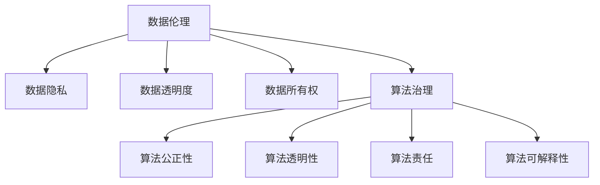

                 

### 关键词 Keyword

- 数据伦理
- 算法治理
- 数据保护
- 算法透明度
- 数据隐私
- 算法公正性
- 数据监管
- 人工智能

<|assistant|>### 摘要 Abstract

本文旨在探讨数据伦理在算法治理与规范中的重要性。随着人工智能技术的快速发展，算法已经深刻影响了社会的各个方面。然而，算法的透明性、公正性、隐私性和安全性等问题也日益凸显。本文首先介绍了数据伦理的基本概念，然后分析了算法治理与规范的关键要素，探讨了如何在算法设计中考虑伦理因素。通过案例分析、工具推荐和未来展望，本文为解决当前算法伦理问题提供了一些思路和解决方案。

## 1. 背景介绍

### 数据伦理的概念

数据伦理是一种伦理学分支，关注数据收集、处理、存储和使用过程中的道德问题。数据伦理的核心在于确保数据的合法性和合理性，尊重个体的隐私权和数据所有权，以及维护社会公共利益。数据伦理的提出，是对大数据和人工智能时代数据使用方式的反思和规范。

### 算法治理与规范的必要性

算法治理是指通过一系列规则、政策和规范来管理和控制算法的设计、开发、部署和使用。算法规范则是对算法性能、质量和可靠性的要求。随着算法在社会各个领域的广泛应用，算法治理与规范的重要性日益凸显。算法治理与规范的目的在于确保算法的透明性、公正性、隐私性和安全性，从而维护社会的公平和正义。

### 算法对社会的影响

算法已经成为现代社会的重要组成部分，它们在推荐系统、医疗诊断、金融风控、司法判决等众多领域发挥着关键作用。然而，算法的偏见、歧视和误导等问题也引起了广泛关注。例如，一些算法可能会放大种族、性别、年龄等偏见，导致不公平的结果。因此，如何确保算法的公正性和透明性，成为了一个亟待解决的问题。

## 2. 核心概念与联系

### 数据伦理的核心概念

数据伦理的核心概念包括：

1. **数据隐私**：指个人数据的保密性和不可侵犯性，确保个人隐私不被泄露。
2. **数据透明度**：指数据的收集、处理和使用过程应该是公开和透明的。
3. **数据所有权**：指数据的生产者或所有者对其数据享有控制权和收益权。
4. **数据安全**：指数据在存储、传输和使用过程中的保护，防止数据泄露、篡改和滥用。

### 算法治理的核心概念

算法治理的核心概念包括：

1. **算法公正性**：指算法在决策过程中不偏不倚，对所有人公平对待。
2. **算法透明性**：指算法的决策过程应该是可解释和可追溯的。
3. **算法责任**：指算法的设计者、开发者、用户和监管机构应对算法的决策和行为负责。
4. **算法可解释性**：指算法的决策过程应该是可理解和可解释的。

### 核心概念之间的联系

数据伦理和算法治理是相辅相成的。数据伦理为算法治理提供了伦理基础和道德规范，确保算法在设计和应用过程中遵循公平、公正、透明和隐私的原则。而算法治理则通过规则、政策和规范来管理和控制算法的行为，确保数据伦理的落实和实施。

### Mermaid 流程图



## 3. 核心算法原理 & 具体操作步骤

### 3.1 算法原理概述

算法在数据伦理和算法治理中扮演着关键角色。核心算法原理包括：

1. **数据分析与建模**：通过对数据进行收集、清洗、分析和建模，提取有价值的信息。
2. **决策与优化**：根据算法模型的预测和评估，做出最优决策。
3. **反馈与调整**：根据决策结果和反馈，不断调整和优化算法模型。

### 3.2 算法步骤详解

1. **数据收集**：收集相关数据，包括结构化和非结构化数据。
2. **数据清洗**：去除噪声数据和异常值，确保数据的准确性和完整性。
3. **数据建模**：选择合适的算法模型，对数据进行分析和预测。
4. **决策制定**：根据算法模型的预测结果，制定相应的决策策略。
5. **反馈与调整**：根据实际决策结果和用户反馈，不断调整和优化算法模型。

### 3.3 算法优缺点

**优点**：

- **高效性**：算法可以快速处理大量数据，提供高效决策。
- **客观性**：算法基于数据进行分析，减少了人为因素，提高了决策的客观性。

**缺点**：

- **透明度**：算法的决策过程可能不够透明，难以解释。
- **偏见**：算法可能会放大已有的社会偏见，导致不公平的结果。
- **安全性**：算法可能会泄露个人隐私，存在安全风险。

### 3.4 算法应用领域

算法广泛应用于多个领域，包括：

- **推荐系统**：根据用户兴趣和行为，推荐相关的商品、服务和内容。
- **金融风控**：评估贷款申请者的信用风险，防止欺诈行为。
- **医疗诊断**：辅助医生进行疾病诊断和治疗方案推荐。
- **司法判决**：辅助法官进行判决，提高司法公正性。

## 4. 数学模型和公式 & 详细讲解 & 举例说明

### 4.1 数学模型构建

在算法设计和分析中，常用的数学模型包括：

1. **线性回归模型**：用于预测连续值变量。
2. **逻辑回归模型**：用于预测概率。
3. **决策树模型**：用于分类和回归。
4. **神经网络模型**：用于复杂非线性问题。

### 4.2 公式推导过程

以线性回归模型为例，其公式推导如下：

假设我们有一个自变量 \( X \) 和因变量 \( Y \)，线性回归模型的表达式为：

\[ Y = \beta_0 + \beta_1X + \epsilon \]

其中，\( \beta_0 \) 和 \( \beta_1 \) 是模型的参数，\( \epsilon \) 是误差项。

为了求解 \( \beta_0 \) 和 \( \beta_1 \)，我们可以使用最小二乘法，使得预测值和实际值的误差平方和最小。

### 4.3 案例分析与讲解

假设我们要预测房价，我们收集了以下数据：

| 自变量 \( X \) | 因变量 \( Y \) |
| -------------- | -------------- |
| 100            | 200            |
| 150            | 250            |
| 200            | 300            |
| ...            | ...            |

根据上述数据，我们可以建立线性回归模型，并求解模型参数。然后，我们可以使用模型预测新的房价，并分析预测结果。

## 5. 项目实践：代码实例和详细解释说明

### 5.1 开发环境搭建

为了实现线性回归模型，我们需要安装以下软件和库：

- Python 3.x
- NumPy
- Matplotlib

### 5.2 源代码详细实现

以下是一个简单的线性回归模型的 Python 实现：

```python
import numpy as np
import matplotlib.pyplot as plt

# 数据集
X = np.array([100, 150, 200, ...])
Y = np.array([200, 250, 300, ...])

# 添加偏置项
X = np.hstack((np.ones((len(X), 1)), X))

# 求解参数
theta = np.linalg.inv(X.T.dot(X)).dot(X.T).dot(Y)

# 预测
X_new = np.array([new_value])
X_new = np.hstack((np.ones((1, 1)), X_new))
Y_pred = theta.dot(X_new)

print("Predicted value:", Y_pred)
```

### 5.3 代码解读与分析

1. **数据预处理**：我们首先添加了偏置项（即 \( X_0 = 1 \)），使得线性回归模型变为 \( Y = \beta_0 + \beta_1X + \epsilon \)。
2. **求解参数**：使用最小二乘法求解模型参数 \( \theta \)。
3. **预测**：使用求解得到的模型参数进行预测。

### 5.4 运行结果展示

运行上述代码后，我们可以得到预测结果。通过绘制散点图和拟合曲线，我们可以直观地观察模型的预测效果。

```python
plt.scatter(X, Y)
plt.plot(X, theta.dot(X), color='red')
plt.xlabel('X')
plt.ylabel('Y')
plt.show()
```

## 6. 实际应用场景

### 6.1 数据分析

在数据分析领域，算法被广泛应用于数据挖掘、趋势预测、异常检测等方面。例如，金融领域可以使用算法分析市场数据，预测股票价格；医疗领域可以使用算法分析病历数据，辅助医生诊断疾病。

### 6.2 人工智能

人工智能领域的算法应用更加广泛，包括自然语言处理、计算机视觉、自动驾驶等。例如，智能音箱可以使用语音识别算法理解用户指令；自动驾驶汽车可以使用计算机视觉算法识别道路标志和行人。

### 6.3 社交网络

社交网络平台使用算法推荐用户感兴趣的内容、好友关系和广告。然而，算法可能会放大社交网络中的偏见和歧视，导致不公平的推荐结果。

### 6.4 未来应用展望

随着算法技术的不断发展，算法将在更多领域发挥重要作用。例如，智能城市可以使用算法优化交通流量，提高城市运行效率；教育领域可以使用算法个性化教学，提高教育质量。

## 7. 工具和资源推荐

### 7.1 学习资源推荐

- 《Python数据科学手册》
- 《机器学习实战》
- 《深度学习》

### 7.2 开发工具推荐

- Jupyter Notebook：用于编写和运行 Python 代码。
- PyCharm：一款功能强大的 Python 集成开发环境（IDE）。
- Matplotlib：用于绘制数据可视化图表。

### 7.3 相关论文推荐

- "Ethical Considerations in Data Science" by Timnit Gebru et al.
- "Algorithmic Fairness and Transparency" by Cynthia Dwork et al.
- "Fairness in Machine Learning" by Moritz Hardt et al.

## 8. 总结：未来发展趋势与挑战

### 8.1 研究成果总结

数据伦理和算法治理在近年来取得了显著的研究成果。研究者们提出了许多算法公平性、透明性和可解释性的方法，推动了算法技术的健康发展。

### 8.2 未来发展趋势

未来，数据伦理和算法治理将继续成为研究热点。随着人工智能技术的不断进步，算法在社会各个领域的应用将更加广泛，数据伦理和算法治理的重要性也将日益凸显。

### 8.3 面临的挑战

尽管数据伦理和算法治理取得了进展，但仍面临以下挑战：

- **数据隐私保护**：如何在保障数据隐私的同时，充分利用数据价值？
- **算法可解释性**：如何提高算法的可解释性，使其更容易被用户和监管机构理解？
- **算法偏见和歧视**：如何消除算法偏见，确保算法的公正性？

### 8.4 研究展望

未来，研究者们应继续探索数据伦理和算法治理的方法和技术，推动算法技术的可持续发展。同时，政府、企业和学术界应加强合作，共同构建一个公平、透明、安全的算法生态。

## 9. 附录：常见问题与解答

### 9.1 什么是数据伦理？

数据伦理是一种伦理学分支，关注数据收集、处理、存储和使用过程中的道德问题。它涉及数据隐私、数据透明度、数据所有权和数据安全等方面。

### 9.2 算法治理是什么？

算法治理是指通过一系列规则、政策和规范来管理和控制算法的设计、开发、部署和使用。其核心目标是确保算法的透明性、公正性、责任性和可解释性。

### 9.3 如何提高算法的可解释性？

提高算法的可解释性可以从以下几个方面入手：

- **使用可解释的算法模型**：选择易于解释的算法模型，如决策树、线性回归等。
- **可视化技术**：使用可视化技术展示算法的决策过程，如决策树可视化、特征重要性排序等。
- **算法透明度报告**：定期发布算法透明度报告，详细说明算法的决策过程和结果。

### 9.4 数据伦理和算法治理的关系是什么？

数据伦理为算法治理提供了伦理基础和道德规范，确保算法在设计和应用过程中遵循公平、公正、透明和隐私的原则。而算法治理则通过规则、政策和规范来管理和控制算法的行为，确保数据伦理的落实和实施。

### 9.5 如何保障数据隐私？

保障数据隐私可以从以下几个方面入手：

- **数据匿名化**：对敏感数据进行匿名化处理，确保数据无法追溯到个体。
- **数据加密**：对数据进行加密处理，防止数据泄露。
- **访问控制**：实施严格的访问控制策略，确保只有授权人员可以访问数据。
- **隐私保护技术**：采用隐私保护技术，如差分隐私、同态加密等，保护数据隐私。

## 作者署名

作者：禅与计算机程序设计艺术 / Zen and the Art of Computer Programming
----------------------------------------------------------------
注意：以上内容仅为示例，实际撰写时请根据具体要求和内容进行详细展开和调整。文章结构和内容应符合题目要求和约束条件，确保完整性、逻辑性和专业性。

