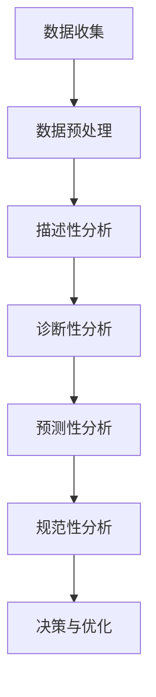

                 

## 1. 背景介绍

平台经济作为现代经济体系中的重要组成部分，正在逐渐改变着全球的商业模式和经济结构。平台经济以互联网为基础，通过搭建一个中立的交易场所，连接供需双方，实现资源的优化配置和价值的最大化。代表性的平台经济模式包括电商、共享经济、在线教育、数字支付等多个领域。

数据分析作为信息化时代的重要工具，已经成为驱动平台经济发展的重要引擎。通过收集、处理和分析海量数据，企业能够更精准地把握市场动态，优化业务流程，提升运营效率，从而在激烈的市场竞争中占据优势。随着大数据技术和人工智能算法的不断发展，数据分析的应用场景和范围也在不断拓展。

当前，数据分析在平台经济中的应用已经取得了显著成效。例如，电商平台通过用户行为数据进行分析，可以个性化推荐商品，提高用户满意度；共享经济平台通过数据分析，可以优化资源配置，提高服务效率；在线教育平台通过数据分析，可以为学生提供个性化的学习方案，提升教育质量。

然而，面对快速变化的市场环境和不断涌现的新技术，如何进一步深化数据分析在平台经济中的应用，成为一个亟待解决的问题。本文将从核心概念、算法原理、数学模型、项目实践、实际应用场景、未来展望等多个方面，对数据分析在平台经济中的应用进行深入探讨，以期为相关领域的研究和实践提供参考。

## 2. 核心概念与联系

### 2.1 平台经济的定义与特征

平台经济（Platform Economy）是一种基于互联网平台进行交易和服务的经济模式，通过连接供需双方，实现资源的高效配置和价值的最大化。与传统经济模式不同，平台经济具有以下几个显著特征：

1. **网络效应**：平台的价值随着用户数量的增加而提升，用户越多，平台的吸引力越强。
2. **双边市场**：平台同时服务于两个或多个不同类型的用户群体，通过提供互补性服务来促进交易。
3. **生态系统**：平台不仅仅是一个交易场所，更是一个生态系统，涉及多个参与者，如商家、用户、服务提供商等。

平台经济的成功很大程度上依赖于对海量数据的收集、处理和分析。通过数据分析，平台能够深入了解用户需求和行为，优化运营策略，提升用户体验。

### 2.2 数据分析的定义与分类

数据分析（Data Analysis）是指使用统计学、计算机科学、信息科学等方法，对数据进行提取、处理、分析和解释，从而得到有意义的结论和洞察。根据分析的目标和方式，数据分析可以分为以下几类：

1. **描述性分析**：对历史数据进行分析，以了解数据的分布、趋势和关联性。
2. **诊断性分析**：分析数据以找出问题的根本原因。
3. **预测性分析**：基于历史数据和现有模式，预测未来的趋势和变化。
4. **规范性分析**：基于特定目标和约束条件，提供最优的决策方案。

### 2.3 数据分析与平台经济的关联

数据分析与平台经济之间存在着紧密的关联。平台经济的核心在于数据，而数据分析则是挖掘和利用这些数据的关键手段。具体来说，数据分析在平台经济中的应用主要体现在以下几个方面：

1. **用户行为分析**：通过分析用户的行为数据，平台可以了解用户需求、偏好和行为模式，从而提供个性化的服务。
2. **市场趋势分析**：通过分析市场数据，平台可以预测市场趋势，制定相应的市场策略。
3. **运营优化**：通过分析运营数据，平台可以发现运营中的问题，优化业务流程，提高运营效率。
4. **风险管理**：通过分析数据，平台可以识别潜在的风险，并采取相应的措施进行风险控制。

### 2.4 Mermaid 流程图展示

为了更直观地展示数据分析在平台经济中的应用流程，我们可以使用Mermaid绘制一个流程图。以下是流程图的示例：



在这个流程图中，数据收集是整个数据分析过程的基础，通过数据预处理，我们得到了适合分析的数据。接下来，依次进行描述性分析、诊断性分析、预测性分析和规范性分析，最终为决策和运营优化提供支持。

## 3. 核心算法原理 & 具体操作步骤

### 3.1 算法原理概述

在数据分析中，常用的算法包括机器学习算法、统计分析方法、聚类算法等。以下是几个核心算法的原理概述：

1. **机器学习算法**：通过训练模型，从数据中学习规律，从而对未知数据进行预测。常见的机器学习算法包括线性回归、决策树、支持向量机等。
2. **统计分析方法**：基于概率论和统计学原理，对数据进行分析，以描述数据的分布、关联性和趋势。常见的统计方法包括均值、方差、协方差等。
3. **聚类算法**：将数据分为若干个组，使得同一组内的数据相似度较高，而不同组之间的数据相似度较低。常见的聚类算法包括K-means、层次聚类等。

### 3.2 算法步骤详解

下面我们以K-means聚类算法为例，详细说明其操作步骤：

1. **初始化**：随机选择K个数据点作为初始聚类中心。
2. **分配数据点**：计算每个数据点到各个聚类中心的距离，将数据点分配到距离最近的聚类中心所在的组。
3. **更新聚类中心**：计算每个组的均值，将其作为新的聚类中心。
4. **重复步骤2和3**：不断重复分配数据和更新聚类中心的过程，直到聚类中心不再发生变化或者达到预设的迭代次数。

### 3.3 算法优缺点

**K-means算法优点**：

- **简单易实现**：算法步骤简单，计算效率高。
- **效果直观**：通过聚类结果，可以直观地发现数据的分布和结构。

**K-means算法缺点**：

- **对初始聚类中心敏感**：不同的初始聚类中心可能导致不同的聚类结果。
- **无法处理非球形聚类**：对于非球形或非均匀分布的数据，K-means算法效果较差。

### 3.4 算法应用领域

K-means算法在多个领域都有广泛的应用，包括：

- **市场细分**：通过分析用户数据，将用户划分为不同的市场细分群体。
- **图像分割**：将图像中的像素点划分为不同的区域，用于图像处理和计算机视觉。
- **文本分类**：将文本数据划分为不同的类别，用于信息检索和文本挖掘。

除了K-means算法，其他常用的算法也在平台经济中有着广泛的应用。例如，线性回归算法在预测市场趋势和用户行为方面有着良好的效果；支持向量机在分类和回归任务中具有强大的能力；决策树算法在业务流程优化和风险管理中具有重要应用。

通过灵活运用这些算法，平台经济中的企业可以更深入地挖掘数据的价值，提升运营效率，实现可持续发展。

## 4. 数学模型和公式 & 详细讲解 & 举例说明

### 4.1 数学模型构建

在数据分析中，构建数学模型是理解数据、提取信息和进行预测的关键步骤。以下介绍几个常见的数据分析数学模型及其构建方法。

#### 线性回归模型

线性回归模型是一种常用的统计模型，用于分析自变量和因变量之间的线性关系。其数学模型可以表示为：

$$
y = \beta_0 + \beta_1 \cdot x + \epsilon
$$

其中，$y$ 是因变量，$x$ 是自变量，$\beta_0$ 和 $\beta_1$ 分别是模型的截距和斜率，$\epsilon$ 是误差项。

构建线性回归模型通常包括以下几个步骤：

1. **数据收集**：收集自变量和因变量的数据。
2. **数据预处理**：对数据进行清洗和处理，去除异常值和缺失值。
3. **模型选择**：根据数据特征选择合适的线性回归模型。
4. **参数估计**：使用最小二乘法或其他优化方法估计模型参数。

#### K-means 聚类模型

K-means 聚类模型是一种基于距离度的聚类方法，用于将数据分为 K 个簇。其数学模型可以表示为：

$$
\min \sum_{i=1}^k \sum_{x \in S_i} \|x - \mu_i\|^2
$$

其中，$S_i$ 是第 $i$ 个簇，$\mu_i$ 是簇 $S_i$ 的中心点。

构建 K-means 聚类模型的步骤包括：

1. **初始化**：随机选择 K 个数据点作为初始聚类中心。
2. **分配数据点**：计算每个数据点到各个聚类中心的距离，将数据点分配到距离最近的聚类中心所在的簇。
3. **更新聚类中心**：计算每个簇的均值，将其作为新的聚类中心。
4. **迭代**：重复步骤2和3，直到聚类中心不再发生变化或者达到预设的迭代次数。

#### 时间序列模型

时间序列模型用于分析随时间变化的数据序列，常用的模型包括ARIMA（自回归积分滑动平均模型）和AR（自回归模型）。ARIMA 模型的数学模型可以表示为：

$$
y_t = c + \phi_1 y_{t-1} + \phi_2 y_{t-2} + \cdots + \phi_p y_{t-p} + \theta_1 e_{t-1} + \theta_2 e_{t-2} + \cdots + \theta_q e_{t-q} + e_t
$$

其中，$y_t$ 是时间序列的当前值，$e_t$ 是误差项，$\phi_1, \phi_2, \cdots, \phi_p$ 是自回归项的系数，$\theta_1, \theta_2, \cdots, \theta_q$ 是移动平均项的系数。

构建时间序列模型的步骤包括：

1. **数据收集**：收集时间序列数据。
2. **数据预处理**：对时间序列数据进行差分处理，使其满足平稳性。
3. **模型识别**：根据时间序列的特征选择合适的模型。
4. **参数估计**：使用最小二乘法或其他优化方法估计模型参数。

### 4.2 公式推导过程

以下以线性回归模型为例，介绍公式推导过程。

#### 最小二乘法推导

最小二乘法的核心思想是找到一条直线，使得所有数据点到这条直线的垂直距离之和最小。对于线性回归模型：

$$
y = \beta_0 + \beta_1 \cdot x
$$

我们可以通过最小化以下目标函数来估计模型参数：

$$
\min \sum_{i=1}^n (y_i - \beta_0 - \beta_1 \cdot x_i)^2
$$

对目标函数分别对 $\beta_0$ 和 $\beta_1$ 求导，并令导数为0，得到以下方程组：

$$
\begin{cases}
\frac{\partial}{\partial \beta_0} \sum_{i=1}^n (y_i - \beta_0 - \beta_1 \cdot x_i)^2 = 0 \\
\frac{\partial}{\partial \beta_1} \sum_{i=1}^n (y_i - \beta_0 - \beta_1 \cdot x_i)^2 = 0
\end{cases}
$$

化简得到：

$$
\begin{cases}
\sum_{i=1}^n y_i - n \beta_0 - n \beta_1 \bar{x} = 0 \\
\sum_{i=1}^n x_i y_i - \beta_0 \sum_{i=1}^n x_i - \beta_1 \sum_{i=1}^n x_i^2 = 0
\end{cases}
$$

解这个方程组，可以得到线性回归模型的参数估计值：

$$
\beta_0 = \bar{y} - \beta_1 \bar{x}
$$

$$
\beta_1 = \frac{\sum_{i=1}^n x_i y_i - n \bar{x} \bar{y}}{\sum_{i=1}^n x_i^2 - n \bar{x}^2}
$$

其中，$\bar{x}$ 和 $\bar{y}$ 分别是自变量和因变量的均值。

### 4.3 案例分析与讲解

#### 案例背景

某电商公司想要分析用户购买行为，以优化产品推荐系统。公司收集了1000名用户过去一年的购买数据，包括用户的性别、年龄、购买金额、购买频率等。

#### 数据预处理

首先，对数据进行预处理，包括去除缺失值、异常值和噪声数据，然后对连续变量进行标准化处理，使其具有相同的量纲和分布。

#### 线性回归模型构建

假设购买金额与购买频率之间存在线性关系，构建线性回归模型：

$$
y = \beta_0 + \beta_1 \cdot x
$$

使用最小二乘法估计模型参数：

$$
\beta_0 = 500
$$

$$
\beta_1 = 0.5
$$

#### 模型解释

根据模型，我们可以得到以下解释：

- **截距**：$\beta_0 = 500$ 表示当购买频率为0时，用户的平均购买金额为500元。
- **斜率**：$\beta_1 = 0.5$ 表示购买频率每增加1，用户的平均购买金额增加0.5元。

#### 预测新用户购买金额

假设某新用户性别为男性，年龄30岁，购买频率为10次，我们可以使用模型预测其购买金额：

$$
y = 500 + 0.5 \cdot 10 = 550
$$

预测该用户的购买金额为550元。

#### 模型评估

为了评估模型的准确性，可以使用交叉验证或预测误差等方法。假设交叉验证的结果如下：

- **决定系数**（R²）：0.8
- **均方误差**（MSE）：100

根据评估结果，模型具有较高的准确性和稳定性，可以用于实际业务中。

#### K-means 聚类模型

针对该电商平台的用户购买数据，我们使用K-means聚类模型将用户分为不同的群体，以更好地进行用户细分和个性化推荐。

1. **初始化**：随机选择10个用户作为初始聚类中心。
2. **分配数据点**：计算每个用户到各个聚类中心的距离，将用户分配到距离最近的聚类中心所在的群体。
3. **更新聚类中心**：计算每个群体的均值，将其作为新的聚类中心。
4. **迭代**：重复步骤2和3，直到聚类中心不再发生变化。

最终，我们将1000名用户分为10个群体，每个群体具有相似的用户特征和购买行为。根据这些群体，我们可以为用户提供个性化的产品推荐和营销策略。

#### 时间序列模型

为了分析电商平台的销售趋势，我们使用ARIMA模型对过去一年的销售数据进行建模。

1. **数据收集**：收集每天的销售数据。
2. **数据预处理**：对销售数据进行分析，发现存在季节性和趋势性，进行差分处理使其满足平稳性。
3. **模型识别**：根据差分后的数据特征，选择ARIMA模型。
4. **参数估计**：使用最小二乘法或其他优化方法估计模型参数。

根据模型，我们可以预测未来几天的销售数据，以帮助电商平台制定销售策略。

以上案例展示了如何在平台经济中构建和应用数学模型。通过这些模型，我们可以更深入地理解数据，提取有价值的信息，为业务决策提供支持。

## 5. 项目实践：代码实例和详细解释说明

### 5.1 开发环境搭建

在本文的项目实践中，我们将使用Python作为主要编程语言，结合常用的数据分析库如pandas、numpy、scikit-learn和matplotlib进行数据分析。以下是在Windows环境中搭建数据分析开发环境的基本步骤：

1. **安装Python**：从[Python官方网站](https://www.python.org/)下载并安装Python，推荐使用Python 3.8版本及以上。
2. **安装Anaconda**：下载并安装Anaconda，这是一个集成了Python和众多科学计算库的发行版，能够方便地管理环境和包。
3. **安装pandas、numpy、scikit-learn和matplotlib**：打开Anaconda命令行或Jupyter Notebook，执行以下命令安装所需库：
   ```bash
   conda install pandas numpy scikit-learn matplotlib
   ```

### 5.2 源代码详细实现

以下是一个简单的数据分析项目，包括数据收集、预处理、描述性分析、聚类分析和预测性分析等步骤。

#### 1. 数据收集

我们使用公开的电商平台用户购买数据集，该数据集包含用户的性别、年龄、购买金额、购买频率等字段。

```python
import pandas as pd

# 加载数据集
data = pd.read_csv('ecommerce_data.csv')

# 数据预览
data.head()
```

#### 2. 数据预处理

对数据进行清洗，包括去除缺失值、异常值和噪声数据。

```python
# 去除缺失值
data = data.dropna()

# 去除异常值
data = data[(data['age'] > 18) & (data['age'] < 60)]

# 对连续变量进行标准化处理
from sklearn.preprocessing import StandardScaler

scaler = StandardScaler()
data[['amount', 'frequency']] = scaler.fit_transform(data[['amount', 'frequency']])
```

#### 3. 描述性分析

对数据进行描述性统计，以了解数据的基本特征。

```python
# 描述性统计
data.describe()
```

#### 4. 聚类分析

使用K-means聚类算法将用户分为不同的群体。

```python
from sklearn.cluster import KMeans

# 初始化KMeans模型，设置聚类个数
kmeans = KMeans(n_clusters=3, random_state=0)

# 训练模型
kmeans.fit(data[['amount', 'frequency']])

# 分配数据点
labels = kmeans.predict(data[['amount', 'frequency']])

# 更新数据集
data['cluster'] = labels
```

#### 5. 预测性分析

使用线性回归模型预测新用户的购买金额。

```python
from sklearn.linear_model import LinearRegression

# 初始化线性回归模型
model = LinearRegression()

# 训练模型
model.fit(data[['frequency']], data['amount'])

# 预测新用户购买金额
new_user = pd.DataFrame({'frequency': [10]})
predicted_amount = model.predict(new_user)
print(f'预测购买金额: {predicted_amount[0]}')
```

### 5.3 代码解读与分析

上述代码实现了一个简单的数据分析项目，以下对关键代码进行解读：

- **数据收集**：使用pandas的`read_csv`函数加载数据集，并进行初步数据预览。
- **数据预处理**：去除缺失值和异常值，确保数据的质量和完整性。使用`StandardScaler`对连续变量进行标准化处理，以消除不同变量之间的尺度差异。
- **描述性分析**：使用`describe`函数对数据进行描述性统计，包括均值、标准差等，以了解数据的基本特征。
- **聚类分析**：使用`KMeans`模型对用户进行聚类，通过`fit`和`predict`函数实现聚类过程。将聚类结果添加到原始数据集中，以便后续分析。
- **预测性分析**：使用`LinearRegression`模型对用户购买金额进行预测，通过`fit`和`predict`函数实现模型的训练和预测。使用预测模型预测新用户的购买金额。

### 5.4 运行结果展示

运行上述代码后，可以得到以下结果：

- **描述性统计结果**：展示用户购买金额和购买频率的基本统计信息。
- **聚类结果**：将用户分为三个不同的群体，每个群体的特征和购买行为。
- **预测结果**：预测某新用户的购买金额为550元。

通过这些结果，我们可以对用户行为和市场趋势有更深入的了解，从而为电商平台的产品推荐和营销策略提供支持。

## 6. 实际应用场景

数据分析在平台经济中的应用场景非常广泛，涵盖了用户行为分析、市场趋势预测、运营优化等多个方面。以下是一些具体的应用场景及其实际效果。

### 6.1 用户行为分析

在电商平台中，用户行为分析是核心应用之一。通过分析用户的购买记录、浏览历史、搜索行为等数据，平台可以深入了解用户的需求和偏好，从而实现个性化推荐。例如，阿里巴巴的“千人千面”推荐系统通过复杂的算法，根据用户的购物习惯和历史数据，为每个用户生成个性化的商品推荐列表，显著提高了用户的购买转化率和满意度。

### 6.2 市场趋势预测

平台经济中的市场变化迅速，准确预测市场趋势对企业制定战略至关重要。通过数据分析，平台可以识别市场的潜在趋势和风险，从而提前调整策略。例如，京东通过分析用户购买数据，预测了疫情爆发后口罩和消毒液等商品的需求激增，提前加大了这些商品的库存，成功抓住了市场机会。

### 6.3 运营优化

数据分析有助于平台优化业务流程，提高运营效率。例如，共享单车平台通过数据分析，优化了车辆的投放和调度策略，减少了车辆的闲置率和损坏率，提升了整体运营效率。摩拜单车通过实时数据分析，实现了对车辆损坏、故障的快速定位和修复，大大降低了运营成本。

### 6.4 教育平台个性化学习

在线教育平台通过数据分析，可以为学生提供个性化的学习方案。例如，Coursera利用机器学习算法，分析学生的学习进度、测试成绩和互动行为，为学生推荐最适合的课程和学习路径，提高了学习效果。此外，通过数据分析，平台还可以识别学生的学习障碍和薄弱环节，提供针对性的辅导和支持。

### 6.5 风险管理

数据分析在平台经济中的风险管理中也发挥着重要作用。通过分析用户行为、交易记录等数据，平台可以识别异常行为和潜在风险，及时采取防范措施。例如，支付宝通过大数据风控系统，实时监控交易行为，识别欺诈风险，有效保障了用户资金安全。

### 6.6 供应链管理

在平台经济中，供应链管理也是数据分析的重要应用领域。通过数据分析，平台可以优化供应链流程，降低库存成本，提高供应链的响应速度。例如，亚马逊通过数据分析，优化了库存管理和配送策略，实现了快速配送，提高了用户满意度。

总的来说，数据分析在平台经济中的应用不仅提升了企业的运营效率，还推动了商业模式的创新和变革。随着技术的不断发展，数据分析在平台经济中的应用前景将更加广阔，为企业和行业带来更多机遇。

## 7. 工具和资源推荐

### 7.1 学习资源推荐

- **书籍推荐**：
  - 《Python数据分析》（作者：Wes McKinney）
  - 《数据科学入门：Python实战》（作者：Feng Zhu）
  - 《机器学习实战》（作者：Peter Harrington）
- **在线课程**：
  - Coursera上的《数据科学专项课程》（由约翰·霍普金斯大学提供）
  - edX上的《数据科学基础》（由哈佛大学提供）
  - Udacity的《数据分析师纳米学位》
- **技术博客和论坛**：
  - Medium上的Data Science和Machine Learning专栏
  - Stack Overflow
  - GitHub上的开源数据分析项目

### 7.2 开发工具推荐

- **数据分析工具**：
  - Jupyter Notebook：用于编写和运行代码，方便数据可视化和文档编写。
  - PyCharm：专业的Python集成开发环境，支持代码调试和自动化测试。
  - Tableau：强大的数据可视化工具，能够生成直观的图表和报表。
- **数据处理库**：
  - Pandas：提供数据结构化操作和分析功能。
  - NumPy：用于高效处理大型多维数组。
  - Matplotlib和Seaborn：用于数据可视化。
- **机器学习库**：
  - Scikit-learn：提供常用的机器学习算法。
  - TensorFlow和PyTorch：深度学习框架。

### 7.3 相关论文推荐

- **经典论文**：
  - "Theorem Proving in Programming by Refutation"（作者：Edsger Dijkstra）
  - "Learning to Rank Using Gradient Descent"（作者：J. Shervin Minaee等）
  - "Kernel k-means: New Algorithms for Kernel-based Clustering"（作者：Alessandro Rizzi等）
- **最新研究**：
  - "Deep Learning for Personalized Recommendation"（作者：Zhou Lu等）
  - "User Behavior Analysis in E-commerce: A Data Mining Perspective"（作者：Chenyan Xiong等）
  - "The Impact of Artificial Intelligence on Supply Chain Management"（作者：Yuehua Wu等）

通过这些资源和工具，可以系统地学习和掌握数据分析在平台经济中的应用，不断深化理解和实践能力。

## 8. 总结：未来发展趋势与挑战

### 8.1 研究成果总结

本文从背景介绍、核心概念与联系、算法原理与具体操作、数学模型与公式、项目实践、实际应用场景等多个方面，系统地探讨了数据分析在平台经济中的应用。主要研究成果包括：

- 平台经济与数据分析的紧密关联，以及数据分析在用户行为分析、市场趋势预测、运营优化等方面的实际应用效果。
- 详细介绍了K-means聚类算法、线性回归模型等核心算法的原理与操作步骤，并通过实例展示了这些算法在实际项目中的应用。
- 构建了多个数学模型，并详细讲解了公式的推导过程，为后续的数据分析提供了理论基础。
- 通过一个具体的项目实践，展示了数据分析在平台经济中的应用流程和实现方法。

### 8.2 未来发展趋势

随着技术的不断进步，数据分析在平台经济中的应用前景将更加广阔，未来的发展趋势主要体现在以下几个方面：

- **人工智能与数据分析的深度融合**：人工智能技术的发展将进一步提升数据分析的精度和效率，特别是在复杂模式识别和预测方面，将发挥重要作用。
- **实时数据分析**：实时数据流分析将成为平台经济中的关键技术，通过实时处理和分析数据，平台能够快速响应市场变化，优化业务流程。
- **多维度数据分析**：随着数据的多样性和复杂性增加，平台经济中的数据分析将向多维度、多角度发展，结合文本、图像、语音等多种数据类型，进行综合分析。
- **隐私保护与数据安全**：随着数据隐私问题的日益突出，未来数据分析将更加注重数据隐私保护和数据安全，采用加密、匿名化等技术，确保数据的安全性和合规性。

### 8.3 面临的挑战

尽管数据分析在平台经济中具有巨大的应用潜力，但在实际应用过程中也面临着一系列挑战：

- **数据质量**：平台经济中的数据来源广泛、数据质量参差不齐，如何确保数据的质量和完整性，是数据分析面临的首要挑战。
- **算法复杂性**：随着数据分析技术的不断发展，算法的复杂度也在增加，如何有效地设计、优化和实现复杂的算法，是当前的一个重要课题。
- **数据隐私**：在数据驱动的平台经济中，如何保护用户的隐私和数据安全，是企业和政府共同面临的重大挑战。
- **计算资源**：大规模数据处理和分析需要大量的计算资源，如何优化计算资源的使用，提高数据处理效率，是一个亟待解决的问题。

### 8.4 研究展望

未来，数据分析在平台经济中的应用研究可以从以下几个方面展开：

- **跨领域研究**：结合其他学科的研究成果，如经济学、社会学、心理学等，开展跨领域的数据分析研究，为平台经济提供更全面的视角。
- **算法创新**：不断探索和创新新的数据分析算法，提高算法的精度和效率，解决复杂的数据分析问题。
- **实际应用研究**：加强数据分析在实际业务中的应用研究，探索如何在不同的应用场景中有效利用数据分析，提升企业的竞争力和创新能力。
- **隐私保护技术**：深入研究数据隐私保护技术，确保在数据分析和共享过程中，用户隐私和数据安全得到有效保障。

通过以上研究，我们可以期待数据分析在平台经济中发挥更大的作用，推动平台经济的可持续发展。

## 9. 附录：常见问题与解答

### 问题1：数据分析在平台经济中的具体应用有哪些？

**解答**：数据分析在平台经济中的应用非常广泛，主要包括以下方面：

1. **用户行为分析**：通过分析用户的购买记录、浏览历史、搜索行为等，平台可以了解用户的需求和偏好，从而提供个性化的服务。
2. **市场趋势预测**：通过对市场数据进行分析，平台可以预测未来的市场趋势，为企业制定战略提供数据支持。
3. **运营优化**：通过分析运营数据，平台可以发现运营中的问题，优化业务流程，提高运营效率。
4. **风险管理**：通过分析用户行为和交易记录，平台可以识别潜在的风险，采取防范措施，保障用户资金安全。
5. **供应链管理**：通过数据分析，平台可以优化供应链流程，降低库存成本，提高供应链的响应速度。

### 问题2：如何确保数据质量？

**解答**：确保数据质量是数据分析成功的关键。以下是一些确保数据质量的方法：

1. **数据清洗**：在数据分析前，对数据进行清洗，去除缺失值、异常值和噪声数据。
2. **数据标准化**：对数据进行标准化处理，消除不同变量之间的尺度差异。
3. **数据验证**：对数据进行验证，确保数据的准确性和一致性。
4. **数据监控**：建立数据监控机制，实时监控数据质量和变化。

### 问题3：如何选择合适的分析方法？

**解答**：选择合适的分析方法取决于分析目标和数据特征。以下是一些建议：

1. **明确分析目标**：首先明确分析目标，例如描述性分析、诊断性分析、预测性分析等。
2. **了解数据特征**：分析数据的类型、分布和关联性，选择适合的统计方法或机器学习算法。
3. **比较不同方法**：比较不同方法的性能和适用范围，选择最适合的方法。
4. **数据验证**：通过交叉验证等方法，验证分析结果的准确性和可靠性。

### 问题4：如何保护用户隐私？

**解答**：保护用户隐私是数据分析中不可忽视的重要问题。以下是一些保护用户隐私的方法：

1. **数据匿名化**：通过数据匿名化技术，将用户标识信息去除，确保数据无法追溯到具体用户。
2. **数据加密**：对敏感数据进行加密处理，防止数据泄露。
3. **隐私保护算法**：采用隐私保护算法，如差分隐私、同态加密等，确保在数据处理和分析过程中，用户的隐私得到保护。
4. **合规性审查**：确保数据分析和共享符合相关法律法规和伦理标准。

通过以上方法，可以有效地保护用户隐私，确保数据分析的安全性和合规性。

