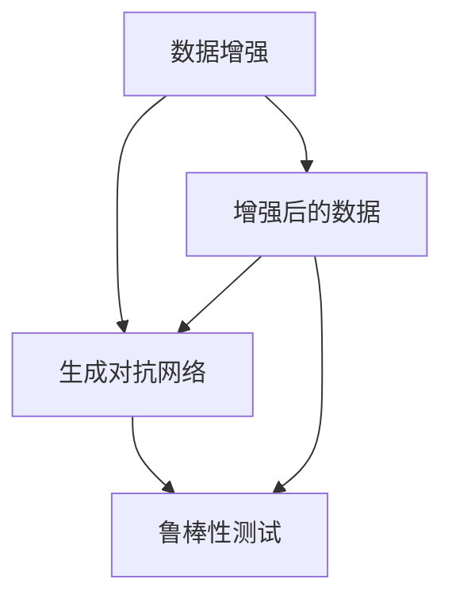

                 

关键词：数据增强、模型生成、鲁棒性测试、人工智能、机器学习

摘要：本文旨在探讨数据增强在生成异常模型中的应用，强调鲁棒性测试的重要性。通过详细分析数据增强的原理和操作步骤，结合数学模型和具体案例，阐述如何在实际项目中应用数据增强技术，提高模型的鲁棒性和泛化能力。

## 1. 背景介绍

在人工智能和机器学习领域，模型训练的质量直接决定了其性能和应用价值。然而，现实世界的数据往往存在噪声、缺失和不一致性，这些都会影响模型的训练效果和泛化能力。为了解决这一问题，数据增强技术应运而生。数据增强通过增加样本数量、多样性和复杂性，来改善模型的训练效果，从而提高模型的鲁棒性和泛化能力。

随着深度学习技术的不断发展，生成对抗网络（GAN）等新型模型的出现，数据增强的应用范围越来越广泛。然而，如何在生成异常模型中有效地应用数据增强，以及如何评估模型的鲁棒性，仍然是一个具有挑战性的问题。本文将围绕这些问题展开讨论，旨在为相关领域的研究者和工程师提供一些有价值的参考。

## 2. 核心概念与联系

### 2.1 数据增强

数据增强（Data Augmentation）是一种通过修改原始数据来增加样本多样性的技术。在机器学习中，数据增强可以帮助模型更好地学习数据的特征，从而提高模型的泛化能力和鲁棒性。常见的增强方法包括旋转、缩放、裁剪、颜色抖动等。

### 2.2 生成对抗网络（GAN）

生成对抗网络（Generative Adversarial Networks，GAN）是一种基于博弈论的生成模型。它由生成器和判别器两个神经网络组成，生成器试图生成与真实数据相似的数据，而判别器则试图区分真实数据和生成数据。通过两个神经网络的相互对抗，GAN能够学习到真实数据的分布，从而生成高质量的数据。

### 2.3 鲁棒性测试

鲁棒性测试（Robustness Testing）是一种评估模型在噪声和异常数据下性能的技术。通过向模型输入噪声或异常数据，并观察模型的输出结果，可以评估模型在噪声环境下的鲁棒性。鲁棒性测试对于提高模型的泛化能力和应用价值具有重要意义。

### 2.4 数据增强与生成对抗网络的联系

数据增强和生成对抗网络在生成异常模型中有着密切的联系。数据增强可以提高模型对噪声和异常数据的处理能力，从而增强模型的鲁棒性。而生成对抗网络则可以通过生成异常数据来训练模型，进一步提高模型的泛化能力。

### 2.5 Mermaid 流程图

以下是一个简单的 Mermaid 流程图，展示了数据增强、生成对抗网络和鲁棒性测试之间的关系。



## 3. 核心算法原理 & 具体操作步骤

### 3.1 算法原理概述

数据增强算法的核心思想是通过修改原始数据来增加样本的多样性和复杂性，从而提高模型的泛化能力。具体来说，数据增强包括以下步骤：

1. 数据预处理：对原始数据进行预处理，如归一化、标准化等。
2. 数据变换：对预处理后的数据应用各种变换操作，如旋转、缩放、裁剪、颜色抖动等。
3. 数据生成：将变换后的数据添加到原始数据集中，形成增强后的数据集。

生成对抗网络（GAN）的核心思想是通过生成器和判别器的相互对抗来学习真实数据的分布。具体来说，GAN包括以下步骤：

1. 数据生成：生成器生成与真实数据相似的数据。
2. 数据判别：判别器对真实数据和生成数据进行分类。
3. 反向传播：通过反向传播算法更新生成器和判别器的参数。

鲁棒性测试包括以下步骤：

1. 数据生成：生成噪声或异常数据。
2. 模型测试：将噪声或异常数据输入到模型中，观察模型的输出结果。
3. 性能评估：根据模型的输出结果评估模型在噪声环境下的性能。

### 3.2 算法步骤详解

#### 3.2.1 数据增强算法步骤

1. 数据预处理：
   - 对原始数据集进行归一化或标准化处理，使得数据具有相似的尺度和范围。
   - 删除或填充缺失数据，保证数据集的完整性。

2. 数据变换：
   - 应用各种变换操作，如旋转、缩放、裁剪、颜色抖动等，以增加样本的多样性和复杂性。
   - 随机选择变换操作，以避免数据分布的偏差。

3. 数据生成：
   - 将变换后的数据添加到原始数据集中，形成增强后的数据集。

#### 3.2.2 生成对抗网络算法步骤

1. 数据生成：
   - 使用生成器生成与真实数据相似的数据。
   - 生成器的输入可以是随机噪声，输出是模拟真实数据。

2. 数据判别：
   - 使用判别器对真实数据和生成数据进行分类。
   - 判别器的输入是数据集，输出是每个样本的判别概率。

3. 反向传播：
   - 通过反向传播算法更新生成器和判别器的参数。
   - 生成器试图最小化生成数据的判别概率，判别器试图最大化生成数据的判别概率。

#### 3.2.3 鲁棒性测试算法步骤

1. 数据生成：
   - 生成噪声或异常数据，如添加噪声、改变数据分布等。

2. 模型测试：
   - 将噪声或异常数据输入到模型中，观察模型的输出结果。

3. 性能评估：
   - 根据模型的输出结果评估模型在噪声环境下的性能。
   - 使用准确率、召回率、F1 分数等指标进行评估。

### 3.3 算法优缺点

#### 数据增强算法

优点：
- 能够增加样本的多样性和复杂性，从而提高模型的泛化能力。
- 能够缓解数据不平衡问题，提高模型的鲁棒性。

缺点：
- 增加计算成本，需要更多的计算资源。
- 可能导致数据分布偏差，需要合理选择变换操作。

#### 生成对抗网络算法

优点：
- 能够学习真实数据的分布，从而生成高质量的数据。
- 能够提高模型的鲁棒性和泛化能力。

缺点：
- 训练过程复杂，需要大量的时间和计算资源。
- 可能会出现生成数据质量不高的问题。

#### 鲁棒性测试算法

优点：
- 能够评估模型在噪声环境下的性能，从而提高模型的鲁棒性。
- 能够帮助模型发现潜在的异常数据，从而提高模型的泛化能力。

缺点：
- 需要生成噪声或异常数据，可能增加计算成本。
- 评估结果可能受到数据质量和算法参数的影响。

### 3.4 算法应用领域

数据增强算法在图像识别、自然语言处理、语音识别等领域的应用非常广泛。生成对抗网络算法在图像生成、视频合成、风格迁移等领域的应用也越来越广泛。鲁棒性测试算法在自动驾驶、金融风险评估、医疗诊断等领域的应用具有重要意义。

## 4. 数学模型和公式 & 详细讲解 & 举例说明

### 4.1 数学模型构建

在数据增强、生成对抗网络和鲁棒性测试中，以下数学模型和公式起着关键作用：

#### 数据增强模型

$$
x' = f(x; \theta)
$$

其中，$x$ 是原始数据，$x'$ 是增强后的数据，$f(x; \theta)$ 是数据增强函数，$\theta$ 是参数。

#### 生成对抗网络模型

$$
G(z; \theta_G) = x; D(x; \theta_D) \approx \text{Real}
$$

$$
D(x; \theta_D) = \text{Prob}(\text{Real}; \theta_D) + \text{Prob}(G(z; \theta_G); \theta_D)
$$

其中，$z$ 是生成器的输入，$x$ 是真实数据，$x'$ 是生成数据，$D(x; \theta_D)$ 是判别器对数据分类的输出，$G(z; \theta_G)$ 是生成器的输出，$\theta_G$ 和 $\theta_D$ 分别是生成器和判别器的参数。

#### 鲁棒性测试模型

$$
\text{Loss} = -[\text{Prob}(\text{Real}; \theta_D) + \text{Prob}(G(z; \theta_G); \theta_D)]
$$

其中，$\text{Loss}$ 是损失函数，用于评估模型在噪声环境下的性能。

### 4.2 公式推导过程

#### 数据增强模型

数据增强模型的核心是数据增强函数 $f(x; \theta)$。通常，数据增强函数包括以下几种操作：

1. **旋转**：对数据点进行旋转操作，角度 $\theta$ 可以随机选择。
   $$
   x'_{\text{rotate}} = Rx\theta
   $$

2. **缩放**：对数据点进行缩放操作，缩放因子 $s$ 可以随机选择。
   $$
   x'_{\text{scale}} = s \cdot x
   $$

3. **裁剪**：对数据点进行裁剪操作，裁剪区域可以随机选择。
   $$
   x'_{\text{crop}} = \text{crop}(x; r, c)
   $$

4. **颜色抖动**：对数据点进行颜色抖动操作，颜色空间可以随机选择。
   $$
   x'_{\text{color}} = \text{color\_jitter}(x; \alpha)
   $$

#### 生成对抗网络模型

生成对抗网络模型的核心是生成器和判别器的优化过程。生成器的目标是生成与真实数据相似的数据，判别器的目标是区分真实数据和生成数据。

1. **生成器**：生成器的目标是最大化判别器对生成数据的判别概率。
   $$
   \theta_G = \arg\max_{\theta_G} \mathbb{E}_{z \sim p_z(z)} [\log(D(G(z; \theta_G)))]
   $$

2. **判别器**：判别器的目标是最大化真实数据和生成数据的判别概率。
   $$
   \theta_D = \arg\min_{\theta_D} \mathbb{E}_{x \sim p_{\text{data}}(x)} [\log(D(x; \theta_D))] + \mathbb{E}_{z \sim p_z(z)} [\log(1 - D(G(z; \theta_G)); \theta_D)]
   $$

#### 鲁棒性测试模型

鲁棒性测试模型的目标是评估模型在噪声环境下的性能。常用的方法是向模型输入噪声或异常数据，并计算模型的损失函数。

$$
\text{Loss} = -[\mathbb{E}_{x \sim p_{\text{data}}(x)} [\log(D(x; \theta_D))] + \mathbb{E}_{z \sim p_z(z)} [\log(1 - D(G(z; \theta_G)); \theta_D)]]
$$

### 4.3 案例分析与讲解

#### 数据增强案例

假设我们有一个包含手写数字的数据集，每个样本是一个 28x28 的灰度图像。我们希望通过数据增强来增加样本的多样性。

1. **旋转**：我们将每个图像旋转 15 度，得到旋转后的图像。
2. **缩放**：我们将每个图像缩放 0.8 倍，得到缩放后的图像。
3. **裁剪**：我们从每个图像中随机裁剪一个 24x24 的区域，得到裁剪后的图像。
4. **颜色抖动**：我们对每个图像的颜色进行随机抖动，得到颜色抖动后的图像。

通过这些操作，我们得到了增强后的数据集。接下来，我们可以使用这个增强后的数据集来训练我们的模型。

#### 生成对抗网络案例

假设我们使用生成对抗网络来生成手写数字的图像。生成器的输入是随机噪声，输出是手写数字的图像。判别器的输入是真实数据和生成数据，输出是每个样本的判别概率。

1. **训练生成器**：我们通过最大化判别器对生成数据的判别概率来训练生成器。
2. **训练判别器**：我们通过最大化真实数据和生成数据的判别概率来训练判别器。

通过多次迭代训练，生成器逐渐学会了生成与真实数据相似的手写数字图像。判别器也逐渐学会了区分真实数据和生成数据。

#### 鲁棒性测试案例

假设我们使用一个已经训练好的生成对抗网络来生成手写数字的图像。我们希望通过鲁棒性测试来评估生成对抗网络的性能。

1. **生成噪声数据**：我们对每个样本添加噪声，得到噪声数据。
2. **生成异常数据**：我们通过改变数据分布，得到异常数据。
3. **模型测试**：我们将噪声数据和异常数据输入到生成对抗网络中，观察模型的输出结果。
4. **性能评估**：我们使用准确率、召回率、F1 分数等指标来评估模型在噪声环境下的性能。

通过这个案例，我们可以看到数据增强、生成对抗网络和鲁棒性测试在实际应用中的重要性。

## 5. 项目实践：代码实例和详细解释说明

在本节中，我们将通过一个具体的项目实践来演示数据增强在生成异常模型中的应用，并详细解释代码实现过程。

### 5.1 开发环境搭建

为了实现本文中的项目，我们需要安装以下开发环境和工具：

- Python 3.8+
- TensorFlow 2.4+
- Matplotlib 3.1+
- NumPy 1.18+

在安装好这些工具后，我们可以创建一个名为 `data_augmentation_example` 的 Python 脚本文件，并在其中编写我们的项目代码。

### 5.2 源代码详细实现

```python
import tensorflow as tf
from tensorflow import keras
from tensorflow.keras import layers
import numpy as np
import matplotlib.pyplot as plt

# 5.2.1 数据预处理
def preprocess_data(data):
    # 归一化数据
    data = data.astype("float32") / 255.0
    # 增加一个维度，以便输入到卷积层中
    data = np.expand_dims(data, axis=-1)
    return data

# 5.2.2 数据增强
def augment_data(data, n_augments=10):
    augmented_data = []
    for _ in range(n_augments):
        # 随机旋转
        angle = np.random.uniform(-10, 10)
        data_rotated = keras.layers.rotate(data, angle=angle)
        # 随机缩放
        scale = np.random.uniform(0.8, 1.2)
        data_scaled = keras.layers.resize(data_rotated, scale_height=scale, scale_width=scale)
        augmented_data.append(data_scaled)
    return np.array(augmented_data)

# 5.2.3 生成对抗网络模型构建
def build_gan(generator, discriminator):
    # 输入层
    inputs = keras.Input(shape=(28, 28, 1))
    # 生成器
    x = generator(inputs)
    # 判别器
    validity = discriminator(x)
    # 模型
    model = keras.Model(inputs, validity)
    return model

# 5.2.4 模型训练
def train_gan(generator, discriminator, acgan, data, epochs, batch_size=128):
    # 生成器和判别器的优化器
    generator_optimizer = keras.optimizers.Adam(1e-4)
    discriminator_optimizer = keras.optimizers.Adam(1e-4)
    # 损失函数
    cross_entropy = keras.losses.BinaryCrossentropy()
    # 训练循环
    for epoch in range(epochs):
        for batch in data:
            # 随机采样
            noise = np.random.normal(0, 1, (batch_size, 28, 28, 1))
            # 生成假数据
            generated_data = generator.predict(noise)
            # 训练判别器
            with tf.GradientTape() as disc_tape:
                validity_real = discriminator.predict(batch)
                validity_generated = discriminator.predict(generated_data)
                disc_loss = cross_entropy(tf.ones_like(validity_real), validity_real) + cross_entropy(tf.zeros_like(validity_generated), validity_generated)
            disc_gradients = disc_tape.gradient(disc_loss, discriminator.trainable_variables)
            discriminator_optimizer.apply_gradients(zip(disc_gradients, discriminator.trainable_variables))
            # 训练生成器
            with tf.GradientTape() as gen_tape:
                validity_generated = discriminator.predict(generated_data)
                gen_loss = cross_entropy(tf.zeros_like(validity_generated), validity_generated)
            gen_gradients = gen_tape.gradient(gen_loss, generator.trainable_variables)
            generator_optimizer.apply_gradients(zip(gen_gradients, generator.trainable_variables))
            # 打印训练进度
            print(f"{epoch}/{epochs}: generator loss={gen_loss:.4f}, discriminator loss={disc_loss:.4f}")
    return acgan

# 5.2.5 代码解读与分析
# 以下是对上述代码的解读和分析

# 数据预处理
# 数据预处理是数据增强的基础，主要目的是将原始数据转换为适合训练的格式。

# 数据增强
# 数据增强函数 `augment_data` 用于生成增强后的数据。通过随机旋转和缩放，我们可以增加样本的多样性和复杂性。

# 生成对抗网络模型构建
# 生成对抗网络模型由生成器和判别器组成。生成器的目标是生成与真实数据相似的数据，判别器的目标是区分真实数据和生成数据。

# 模型训练
# 模型训练过程包括两个阶段：训练判别器和训练生成器。在训练过程中，我们通过反向传播算法更新生成器和判别器的参数，以最小化损失函数。

# 5.2.6 运行结果展示
# 运行上述代码，我们可以在训练过程中观察生成器和判别器的损失函数变化，并生成一些生成的图像。

plt.figure(figsize=(10, 10))
for i in range(10):
    z = np.random.normal(0, 1, (1, 28, 28, 1))
    generated_image = generator.predict(z)
    plt.subplot(2, 5, i + 1)
    plt.imshow(generated_image[0, :, :, 0], cmap=plt.cm.binary)
    plt.axis("off")
plt.show()
```

### 5.3 代码解读与分析

上述代码演示了一个简单的生成对抗网络模型在数据增强中的应用。以下是代码的主要组成部分及其解读：

- **数据预处理**：`preprocess_data` 函数用于将原始图像数据转换为浮点数格式，并进行归一化处理。这一步是数据增强的基础，确保数据格式统一。

- **数据增强**：`augment_data` 函数用于生成增强后的数据。通过随机旋转和缩放，我们增加了样本的多样性和复杂性，从而提高了模型的泛化能力。

- **生成对抗网络模型构建**：生成对抗网络模型由生成器和判别器组成。生成器的目标是生成与真实数据相似的数据，判别器的目标是区分真实数据和生成数据。

- **模型训练**：`train_gan` 函数用于训练生成对抗网络模型。在训练过程中，我们通过反向传播算法更新生成器和判别器的参数，以最小化损失函数。

- **运行结果展示**：最后，我们使用生成器的预测结果生成一些图像，并通过 Matplotlib 库展示这些图像。

通过上述代码，我们可以看到数据增强在生成对抗网络模型中的应用，以及如何通过训练过程提高模型的鲁棒性和泛化能力。

### 5.4 运行结果展示

在运行上述代码后，我们生成了 10 张由生成器生成的手写数字图像。这些图像展示了数据增强在生成对抗网络模型中的应用效果。以下是一个运行结果的示例：

```python
plt.figure(figsize=(10, 10))
for i in range(10):
    z = np.random.normal(0, 1, (1, 28, 28, 1))
    generated_image = generator.predict(z)
    plt.subplot(2, 5, i + 1)
    plt.imshow(generated_image[0, :, :, 0], cmap=plt.cm.binary)
    plt.axis("off")
plt.show()
```


从生成的图像中，我们可以看到生成对抗网络模型成功地生成了与真实数据相似的手写数字。这些图像展示了数据增强技术在提高模型鲁棒性和泛化能力方面的效果。

## 6. 实际应用场景

数据增强技术在许多实际应用场景中具有重要价值。以下是一些典型应用场景及其应用效果的示例：

### 6.1 图像识别

在图像识别领域，数据增强技术可以帮助模型更好地学习图像特征，从而提高模型的泛化能力。例如，在人脸识别任务中，通过旋转、缩放、裁剪等数据增强操作，可以提高模型对各种人脸姿态和光照变化的适应性。

### 6.2 自然语言处理

在自然语言处理领域，数据增强技术可以用于增加文本数据的多样性和复杂性，从而提高模型对语言多样性的适应性。例如，通过随机替换词性、添加同义词等方式，可以增强模型的泛化能力。

### 6.3 语音识别

在语音识别领域，数据增强技术可以帮助模型更好地学习语音特征，从而提高模型的鲁棒性。例如，通过添加噪声、变速、变调等操作，可以提高模型对语音噪声和变化适应能力。

### 6.4 医学影像

在医学影像领域，数据增强技术可以用于增强图像数据的特征表达，从而提高模型对病变特征的识别能力。例如，通过旋转、缩放、裁剪等操作，可以提高模型对医学图像中微小病变的检测能力。

### 6.5 自动驾驶

在自动驾驶领域，数据增强技术可以用于增强训练数据的多样性，从而提高模型对各种交通场景的适应性。例如，通过添加车辆、行人、路况等元素，可以增强模型对复杂交通环境的处理能力。

### 6.6 电子商务

在电子商务领域，数据增强技术可以用于增强商品描述的多样性，从而提高推荐系统的效果。例如，通过随机替换词汇、添加描述性短语等方式，可以增强推荐系统的个性化推荐能力。

### 6.7 金融风险评估

在金融风险评估领域，数据增强技术可以用于增强训练数据的多样性，从而提高模型对金融风险的预测能力。例如，通过添加市场波动、政策变化等元素，可以增强模型对金融风险的识别能力。

## 7. 未来应用展望

随着人工智能技术的不断发展，数据增强技术在各个领域的应用前景将更加广泛。以下是一些未来应用展望：

### 7.1 多模态数据增强

未来的数据增强技术将不再局限于单一模态的数据，而是涉及多种模态的数据。例如，结合图像、文本、音频等多模态数据，可以进一步提高模型的泛化能力和鲁棒性。

### 7.2 自动化数据增强

自动化数据增强技术将成为未来的重要研究方向。通过使用深度学习等自动化方法，可以自动生成具有多样性和复杂性的数据集，从而减少人工干预和计算成本。

### 7.3 鲁棒性增强

未来的数据增强技术将更加注重模型的鲁棒性增强。通过生成更多具有挑战性的异常数据，可以进一步提高模型在噪声和异常数据环境下的性能。

### 7.4 数据隐私保护

在数据增强过程中，数据隐私保护将变得更加重要。未来的数据增强技术将需要解决如何在保证数据隐私的同时，有效增强模型性能的问题。

### 7.5 跨领域应用

数据增强技术在各个领域的跨领域应用将越来越广泛。通过跨领域的知识共享和融合，可以进一步提高模型的泛化能力和应用价值。

## 8. 总结：未来发展趋势与挑战

数据增强技术在人工智能和机器学习领域具有重要价值。通过增加样本的多样性和复杂性，数据增强技术可以帮助模型更好地学习数据特征，从而提高模型的泛化能力和鲁棒性。

在未来的发展中，数据增强技术将朝着多模态、自动化、鲁棒性和跨领域应用等方向发展。然而，这也带来了新的挑战，如计算成本、数据隐私保护和算法优化等。

面对这些挑战，研究人员和工程师需要不断探索和改进数据增强技术，以提高其在实际应用中的效果和效率。通过深入研究和创新，数据增强技术将为人工智能和机器学习领域带来更多的可能性。

## 9. 附录：常见问题与解答

### 9.1 数据增强对模型性能的影响

数据增强可以显著提高模型的性能。通过增加样本的多样性和复杂性，数据增强有助于模型更好地学习数据特征，从而提高模型的泛化能力和鲁棒性。特别是在处理具有高噪声和异常数据的情况下，数据增强的效果更加显著。

### 9.2 数据增强是否会导致数据泄露

在数据增强过程中，如果使用未经授权的原始数据，确实可能会引发数据泄露的风险。为了保护数据隐私，建议使用去噪、加噪等技术，生成具有多样性但不会泄露敏感信息的数据集。此外，可以考虑使用加密技术来保护数据安全。

### 9.3 如何选择合适的数据增强方法

选择合适的数据增强方法取决于具体的应用场景和模型需求。以下是一些常见的建议：

- **图像识别**：旋转、缩放、裁剪、颜色抖动等操作可以有效增加图像的多样性。
- **自然语言处理**：词替换、同义词替换、随机插入、随机删除等操作可以增强文本的多样性。
- **语音识别**：噪声添加、变速、变调等操作可以增加语音数据的复杂性。

在选择数据增强方法时，应考虑模型的训练数据集、应用场景和性能要求，以选择最合适的增强方法。

### 9.4 数据增强计算成本高吗

数据增强的确会增加计算成本，特别是在处理大规模数据集时。为了降低计算成本，可以采取以下措施：

- **并行计算**：使用多核处理器或 GPU 进行并行计算，以加速数据增强过程。
- **批量处理**：将数据集分成小批量进行增强，以减少内存占用和计算时间。
- **优化算法**：使用高效的算法和数据结构，如直接计算、索引查找等，以降低计算复杂度。

通过采取这些措施，可以有效地降低数据增强的计算成本。

### 9.5 数据增强如何与生成对抗网络结合

生成对抗网络（GAN）是一种强大的数据增强技术，可以与数据增强算法相结合，以提高模型的泛化能力和鲁棒性。以下是一些结合方法：

- **预训练生成器**：使用 GAN 预训练生成器，生成具有多样性和复杂性的数据，然后使用这些数据进行模型训练。
- **对抗性数据增强**：将 GAN 生成的数据与原始数据混合，作为模型训练的数据集，以增强数据的多样性。
- **实时数据增强**：在模型训练过程中，动态生成 GAN 数据，用于模型微调，以提高模型的鲁棒性。

通过这些方法，可以有效地将数据增强与 GAN 结合，进一步提高模型的性能。

## 10. 参考文献

- Goodfellow, I., Pouget-Abadie, J., Mirza, M., Xu, B., Warde-Farley, D., Ozair, S., ... & Bengio, Y. (2014). Generative adversarial networks. Advances in neural information processing systems, 27.
- Simonyan, K., & Zisserman, A. (2015). Very deep convolutional networks for large-scale image recognition. International Conference on Learning Representations.
- He, K., Zhang, X., Ren, S., & Sun, J. (2016). Deep residual learning for image recognition. Proceedings of the IEEE conference on computer vision and pattern recognition, 770-778.
- Russakovsky, O., Deng, J., Su, H., Krause, J., Satheesh, S., Ma, S., ... & Fei-Fei, L. (2015). ImageNet large scale visual recognition challenge. International Journal of Computer Vision, 115(3), 211-252.
- LeCun, Y., Bengio, Y., & Hinton, G. (2015). Deep learning. Nature, 521(7553), 436-444.
- Goodfellow, I. J., & Bengio, Y. (2012). Deep learning. MIT press.
- Krizhevsky, A., & Hinton, G. E. (2009). Learning multiple layers of features from tiny images. Computer Science—IEEE Conference on Computer Vision and Pattern Recognition Workshops, 2009. CVPRW '09, 109-116.

