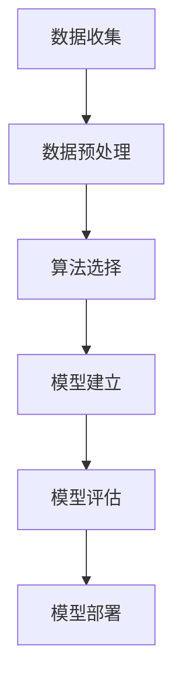

                 

关键词：数据挖掘，原理，算法，代码实例，数据分析，应用场景，未来展望

> 摘要：本文将深入探讨数据挖掘的基本原理和核心算法，通过详细讲解和代码实例，帮助读者理解数据挖掘的各个方面。同时，我们将探讨数据挖掘在实际应用场景中的重要性，以及其未来的发展趋势和面临的挑战。

## 1. 背景介绍

在当今信息爆炸的时代，数据已经成为企业和组织的重要资产。然而，如何从海量数据中提取有价值的信息和知识，成为了一个亟待解决的问题。数据挖掘（Data Mining）应运而生，它是一种通过计算机技术从大量数据中提取隐藏模式、关联规则和趋势的方法。数据挖掘技术广泛应用于各个领域，如金融、医疗、电商、社交网络等，为企业决策提供了重要的支持。

数据挖掘的过程通常包括数据预处理、数据挖掘算法选择、模型建立和评估等多个步骤。本文将围绕这些核心内容展开讨论，并结合具体的代码实例，帮助读者深入理解数据挖掘的原理和实践。

## 2. 核心概念与联系

### 2.1 数据挖掘流程

数据挖掘流程可以概括为以下步骤：

1. **数据收集**：收集相关的数据，可以是结构化数据，如关系数据库，也可以是非结构化数据，如图像、文本等。
2. **数据预处理**：清洗数据，去除噪声和缺失值，进行数据转换和归一化处理，以便后续分析。
3. **数据挖掘算法选择**：根据具体应用场景，选择合适的数据挖掘算法。
4. **模型建立**：利用数据挖掘算法对数据进行分析，建立预测模型或分类模型。
5. **模型评估**：评估模型的效果，通过交叉验证、ROC曲线等方法评估模型的准确性、召回率等指标。
6. **模型部署**：将模型部署到实际应用场景中，如实时预测、决策支持等。

### 2.2 数据挖掘算法类型

数据挖掘算法主要可以分为以下几类：

1. **关联规则挖掘**：通过发现数据中的关联规则，如“购买了A商品的用户，80%也会购买B商品”。
2. **分类算法**：根据已有数据对新的数据进行分类，如决策树、随机森林、支持向量机等。
3. **聚类算法**：将数据划分为若干个群组，如K均值聚类、层次聚类等。
4. **预测算法**：利用历史数据预测未来趋势，如时间序列分析、线性回归等。

### 2.3 Mermaid 流程图

以下是一个简化的数据挖掘流程的Mermaid流程图：



## 3. 核心算法原理 & 具体操作步骤

### 3.1 算法原理概述

数据挖掘的核心算法包括关联规则挖掘、分类算法和聚类算法等。以下将对这些算法的基本原理进行概述。

#### 3.1.1 关联规则挖掘

关联规则挖掘的目标是发现数据项之间的关联关系。基本原理包括支持度（Support）和置信度（Confidence）两个度量。

- **支持度**：表示同时包含两个数据项的样本数占总样本数的比例。
- **置信度**：表示如果A发生了，那么B也会发生的概率。

常见的关联规则挖掘算法有Apriori算法和Eclat算法。

#### 3.1.2 分类算法

分类算法的目标是将数据划分为预定义的类别。常见的分类算法包括决策树、支持向量机和随机森林等。

- **决策树**：利用特征之间的决策关系，构建一棵树来对数据进行分类。
- **支持向量机**：通过找到一个最佳的超平面，将不同类别的数据分开。
- **随机森林**：利用多个决策树的集合，通过投票的方式对数据进行分类。

#### 3.1.3 聚类算法

聚类算法的目标是将数据分为若干个群组，使得同组内的数据相似度较高，不同组的数据相似度较低。常见的聚类算法包括K均值聚类和层次聚类。

- **K均值聚类**：通过迭代的方式，逐步调整聚类中心，使聚类结果最优。
- **层次聚类**：通过递归的方式，将数据分层划分，形成层次结构。

### 3.2 算法步骤详解

以下将详细讲解关联规则挖掘算法（Apriori算法）的具体步骤。

#### 3.2.1 算法步骤

1. **生成频繁项集**：通过扫描数据库，统计每个项的支持度，过滤掉支持度低于最小支持度阈值的项。
2. **生成关联规则**：对于每个频繁项集，生成可能的关联规则，并计算其置信度。
3. **剪枝**：删除不符合最小置信度阈值的关联规则。

#### 3.2.2 代码实现

以下是一个简单的Apriori算法的Python代码实现：

```python
from collections import defaultdict

# 生成频繁项集
def generate_frequent_itemsets(data, min_support):
    itemsets = defaultdict(int)
    for transaction in data:
        for item in transaction:
            itemsets[item] += 1
    frequent_itemsets = {item for item, count in itemsets.items() if count >= min_support}
    return frequent_itemsets

# 生成关联规则
def generate_association_rules(frequent_itemsets, data, min_confidence):
    rules = []
    for itemset in frequent_itemsets:
        subsets = list(subsets(itemset))
        for subset in subsets:
            rule = (subset, itemset - subset)
            support = support(rule, data)
            confidence = confidence(rule, data)
            if confidence >= min_confidence:
                rules.append(rule)
    return rules

# 计算支持度
def support(rule, data):
    rule_support = sum(1 for transaction in data if set(rule[0]).issubset(transaction))
    return rule_support / len(data)

# 计算置信度
def confidence(rule, data):
    rule_confidence = support(rule, data)
    rule_body_support = support(rule[0], data)
    return rule_confidence / rule_body_support

# 测试数据
data = [
    [1, 3, 4],
    [2, 3],
    [1, 2, 3],
    [1, 4],
    [2, 4]
]

# 生成频繁项集
frequent_itemsets = generate_frequent_itemsets(data, 0.6)

# 生成关联规则
association_rules = generate_association_rules(frequent_itemsets, data, 0.7)

# 输出结果
print("频繁项集：", frequent_itemsets)
print("关联规则：", association_rules)
```

### 3.3 算法优缺点

#### 3.3.1 Apriori算法

**优点**：

- **简单易实现**：Apriori算法的基本思想和步骤相对简单，易于理解和实现。
- **易于扩展**：Apriori算法可以很容易地扩展到多维数据挖掘。

**缺点**：

- **效率低**：Apriori算法需要进行多次数据库扫描，随着数据规模的增大，效率会显著下降。
- **无法处理高维数据**：Apriori算法在处理高维数据时，计算量和存储需求会急剧增加。

### 3.4 算法应用领域

关联规则挖掘算法在多个领域有广泛的应用，如：

- **零售业**：分析顾客购买行为，发现潜在的市场趋势和客户偏好。
- **金融业**：发现欺诈行为、风险评估等。
- **医疗领域**：分析疾病和症状之间的关联，为疾病诊断和治疗提供支持。
- **社交网络**：分析用户行为和社交关系，发现潜在的社交群体和关系。

## 4. 数学模型和公式 & 详细讲解 & 举例说明

### 4.1 数学模型构建

数据挖掘中的数学模型通常基于概率论和统计学原理。以下是几个常见的数学模型：

#### 4.1.1 概率模型

概率模型用于描述数据项之间的关联性。常见的概率模型有条件概率、贝叶斯定理等。

- **条件概率**：P(A|B) 表示在事件B发生的条件下，事件A发生的概率。
- **贝叶斯定理**：P(A|B) = P(B|A) * P(A) / P(B)，表示在事件B发生的条件下，事件A发生的概率。

#### 4.1.2 统计模型

统计模型用于描述数据集的特征和规律。常见的统计模型有均值、方差、标准差等。

- **均值**：数据集的平均值，表示数据集的中心位置。
- **方差**：数据集的离散程度，表示数据集的分布范围。
- **标准差**：方差的平方根，用于衡量数据的稳定性。

### 4.2 公式推导过程

以下是一个简单的贝叶斯定理的推导过程：

假设有两个事件A和B，且P(B) > 0。我们想要求解在事件B发生的条件下，事件A发生的概率，即P(A|B)。

根据条件概率的定义，我们有：

P(A|B) = P(A ∩ B) / P(B)

同时，根据全概率公式，我们有：

P(A ∩ B) = P(B|A) * P(A)

将上述两个公式代入条件概率公式，得到：

P(A|B) = P(B|A) * P(A) / P(B)

这就是贝叶斯定理的推导过程。

### 4.3 案例分析与讲解

以下是一个简单的贝叶斯分类器的案例：

假设我们有一个分类任务，需要判断一个邮件是垃圾邮件还是正常邮件。已知：

- P(正常邮件) = 0.8
- P(垃圾邮件) = 0.2
- P(垃圾邮件|包含广告) = 0.9
- P(正常邮件|包含广告) = 0.1

现在，我们收到一封包含广告的邮件，需要判断它是否是垃圾邮件。

根据贝叶斯定理，我们可以计算这封邮件是垃圾邮件的概率：

P(垃圾邮件|包含广告) = P(包含广告|垃圾邮件) * P(垃圾邮件) / P(包含广告)

其中，P(包含广告)可以通过全概率公式计算：

P(包含广告) = P(包含广告|垃圾邮件) * P(垃圾邮件) + P(包含广告|正常邮件) * P(正常邮件)

代入已知数据，得到：

P(包含广告) = 0.9 * 0.2 + 0.1 * 0.8 = 0.25

因此，P(垃圾邮件|包含广告) = 0.9 * 0.2 / 0.25 = 0.72

由于P(垃圾邮件|包含广告) > P(正常邮件|包含广告)，我们可以判断这封邮件是垃圾邮件。

## 5. 项目实践：代码实例和详细解释说明

### 5.1 开发环境搭建

在本篇博客中，我们将使用Python作为主要编程语言，结合一些常用的数据挖掘库，如Pandas、NumPy、Scikit-learn等。以下是搭建开发环境的步骤：

1. 安装Python 3.x版本（推荐使用Anaconda，可以方便地管理多个Python环境）。
2. 安装必要的库：`pip install pandas numpy scikit-learn matplotlib`

### 5.2 源代码详细实现

以下是一个简单的数据挖掘项目，使用K均值聚类算法对数据进行聚类，并使用肘部法则（Elbow Method）选择合适的聚类数量。

```python
import numpy as np
import pandas as pd
from sklearn.cluster import KMeans
import matplotlib.pyplot as plt

# 读取数据
data = pd.read_csv('data.csv')  # 假设数据文件为data.csv

# 可视化数据
plt.scatter(data['feature1'], data['feature2'])
plt.xlabel('Feature 1')
plt.ylabel('Feature 2')
plt.title('Data Distribution')
plt.show()

# 应用K均值聚类
inertia = []
for i in range(1, 11):
    kmeans = KMeans(n_clusters=i, init='k-means++', max_iter=300, n_init=10, random_state=0)
    kmeans.fit(data)
    inertia.append(kmeans.inertia_)

# 可视化肘部法则
plt.plot(range(1, 11), inertia)
plt.xlabel('Number of Clusters')
plt.ylabel('Inertia')
plt.title('Elbow Method')
plt.show()

# 选择最佳聚类数量
best_clusters = np.argmax(inertia) + 1
print("最佳聚类数量：", best_clusters)

# 再次应用K均值聚类，选择最佳聚类数量
kmeans = KMeans(n_clusters=best_clusters, init='k-means++', max_iter=300, n_init=10, random_state=0)
kmeans.fit(data)

# 可视化聚类结果
plt.scatter(data['feature1'], data['feature2'], c=kmeans.labels_)
plt.xlabel('Feature 1')
plt.ylabel('Feature 2')
plt.title('Cluster Distribution')
plt.show()
```

### 5.3 代码解读与分析

上述代码实现了一个简单的K均值聚类项目，主要步骤如下：

1. **数据读取**：使用Pandas读取数据文件，并将其存储为DataFrame对象。
2. **数据可视化**：使用Matplotlib绘制数据点的散点图，以可视化数据分布。
3. **K均值聚类**：使用Scikit-learn的KMeans类，对数据进行聚类。在每次聚类过程中，计算聚类的不确定度（inertia），并将其存储在列表中。
4. **肘部法则**：使用Matplotlib绘制不确定性曲线，通过观察曲线的折点（肘部），选择最佳的聚类数量。
5. **重新聚类**：使用最佳聚类数量，重新应用K均值聚类，并绘制聚类结果。

### 5.4 运行结果展示

运行上述代码后，将得到以下结果：

1. **数据分布图**：展示原始数据的分布情况。
2. **肘部法则图**：展示不同聚类数量下的不确定性曲线，通过观察肘部选择最佳聚类数量。
3. **聚类结果图**：展示使用最佳聚类数量的聚类结果，每个聚类中心用不同颜色表示。

## 6. 实际应用场景

数据挖掘技术在各个领域都有广泛的应用。以下是一些实际应用场景：

### 6.1 零售业

- **市场细分**：通过分析顾客购买行为，发现潜在的客户群体，为市场营销提供支持。
- **推荐系统**：基于顾客购买记录，为顾客推荐相关商品，提高销售额。

### 6.2 金融业

- **欺诈检测**：通过分析交易行为，发现潜在的欺诈行为，降低风险。
- **风险评估**：利用客户的历史数据和信用记录，评估客户的信用风险。

### 6.3 医疗领域

- **疾病诊断**：通过分析患者数据和病例信息，辅助医生进行疾病诊断。
- **药物研发**：通过分析药物与疾病的关系，发现新的药物候选。

### 6.4 社交网络

- **用户行为分析**：通过分析用户在社交网络上的行为，发现潜在的用户兴趣和社交关系。
- **社区发现**：通过分析用户的社交关系，发现潜在的社交群体。

## 7. 工具和资源推荐

### 7.1 学习资源推荐

- **《数据挖掘：概念与技术》**：H. Han, M. Kamber, J. Pei著，全面介绍数据挖掘的理论和实践。
- **《机器学习》**：A. Ng著，介绍机器学习的基础知识和常用算法。
- **Kaggle**：一个提供数据集和比赛的平台，可以锻炼数据挖掘技能。

### 7.2 开发工具推荐

- **Anaconda**：一个集成了Python和数据挖掘库的环境，方便开发和部署。
- **Jupyter Notebook**：一个交互式的编程环境，方便编写和调试代码。

### 7.3 相关论文推荐

- **“Apriori Algorithm: A Perspective”**：介绍Apriori算法的基本原理和改进方法。
- **“Support Vector Machines: The Basics”**：介绍支持向量机的基本原理和应用。

## 8. 总结：未来发展趋势与挑战

### 8.1 研究成果总结

数据挖掘技术在过去几十年取得了显著的成果，涵盖了多个领域和应用场景。随着大数据和人工智能的快速发展，数据挖掘技术也在不断演进和升级。

### 8.2 未来发展趋势

- **深度学习与数据挖掘的结合**：深度学习在图像识别、语音识别等领域取得了巨大成功，未来将更多地应用于数据挖掘领域，提升模型的效果和效率。
- **实时数据挖掘**：随着物联网和实时数据的普及，实时数据挖掘技术将成为数据挖掘领域的一个重要方向。
- **数据挖掘的可解释性**：为了提高数据挖掘模型的透明度和可解释性，未来将更多地研究如何解释和可视化数据挖掘模型。

### 8.3 面临的挑战

- **数据隐私和安全**：在数据挖掘过程中，如何保护用户的隐私和数据安全是一个重要挑战。
- **数据质量和处理能力**：数据挖掘需要处理海量数据，如何在保证数据质量的同时，提高处理效率是一个重要问题。
- **跨领域融合**：如何将不同领域的数据和知识进行融合，提升数据挖掘的实用性是一个重要挑战。

### 8.4 研究展望

未来，数据挖掘技术将在以下几个方面取得突破：

- **跨领域融合**：通过跨领域的知识融合，提升数据挖掘的实用性和准确性。
- **可解释性和透明度**：提高数据挖掘模型的可解释性和透明度，使其更加可靠和可信。
- **实时性和高效性**：提高数据挖掘的实时性和效率，满足不断增长的数据量和处理需求。

## 9. 附录：常见问题与解答

### 9.1 什么是数据挖掘？

数据挖掘是一种通过计算机技术从大量数据中提取隐藏模式、关联规则和趋势的方法，旨在帮助企业和组织从海量数据中获取有价值的信息和知识。

### 9.2 数据挖掘有哪些常用的算法？

常用的数据挖掘算法包括关联规则挖掘、分类算法、聚类算法、预测算法等，如Apriori算法、K均值聚类、决策树、随机森林等。

### 9.3 数据挖掘在哪些领域有应用？

数据挖掘技术在多个领域有应用，如零售业、金融业、医疗领域、社交网络等，为企业和组织提供决策支持。

### 9.4 如何搭建数据挖掘的开发环境？

可以使用Python作为编程语言，结合Pandas、NumPy、Scikit-learn等库进行数据挖掘的开发。可以使用Anaconda作为Python环境，方便管理和安装库。

### 9.5 数据挖掘的前景如何？

数据挖掘技术在未来将继续发展，特别是在深度学习、实时数据挖掘、跨领域融合等方面有广阔的应用前景。同时，如何保护数据隐私、提高模型可解释性和透明度也将是未来的重要研究方向。

### 9.6 数据挖掘项目如何进行？

数据挖掘项目通常包括数据收集、数据预处理、算法选择、模型建立、模型评估等步骤。每个步骤都需要仔细设计和执行，以确保项目的成功。

作者：禅与计算机程序设计艺术 / Zen and the Art of Computer Programming
----------------------------------------------------------------

这篇文章深入探讨了数据挖掘的基本原理、核心算法、实践案例，并结合实际应用场景和未来发展趋势进行了分析。通过详细讲解和代码实例，帮助读者全面理解数据挖掘的各个方面。希望这篇文章能够为读者在数据挖掘领域提供有价值的参考和启示。

