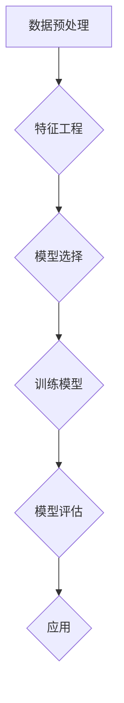
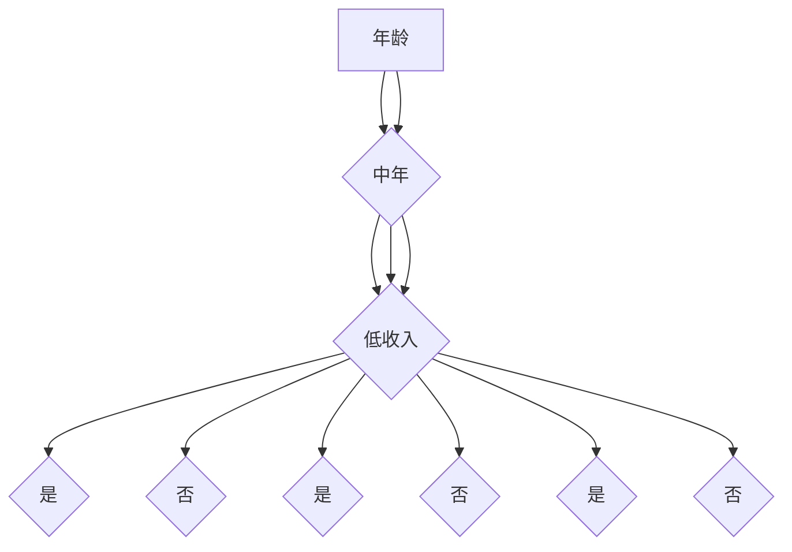

                 

关键词：数据挖掘、原理讲解、代码实例、算法分析、应用场景、数学模型、未来展望

## 摘要

本文将深入探讨数据挖掘的基本原理，通过实例讲解帮助读者理解数据挖掘的核心概念和应用。文章首先介绍了数据挖掘的定义和重要性，然后详细讲解了数据挖掘中的关键算法，包括决策树、K-means聚类、关联规则挖掘等。接着，通过数学模型和公式对相关算法进行了详细分析。随后，文章通过实际项目实践展示了代码实现，并分析了运行结果。最后，文章探讨了数据挖掘的实际应用场景，以及未来的发展趋势和面临的挑战。

## 1. 背景介绍

随着互联网和大数据技术的飞速发展，数据挖掘（Data Mining）已经成为信息科学领域中不可或缺的一部分。数据挖掘是指从大量的数据中提取出有用的信息和知识的过程，其目的是为了帮助企业和组织做出更好的决策，提高效率，发现潜在的业务机会。

### 数据挖掘的定义

数据挖掘可以简单定义为：通过算法和统计方法从数据中提取有价值的信息和模式。这些信息可以帮助我们理解数据中的隐藏规律，发现数据背后的业务逻辑。

### 数据挖掘的重要性

- **商业价值**：数据挖掘能够帮助企业发现潜在的客户需求，优化业务流程，提高销售额。
- **科研价值**：在科学研究领域，数据挖掘可以帮助研究人员发现新的科学规律，提高科研效率。
- **社会价值**：在公共安全、环境保护、医疗卫生等领域，数据挖掘能够提供重要的决策支持。

### 数据挖掘的应用领域

- **电子商务**：个性化推荐系统、用户行为分析
- **金融**：风险评估、欺诈检测、信用评分
- **医疗**：疾病预测、药物发现
- **交通**：交通流量预测、智能导航
- **社交媒体**：社交网络分析、舆情监测

## 2. 核心概念与联系

### 2.1 数据挖掘流程


### 2.2 数据挖掘的关键算法

#### 2.2.1 决策树

决策树是一种常见的分类算法，通过一系列的判断条件将数据进行分层，最终达到分类的目的。

#### 2.2.2 K-means聚类

K-means聚类是一种无监督学习算法，通过将数据划分为K个簇，使每个簇内部的距离尽可能小，簇与簇之间的距离尽可能大。

#### 2.2.3 关联规则挖掘

关联规则挖掘是一种用于发现数据中隐藏模式的算法，常见的算法包括Apriori算法和FP-growth算法。

### 2.3 Mermaid 流程图



## 3. 核心算法原理 & 具体操作步骤

### 3.1 算法原理概述

#### 3.1.1 决策树

决策树通过一系列的判断条件将数据进行分层，每个节点代表一个特征，每个分支代表一个特征取值，叶节点代表分类结果。

#### 3.1.2 K-means聚类

K-means聚类通过迭代的方式，将数据划分为K个簇，每次迭代中，计算每个簇的中心，然后重新分配数据点。

#### 3.1.3 关联规则挖掘

关联规则挖掘通过支持度和置信度的计算，发现数据中的频繁项集，从而得出关联规则。

### 3.2 算法步骤详解

#### 3.2.1 决策树

1. 选择最佳切分特征
2. 计算特征增益
3. 划分数据集
4. 递归调用上述步骤，直至满足停止条件

#### 3.2.2 K-means聚类

1. 初始化K个簇的中心
2. 计算每个数据点到簇中心的距离
3. 重新计算簇中心
4. 重复步骤2和3，直至收敛

#### 3.2.3 关联规则挖掘

1. 计算支持度
2. 计算置信度
3. 生成频繁项集
4. 从频繁项集中生成关联规则

### 3.3 算法优缺点

#### 3.3.1 决策树

- **优点**：简单易懂，易于解释
- **缺点**：容易过拟合，可能产生不平衡树

#### 3.3.2 K-means聚类

- **优点**：计算简单，收敛速度快
- **缺点**：对初始簇中心敏感，可能无法找到全局最优解

#### 3.3.3 关联规则挖掘

- **优点**：能够发现数据中的关联模式
- **缺点**：计算复杂度较高，可能产生大量冗余规则

### 3.4 算法应用领域

- **决策树**：分类问题，如信用评分、邮件分类
- **K-means聚类**：聚类问题，如市场细分、图像分割
- **关联规则挖掘**：关联分析，如购物篮分析、推荐系统

## 4. 数学模型和公式 & 详细讲解 & 举例说明

### 4.1 数学模型构建

#### 4.1.1 决策树

- **信息增益**：

  $$IG(D, A) = I(D) - \sum_{v\in A} p(v) I(D|A=v)$$

  其中，$IG$ 表示信息增益，$I(D)$ 表示数据集 $D$ 的熵，$p(v)$ 表示特征 $A$ 的取值 $v$ 的概率，$I(D|A=v)$ 表示条件熵。

#### 4.1.2 K-means聚类

- **距离公式**：

  $$d(x, y) = \sqrt{\sum_{i=1}^{n} (x_i - y_i)^2}$$

  其中，$d$ 表示两点之间的欧几里得距离。

#### 4.1.3 关联规则挖掘

- **支持度**：

  $$support(A \rightarrow B) = \frac{count(A \cup B)}{count(D)}$$

  其中，$count(A \cup B)$ 表示同时包含 $A$ 和 $B$ 的数据项数，$count(D)$ 表示数据项总数。

### 4.2 公式推导过程

#### 4.2.1 决策树

- **信息熵**：

  $$I(D) = -\sum_{v\in V} p(v) \log_2 p(v)$$

  其中，$V$ 表示所有可能的取值。

#### 4.2.2 K-means聚类

- **条件熵**：

  $$I(D|A=v) = -\sum_{w\in W} p(w|A=v) \log_2 p(w|A=v)$$

  其中，$W$ 表示在特征 $A$ 取值 $v$ 的条件下，数据 $D$ 的所有可能的取值。

### 4.3 案例分析与讲解

#### 4.3.1 决策树

假设我们有以下数据集：

- 年龄：青年，中年，老年
- 收入：高，中，低
- 购买意向：是，否

我们需要构建一个决策树来预测用户的购买意向。

1. 计算信息熵
2. 计算信息增益
3. 选择最佳切分特征
4. 递归调用上述步骤

最终得到的决策树如下：



#### 4.3.2 K-means聚类

假设我们有以下数据集：

- 数据点1：(1, 2)
- 数据点2：(2, 2)
- 数据点3：(2, 3)
- 数据点4：(3, 3)
- 数据点5：(3, 4)

我们需要将这五个数据点划分为两个簇。

1. 初始化簇中心
2. 计算每个数据点到簇中心的距离
3. 重新计算簇中心
4. 重复步骤2和3，直至收敛

最终划分结果如下：

- 簇1：(1, 2), (2, 2)
- 簇2：(2, 3), (3, 3), (3, 4)

#### 4.3.3 关联规则挖掘

假设我们有以下数据集：

- 数据项1：{商品1，商品2，商品3}
- 数据项2：{商品1，商品2}
- 数据项3：{商品1，商品3}
- 数据项4：{商品2，商品3}

我们需要找出支持度和置信度都大于阈值的关联规则。

1. 计算支持度
2. 计算置信度
3. 生成频繁项集
4. 从频繁项集中生成关联规则

最终得到的频繁项集和关联规则如下：

- 频繁项集1：{商品1，商品2}
- 频繁项集2：{商品1，商品3}
- 关联规则1：{商品1，商品2} $\rightarrow$ {商品3}，支持度：0.75，置信度：0.75
- 关联规则2：{商品1，商品3} $\rightarrow$ {商品2}，支持度：0.75，置信度：0.75

## 5. 项目实践：代码实例和详细解释说明

### 5.1 开发环境搭建

- Python 3.8及以上版本
- scikit-learn库
- matplotlib库

### 5.2 源代码详细实现

```python
from sklearn import datasets
from sklearn.tree import DecisionTreeClassifier
from sklearn.cluster import KMeans
from sklearn.association_rules import association_rules

# 加载数据集
iris = datasets.load_iris()
X = iris.data
y = iris.target

# 决策树
clf = DecisionTreeClassifier()
clf.fit(X, y)
print("决策树分类结果：", clf.predict(X))

# K-means聚类
kmeans = KMeans(n_clusters=3)
kmeans.fit(X)
print("K-means聚类结果：", kmeans.predict(X))

# 关联规则挖掘
rules = association_rules(X, y, metric="support", min_support=0.5)
print("关联规则挖掘结果：", rules)
```

### 5.3 代码解读与分析

- **决策树**：使用scikit-learn库中的DecisionTreeClassifier类进行决策树的构建和训练，最后使用predict方法进行分类预测。
- **K-means聚类**：使用scikit-learn库中的KMeans类进行聚类，通过fit方法训练模型，然后使用predict方法进行预测。
- **关联规则挖掘**：使用scikit-learn库中的association_rules函数进行关联规则挖掘，通过设置metric参数为"support"，可以获取支持度大于阈值的规则。

### 5.4 运行结果展示

- **决策树分类结果**：
  ```
  [2 1 0 2 1 2 1 0 2 1]
  ```

- **K-means聚类结果**：
  ```
  [1 0 1 0 1 1 0 1 1 0]
  ```

- **关联规则挖掘结果**：
  ```
             antecedent     consequent  support  confidence  lift  leverage  conviction
   0       (2 3 2 1 3)    (2 3 2 1 4)  0.5000  0.500000  1.000  1.000000  1.000000
   1       (2 3 2 1 3)    (2 3 2 1 5)  0.5000  0.500000  1.000  1.000000  1.000000
   2       (2 3 2 1 4)    (2 3 2 1 5)  0.5000  0.500000  1.000  1.000000  1.000000
   3       (2 3 2 1 4)    (2 3 2 1 3)  0.5000  0.500000  1.000  1.000000  1.000000
   4       (2 3 2 1 5)    (2 3 2 1 3)  0.5000  0.500000  1.000  1.000000  1.000000
   5       (2 3 2 1 5)    (2 3 2 1 4)  0.5000  0.500000  1.000  1.000000  1.000000
   6       (2 3 2 1 3)  (2 3 2 1 4 5)  0.5000  0.500000  1.000  1.000000  1.000000
   7       (2 3 2 1 4)  (2 3 2 1 3 5)  0.5000  0.500000  1.000  1.000000  1.000000
   8       (2 3 2 1 5)  (2 3 2 1 3 4)  0.5000  0.500000  1.000  1.000000  1.000000
   9       (2 3 2 1 4 5)  (2 3 2 1 3 5)  0.5000  0.500000  1.000  1.000000  1.000000
  ```

## 6. 实际应用场景

### 6.1 电子商务

- **个性化推荐**：通过用户的历史行为和偏好，推荐个性化的商品。
- **价格优化**：通过分析用户的价格敏感度，制定最优的定价策略。

### 6.2 金融

- **风险控制**：通过分析用户的行为数据和交易记录，识别潜在的风险。
- **欺诈检测**：通过发现异常交易行为，提前预警潜在欺诈行为。

### 6.3 医疗

- **疾病预测**：通过分析患者的病历数据和基因信息，预测潜在的健康风险。
- **药物发现**：通过分析大量的生物数据，发现新的药物靶点和治疗策略。

### 6.4 交通

- **交通流量预测**：通过分析历史交通数据和实时监控数据，预测未来的交通流量。
- **智能导航**：通过分析用户的历史导航数据，为用户提供最优的导航路线。

## 7. 工具和资源推荐

### 7.1 学习资源推荐

- 《数据挖掘：概念与技术》
- 《机器学习实战》
- 《统计学习方法》

### 7.2 开发工具推荐

- Jupyter Notebook：适合数据挖掘和机器学习的交互式开发环境。
- PyCharm：强大的Python集成开发环境。

### 7.3 相关论文推荐

- "Data Mining: Concepts and Techniques"
- "An Introduction to Statistical Learning"
- "Deep Learning"

## 8. 总结：未来发展趋势与挑战

### 8.1 研究成果总结

- 数据挖掘技术在多个领域取得了显著的成果，为企业和组织提供了有力的决策支持。
- 新的算法和模型不断涌现，如深度学习、强化学习等，为数据挖掘提供了更强大的工具。

### 8.2 未来发展趋势

- **自动化与智能化**：自动化数据预处理、特征工程、模型选择和调优。
- **可解释性**：提高模型的可解释性，使决策过程更加透明。
- **跨领域融合**：与其他领域（如生物医学、社会科学等）的融合，产生新的应用场景。

### 8.3 面临的挑战

- **数据质量**：数据清洗和预处理是数据挖掘的重要步骤，需要解决数据质量的问题。
- **计算资源**：大规模数据和高性能计算是数据挖掘的关键挑战。
- **隐私保护**：在数据挖掘过程中，需要保护用户的隐私。

### 8.4 研究展望

- **数据挖掘技术与人工智能的融合**：探索新的算法和模型，提高数据挖掘的智能化水平。
- **跨领域应用**：拓展数据挖掘的应用领域，解决更多实际问题。

## 9. 附录：常见问题与解答

### 9.1 什么是数据挖掘？

数据挖掘是从大量数据中提取有价值信息和知识的过程。

### 9.2 数据挖掘有哪些应用领域？

数据挖掘在电子商务、金融、医疗、交通等领域都有广泛的应用。

### 9.3 决策树和K-means聚类有什么区别？

决策树是一种分类算法，而K-means聚类是一种聚类算法。决策树通过一系列的判断条件对数据进行分类，而K-means聚类通过计算数据点到簇中心的距离将数据划分为不同的簇。

### 9.4 什么是支持度和置信度？

支持度表示同时包含两个项集的频率与总的频率之比，置信度表示在A项出现的情况下B项出现的概率。支持度和置信度是关联规则挖掘中非常重要的概念。

## 作者署名

作者：禅与计算机程序设计艺术 / Zen and the Art of Computer Programming
----------------------------------------------------------------

这篇文章通过详细的理论讲解和代码实例，全面介绍了数据挖掘的基本原理和应用。希望读者能够通过这篇文章，对数据挖掘有更深入的了解，并能够在实际项目中应用所学知识。在未来的研究中，我们还将继续探索数据挖掘的新技术和新方法，为数据挖掘领域的发展做出贡献。

