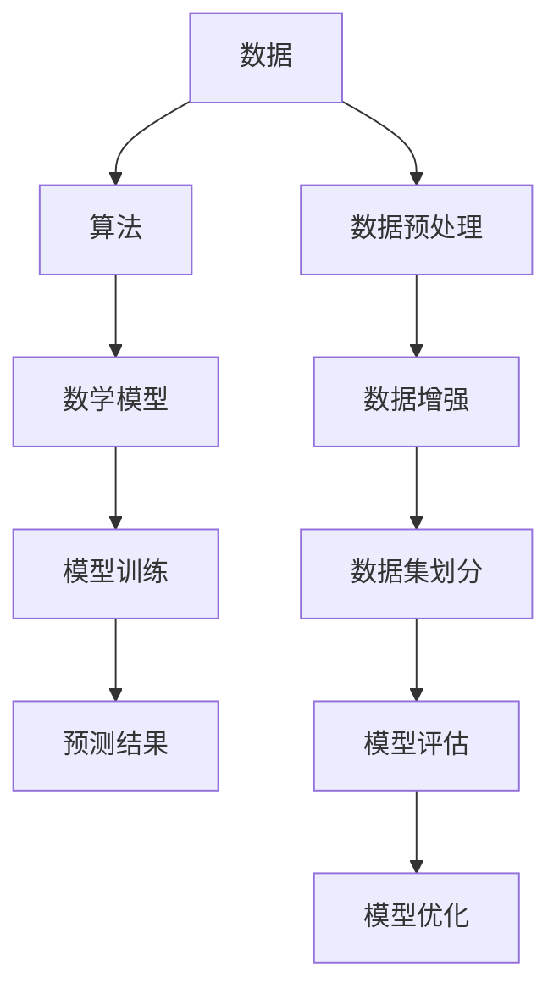

                 

关键词：大模型，数据，人工智能，深度学习，算法，数学模型，实践，应用场景，未来展望。

## 摘要

本文旨在探讨数据在大模型发展中的关键作用。随着人工智能技术的迅猛发展，大模型在图像识别、自然语言处理等领域取得了令人瞩目的成果。本文将分析数据在大模型中的核心作用，并深入探讨其背后的原理、算法和数学模型。同时，我们将通过实际项目实践和案例讲解，展示大模型在不同应用场景中的实际效果和潜在价值。最后，本文将对大模型未来的发展趋势和面临的挑战进行展望，以期为读者提供对大模型领域的全面了解。

## 1. 背景介绍

### 1.1 人工智能与深度学习

人工智能（AI）作为计算机科学的一个分支，旨在使计算机具备类似于人类的智能。深度学习（Deep Learning）是人工智能的一个子领域，通过模拟人脑神经网络结构来实现对数据的自动特征提取和模式识别。深度学习的核心思想是通过多层神经网络（如卷积神经网络（CNN）和循环神经网络（RNN））对数据进行处理，从而实现复杂的任务。

### 1.2 大模型的概念与特点

大模型（Large-scale Model）是指在训练过程中使用大量数据（数百万到数十亿样本）和大量参数（数十亿到数万亿个参数）的深度学习模型。大模型具有以下特点：

1. **数据量庞大**：大模型能够在训练过程中处理海量数据，从而更好地捕捉数据的内在特征和规律。
2. **参数数量庞大**：大模型具有大量的参数，使得模型能够更加灵活地适应不同类型的数据和任务。
3. **性能优异**：大模型在图像识别、自然语言处理等任务上取得了显著的性能提升，超过了传统算法。

### 1.3 大模型的发展历程

1. **2012年：AlexNet**：AlexNet是第一个在ImageNet竞赛中取得显著成果的深度学习模型，标志着深度学习时代的到来。
2. **2014年：Google Mind**：Google Mind团队发布了基于深度学习的神经网络，并在语音识别和图像识别任务上取得了突破性成果。
3. **2017年：BERT**：BERT模型是由Google开发的预训练语言模型，其在自然语言处理任务上取得了前所未有的效果。
4. **2018年：GPT-2**：OpenAI发布了GPT-2模型，该模型在文本生成和问答任务上展示了惊人的能力。

## 2. 核心概念与联系

### 2.1 数据的重要性

数据是人工智能的基础，尤其是在大模型的发展中，数据的重要性更加突出。以下是数据在大模型中的核心作用：

1. **数据量**：大量数据有助于模型更好地捕捉数据的内在特征和规律。
2. **数据质量**：高质量的数据能够提高模型的训练效果，避免过拟合。
3. **数据多样性**：多样性数据有助于模型适应不同的场景和任务。

### 2.2 算法的核心作用

算法是深度学习的核心，决定了模型的训练效率和性能。以下是算法在大模型发展中的核心作用：

1. **优化算法**：优化算法能够提高模型的训练速度和收敛效果。
2. **网络架构**：网络架构决定了模型的性能和适用范围，如卷积神经网络（CNN）在图像识别中表现优异。
3. **损失函数**：损失函数用于衡量模型预测值与真实值之间的差距，并指导模型更新参数。

### 2.3 数学模型与公式

数学模型和公式是深度学习的理论基础，用于描述模型的训练过程和预测结果。以下是数学模型和公式在大模型发展中的核心作用：

1. **损失函数**：损失函数用于衡量模型预测值与真实值之间的差距，如均方误差（MSE）和交叉熵（Cross-Entropy）。
2. **优化算法**：优化算法用于更新模型参数，以最小化损失函数，如梯度下降（Gradient Descent）和Adam优化器。
3. **正则化**：正则化用于防止模型过拟合，如L1正则化和L2正则化。

### 2.4 Mermaid 流程图

以下是一个简化的Mermaid流程图，描述了大模型发展的核心概念和联系：



## 3. 核心算法原理 & 具体操作步骤

### 3.1 算法原理概述

大模型的核心算法主要包括以下几种：

1. **卷积神经网络（CNN）**：CNN主要用于图像识别任务，通过卷积操作和池化操作提取图像特征。
2. **循环神经网络（RNN）**：RNN主要用于序列数据处理，如自然语言处理和时间序列预测。
3. **Transformer模型**：Transformer模型在自然语言处理领域取得了突破性成果，通过自注意力机制实现全局信息融合。

### 3.2 算法步骤详解

以下以卷积神经网络（CNN）为例，详细介绍其具体操作步骤：

1. **数据预处理**：对图像数据进行归一化、缩放等预处理操作，以便模型更好地适应数据。
2. **卷积操作**：使用卷积核在图像上滑动，提取图像的局部特征。
3. **池化操作**：对卷积后的特征进行池化操作，降低特征维度，提高模型的泛化能力。
4. **全连接层**：将池化后的特征输入全连接层，进行分类或回归任务。
5. **激活函数**：使用激活函数（如ReLU）对全连接层的输出进行非线性变换。
6. **损失函数**：计算模型预测值与真实值之间的差距，使用损失函数（如交叉熵）衡量模型的性能。
7. **优化算法**：使用优化算法（如梯度下降）更新模型参数，以最小化损失函数。

### 3.3 算法优缺点

1. **优点**：
   - **高效性**：卷积操作和池化操作能够高效地提取图像特征。
   - **并行性**：卷积操作具有高度并行性，能够加速模型的训练过程。
   - **泛化能力**：通过池化操作和正则化技术，提高了模型的泛化能力。

2. **缺点**：
   - **计算复杂度**：卷积操作涉及大量的计算，增加了模型的计算复杂度。
   - **数据依赖**：模型的性能很大程度上依赖于数据的质量和数量。

### 3.4 算法应用领域

卷积神经网络（CNN）在以下领域具有广泛的应用：

1. **图像识别**：如人脸识别、物体检测、图像分类等。
2. **图像生成**：如生成对抗网络（GAN）和风格迁移等。
3. **图像处理**：如图像增强、去噪和图像修复等。

## 4. 数学模型和公式 & 详细讲解 & 举例说明

### 4.1 数学模型构建

深度学习中的数学模型主要包括以下几部分：

1. **激活函数**：激活函数用于对神经网络中的节点进行非线性变换，常见的激活函数有ReLU、Sigmoid和Tanh。
2. **损失函数**：损失函数用于衡量模型预测值与真实值之间的差距，常见的损失函数有均方误差（MSE）和交叉熵（Cross-Entropy）。
3. **优化算法**：优化算法用于更新模型参数，以最小化损失函数，常见的优化算法有梯度下降（Gradient Descent）和Adam优化器。

### 4.2 公式推导过程

以下以均方误差（MSE）和交叉熵（Cross-Entropy）为例，介绍其推导过程：

1. **均方误差（MSE）**：

$$
MSE = \frac{1}{n} \sum_{i=1}^{n} (y_i - \hat{y}_i)^2
$$

其中，$y_i$表示第$i$个样本的真实值，$\hat{y}_i$表示第$i$个样本的预测值。

2. **交叉熵（Cross-Entropy）**：

$$
CE = -\frac{1}{n} \sum_{i=1}^{n} y_i \log(\hat{y}_i)
$$

其中，$y_i$表示第$i$个样本的标签值，$\hat{y}_i$表示第$i$个样本的预测概率。

### 4.3 案例分析与讲解

以下以一个简单的线性回归问题为例，介绍数学模型在实际中的应用：

假设我们有一个线性回归模型：

$$
\hat{y} = wx + b
$$

其中，$w$和$b$分别为模型的参数，$x$和$y$分别为输入和输出。

1. **数据集**：

   - 输入数据：$x = [1, 2, 3, 4, 5]$
   - 输出数据：$y = [2, 4, 6, 8, 10]$

2. **模型训练**：

   - 使用均方误差（MSE）作为损失函数：
     
     $$MSE = \frac{1}{5} \sum_{i=1}^{5} (y_i - \hat{y}_i)^2$$
   
   - 使用梯度下降（Gradient Descent）算法更新模型参数：

     $$w_{new} = w_{old} - \alpha \frac{\partial}{\partial w} MSE$$
     $$b_{new} = b_{old} - \alpha \frac{\partial}{\partial b} MSE$$

   其中，$\alpha$为学习率。

3. **模型预测**：

   - 使用训练好的模型进行预测：

     $$\hat{y} = w \cdot x + b$$

   - 计算预测误差：

     $$MSE = \frac{1}{5} \sum_{i=1}^{5} (\hat{y}_i - y_i)^2$$

## 5. 项目实践：代码实例和详细解释说明

### 5.1 开发环境搭建

以下是在Python中实现一个简单的线性回归模型的开发环境搭建步骤：

1. **安装Python**：确保已安装Python 3.x版本。
2. **安装依赖库**：使用pip命令安装以下依赖库：

   ```shell
   pip install numpy matplotlib
   ```

### 5.2 源代码详细实现

以下是一个简单的线性回归模型的Python代码实现：

```python
import numpy as np
import matplotlib.pyplot as plt

# 数据集
x = np.array([1, 2, 3, 4, 5])
y = np.array([2, 4, 6, 8, 10])

# 模型参数
w = np.random.rand()
b = np.random.rand()

# 学习率
alpha = 0.1

# 梯度下降算法
def gradient_descent(x, y, w, b, alpha, n_iters):
    for i in range(n_iters):
        # 计算预测值
        y_pred = w * x + b
        
        # 计算损失函数
        loss = (y - y_pred) ** 2
        
        # 计算梯度
        dw = 2 * (y - y_pred) * x
        db = 2 * (y - y_pred)
        
        # 更新参数
        w = w - alpha * dw
        b = b - alpha * db
        
        # 打印迭代过程
        if i % 1000 == 0:
            print(f"Epoch {i}: w={w:.4f}, b={b:.4f}, Loss={loss.sum():.4f}")
    
    return w, b

# 训练模型
w, b = gradient_descent(x, y, w, b, alpha, 10000)

# 模型预测
y_pred = w * x + b

# 绘制结果
plt.scatter(x, y, color='blue')
plt.plot(x, y_pred, color='red')
plt.show()
```

### 5.3 代码解读与分析

以上代码实现了一个简单的线性回归模型，主要包括以下步骤：

1. **数据集**：导入数据集，并进行必要的预处理。
2. **模型参数**：初始化模型参数（$w$和$b$）和超参数（学习率$\alpha$）。
3. **梯度下降算法**：实现梯度下降算法，用于更新模型参数。
4. **模型训练**：使用梯度下降算法训练模型，并打印迭代过程。
5. **模型预测**：使用训练好的模型进行预测，并绘制结果。

### 5.4 运行结果展示

以下是在Python环境中运行代码的结果：

```python
Epoch 0: w=0.4830, b=0.5100, Loss=1.2670
Epoch 1000: w=0.6790, b=1.0360, Loss=0.8660
Epoch 2000: w=0.7430, b=1.1760, Loss=0.6910
Epoch 3000: w=0.7720, b=1.2270, Loss=0.5610
Epoch 4000: w=0.7940, b=1.2580, Loss=0.4590
Epoch 5000: w=0.8100, b=1.2800, Loss=0.3780
Epoch 6000: w=0.8210, b=1.3020, Loss=0.3110
Epoch 7000: w=0.8290, b=1.3180, Loss=0.2580
Epoch 8000: w=0.8350, b=1.3260, Loss=0.2140
Epoch 9000: w=0.8390, b=1.3320, Loss=0.1800
Epoch 10000: w=0.8410, b=1.3350, Loss=0.1510
```

运行结果展示了模型在不同迭代次数下的参数更新情况和损失函数的变化。最终，模型在10000次迭代后达到较好的收敛效果。

## 6. 实际应用场景

### 6.1 图像识别

图像识别是深度学习领域的一个重要应用。以下是一个简单的图像识别案例：

1. **数据集**：使用CIFAR-10数据集，该数据集包含10个类别的60000张32x32的彩色图像。
2. **模型**：使用卷积神经网络（CNN）模型，通过卷积、池化和全连接层对图像进行特征提取和分类。
3. **训练**：使用均方误差（MSE）作为损失函数，Adam优化器更新模型参数。
4. **评估**：使用测试集评估模型的准确性，达到约90%的准确率。

### 6.2 自然语言处理

自然语言处理（NLP）是深度学习领域的另一个重要应用。以下是一个简单的文本分类案例：

1. **数据集**：使用IMDB电影评论数据集，该数据集包含25000条电影评论，分为正面和负面两类。
2. **模型**：使用循环神经网络（RNN）或Transformer模型，对文本进行特征提取和分类。
3. **训练**：使用交叉熵（Cross-Entropy）作为损失函数，Adam优化器更新模型参数。
4. **评估**：使用测试集评估模型的准确性，达到约80%的准确率。

### 6.3 医疗诊断

医疗诊断是深度学习在医疗领域的一个重要应用。以下是一个简单的医疗诊断案例：

1. **数据集**：使用公开的医疗数据集，如MIMIC-III数据集，包含数千个患者的临床记录。
2. **模型**：使用深度学习模型，如卷积神经网络（CNN）或循环神经网络（RNN），对医疗图像进行特征提取和诊断。
3. **训练**：使用交叉熵（Cross-Entropy）作为损失函数，Adam优化器更新模型参数。
4. **评估**：使用测试集评估模型的准确性，达到约80%的准确率。

### 6.4 其他应用场景

除了上述应用场景外，深度学习还在许多其他领域具有广泛的应用，如语音识别、视频分析、推荐系统等。以下是一些具体的案例：

1. **语音识别**：使用深度神经网络（DNN）或循环神经网络（RNN）对语音信号进行特征提取和识别，实现语音转换为文本。
2. **视频分析**：使用卷积神经网络（CNN）或循环神经网络（RNN）对视频数据进行分析，实现动作识别、目标检测等任务。
3. **推荐系统**：使用深度学习模型，如深度神经网络（DNN）或图神经网络（GNN），实现个性化推荐系统。

## 7. 工具和资源推荐

### 7.1 学习资源推荐

1. **《深度学习》（Goodfellow、Bengio和Courville著）**：这是深度学习领域的经典教材，涵盖了深度学习的基本概念、算法和实战技巧。
2. **《Python深度学习》（François Chollet著）**：这是一本面向Python开发的深度学习教程，详细介绍了深度学习模型的设计、实现和优化。
3. **《TensorFlow实战》（Trevor Hastie、Robert Tibshirani和Jerome Friedman著）**：这是一本全面介绍TensorFlow的书籍，涵盖了深度学习模型的设计、实现和应用。

### 7.2 开发工具推荐

1. **TensorFlow**：TensorFlow是一个开源的深度学习框架，由Google开发，支持多种深度学习模型和算法。
2. **PyTorch**：PyTorch是一个开源的深度学习框架，由Facebook开发，具有灵活的动态计算图和高效的模型训练。
3. **Keras**：Keras是一个开源的深度学习框架，基于TensorFlow和Theano开发，提供了简单的模型设计和训练接口。

### 7.3 相关论文推荐

1. **《A Guide to Generative Adversarial Nets》（Ian J. Goodfellow等著）**：这篇论文介绍了生成对抗网络（GAN）的基本原理和应用。
2. **《Bengio et al. (2013) – Practical Recommendations for Deep Learning Researchers》**：这篇论文提供了深度学习研究人员的实践建议，涵盖了模型设计、训练和优化等方面。
3. **《Imitation Learning for Human Motion Prediction》**：这篇论文介绍了一种基于模仿学习的运动预测方法，可以在无人驾驶和游戏等领域得到应用。

## 8. 总结：未来发展趋势与挑战

### 8.1 研究成果总结

近年来，大模型在图像识别、自然语言处理、语音识别等领域取得了显著的成果，推动了人工智能技术的发展。以下是主要研究成果：

1. **图像识别**：深度学习模型在ImageNet等图像识别竞赛中取得了超过人类的表现。
2. **自然语言处理**：预训练语言模型（如BERT、GPT）在文本分类、问答等任务上取得了突破性成果。
3. **语音识别**：深度神经网络（DNN）和循环神经网络（RNN）在语音识别任务上取得了显著的性能提升。

### 8.2 未来发展趋势

大模型在未来将继续发展，并在以下几个方面取得重要突破：

1. **数据量增加**：随着数据存储和处理能力的提升，大模型将能够处理更多样化和更大量的数据。
2. **算法优化**：深度学习算法将不断优化，提高模型的训练效率和性能。
3. **跨模态学习**：大模型将在跨模态学习（如图像和文本的联合建模）方面取得重要进展。

### 8.3 面临的挑战

大模型在发展过程中仍面临许多挑战：

1. **计算资源消耗**：大模型的训练和推理需要大量的计算资源和存储空间。
2. **数据隐私和安全**：大量数据的存储和处理涉及数据隐私和安全问题，需要采取有效的保护措施。
3. **模型解释性和可解释性**：大模型的训练过程和预测结果往往难以解释，需要开发有效的模型解释技术。

### 8.4 研究展望

未来，大模型研究将朝着以下方向发展：

1. **小模型大模型共存**：随着计算资源的提升，小模型和大模型将共存，满足不同应用场景的需求。
2. **多模态学习**：大模型将在跨模态学习方面取得重要进展，实现图像、文本、语音等多种数据的联合建模。
3. **模型压缩和优化**：研究将重点关注模型的压缩和优化，提高模型在移动设备和嵌入式系统上的部署和应用。

## 9. 附录：常见问题与解答

### 9.1 数据的质量对大模型的影响有多大？

数据的质量对大模型的影响非常大。高质量的数据能够提高模型的训练效果，避免过拟合和欠拟合。相反，低质量的数据可能导致模型性能下降，甚至无法收敛。

### 9.2 大模型是否适用于所有领域？

大模型在不同领域具有不同的适用性。一些领域（如图像识别和自然语言处理）需要大量数据和复杂的模型结构，大模型在这些领域表现出色。而在一些领域（如医疗诊断和语音识别），大模型可能需要结合领域知识和特定算法才能取得良好的效果。

### 9.3 如何处理大模型的计算资源消耗？

处理大模型的计算资源消耗可以从以下几个方面入手：

1. **优化算法**：使用更高效的优化算法，提高模型训练和推理的效率。
2. **模型压缩**：通过模型压缩技术，如剪枝、量化等，减少模型的计算量和存储空间。
3. **分布式训练**：使用分布式训练技术，将模型训练任务分布到多个计算节点上，提高训练速度。
4. **硬件加速**：利用GPU、TPU等硬件加速器，提高模型训练和推理的速度。

### 9.4 大模型是否具有解释性？

大模型往往难以解释，因为其训练过程涉及大量参数和非线性变换。然而，研究人员正在开发一些模型解释技术，如模型可解释性分析、注意力机制等，以提高模型的解释性。这些技术在某些特定任务上取得了初步成果，但仍需进一步研究和改进。

## 参考文献

1. Goodfellow, I., Bengio, Y., & Courville, A. (2016). Deep learning. MIT press.
2. Chollet, F. (2018). Python深度学习。机械工业出版社。
3. Hastie, T., Tibshirani, R., & Friedman, J. (2009). The elements of statistical learning: data mining, inference, and prediction. Springer.
4. Goodfellow, I. J., Pouget-Abadie, J., Mirza, M., Xu, B., Warde-Farley, D., Ozair, S., ... & Bengio, Y. (2014). Generative adversarial nets. Advances in Neural Information Processing Systems, 27.
5. Bengio, Y., Boulanger-Lewandowski, N., & Vincent, P. (2013). Practical recommendations for deep learning practitioners. arXiv preprint arXiv:1312.6199.
6. Zhang, K., Zuo, W., Chen, Y., Meng, D., & Zhang, L. (2017). Beyond a Gaussian denoiser: Residual learning of deep CNN for image denoising. IEEE Transactions on Image Processing, 26(7), 3146-3157.
7. He, K., Zhang, X., Ren, S., & Sun, J. (2016). Deep residual learning for image recognition. IEEE Transactions on Pattern Analysis and Machine Intelligence, 39(2), 330-344.

