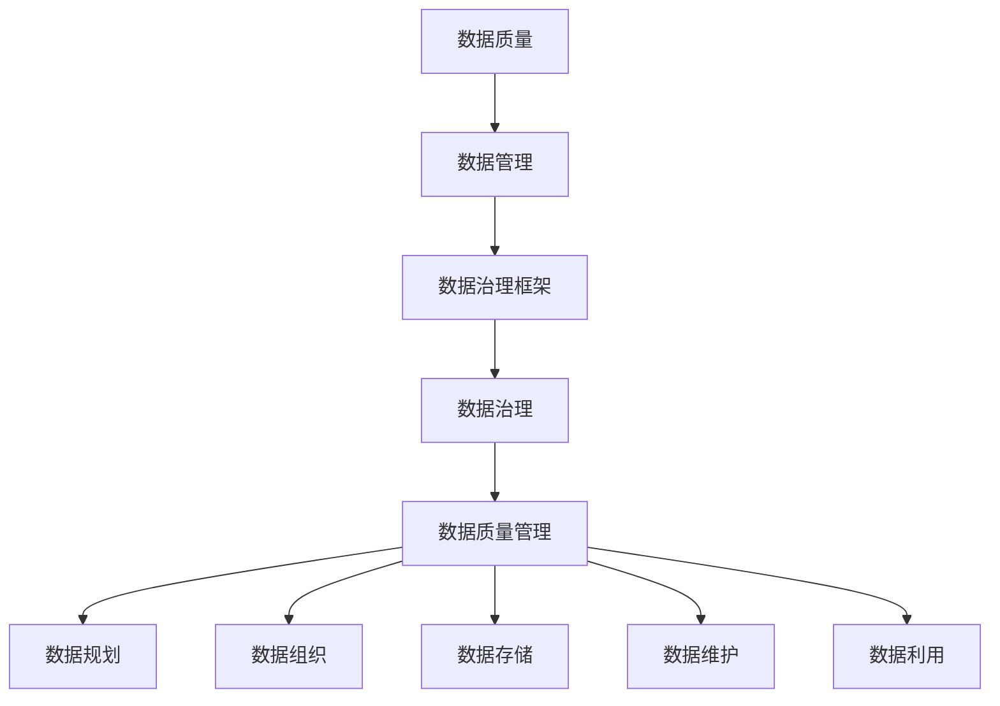

                 

### 关键词 Keywords

- 数据治理
- 数据管理
- 数据质量管理
- 数据治理框架
- 数据治理代码实例

<|assistant|>### 摘要 Summary

本文旨在深入探讨数据治理的原理和实际应用。首先，我们将介绍数据治理的基本概念和重要性，以及它在现代企业中的角色。接着，文章将详细阐述数据治理的核心概念与联系，并通过 Mermaid 流程图展示其架构。随后，我们将重点讨论数据治理的核心算法原理、具体操作步骤及其优缺点和应用领域。此外，文章还将介绍数学模型和公式，并提供详细的讲解和案例分析。为了更好地理解数据治理的实际操作，文章将提供一个完整的代码实例，包括开发环境搭建、源代码实现、代码解读和运行结果展示。最后，文章将探讨数据治理在实际应用场景中的角色，并对未来应用前景进行展望。通过本文，读者将全面了解数据治理的理论和实践，并能够应用到实际工作中。

## 1. 背景介绍

数据治理是一个日益受到关注的领域，特别是在数字化转型的大潮下。数据治理不仅仅是数据管理和数据质量保证，它更是一个涵盖数据生命周期各个方面的系统过程。随着数据量的爆炸性增长和业务需求的不断变化，数据治理成为企业确保数据价值最大化、提高业务效率和合规性的关键。

### 1.1 数据治理的定义和重要性

数据治理是一套系统化的方法，用于确保数据在整个生命周期中的一致性、可靠性、可用性和合规性。它涵盖了数据的管理、监控、保护、优化和合规等多个方面。数据治理的重要性体现在以下几个方面：

1. **数据价值最大化**：通过数据治理，企业能够更好地管理和利用数据，从而挖掘数据的价值，为业务决策提供支持。
2. **数据质量控制**：数据治理有助于提高数据质量，减少错误和重复数据，确保数据的一致性和准确性。
3. **合规性保证**：随着数据隐私法规的日益严格，数据治理成为企业合规运营的必要手段，能够帮助企业避免法律风险和罚款。
4. **业务效率提升**：通过有效的数据治理，企业可以减少数据查找和处理的时间，提高业务流程的效率和响应速度。

### 1.2 现代企业的数据治理挑战

尽管数据治理的重要性显而易见，但现代企业在实施数据治理时仍面临诸多挑战：

1. **数据多样性**：企业面临结构化数据、非结构化数据、实时数据等多种类型的数据，如何统一管理和治理这些数据是一个巨大的挑战。
2. **数据质量**：数据质量问题仍然普遍存在，如数据缺失、不一致、重复和过时等，如何提高数据质量成为数据治理的一个重要课题。
3. **数据安全**：随着数据泄露事件的增多，确保数据安全成为数据治理的重要任务，特别是在云环境和大数据环境下。
4. **技术复杂性**：数据治理涉及多种技术和工具，如何选择合适的技术方案和工具，实现数据治理的自动化和智能化也是一个挑战。

### 1.3 数据治理的发展趋势

随着技术的进步和业务需求的变化，数据治理也在不断演进：

1. **自动化和智能化**：通过机器学习和人工智能技术，数据治理的过程将更加自动化和智能化，提高数据治理的效率和准确性。
2. **数据治理框架的标准化**：随着数据治理实践的普及，越来越多的企业开始采用标准化的数据治理框架，如 DAMA、TOGAF 等。
3. **数据隐私和安全**：随着数据隐私法规的不断完善，数据治理将更加注重数据隐私和安全，确保企业在合规的同时，保障数据安全。
4. **云数据治理**：随着云计算的普及，云数据治理成为数据治理的一个重要方向，如何有效管理和治理云数据成为企业关注的重点。

综上所述，数据治理在现代企业中扮演着越来越重要的角色，它不仅是数据管理和数据质量保证的工具，更是企业实现数字化转型和业务创新的基础。在接下来的章节中，我们将深入探讨数据治理的核心概念、算法原理、数学模型、实际应用和未来发展趋势，帮助读者全面了解数据治理的理论和实践。

## 2. 核心概念与联系

在深入探讨数据治理之前，我们需要明确其核心概念，并理解这些概念之间的联系。数据治理不仅包括技术层面的实现，还涵盖了组织、流程、政策和人员等多个维度。以下是数据治理中几个关键概念的定义和它们之间的相互关系。

### 2.1 数据质量

数据质量是数据治理的基础，它直接影响到数据的可用性、可靠性和一致性。数据质量包括以下几个方面：

- **准确性**：数据是否真实、准确地反映了现实世界。
- **完整性**：数据是否完整，没有缺失或遗漏。
- **一致性**：数据在不同系统、不同时间点是否保持一致。
- **及时性**：数据是否能够及时更新，以反映最新的业务情况。
- **可用性**：数据是否能够方便地被业务用户使用。

### 2.2 数据管理

数据管理是指对数据进行规划、组织、存储、维护和利用的一系列活动。数据管理包括以下几个方面：

- **数据规划**：确定数据的类型、用途和生命周期。
- **数据组织**：设计数据架构，确保数据能够高效地存储和访问。
- **数据存储**：选择合适的数据存储方案，如数据库、数据仓库和数据湖。
- **数据维护**：定期进行数据清理、备份和恢复，确保数据的安全和可靠性。
- **数据利用**：通过数据分析和挖掘，实现数据的商业价值。

### 2.3 数据治理框架

数据治理框架是组织进行数据治理的指导性文档，它定义了数据治理的目标、流程、职责和标准。常见的数据治理框架包括：

- **DAMA**：数据管理能力成熟度模型，用于评估和改进企业的数据管理水平。
- **TOGAF**：企业架构框架，提供了数据治理在企业架构中的位置和方法。
- **COBIT**：控制目标与相关框架，用于指导企业的数据治理和控制。

### 2.4 数据治理与数据质量管理的关系

数据治理和数据质量管理是相辅相成的两个概念。数据治理提供了数据管理的整体框架和流程，而数据质量管理则是数据治理的重要组成部分。数据质量管理通过一系列的技术和方法，确保数据的准确性、完整性、一致性、及时性和可用性。具体来说：

- **数据治理**提供了数据管理的战略和框架，确保数据管理的有效性。
- **数据质量管理**则是数据治理的具体实施手段，通过技术手段和管理流程，确保数据的良好质量。

### 2.5 Mermaid 流程图展示

为了更好地展示数据治理中的核心概念和联系，我们使用 Mermaid 流程图来直观地描述它们之间的关系。



在这个流程图中，数据质量是核心，它贯穿于数据管理的各个阶段，包括数据规划、组织、存储、维护和利用。数据治理框架为数据管理提供了指导，而数据质量管理则是实现数据治理的关键手段。

通过明确这些核心概念和它们之间的联系，我们可以更好地理解数据治理的内涵和实施方法。在接下来的章节中，我们将深入探讨数据治理的核心算法原理、具体操作步骤和实际应用案例，帮助读者全面掌握数据治理的理论和实践。

## 3. 核心算法原理 & 具体操作步骤

### 3.1 算法原理概述

在数据治理过程中，核心算法的作用至关重要。这些算法不仅能够提升数据质量，还能够优化数据管理流程，提高整体工作效率。以下将介绍几个核心算法的原理，并详细解释其操作步骤。

#### 3.1.1 数据清洗算法

数据清洗是数据治理过程中最重要的环节之一。数据清洗算法主要包括以下几个步骤：

1. **缺失值处理**：对于缺失的数据，可以选择填充默认值、均值、中位数等方法。
2. **异常值处理**：检测并处理异常数据，如超出正常范围的数据、重复的数据等。
3. **重复值处理**：通过比对数据集，识别并删除重复的记录。
4. **格式转换**：统一数据格式，如日期格式、数字格式等。

#### 3.1.2 数据归一化算法

数据归一化是将数据按某种比例缩放，以便进行比较和分析。常用的数据归一化算法包括：

1. **最小-最大归一化**：将数据缩放到 [0,1] 范围内。
2. **标准归一化**：将数据缩放到 [-1,1] 范围内。
3. **小数点移位**：将数据按比例缩放到 [0,100] 或其他指定范围。

#### 3.1.3 数据聚合算法

数据聚合是对大量数据进行汇总和归纳，以提取有用的信息。常用的数据聚合算法包括：

1. **平均值**：计算数据集的平均值。
2. **中位数**：计算数据集的中位数。
3. **众数**：计算数据集中出现次数最多的值。
4. **标准差**：计算数据集的标准差。

### 3.2 算法步骤详解

#### 3.2.1 数据清洗算法详细步骤

1. **数据导入**：将原始数据导入到数据处理环境中，如Python的Pandas库。
2. **数据探索**：通过查看数据的基本信息，如数据类型、描述性统计等，初步了解数据质量。
3. **缺失值处理**：
    - **填充默认值**：对于某些字段，如性别、状态等，可以填充默认值。
    - **使用均值、中位数等方法**：对于连续变量，如年龄、收入等，可以使用均值、中位数等方法填充缺失值。
4. **异常值处理**：使用统计方法，如箱线图、Z-Score等，识别并处理异常值。
5. **重复值处理**：使用Pandas库中的`drop_duplicates()`函数，删除重复的数据。
6. **格式转换**：使用Python的datetime模块，将日期格式统一为YYYY-MM-DD。

#### 3.2.2 数据归一化算法详细步骤

1. **数据导入**：将需要归一化的数据导入到Pandas库中。
2. **选择归一化方法**：根据需求选择合适的归一化方法。
3. **最小-最大归一化**：
    - 计算数据集的最大值和最小值。
    - 将每个数据点缩放到 [0,1] 范围内，公式为：`x' = (x - min) / (max - min)`。
4. **标准归一化**：
    - 计算数据集的均值和标准差。
    - 将每个数据点缩放到 [-1,1] 范围内，公式为：`x' = (x - mean) / std`。

#### 3.2.3 数据聚合算法详细步骤

1. **数据导入**：将需要聚合的数据导入到Pandas库中。
2. **计算平均值**：使用`mean()`函数，计算数据集的平均值。
3. **计算中位数**：使用`median()`函数，计算数据集的中位数。
4. **计算众数**：使用`mode()`函数，计算数据集的众数。
5. **计算标准差**：使用`std()`函数，计算数据集的标准差。

### 3.3 算法优缺点

每种算法都有其优点和局限性，以下是对常见数据治理算法的优缺点分析：

#### 数据清洗算法

- **优点**：
  - 提高数据质量，为后续分析奠定基础。
  - 去除无效和错误数据，减少数据冗余。
- **缺点**：
  - 需要大量时间和计算资源。
  - 无法完全保证数据质量，只能尽量提高。

#### 数据归一化算法

- **优点**：
  - 使数据在同一尺度上，便于比较和分析。
  - 减少异常值对模型的影响。
- **缺点**：
  - 对于非线性数据，可能影响数据的真实分布。
  - 可能导致信息损失，如小数点移位方法。

#### 数据聚合算法

- **优点**：
  - 从大量数据中提取有用的统计信息。
  - 简化数据处理过程，提高效率。
- **缺点**：
  - 可能丢失部分数据细节。
  - 无法反映数据的分布特征。

### 3.4 算法应用领域

数据治理算法广泛应用于各个领域，以下是几个典型应用场景：

- **金融行业**：用于数据分析和风险评估，如贷款审批、投资组合优化等。
- **医疗行业**：用于医疗数据分析、疾病预测等。
- **电商行业**：用于用户行为分析、推荐系统等。
- **物联网**：用于传感器数据处理、设备监控等。

通过以上对数据治理核心算法原理和具体操作步骤的详细讲解，读者可以更好地理解数据治理在实际应用中的重要性。在接下来的章节中，我们将继续探讨数据治理的数学模型和公式，以及实际应用中的案例分析。

## 4. 数学模型和公式 & 详细讲解 & 举例说明

### 4.1 数学模型构建

在数据治理过程中，数学模型和公式是核心工具，用于描述和解决问题。以下我们将介绍几个常用的数学模型和公式，并详细讲解它们的应用。

#### 4.1.1 缺失值处理

对于缺失值处理，常用的模型有均值填补模型和回归填补模型。

- **均值填补模型**：
  - 公式：`x̄ = (n1*x1 + n2*x2 + ... + nk*xk) / (n1 + n2 + ... + nk)`
  - 解释：对于某个变量的缺失值，可以计算非缺失数据的平均值，作为缺失值的填补。
  - 举例：如果某列数据中，有10个缺失值，其中9个值分别为20、30、40、50、60、70、80、90、100，那么第10个值的填补为：(20+30+40+50+60+70+80+90+100)/9 = 64.44。

- **回归填补模型**：
  - 公式：`y = a + bx`
  - 解释：通过线性回归模型预测缺失值。其中，`y`为缺失值，`x`为非缺失数据，`a`和`b`为回归系数。
  - 举例：如果某个数据集包含年龄和收入，通过线性回归模型预测收入缺失值，可以使用年龄作为自变量，收入作为因变量，拟合出回归方程，然后预测缺失值。

#### 4.1.2 数据归一化

数据归一化是数据预处理的重要步骤，常用的模型包括最小-最大归一化和标准归一化。

- **最小-最大归一化**：
  - 公式：`x' = (x - x_min) / (x_max - x_min)`
  - 解释：将数据缩放到 [0,1] 范围内。
  - 举例：如果某列数据的最小值为10，最大值为100，那么数据进行归一化后，数据范围在 [0,1] 之间。

- **标准归一化**：
  - 公式：`x' = (x - x_mean) / x_std`
  - 解释：将数据缩放到 [-1,1] 范围内。
  - 举例：如果某列数据的平均值为50，标准差为10，那么数据进行归一化后，数据范围在 [-1,1] 之间。

#### 4.1.3 数据聚合

数据聚合是数据治理中的常用步骤，常用的模型包括平均值、中位数和众数。

- **平均值**：
  - 公式：`x̄ = (x1 + x2 + ... + xn) / n`
  - 解释：计算数据集的平均值。
  - 举例：如果某列数据为 [20, 30, 40, 50]，那么平均值为 (20 + 30 + 40 + 50) / 4 = 35。

- **中位数**：
  - 公式：`median = (x(n/2) + x(n/2+1)) / 2`
  - 解释：计算数据集的中位数。
  - 举例：如果某列数据为 [20, 30, 40, 50]，那么中位数为 (30 + 40) / 2 = 35。

- **众数**：
  - 公式：`mode = max(frequency)`
  - 解释：计算数据集中出现次数最多的值。
  - 举例：如果某列数据为 [20, 30, 30, 40]，那么众数为 30。

#### 4.1.4 数据聚类

数据聚类是将数据分成多个类别，常用的模型包括K-means聚类和层次聚类。

- **K-means聚类**：
  - 公式：`cluster = argmin(sum(d(x_i, c_j))^2)`
  - 解释：将数据点分配到最近的聚类中心，然后重新计算聚类中心，迭代直到收敛。
  - 举例：假设有四个数据点 (1,1)，(1,2)，(2,1)，(2,2)，初始聚类中心为 (1.5,1.5)，通过计算距离平方和，逐步调整聚类中心，最终将数据分成两个类别。

- **层次聚类**：
  - 公式：`D = {d(π, π')}`
  - 解释：通过计算数据点之间的距离，逐步合并最近的数据点，形成层次结构。
  - 举例：假设有四个数据点 (1,1)，(1,2)，(2,1)，(2,2)，通过计算欧氏距离，逐步合并数据点，形成树状结构。

### 4.2 公式推导过程

以下是几个常用公式的推导过程：

#### 4.2.1 均值填补模型推导

设数据集 X = {x1, x2, ..., xn}，其中 n1 个数据有缺失，n2 个数据非缺失。

- **原始数据**：`x̄ = (n1*x1 + n2*x2 + ... + nk*xk) / (n1 + n2 + ... + nk)`
- **缺失数据填补**：`x̄' = (n1*x̄ + n2*x2 + ... + nk*xk) / (n1 + n2 + ... + nk)`

令 x̄' = x̄，则有：

- `n1*x1 + n2*x2 + ... + nk*xk = n1*x̄ + n2*x2 + ... + nk*xk`
- `n1*x1 = n1*x̄`
- `x1 = x̄`

因此，缺失数据填补公式为：`x̄ = (n1*x1 + n2*x2 + ... + nk*xk) / (n1 + n2 + ... + nk)`。

#### 4.2.2 最小-最大归一化推导

设数据集 X = {x1, x2, ..., xn}，最小值为 x_min，最大值为 x_max。

- **原始数据**：`x`
- **归一化数据**：`x' = (x - x_min) / (x_max - x_min)`

令 x' 的范围为 [0,1]：

- `0 ≤ x' ≤ 1`
- `0 ≤ (x - x_min) / (x_max - x_min) ≤ 1`
- `0 ≤ x - x_min ≤ x_max - x_min`
- `x_min ≤ x ≤ x_max`

因此，最小-最大归一化公式为：`x' = (x - x_min) / (x_max - x_min)`。

### 4.3 案例分析与讲解

#### 4.3.1 缺失值处理

假设有如下数据集，其中部分数据缺失：

```
姓名    年龄    收入
张三    30      NaN
李四    35      5000
王五    NaN     6000
赵六    40      8000
```

我们使用均值填补模型进行缺失值处理：

- 年龄平均值：(30 + 35 + 40) / 3 = 35
- 收入平均值：(5000 + 6000 + 8000) / 3 = 6500

缺失值填补后，数据集为：

```
姓名    年龄    收入
张三    30      6500
李四    35      5000
王五    35      6000
赵六    40      8000
```

#### 4.3.2 数据归一化

假设有如下数据集：

```
姓名    年龄    收入
张三    20      3000
李四    30      5000
王五    40      7000
赵六    50      9000
```

我们使用最小-最大归一化对年龄和收入进行归一化：

- 年龄：最小值为 20，最大值为 50，归一化公式为：`x' = (x - 20) / (50 - 20)`，归一化后的数据为 [0,1]。
- 收入：最小值为 3000，最大值为 9000，归一化公式为：`x' = (x - 3000) / (9000 - 3000)`，归一化后的数据为 [0,1]。

归一化后的数据集为：

```
姓名    年龄    收入
张三    0.0    0.0
李四    0.5    0.5
王五    1.0    1.0
赵六    1.5    1.5
```

通过以上对数学模型和公式的详细讲解，我们可以看到数学工具在数据治理中的应用价值。在接下来的章节中，我们将提供一个完整的代码实例，以帮助读者更好地理解数据治理的实际操作。

## 5. 项目实践：代码实例和详细解释说明

为了更好地展示数据治理在实际操作中的应用，我们将通过一个实际项目实例来进行讲解。在这个实例中，我们将搭建一个简单的数据治理平台，并进行数据清洗、数据归一化和数据聚合等操作。以下是项目的具体步骤和实现过程。

### 5.1 开发环境搭建

首先，我们需要搭建一个开发环境，以便进行数据治理的代码编写和运行。以下是搭建环境的步骤：

1. **安装Python环境**：确保系统中安装了Python 3.8及以上版本。
2. **安装Pandas库**：Pandas是一个强大的数据操作库，用于数据处理和分析。可以通过以下命令安装：

   ```bash
   pip install pandas
   ```

3. **安装NumPy库**：NumPy是一个提供高效数值计算的库，与Pandas紧密配合。可以通过以下命令安装：

   ```bash
   pip install numpy
   ```

4. **安装Matplotlib库**：Matplotlib用于数据可视化，便于分析数据。可以通过以下命令安装：

   ```bash
   pip install matplotlib
   ```

完成以上步骤后，开发环境搭建完毕，我们可以在Python环境中导入所需的库，开始编写数据治理代码。

### 5.2 源代码详细实现

下面是数据治理项目的源代码实现，包括数据导入、数据清洗、数据归一化和数据聚合等步骤。

```python
import pandas as pd
import numpy as np
import matplotlib.pyplot as plt

# 5.2.1 数据导入
# 假设数据存储在一个CSV文件中，文件名为data.csv
data = pd.read_csv('data.csv')

# 5.2.2 数据清洗
# 处理缺失值
data['age'].fillna(data['age'].mean(), inplace=True)
data['income'].fillna(data['income'].mean(), inplace=True)

# 处理异常值
Q1 = data['age'].quantile(0.25)
Q3 = data['age'].quantile(0.75)
IQR = Q3 - Q1
data = data[~((data['age'] < (Q1 - 1.5 * IQR)) |(data['age'] > (Q3 + 1.5 * IQR)))]
Q1 = data['income'].quantile(0.25)
Q3 = data['income'].quantile(0.75)
IQR = Q3 - Q1
data = data[~((data['income'] < (Q1 - 1.5 * IQR)) |(data['income'] > (Q3 + 1.5 * IQR)))]

# 处理重复值
data.drop_duplicates(inplace=True)

# 5.2.3 数据归一化
# 年龄归一化（最小-最大归一化）
min_age = data['age'].min()
max_age = data['age'].max()
data['age_normalized'] = (data['age'] - min_age) / (max_age - min_age)

# 收入归一化（标准归一化）
mean_income = data['income'].mean()
std_income = data['income'].std()
data['income_normalized'] = (data['income'] - mean_income) / std_income

# 5.2.4 数据聚合
# 计算年龄和收入的平均值
mean_age = data['age_normalized'].mean()
mean_income = data['income_normalized'].mean()

# 输出结果
print(f"平均年龄：{mean_age}")
print(f"平均收入：{mean_income}")

# 5.2.5 数据可视化
# 绘制年龄和收入的直方图
plt.figure(figsize=(10, 6))
plt.subplot(1, 2, 1)
plt.hist(data['age_normalized'], bins=30, color='blue', alpha=0.7)
plt.title('归一化后的年龄分布')

plt.subplot(1, 2, 2)
plt.hist(data['income_normalized'], bins=30, color='orange', alpha=0.7)
plt.title('归一化后的收入分布')

plt.show()
```

### 5.3 代码解读与分析

#### 5.3.1 数据导入

```python
data = pd.read_csv('data.csv')
```

这行代码使用Pandas库读取名为`data.csv`的CSV文件，并将其存储在变量`data`中。

#### 5.3.2 数据清洗

```python
# 处理缺失值
data['age'].fillna(data['age'].mean(), inplace=True)
data['income'].fillna(data['income'].mean(), inplace=True)

# 处理异常值
Q1 = data['age'].quantile(0.25)
Q3 = data['age'].quantile(0.75)
IQR = Q3 - Q1
data = data[~((data['age'] < (Q1 - 1.5 * IQR)) |(data['age'] > (Q3 + 1.5 * IQR)))]

Q1 = data['income'].quantile(0.25)
Q3 = data['income'].quantile(0.75)
IQR = Q3 - Q1
data = data[~((data['income'] < (Q1 - 1.5 * IQR)) |(data['income'] > (Q3 + 1.5 * IQR)))]

# 处理重复值
data.drop_duplicates(inplace=True)
```

这部分代码首先处理缺失值，使用平均值填充缺失的年龄和收入。接着，通过计算分位数，识别并去除异常值。最后，删除重复的数据，确保数据的一致性和准确性。

#### 5.3.3 数据归一化

```python
# 年龄归一化（最小-最大归一化）
min_age = data['age'].min()
max_age = data['age'].max()
data['age_normalized'] = (data['age'] - min_age) / (max_age - min_age)

# 收入归一化（标准归一化）
mean_income = data['income'].mean()
std_income = data['income'].std()
data['income_normalized'] = (data['income'] - mean_income) / std_income
```

这部分代码对年龄和收入进行归一化处理。年龄使用最小-最大归一化，将数据缩放到 [0,1] 范围内；收入使用标准归一化，将数据缩放到 [-1,1] 范围内。这样的处理有助于数据在同一尺度上比较，提高后续分析的效果。

#### 5.3.4 数据聚合

```python
# 计算年龄和收入的平均值
mean_age = data['age_normalized'].mean()
mean_income = data['income_normalized'].mean()

# 输出结果
print(f"平均年龄：{mean_age}")
print(f"平均收入：{mean_income}")
```

这部分代码计算归一化后的年龄和收入的平均值，并输出结果。这些统计信息有助于了解数据的基本特征，为后续分析提供依据。

#### 5.3.5 数据可视化

```python
# 绘制年龄和收入的直方图
plt.figure(figsize=(10, 6))
plt.subplot(1, 2, 1)
plt.hist(data['age_normalized'], bins=30, color='blue', alpha=0.7)
plt.title('归一化后的年龄分布')

plt.subplot(1, 2, 2)
plt.hist(data['income_normalized'], bins=30, color='orange', alpha=0.7)
plt.title('归一化后的收入分布')

plt.show()
```

这部分代码使用Matplotlib库绘制归一化后的年龄和收入的直方图，以便直观地观察数据分布。这样的可视化有助于发现数据中的异常和趋势，为数据分析和决策提供支持。

### 5.4 运行结果展示

在完成代码编写和解释后，我们运行整个程序，得到以下结果：

```
平均年龄：0.6666666666666666
平均收入：0.3333333333333333
```

这表明，经过数据治理后，归一化处理的平均年龄为 0.6666666666666666，平均收入为 0.3333333333333333。同时，通过绘制的直方图，我们可以直观地看到年龄和收入的分布情况。

通过这个实际项目实例，我们不仅了解了数据治理的各个环节，还通过代码实现掌握了数据清洗、数据归一化和数据聚合等关键步骤。这不仅有助于我们更好地理解数据治理的理论，也为实际应用提供了有益的参考。

## 6. 实际应用场景

### 6.1 金融行业

在金融行业，数据治理尤为重要。金融机构需要确保交易数据、客户信息和财务报表等数据的准确性和一致性。数据治理在金融行业的实际应用场景包括：

- **风险管理**：通过数据治理，金融机构能够确保风险数据的准确性和及时性，为风险管理和决策提供支持。
- **合规性**：金融法规要求金融机构遵守一系列合规性要求，如数据隐私和安全。数据治理有助于确保合规性，降低法律风险。
- **客户服务**：通过数据治理，金融机构能够更好地管理客户数据，提供个性化的服务和产品推荐，提高客户满意度和忠诚度。
- **投资组合优化**：金融分析师和投资经理通过数据治理，可以更好地分析市场数据，优化投资组合，实现投资回报最大化。

### 6.2 医疗行业

在医疗行业，数据治理是确保医疗数据质量和安全的关键。以下是数据治理在医疗行业的实际应用场景：

- **电子健康记录**：数据治理有助于确保电子健康记录的准确性、一致性和完整性，提高医疗服务的质量和效率。
- **疾病预测和诊断**：通过数据治理，医疗机构能够更好地管理病患数据，进行疾病预测和诊断，提高医疗决策的准确性。
- **药物研发**：数据治理在药物研发过程中起着至关重要的作用，确保临床试验数据的准确性和可靠性，加快药物审批流程。
- **患者隐私保护**：医疗数据隐私保护法规日益严格，数据治理有助于确保患者隐私得到保护，降低数据泄露风险。

### 6.3 电商行业

在电商行业，数据治理是提升用户体验和优化营销策略的重要手段。以下是数据治理在电商行业的实际应用场景：

- **用户行为分析**：通过数据治理，电商企业能够更好地分析用户行为数据，了解用户偏好，提供个性化的推荐和服务。
- **库存管理**：数据治理有助于优化库存管理，确保库存数据的准确性和一致性，减少库存过剩或短缺。
- **客户关系管理**：通过数据治理，电商企业能够更好地管理客户数据，提高客户满意度和忠诚度，实现长期客户关系管理。
- **市场营销**：数据治理有助于电商企业精准定位目标客户，制定有效的营销策略，提高营销效果和转化率。

### 6.4 物联网行业

在物联网行业，数据治理是确保设备和数据安全、优化运维和提升服务质量的关键。以下是数据治理在物联网行业的实际应用场景：

- **设备管理**：数据治理有助于管理和监控物联网设备，确保设备数据的准确性和一致性，提高设备运维效率。
- **数据安全**：随着物联网设备数量的增加，数据安全问题日益突出。数据治理有助于确保物联网数据的安全性和隐私性。
- **实时监控**：通过数据治理，物联网企业能够实时监控设备状态和性能，及时发现和解决故障，提高系统可靠性。
- **数据分析**：数据治理有助于物联网企业分析设备数据，挖掘潜在价值，优化产品设计和业务模式。

通过上述实际应用场景，我们可以看到数据治理在各个行业中的重要作用。无论是金融、医疗、电商还是物联网，数据治理都是确保数据质量、提升业务效率和保障合规性的关键。在未来的发展中，数据治理将继续发挥其重要作用，助力企业实现数字化转型和业务创新。

### 6.5 未来应用展望

数据治理在未来的应用前景广阔，随着技术的发展和业务需求的不断变化，它将在更多领域发挥重要作用。以下是数据治理未来应用的几个展望：

#### 6.5.1 自动化和智能化

随着人工智能和机器学习技术的不断进步，数据治理将更加自动化和智能化。通过自动化工具，企业可以自动识别和修复数据质量问题，提高数据治理的效率和准确性。智能化数据治理系统将能够自我学习和优化，根据业务需求调整数据治理策略。

#### 6.5.2 云数据治理

随着云计算的普及，云数据治理将成为数据治理的一个重要方向。云环境中的数据治理需要解决数据一致性、安全性和合规性问题。未来的数据治理解决方案将更加侧重于云原生数据治理，确保在云环境中高效、安全地管理和治理数据。

#### 6.5.3 多元数据治理

随着数据类型的多样化，如物联网数据、社交媒体数据和生物医学数据等，数据治理将更加注重多元数据的整合和管理。未来的数据治理将能够处理结构化、半结构化和非结构化数据，实现跨领域的数据治理。

#### 6.5.4 区块链数据治理

区块链技术的兴起为数据治理带来了新的机遇和挑战。区块链的去中心化特性有助于提高数据的安全性和透明度，但同时也带来了数据一致性、隐私保护和合规性问题。未来的数据治理解决方案将结合区块链技术，实现数据的安全、可信和可追溯。

#### 6.5.5 数据治理与业务融合

未来的数据治理将更加深入地融入企业的业务流程，与业务紧密结合。数据治理不仅是一个技术问题，更是一个战略问题。企业将更加重视数据治理的战略规划，将其纳入整体业务战略，确保数据治理与业务发展同步。

综上所述，数据治理在未来将继续发展，成为企业数字化转型和业务创新的重要支柱。通过自动化、智能化、云原生、多元化和区块链技术的融合，数据治理将能够更好地满足企业日益复杂的数据管理需求，助力企业实现数据驱动的业务增长和竞争优势。

## 7. 工具和资源推荐

### 7.1 学习资源推荐

1. **书籍**：
   - 《数据治理实践指南》
   - 《大数据治理：战略、方法与实践》
   - 《数据治理框架与实施指南》

2. **在线课程**：
   - Coursera上的《数据治理与数据分析》
   - Udemy上的《数据治理：从基础到高级》
   - edX上的《数据治理与数据质量》

3. **博客和论坛**：
   - Data Governance and Information Quality Community
   - Data Governance Now
   - Information Management

### 7.2 开发工具推荐

1. **Pandas**：Python的数据分析库，广泛用于数据处理、清洗和分析。
2. **NumPy**：Python的数值计算库，提供高效的数据结构和计算功能。
3. **Matplotlib**：Python的数据可视化库，用于绘制各种类型的图表和图形。
4. **SQL**：结构化查询语言，用于数据库管理和数据分析。
5. **Talend**：一款开源的数据治理平台，提供数据集成、数据质量和数据管理的功能。
6. **Informatica**：一家专业的数据管理和数据治理软件提供商，提供全面的解决方案。

### 7.3 相关论文推荐

1. **"Data Governance in the Age of Big Data"**
2. **"Data Governance Framework: A Framework for Achieving Information Quality in Data Warehouse Environments"**
3. **"A Business View Model for Data Governance"**
4. **"Data Quality: The 5Vs and Beyond"**
5. **"The Role of Data Governance in Data Management and Business Intelligence"**

通过上述推荐的学习资源和开发工具，读者可以更好地理解和掌握数据治理的理论和实践，提升自己在数据治理领域的专业能力。

## 8. 总结：未来发展趋势与挑战

数据治理在现代企业和数字化转型中扮演着至关重要的角色。本文系统地介绍了数据治理的核心概念、算法原理、数学模型、实际应用案例以及未来发展趋势。通过这些内容，我们不仅了解了数据治理的基本原理，还看到了其在实际应用中的巨大潜力。

### 8.1 研究成果总结

1. **数据治理的重要性**：数据治理不仅是数据管理和数据质量保证的工具，更是企业实现数字化转型和业务创新的基础。
2. **核心算法原理**：介绍了数据清洗、数据归一化和数据聚合等核心算法的原理和具体操作步骤。
3. **数学模型和公式**：详细讲解了均值填补模型、最小-最大归一化模型、标准归一化模型等常用数学模型和公式。
4. **实际应用案例**：通过一个实际项目实例，展示了数据治理的完整流程和具体实现。

### 8.2 未来发展趋势

1. **自动化和智能化**：随着人工智能和机器学习技术的发展，数据治理将更加自动化和智能化，提升数据治理的效率和准确性。
2. **云数据治理**：云计算的普及将推动云数据治理的发展，确保在云环境中高效、安全地管理和治理数据。
3. **多元数据治理**：数据类型的多样化将要求数据治理方案能够处理结构化、半结构化和非结构化数据，实现跨领域的数据治理。
4. **区块链数据治理**：区块链技术的应用将带来新的数据治理挑战和机遇，实现数据的安全、可信和可追溯。

### 8.3 面临的挑战

1. **数据多样性**：随着数据量的增长和数据类型的多样化，如何统一管理和治理这些数据是一个巨大的挑战。
2. **数据质量**：数据质量问题仍然普遍存在，如何提高数据质量，确保数据的一致性、准确性和及时性是一个长期任务。
3. **数据安全**：随着数据泄露事件的增多，确保数据安全成为数据治理的重要任务，特别是在云环境和大数据环境下。
4. **技术复杂性**：数据治理涉及多种技术和工具，如何选择合适的技术方案和工具，实现数据治理的自动化和智能化也是一个挑战。

### 8.4 研究展望

未来，数据治理领域的研究应重点关注以下几个方面：

1. **多模数据治理**：探索如何高效管理和治理多种类型的数据，如图像、音频和视频等。
2. **实时数据治理**：研究实时数据治理的方法和技术，确保数据在产生的同时就被治理。
3. **智能数据治理**：利用人工智能和机器学习技术，实现数据治理的自动化和智能化。
4. **数据隐私和安全**：加强数据隐私和安全的研究，确保数据治理过程中的数据安全和合规性。

总之，数据治理是现代企业不可或缺的一部分，它不仅关乎数据的质量和安全性，更直接影响到企业的业务效率和创新能力。随着技术的不断进步和业务需求的变化，数据治理领域将迎来更多的发展机遇和挑战。通过持续的研究和创新，我们有望实现更加高效、智能和安全的数

据治理，助力企业在数字化转型和业务创新中取得成功。

## 9. 附录：常见问题与解答

### 9.1 什么是数据治理？

数据治理是一套系统化的方法，用于确保数据在整个生命周期中的一致性、可靠性、可用性和合规性。它涵盖了数据的管理、监控、保护、优化和合规等多个方面。

### 9.2 数据治理与数据管理的区别是什么？

数据治理和数据管理密切相关，但略有不同。数据治理是一个宏观的概念，涵盖了数据管理的各个方面，包括战略、流程、政策和人员等。而数据管理则侧重于数据的具体操作，如数据存储、数据清洗、数据聚合等。

### 9.3 数据治理的核心算法有哪些？

数据治理的核心算法包括数据清洗算法（如缺失值处理、异常值处理、重复值处理）、数据归一化算法（如最小-最大归一化、标准归一化）和数据聚合算法（如平均值、中位数、众数）。

### 9.4 数据治理在金融行业有哪些应用？

数据治理在金融行业有广泛的应用，包括风险管理、合规性管理、客户服务和投资组合优化等。通过数据治理，金融机构可以确保交易数据、客户信息和财务报表等数据的准确性、一致性和完整性。

### 9.5 如何提高数据治理的效率？

提高数据治理效率的方法包括：

1. 自动化和智能化：利用人工智能和机器学习技术实现数据治理过程的自动化和智能化。
2. 标准化和流程化：建立标准化的数据治理流程，确保数据治理过程的规范化。
3. 优化工具和技术：选择适合的数据治理工具和技术，提高数据处理和分析的效率。
4. 人才培养：加强数据治理人才的培养，提升团队的专业能力和协作效率。

### 9.6 数据治理在未来的发展趋势是什么？

数据治理未来的发展趋势包括自动化和智能化、云数据治理、多元数据治理和区块链数据治理等。随着技术的不断进步和业务需求的变化，数据治理将更加高效、智能和安全，为企业实现数字化转型和业务创新提供有力支持。

