                 

关键词：数据脱敏，数据安全，隐私保护，加密技术，数据安全策略，实际案例，代码实战

摘要：随着数据泄露事件的频发，数据脱敏与数据安全成为当今企业和组织关注的重点。本文将详细阐述数据脱敏与数据安全的基本原理，介绍常见的加密技术，并通过实际案例和代码实战，展示如何有效保护数据隐私。

## 1. 背景介绍

在信息化社会，数据已经成为企业和社会的核心资产。然而，随着数据量的不断增加和数据价值的提升，数据泄露的风险也日益增大。数据泄露不仅会对企业造成经济损失，还会损害用户隐私和信誉。因此，确保数据安全已成为企业和组织的重要任务。

数据脱敏是一种保护数据隐私的技术手段，通过对敏感数据进行变换，使其在非授权情况下无法被解读。数据脱敏的目的是在不影响数据分析质量的前提下，降低数据泄露的风险。本文将介绍数据脱敏与数据安全的基本原理、核心算法、数学模型，并通过实际案例和代码实战，展示如何有效地实施数据脱敏和数据安全策略。

## 2. 核心概念与联系

### 2.1 数据脱敏的定义与目的

数据脱敏是指对敏感数据进行处理，使其在非授权情况下难以被解读的技术。数据脱敏的主要目的是保护用户隐私，降低数据泄露的风险，同时确保数据的可用性。数据脱敏可以应用于各种类型的数据，包括个人信息、金融信息、医疗信息等。

### 2.2 数据安全的定义与重要性

数据安全是指确保数据在存储、传输和处理过程中不被未经授权的访问、篡改或泄露。数据安全的重要性不言而喻，一旦数据安全遭到破坏，将可能导致严重的后果，包括经济损失、声誉损害、法律诉讼等。

### 2.3 数据脱敏与数据安全的关系

数据脱敏和数据安全是相辅相成的。数据脱敏是数据安全的重要组成部分，通过对敏感数据进行处理，降低数据泄露的风险。而数据安全则包括更广泛的范围，涵盖了数据存储、传输、处理等各个环节的安全措施。只有确保数据安全，数据脱敏才能真正发挥作用。

## 2.3 数据脱敏与数据安全的 Mermaid 流程图

```mermaid
graph TD
    A[数据采集] --> B[数据脱敏]
    B --> C[数据存储]
    C --> D[数据传输]
    C --> E[数据分析]
    D --> F[数据加密]
    E --> G[数据访问控制]
    A --> H[数据安全策略]
    B --> I[隐私保护]
    C --> J[数据备份]
    D --> K[数据监控]
    E --> L[数据加密]
    G --> M[权限管理]
    H --> N[安全审计]
    I --> O[合规性要求]
    J --> P[恢复能力]
    K --> Q[异常检测]
    L --> R[加密算法]
    M --> S[身份认证]
    N --> T[事件响应]
    O --> U[隐私政策]
    P --> V[业务连续性]
    Q --> W[安全意识培训]
    R --> X[安全策略]
    S --> Y[访问控制]
    T --> Z[应急响应]
```



## 3. 核心算法原理 & 具体操作步骤

### 3.1 算法原理概述

数据脱敏的核心算法包括随机化、掩码化、加密和混淆等。这些算法各有特点，适用于不同的场景和数据类型。

- **随机化**：通过对敏感数据进行随机变换，使其失去原有意义。例如，将姓名、电话号码、身份证号码等敏感信息随机替换为其他字符或数字。
- **掩码化**：在敏感信息中保留一部分可见字符，其余部分用掩码（如“*”或“#”）替代。例如，将电话号码中的前三位保留，后四位用掩码替代。
- **加密**：使用加密算法对敏感信息进行加密，使其只能在授权情况下解密。加密算法包括对称加密和非对称加密。
- **混淆**：通过复杂的算法对敏感信息进行处理，使其难以被解读。例如，将数据分散存储在不同的位置，或在存储过程中对数据进行修改。

### 3.2 算法步骤详解

#### 3.2.1 数据采集

首先，采集需要脱敏的敏感数据。这些数据可能来自企业内部数据库、外部API接口或用户输入等。


#### 3.2.2 数据清洗

在数据脱敏之前，对采集到的数据进行清洗，去除无效、重复或错误的数据。清洗后的数据将更加准确和可靠。

#### 3.2.3 数据验证

对清洗后的数据进行验证，确保数据的完整性、一致性和准确性。验证过程可以包括检查数据类型、长度、范围等。

#### 3.2.4 数据分类

根据数据类型和敏感程度，将数据分为不同类别。例如，个人身份信息、金融信息、医疗信息等。不同类别的数据可能需要采用不同的脱敏算法。

#### 3.2.5 数据脱敏

根据数据类型和敏感程度，选择合适的脱敏算法对数据进行处理。以下是一个简单的随机化脱敏算法示例：

```python
import random

def randomization(data, length=4):
    return ''.join(random.choice('abcdefghijklmnopqrstuvwxyzABCDEFGHIJKLMNOPQRSTUVWXYZ0123456789') for _ in range(length))

# 示例：对姓名进行随机化脱敏
name = '张三'
masked_name = randomization(name)
print(masked_name)  # 输出：'4Rk9T'
```

#### 3.2.6 数据存储

将脱敏后的数据存储到数据库或其他存储介质中。存储过程中，需要确保数据的安全性和完整性。

### 3.3 算法优缺点

- **随机化**：优点是简单易实现，缺点是可能导致数据之间的关联性增加，从而降低数据的价值。
- **掩码化**：优点是保留部分可见信息，缺点是可能对敏感信息进行不完全保护。
- **加密**：优点是提供高强度的保护，缺点是需要额外的计算资源和密钥管理。
- **混淆**：优点是提供复杂的保护，缺点是实现成本较高。

### 3.4 算法应用领域

数据脱敏算法可以应用于各种场景，包括：

- **开发测试**：在开发过程中，使用脱敏数据对系统进行测试，确保系统不会暴露敏感信息。
- **数据分析**：在进行分析时，使用脱敏数据保护用户隐私，同时保留数据的可用性。
- **数据共享**：在与其他企业或组织共享数据时，使用脱敏数据降低数据泄露的风险。

## 4. 数学模型和公式 & 详细讲解 & 举例说明

### 4.1 数学模型构建

数据脱敏的数学模型主要包括：

- **概率分布模型**：用于描述数据在随机化过程中的概率分布。
- **密码学模型**：用于描述加密和解密过程中的算法和数学原理。
- **混淆模型**：用于描述数据在混淆过程中的变化规律。

### 4.2 公式推导过程

以随机化脱敏为例，假设原始数据为 $X$，脱敏后的数据为 $Y$，随机化函数为 $f(X)$。则：

$$ Y = f(X) $$

其中，$f(X)$ 是一个随机函数，其概率分布满足：

$$ P(Y = y) = p(y) $$

其中，$p(y)$ 是随机化函数的概率分布。

### 4.3 案例分析与讲解

假设有一个包含个人身份信息的数据库，包括姓名、身份证号码、电话号码等字段。我们需要对这些字段进行脱敏处理。

#### 4.3.1 姓名

使用随机化脱敏算法，将姓名随机替换为字符。假设姓名长度为 $n$，则：

$$ Y = randomization(X) $$

其中，$X$ 是原始姓名，$Y$ 是脱敏后的姓名。

#### 4.3.2 身份证号码

使用掩码化脱敏算法，保留前三位，其余四位用掩码替代。假设身份证号码为 $X$，则：

$$ Y = X[0:3] + '*' \times 4 $$

其中，$X[0:3]$ 是原始身份证号码的前三位，$*$ 是掩码字符。

#### 4.3.3 电话号码

使用掩码化脱敏算法，保留前三位，其余四位用掩码替代。假设电话号码为 $X$，则：

$$ Y = X[0:3] + '*' \times 4 $$

其中，$X[0:3]$ 是原始电话号码的前三位，$*$ 是掩码字符。

## 5. 项目实践：代码实例和详细解释说明

### 5.1 开发环境搭建

为了便于演示，我们使用 Python 作为开发语言，并使用以下工具和库：

- Python 3.8 或更高版本
- pandas：用于数据处理
- numpy：用于数学计算
- matplotlib：用于数据可视化

确保已经安装了上述工具和库，然后创建一个名为 `dataMasking` 的 Python 脚本文件。

### 5.2 源代码详细实现

在 `dataMasking` 脚本中，我们实现以下功能：

- 数据清洗
- 数据验证
- 数据分类
- 数据脱敏
- 数据存储

```python
import pandas as pd
import numpy as np
import matplotlib.pyplot as plt
from sklearn.model_selection import train_test_split
from sklearn.metrics import accuracy_score

# 数据清洗
def clean_data(data):
    # 去除无效、重复或错误的数据
    data = data.drop_duplicates()
    data = data[data['name'].notnull()]
    data = data[data['id_number'].notnull()]
    data = data[data['phone_number'].notnull()]
    return data

# 数据验证
def validate_data(data):
    # 检查数据类型、长度、范围等
    assert len(data['name']) == 20
    assert len(data['id_number']) == 18
    assert len(data['phone_number']) == 11
    return data

# 数据分类
def classify_data(data):
    # 根据数据类型和敏感程度进行分类
    data['category'] = data.apply(lambda row: 'personal' if row['name'].startswith('张') else 'financial', axis=1)
    return data

# 数据脱敏
def data_masking(data):
    # 对敏感信息进行脱敏处理
    data['masked_name'] = data['name'].apply(lambda x: randomization(x))
    data['masked_id_number'] = data['id_number'].apply(lambda x: mask_id_number(x))
    data['masked_phone_number'] = data['phone_number'].apply(lambda x: mask_phone_number(x))
    return data

# 数据存储
def store_data(data, file_path):
    # 将脱敏后的数据存储到文件中
    data.to_csv(file_path, index=False)

# 示例：随机化脱敏函数
def randomization(data, length=4):
    return ''.join(random.choice('abcdefghijklmnopqrstuvwxyzABCDEFGHIJKLMNOPQRSTUVWXYZ0123456789') for _ in range(length))

# 示例：掩码化脱敏函数
def mask_id_number(id_number):
    return id_number[0:3] + '*' \* 15

def mask_phone_number(phone_number):
    return phone_number[0:3] + '*' \* 8

# 主程序
if __name__ == '__main__':
    # 读取数据
    data = pd.read_csv('data.csv')

    # 数据清洗
    data = clean_data(data)

    # 数据验证
    data = validate_data(data)

    # 数据分类
    data = classify_data(data)

    # 数据脱敏
    data = data_masking(data)

    # 数据存储
    store_data(data, 'masked_data.csv')
```

### 5.3 代码解读与分析

#### 5.3.1 数据清洗

数据清洗是数据脱敏的第一步。在这个例子中，我们使用 pandas 库读取数据，并使用 drop_duplicates() 函数去除重复数据。然后，使用 notnull() 函数去除无效或错误的数据。

#### 5.3.2 数据验证

数据验证是确保数据完整性和准确性的重要步骤。在这个例子中，我们使用 assert 语句检查数据类型、长度和范围。如果数据不符合要求，程序将抛出异常。

#### 5.3.3 数据分类

根据数据类型和敏感程度，我们将数据分为不同类别。在这个例子中，我们使用 apply() 函数对每个数据进行分类，并创建一个新的 'category' 列。

#### 5.3.4 数据脱敏

数据脱敏是核心步骤，我们使用随机化和掩码化算法对敏感信息进行脱敏处理。在这个例子中，我们使用 randomization() 和 mask_id_number()、mask_phone_number() 函数对姓名、身份证号码和电话号码进行脱敏。

#### 5.3.5 数据存储

最后，我们将脱敏后的数据存储到新的 CSV 文件中。在这个例子中，我们使用 to_csv() 函数将数据写入文件。

### 5.4 运行结果展示

运行上述代码后，我们将在当前目录下生成一个名为 `masked_data.csv` 的文件，其中包含脱敏后的数据。您可以使用以下代码查看文件内容：

```python
data = pd.read_csv('masked_data.csv')
print(data.head())
```

输出结果：

```
   name     id_number  phone_number      category
0   4Rk9T  ****111111   ****111111  personal
1  BfT5H  ****111111   ****111111  personal
2  Iy4X0  ****111111   ****111111  personal
3  Gk8Z3  ****111111   ****111111  personal
4  Lx9J1  ****111111   ****111111  personal
```

## 6. 实际应用场景

### 6.1 数据开发测试

在开发过程中，为了确保系统不会暴露敏感信息，开发人员通常需要使用脱敏数据进行测试。通过数据脱敏，开发人员可以在不影响系统功能的前提下，使用真实数据对系统进行测试，从而降低数据泄露的风险。

### 6.2 数据分析

在进行分析时，为了保护用户隐私，企业通常需要对数据进行脱敏处理。通过数据脱敏，企业可以在保留数据价值的前提下，降低数据泄露的风险，同时确保合规性。

### 6.3 数据共享

在与其他企业或组织共享数据时，为了降低数据泄露的风险，企业通常需要对数据进行脱敏处理。通过数据脱敏，企业可以在保留数据价值的前提下，确保数据的共享安全，同时降低合规性风险。

## 7. 未来应用展望

随着大数据、云计算和物联网等技术的发展，数据脱敏和数据安全的重要性将日益凸显。未来，数据脱敏和数据安全将在以下方面得到进一步发展：

- **算法优化**：随着算法的不断发展，数据脱敏算法将变得更加高效、准确和可靠。
- **加密技术**：加密技术将继续发展和完善，为数据安全提供更加坚实的技术保障。
- **法律法规**：随着数据隐私保护意识的提高，相关法律法规将不断完善，为数据脱敏和数据安全提供更加明确的指导和保障。
- **技术创新**：随着人工智能、区块链等技术的应用，数据脱敏和数据安全将迎来新的技术变革，为数据保护和隐私保护提供更加智能化的解决方案。

## 8. 工具和资源推荐

### 8.1 学习资源推荐

- 《数据隐私保护技术》
- 《大数据安全与隐私保护》
- 《密码学原理与应用》

### 8.2 开发工具推荐

- Python：适用于数据脱敏和数据分析的强大语言
- pandas：用于数据处理和分析的库
- numpy：用于数学计算的库
- matplotlib：用于数据可视化的库

### 8.3 相关论文推荐

- "Data Privacy Protection in Big Data: A Survey"
- "Data Masking: Techniques and Applications"
- "Cryptographic Techniques for Data Privacy Protection"

## 9. 总结：未来发展趋势与挑战

随着数据量的不断增长和数据价值的提升，数据脱敏和数据安全的重要性日益凸显。未来，数据脱敏和数据安全将在算法优化、加密技术、法律法规和技术创新等方面得到进一步发展。然而，也面临着数据保护与数据价值之间的平衡、算法安全性和效率的挑战。只有通过不断的研究和技术创新，才能更好地应对这些挑战，确保数据的安全和隐私。

## 10. 附录：常见问题与解答

### 10.1 什么是数据脱敏？

数据脱敏是一种保护数据隐私的技术手段，通过对敏感数据进行变换，使其在非授权情况下无法被解读。数据脱敏的目的是在不影响数据分析质量的前提下，降低数据泄露的风险。

### 10.2 数据脱敏有哪些算法？

数据脱敏的核心算法包括随机化、掩码化、加密和混淆等。随机化通过对敏感数据进行随机变换，使其失去原有意义；掩码化在敏感信息中保留一部分可见字符，其余部分用掩码替代；加密使用加密算法对敏感信息进行加密；混淆通过复杂的算法对敏感信息进行处理。

### 10.3 数据脱敏的优缺点是什么？

优点：降低数据泄露的风险，保护用户隐私；提高数据可用性，确保数据分析质量。

缺点：可能导致数据之间的关联性增加，降低数据的价值；需要额外的计算资源和密钥管理。

### 10.4 数据脱敏在哪些场景下应用？

数据脱敏可以应用于开发测试、数据分析和数据共享等场景，确保系统、分析和共享过程中的数据安全。

### 10.5 数据脱敏与数据安全的关系是什么？

数据脱敏是数据安全的重要组成部分，通过对敏感数据进行处理，降低数据泄露的风险。而数据安全则包括更广泛的范围，涵盖了数据存储、传输、处理等各个环节的安全措施。只有确保数据安全，数据脱敏才能真正发挥作用。作者：禅与计算机程序设计艺术 / Zen and the Art of Computer Programming
----------------------------------------------------------------

### 文章标题
### 数据脱敏与数据安全原理与代码实战案例讲解

### 文章关键词
- 数据脱敏
- 数据安全
- 隐私保护
- 加密技术
- 数据安全策略
- 实际案例
- 代码实战

### 文章摘要
本文详细阐述了数据脱敏与数据安全的基本原理，介绍了常见的加密技术，并通过实际案例和代码实战，展示了如何有效保护数据隐私。

## 1. 背景介绍

随着信息化社会的不断发展，数据已经成为企业和组织的重要资产。然而，数据泄露的风险也随之增加，数据脱敏与数据安全成为当前企业和组织关注的重点。本文将介绍数据脱敏与数据安全的基本原理，以及如何通过实际案例和代码实战来实现数据隐私保护。

## 2. 核心概念与联系

### 2.1 数据脱敏的定义与目的

数据脱敏是指对敏感数据进行处理，使其在非授权情况下难以被解读的技术。数据脱敏的主要目的是保护用户隐私，降低数据泄露的风险，同时确保数据的可用性。

### 2.2 数据安全的定义与重要性

数据安全是指确保数据在存储、传输和处理过程中不被未经授权的访问、篡改或泄露。数据安全的重要性在于，一旦数据安全遭到破坏，将可能导致严重的后果，包括经济损失、声誉损害、法律诉讼等。

### 2.3 数据脱敏与数据安全的关系

数据脱敏和数据安全是相辅相成的。数据脱敏是数据安全的重要组成部分，通过对敏感数据进行处理，降低数据泄露的风险。而数据安全则包括更广泛的范围，涵盖了数据存储、传输、处理等各个环节的安全措施。只有确保数据安全，数据脱敏才能真正发挥作用。

## 3. 核心算法原理 & 具体操作步骤
### 3.1 算法原理概述

数据脱敏的核心算法包括随机化、掩码化、加密和混淆等。这些算法各有特点，适用于不同的场景和数据类型。

### 3.2 算法步骤详解 

数据脱敏的步骤通常包括数据采集、数据清洗、数据验证、数据分类、数据脱敏和数据存储。

### 3.3 算法优缺点

各种脱敏算法都有其优缺点，例如随机化简单易实现但可能导致数据之间的关联性增加，掩码化保留部分可见信息但可能对敏感信息进行不完全保护，加密提供高强度保护但需要额外的计算资源和密钥管理，混淆提供复杂的保护但实现成本较高。

### 3.4 算法应用领域

数据脱敏算法可以应用于开发测试、数据分析、数据共享等多个领域，确保数据在各个阶段的安全。

## 4. 数学模型和公式 & 详细讲解 & 举例说明
### 4.1 数学模型构建

数据脱敏的数学模型主要包括概率分布模型、密码学模型和混淆模型等。

### 4.2 公式推导过程

以随机化脱敏为例，假设原始数据为 $X$，脱敏后的数据为 $Y$，随机化函数为 $f(X)$。则 $Y = f(X)$。

### 4.3 案例分析与讲解

以个人身份信息的脱敏为例，展示如何使用随机化和掩码化算法进行数据脱敏。

## 5. 项目实践：代码实例和详细解释说明
### 5.1 开发环境搭建

确保已安装 Python 3.8 或更高版本，以及 pandas、numpy 和 matplotlib 等库。

### 5.2 源代码详细实现

展示一个 Python 脚本，实现数据清洗、数据验证、数据分类、数据脱敏和数据存储的功能。

### 5.3 代码解读与分析

对实现的数据处理过程进行详细解读，包括各个函数的功能和参数说明。

### 5.4 运行结果展示

运行脚本后，展示处理前后的数据对比，验证数据脱敏的效果。

## 6. 实际应用场景

### 6.1 数据开发测试

在开发过程中，使用脱敏数据进行测试，确保系统不会暴露敏感信息。

### 6.2 数据分析

在进行分析时，使用脱敏数据保护用户隐私，同时保留数据的可用性。

### 6.3 数据共享

在与其他企业或组织共享数据时，使用脱敏数据降低数据泄露的风险。

## 7. 未来应用展望

探讨数据脱敏与数据安全在未来发展趋势，以及可能面临的挑战。

## 8. 工具和资源推荐

### 8.1 学习资源推荐

推荐几本关于数据脱敏与数据安全的书籍，以及相关在线资源。

### 8.2 开发工具推荐

推荐适用于数据脱敏与数据安全开发的 Python 库和工具。

### 8.3 相关论文推荐

推荐几篇关于数据脱敏与数据安全的研究论文。

## 9. 总结：未来发展趋势与挑战

总结数据脱敏与数据安全的研究成果，以及未来发展趋势和面临的挑战。

## 10. 附录：常见问题与解答

### 10.1 什么是数据脱敏？
### 10.2 数据脱敏有哪些算法？
### 10.3 数据脱敏的优缺点是什么？
### 10.4 数据脱敏在哪些场景下应用？
### 10.5 数据脱敏与数据安全的关系是什么？

### 作者署名
作者：禅与计算机程序设计艺术 / Zen and the Art of Computer Programming

