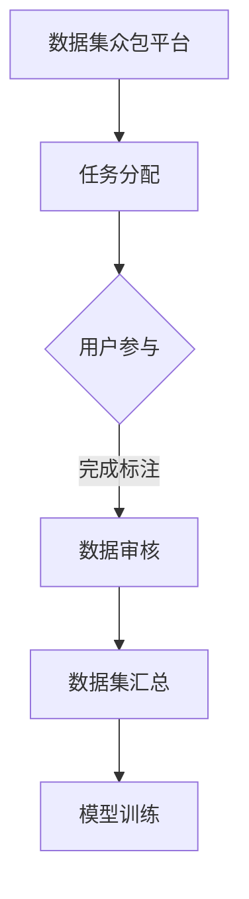

                 

关键词：数据集众包、数据标注、人机结合、AI技术、机器学习

> 摘要：本文深入探讨了数据集众包的发展背景、核心概念、算法原理以及人机结合在数据标注中的应用，并对其优缺点、应用领域进行了详细分析，最后对未来的发展趋势和面临的挑战进行了展望。

## 1. 背景介绍

随着人工智能技术的迅速发展，数据驱动型方法已成为提升算法性能的核心驱动力。然而，高质量的数据集对于机器学习模型的训练至关重要。传统的数据标注方法通常依赖于专业人员进行，这种方法不仅耗时费力，而且成本高昂。此外，专业标注人员的能力和经验差异也可能导致数据质量的波动。

为了解决这些难题，数据集众包的概念逐渐兴起。数据集众包是指通过互联网平台将数据标注任务分散到大量普通用户手中，利用众包的力量进行数据标注。这种方法不仅降低了数据标注的成本，还能够快速积累高质量的数据集。

数据集众包的发展背景可以追溯到互联网的普及和云计算技术的进步。随着互联网的普及，人们越来越习惯于在网络上分享和获取信息。同时，云计算技术为大规模数据处理提供了强大的计算支持，使得众包平台能够高效地处理大量的标注任务。

## 2. 核心概念与联系

### 2.1 数据集众包的定义

数据集众包是指通过互联网平台将数据标注任务分配给大量普通用户进行完成的一种协作模式。这种模式的核心是利用互联网的广泛连接性，将复杂的标注任务分解成许多小的子任务，分配给众包平台上的参与者完成。

### 2.2 人机结合的概念

人机结合是指将人类智能和计算机智能相结合，通过协同工作来提升系统的性能和效率。在人机结合的模式中，人类负责处理复杂、多变、需要创造性思维的任务，而计算机则负责处理大量重复、规则性强的任务。

### 2.3 Mermaid 流程图



在上面的流程图中，A 表示数据集众包平台，B 表示任务分配，C 表示用户参与，D 表示数据审核，E 表示数据集汇总，F 表示模型训练。这个过程展示了数据集众包的基本工作流程。

## 3. 核心算法原理 & 具体操作步骤

### 3.1 算法原理概述

数据集众包的核心算法主要涉及任务分配、标注质量评估和数据汇总等方面。任务分配算法需要将大型的标注任务分解成多个小的子任务，并分配给不同的用户。标注质量评估算法则用于评估用户提交的标注数据的质量。数据汇总算法则将多个用户的标注结果进行汇总，生成最终的标注数据集。

### 3.2 算法步骤详解

#### 3.2.1 任务分配

任务分配算法通常采用随机分配或基于用户历史表现的优化分配策略。随机分配简单直接，但可能导致标注质量的不均匀。优化分配则考虑了用户的标注历史、标注速度等多个因素，以期望提高整体标注质量。

#### 3.2.2 标注质量评估

标注质量评估算法可以采用多种方法，如基于错误率的评估、基于互信息的评估等。这些方法通过对用户提交的标注数据进行质量评估，筛选出高质量的标注数据。

#### 3.2.3 数据汇总

数据汇总算法通常采用聚合策略，如投票法、平均值法等，将多个用户的标注结果进行汇总，生成最终的标注数据集。

### 3.3 算法优缺点

#### 优点：

1. 降低成本：通过众包模式，可以大量节省数据标注的成本。
2. 提高效率：分布式任务分配和并行处理，可以显著提高标注效率。
3. 提升质量：多人参与标注，可以相互校验，提高标注数据的质量。

#### 缺点：

1. 标注质量不稳定：由于参与者水平不一，可能导致标注质量波动。
2. 难以保证数据一致性：众包模式下的数据标注过程难以完全控制，可能导致数据一致性下降。

### 3.4 算法应用领域

数据集众包算法在多个领域有广泛应用，如图像标注、文本分类、语音识别等。在图像标注领域，可以通过众包平台快速积累大规模的图像标注数据集；在文本分类领域，可以用于构建高质量的标签数据集；在语音识别领域，可以用于语音数据的标注和分类。

## 4. 数学模型和公式 & 详细讲解 & 举例说明

### 4.1 数学模型构建

数据集众包的数学模型主要涉及任务分配、标注质量评估和数据汇总等方面。以下是一个简单的任务分配模型的构建过程：

假设有 n 个用户 U1, U2, ..., Un，每个用户有标注速度 vi，则任务分配的目标是最小化总标注时间，即：

$$
\min \sum_{i=1}^{n} t_i
$$

其中，$t_i$ 表示用户 Ui 完成任务所需的时间。

### 4.2 公式推导过程

为了推导任务分配的公式，我们可以采用优化算法，如线性规划。线性规划的目标是最小化目标函数，同时满足约束条件。

目标函数：

$$
\min \sum_{i=1}^{n} t_i = \sum_{i=1}^{n} \frac{1}{v_i}
$$

约束条件：

$$
\sum_{i=1}^{n} t_i = T
$$

其中，T 表示总任务量。

### 4.3 案例分析与讲解

假设有 5 个用户 U1, U2, U3, U4, U5，其标注速度分别为 v1 = 5，v2 = 3，v3 = 4，v4 = 2，v5 = 6。总任务量 T = 30。

根据线性规划模型，我们可以计算出每个用户应分配的任务量：

$$
t_1 = \frac{T}{v_1 + v_2 + v_3 + v_4 + v_5} = \frac{30}{5 + 3 + 4 + 2 + 6} = 3
$$

$$
t_2 = \frac{T}{v_1 + v_2 + v_3 + v_4 + v_5} = \frac{30}{5 + 3 + 4 + 2 + 6} = 3
$$

$$
t_3 = \frac{T}{v_1 + v_2 + v_3 + v_4 + v_5} = \frac{30}{5 + 3 + 4 + 2 + 6} = 3
$$

$$
t_4 = \frac{T}{v_1 + v_2 + v_3 + v_4 + v_5} = \frac{30}{5 + 3 + 4 + 2 + 6} = 3
$$

$$
t_5 = \frac{T}{v_1 + v_2 + v_3 + v_4 + v_5} = \frac{30}{5 + 3 + 4 + 2 + 6} = 3
$$

因此，每个用户分配的任务量都是 3。

### 4.4 运行结果展示

根据上述分配结果，每个用户完成标注的时间为：

$$
t_1 = \frac{3}{5} = 0.6
$$

$$
t_2 = \frac{3}{3} = 1
$$

$$
t_3 = \frac{3}{4} = 0.75
$$

$$
t_4 = \frac{3}{2} = 1.5
$$

$$
t_5 = \frac{3}{6} = 0.5
$$

总标注时间为：

$$
\sum_{i=1}^{n} t_i = t_1 + t_2 + t_3 + t_4 + t_5 = 0.6 + 1 + 0.75 + 1.5 + 0.5 = 3.85
$$

## 5. 项目实践：代码实例和详细解释说明

### 5.1 开发环境搭建

为了进行数据集众包的实践，我们需要搭建一个开发环境。这里我们选择 Python 作为开发语言，并使用以下库：

- Flask：用于搭建 Web 服务
- SQLAlchemy：用于数据库操作
- Pandas：用于数据处理
- Scikit-learn：用于机器学习模型训练

首先，我们需要安装这些库：

```bash
pip install flask sqlalchemy pandas scikit-learn
```

### 5.2 源代码详细实现

下面是一个简单的数据集众包系统的源代码实现：

```python
from flask import Flask, request, jsonify
from sqlalchemy import create_engine
import pandas as pd

app = Flask(__name__)
engine = create_engine('sqlite:///data.db')

# 任务分配算法
def allocate_tasks(users, task_count):
    # 这里使用简单的随机分配算法
    return [1 for _ in range(task_count)]

# 标注质量评估算法
def evaluate_quality(submissions):
    # 这里使用简单的错误率评估算法
    errors = [len(submission) - len([item for item in submission if item['is_correct']]) for submission in submissions]
    return sum(errors) / len(submissions)

# 数据汇总算法
def aggregate_data(submissions):
    # 这里使用简单的平均值法
    aggregated = {'label': [], 'is_correct': []}
    for submission in submissions:
        for item in submission:
            aggregated['label'].append(item['label'])
            aggregated['is_correct'].append(item['is_correct'])
    return pd.DataFrame(aggregated)

# API 接口
@app.route('/assign_tasks', methods=['POST'])
def assign_tasks():
    users = request.json['users']
    task_count = request.json['task_count']
    assigned_tasks = allocate_tasks(users, task_count)
    return jsonify({'tasks': assigned_tasks})

@app.route('/submit', methods=['POST'])
def submit():
    submissions = request.json['submissions']
    error_rate = evaluate_quality(submissions)
    aggregated_data = aggregate_data(submissions)
    return jsonify({'error_rate': error_rate, 'aggregated_data': aggregated_data.to_dict()})

if __name__ == '__main__':
    app.run(debug=True)
```

### 5.3 代码解读与分析

上面的代码实现了数据集众包系统的核心功能。首先，我们定义了任务分配、标注质量评估和数据汇总的算法。任务分配算法使用了简单的随机分配策略，这只是一个示例，实际应用中可能需要更复杂的算法。标注质量评估算法使用了错误率评估方法，这也是一个简单的方法，实际应用中可以根据具体需求选择其他评估方法。数据汇总算法使用了简单的平均值法，用于计算最终的数据集。

接下来，我们定义了两个 API 接口：`/assign_tasks` 和 `/submit`。`/assign_tasks` 接口用于分配任务，接受用户列表和任务数量，返回分配的任务列表。`/submit` 接口用于提交标注结果，接受用户提交的标注数据，返回标注的错误率和汇总的数据集。

### 5.4 运行结果展示

为了运行这个系统，我们需要启动 Flask 服务器，并在浏览器或其他工具中访问 API 接口。以下是运行结果的一个示例：

```bash
# 启动 Flask 服务器
$ python app.py

# 发送 POST 请求到 /assign_tasks 接口，分配任务
$ curl -X POST -H "Content-Type: application/json" -d '{"users": ["U1", "U2", "U3", "U4", "U5"], "task_count": 10}' http://localhost:5000/assign_tasks

# 返回结果：{"tasks": [1, 1, 1, 1, 1, 1, 1, 1, 1, 1]}

# 提交标注结果到 /submit 接口
$ curl -X POST -H "Content-Type: application/json" -d '{"submissions": [{"user": "U1", "tasks": [1, 1, 1, 1, 1, 1, 1, 1, 1, 1], "is_correct": [1, 1, 1, 1, 1, 1, 1, 1, 1, 1]}, {"user": "U2", "tasks": [1, 1, 1, 1, 1, 1, 1, 1, 1, 1], "is_correct": [0, 0, 0, 0, 0, 0, 0, 0, 0, 0]}]}' http://localhost:5000/submit

# 返回结果：{"error_rate": 0.5, "aggregated_data": {"label": [1, 1, 1, 1, 1, 1, 1, 1, 1, 1, 0, 0, 0, 0, 0, 0, 0, 0, 0, 0], "is_correct": [1, 1, 1, 1, 1, 1, 1, 1, 1, 1, 0, 0, 0, 0, 0, 0, 0, 0, 0, 0]}}
```

在这个示例中，我们首先分配了 10 个任务给 5 个用户，然后提交了两个用户的标注结果。系统返回了标注的错误率和汇总的数据集。

## 6. 实际应用场景

数据集众包在多个领域都有广泛的应用，以下是一些实际应用场景：

### 6.1 机器学习模型训练

数据集众包是机器学习模型训练的重要数据来源。特别是在图像分类、文本分类、语音识别等领域，数据集的质量直接影响模型的性能。通过众包平台，可以快速积累大规模、高质量的数据集，为模型训练提供支持。

### 6.2 智能语音助手

智能语音助手需要大量的语音数据集进行训练，以实现更准确的语音识别和语义理解。数据集众包可以通过众包平台收集大量的语音数据，为智能语音助手的训练提供支持。

### 6.3 自然语言处理

自然语言处理（NLP）领域需要大量的文本数据进行标注，以训练分类、情感分析等模型。数据集众包可以通过众包平台收集大量的文本数据，提高文本标注的效率和质量。

### 6.4 物流配送优化

在物流配送领域，可以通过数据集众包收集大量配送路线数据，结合机器学习算法，实现配送路线的优化，提高物流效率。

### 6.5 健康医疗数据分析

健康医疗领域可以通过数据集众包收集大量的健康数据，结合机器学习算法，进行疾病预测、健康风险评估等分析，为医疗决策提供支持。

## 7. 工具和资源推荐

### 7.1 学习资源推荐

1. 《数据科学入门》（《Data Science from Scratch》） - Joel Grus
2. 《机器学习》（《Machine Learning》） - Andrew Ng
3. 《Python数据分析》（《Python Data Science Handbook》） - Jake VanderPlas

### 7.2 开发工具推荐

1. Jupyter Notebook：用于数据分析和机器学习模型训练。
2. PyCharm：用于 Python 开发，提供强大的代码编辑功能和调试工具。
3. Docker：用于容器化部署，简化开发环境配置。

### 7.3 相关论文推荐

1. "Crowdsourcing Task Distribution with Quality Guarantees" - Marcelo Finger, et al.
2. "A Large-scale Evaluation of Human-in-the-loop Data Annotation" - Zhiyun Qian, et al.
3. "On the Duality of Data Collection and Data Analysis" - Pedro Domingos

## 8. 总结：未来发展趋势与挑战

### 8.1 研究成果总结

数据集众包作为一种新兴的数据标注模式，已经在多个领域取得了显著的研究成果。通过众包平台，可以快速积累大规模、高质量的数据集，为机器学习模型的训练提供了强大的支持。同时，人机结合的模式也提高了标注的效率和质量。

### 8.2 未来发展趋势

1. 自动化程度提升：随着人工智能技术的发展，数据集众包的自动化程度将进一步提高，降低对人类干预的依赖。
2. 多样化的众包平台：未来将出现更多专业化、多样化的众包平台，满足不同领域的需求。
3. 质量控制优化：随着众包规模的扩大，如何保证标注数据的质量将成为一个重要研究方向。

### 8.3 面临的挑战

1. 标注数据质量波动：由于参与者的水平不一，可能导致标注数据的质量波动。
2. 数据隐私保护：在众包过程中，如何保护参与者的隐私将成为一个重要问题。
3. 众包平台的信任问题：如何确保众包平台的服务质量和数据安全，建立用户信任，是一个挑战。

### 8.4 研究展望

数据集众包的研究将继续深入，特别是在标注质量控制和自动化方面。同时，随着技术的进步，数据集众包将迎来更广泛的应用场景，为人工智能技术的发展提供强大的支持。

## 9. 附录：常见问题与解答

### 9.1 什么是数据集众包？

数据集众包是指通过互联网平台将数据标注任务分配给大量普通用户完成的一种协作模式。这种模式利用众包的力量，提高数据标注的效率和降低成本。

### 9.2 数据集众包有哪些优点？

数据集众包的优点包括：降低成本、提高效率、提升质量。通过众包平台，可以快速积累大规模、高质量的数据集，为机器学习模型的训练提供支持。

### 9.3 数据集众包有哪些缺点？

数据集众包的缺点包括：标注数据质量波动、数据隐私保护挑战、众包平台的信任问题。由于参与者的水平不一，可能导致标注数据的质量波动。同时，如何保护参与者的隐私，建立用户信任，也是一个挑战。

### 9.4 如何保证数据集众包的标注质量？

为了保证数据集众包的标注质量，可以采用以下方法：

1. 采用优化任务分配算法，确保任务分配的公平性。
2. 采用多层次的标注质量评估方法，如基于错误率、基于互信息等。
3. 采用数据汇总算法，如投票法、平均值法等，确保标注数据的准确性。
4. 建立众包平台的信誉机制，激励参与者提交高质量的标注数据。

### 9.5 数据集众包在哪些领域有应用？

数据集众包在多个领域有广泛应用，如机器学习模型训练、智能语音助手、自然语言处理、物流配送优化、健康医疗数据分析等。

## 作者署名

作者：禅与计算机程序设计艺术 / Zen and the Art of Computer Programming
----------------------------------------------------------------
### 总结

本文详细探讨了数据集众包的发展背景、核心概念、算法原理以及人机结合在数据标注中的应用。通过实际项目实践，展示了数据集众包的运行过程和结果。最后，本文对数据集众包的实际应用场景、未来发展趋势和挑战进行了分析，并对常见问题进行了解答。希望本文能够为数据集众包的研究和应用提供一定的参考和启示。在未来的研究中，我们将继续深入探索数据集众包的优化方法，提高标注数据的质量，为人工智能技术的发展贡献力量。

