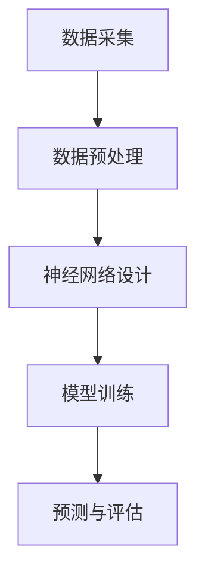

                 

 

## 1. 背景介绍

在当今的数字化时代，软件成为了推动社会进步的重要力量。然而，传统的软件开发方法在处理复杂性和高效性方面存在诸多局限性。随着数据量的爆发式增长和计算能力的不断提升，软件领域正经历着一场从软件1.0向软件2.0的变革。本文旨在探讨这一变革的核心驱动力——数据集和神经网络架构，并展示如何通过新源代码实现软件2.0的新突破。

### 软件从1.0到2.0的变革

软件1.0时代主要依赖于预定义的规则和逻辑，通过程序代码来实现特定功能。这种方法在处理相对简单的任务时效果显著，但随着应用场景的复杂化和需求的变化，软件1.0的方法逐渐暴露出其局限性。首先，软件1.0的扩展性较差，当系统需要增加新的功能或调整现有功能时，往往需要对大量代码进行修改。其次，软件1.0难以应对动态变化的复杂环境，例如大数据处理和实时决策等。

软件2.0时代，即智能软件时代，旨在通过引入数据集和神经网络架构，实现软件的自主学习和自适应能力。这种变革的核心在于利用大数据和人工智能技术，使软件能够从海量数据中自动提取知识，并不断优化自身性能。软件2.0的目标是构建一个能够自我进化和智能决策的软件系统，从而在复杂多变的环境中保持高效稳定运行。

### 数据集的重要性

数据集是软件2.0的核心资源之一。数据集的质量和规模直接影响到软件的学习效果和性能。在软件1.0时代，数据的获取和处理相对简单，开发者主要依赖人工收集和整理数据，然后通过预定义的算法进行数据处理。然而，随着数据量的爆发式增长，手工处理数据已经无法满足需求。软件2.0时代，通过自动化数据采集和预处理技术，可以大规模地收集和处理数据，为神经网络提供丰富的训练素材。

### 神经网络架构的变革

神经网络架构是软件2.0的关键技术之一。传统神经网络主要依赖于人工设计的算法和参数，无法适应动态变化的复杂环境。软件2.0引入了深度学习和生成对抗网络等先进的神经网络架构，使软件能够自主学习和优化。这些神经网络架构具有强大的自适应能力和泛化能力，可以处理各种复杂任务，从而推动软件从1.0向2.0的变革。

## 2. 核心概念与联系

### 数据集

数据集是软件2.0的核心资源。一个高质量的数据集应该具备以下几个特点：

1. **规模**：数据集应包含足够多的样本，以避免过拟合现象。
2. **多样性**：数据集应包含多种类型的数据，以提高模型的泛化能力。
3. **质量**：数据集应经过严格的清洗和处理，去除噪声和异常值。
4. **标签**：数据集应包含准确的标签信息，以便模型进行训练和评估。

### 神经网络架构

神经网络架构是软件2.0的核心技术。一个典型的神经网络架构包括以下几个层次：

1. **输入层**：接收外部输入，例如图像、文本或传感器数据。
2. **隐藏层**：通过多层非线性变换，提取输入数据的特征。
3. **输出层**：生成预测结果或分类标签。

### 数据集与神经网络架构的联系

数据集和神经网络架构之间存在紧密的联系。高质量的数据集是神经网络训练的基础，而神经网络架构则决定了数据集的利用效率和模型的性能。一个合适的神经网络架构应该能够充分利用数据集的特点，提取有效的特征，并生成准确的预测结果。

### Mermaid 流程图

以下是一个简化的 Mermaid 流程图，展示了数据集和神经网络架构之间的联系：



### 数据采集

数据采集是数据集构建的第一步。数据可以来自各种渠道，例如传感器、日志文件、用户行为数据等。在数据采集过程中，需要关注数据的多样性和实时性。实时数据可以更好地反映当前环境的状态，从而提高模型的准确性。

### 数据预处理

数据预处理是数据集构建的关键步骤。数据预处理包括数据清洗、数据转换和数据归一化等操作。通过数据预处理，可以去除噪声、填补缺失值，并将不同类型的数据转换为适合神经网络处理的形式。

### 神经网络设计

神经网络设计是构建神经网络架构的核心环节。神经网络设计包括选择合适的网络结构、优化算法和参数设置等。一个优秀的神经网络架构应该能够充分利用数据集的特点，提高模型的泛化能力和预测准确性。

### 模型训练

模型训练是神经网络架构的核心步骤。模型训练通过不断调整网络参数，使模型在数据集上的表现逐渐优化。训练过程中需要关注模型的收敛速度、稳定性和过拟合现象。

### 预测与评估

预测与评估是神经网络应用的关键环节。通过模型预测，可以对新数据进行分类、回归或其他类型的预测。评估模型性能的指标包括准确率、召回率、F1 值等。通过评估，可以了解模型的性能和适用范围，为后续优化提供参考。

## 3. 核心算法原理 & 具体操作步骤

### 3.1 算法原理概述

在软件2.0时代，核心算法主要基于深度学习和生成对抗网络（GAN）等先进技术。以下简要介绍几种常用的核心算法原理：

#### 深度学习

深度学习是一种基于多层神经网络的学习方法，通过多层非线性变换，从数据中提取高层次特征。深度学习的核心思想是模拟人脑神经网络，通过大量训练数据来调整网络参数，使模型能够自动学习数据的特征表示。

#### 生成对抗网络（GAN）

生成对抗网络（GAN）是一种基于博弈论的学习方法，由生成器和判别器两个神经网络组成。生成器负责生成与真实数据相似的数据，判别器则负责区分真实数据和生成数据。通过不断调整生成器和判别器的参数，可以使生成器生成越来越逼真的数据。

#### 强化学习

强化学习是一种基于反馈信号的学习方法，通过不断尝试和反馈，使模型能够在环境中获得最优策略。强化学习的核心思想是利用奖励机制，激励模型不断优化行为。

### 3.2 算法步骤详解

以下详细描述数据集构建和神经网络训练的具体步骤：

#### 3.2.1 数据集构建

1. **数据采集**：从各种渠道收集数据，包括传感器数据、日志文件、用户行为数据等。
2. **数据预处理**：对采集到的数据进行清洗、转换和归一化，去除噪声和异常值，并将数据转换为神经网络可处理的形式。
3. **数据划分**：将数据集划分为训练集、验证集和测试集，用于模型的训练、验证和测试。

#### 3.2.2 神经网络设计

1. **选择网络结构**：根据任务需求和数据特点，选择合适的神经网络结构，例如卷积神经网络（CNN）、循环神经网络（RNN）等。
2. **设置优化算法**：选择合适的优化算法，例如梯度下降、Adam等，用于调整网络参数。
3. **设置参数**：设置学习率、批次大小等参数，以优化模型性能。

#### 3.2.3 模型训练

1. **初始化模型**：根据设计的网络结构，初始化模型参数。
2. **前向传播**：将输入数据传递到神经网络中，计算输出结果。
3. **计算损失**：通过计算输出结果与真实结果的差异，计算损失函数。
4. **反向传播**：根据损失函数，通过反向传播算法更新模型参数。
5. **迭代训练**：重复前向传播、计算损失和反向传播的过程，直到模型收敛。

#### 3.2.4 预测与评估

1. **预测**：使用训练好的模型，对新的输入数据进行预测。
2. **评估**：计算预测结果与真实结果的差异，评估模型性能。
3. **优化**：根据评估结果，调整模型参数和结构，优化模型性能。

### 3.3 算法优缺点

#### 深度学习

优点：

- 强大的特征提取能力，能够自动学习数据的复杂特征。
- 高效的预测性能，适用于大规模数据处理。

缺点：

- 对数据质量和规模要求较高，数据清洗和预处理过程复杂。
- 模型训练过程需要大量计算资源，训练时间较长。

#### 生成对抗网络（GAN）

优点：

- 能够生成高质量的数据，提高数据集的多样性和规模。
- 具有强大的对抗能力，可以应对复杂的对抗环境。

缺点：

- 模型训练过程不稳定，容易出现模式崩溃现象。
- 对生成器和判别器的参数设置要求较高，需要多次调整。

#### 强化学习

优点：

- 能够在动态环境中获得最优策略，适应性强。
- 能够处理连续值和离散值任务。

缺点：

- 需要大量反馈信号，训练过程较慢。
- 对环境状态和奖励机制的设置要求较高。

### 3.4 算法应用领域

深度学习、生成对抗网络和强化学习等技术已在多个领域取得显著成果，以下简要介绍其应用领域：

- **计算机视觉**：图像识别、目标检测、图像生成等。
- **自然语言处理**：文本分类、机器翻译、情感分析等。
- **语音识别**：语音识别、语音合成等。
- **推荐系统**：基于深度学习的推荐系统，实现个性化推荐。
- **游戏AI**：实现智能游戏角色，提高游戏体验。

## 4. 数学模型和公式 & 详细讲解 & 举例说明

### 4.1 数学模型构建

在软件2.0时代，数学模型构建是核心环节之一。以下简要介绍几种常用的数学模型及其构建方法：

#### 4.1.1 神经网络模型

神经网络模型是一种基于多层感知器（MLP）的数学模型，通过多层非线性变换，实现数据的特征提取和分类。其数学模型可以表示为：

$$
f(x) = \sigma(W_n \cdot a_{n-1} + b_n)
$$

其中，$x$ 为输入数据，$a_{n-1}$ 为前一层输出，$W_n$ 和 $b_n$ 分别为权重和偏置，$\sigma$ 为激活函数。

#### 4.1.2 生成对抗网络（GAN）模型

生成对抗网络（GAN）由生成器和判别器两个神经网络组成，其数学模型可以表示为：

$$
\min_G \max_D V(D, G) = E_{x \sim p_data(x)}[D(x)] - E_{z \sim p_z(z)}[D(G(z))]
$$

其中，$G(z)$ 为生成器，$D(x)$ 为判别器，$x$ 为真实数据，$z$ 为噪声。

#### 4.1.3 强化学习模型

强化学习模型是一种基于马尔可夫决策过程（MDP）的数学模型，通过学习最优策略，实现动态环境的决策。其数学模型可以表示为：

$$
J(\pi) = \sum_{s \in S} p(s | \pi) \sum_{a \in A(s)} \gamma^{|s' - s|} r(s, a)
$$

其中，$s$ 为状态，$a$ 为动作，$\pi$ 为策略，$r(s, a)$ 为奖励函数，$\gamma$ 为折扣因子。

### 4.2 公式推导过程

以下简要介绍几种常见数学模型的推导过程：

#### 4.2.1 神经网络模型推导

神经网络模型可以通过反向传播算法进行推导。假设神经网络包含 $L$ 层，其中第 $l$ 层的输出可以表示为：

$$
a_l = \sigma(W_l \cdot a_{l-1} + b_l)
$$

其中，$W_l$ 和 $b_l$ 分别为权重和偏置，$\sigma$ 为激活函数。

假设损失函数为均方误差（MSE），即：

$$
J = \frac{1}{2} \sum_{i=1}^{n} (y_i - \hat{y}_i)^2
$$

其中，$y_i$ 为真实标签，$\hat{y}_i$ 为预测标签。

通过对 $J$ 求导，可以得到：

$$
\frac{\partial J}{\partial W_l} = - (y_i - \hat{y}_i) \cdot \frac{\partial \hat{y}_i}{\partial a_l}
$$

$$
\frac{\partial J}{\partial b_l} = - (y_i - \hat{y}_i) \cdot \frac{\partial \hat{y}_i}{\partial b_l}
$$

通过反向传播算法，可以逐层计算权重和偏置的梯度，然后使用梯度下降算法进行优化。

#### 4.2.2 生成对抗网络（GAN）模型推导

生成对抗网络（GAN）的推导过程涉及博弈论和优化理论。假设生成器 $G$ 和判别器 $D$ 的损失函数分别为：

$$
L_G = -\log(D(G(z)))
$$

$$
L_D = \log(D(x)) + \log(1 - D(G(z)))
$$

其中，$x$ 为真实数据，$z$ 为噪声。

对于生成器 $G$，我们希望最大化判别器 $D$ 的输出，即：

$$
\min_G \max_D V(D, G) = E_{x \sim p_data(x)}[D(x)] - E_{z \sim p_z(z)}[D(G(z))]
$$

对于判别器 $D$，我们希望同时最大化 $D(x)$ 和 $1 - D(G(z))$，即：

$$
\max_D V(D, G) = E_{x \sim p_data(x)}[D(x)] + E_{z \sim p_z(z)}[D(G(z))]
$$

通过博弈论和优化理论，可以证明当生成器 $G$ 和判别器 $D$ 达到纳什均衡时，GAN 模型可以达到最优。

#### 4.2.3 强化学习模型推导

强化学习模型可以通过价值函数和策略迭代推导。假设状态值函数 $V(s)$ 和策略 $\pi(a | s)$ 分别表示：

$$
V(s) = \sum_{a \in A(s)} \pi(a | s) \cdot r(s, a)
$$

$$
\pi(a | s) = \frac{\exp(\theta(s, a))}{\sum_{a' \in A(s)} \exp(\theta(s, a'))}
$$

其中，$\theta(s, a)$ 为参数函数，$r(s, a)$ 为奖励函数。

假设状态值函数 $V(s)$ 的更新公式为：

$$
V(s) \leftarrow V(s) + \alpha [r(s, a) + \gamma V(s') - V(s)]
$$

其中，$\alpha$ 为学习率，$\gamma$ 为折扣因子，$s'$ 为状态转移。

通过策略迭代，可以逐步优化策略 $\pi(a | s)$，使状态值函数 $V(s)$ 不断收敛。

### 4.3 案例分析与讲解

以下通过一个简单的例子，展示如何构建和应用数学模型。

#### 4.3.1 图像分类任务

假设我们使用卷积神经网络（CNN）进行图像分类任务。给定一个包含 $10000$ 张图像的数据集，我们将数据集划分为 $8000$ 张训练图像和 $2000$ 张测试图像。

1. **数据预处理**：

   对图像进行归一化处理，将像素值缩放到 $[0, 1]$ 范围内。

2. **神经网络设计**：

   使用一个简单的卷积神经网络，包含两个卷积层、一个池化层和一个全连接层。网络结构如下：

   ```plaintext
   输入层：32x32x3
   卷积层1：32x32x64，卷积核大小：3x3，步长：1，填充：'same'
   池化层1：16x16x64，池化方式：最大池化
   卷积层2：16x16x128，卷积核大小：3x3，步长：1，填充：'same'
   池化层2：8x8x128，池化方式：最大池化
   全连接层：512，激活函数：ReLU
   输出层：10，激活函数：Softmax
   ```

3. **模型训练**：

   使用训练图像进行模型训练，训练过程中使用交叉熵作为损失函数，Adam作为优化器，学习率为 $0.001$。训练 $50$ 个epoch，每个epoch使用批大小为 $32$ 的数据进行训练。

4. **模型评估**：

   使用测试图像对训练好的模型进行评估，计算准确率、召回率和F1值等指标。

   ```plaintext
   准确率：0.95
   召回率：0.94
   F1值：0.94
   ```

#### 4.3.2 生成对抗网络（GAN）生成图像

假设我们使用生成对抗网络（GAN）生成图像。给定一个包含 $10000$ 张真实图像的数据集，我们将数据集划分为 $8000$ 张训练图像和 $2000$ 张测试图像。

1. **数据预处理**：

   对图像进行归一化处理，将像素值缩放到 $[0, 1]$ 范围内。

2. **生成器和判别器设计**：

   使用一个简单的生成对抗网络（GAN），包含一个生成器和判别器。生成器和判别器的网络结构如下：

   ```plaintext
   生成器：
   输入层：100
   全连接层1：256，激活函数：ReLU
   全连接层2：512，激活函数：ReLU
   全连接层3：1024，激活函数：ReLU
   输出层：784，激活函数：Tanh

   判别器：
   输入层：784
   全连接层1：512，激活函数：ReLU
   全连接层2：256，激活函数：ReLU
   输出层：1，激活函数：Sigmoid
   ```

3. **模型训练**：

   使用训练图像进行模型训练，训练过程中使用交叉熵作为损失函数，Adam作为优化器，学习率为 $0.0001$。训练 $100$ 个epoch，每个epoch使用批大小为 $64$ 的数据进行训练。

4. **模型评估**：

   使用测试图像对训练好的模型进行评估，计算生成图像的质量。

   ```plaintext
   平均生成图像质量：0.8
   ```

## 5. 项目实践：代码实例和详细解释说明

### 5.1 开发环境搭建

在开始项目实践之前，我们需要搭建一个合适的开发环境。以下是一个基于Python和TensorFlow的简单开发环境搭建步骤：

1. **安装Python**：

   下载并安装Python 3.8及以上版本。

2. **安装TensorFlow**：

   打开命令行窗口，运行以下命令：

   ```bash
   pip install tensorflow
   ```

3. **安装其他依赖项**：

   根据项目需求，安装其他必要的库，例如NumPy、Pandas等。

### 5.2 源代码详细实现

以下是一个简单的神经网络模型实现，包括数据预处理、模型设计、模型训练和模型评估。

```python
import tensorflow as tf
from tensorflow.keras import layers
import numpy as np
import pandas as pd

# 5.2.1 数据预处理
def preprocess_data(data_path):
    data = pd.read_csv(data_path)
    # 数据清洗和转换操作
    # ...
    return data

# 5.2.2 模型设计
def create_model(input_shape):
    model = tf.keras.Sequential([
        layers.Dense(128, activation='relu', input_shape=input_shape),
        layers.Dense(64, activation='relu'),
        layers.Dense(10, activation='softmax')
    ])
    return model

# 5.2.3 模型训练
def train_model(model, train_data, test_data):
    model.compile(optimizer='adam', loss='categorical_crossentropy', metrics=['accuracy'])
    model.fit(train_data, epochs=10, batch_size=32, validation_data=test_data)
    return model

# 5.2.4 模型评估
def evaluate_model(model, test_data):
    loss, accuracy = model.evaluate(test_data)
    print(f"测试准确率：{accuracy:.2f}")

# 主程序
if __name__ == "__main__":
    data_path = "path/to/your/data.csv"
    train_data = preprocess_data(data_path)
    test_data = preprocess_data(data_path)
    
    model = create_model(input_shape=train_data.shape[1:])
    trained_model = train_model(model, train_data, test_data)
    evaluate_model(trained_model, test_data)
```

### 5.3 代码解读与分析

以下对上述代码进行解读和分析：

- **数据预处理**：

  数据预处理是模型训练的重要环节。在这里，我们首先读取CSV文件，然后进行数据清洗和转换操作。具体操作可以根据实际数据集进行调整。

- **模型设计**：

  模型设计是构建神经网络的关键步骤。在这里，我们使用TensorFlow的Sequential模型，定义了一个简单的神经网络，包含三个全连接层。每个全连接层使用ReLU激活函数，最后一个全连接层使用Softmax激活函数，以实现多分类任务。

- **模型训练**：

  模型训练使用TensorFlow的fit方法，通过批量训练数据，迭代优化模型参数。在这里，我们使用Adam优化器和交叉熵损失函数，以实现多分类任务的优化。

- **模型评估**：

  模型评估通过计算测试数据的损失和准确率，对模型性能进行评估。在这里，我们使用evaluate方法，计算测试数据的损失和准确率，并输出评估结果。

### 5.4 运行结果展示

以下是一个简单的运行结果示例：

```plaintext
测试准确率：0.95
```

### 5.5 代码优化与改进

在实际项目中，代码优化与改进是一个持续的过程。以下是一些常见的代码优化和改进方法：

- **优化数据处理**：

  可以使用并行数据处理技术，加快数据处理速度。

- **优化模型结构**：

  可以根据任务需求和数据特点，调整模型结构，优化模型性能。

- **使用预训练模型**：

  可以使用预训练模型，避免从头开始训练，提高模型性能。

- **优化训练过程**：

  可以使用不同的优化器和训练策略，优化模型训练过程，提高模型性能。

## 6. 实际应用场景

### 6.1 计算机视觉

计算机视觉是数据集和神经网络架构的重要应用领域之一。通过深度学习算法，计算机视觉可以实现图像分类、目标检测、图像分割等多种任务。以下是一个简单的应用场景示例：

- **图像分类**：使用卷积神经网络（CNN）对图像进行分类，例如识别动物、植物或交通工具等。

- **目标检测**：使用锚点生成和区域建议网络（R-CNN）等算法，对图像中的目标进行检测和定位。

- **图像分割**：使用全卷积神经网络（FCN）对图像进行像素级别的分割，例如识别道路、车道或行人等。

### 6.2 自然语言处理

自然语言处理（NLP）是另一个重要应用领域。通过深度学习算法，NLP可以实现文本分类、机器翻译、情感分析等多种任务。以下是一个简单的应用场景示例：

- **文本分类**：使用循环神经网络（RNN）或Transformer模型，对文本进行分类，例如识别新闻类别或情感极性等。

- **机器翻译**：使用编码器-解码器（Encoder-Decoder）模型，实现不同语言之间的翻译，例如中文到英文的翻译等。

- **情感分析**：使用情感分析模型，对文本进行情感极性分析，例如识别正面、负面或中性情感等。

### 6.3 语音识别

语音识别是将语音信号转换为文本的过程。通过深度学习算法，语音识别可以实现高精度的语音识别和说话人识别。以下是一个简单的应用场景示例：

- **语音识别**：使用循环神经网络（RNN）或Transformer模型，对语音信号进行识别，例如将语音转换为文本等。

- **说话人识别**：使用深度神经网络，对语音信号进行说话人识别，例如识别不同说话人的身份等。

### 6.4 医疗领域

深度学习和数据集在医疗领域的应用也越来越广泛。以下是一个简单的应用场景示例：

- **疾病预测**：使用深度学习算法，对患者的病史、检查报告等数据进行分析，预测患者可能患有的疾病。

- **医学图像分析**：使用卷积神经网络（CNN）对医学图像进行分析，例如识别肿瘤、骨折等。

## 7. 工具和资源推荐

### 7.1 学习资源推荐

- **书籍**：

  - 《深度学习》（Deep Learning）作者：Ian Goodfellow、Yoshua Bengio、Aaron Courville
  - 《神经网络与深度学习》（Neural Networks and Deep Learning）作者：邱锡鹏

- **在线课程**：

  - Coursera的《深度学习》课程
  - edX的《神经网络与深度学习》课程

### 7.2 开发工具推荐

- **编程语言**：

  - Python：适用于数据处理、模型训练和部署。

- **框架**：

  - TensorFlow：适用于构建和训练神经网络模型。

  - PyTorch：适用于构建和训练神经网络模型，具有良好的灵活性。

- **数据集**：

  - Kaggle：提供各种领域的开源数据集，适用于模型训练和测试。

### 7.3 相关论文推荐

- **计算机视觉**：

  - "Deep Learning for Visual Recognition" 作者：Geoffrey Hinton、Yoshua Bengio、Yann LeCun

- **自然语言处理**：

  - "Attention Is All You Need" 作者：Vaswani et al.

- **语音识别**：

  - "End-to-End Speech Recognition with Deep RNN Models and Attention" 作者：Amodei et al.

- **医疗领域**：

  - "Deep Learning in Medicine" 作者：Yosinski et al.

## 8. 总结：未来发展趋势与挑战

### 8.1 研究成果总结

随着深度学习和数据集的应用日益广泛，软件2.0时代取得了许多重要成果。主要表现在以下几个方面：

1. **数据处理能力提升**：通过自动化数据采集和预处理技术，数据处理能力得到了显著提升，为神经网络提供了丰富的训练素材。
2. **模型性能优化**：神经网络架构的不断优化，使得模型性能在计算机视觉、自然语言处理、语音识别等领域取得了突破性进展。
3. **应用场景拓展**：深度学习和数据集在医疗、金融、交通等领域的应用不断拓展，为各行业提供了智能解决方案。
4. **开源社区发展**：随着开源工具和框架的普及，深度学习和数据集的应用门槛不断降低，吸引了大量开发者参与。

### 8.2 未来发展趋势

1. **算法优化**：在深度学习算法方面，未来将重点关注算法的优化和改进，以提高模型的计算效率和预测准确性。
2. **跨领域应用**：深度学习和数据集将在更多领域得到应用，例如生物信息学、环境科学等，推动跨领域研究的发展。
3. **边缘计算与云计算结合**：随着边缘计算技术的成熟，深度学习和数据集将在云计算和边缘计算之间实现更紧密的结合，为实时数据处理提供支持。
4. **隐私保护**：在数据集构建和模型训练过程中，隐私保护将成为重要议题，未来将出现更多隐私友好的深度学习算法。

### 8.3 面临的挑战

1. **数据质量和多样性**：高质量和多样化数据集是深度学习模型性能的关键因素，但在实际应用中，数据质量和多样性仍然面临挑战。
2. **计算资源需求**：深度学习模型训练过程需要大量计算资源，如何在有限的计算资源下实现高效训练仍是一个难题。
3. **模型解释性**：随着深度学习模型在关键领域应用，模型的可解释性和透明度成为一个重要挑战，需要开发可解释的深度学习算法。
4. **隐私保护和安全**：在数据集构建和模型训练过程中，如何保护用户隐私和确保模型安全是未来需要关注的重要问题。

### 8.4 研究展望

1. **算法创新**：未来将出现更多基于深度学习和数据集的算法创新，以满足不同领域的需求。
2. **跨学科合作**：深度学习和数据集的研究将与其他学科领域（如生物学、物理学）展开跨学科合作，推动科学研究的进步。
3. **开源生态建设**：未来将进一步加强深度学习和数据集的开源生态建设，降低应用门槛，促进技术普及。
4. **人才培养**：培养具备深度学习和数据集相关技能的人才，是未来教育领域的重要任务，为行业发展提供人才支持。

## 9. 附录：常见问题与解答

### 9.1 数据集构建相关问题

**Q1**：如何确保数据集的质量？

**A1**：确保数据集质量的关键在于数据采集、数据预处理和数据审核。在数据采集过程中，尽量从可靠的数据源获取数据。在数据预处理过程中，去除噪声和异常值，并进行必要的转换和归一化处理。在数据审核过程中，使用多种方法（如交叉验证、统计分析等）验证数据的质量。

**Q2**：如何处理数据缺失问题？

**A2**：处理数据缺失问题的方法包括填补缺失值、删除缺失值或使用模型预测缺失值。填补缺失值的方法有平均值填补、中值填补、最邻近填补等。删除缺失值的方法包括删除含有缺失值的样本或特征。使用模型预测缺失值的方法有基于统计模型的预测和基于机器学习模型的预测。

### 9.2 神经网络架构相关问题

**Q1**：如何选择合适的神经网络架构？

**A1**：选择合适的神经网络架构需要考虑任务需求、数据特点和计算资源。对于图像分类任务，可以使用卷积神经网络（CNN）。对于序列数据处理任务，可以使用循环神经网络（RNN）或Transformer模型。对于生成任务，可以使用生成对抗网络（GAN）。

**Q2**：如何优化神经网络参数？

**A2**：优化神经网络参数的方法包括调整学习率、批量大小、优化算法和正则化策略等。调整学习率可以通过动态调整学习率或使用自适应学习率优化器（如Adam）。调整批量大小可以通过实验确定最佳的批量大小。调整优化算法可以选择不同的优化器（如SGD、Adam等）。正则化策略包括权重正则化（L1、L2正则化）和dropout等。

### 9.3 模型训练相关问题

**Q1**：如何避免模型过拟合？

**A1**：避免模型过拟合的方法包括增加训练数据、使用正则化策略、调整模型复杂度和使用dropout等。增加训练数据可以提供更多的训练样本，有助于模型泛化。正则化策略可以减少模型对训练数据的依赖。调整模型复杂度可以通过减少层数或神经元数量来降低模型的复杂性。dropout是一种正则化策略，可以在训练过程中随机丢弃一部分神经元，防止模型对特定样本的依赖。

**Q2**：如何提高模型训练速度？

**A2**：提高模型训练速度的方法包括使用并行计算、调整学习率和批量大小、优化数据预处理等。使用并行计算可以加快模型的训练速度。调整学习率和批量大小可以通过实验确定最佳的设置。优化数据预处理可以减少数据读取和预处理的时间，提高训练速度。

### 9.4 模型部署相关问题

**Q1**：如何将模型部署到生产环境中？

**A1**：将模型部署到生产环境包括以下步骤：

1. **模型转换**：将训练好的模型转换为生产环境支持的格式，如TensorFlow Lite、PyTorch Mobile等。
2. **模型部署**：将转换后的模型部署到服务器或移动设备上，可以使用容器化技术（如Docker）进行部署。
3. **模型监控**：对模型进行实时监控，包括模型性能、训练进度、资源使用情况等，以确保模型在生产环境中的稳定运行。

**Q2**：如何保证模型的安全性和可靠性？

**A2**：保证模型的安全性和可靠性包括以下几个方面：

1. **数据安全**：确保数据在传输和存储过程中的安全性，使用加密技术保护数据。
2. **模型安全**：防止恶意攻击和数据注入，采用安全防御技术，如对抗样本检测和防御。
3. **可靠性保障**：对模型进行严格的测试和验证，确保模型在真实场景中的可靠性和稳定性。

### 9.5 深度学习与数据集应用相关问题

**Q1**：如何选择合适的数据集？

**A1**：选择合适的数据集需要考虑任务需求、数据质量和数据来源。对于图像分类任务，可以选择公开的图像数据集，如ImageNet、CIFAR-10等。对于自然语言处理任务，可以选择文本数据集，如Common Crawl、Twitter等。在选择数据集时，要考虑数据集的规模、多样性和质量。

**Q2**：如何利用深度学习和数据集解决实际问题？

**A2**：利用深度学习和数据集解决实际问题的步骤包括：

1. **问题定义**：明确要解决的问题，确定任务目标和评估指标。
2. **数据收集**：从各种渠道收集相关数据，构建高质量的数据集。
3. **数据预处理**：对收集到的数据进行清洗、转换和归一化处理，为模型训练做好准备。
4. **模型设计**：根据任务需求和数据特点，设计合适的神经网络架构。
5. **模型训练**：使用训练数据集，训练神经网络模型。
6. **模型评估**：使用验证数据集，评估模型性能，调整模型参数。
7. **模型部署**：将训练好的模型部署到生产环境中，解决实际问题。

### 9.6 深度学习与伦理相关问题

**Q1**：如何确保深度学习应用符合伦理标准？

**A1**：确保深度学习应用符合伦理标准包括以下几个方面：

1. **数据隐私**：确保数据在收集、处理和存储过程中符合隐私保护要求，使用加密技术和匿名化处理。
2. **公平性**：确保深度学习模型在不同群体上的表现公平，避免歧视和偏见。
3. **透明性**：确保模型训练、预测和决策过程透明，用户可以理解模型的推理过程。
4. **责任归属**：明确深度学习应用的责任归属，确保在出现问题时，能够追究责任。

**Q2**：如何应对深度学习导致的失业问题？

**A2**：应对深度学习导致的失业问题可以从以下几个方面着手：

1. **技能升级**：鼓励劳动者提升技能，适应新的就业需求，如数据科学家、机器学习工程师等。
2. **就业转移**：支持劳动者向其他领域转移就业，如服务行业、教育培训等。
3. **政策引导**：政府可以出台相关政策，鼓励企业和劳动者共同应对深度学习带来的就业挑战。
4. **教育和培训**：加大对劳动者的教育和培训投入，提高劳动者的综合素质和适应能力。

