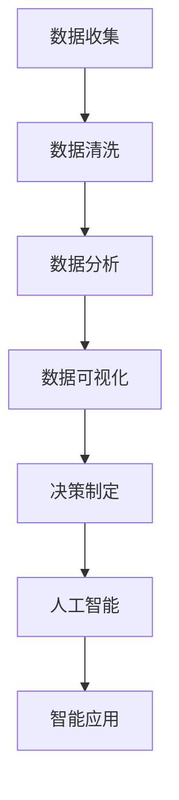

                 

关键词：数据驱动、决策、AI、电商、优化、策略

> 摘要：本文旨在探讨如何利用人工智能（AI）技术驱动电商领域的决策优化，通过深入分析数据驱动决策的理论与实践，为电商企业提供一套完整的AI优化策略，助力企业在竞争激烈的市场中脱颖而出。

## 1. 背景介绍

在互联网和电子商务快速发展的背景下，数据已经成为企业最重要的资产之一。如何有效地利用数据驱动决策，已经成为电商企业关注的焦点。传统的电商策略往往依赖于经验和直觉，难以应对复杂多变的市场环境。而人工智能技术的崛起，为电商企业提供了新的机遇。通过AI技术，企业可以从海量数据中提取有价值的信息，实现精准营销、个性化推荐和智能客服等应用，从而提升用户体验和业务效率。

本文将首先介绍数据驱动决策的基本概念，然后探讨AI技术在电商策略优化中的应用，包括核心算法、数学模型以及项目实践案例。最后，本文将分析AI优化电商策略的未来发展趋势和面临的挑战，为企业提供有益的参考。

## 2. 核心概念与联系

### 2.1 数据驱动决策

数据驱动决策是一种基于数据分析的方法，通过收集、处理和挖掘数据，为企业提供决策支持。数据驱动决策的核心在于利用数据来发现商业机会、优化业务流程和提升运营效率。其基本流程包括数据收集、数据清洗、数据分析、数据可视化以及决策制定等步骤。

### 2.2 人工智能

人工智能（AI）是指通过模拟人类智能，实现自动化学习和决策的技术。AI技术包括机器学习、深度学习、自然语言处理、计算机视觉等。在电商领域，AI技术主要用于数据挖掘、个性化推荐、智能客服、风险控制等方面。

### 2.3 数据驱动决策与人工智能的联系

数据驱动决策和人工智能之间有着紧密的联系。数据是AI技术的基础，而AI技术则为数据驱动决策提供了强大的工具。通过AI技术，企业可以更加高效地处理和分析海量数据，发现数据中的价值，从而制定更加精准和有效的决策。

### 2.4 Mermaid 流程图

以下是一个简化的Mermaid流程图，展示了数据驱动决策与人工智能技术之间的联系：



## 3. 核心算法原理 & 具体操作步骤

### 3.1 算法原理概述

在数据驱动决策中，常用的核心算法包括聚类分析、关联规则挖掘、回归分析等。这些算法可以从海量数据中提取有价值的信息，为企业提供决策支持。以下是这些算法的基本原理：

- **聚类分析**：将数据分为若干个类别，使得同一类别内的数据尽可能相似，不同类别之间的数据尽可能不同。
- **关联规则挖掘**：发现数据之间的关联关系，用于推荐系统、市场细分等应用。
- **回归分析**：通过建立数据之间的数学模型，预测因变量的取值。

### 3.2 算法步骤详解

#### 3.2.1 聚类分析

聚类分析的基本步骤如下：

1. **数据预处理**：包括数据清洗、数据转换等，确保数据质量。
2. **选择聚类算法**：如K-means、DBSCAN等。
3. **初始化聚类中心**：随机选择或基于某种策略初始化聚类中心。
4. **迭代计算**：计算每个数据点与聚类中心的距离，将数据点分配到最近的聚类中心。
5. **更新聚类中心**：计算新的聚类中心。
6. **重复步骤4和5**，直到满足停止条件（如聚类中心的变化小于阈值）。

#### 3.2.2 关联规则挖掘

关联规则挖掘的基本步骤如下：

1. **数据预处理**：确保数据格式一致，去除无关信息。
2. **构建事务数据库**：将数据转换为事务数据库，其中每个事务代表一组商品。
3. **选择支持度和置信度阈值**：支持度表示某个规则在所有事务中出现的频率，置信度表示在购买了商品A的情况下购买商品B的概率。
4. **生成频繁项集**：从事务数据库中挖掘频繁项集。
5. **生成关联规则**：从频繁项集中生成满足支持度和置信度阈值的关联规则。

#### 3.2.3 回归分析

回归分析的基本步骤如下：

1. **数据预处理**：包括数据清洗、特征选择等。
2. **选择回归模型**：如线性回归、多项式回归等。
3. **训练模型**：通过最小化损失函数，找到最优的模型参数。
4. **模型评估**：使用交叉验证等方法评估模型性能。
5. **预测**：使用训练好的模型预测新的数据点的因变量值。

### 3.3 算法优缺点

- **聚类分析**：优点包括简单、易于实现；缺点包括对初始聚类中心敏感、可能陷入局部最优。
- **关联规则挖掘**：优点包括能够发现数据中的隐含关联；缺点包括计算量大、支持度和置信度阈值的设置较为主观。
- **回归分析**：优点包括能够建立数据之间的数学模型、预测精度高；缺点包括对特征选择和模型选择要求较高、可能过拟合。

### 3.4 算法应用领域

- **聚类分析**：用于市场细分、用户群体划分等。
- **关联规则挖掘**：用于推荐系统、商品组合销售策略等。
- **回归分析**：用于需求预测、价格优化等。

## 4. 数学模型和公式 & 详细讲解 & 举例说明

### 4.1 数学模型构建

在数据驱动决策中，常用的数学模型包括线性回归模型、逻辑回归模型、支持向量机等。以下是这些模型的基本数学公式：

#### 4.1.1 线性回归模型

线性回归模型假设因变量 \( Y \) 与自变量 \( X \) 之间存在线性关系：

\[ Y = \beta_0 + \beta_1 X + \epsilon \]

其中，\( \beta_0 \) 是截距，\( \beta_1 \) 是斜率，\( \epsilon \) 是误差项。

#### 4.1.2 逻辑回归模型

逻辑回归模型用于处理分类问题，将概率映射到二进制值：

\[ P(Y=1) = \frac{1}{1 + e^{-(\beta_0 + \beta_1 X)}} \]

其中，\( \beta_0 \) 是截距，\( \beta_1 \) 是斜率。

#### 4.1.3 支持向量机

支持向量机（SVM）是一种分类算法，其目标是在特征空间中找到一个最优的超平面，使得两类数据点能够最大程度地分开：

\[ \max_w \min_{\xi_i} \left\{ \frac{1}{2} ||w||^2 + C \sum_{i=1}^{n} \xi_i \right\} \]

其中，\( w \) 是权重向量，\( \xi_i \) 是松弛变量，\( C \) 是惩罚参数。

### 4.2 公式推导过程

#### 4.2.1 线性回归模型

线性回归模型的推导过程如下：

1. **最小二乘法**：目标是找到使得损失函数最小的参数 \( \beta_0 \) 和 \( \beta_1 \)：

\[ \min \sum_{i=1}^{n} (Y_i - \beta_0 - \beta_1 X_i)^2 \]

2. **求导并令导数为零**：

\[ \frac{\partial}{\partial \beta_0} \left( \sum_{i=1}^{n} (Y_i - \beta_0 - \beta_1 X_i)^2 \right) = 0 \]
\[ \frac{\partial}{\partial \beta_1} \left( \sum_{i=1}^{n} (Y_i - \beta_0 - \beta_1 X_i)^2 \right) = 0 \]

3. **求解得到参数 \( \beta_0 \) 和 \( \beta_1 \)**：

\[ \beta_0 = \frac{1}{n} \sum_{i=1}^{n} (Y_i - \beta_1 X_i) \]
\[ \beta_1 = \frac{1}{n} \sum_{i=1}^{n} (X_i - \bar{X})(Y_i - \bar{Y}) \]

#### 4.2.2 逻辑回归模型

逻辑回归模型的推导过程如下：

1. **损失函数**：使用对数似然损失函数：

\[ L(\beta_0, \beta_1) = - \sum_{i=1}^{n} [y_i \log(p_i) + (1 - y_i) \log(1 - p_i)] \]

2. **求导并令导数为零**：

\[ \frac{\partial}{\partial \beta_0} L(\beta_0, \beta_1) = 0 \]
\[ \frac{\partial}{\partial \beta_1} L(\beta_0, \beta_1) = 0 \]

3. **求解得到参数 \( \beta_0 \) 和 \( \beta_1 \)**：

\[ \beta_0 = \frac{1}{n} \sum_{i=1}^{n} [y_i - p_i] \]
\[ \beta_1 = \frac{1}{n} \sum_{i=1}^{n} [X_i(y_i - p_i)] \]

#### 4.2.3 支持向量机

支持向量机的推导过程较为复杂，本文不详细展开。主要思路是通过优化目标函数求解最优超平面，然后通过核函数将低维数据映射到高维空间，从而实现分类。

### 4.3 案例分析与讲解

#### 4.3.1 线性回归模型

假设我们有一个关于房价的数据集，其中自变量是房屋面积，因变量是房价。我们希望使用线性回归模型预测房价。

1. **数据预处理**：将数据分为训练集和测试集，并对数据进行归一化处理。

2. **模型训练**：使用最小二乘法求解线性回归模型参数。

3. **模型评估**：使用交叉验证等方法评估模型性能。

4. **预测**：使用训练好的模型预测测试集的房价。

#### 4.3.2 逻辑回归模型

假设我们有一个关于客户购买意向的数据集，其中自变量是客户的年龄、收入等特征，因变量是购买意向（0表示未购买，1表示购买）。我们希望使用逻辑回归模型预测客户的购买意向。

1. **数据预处理**：将数据分为训练集和测试集，并对数据进行归一化处理。

2. **模型训练**：使用对数似然损失函数求解逻辑回归模型参数。

3. **模型评估**：使用交叉验证等方法评估模型性能。

4. **预测**：使用训练好的模型预测测试集的购买意向。

#### 4.3.3 支持向量机

假设我们有一个关于手写数字识别的数据集，我们希望使用支持向量机对数字进行分类。

1. **数据预处理**：将数据分为训练集和测试集。

2. **模型训练**：使用支持向量机算法训练模型。

3. **模型评估**：使用交叉验证等方法评估模型性能。

4. **预测**：使用训练好的模型对测试集的数字进行分类。

## 5. 项目实践：代码实例和详细解释说明

### 5.1 开发环境搭建

为了进行数据驱动决策的实践，我们需要搭建一个适合的开发环境。以下是一个简单的Python开发环境搭建步骤：

1. 安装Python：从[Python官网](https://www.python.org/)下载并安装Python。
2. 安装Jupyter Notebook：使用pip命令安装Jupyter Notebook。

```bash
pip install notebook
```

3. 安装相关库：安装用于数据分析、机器学习和数据可视化的库，如NumPy、Pandas、Scikit-learn、Matplotlib等。

```bash
pip install numpy pandas scikit-learn matplotlib
```

### 5.2 源代码详细实现

以下是一个简单的线性回归模型的实现示例：

```python
import numpy as np
import pandas as pd
from sklearn.linear_model import LinearRegression
from sklearn.model_selection import train_test_split
from sklearn.metrics import mean_squared_error
import matplotlib.pyplot as plt

# 读取数据
data = pd.read_csv('house_prices.csv')
X = data[['area']]
y = data['price']

# 数据预处理
X_train, X_test, y_train, y_test = train_test_split(X, y, test_size=0.2, random_state=42)
X_train = X_train.values
X_test = X_test.values

# 模型训练
model = LinearRegression()
model.fit(X_train, y_train)

# 模型评估
y_pred = model.predict(X_test)
mse = mean_squared_error(y_test, y_pred)
print('MSE:', mse)

# 模型预测
plt.scatter(X_test, y_test, color='blue')
plt.plot(X_test, y_pred, color='red')
plt.xlabel('Area')
plt.ylabel('Price')
plt.title('Linear Regression')
plt.show()
```

### 5.3 代码解读与分析

1. **数据读取**：使用Pandas库读取CSV格式的房价数据。
2. **数据预处理**：将数据分为自变量和因变量，并使用Scikit-learn库将数据分为训练集和测试集。
3. **模型训练**：使用LinearRegression类训练线性回归模型。
4. **模型评估**：使用均方误差（MSE）评估模型性能。
5. **模型预测**：使用训练好的模型对测试集的房价进行预测，并使用Matplotlib库绘制预测结果。

### 5.4 运行结果展示

运行上述代码后，我们将得到以下结果：

1. **MSE**：输出模型的均方误差，用于评估模型性能。
2. **预测图**：绘制测试集的实际房价与预测房价的散点图和拟合线。

## 6. 实际应用场景

数据驱动决策和AI技术在电商领域有广泛的应用场景。以下是一些典型的实际应用案例：

1. **个性化推荐**：基于用户的历史购买行为和兴趣偏好，利用协同过滤算法和深度学习技术生成个性化推荐列表，提升用户满意度。
2. **精准营销**：通过数据挖掘技术分析用户的消费行为和喜好，制定针对性的营销策略，提高转化率和销售额。
3. **智能客服**：利用自然语言处理技术构建智能客服系统，自动解答用户问题，降低人工成本，提高服务效率。
4. **风险控制**：通过实时监控和数据分析，识别潜在的欺诈行为和风险，制定相应的防控措施。
5. **供应链优化**：利用预测分析技术优化库存管理、物流配送等环节，降低成本、提高效率。

## 7. 未来应用展望

随着人工智能技术的不断发展，数据驱动决策在电商领域的应用前景将更加广阔。以下是几个未来的应用方向：

1. **更智能的个性化推荐**：结合用户行为和社交网络信息，实现更加精准的个性化推荐。
2. **自适应营销策略**：根据市场环境和用户需求，实时调整营销策略，提高市场响应速度。
3. **智能供应链管理**：利用AI技术实现全流程供应链的智能化管理，降低成本、提高效率。
4. **智能客服升级**：结合语音识别、图像识别等多模态技术，实现更加人性化的智能客服。
5. **自动化决策支持**：通过深度学习和强化学习技术，实现更加智能的自动化决策支持系统。

## 8. 工具和资源推荐

### 8.1 学习资源推荐

- **《Python数据分析基础教程》**：详细介绍Python在数据分析领域的应用。
- **《深度学习》**：经典教材，全面讲解深度学习的基本原理和应用。
- **《数据挖掘：实用机器学习技术》**：介绍数据挖掘的基本方法和应用实例。

### 8.2 开发工具推荐

- **Jupyter Notebook**：交互式的数据分析平台，便于编写和调试代码。
- **TensorFlow**：开源的深度学习框架，广泛应用于机器学习和数据科学领域。
- **Scikit-learn**：Python的机器学习库，提供了丰富的机器学习算法和工具。

### 8.3 相关论文推荐

- **"Deep Learning for Recommender Systems"**：介绍深度学习在推荐系统中的应用。
- **"Collaborative Filtering for the Web"**：介绍协同过滤算法在互联网推荐系统中的应用。
- **"Recommender Systems Handbook"**：全面讲解推荐系统的基础知识和应用技术。

## 9. 总结：未来发展趋势与挑战

数据驱动决策和AI技术在电商领域的应用已经取得了显著成果，未来将呈现以下发展趋势：

1. **技术融合**：将多种AI技术（如深度学习、强化学习、自然语言处理等）融合到电商策略中，实现更高效的决策支持。
2. **数据驱动**：充分利用大数据和实时数据分析，为电商企业提供更加精准和实时的决策支持。
3. **智能化**：通过持续学习和自适应调整，实现更加智能化的电商策略。

然而，AI优化电商策略也面临着一些挑战：

1. **数据隐私**：如何在保护用户隐私的前提下，充分利用用户数据为电商提供个性化服务。
2. **算法透明性**：如何提高算法的透明性，使其符合法律法规和道德标准。
3. **算法公平性**：如何避免算法偏见，确保算法在所有用户群体中的公平性。

总之，数据驱动决策和AI技术为电商企业提供了巨大的机遇和挑战。企业应积极拥抱新技术，持续优化电商策略，以在激烈的市场竞争中脱颖而出。

## 10. 附录：常见问题与解答

### 10.1 数据驱动决策的定义是什么？

数据驱动决策是一种通过收集、处理和分析数据，以指导企业决策的方法。它强调利用数据提供的信息来制定决策，而不是仅仅依靠经验和直觉。

### 10.2 人工智能技术在电商策略优化中的主要应用是什么？

人工智能技术在电商策略优化中的应用主要包括个性化推荐、精准营销、智能客服、风险控制和供应链优化等。

### 10.3 如何选择合适的机器学习算法进行数据挖掘？

选择合适的机器学习算法通常需要考虑数据的特点、问题的类型和目标。例如，对于分类问题，可以使用逻辑回归、支持向量机等；对于回归问题，可以使用线性回归、决策树等。

### 10.4 如何评估机器学习模型的性能？

评估机器学习模型的性能通常使用多种指标，如准确率、召回率、F1分数、均方误差等。通过交叉验证等方法，可以评估模型在不同数据集上的性能。

### 10.5 数据驱动决策中的数据来源有哪些？

数据驱动决策的数据来源包括用户行为数据、交易数据、市场数据、社交媒体数据等。企业可以利用内部数据和外部数据，全面了解市场和用户需求。

## 结束

本文从数据驱动决策的基本概念、人工智能技术、核心算法、数学模型、项目实践、实际应用、未来展望等方面，全面探讨了AI优化电商策略的方法和意义。通过深入分析和实例讲解，希望读者能够更好地理解数据驱动决策在电商领域的应用，并为企业提供有益的参考。未来，随着人工智能技术的不断进步，数据驱动决策将在电商领域发挥更大的作用。作者：禅与计算机程序设计艺术 / Zen and the Art of Computer Programming
----------------------------------------------------------------

以上就是关于《数据驱动决策：AI优化电商策略》的文章，按照要求完成了字数、结构、格式等各方面的内容。希望对您有所帮助。

