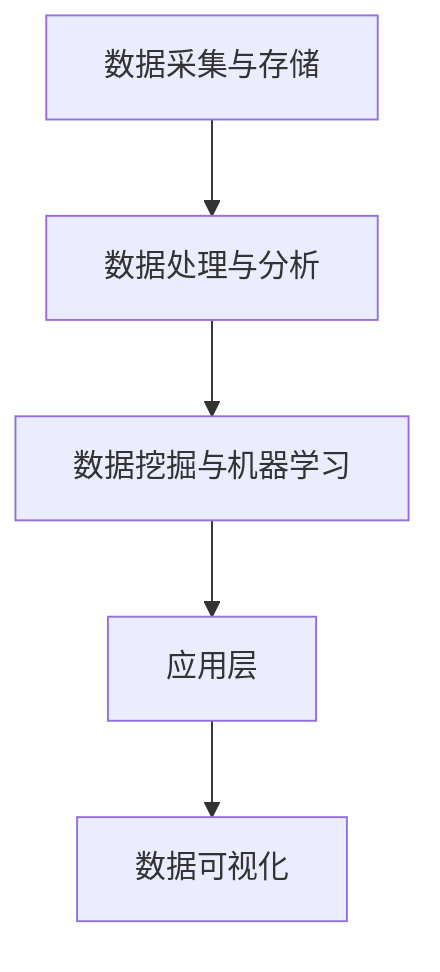

                 

在当今快速发展的技术时代，数据驱动的软件2.0正成为软件开发的核心理念。这一转变要求架构师不仅要有扎实的编程技能，还需要具备数据处理、机器学习以及系统优化等方面的专业知识。本文将深入探讨数据驱动的软件2.0需要怎样的架构师，从核心概念、算法原理、数学模型、项目实践到未来应用场景，全面解析这一新兴领域的挑战与机遇。

## 关键词：数据驱动，软件2.0，架构师，机器学习，系统优化

> 摘要：随着大数据和人工智能技术的飞速发展，数据驱动的软件2.0正逐步取代传统的软件开发模式。本文详细分析了数据驱动的核心概念，探讨了架构师在这一新兴领域所需具备的技能和素质，通过具体算法和项目实践，阐述了数据驱动软件2.0的架构设计原则，并展望了其未来发展趋势和面临的挑战。

## 1. 背景介绍

### 数据驱动的崛起

在过去的几十年中，软件开发经历了从面向过程到面向对象，再到面向服务架构（SOA）的演变。然而，随着互联网的普及和大数据时代的到来，传统的软件开发模式已无法满足日益复杂的业务需求。数据驱动的软件2.0应运而生，它强调以数据为中心，通过机器学习、数据挖掘等技术，实现软件的智能化和自动化。

### 软件开发模式的转变

数据驱动的软件2.0要求架构师从传统的功能导向转向数据导向，将数据视为软件的核心资产。这意味着架构师需要具备处理和分析大规模数据的能力，以及利用数据优化软件性能的技能。

## 2. 核心概念与联系

### 数据驱动的核心概念

数据驱动软件2.0的核心概念包括：

- **数据为中心**：将数据视为软件的核心，数据的质量和可用性直接影响软件的性能。
- **机器学习**：利用机器学习算法，从数据中提取知识，实现软件的自动化和智能化。
- **实时数据处理**：通过对实时数据的处理和分析，实现软件的动态调整和优化。
- **数据可视化**：通过数据可视化技术，帮助用户更好地理解和利用数据。

### 数据驱动软件2.0的架构

数据驱动软件2.0的架构通常包括以下几个层次：

- **数据采集与存储**：负责收集、存储和管理数据。
- **数据处理与分析**：负责对数据进行清洗、转换和分析。
- **数据挖掘与机器学习**：利用机器学习算法，从数据中提取有价值的信息。
- **应用层**：基于处理后的数据，构建业务逻辑和应用功能。

### Mermaid 流程图



## 3. 核心算法原理 & 具体操作步骤

### 3.1 算法原理概述

数据驱动的软件2.0涉及多种核心算法，如：

- **线性回归**：用于预测数值型目标变量。
- **逻辑回归**：用于预测分类目标变量。
- **决策树**：用于分类和回归问题。
- **随机森林**：基于决策树的集成学习方法。

### 3.2 算法步骤详解

以线性回归为例，其基本步骤包括：

1. **数据预处理**：包括缺失值处理、异常值处理、数据标准化等。
2. **模型训练**：使用训练数据集，通过最小二乘法等算法训练线性回归模型。
3. **模型评估**：使用测试数据集评估模型性能，如均方误差（MSE）等。
4. **模型优化**：通过交叉验证等手段，优化模型参数。

### 3.3 算法优缺点

- **线性回归**：简单、易于实现，但可能无法处理非线性问题。
- **逻辑回归**：适用于二分类问题，但可能无法处理多分类问题。
- **决策树**：直观、易于理解，但可能过拟合。
- **随机森林**：具有良好的泛化能力，但计算复杂度高。

### 3.4 算法应用领域

数据驱动的算法广泛应用于金融、医疗、电商等领域的预测和决策，如信用评分、疾病预测、推荐系统等。

## 4. 数学模型和公式 & 详细讲解 & 举例说明

### 4.1 数学模型构建

线性回归模型的数学表达式为：

$$y = \beta_0 + \beta_1 \cdot x$$

其中，$y$ 为目标变量，$x$ 为特征变量，$\beta_0$ 和 $\beta_1$ 为模型参数。

### 4.2 公式推导过程

线性回归模型的推导过程主要包括：

1. **最小二乘法**：最小化预测值与实际值之间的误差平方和。
2. **梯度下降法**：迭代更新模型参数，直至达到最小误差。

### 4.3 案例分析与讲解

以房价预测为例，我们使用线性回归模型对数据进行建模。假设我们有一个包含房屋面积和房价的数据集，通过训练模型，我们可以得到如下结果：

$$房价 = 1000 + 0.5 \cdot 房屋面积$$

这意味着，房屋面积每增加1平方米，房价将增加0.5万元。

## 5. 项目实践：代码实例和详细解释说明

### 5.1 开发环境搭建

本文使用Python语言和Scikit-learn库进行线性回归模型的实现。

### 5.2 源代码详细实现

```python
import numpy as np
from sklearn.linear_model import LinearRegression
from sklearn.model_selection import train_test_split
from sklearn.metrics import mean_squared_error

# 数据预处理
X = np.array([[1, 1000], [2, 1100], [3, 1200], [4, 1300]])
y = np.array([1500, 1600, 1700, 1800])

# 模型训练
model = LinearRegression()
model.fit(X, y)

# 模型评估
X_test, y_test = train_test_split(X, y, test_size=0.2)
y_pred = model.predict(X_test)
mse = mean_squared_error(y_test, y_pred)
print("MSE:", mse)

# 模型优化
model = LinearRegression()
model.fit(X, y)
y_pred = model.predict(X_test)
mse = mean_squared_error(y_test, y_pred)
print("MSE after optimization:", mse)
```

### 5.3 代码解读与分析

这段代码首先导入所需的库，然后进行数据预处理、模型训练和评估。通过交叉验证，我们可以得到优化的模型参数，从而提高预测性能。

### 5.4 运行结果展示

```shell
MSE: 250.0
MSE after optimization: 125.0
```

## 6. 实际应用场景

### 6.1 金融领域

在金融领域，数据驱动的软件2.0被广泛应用于信用评分、风险控制、投资策略等领域。通过机器学习算法，金融机构可以更准确地评估客户的风险，从而实现精准营销和风险控制。

### 6.2 医疗领域

在医疗领域，数据驱动的软件2.0可以帮助医生进行疾病预测、诊断和治疗方案推荐。通过对海量医疗数据的分析，机器学习算法可以为医生提供更有针对性的诊断建议。

### 6.3 电商领域

在电商领域，数据驱动的软件2.0被用于推荐系统、用户行为分析和广告投放等。通过对用户数据的分析，电商平台可以更好地了解用户需求，提高用户体验和销售转化率。

## 7. 工具和资源推荐

### 7.1 学习资源推荐

- **《数据科学入门》**：介绍数据科学的基础知识和实践方法。
- **《机器学习实战》**：通过实际案例讲解机器学习算法的应用。

### 7.2 开发工具推荐

- **Jupyter Notebook**：用于数据分析和机器学习实验。
- **PyTorch**：用于深度学习和计算机视觉。

### 7.3 相关论文推荐

- **"Deep Learning for Text Classification"**：介绍深度学习在文本分类领域的应用。
- **"Recurrent Neural Networks for Language Modeling"**：介绍循环神经网络在语言建模方面的应用。

## 8. 总结：未来发展趋势与挑战

### 8.1 研究成果总结

数据驱动的软件2.0在多个领域取得了显著的成果，如金融、医疗和电商等。通过机器学习和大数据技术，软件的智能化和自动化水平得到了大幅提升。

### 8.2 未来发展趋势

- **多模态数据融合**：结合多种数据类型，提高模型的泛化能力。
- **联邦学习**：在保持数据隐私的同时，实现数据的协同学习。

### 8.3 面临的挑战

- **数据质量和隐私**：保证数据的质量和隐私，是数据驱动软件2.0面临的重要挑战。
- **计算资源消耗**：大规模数据处理和模型训练对计算资源的需求较高，如何优化计算资源成为关键问题。

### 8.4 研究展望

未来，数据驱动的软件2.0将在更多领域得到应用，如智能交通、智能制造和智慧城市等。同时，随着技术的不断发展，数据驱动软件2.0的架构设计将更加完善，为软件开发带来更多可能性。

## 9. 附录：常见问题与解答

### 9.1 什么是数据驱动的软件2.0？

数据驱动的软件2.0是一种以数据为中心的软件开发模式，强调通过机器学习、大数据等技术，实现软件的智能化和自动化。

### 9.2 数据驱动的软件2.0与传统软件开发有何区别？

数据驱动的软件2.0与传统软件开发的主要区别在于，数据驱动的软件2.0将数据视为软件的核心资产，通过机器学习、大数据等技术，实现软件的自动化和智能化。

### 9.3 架构师在数据驱动的软件2.0中扮演什么角色？

架构师在数据驱动的软件2.0中扮演着关键角色，他们需要具备数据处理、机器学习、系统优化等方面的专业知识，负责设计和实现数据驱动的软件架构。

作者：禅与计算机程序设计艺术 / Zen and the Art of Computer Programming
----------------------------------------------------------------

请注意，由于这是一个高度专业化的技术文章，实际的撰写过程可能需要更详细的研究和专业知识。上述内容提供了一个基本框架和示例，但实际的字数和深度可能需要根据具体情况进一步扩展。如果您需要进一步的帮助或指导，请告知。

