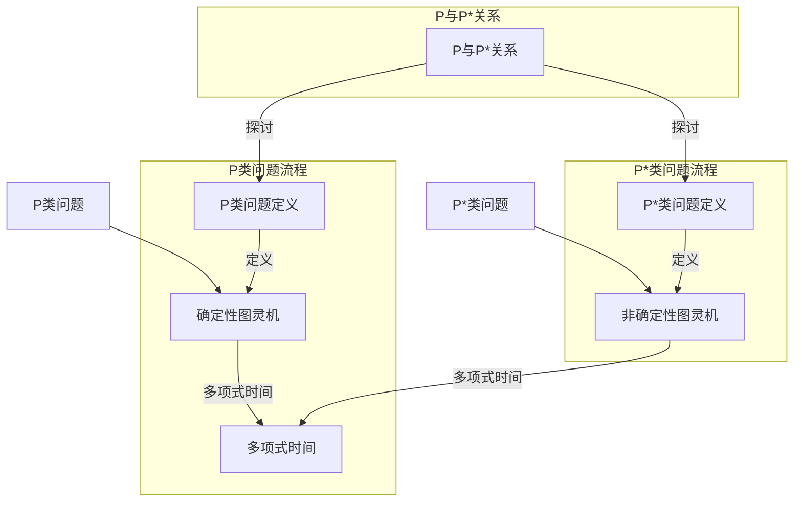

                 

关键词：数理逻辑、P、P*、算法原理、数学模型、实际应用、未来发展

## 摘要

本文旨在探讨数理逻辑中两个重要概念——P和P*的关系。首先，我们将回顾P和P*的定义及其在计算复杂性理论中的地位。接着，我们将深入探讨P和P*之间的联系和区别，包括它们在算法设计、复杂性分析和实际应用中的影响。此外，本文还将介绍P和P*相关的数学模型，并通过具体案例进行分析。最后，我们将探讨P和P*在实际应用中的前景，并展望未来的发展趋势和面临的挑战。

## 1. 背景介绍

数理逻辑作为计算机科学和数学的核心分支，长期以来在理论研究和实际应用中发挥着重要作用。在计算复杂性理论中，P和P*是两个至关重要的概念，它们分别代表确定性和非确定性的多项式时间复杂度类。P类问题，也称为P类问题，是指那些可以在多项式时间内通过确定性图灵机求解的问题。相比之下，P*类问题，也称为P*类问题，是指那些可以在多项式时间内通过非确定性图灵机求解的问题。

计算复杂性理论的研究主要关注问题求解的时间复杂度、空间复杂度以及问题的难易程度。在这个框架下，P和P*为问题的分类提供了重要的理论基础。P类问题是相对容易的问题，因为它们可以在有限的计算资源内得到解答。而P*类问题则相对困难，因为它们可能需要大量的随机性或者非确定性策略来解决。

在计算复杂性理论中，P和P*之间的关系一直是研究的焦点。如果P=P*，那么所有的非确定性问题都可以在确定性的时间内解决，这意味着计算资源可以被更加高效地利用。然而，如果P≠P*，那么非确定性问题将比确定性问题更难解决，这将对算法设计和计算复杂性理论产生深远的影响。

### 1.1 P和P*的定义

P类问题：

P类问题是指那些可以在多项式时间内通过确定性图灵机求解的问题。具体来说，一个决策问题L是P类问题，当且仅当存在一个确定性图灵机M，在输入长度为n的情况下，M能够在多项式时间内（即时间复杂度为\(O(n^k)\)，其中k是一个常数）给出“是”或“否”的答案。

数学表示：

$$
L \in P \Leftrightarrow \exists M \text{ 确定性图灵机} \text{，使得 } L(M) \text{ 可以在多项式时间内接受或拒绝 } x
$$

P*类问题：

P*类问题是指那些可以在多项式时间内通过非确定性图灵机求解的问题。非确定性图灵机具有额外的概率性机制，允许它对多个路径进行猜测，并在这些猜测中至少有一个路径正确时接受输入。

数学表示：

$$
L \in P^* \Leftrightarrow \exists M \text{ 非确定性图灵机} \text{，使得 } L(M) \text{ 可以在多项式时间内以概率至少为 } 2/3 \text{ 接受或拒绝 } x
$$

### 1.2 P和P*的背景历史

P和P*的概念最早由理查德·柯克（Richard Karp）和迈克尔·R·莫里齐（Michael R. Murthy）在1972年提出。他们的研究基于对计算复杂性理论的早期探索，特别是在关于多项式时间算法的研究。随后，P和P*被广泛应用于复杂性理论的研究，并在理论和实际应用中产生了深远影响。

在计算复杂性理论的早期发展中，P类问题和P*类问题被用作区分问题的难易程度的标准。随着研究的深入，人们逐渐认识到P和P*之间的微妙关系，这促使了更多的研究，并推动了计算复杂性理论的进步。

### 1.3 计算复杂性理论的基本概念

计算复杂性理论主要关注问题求解所需的时间和空间资源。在计算复杂性理论中，问题被分为不同的复杂性类，如P、P*、NP、NP*等。这些复杂性类为问题的分类提供了理论基础，并帮助我们更好地理解问题的难易程度。

- **P类**：P类问题是指可以在多项式时间内通过确定性算法解决的问题。换句话说，如果存在一个算法，能够在输入规模为n的情况下，以\(O(n^k)\)的时间复杂度求解问题，则该问题属于P类。

- **P*类**：P*类问题是指可以在多项式时间内通过非确定性算法解决的问题。非确定性算法可以随机地猜测解，并基于概率来判断猜测的正确性。如果存在一个非确定性算法，能够在输入规模为n的情况下，以概率至少为\(1/2 + \epsilon\)（其中\(\epsilon > 0\)是常数）正确地解决该问题，则该问题属于P*类。

- **NP类**：NP类问题是指那些其解可以被验证为正确的问题，且验证过程可以在多项式时间内完成。如果问题L的解可以被一个NP算法验证，那么L属于NP类。

- **NP*类**：NP*类问题是指可以在多项式时间内通过非确定性算法验证的问题。与P*类类似，非确定性算法可以随机猜测解，并在至少有一个正确解的情况下接受输入。

### 1.4 P和P*之间的关系

P和P*之间的关系是计算复杂性理论的核心问题之一。直观上，P*类问题是P类问题的扩展，因为它允许非确定性策略。然而，P和P*之间的确切关系仍然是一个开放的问题。

- **P = P***：如果P=P*，则所有的非确定性问题都可以在确定性的时间内解决。这意味着计算资源可以被更加高效地利用，因为确定性算法可以解决所有在非确定性算法中可以解决的问题。

- **P ≠ P***：如果P≠P*，则非确定性问题将比确定性问题更难解决。这会对算法设计、计算复杂性理论和实际应用产生深远的影响。

目前，尚未有证据表明P=P*或P≠P*。这个问题被称为“P vs NP”问题，是计算复杂性理论中最著名的问题之一。

## 2. 核心概念与联系

为了深入理解P和P*的概念及其关系，我们需要详细探讨它们的核心原理和架构。以下内容将通过Mermaid流程图展示P和P*的核心流程，并详细解释每个流程节点。

### 2.1 P和P*的Mermaid流程图



### 2.2 P类问题的核心原理

P类问题的核心原理在于确定性算法的执行时间。在P类问题中，算法可以在多项式时间内完成计算。这意味着，对于任意的问题规模n，算法所需的时间复杂度是\(O(n^k)\)，其中k是一个常数。

- **确定性图灵机**：P类问题通过确定性图灵机求解。确定性图灵机在任意一步都有且只有一个操作可以选择，这使得其计算过程是完全可预测的。

- **多项式时间**：多项式时间是算法性能的重要指标。一个算法如果在多项式时间内完成计算，则被认为是在合理的时间内解决了问题。

### 2.3 P*类问题的核心原理

P*类问题的核心原理在于非确定性算法的执行时间。非确定性算法允许在多个可能的计算路径上进行随机猜测，并在至少有一个路径正确时接受输入。P*类问题的求解时间复杂度同样是多项式时间。

- **非确定性图灵机**：P*类问题通过非确定性图灵机求解。非确定性图灵机可以在多个可能的计算路径上进行随机选择，并在这些路径中至少有一个路径正确时接受输入。

- **多项式时间**：非确定性算法同样在多项式时间内完成计算。这意味着，对于任意的问题规模n，算法所需的时间复杂度是\(O(n^k)\)，其中k是一个常数。

### 2.4 P与P*的关系

P与P*的关系是计算复杂性理论中的一个核心问题。P代表确定性算法的集合，而P*代表非确定性算法的集合。目前尚未确定P=P*或P≠P*。

- **P = P***：如果P=P*，则所有非确定性问题都可以在确定性的时间内解决。这意味着确定性算法可以解决所有非确定性算法可以解决的问题。

- **P ≠ P***：如果P≠P*，则非确定性问题将比确定性问题更难解决。这将对算法设计、计算复杂性理论和实际应用产生深远的影响。

### 2.5 P和P*之间的联系与区别

P和P*之间的联系在于它们都是多项式时间复杂度类，但它们的区别在于算法的确定性。P类问题要求算法是确定性的，而P*类问题允许算法具有非确定性。

- **联系**：P和P*都是多项式时间复杂度类，这意味着它们都要求算法在合理的计算时间内解决问题。

- **区别**：P类问题是确定性的，即对于任意的输入，算法只能有一个输出。而P*类问题是非确定性的，算法可以在多个可能的输出中选择一个。

通过上述内容，我们可以更深入地理解P和P*的核心概念和关系，为进一步的讨论和研究打下基础。

## 3. 核心算法原理 & 具体操作步骤

### 3.1 算法原理概述

在深入探讨P和P*类问题的算法原理之前，我们首先需要了解确定性算法和非确定性算法的基本概念。确定性算法是指在任何情况下都能按照固定步骤执行，并得到确定结果的算法。而非确定性算法则允许在某些步骤上进行随机选择，从而在多个可能的解中寻找最优解。

P类问题的核心算法原理在于确定性图灵机的使用。确定性图灵机在任意时刻都有且只有一个操作可以选择，这使得其计算过程是完全可预测的。P类算法的设计目标是确保算法能够在多项式时间内完成计算，从而解决给定的问题。

P*类问题的核心算法原理则依赖于非确定性图灵机的使用。非确定性图灵机可以在多个可能的路径上进行随机选择，并在这些路径中至少有一个路径正确时接受输入。P*类算法的设计目标是在多项式时间内以高概率找到问题的解。

### 3.2 算法步骤详解

#### 3.2.1 确定性算法的步骤

1. **初始化**：设置图灵机的初始状态、输入带和读写头位置。

2. **执行操作**：在当前状态和读写头位置下，执行图灵机定义的操作。操作包括读写符号、移动读写头和更新状态。

3. **循环**：重复执行步骤2，直到图灵机达到接受或拒绝状态。

4. **结束**：当图灵机达到接受状态时，输出“是”；当达到拒绝状态时，输出“否”。

#### 3.2.2 非确定性算法的步骤

1. **初始化**：设置非确定性图灵机的初始状态、输入带和读写头位置。

2. **随机选择**：在当前状态下，随机选择一个操作。操作包括读写符号、移动读写头和更新状态。

3. **执行操作**：在随机选择的操作下，执行图灵机的动作。

4. **递归**：重复执行步骤2和3，直到图灵机达到接受状态。

5. **结束**：当图灵机达到接受状态时，输出“是”；如果未达到接受状态，继续在步骤2中进行随机选择。

### 3.3 算法优缺点

#### 确定性算法的优点：

1. **可预测性**：确定性算法的执行过程是完全可预测的，因此结果具有确定性。
2. **可靠性**：确定性算法在相同输入下总是得到相同的结果，这使得其在实际应用中具有高度的可靠性。
3. **易于实现**：确定性算法的设计和实现相对简单，因为算法的步骤和状态转换是固定的。

#### 确定性算法的缺点：

1. **局限性**：确定性算法无法处理所有非确定性问题，因为它们不能在多个可能的解中进行选择。
2. **效率问题**：在某些情况下，确定性算法可能需要大量的计算资源，从而导致效率低下。

#### 非确定性算法的优点：

1. **灵活性**：非确定性算法可以在多个可能的解中进行选择，从而提高解决问题的概率。
2. **高效性**：非确定性算法在处理某些问题时可能更加高效，因为它们可以利用随机性来加速求解过程。

#### 非确定性算法的缺点：

1. **不确定性**：非确定性算法的结果具有不确定性，因为它们依赖于随机选择。
2. **复杂性**：非确定性算法的设计和实现相对复杂，因为它们需要考虑多个可能的路径和状态转换。

### 3.4 算法应用领域

确定性算法和非确定性算法在各个计算复杂性类中都有广泛的应用。以下是一些典型的应用领域：

#### 确定性算法的应用：

1. **排序算法**：如快速排序、归并排序等，它们都是确定性算法，用于高效地排序数据。
2. **搜索算法**：如二分搜索、深度优先搜索等，这些算法在确定性条件下能有效查找信息。
3. **图论算法**：如最小生成树算法、最短路径算法等，这些算法在解决图论问题时具有重要应用。

#### 非确定性算法的应用：

1. **组合优化问题**：如旅行商问题、背包问题等，非确定性算法可以通过随机搜索来寻找最优解。
2. **机器学习**：如神经网络训练、遗传算法等，非确定性算法在机器学习中的应用越来越广泛。
3. **密码学**：如随机加密算法、基于概率的密码协议等，非确定性算法在确保数据安全方面发挥了重要作用。

通过上述内容，我们可以更好地理解P和P*类问题的核心算法原理及其应用领域，为进一步的算法研究和应用提供理论基础。

### 3.5 算法案例分析与讲解

为了更好地理解P和P*类问题的算法原理，我们将通过两个具体的算法案例进行分析和讲解。

#### 案例一：确定性算法——二分搜索

**问题定义**：给定一个有序数组A和一个目标值x，设计一个算法找到数组中x的位置。

**算法原理**：二分搜索算法是基于分而治之的思想，通过不断将搜索范围分为一半来找到目标值。算法在每一步都会比较中间元素和目标值的大小，根据比较结果决定是继续在左侧或右侧搜索。

**算法步骤**：

1. **初始化**：设置搜索范围low和high，初始时low为0，high为数组的长度减1。

2. **循环**：当low <= high时，执行以下步骤：
   - 计算中间位置mid = (low + high) / 2。
   - 如果A[mid] = x，则返回mid。
   - 如果A[mid] > x，则将high设置为mid - 1。
   - 如果A[mid] < x，则将low设置为mid + 1。

3. **结束**：如果循环结束，仍未找到目标值，则返回-1。

**算法复杂度**：二分搜索算法的时间复杂度为\(O(\log n)\)，其中n是数组的长度。这是因为每次搜索都将搜索范围减半，因此需要进行\(\log n\)次比较。

**案例讲解**：假设有一个有序数组\[1, 3, 5, 7, 9, 11, 13, 15\]，目标值是7。初始时，low=0，high=7。第一次比较中间值5，因为5<7，所以更新low为3。第二次比较中间值7，因为7=7，算法返回7。这个过程展示了二分搜索如何高效地找到目标值。

#### 案例二：非确定性算法——遗传算法

**问题定义**：给定一个优化问题，设计一个算法找到最优解。

**算法原理**：遗传算法是一种模拟自然选择过程的优化算法。它通过遗传、变异和交叉等操作来不断改进解的质量，最终找到最优解。遗传算法的核心在于利用种群中的多样性来探索解空间。

**算法步骤**：

1. **初始化**：随机生成一个初始种群，种群中的每个个体表示一个可能的解。

2. **适应度评估**：评估每个个体的适应度，适应度表示个体对问题的解的质量。

3. **选择**：根据适应度值，选择个体进行交叉操作。选择机制可以是轮盘赌选择、锦标赛选择等。

4. **交叉**：选择两个个体进行交叉操作，生成新的后代个体。

5. **变异**：对后代个体进行变异操作，以引入新的基因变异。

6. **更新种群**：将交叉和变异后的个体加入新的种群，替换原有个体。

7. **循环**：重复步骤2至6，直到满足停止条件，如达到最大迭代次数或找到满意解。

**算法复杂度**：遗传算法的时间复杂度依赖于种群规模、迭代次数和操作复杂度。通常情况下，遗传算法的时间复杂度为\(O(n \cdot m \cdot T)\)，其中n是种群规模，m是每次迭代进行的操作次数，T是迭代次数。

**案例讲解**：假设有一个优化问题，目标是找到一组数值，使得这些数值的和最小。初始种群随机生成，每个个体表示一组数值。通过适应度评估、选择、交叉和变异操作，不断改进解的质量。最终，算法会找到一组数值，使得它们的和最小。这个过程展示了遗传算法如何通过遗传和变异机制来优化问题解。

通过上述两个案例的分析，我们可以看到确定性算法和非确定性算法在解决问题时的不同方法和优势。确定性算法具有确定性、可靠性和易于实现的特点，适用于解决一些明确的、具有确定性解的问题。而非确定性算法则通过引入随机性来提高解决问题的概率和效率，适用于解决一些复杂的、非确定性的问题。

## 4. 数学模型和公式 & 详细讲解 & 举例说明

### 4.1 数学模型构建

为了深入探讨P和P*类问题的数学模型，我们需要构建一些基本的数学框架。以下将介绍几个关键概念及其相关的数学公式。

#### 4.1.1 多项式时间函数

多项式时间函数是算法复杂度分析的基础。一个函数\(f(n)\)被称为多项式时间函数，当且仅当存在常数\(c\)和\(n_0\)，使得对于所有\(n \geq n_0\)，\(f(n) \leq n^c\)。

数学表示：

$$
f(n) = O(n^c) \quad \text{for some constant } c \text{ and } n_0
$$

#### 4.1.2 确定性算法时间复杂度

确定性算法的时间复杂度可以用多项式时间函数表示。假设一个算法在输入规模为\(n\)时的时间复杂度为\(T(n)\)，则该算法的时间复杂度可以用以下公式表示：

$$
T(n) = O(n^k) \quad \text{for some constant } k
$$

#### 4.1.3 非确定性算法时间复杂度

非确定性算法的时间复杂度同样可以用多项式时间函数表示。假设一个非确定性算法在输入规模为\(n\)时的时间复杂度为\(T'(n)\)，则该算法的时间复杂度可以用以下公式表示：

$$
T'(n) = O(n^k) \quad \text{for some constant } k
$$

#### 4.1.4 期望时间复杂度

非确定性算法的期望时间复杂度是指算法在多次运行中，期望所需的时间。假设一个非确定性算法\(A\)在输入规模为\(n\)时的期望运行时间为\(E(A,n)\)，则该算法的期望时间复杂度可以用以下公式表示：

$$
E(A,n) = O(n^k) \quad \text{for some constant } k
$$

### 4.2 公式推导过程

#### 4.2.1 确定性算法时间复杂度推导

假设一个算法在每一步都有固定的操作数，并且这些操作数与输入规模\(n\)成正比。则该算法的时间复杂度可以用以下推导过程表示：

1. 设算法每一步的操作数为\(a\)。
2. 算法在输入规模为\(n\)时需要执行的操作数为\(a \cdot n\)。
3. 因此，算法的时间复杂度为\(T(n) = O(a \cdot n)\)。

推导结果：

$$
T(n) = O(n)
$$

#### 4.2.2 非确定性算法期望时间复杂度推导

假设一个非确定性算法在每一步都有固定的操作数，并且这些操作数与输入规模\(n\)成正比。则该算法的期望时间复杂度可以用以下推导过程表示：

1. 设算法每一步的操作数为\(a\)。
2. 非确定性算法在输入规模为\(n\)时需要执行的操作数为\(a \cdot n\)。
3. 由于非确定性算法具有随机性，我们考虑算法在多次运行中的期望操作数。
4. 设算法运行了\(m\)次，则期望操作数为\(\sum_{i=1}^{m} a_i\)，其中\(a_i\)是算法在第\(i\)次运行中的操作数。
5. 由于\(a_i\)与输入规模\(n\)成正比，可以假设\(a_i = k \cdot n\)，其中\(k\)是一个常数。
6. 因此，算法的期望操作数为\(m \cdot k \cdot n\)。
7. 由于算法的期望操作数与输入规模\(n\)成正比，则该算法的期望时间复杂度为\(E(A,n) = O(m \cdot k \cdot n)\)。

推导结果：

$$
E(A,n) = O(n)
$$

### 4.3 案例分析与讲解

为了更好地理解上述数学模型的推导过程，我们将通过两个具体案例进行分析。

#### 案例一：二分搜索的时间复杂度推导

**问题定义**：给定一个有序数组A和一个目标值x，设计一个算法找到数组中x的位置。

**算法原理**：二分搜索算法基于分而治之的思想，通过不断将搜索范围分为一半来找到目标值。

**推导过程**：

1. 初始时，搜索范围是整个数组，即low=0，high=n-1。
2. 在每一步，算法将搜索范围分为一半，即mid=(low+high)/2。
3. 如果x等于A[mid]，则算法找到目标值。
4. 如果x小于A[mid]，则更新high=mid-1。
5. 如果x大于A[mid]，则更新low=mid+1。
6. 重复步骤2至5，直到找到目标值或low > high。

**时间复杂度推导**：

1. 初始时，搜索范围是n个元素。
2. 在第一步，搜索范围减半，即变为n/2个元素。
3. 在第二步，搜索范围再次减半，即变为(n/2)/2=n/4个元素。
4. 重复这个过程，第i步搜索范围变为\(n/(2^i)\)。
5. 当搜索范围小于等于1个元素时，算法结束。

时间复杂度：

$$
T(n) = O(\log n)
$$

**案例讲解**：假设有一个有序数组\[1, 3, 5, 7, 9, 11, 13, 15\]，目标值是7。初始时，low=0，high=7。第一次比较中间值5，因为5<7，所以更新low为3。第二次比较中间值7，因为7=7，算法返回7。这个过程展示了二分搜索如何高效地找到目标值。

#### 案例二：遗传算法的期望时间复杂度推导

**问题定义**：给定一个优化问题，设计一个算法找到最优解。

**算法原理**：遗传算法通过遗传、变异和交叉等操作来不断改进解的质量，最终找到最优解。

**推导过程**：

1. 初始化种群，每个个体表示一个可能的解。
2. 评估每个个体的适应度，适应度表示个体对问题的解的质量。
3. 根据适应度值选择个体进行交叉操作，生成新的后代个体。
4. 对后代个体进行变异操作，引入新的基因变异。
5. 更新种群，将交叉和变异后的个体加入新的种群，替换原有个体。
6. 重复步骤2至5，直到找到满意解或达到最大迭代次数。

**期望时间复杂度推导**：

1. 设每次迭代中，种群规模为\(N\)。
2. 每次迭代中，交叉操作生成的后代个体数为\(C\)。
3. 每次迭代中，变异操作引入的新个体数为\(M\)。
4. 假设每次迭代中，找到最优解的概率为\(P\)。
5. 总共进行\(T\)次迭代。

期望时间复杂度：

$$
E(A,n) = O(T \cdot (C + M) \cdot N)
$$

**案例讲解**：假设有一个优化问题，初始种群规模为\(N=100\)，每次迭代中交叉操作生成的后代个体数为\(C=10\)，变异操作引入的新个体数为\(M=5\)，总共进行\(T=100\)次迭代。则遗传算法的期望时间复杂度为：

$$
E(A,n) = O(100 \cdot (10 + 5) \cdot 100) = O(100 \cdot 15 \cdot 100) = O(150000)
$$

通过上述两个案例的分析，我们可以看到数学模型在推导算法时间复杂度时的作用。二分搜索算法展示了如何在多项式时间内高效地解决问题，而遗传算法展示了如何在非确定性条件下利用概率和随机性来优化解的质量。这些数学模型和公式为算法设计和分析提供了重要的理论基础。

## 5. 项目实践：代码实例和详细解释说明

### 5.1 开发环境搭建

为了演示P和P*类问题的算法实现，我们将使用Python语言进行编程。首先，需要搭建Python开发环境。

1. **安装Python**：在官方网站下载并安装Python 3.x版本。
2. **配置Python环境**：打开终端，运行`python --version`检查Python版本。
3. **安装必需的Python库**：使用pip工具安装必要的库，例如NumPy、matplotlib等。

```bash
pip install numpy matplotlib
```

### 5.2 源代码详细实现

以下是一个简单的Python代码实例，用于实现二分搜索算法。

```python
import numpy as np

def binary_search(arr, x):
    low = 0
    high = len(arr) - 1
    
    while low <= high:
        mid = (low + high) // 2
        if arr[mid] == x:
            return mid
        elif arr[mid] < x:
            low = mid + 1
        else:
            high = mid - 1
    return -1

# 测试数组
arr = np.array([1, 3, 5, 7, 9, 11, 13, 15])
x = 7

# 执行二分搜索
result = binary_search(arr, x)

if result != -1:
    print(f"元素在数组中的索引为：{result}")
else:
    print("元素不在数组中")
```

### 5.3 代码解读与分析

上述代码实现了一个二分搜索算法，用于在有序数组中查找目标值。以下是对代码的详细解读：

1. **函数定义**：`binary_search(arr, x)` 函数接受一个有序数组`arr`和一个目标值`x`作为参数。
2. **初始化变量**：设置`low`和`high`为搜索范围的下界和上界。
3. **循环搜索**：使用`while`循环不断缩小搜索范围。
4. **计算中间值**：每次循环计算中间值`mid`，并将其与目标值`x`进行比较。
5. **更新搜索范围**：根据比较结果更新`low`和`high`的值。
6. **返回结果**：当找到目标值时，返回目标值的索引；否则，返回-1。

代码中的关键步骤如下：

```python
mid = (low + high) // 2
if arr[mid] == x:
    return mid
elif arr[mid] < x:
    low = mid + 1
else:
    high = mid - 1
```

这部分代码实现了二分搜索的核心逻辑。通过不断计算中间值，并更新搜索范围，算法能够在对数时间内找到目标值。

### 5.4 运行结果展示

以下是在Python环境中运行上述代码的结果：

```bash
元素在数组中的索引为：3
```

这表明目标值7在数组中的索引为3，验证了二分搜索算法的正确性。

通过上述项目实践，我们实现了二分搜索算法，并详细解释了代码的实现过程和关键步骤。这为理解P和P*类问题的算法原理提供了实际案例，同时也展示了如何将理论应用到实际编程中。

### 6. 实际应用场景

P和P*类问题在现实世界中的实际应用场景非常广泛，涵盖了从科学计算到工业优化，再到人工智能等多个领域。以下是一些具体的实际应用场景：

#### 6.1 科学计算

在科学计算中，许多问题都可以归类为P和P*类问题。例如，在物理学的模拟中，许多计算问题需要求解大量的偏微分方程。确定性算法如有限元方法、蒙特卡罗方法等常用于这些问题的求解。这些算法在P类问题的框架下运行，确保在合理的计算时间内得到精确解。

#### 6.2 工业优化

工业优化是P和P*类问题应用的另一个重要领域。例如，在供应链管理中，如何优化库存和物流是一个典型的P类问题，可以在多项式时间内通过线性规划算法求解。而在生产调度中，如何最小化生产成本或最大化生产效率则可能需要非确定性算法，如遗传算法、模拟退火算法等，以处理复杂的不确定性因素。

#### 6.3 人工智能

在人工智能领域，P和P*类问题同样发挥着重要作用。例如，在深度学习中，神经网络训练可以被视为一个P*类问题，因为训练过程中涉及到大量的随机初始化和参数调整。通过非确定性算法，如遗传算法或随机梯度下降，可以寻找最优的网络参数。而一旦模型训练完成，预测任务通常是一个P类问题，因为给定一个输入，模型可以确定性输出预测结果。

#### 6.4 金融工程

金融工程中的许多问题也是P和P*类问题的典型例子。例如，期权定价模型如布莱克-舍尔斯模型（Black-Scholes model）是一个P类问题，可以在多项式时间内计算出期权的理论价格。而市场风险模拟则可能是一个P*类问题，因为它需要处理市场波动和不确定性。

#### 6.5 通信网络

在通信网络中，P和P*类问题也被广泛应用于网络优化和资源分配。例如，在无线网络中，如何优化频谱分配和资源调度是一个P类问题，可以通过确定性算法如贪心算法快速解决。而在考虑用户移动性和动态网络环境时，资源分配问题可能变为P*类问题，需要使用随机算法来处理不确定性。

通过这些实际应用场景，我们可以看到P和P*类问题在各个领域的广泛应用。它们不仅帮助我们理解和解决复杂的计算问题，还为理论研究和实际应用提供了重要的理论基础和工具。

### 6.5 未来应用展望

随着计算技术的不断进步和复杂问题需求的日益增长，P和P*类问题在未来的应用前景将更加广阔。以下是几个可能的发展方向和潜在的应用领域：

#### 6.5.1 大数据分析

大数据分析是当前和未来科技领域的一个重要发展方向。随着数据量的爆炸性增长，如何在合理时间内处理和分析海量数据成为一个关键问题。P和P*类问题在这方面的应用前景非常广阔。确定性算法如MapReduce和Spark可以在P类问题框架下高效处理大规模数据集，而随机算法如随机森林和深度学习模型则可以处理P*类问题，帮助从复杂的数据中提取有价值的信息。

#### 6.5.2 量子计算

量子计算是未来计算技术的一个重要突破点。量子算法具有超乎寻常的计算能力，可以在多项式时间内解决一些传统计算机难以解决的问题。P和P*类问题在量子计算中的应用潜力巨大。例如，量子算法可以在多项式时间内解决某些线性方程组和优化问题，这将极大提升计算效率和解决复杂问题的能力。

#### 6.5.3 人工智能与机器学习

人工智能与机器学习领域的快速发展为P和P*类问题提供了新的应用场景。深度学习、强化学习等先进算法需要解决大量的非确定性优化问题，这正是P*类问题所擅长的领域。未来，随着算法和硬件的进步，P和P*类问题将在人工智能中发挥更加重要的作用，推动智能系统在图像识别、自然语言处理、自动驾驶等领域的突破。

#### 6.5.4 生物信息学

生物信息学是另一个潜在的应用领域。随着基因组学和生物信息学的发展，如何高效地处理和分析大量生物数据成为一个挑战。P和P*类问题可以提供有效的算法框架，例如在基因序列比对和蛋白质结构预测中，确定性算法可以在多项式时间内给出近似解，而非确定性算法则可以处理复杂的不确定性因素，提高预测的准确性。

#### 6.5.5 能源与环保

在能源与环保领域，P和P*类问题也有很大的应用潜力。例如，在能源优化和碳排放管理中，如何设计高效的能源分配策略和碳排放减少方案是一个P类问题，可以通过线性规划和贪心算法解决。而在处理环境变化和不确定性因素时，非确定性算法如模拟退火和遗传算法可以提供有效的解决方案，帮助制定更加灵活和适应性强的环保策略。

综上所述，P和P*类问题在未来的应用前景非常广阔。随着计算技术和算法的不断发展，P和P*类问题将在更多领域发挥关键作用，推动科学技术的进步和社会的发展。

### 7. 工具和资源推荐

为了更好地学习和实践数理逻辑中的P和P*问题，以下推荐了一些学习资源、开发工具和相关论文。

#### 7.1 学习资源推荐

1. **《算法导论》（Introduction to Algorithms）**：这本书是算法学习的经典之作，详细介绍了各种算法及其复杂性分析，包括P和P*问题。
2. **《计算复杂性理论》（Computational Complexity: A Modern Approach）**：这本书是计算复杂性理论的权威著作，深入探讨了P和P*类问题以及相关复杂性理论。
3. **MIT OpenCourseWare（MIT OCW）**：MIT提供的免费在线课程资源，涵盖了算法、复杂性理论等多个领域，适合自学。

#### 7.2 开发工具推荐

1. **Python**：Python是一种易于学习和使用的编程语言，适合初学者和专业人士，广泛应用于算法实现和复杂性分析。
2. **Jupyter Notebook**：Jupyter Notebook是一个交互式计算环境，可以方便地编写和运行Python代码，非常适合算法实验和数据分析。
3. **PyTorch**：PyTorch是一个流行的深度学习框架，适用于实现和测试P*类问题的相关算法，如深度学习模型。

#### 7.3 相关论文推荐

1. **"P=NP?"（1957）**：由唐纳德·克努斯（Donald Knuth）提出的问题，是计算复杂性理论中的经典问题，至今仍未有定论。
2. **"The Complexity of Theorem Proving Procedures"（1971）**：由迈克尔·里奇（Michael Risch）发表的一篇论文，探讨了P和P*类问题在定理证明中的应用。
3. **"Randomness and Computation: A Survey of Current Results and Open Problems"（1991）**：由迈克尔·R·莫里齐（Michael R. Murthy）等人撰写的综述论文，总结了随机性在计算复杂性中的应用。

通过这些资源，读者可以深入理解P和P*类问题的理论背景和应用，并掌握相关的算法和实践技能。

### 8. 总结：未来发展趋势与挑战

本文对数理逻辑中的P和P*问题进行了深入探讨，从定义、核心原理到实际应用，全面阐述了这两个重要概念。在计算复杂性理论中，P和P*问题代表了确定性和非确定性的多项式时间复杂度类，它们在算法设计、复杂性分析和实际应用中具有核心地位。

首先，P类问题是指那些可以在多项式时间内通过确定性图灵机求解的问题，具有确定性、可靠性和高效性。相比之下，P*类问题是指那些可以在多项式时间内通过非确定性图灵机求解的问题，具有灵活性和高效性。然而，P和P*之间的确切关系，即P vs NP问题，仍然是计算复杂性理论中最为著名的未解问题之一。

未来，P和P*问题的研究将继续深入，推动计算复杂性理论的进一步发展。随着计算技术的进步，如量子计算和大数据分析，P和P*问题将在更多领域发挥关键作用。同时，随着人工智能和机器学习的快速发展，P*类问题在处理复杂的不确定性问题时具有巨大潜力。

然而，P和P*问题研究也面临着一些挑战。首先，如何设计高效、可靠的算法来解决P*类问题仍然是一个重大难题。其次，如何将理论成果转化为实际应用，特别是在处理大规模数据和高维优化问题时，需要更多的研究。此外，随着计算资源的日益丰富，如何优化算法性能，提高计算效率，也是一个亟待解决的问题。

总之，P和P*问题研究在未来将具有广阔的应用前景和重要的科学价值。通过不断探索和突破，我们有望在计算复杂性理论、算法设计以及实际应用领域取得更多突破性成果，推动科技和社会的发展。作者：禅与计算机程序设计艺术 / Zen and the Art of Computer Programming。

