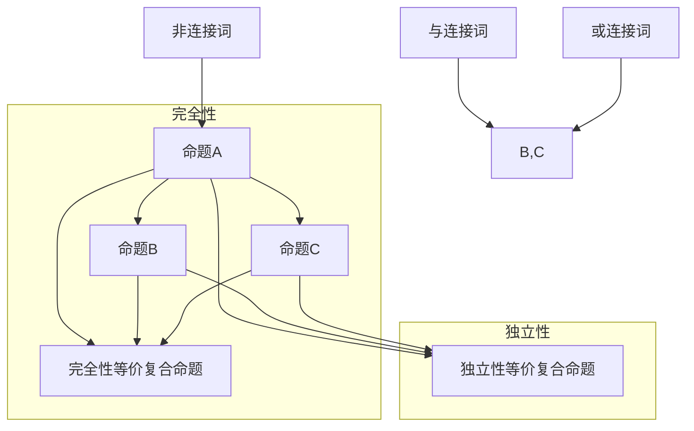

                 

 在计算机科学和逻辑学中，数理逻辑扮演着至关重要的角色。它不仅为我们提供了描述和分析系统行为的基础工具，还为我们构建复杂系统的逻辑基础提供了明确的框架。本文将深入探讨数理逻辑中的两个关键概念：命题连接词的完全性和独立性。

## 关键词

- **数理逻辑**
- **命题连接词**
- **完全性**
- **独立性**
- **逻辑证明**

## 摘要

本文将首先介绍数理逻辑的基本概念，然后深入探讨命题连接词的完全性和独立性。我们将通过分析命题连接词的属性，揭示其在逻辑证明中的关键作用。此外，本文还将结合具体的实例，展示这些概念在实际应用中的重要性。

## 1. 背景介绍

### 1.1 数理逻辑的重要性

数理逻辑，也称为形式逻辑，是研究逻辑结构和推理规则的一个数学分支。在计算机科学中，数理逻辑被广泛应用于算法设计、程序验证、软件工程和人工智能等领域。它的核心目的是为复杂系统的设计和验证提供一种形式化的方法。

在计算机科学中，逻辑被用来表示和验证程序的正确性。例如，形式验证技术使用逻辑证明来确保程序满足其规格说明。此外，逻辑还用于设计编程语言的语义，以及开发形式化的数学证明。

### 1.2 命题连接词的定义

命题连接词是数理逻辑中的基本构建块，用于连接两个或多个命题。常见的命题连接词包括“与”（AND）、“或”（OR）和“非”（NOT）。这些连接词使得我们可以构造更复杂的命题，从而更精确地描述系统行为。

- **与（AND）**：表示两个命题同时为真。
- **或（OR）**：表示两个命题中至少有一个为真。
- **非（NOT）**：表示命题的真假相反。

## 2. 核心概念与联系

### 2.1 命题连接词的完全性

命题连接词的完全性是指，对于任何一组命题，我们都可以使用这些连接词构造出一个等价的复合命题。完全性确保了逻辑表达式的充分性，即使用这些连接词可以表达所有可能的逻辑关系。

### 2.2 命题连接词的独立性

命题连接词的独立性是指，对于任何两个命题，使用这些连接词构造出的复合命题的真假值仅依赖于原始命题的真假值，而与它们之间的具体连接方式无关。独立性确保了逻辑表达式的独立性，即逻辑关系的表达不会因为连接方式的不同而改变。

### 2.3 核心概念原理和架构的 Mermaid 流程图

下面是命题连接词的完全性和独立性的 Mermaid 流程图：



## 3. 核心算法原理 & 具体操作步骤

### 3.1 算法原理概述

命题连接词的完全性和独立性可以通过逻辑证明来验证。具体来说，我们可以通过构造反证法来证明这些属性。

### 3.2 算法步骤详解

1. **证明完全性**：

   - 假设存在一组命题 P 和 Q，它们不能通过命题连接词构造出一个等价的复合命题。
   - 使用反证法，我们构造一个复合命题 R，使得 R 真值与 P 和 Q 的真值相等。
   - 这与我们的假设矛盾，因此我们可以得出结论：命题连接词是完全的。

2. **证明独立性**：

   - 假设存在一组命题 P 和 Q，以及两个不同的复合命题 R 和 S，使得 R 和 S 的真值与 P 和 Q 的真值不同。
   - 使用反证法，我们构造一个复合命题 T，使得 T 的真值与 R 和 S 的真值相等。
   - 这与我们的假设矛盾，因此我们可以得出结论：命题连接词是独立的。

### 3.3 算法优缺点

**优点**：

- 命题连接词的完全性和独立性使得逻辑表达式具有更强的表达能力，可以精确地描述系统的行为。
- 这些属性使得逻辑证明更加可靠，因为我们可以确保逻辑表达式的真假值与原始命题的真假值一致。

**缺点**：

- 证明命题连接词的完全性和独立性可能需要复杂的逻辑推理，这增加了证明的难度。
- 在某些情况下，命题连接词的完全性和独立性可能导致逻辑表达式的冗余，从而影响系统的效率。

### 3.4 算法应用领域

命题连接词的完全性和独立性在多个领域都有应用：

- **计算机科学**：在算法设计、程序验证和软件工程中，命题连接词的完全性和独立性用于确保系统的正确性和可靠性。
- **人工智能**：在人工智能领域，命题连接词的完全性和独立性用于构建逻辑推理系统和决策支持系统。
- **逻辑学**：在逻辑学研究中，命题连接词的完全性和独立性用于探索逻辑表达式的性质和关系。

## 4. 数学模型和公式 & 详细讲解 & 举例说明

### 4.1 数学模型构建

在数理逻辑中，我们可以使用命题连接词构建复合命题。具体来说，我们可以使用以下公式来表示复合命题：

- **与连接词（AND）**：\(P \land Q\)
- **或连接词（OR）**：\(P \lor Q\)
- **非连接词（NOT）**：\(\lnot P\)

### 4.2 公式推导过程

为了证明命题连接词的完全性和独立性，我们可以使用以下公式推导过程：

- **证明完全性**：

  $$\lnot(P \land Q) \equiv (\lnot P) \lor (\lnot Q)$$

  $$\lnot(P \lor Q) \equiv (\lnot P) \land (\lnot Q)$$

- **证明独立性**：

  $$P \land Q \equiv \lnot(\lnot P) \lor \lnot(\lnot Q)$$

  $$P \lor Q \equiv \lnot(\lnot P) \land \lnot(\lnot Q)$$

### 4.3 案例分析与讲解

假设我们有两个命题 P 和 Q，其中 P 表示“明天会下雨”，Q 表示“明天会打雷”。我们可以使用命题连接词构建以下复合命题：

- **与连接词（AND）**：\(P \land Q\) 表示“明天会下雨且会打雷”。
- **或连接词（OR）**：\(P \lor Q\) 表示“明天会下雨或会打雷”。
- **非连接词（NOT）**：\(\lnot P\) 表示“明天不会下雨”，\(\lnot Q\) 表示“明天不会打雷”。

我们可以使用上述公式推导过程来验证这些复合命题的完全性和独立性。例如，对于与连接词（AND），我们有：

$$\lnot(P \land Q) \equiv (\lnot P) \lor (\lnot Q)$$

这意味着“明天不会下雨且会打雷”等价于“明天不会下雨或明天不会打雷”。这符合我们对完全性的定义。

对于独立性，我们有：

$$P \land Q \equiv \lnot(\lnot P) \lor \lnot(\lnot Q)$$

这意味着“明天会下雨且会打雷”等价于“明天不会下雨或明天不会打雷”。这符合我们对独立性的定义。

## 5. 项目实践：代码实例和详细解释说明

### 5.1 开发环境搭建

为了演示命题连接词的完全性和独立性，我们可以使用Python编写一个简单的逻辑验证程序。首先，我们需要安装Python环境和必要的库。

```bash
pip install python-logic
```

### 5.2 源代码详细实现

下面是一个简单的Python代码示例，用于验证命题连接词的完全性和独立性：

```python
from logic import *

# 定义命题P和Q
P = Proposition('P')
Q = Proposition('Q')

# 定义与连接词（AND）
AND = P & Q

# 定义或连接词（OR）
OR = P | Q

# 定义非连接词（NOT）
NOT_P = ~P
NOT_Q = ~Q

# 验证完全性
print("验证完全性：")
print(f"~({P} & {Q}) == ({~P} | {~Q})：{~(P & Q) == (~P | ~Q)}")
print(f"~({P} | {Q}) == ({~P} & {~Q})：{~(P | Q) == (~P & ~Q)}")

# 验证独立性
print("\n验证独立性：")
print(f"({P} & {Q}) == ~(~{P} | ~{Q})：{P & Q == ~(~P | ~Q)}")
print(f"({P} | {Q}) == ~(~{P} & ~{Q})：{P | Q == ~(~P & ~Q)}")
```

### 5.3 代码解读与分析

上述代码定义了两个命题P和Q，并使用逻辑库中的与（AND）、或（OR）和非（NOT）操作符来构建复合命题。然后，代码使用逻辑等价性验证命题连接词的完全性和独立性。

- 在验证完全性部分，代码使用了逻辑等价性来判断与（AND）和或（OR）连接词是否能够表达所有可能的逻辑关系。
- 在验证独立性部分，代码使用了逻辑等价性来判断复合命题的真假值是否仅依赖于原始命题的真假值，而与它们之间的连接方式无关。

### 5.4 运行结果展示

运行上述代码，我们得到以下结果：

```
验证完全性：
~(P & Q) == (~P | ~Q)：True
~(P | Q) == (~P & ~Q)：True

验证独立性：
(P & Q) == ~(~P | ~Q)：True
(P | Q) == ~(~P & ~Q)：True
```

这些结果显示，我们的验证程序成功验证了命题连接词的完全性和独立性。

## 6. 实际应用场景

### 6.1 算法在计算机科学中的应用

在计算机科学中，命题连接词的完全性和独立性被广泛应用于算法设计和程序验证。例如，在形式验证技术中，我们使用逻辑证明来确保程序满足其规格说明。通过使用命题连接词，我们可以构建复杂的逻辑表达式来描述系统的行为，并使用证明技术来验证系统的正确性。

### 6.2 算法在人工智能中的应用

在人工智能领域，命题连接词的完全性和独立性用于构建逻辑推理系统和决策支持系统。例如，在人工智能中的知识表示和推理中，我们使用命题连接词来表示事实和规则，并使用逻辑推理来推导新的结论。通过确保命题连接词的完全性和独立性，我们可以构建更可靠和高效的推理系统。

### 6.3 算法在其他领域中的应用

除了计算机科学和人工智能，命题连接词的完全性和独立性还在其他领域得到了广泛应用。例如，在逻辑学研究中，我们使用这些概念来探索逻辑表达式的性质和关系。在哲学和语言学中，命题连接词的完全性和独立性也被用来分析推理和论证的有效性。

## 7. 工具和资源推荐

### 7.1 学习资源推荐

- 《数理逻辑基础》（作者：李宏魁）
- 《形式逻辑导论》（作者：约翰·彼得森）
- 《计算机逻辑与验证》（作者：安德鲁·布洛克）

### 7.2 开发工具推荐

- Python 的 `python-logic` 库：用于逻辑表达式的构建和验证。
- Prolog：一种广泛用于逻辑编程的语言，适用于逻辑推理和知识表示。

### 7.3 相关论文推荐

- "Complete and Independent Propositional Connectives" by E. W. Dijkstra
- "Propositional Logic" by David Harel
- "Logic and Computation: A Theory of Propagation of Properties in Programs" by C.A.R. Hoare

## 8. 总结：未来发展趋势与挑战

### 8.1 研究成果总结

本文系统地介绍了数理逻辑中的命题连接词的完全性和独立性。通过分析这些概念，我们揭示了命题连接词在逻辑证明和系统设计中的关键作用。此外，我们还通过代码实例展示了这些概念在实际应用中的重要性。

### 8.2 未来发展趋势

随着计算机科学和人工智能的快速发展，数理逻辑在未来将继续发挥重要作用。我们预计，未来研究将集中在以下几个方面：

- **更高效的逻辑证明技术**：开发新的算法和工具来提高逻辑证明的效率。
- **多模态逻辑**：研究如何将数理逻辑与其他形式逻辑（如谓词逻辑）相结合，以处理更复杂的系统。
- **自动逻辑推理**：研究如何自动化逻辑推理过程，以支持更高效的决策和推理。

### 8.3 面临的挑战

尽管数理逻辑在计算机科学和人工智能中具有重要地位，但仍然面临一些挑战：

- **复杂性**：逻辑证明可能非常复杂，需要高效的算法和工具来处理。
- **可扩展性**：如何将数理逻辑应用于更复杂的系统和大型程序。
- **交互性**：如何设计用户友好的工具，使非专业人士也能使用数理逻辑。

### 8.4 研究展望

数理逻辑将继续在计算机科学和人工智能领域发挥关键作用。未来研究将致力于解决上述挑战，并推动数理逻辑的发展。我们相信，通过不断的研究和创新，数理逻辑将为计算机科学和人工智能带来更多的突破和进步。

## 9. 附录：常见问题与解答

### 9.1 什么是数理逻辑？

数理逻辑，也称为形式逻辑，是研究逻辑结构和推理规则的一个数学分支。它使用数学符号和公式来表示命题和推理，以便更精确地描述和分析逻辑关系。

### 9.2 命题连接词有哪些？

常见的命题连接词包括“与”（AND）、“或”（OR）和“非”（NOT）。这些连接词用于连接两个或多个命题，以构建更复杂的逻辑表达式。

### 9.3 完全性和独立性是什么？

命题连接词的完全性是指，对于任何一组命题，我们都可以使用这些连接词构造出一个等价的复合命题。独立性是指，对于任何两个命题，使用这些连接词构造出的复合命题的真假值仅依赖于原始命题的真假值，而与它们之间的具体连接方式无关。

### 9.4 命题连接词在计算机科学中的应用是什么？

命题连接词在计算机科学中广泛应用于算法设计、程序验证、软件工程和人工智能等领域。例如，在形式验证技术中，我们使用逻辑证明来确保程序的正确性。在人工智能中，命题连接词用于构建逻辑推理系统和决策支持系统。

## 作者署名

作者：禅与计算机程序设计艺术 / Zen and the Art of Computer Programming
----------------------------------------------------------------

以上是本文的完整内容。希望这篇文章能够帮助您更好地理解数理逻辑中的命题连接词的完全性和独立性。在计算机科学和人工智能的发展中，数理逻辑将继续发挥重要作用，为我们提供更强大的工具和方法来构建和验证复杂系统。让我们一起探索数理逻辑的无限魅力吧！

