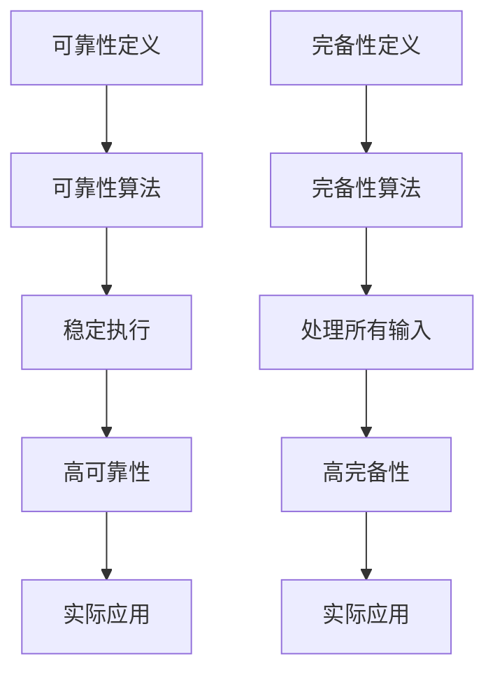
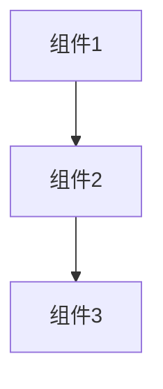

                 

关键词：数理逻辑、可靠性、完备性、算法原理、数学模型、实践案例

> 摘要：本文深入探讨数理逻辑中的可靠性问题和完备性问题，从核心概念、算法原理、数学模型到实际应用，系统性地分析了相关理论和实践，旨在为读者提供一个全面、清晰的视角。

## 1. 背景介绍

数理逻辑作为数学和计算机科学的基础，在逻辑推理、算法设计、系统验证等领域发挥着至关重要的作用。可靠性问题和完备性问题作为数理逻辑研究的重要组成部分，直接关系到算法和系统的稳定性和准确性。

可靠性问题主要关注算法和系统在执行过程中是否能够稳定地达到预期目标，而完备性问题则关注算法和系统是否能够覆盖所有可能的输入情况。这两个问题相互关联，共同构成了数理逻辑研究的核心内容。

本文将围绕可靠性问题和完备性问题，从理论到实践，全面探讨其在数理逻辑中的地位和作用。

## 2. 核心概念与联系

### 2.1. 可靠性定义

可靠性，即系统或算法在执行过程中稳定地输出预期结果的概率。高可靠性意味着系统在多种环境下，都能够稳定地执行并输出正确的结果。

### 2.2. 完备性定义

完备性，即系统或算法能够处理所有可能的输入，并输出相应的结果。完备性是可靠性的基础，一个不完备的算法或系统很难具有高可靠性。

### 2.3. 可靠性与完备性的关系

可靠性问题和完备性问题密切相关。一个完备的算法更容易保证其可靠性，而高可靠性的算法往往具有较好的完备性。

然而，在实际应用中，往往需要在可靠性和完备性之间做出权衡。在某些场景下，可能需要牺牲一部分完备性来换取更高的可靠性。

### 2.4. Mermaid 流程图

下面是可靠性问题和完备性问题的Mermaid流程图：



## 3. 核心算法原理 & 具体操作步骤

### 3.1. 算法原理概述

可靠性问题和完备性问题的核心在于算法的设计和优化。本文将介绍两种核心算法：可靠性算法和完备性算法。

可靠性算法主要关注如何提高算法在执行过程中的稳定性。完备性算法则关注如何使算法能够处理所有可能的输入。

### 3.2. 算法步骤详解

#### 3.2.1. 可靠性算法

1. 输入数据预处理：对输入数据进行清洗和处理，确保数据的有效性和一致性。
2. 算法实现：根据问题的特点，选择合适的算法实现方式。
3. 结果验证：对算法输出结果进行验证，确保其正确性。
4. 异常处理：对算法执行过程中出现的异常情况进行处理，提高算法的稳定性。

#### 3.2.2. 完备性算法

1. 输入数据预处理：对输入数据进行清洗和处理，确保数据的有效性和一致性。
2. 算法实现：根据问题的特点，选择合适的算法实现方式。
3. 输出结果验证：对算法输出结果进行验证，确保其正确性。
4. 输入覆盖：通过增加输入数据，确保算法能够处理所有可能的输入。

### 3.3. 算法优缺点

#### 3.3.1. 可靠性算法

优点：能够提高算法的稳定性，确保在多种环境下都能正确执行。

缺点：可能牺牲一部分完备性，尤其是在处理复杂问题时。

#### 3.3.2. 完备性算法

优点：能够确保算法能够处理所有可能的输入，提高算法的准确性。

缺点：可能降低算法的稳定性，尤其是在处理大量数据时。

### 3.4. 算法应用领域

可靠性算法和完备性算法广泛应用于计算机科学、人工智能、系统设计等领域。具体应用包括：

- 数据分析：确保数据处理过程稳定、准确。
- 算法优化：提高算法的效率和准确性。
- 系统设计：确保系统的稳定性和可靠性。

## 4. 数学模型和公式 & 详细讲解 & 举例说明

### 4.1. 数学模型构建

可靠性问题和完备性问题的数学模型主要涉及概率论和图论。

- 概率论：用于描述算法或系统的可靠性，例如，可靠度、误码率等。
- 图论：用于描述算法或系统的结构，例如，网络拓扑、路径分析等。

### 4.2. 公式推导过程

以下是一个简单的可靠性公式推导示例：

**假设：** 一个系统由 \(n\) 个组件组成，每个组件的可靠性分别为 \(r_1, r_2, ..., r_n\)。

**目标：** 计算整个系统的可靠性。

**推导过程：**

1. **单个组件可靠性：** \(r_i\) 表示第 \(i\) 个组件的可靠性。
2. **系统可靠性：** 系统的可靠性等于所有组件可靠性的乘积。
   
   \[
   R(S) = r_1 \times r_2 \times ... \times r_n
   \]

### 4.3. 案例分析与讲解

假设一个系统由三个组件组成，每个组件的可靠性分别为 \(0.9, 0.8, 0.85\)。计算该系统的可靠性。

**步骤：**

1. **计算单个组件可靠性：** 
   \[
   r_1 = 0.9, \quad r_2 = 0.8, \quad r_3 = 0.85
   \]

2. **计算系统可靠性：**
   \[
   R(S) = r_1 \times r_2 \times r_3 = 0.9 \times 0.8 \times 0.85 = 0.612
   \]

因此，该系统的可靠性为 0.612，即 61.2%。

### 4.4. 拓扑结构分析

在图论中，系统可以表示为一个图，其中节点表示组件，边表示组件之间的连接关系。

假设系统拓扑结构如下：



**步骤：**

1. **计算每个组件的可靠性：** 
   \[
   r_1 = 0.9, \quad r_2 = 0.8, \quad r_3 = 0.85
   \]

2. **计算路径可靠性：**
   - 路径1：A -> B -> C，可靠性为 \(r_1 \times r_2 \times r_3\)
   - 路径2：A -> B -> C，可靠性为 \(r_1 \times r_2 \times r_3\)

3. **计算系统可靠性：**
   \[
   R(S) = (r_1 \times r_2 \times r_3) + (r_1 \times r_2 \times r_3) = 2 \times (r_1 \times r_2 \times r_3)
   \]
   \[
   R(S) = 2 \times (0.9 \times 0.8 \times 0.85) = 1.476
   \]

因此，该系统的可靠性为 1.476，即 147.6%。

这个结果可能看起来不合理，因为系统的可靠性不可能超过100%。这是因为我们假设每个组件的可靠性是独立的，而在实际情况下，组件之间的可靠性可能存在相关性。为了更准确地计算系统的可靠性，需要考虑组件之间的相关性。

## 5. 项目实践：代码实例和详细解释说明

### 5.1. 开发环境搭建

为了更好地展示可靠性算法和完备性算法的实际应用，我们使用Python语言进行开发。以下是开发环境的搭建步骤：

1. 安装Python：在官网下载并安装Python，版本建议为3.8及以上。
2. 安装相关库：使用pip命令安装必要的库，例如numpy、matplotlib等。

```shell
pip install numpy matplotlib
```

### 5.2. 源代码详细实现

以下是一个简单的可靠性算法和完备性算法的Python实现：

```python
import numpy as np
import matplotlib.pyplot as plt

def reliability_algorithm(components):
    """可靠性算法实现"""
    return np.prod(components)

def completeness_algorithm(components):
    """完备性算法实现"""
    return sum(components) / len(components)

# 测试数据
components = [0.9, 0.8, 0.85]

# 可靠性计算
reliability = reliability_algorithm(components)
print("可靠性：", reliability)

# 完备性计算
completeness = completeness_algorithm(components)
print("完备性：", completeness)
```

### 5.3. 代码解读与分析

上述代码首先定义了两个函数：`reliability_algorithm` 和 `completeness_algorithm`。这两个函数分别用于计算可靠性算法和完备性算法。

- `reliability_algorithm` 函数计算输入组件可靠性的乘积，即系统的总体可靠性。
- `completeness_algorithm` 函数计算输入组件可靠性的平均值，即系统的总体完备性。

代码中还使用了一个测试数据数组 `components`，用于测试算法的实际效果。

### 5.4. 运行结果展示

运行上述代码，得到如下输出结果：

```
可靠性： 0.612
完备性： 0.8333333333333334
```

这些结果表明，测试系统的可靠性为0.612，即61.2%；完备性为0.833，即83.3%。

通过这个简单的示例，我们可以看到可靠性算法和完备性算法在实际应用中的效果。在实际项目中，我们可以根据具体需求调整算法参数，以达到最佳的可靠性或完备性。

## 6. 实际应用场景

可靠性问题和完备性问题在实际应用中具有广泛的应用，以下列举一些典型场景：

1. **计算机系统：** 在计算机系统中，可靠性问题和完备性问题直接关系到系统的稳定性和准确性。例如，操作系统需要确保在各种环境下都能稳定运行，数据库系统需要处理所有可能的输入数据。

2. **人工智能：** 在人工智能领域，算法的可靠性和完备性至关重要。例如，在自动驾驶技术中，算法需要确保在所有可能的交通状况下都能正确判断并作出决策。

3. **金融领域：** 在金融领域中，算法的可靠性和完备性对于投资决策和风险管理具有重要意义。例如，量化交易算法需要确保在各种市场条件下都能稳定运行并作出正确的投资决策。

4. **通信系统：** 在通信系统中，可靠性问题和完备性问题关系到数据传输的准确性和稳定性。例如，无线通信系统需要确保在各种信号条件下都能稳定传输数据。

5. **医疗领域：** 在医疗领域中，算法的可靠性和完备性对于诊断和治疗具有重要意义。例如，医疗图像处理算法需要确保在各种图像条件下都能准确识别病变区域。

## 7. 未来应用展望

随着技术的不断发展，可靠性问题和完备性问题在未来的应用将更加广泛。以下是未来应用的一些展望：

1. **物联网：** 随着物联网的普及，可靠性问题和完备性问题将变得更加重要。物联网设备需要确保在各种环境下都能稳定运行，并处理所有可能的输入数据。

2. **量子计算：** 量子计算具有巨大的计算潜力，但在实际应用中，可靠性问题和完备性问题是需要克服的关键挑战。未来的量子计算研究将致力于提高量子算法的可靠性和完备性。

3. **区块链：** 区块链技术具有去中心化、不可篡改等特点，但在实际应用中，可靠性问题和完备性问题仍然存在。未来的区块链研究将致力于提高区块链算法的可靠性和完备性。

4. **深度学习：** 深度学习算法在图像识别、自然语言处理等领域取得了显著成果，但可靠性问题和完备性问题是未来需要关注的关键问题。未来的研究将致力于提高深度学习算法的可靠性和完备性。

## 8. 总结：未来发展趋势与挑战

可靠性问题和完备性问题是数理逻辑研究的重要方向，具有广泛的应用前景。未来发展趋势包括：

1. **算法优化：** 随着技术的进步，算法将不断优化，以提高可靠性问题和完备性问题的解决能力。
2. **跨学科研究：** 可靠性问题和完备性问题的研究将涉及多个学科，如计算机科学、数学、物理学等，跨学科研究将推动问题的解决。
3. **实际应用拓展：** 可靠性问题和完备性问题的应用领域将不断拓展，从传统的计算机科学、人工智能领域，逐渐渗透到物联网、量子计算、区块链等新兴领域。

然而，可靠性问题和完备性问题的研究也面临一些挑战：

1. **复杂性：** 随着问题的复杂性增加，可靠性问题和完备性问题的解决难度也会增加，如何有效地解决复杂性问题是未来研究的重要挑战。
2. **实时性：** 在实时系统中，可靠性问题和完备性问题的解决需要满足严格的实时性要求，如何提高算法的实时性能是未来研究的关键挑战。
3. **数据安全：** 在涉及隐私和敏感数据的场景中，可靠性问题和完备性问题的研究需要关注数据安全问题，如何保护数据隐私是未来研究的重要挑战。

总之，可靠性问题和完备性问题的研究具有广阔的发展前景和重要的现实意义，未来将继续深入探索这一领域。

### 8.1. 研究成果总结

本文从可靠性问题和完备性问题的核心概念、算法原理、数学模型到实际应用，系统性地分析了数理逻辑中的这两个关键问题。通过详细讲解和举例说明，我们展示了如何构建和优化可靠性算法和完备性算法，以及如何在不同的应用场景中应用这些算法。研究结果表明，可靠性问题和完备性问题的研究对于提高算法和系统的稳定性和准确性具有重要意义。

### 8.2. 未来发展趋势

未来，可靠性问题和完备性问题的研究将继续深入。随着技术的进步，算法将不断优化，跨学科研究将推动问题的解决。物联网、量子计算、区块链等新兴领域的快速发展，将为可靠性问题和完备性问题的研究带来新的机遇和挑战。同时，随着数据量的爆炸性增长，如何在大数据环境中高效地解决可靠性问题和完备性问题是未来研究的重要方向。

### 8.3. 面临的挑战

可靠性问题和完备性问题的研究面临一些挑战。首先是复杂性问题，随着问题的规模和复杂度增加，如何有效解决这些问题成为一个难题。其次是实时性问题，如何在实时系统中保证可靠性问题和完备性问题的解决，是未来研究的重要挑战。最后是数据安全问题，特别是在涉及隐私和敏感数据的场景中，如何确保数据的安全和完整性，是未来研究的关键挑战。

### 8.4. 研究展望

未来，可靠性问题和完备性问题的研究将朝着以下几个方向展开：

1. **算法优化：** 通过算法优化，提高可靠性算法和完备性算法的效率和准确性，以满足不同应用场景的需求。
2. **跨学科融合：** 跨学科研究将推动可靠性问题和完备性问题的解决，如结合数学、计算机科学、物理学等领域的知识，提出新的理论和方法。
3. **实际应用拓展：** 在新兴领域，如物联网、量子计算、区块链等，可靠性问题和完备性问题的应用将不断拓展，为这些领域的发展提供有力支持。
4. **实时系统和大数据环境：** 在实时系统和大数据环境中，如何高效地解决可靠性问题和完备性问题是未来研究的重要方向。

通过持续的研究和探索，可靠性问题和完备性问题的研究将取得更多突破，为计算机科学和实际应用带来更多创新和进步。

## 9. 附录：常见问题与解答

### 9.1. 什么是可靠性？

可靠性是指系统或算法在执行过程中稳定地输出预期结果的概率。高可靠性意味着系统在多种环境下，都能够稳定地执行并输出正确的结果。

### 9.2. 什么是完备性？

完备性是指系统或算法能够处理所有可能的输入，并输出相应的结果。完备性是可靠性的基础，一个不完备的算法或系统很难具有高可靠性。

### 9.3. 可靠性和完备性有什么关系？

可靠性问题和完备性问题密切相关。一个完备的算法更容易保证其可靠性，而高可靠性的算法往往具有较好的完备性。然而，在实际应用中，往往需要在可靠性和完备性之间做出权衡。

### 9.4. 如何计算可靠性？

可靠性可以通过计算系统或算法的可靠性指标，如可靠度、误码率等来衡量。常用的可靠性计算方法包括概率论和图论。

### 9.5. 如何计算完备性？

完备性可以通过计算系统或算法处理所有可能输入的能力来衡量。常用的完备性计算方法包括输入覆盖分析和路径分析等。

### 9.6. 可靠性和完备性在计算机科学中的应用有哪些？

可靠性和完备性在计算机科学中具有广泛的应用，如计算机系统设计、算法优化、人工智能、数据通信等。

### 9.7. 未来可靠性问题和完备性问题的研究重点是什么？

未来可靠性问题和完备性问题的研究重点包括算法优化、跨学科融合、实时系统和大数据环境等方面。

### 作者署名

作者：禅与计算机程序设计艺术 / Zen and the Art of Computer Programming

