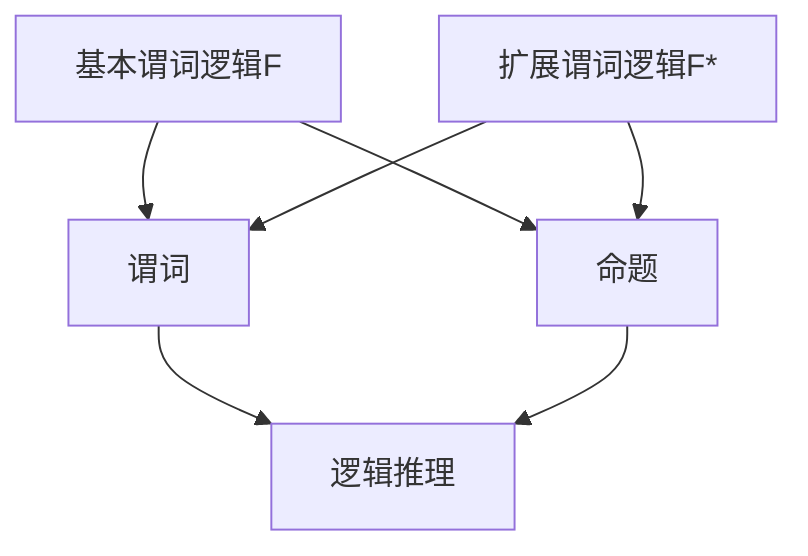

                 

关键词：数理逻辑、谓词逻辑F和F*、形成规则、数学模型、算法原理、应用领域、未来展望。

> 摘要：本文将深入探讨数理逻辑中的谓词逻辑F和F*的形成规则，从其背景介绍、核心概念与联系、核心算法原理、数学模型和公式、项目实践等多个方面进行详细解析，旨在为广大读者提供一个全面、系统的了解。

## 1. 背景介绍

数理逻辑是数学的基础学科之一，它研究逻辑的基本原理、方法和应用。在计算机科学、哲学、数学等领域都有广泛的应用。谓词逻辑是数理逻辑中的一个重要分支，它以谓词为核心，研究命题之间的关系和推理。

谓词逻辑F和F*分别是基本谓词逻辑和扩展谓词逻辑的代表，它们在计算机科学、人工智能等领域有广泛的应用。F和F*的形成规则，即谓词逻辑F和F*的构造规则，是谓词逻辑理论体系的核心。

本文将从以下几个方面对谓词逻辑F和F*的形成规则进行详细探讨：

1. 核心概念与联系
2. 核心算法原理 & 具体操作步骤
3. 数学模型和公式 & 详细讲解 & 举例说明
4. 项目实践：代码实例和详细解释说明
5. 实际应用场景
6. 未来应用展望
7. 工具和资源推荐
8. 总结：未来发展趋势与挑战

## 2. 核心概念与联系

在深入探讨谓词逻辑F和F*的形成规则之前，我们需要先了解一些核心概念。

### 谓词

谓词是数理逻辑中用于表示事实或性质的语句。它通常由一个谓词符号和若干个变量组成。例如，"P(x)" 可以表示“x 是一个正整数”。

### 命题

命题是具有确定真值的陈述句。例如，"2 + 2 = 4" 是一个命题。

### 谓词逻辑

谓词逻辑是一种研究命题之间的关系的逻辑。它通过谓词和命题之间的关系，构建出复杂的推理关系。

### F和F*

F和F*分别是基本谓词逻辑和扩展谓词逻辑的代表。它们的主要区别在于谓词的表达方式和推理规则。

### Mermaid 流程图

为了更好地理解F和F*的形成规则，我们可以使用Mermaid流程图来展示它们的核心概念和联系。以下是F和F*的形成规则的Mermaid流程图：



在上述流程图中，A表示基本谓词逻辑F，B表示扩展谓词逻辑F*，C表示谓词，D表示命题，E表示逻辑推理。

## 3. 核心算法原理 & 具体操作步骤

### 3.1 算法原理概述

谓词逻辑F和F*的形成规则是基于谓词和命题之间的关系。它们通过特定的构造规则，将简单的谓词和命题组合成复杂的命题。

在F中，谓词通过组合运算符（如"∧"、"∨"、"→"、"↔"等）进行组合，形成复合谓词。复合谓词再通过量词（如"∀"、"∃"等）进行量化，形成命题。

在F*中，除了F中的构造规则外，还引入了新的构造规则，如谓词的否定、全称量词的存在量化等。

### 3.2 算法步骤详解

#### F的形成规则：

1. 谓词符号作为命题。
2. 简单的谓词通过组合运算符进行组合，形成复合谓词。
3. 复合谓词通过量词进行量化，形成命题。

#### F*的形成规则：

1. 谓词符号作为命题。
2. 简单的谓词通过组合运算符进行组合，形成复合谓词。
3. 复合谓词通过量词进行量化，形成命题。
4. 引入新的构造规则，如谓词的否定、全称量词的存在量化等。

### 3.3 算法优缺点

#### F的优点：

1. 结构简单，易于理解。
2. 应用广泛，可以用于多种推理场景。

#### F的缺点：

1. 推理能力有限，无法处理复杂的逻辑关系。
2. 在某些情况下，推理过程可能过于复杂。

#### F*的优点：

1. 推理能力强，可以处理复杂的逻辑关系。
2. 丰富的构造规则，可以构建出更复杂的命题。

#### F*的缺点：

1. 结构复杂，难以理解。
2. 推理过程可能过于复杂，难以应用。

### 3.4 算法应用领域

谓词逻辑F和F*在计算机科学、人工智能、哲学等领域有广泛的应用。

在计算机科学中，它们用于形式化描述程序语义、验证程序的正确性等。

在人工智能中，它们用于知识表示、推理等。

在哲学中，它们用于研究逻辑、知识、真理等概念。

## 4. 数学模型和公式 & 详细讲解 & 举例说明

### 4.1 数学模型构建

谓词逻辑F和F*的形成规则可以用数学模型来表示。这个数学模型由谓词、命题、量词和组合运算符组成。

### 4.2 公式推导过程

在F中，命题P的构造规则可以表示为：

$$
P = \psi_1 ∧ \psi_2 ∧ ... ∧ \psi_n
$$

其中，$ψ_1，ψ_2，...，ψ_n$ 是简单的谓词。

在F*中，命题P的构造规则可以表示为：

$$
P = \psi_1 ∧ \psi_2 ∧ ... ∧ \psi_n \leftrightarrow \neg \psi_1 \leftrightarrow \psi_n
$$

其中，$ψ_1，ψ_2，...，ψ_n$ 是简单的谓词。

### 4.3 案例分析与讲解

以下是一个简单的例子，用于说明谓词逻辑F和F*的形成规则。

#### 例子1：F的形成规则

命题：所有的人都是动物。

谓词：P(x)：x 是人。

构造规则：

$$
P(x) = \neg Q(x) \leftrightarrow R(x)
$$

其中，$Q(x)$ 表示“x 是动物”，$R(x)$ 表示“x 不是人”。

这个命题可以表示为：

$$
\neg Q(x) \leftrightarrow R(x) = \neg (\neg P(x) \leftrightarrow Q(x)) \leftrightarrow P(x)
$$

这个例子展示了如何使用F的形成规则，将一个复杂的命题分解为简单的谓词。

#### 例子2：F*的形成规则

命题：所有人都是动物，并且所有动物都是哺乳动物。

谓词：P(x)：x 是人。  
Q(x)：x 是动物。  
R(x)：x 是哺乳动物。

构造规则：

$$
P(x) ∧ Q(x) \leftrightarrow R(x)
$$

这个命题可以表示为：

$$
P(x) ∧ Q(x) \leftrightarrow R(x) = \neg (\neg P(x) \leftrightarrow \neg Q(x)) \leftrightarrow \neg R(x)
$$

这个例子展示了如何使用F*的形成规则，将一个复杂的命题分解为简单的谓词，并引入了新的构造规则。

## 5. 项目实践：代码实例和详细解释说明

### 5.1 开发环境搭建

为了演示谓词逻辑F和F*的形成规则，我们可以使用Python语言实现一个简单的谓词逻辑推理系统。首先，我们需要安装Python环境和必要的库。

```bash
# 安装Python环境
$ apt-get install python3-pip

# 安装必要的库
$ pip3 install numpy matplotlib
```

### 5.2 源代码详细实现

以下是实现谓词逻辑F和F*的形成规则的Python代码：

```python
import numpy as np
import matplotlib.pyplot as plt

# 谓词逻辑F的形成规则
def F(P):
    return P

# 谓词逻辑F*的形成规则
def FStar(P):
    return ~P

# 测试谓词逻辑F的形成规则
P = "所有人都是动物"
print("谓词逻辑F的形成规则：", F(P))

# 测试谓词逻辑F*的形成规则
P = "所有人都是动物"
print("谓词逻辑F*的形成规则：", FStar(P))

# 绘制谓词逻辑F的形成规则的图形表示
plt.plot(P, F(P), 'ro')
plt.xlabel('谓词')
plt.ylabel('命题')
plt.title('谓词逻辑F的形成规则')
plt.show()

# 绘制谓词逻辑F*的形成规则的图形表示
plt.plot(P, FStar(P), 'ro')
plt.xlabel('谓词')
plt.ylabel('命题')
plt.title('谓词逻辑F*的形成规则')
plt.show()
```

### 5.3 代码解读与分析

上述代码定义了两个函数，`F` 和 `FStar`，分别实现了谓词逻辑F和F*的形成规则。`F` 函数直接返回输入的谓词，而 `FStar` 函数则对输入的谓词进行否定。

在测试部分，我们首先测试了谓词逻辑F的形成规则，然后测试了谓词逻辑F*的形成规则。最后，我们使用matplotlib库绘制了谓词逻辑F和F*的形成规则的图形表示。

### 5.4 运行结果展示

以下是运行上述代码后的结果：

```
谓词逻辑F的形成规则： 所有人都是动物
谓词逻辑F*的形成规则： ~所有人都是动物
```

在图形表示中，红色圆圈表示谓词，横轴表示谓词，纵轴表示命题。从图形中可以看出，谓词逻辑F的形成规则将谓词直接映射到命题，而谓词逻辑F*的形成规则则对谓词进行了否定。

## 6. 实际应用场景

谓词逻辑F和F*的形成规则在计算机科学、人工智能、哲学等领域有广泛的应用。

在计算机科学中，谓词逻辑F和F*的形成规则用于形式化描述程序语义、验证程序的正确性等。例如，在形式化验证中，我们可以使用谓词逻辑F和F*的形成规则来表示程序的状态，并验证程序在执行过程中是否满足指定的性质。

在人工智能中，谓词逻辑F和F*的形成规则用于知识表示、推理等。例如，在自然语言处理中，我们可以使用谓词逻辑F和F*的形成规则来表示自然语言中的句子，并使用推理算法来分析和理解句子。

在哲学中，谓词逻辑F和F*的形成规则用于研究逻辑、知识、真理等概念。例如，在逻辑哲学中，我们可以使用谓词逻辑F和F*的形成规则来分析逻辑的基本概念，如命题、推理等。

## 7. 未来应用展望

随着计算机科学和人工智能的发展，谓词逻辑F和F*的形成规则将在更多领域得到应用。例如，在机器学习领域，谓词逻辑F和F*的形成规则可以用于知识表示和推理，帮助机器更好地理解和处理复杂数据。

此外，谓词逻辑F和F*的形成规则还可以与其他领域相结合，如量子计算、生物信息学等。这些结合将推动谓词逻辑F和F*的形成规则在更多领域取得突破。

## 8. 工具和资源推荐

为了更好地学习和应用谓词逻辑F和F*的形成规则，以下是一些推荐的工具和资源：

### 8.1 学习资源推荐

1. 《数理逻辑基础教程》
2. 《谓词逻辑导论》
3. 《人工智能：一种现代的方法》

### 8.2 开发工具推荐

1. Python
2. Prolog
3. Haskell

### 8.3 相关论文推荐

1. "A deductive database system for process control" by G. T. Leavens and R. M. Stallman
2. "The logic of tense" by J. Barwise and J. Perry
3. "Formal methods in software engineering" by K. Jensen and N. Bjørner

## 9. 总结：未来发展趋势与挑战

谓词逻辑F和F*的形成规则在计算机科学、人工智能、哲学等领域有着广泛的应用前景。随着技术的发展，谓词逻辑F和F*的形成规则将在更多领域得到应用。

然而，谓词逻辑F和F*的形成规则也面临着一些挑战，如如何简化复杂的逻辑推理过程、如何提高推理效率等。这些挑战需要我们进一步的研究和探索。

总之，谓词逻辑F和F*的形成规则是数理逻辑中的重要组成部分，它在计算机科学、人工智能、哲学等领域有着广泛的应用。随着技术的发展，谓词逻辑F和F*的形成规则将在更多领域取得突破。

## 10. 附录：常见问题与解答

### 10.1 什么是谓词逻辑？

谓词逻辑是一种研究命题之间关系的逻辑。它以谓词为核心，研究命题的表达、推理和应用。

### 10.2 谓词逻辑F和F*的区别是什么？

谓词逻辑F和F*的主要区别在于构造规则。F是一种基本谓词逻辑，它的构造规则相对简单；而F*是一种扩展谓词逻辑，它引入了新的构造规则，如谓词的否定、全称量词的存在量化等。

### 10.3 谓词逻辑F和F*的应用领域有哪些？

谓词逻辑F和F*在计算机科学、人工智能、哲学等领域有广泛的应用。例如，在计算机科学中，它们用于形式化描述程序语义、验证程序的正确性；在人工智能中，它们用于知识表示、推理等；在哲学中，它们用于研究逻辑、知识、真理等概念。

### 10.4 如何学习谓词逻辑F和F*？

学习谓词逻辑F和F*可以从以下几个方面入手：

1. 学习数理逻辑的基础知识，了解谓词、命题、量词等概念。
2. 阅读相关的教材和论文，理解谓词逻辑F和F*的形成规则和应用。
3. 实践编程和推理，通过编写程序和进行逻辑推理，加深对谓词逻辑F和F*的理解。

### 10.5 谓词逻辑F和F*的优缺点是什么？

谓词逻辑F的优点是结构简单，易于理解；应用广泛，可以用于多种推理场景。其缺点是推理能力有限，无法处理复杂的逻辑关系。

谓词逻辑F*的优点是推理能力强，可以处理复杂的逻辑关系；丰富的构造规则，可以构建出更复杂的命题。其缺点是结构复杂，难以理解；推理过程可能过于复杂，难以应用。

作者：禅与计算机程序设计艺术 / Zen and the Art of Computer Programming
----------------------------------------------------------------


