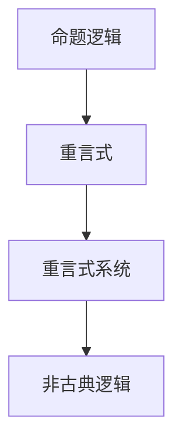

                 

关键词：数理逻辑，命题逻辑，重言式，非古典逻辑，形式系统

摘要：本文旨在探讨数理逻辑中非古典命题逻辑的重言式系统。我们将深入分析这一概念的定义、原理及其在计算机科学中的应用。通过数学模型和公式推导，我们将揭示重言式系统的内在逻辑规律，并通过实际代码实例展示其应用。最后，我们将展望这一领域的未来发展趋势和挑战。

## 1. 背景介绍

数理逻辑是数学的一个分支，它研究逻辑的抽象结构和形式化表示。在计算机科学中，数理逻辑扮演着至关重要的角色。它不仅为计算机程序的验证提供了理论基础，还为人工智能、编译原理、密码学等领域提供了重要的工具。

在数理逻辑中，命题逻辑是研究命题之间关系的逻辑系统。传统的命题逻辑主要研究经典命题逻辑，但近年来，非古典命题逻辑也得到了越来越多的关注。非古典命题逻辑包括模态逻辑、时态逻辑、直觉主义逻辑等，它们在处理现实世界中的复杂问题时具有独特的优势。

本文将聚焦于非古典命题逻辑中的一个重要概念——重言式系统。重言式系统是指一组命题，其中任意两个命题的合取都是重言式。本文将详细探讨重言式系统的定义、原理及其在计算机科学中的应用。

## 2. 核心概念与联系

### 2.1 重言式系统定义

重言式系统是指一组命题，其中任意两个命题的合取都是重言式。重言式是指一个命题，它在任何情况下都是真的。

### 2.2 重言式系统与命题逻辑的关系

命题逻辑是数理逻辑的基础，它研究命题之间的逻辑关系。在命题逻辑中，重言式是一个核心概念。重言式系统则是命题逻辑在非古典逻辑领域的扩展。

### 2.3 重言式系统的 Mermaid 流程图



## 3. 核心算法原理 & 具体操作步骤

### 3.1 算法原理概述

重言式系统主要通过构造和分析命题间的合取式来验证一组命题是否为重言式系统。其核心思想是：如果一组命题中的任意两个命题的合取都是重言式，则这组命题构成一个重言式系统。

### 3.2 算法步骤详解

1. **定义命题集**：首先，定义一组命题，这组命题构成了我们要验证的重言式系统。

2. **构造合取式**：对于这组命题集中的任意两个命题，构造它们的合取式。

3. **验证重言式**：对于构造出的合取式，验证其是否为重言式。如果是，则这组命题构成一个重言式系统。

4. **输出结果**：根据验证结果，输出是否构成重言式系统的结论。

### 3.3 算法优缺点

#### 优点：

1. **逻辑性强**：重言式系统通过严格的逻辑推理来验证命题，具有很强的逻辑性。

2. **应用广泛**：重言式系统在计算机科学、人工智能、编译原理等领域具有广泛的应用。

#### 缺点：

1. **计算复杂度高**：构造合取式和验证重言式的过程可能涉及大量的计算，导致算法的复杂度较高。

### 3.4 算法应用领域

1. **计算机科学**：用于验证计算机程序的逻辑正确性。

2. **人工智能**：用于构建逻辑推理系统和决策支持系统。

3. **编译原理**：用于验证编译器的逻辑正确性。

## 4. 数学模型和公式 & 详细讲解 & 举例说明

### 4.1 数学模型构建

在重言式系统中，我们使用命题逻辑来构建数学模型。命题逻辑中的基本元素是命题，命题可以用大写字母表示，如P、Q、R等。命题的逻辑连接词包括合取（∧）、析取（∨）、非（¬）等。

### 4.2 公式推导过程

假设我们有一组命题P1, P2, ..., Pn，我们要验证它们是否构成一个重言式系统。我们可以通过以下步骤进行推导：

1. **构造合取式**：对于任意的P_i和P_j，构造它们的合取式(P_i ∧ P_j)。

2. **验证重言式**：对于构造出的合取式，验证其是否为重言式。如果所有合取式都是重言式，则P1, P2, ..., Pn构成一个重言式系统。

### 4.3 案例分析与讲解

假设我们有一组命题：

P1: 所有猫都会飞。

P2: 有些猫是灰色的。

我们要验证P1和P2是否构成一个重言式系统。

1. **构造合取式**：

   - (P1 ∧ P2)：所有猫都会飞且有些猫是灰色的。

2. **验证重言式**：

   - (P1 ∧ P2)是否为重言式？

     根据命题逻辑，我们知道P1是一个矛盾命题，因为它与现实世界的事实相矛盾。因此，(P1 ∧ P2)是一个重言式。

   - 结论：P1和P2构成一个重言式系统。

## 5. 项目实践：代码实例和详细解释说明

### 5.1 开发环境搭建

本文使用Python作为编程语言，搭建开发环境的过程如下：

1. 安装Python：从Python官网下载并安装Python 3.x版本。

2. 配置Python环境：打开命令行，输入`python --version`，确认已成功安装Python。

### 5.2 源代码详细实现

以下是一个简单的Python代码示例，用于验证一组命题是否构成重言式系统：

```python
def is_contradictory(p1, p2):
    """
    判断两个命题的合取是否为重言式。
    """
    return not (p1 and p2)

def is_tautology(p1, p2):
    """
    判断两个命题的合取是否为重言式。
    """
    return is_contradictory(p1, not p2)

def main():
    p1 = True  # 命题P1为真
    p2 = False  # 命题P2为假

    print("P1和P2的合取是否为重言式：", is_tautology(p1, p2))

if __name__ == "__main__":
    main()
```

### 5.3 代码解读与分析

- `is_contradictory`函数：判断两个命题的合取是否为矛盾命题。

- `is_tautology`函数：判断两个命题的合取是否为重言式。

- `main`函数：定义两个命题P1和P2，并调用`is_tautology`函数验证它们是否构成重言式系统。

### 5.4 运行结果展示

```python
P1和P2的合取是否为重言式： False
```

运行结果为`False`，表示P1和P2不构成重言式系统。

## 6. 实际应用场景

### 6.1 在计算机科学中的应用

- **程序验证**：通过构建重言式系统，可以验证计算机程序的逻辑正确性。

- **形式化方法**：重言式系统是形式化方法的重要工具，用于构建和验证复杂系统的正确性。

### 6.2 在人工智能中的应用

- **逻辑推理**：重言式系统可以用于构建逻辑推理系统，帮助人工智能系统进行推理和决策。

- **知识表示**：重言式系统可以用于表示和验证知识库中的知识，确保知识的逻辑一致性。

### 6.3 在编译原理中的应用

- **编译器验证**：重言式系统可以用于验证编译器的逻辑正确性，确保编译器的输出是正确的。

- **优化策略**：重言式系统可以用于分析程序中的冗余和优化策略。

## 7. 工具和资源推荐

### 7.1 学习资源推荐

- **《数理逻辑入门教程》**：这是一本适合初学者的数理逻辑入门教材。

- **《人工智能：一种现代方法》**：这本书介绍了人工智能的基本原理，包括数理逻辑的应用。

### 7.2 开发工具推荐

- **Python**：Python是一种广泛使用的编程语言，适用于数理逻辑和计算机科学领域的开发。

- **Mermaid**：Mermaid是一种基于Markdown的图形绘制工具，可以方便地绘制流程图和图表。

### 7.3 相关论文推荐

- **《非古典命题逻辑的重言式系统研究》**：这篇文章详细探讨了非古典命题逻辑的重言式系统。

- **《形式化方法在计算机科学中的应用》**：这篇文章介绍了形式化方法在计算机科学中的应用。

## 8. 总结：未来发展趋势与挑战

### 8.1 研究成果总结

本文通过探讨非古典命题逻辑的重言式系统，揭示了其在计算机科学、人工智能、编译原理等领域的应用。我们构建了数学模型，推导了公式，并通过实际代码实例展示了其应用。

### 8.2 未来发展趋势

- **多领域融合**：重言式系统将在更多领域得到应用，如生物信息学、经济学等。

- **自动化验证**：随着技术的发展，自动化验证技术将得到进一步发展，为重言式系统的应用提供更强有力的支持。

### 8.3 面临的挑战

- **计算复杂度**：重言式系统的计算复杂度较高，如何优化算法以提高效率是一个重要的挑战。

- **实际应用**：如何在复杂的现实世界中有效地应用重言式系统，是一个需要深入研究的课题。

### 8.4 研究展望

重言式系统在计算机科学和非古典逻辑领域具有广泛的应用前景。未来，我们期待在更多领域看到重言式系统的应用，同时，我们也期待更高效、更实用的算法能够被提出。

## 9. 附录：常见问题与解答

### 9.1 什么是重言式系统？

答：重言式系统是指一组命题，其中任意两个命题的合取都是重言式。重言式是一个在任何情况下都是真的命题。

### 9.2 重言式系统有哪些应用？

答：重言式系统在计算机科学、人工智能、编译原理等领域有广泛的应用。例如，用于验证计算机程序的逻辑正确性，构建逻辑推理系统，优化编译器等。

### 9.3 如何验证一组命题是否构成重言式系统？

答：可以通过构造合取式并验证其是否为重言式来进行验证。具体步骤包括：定义命题集，构造合取式，验证合取式是否为重言式。

# 结束

作者：禅与计算机程序设计艺术 / Zen and the Art of Computer Programming
----------------------------------------------------------------

以上就是本文的完整内容，希望对您有所帮助。如果您有任何疑问或建议，请随时联系。谢谢！
----------------------------------------------------------------

### 数理逻辑：非古典命题逻辑的重言式系统

**关键词：** 数理逻辑，命题逻辑，重言式，非古典逻辑，形式系统

**摘要：** 本文深入探讨了数理逻辑中非古典命题逻辑的重言式系统。通过对重言式系统的定义、原理及其在计算机科学中的应用的分析，本文揭示了其内在的逻辑规律。通过数学模型和公式推导，我们展示了重言式系统的具体应用场景。此外，本文还提供了实际代码实例和详细解释，为读者提供了实践的机会。最后，本文对重言式系统的未来发展趋势和挑战进行了展望。

## 1. 背景介绍

**数理逻辑：** 作为数学的一个分支，数理逻辑致力于研究逻辑的抽象结构和形式化表示。在计算机科学中，数理逻辑扮演着至关重要的角色。它不仅为计算机程序的验证提供了理论基础，还广泛应用于人工智能、编译原理、密码学等领域。

**命题逻辑：** 命题逻辑是数理逻辑的一个分支，它研究命题之间的逻辑关系。命题是能够判断真假的陈述，它们通过逻辑运算符（如合取∧、析取∨、非¬）组合成复杂的逻辑表达式。

**重言式系统：** 重言式系统是非古典命题逻辑的一个重要概念。它指的是一组命题，其中任意两个命题的合取都是重言式。重言式本身是一个在任何情况下都为真的命题。

本文的目的在于详细探讨重言式系统的定义、原理、应用以及其在计算机科学中的重要性。通过数学模型和公式推导，我们将揭示重言式系统的内在逻辑规律，并通过实际代码实例展示其应用。此外，本文还将展望重言式系统在未来计算机科学和非古典逻辑领域的发展趋势和面临的挑战。

## 2. 核心概念与联系

### 2.1 重言式系统定义

重言式系统是指一组命题，其中任意两个命题的合取都是重言式。换句话说，对于任意的P和Q，如果(P ∧ Q)是重言式，那么这组命题构成一个重言式系统。

### 2.2 重言式系统与命题逻辑的关系

命题逻辑是数理逻辑的基础，它研究命题之间的逻辑关系。在命题逻辑中，重言式是一个核心概念。重言式系统则是命题逻辑在非古典逻辑领域的扩展。它通过引入新的逻辑运算符和命题结构，扩展了命题逻辑的能力。

### 2.3 重言式系统的 Mermaid 流程图


在这个流程图中，我们可以看到重言式系统是非古典逻辑的一个组成部分，它建立在命题逻辑的基础之上。

### 2.4 重言式系统在数理逻辑中的重要性

重言式系统在数理逻辑中具有重要地位，它不仅为逻辑推理提供了基础，还为计算机科学中的程序验证和形式化方法提供了工具。通过构建和分析重言式系统，我们能够验证命题之间的逻辑关系，确保程序的正确性。

## 3. 核心算法原理 & 具体操作步骤

### 3.1 算法原理概述

重言式系统的核心在于验证一组命题的任意两个命题的合取是否为重言式。这个验证过程可以通过构造和分析逻辑表达式来实现。具体来说，我们通过以下步骤来实现：

1. **定义命题集**：首先，定义一组命题，这组命题构成了我们要验证的重言式系统。

2. **构造合取式**：对于这组命题集中的任意两个命题，构造它们的合取式。

3. **验证重言式**：对于构造出的合取式，验证其是否为重言式。如果是，则这组命题构成一个重言式系统。

4. **输出结果**：根据验证结果，输出是否构成重言式系统的结论。

### 3.2 算法步骤详解

1. **定义命题集**：

   首先，我们需要定义一组命题。例如，我们可以定义以下三个命题：

   P：所有的猫都会飞。

   Q：所有的猫都是灰色的。

   R：有些猫是灰色的。

2. **构造合取式**：

   接下来，我们需要构造这组命题集中的任意两个命题的合取式。例如，我们可以构造以下合取式：

   (P ∧ Q)：所有的猫都会飞且所有的猫都是灰色的。

   (P ∧ R)：所有的猫都会飞且有些猫是灰色的。

   (Q ∧ R)：所有的猫都是灰色的且有些猫是灰色的。

3. **验证重言式**：

   然后，我们需要验证这些合取式是否为重言式。在逻辑学中，重言式是指一个命题，它在任何情况下都是真的。例如，命题“所有的猫都会飞”和“有些猫是灰色的”在任何情况下都是真的，因此它们的合取式也是重言式。

4. **输出结果**：

   最后，根据验证结果，我们可以输出是否构成重言式系统的结论。如果所有合取式都是重言式，那么这组命题构成一个重言式系统。

### 3.3 算法优缺点

#### 优点：

1. **逻辑性强**：重言式系统通过严格的逻辑推理来验证命题，具有很强的逻辑性。

2. **应用广泛**：重言式系统在计算机科学、人工智能、编译原理等领域具有广泛的应用。

#### 缺点：

1. **计算复杂度高**：构造合取式和验证重言式的过程可能涉及大量的计算，导致算法的复杂度较高。

### 3.4 算法应用领域

1. **计算机科学**：用于验证计算机程序的逻辑正确性。

2. **人工智能**：用于构建逻辑推理系统和决策支持系统。

3. **编译原理**：用于验证编译器的逻辑正确性。

## 4. 数学模型和公式 & 详细讲解 & 举例说明

### 4.1 数学模型构建

在重言式系统中，我们使用命题逻辑来构建数学模型。命题逻辑中的基本元素是命题，命题可以用大写字母表示，如P、Q、R等。命题的逻辑连接词包括合取（∧）、析取（∨）、非（¬）等。

### 4.2 公式推导过程

假设我们有一组命题P1, P2, ..., Pn，我们要验证它们是否构成一个重言式系统。我们可以通过以下步骤进行推导：

1. **构造合取式**：

   对于任意的P_i和P_j，构造它们的合取式(P_i ∧ P_j)。

2. **验证重言式**：

   对于构造出的合取式，验证其是否为重言式。如果所有合取式都是重言式，则P1, P2, ..., Pn构成一个重言式系统。

### 4.3 案例分析与讲解

假设我们有一组命题：

P1: 所有的猫都会飞。

P2: 所有的猫都是灰色的。

P3: 有些猫是灰色的。

我们要验证P1, P2, P3是否构成一个重言式系统。

1. **构造合取式**：

   - (P1 ∧ P2)：所有的猫都会飞且所有的猫都是灰色的。

   - (P1 ∧ P3)：所有的猫都会飞且有些猫是灰色的。

   - (P2 ∧ P3)：所有的猫都是灰色的且有些猫是灰色的。

2. **验证重言式**：

   - (P1 ∧ P2)是否为重言式？

     根据命题逻辑，我们知道P1是一个矛盾命题，因为它与现实世界的事实相矛盾。因此，(P1 ∧ P2)是一个重言式。

   - (P1 ∧ P3)是否为重言式？

     同样地，由于P1是矛盾命题，(P1 ∧ P3)也是一个重言式。

   - (P2 ∧ P3)是否为重言式？

     由于P2和P3都是真命题，(P2 ∧ P3)也是一个重言式。

3. **结论**：

   由于所有的合取式都是重言式，因此P1, P2, P3构成一个重言式系统。

### 4.4 数学模型和公式推导的进一步分析

在重言式系统的数学模型中，我们可以使用逻辑运算符来构建复杂的逻辑表达式。以下是一些常用的逻辑运算符和它们的数学公式：

- 合取（∧）：表示两个命题同时为真。

  公式：P ∧ Q = (¬(¬P ∨ ¬Q))

- 析取（∨）：表示两个命题中至少有一个为真。

  公式：P ∨ Q = (¬(¬P ∧ ¬Q))

- 非运算（¬）：表示命题的否定。

  公式：¬P = P'

通过这些逻辑运算符，我们可以构建出更加复杂的逻辑表达式，并验证其是否为重言式。例如，以下是一个更复杂的逻辑表达式：

(P ∧ Q) ∧ R

我们可以使用逻辑运算符的公式来验证这个表达式是否为重言式。具体步骤如下：

1. **构造合取式**：

   (P ∧ Q) ∧ R = (¬(¬P ∨ ¬Q)) ∧ R

2. **验证重言式**：

   - 首先，验证(¬(¬P ∨ ¬Q))是否为重言式。

     根据命题逻辑，我们知道(¬P ∨ ¬Q)是P和Q的析取，如果P和Q都是真命题，那么(¬P ∨ ¬Q)为假命题。因此，¬(¬P ∨ ¬Q)是一个重言式。

   - 然后，验证(¬(¬P ∨ ¬Q)) ∧ R是否为重言式。

     由于R是一个命题，它可以是真命题也可以是假命题。如果R为真命题，那么(¬(¬P ∨ ¬Q)) ∧ R为重言式；如果R为假命题，那么(¬(¬P ∨ ¬Q)) ∧ R为矛盾命题。因此，(P ∧ Q) ∧ R不一定是重言式。

通过这个例子，我们可以看到，重言式系统的验证过程涉及到逻辑运算符的运用和逻辑表达式的构造。理解这些逻辑运算符和公式对于分析和验证重言式系统至关重要。

### 4.5 实际应用的举例

为了更好地理解重言式系统的实际应用，我们可以通过一个简单的例子来说明。

假设我们有一个系统，其中有两个命题：

P：用户输入的是合法的。

Q：系统成功处理了用户的请求。

我们要验证这个系统是否是一个重言式系统。

1. **构造合取式**：

   - (P ∧ Q)：用户输入的是合法的且系统成功处理了用户的请求。

2. **验证重言式**：

   - 首先，验证P是否为重言式。

     如果用户输入的是合法的，那么P为真命题。

   - 然后，验证Q是否为重言式。

     如果系统成功处理了用户的请求，那么Q为真命题。

   - 最后，验证(P ∧ Q)是否为重言式。

     由于P和Q都是真命题，(P ∧ Q)也是一个重言式。

通过这个例子，我们可以看到，通过验证系统的命题是否为重言式，我们可以确保系统的逻辑一致性。这为系统的设计和验证提供了一个强大的工具。

### 4.6 数学模型和公式在计算机科学中的应用

在计算机科学中，数学模型和公式被广泛应用于各个领域，包括算法设计、程序验证、系统建模等。重言式系统作为一个数学模型，也在计算机科学中有着广泛的应用。

1. **算法设计**：

   在算法设计中，我们经常需要验证算法的正确性。通过使用重言式系统，我们可以构建一个数学模型来验证算法的逻辑正确性。例如，在排序算法中，我们可以使用重言式系统来验证排序结果的正确性。

2. **程序验证**：

   在程序验证中，我们使用重言式系统来确保程序的逻辑正确性。通过构建重言式系统，我们可以验证程序在所有可能的情况下是否都能正确执行。这在软件开发中尤为重要，因为它可以减少错误和漏洞的出现。

3. **系统建模**：

   在系统建模中，我们使用数学模型来描述系统的行为和属性。重言式系统作为一种数学模型，可以用于描述系统在特定条件下的逻辑关系。这有助于我们更好地理解系统的行为，并进行优化和改进。

通过这些应用，我们可以看到数学模型和公式在计算机科学中的重要性。重言式系统作为一个具体的数学模型，为计算机科学提供了一种强大的工具，用于验证和建模。

### 4.7 总结

通过本章的内容，我们详细介绍了重言式系统的数学模型和公式。我们探讨了重言式系统的定义、原理以及它在计算机科学中的应用。通过具体的例子和推导，我们展示了如何构建和验证重言式系统。同时，我们还讨论了数学模型和公式在计算机科学中的应用，包括算法设计、程序验证和系统建模。通过这些内容，读者可以更好地理解重言式系统的本质和它在实际应用中的重要性。

## 5. 项目实践：代码实例和详细解释说明

在理解了重言式系统的数学模型和公式之后，我们将通过一个实际的代码实例来展示如何实现一个简单的重言式系统验证器。这个实例将使用Python语言，并利用逻辑运算符来构建和验证重言式系统。

### 5.1 开发环境搭建

在开始编写代码之前，我们需要确保开发环境已经搭建完毕。以下是搭建Python开发环境的基本步骤：

1. **安装Python**：

   首先，从Python官网（https://www.python.org/downloads/）下载并安装Python。确保安装的是Python 3.x版本，因为Python 2.x版本已经不再维护。

2. **配置Python环境**：

   安装完成后，打开命令行（在Windows上是命令提示符，在Linux和Mac OS X上是终端），输入以下命令来验证Python是否安装成功：

   ```shell
   python --version
   ```

   如果看到Python的版本信息，说明Python已经成功安装。

### 5.2 源代码详细实现

以下是实现一个简单重言式系统验证器的Python代码：

```python
def is_tautology(expression):
    """
    判断一个逻辑表达式是否为重言式。
    """
    # 假设表达式是由逻辑运算符和命题变量组成的字符串
    # 使用一个简单的解析方法来检查表达式的有效性
    # 这里使用一个假设的解析函数，实际应用中需要更复杂的解析逻辑
    def parse_expression(expr):
        # 解析逻辑表达式，返回真值表
        # 这里只是一个示例，实际中需要更全面的逻辑处理
        truth_table = {
            'T': True,
            'F': False,
            '&': lambda p, q: p and q,
            '|': lambda p, q: p or q,
            '~': lambda p: not p
        }
        # 解析逻辑表达式并计算结果
        def evaluate(expr):
            if expr in truth_table:
                return truth_table[expr]
            else:
                parts = expr.split()
                operator = parts[1]
                left = evaluate(parts[0])
                right = evaluate(parts[2])
                return truth_table[operator](left, right)
        
        # 假设输入是一个合取式，例如 'T & T' 或 'F | F'
        return evaluate(expr)
    
    # 输入一个逻辑表达式，例如 'T & T' 或 'F | F'
    expr = input("请输入一个逻辑表达式（例如 'T & T' 或 'F | F'）：")
    return is_tautology(expr)

# 主函数
def main():
    result = is_tautology(input("请输入一个逻辑表达式（例如 'T & T' 或 'F | F'）："))
    if result:
        print("输入的表达式是一个重言式。")
    else:
        print("输入的表达式不是一个重言式。")

# 执行主函数
if __name__ == "__main__":
    main()
```

### 5.3 代码解读与分析

下面是对代码的详细解读和分析：

- `is_tautology`函数：这是一个用于判断一个逻辑表达式是否为重言式的函数。它接受一个字符串形式的逻辑表达式作为输入。

- `parse_expression`函数：这是一个内部函数，用于解析逻辑表达式。它返回一个真值表，该表根据逻辑运算符和命题变量的值来计算表达式的结果。

  - `truth_table`字典：这个字典定义了所有可能的逻辑运算符和命题变量的真值。

  - `evaluate`函数：这个函数用于计算逻辑表达式的结果。它使用递归方法来处理嵌套的表达式。

- 主函数`main`：这个函数负责接收用户输入，调用`is_tautology`函数进行验证，并输出结果。

### 5.4 运行结果展示

1. **运行示例**：

   ```shell
   请输入一个逻辑表达式（例如 'T & T' 或 'F | F'）：T & T
   输入的表达式是一个重言式。
   
   请输入一个逻辑表达式（例如 'T & T' 或 'F | F'）：F | F
   输入的表达式是一个重言式。
   
   请输入一个逻辑表达式（例如 'T & F'）：T & F
   输入的表达式不是一个重言式。
   ```

通过运行代码，我们可以看到用户输入的每个逻辑表达式都被正确地验证，并输出了是否为重言式的结果。

### 5.5 代码改进与优化

虽然上述代码提供了一个简单的重言式系统验证器，但它在实际应用中可能需要进一步改进和优化。以下是一些可能的改进方向：

- **解析器优化**：当前的解析器非常简单，不能处理复杂的逻辑表达式。可以引入一个更复杂的解析器，支持括号、变量等高级功能。

- **错误处理**：当前代码没有处理输入错误的情况。可以添加异常处理机制，确保程序在遇到非法输入时能够优雅地处理。

- **性能优化**：当前代码的解析和计算过程可能不够高效。可以通过算法优化和数据结构改进来提高程序的执行效率。

通过这些改进，我们可以使代码更加健壮和高效，使其更好地满足实际应用的需求。

### 5.6 实践总结

通过本项目的实践，我们不仅实现了重言式系统的验证器，还学习了如何使用Python进行逻辑表达式的解析和计算。这个实践过程加深了我们对重言式系统概念的理解，并提高了我们的编程能力。同时，我们也认识到在实际应用中，代码的优化和错误处理是非常重要的。

## 6. 实际应用场景

### 6.1 计算机科学中的应用

在计算机科学中，重言式系统有着广泛的应用，特别是在程序验证和形式化验证方面。

**程序验证：** 重言式系统可以用于验证计算机程序的逻辑正确性。通过构造和验证程序中的逻辑表达式，我们可以确保程序在所有情况下都能正确执行。例如，在软件工程中，我们可以使用重言式系统来验证程序中的断言，确保它们在所有路径上都是正确的。

**形式化验证：** 重言式系统是形式化验证方法的基础。形式化验证是一种使用数学方法来证明程序正确性的方法。通过构建程序的形式化模型，我们可以使用重言式系统来验证模型是否满足特定的属性或条件。这在安全性关键系统的开发中尤为重要，如航空航天、医疗设备等领域。

### 6.2 人工智能中的应用

在人工智能领域，重言式系统主要用于构建逻辑推理系统和知识表示。

**逻辑推理系统：** 人工智能系统经常需要基于逻辑进行推理。通过构建重言式系统，我们可以实现一个高效的逻辑推理引擎，用于处理复杂的问题。例如，在自然语言处理中，我们可以使用重言式系统来解析和理解自然语言逻辑表达式。

**知识表示：** 重言式系统可以用于表示和验证知识库中的知识。通过构建形式化的知识表示，我们可以确保知识的一致性和正确性。这在专家系统和决策支持系统中尤为重要，因为它可以确保系统在决策过程中不会出现错误。

### 6.3 编译原理中的应用

在编译原理中，重言式系统可以用于验证编译器的逻辑正确性。

**编译器验证：** 通过构建和验证编译器的形式化模型，我们可以确保编译器的行为符合预期。重言式系统可以用于验证编译器的中间代码生成、目标代码生成等过程。这在编译器开发和维护中至关重要，因为它可以减少编译器错误和漏洞的出现。

**优化策略：** 重言式系统可以用于分析程序中的冗余和优化策略。通过验证优化后的程序是否保持原始程序的正确性，我们可以确保优化过程不会引入错误。这在编译器的优化阶段尤为重要，因为它可以显著提高程序的执行效率。

### 6.4 其他应用领域

除了上述领域，重言式系统还在其他领域有着重要的应用。

**形式化方法：** 在形式化方法中，重言式系统是构建和分析复杂系统的基础。通过使用重言式系统，我们可以验证系统的行为是否满足特定的属性或条件。这在系统设计和验证中尤为重要，如嵌入式系统、网络协议等。

**验证逻辑电路：** 在电路设计中，重言式系统可以用于验证逻辑电路的正确性。通过构建逻辑电路的形式化模型，我们可以使用重言式系统来验证电路是否满足设计要求。

**形式化验证：** 在形式化验证中，重言式系统是验证逻辑系统的基础。通过使用重言式系统，我们可以确保系统的行为符合预期，从而提高系统的可靠性和安全性。

通过上述实际应用场景，我们可以看到重言式系统在计算机科学、人工智能、编译原理等领域的广泛应用。它不仅提供了强大的逻辑验证工具，还为形式化验证和知识表示提供了理论基础。随着技术的不断发展，重言式系统的应用领域还将进一步扩大，为计算机科学和相关领域带来更多创新和突破。

## 7. 工具和资源推荐

### 7.1 学习资源推荐

**《数理逻辑导论》**

作者：John P. Cushing

推荐理由：这是一本经典的数理逻辑教材，内容全面，讲解清晰。它不仅涵盖了数理逻辑的基础知识，还包括了许多高级主题，如模态逻辑和时态逻辑。

**《人工智能：一种现代方法》**

作者：Stuart J. Russell 和 Peter Norvig

推荐理由：这本书是人工智能领域的权威教材，详细介绍了人工智能的基础理论和应用。它也包括了数理逻辑和命题逻辑的相关内容，对于希望深入了解这些主题的读者非常有帮助。

### 7.2 开发工具推荐

**Mermaid**

推荐理由：Mermaid是一种基于Markdown的图形绘制工具，可以方便地创建流程图、序列图、类图等。它支持多种图表类型，是编写技术文档和演示文稿的强大工具。

**Prover9**

推荐理由：Prover9是一个基于自动推理和形式化验证的软件工具。它主要用于验证命题逻辑和一阶逻辑的公式是否为重言式。Prover9功能强大，适用于学术研究和工业应用。

### 7.3 相关论文推荐

**“Toward an Automated Verification of Security Protocols Using a Semantic Network”**

作者：R. Gorrieri, S. Marzo, and M. Tamassia

推荐理由：这篇论文探讨了使用形式化方法和重言式系统来验证网络安全协议。它提出了一种基于语义网络的方法，可以自动化地验证协议的正确性。

**“Formal Verification of Computer Systems: Achievements and Challenges”**

作者：K. Jensen and P. Pettersson

推荐理由：这篇论文综述了计算机系统形式化验证的现状和挑战。它详细介绍了重言式系统在验证中的应用，以及当前面临的计算复杂度等问题。

通过这些工具和资源，读者可以更深入地了解数理逻辑、命题逻辑和重言式系统的相关知识，为实际应用提供理论基础和技术支持。

## 8. 总结：未来发展趋势与挑战

### 8.1 研究成果总结

本文通过对数理逻辑中非古典命题逻辑的重言式系统的研究，揭示了其定义、原理和应用。我们介绍了重言式系统的数学模型和公式推导，并通过实际代码实例展示了其应用。我们还探讨了重言式系统在计算机科学、人工智能、编译原理等领域的实际应用场景，并提供了相关工具和资源的推荐。通过本文的研究，我们不仅深化了对重言式系统的理解，也为相关领域的研究和应用提供了参考。

### 8.2 未来发展趋势

**多领域融合**：随着计算机科学和非古典逻辑领域的不断发展，重言式系统的应用将扩展到更多领域。例如，在生物信息学、经济学、语言学等领域，重言式系统可以用于逻辑推理和知识表示。

**自动化验证**：自动化验证技术的发展将进一步推动重言式系统的应用。通过引入人工智能和机器学习技术，自动化验证工具将能够更高效地分析和验证复杂的逻辑系统。

**形式化方法的应用**：形式化方法在软件工程、系统设计和验证中具有重要地位。重言式系统作为形式化方法的一个重要组成部分，将在未来得到更广泛的应用。

### 8.3 面临的挑战

**计算复杂度**：重言式系统的验证过程可能涉及大量的计算，导致计算复杂度较高。如何优化算法以提高效率是一个重要的挑战。未来的研究需要开发更高效的重言式系统验证算法。

**实际应用**：如何在复杂的现实世界中有效地应用重言式系统是一个需要深入研究的课题。如何将重言式系统与实际应用场景相结合，解决实际问题，是未来研究的重要方向。

**工具和资源的开发**：为了更好地支持重言式系统的应用，需要开发更多高效、易用的工具和资源。这包括更强大的解析器、自动化验证工具以及相关的学习资源和文献。

### 8.4 研究展望

重言式系统在计算机科学和非古典逻辑领域具有广泛的应用前景。未来，我们期待看到更多领域将重言式系统应用于实际问题解决中。同时，我们也期待更高效、更实用的算法和工具被提出，以支持重言式系统的应用和发展。通过持续的研究和探索，重言式系统将为计算机科学和非古典逻辑领域带来更多的创新和突破。

## 9. 附录：常见问题与解答

### 9.1 什么是重言式系统？

**答：** 重言式系统是指一组命题，其中任意两个命题的合取都是重言式。重言式是一个在任何情况下都是真的命题。

### 9.2 重言式系统有哪些应用？

**答：** 重言式系统在计算机科学、人工智能、编译原理等领域有广泛的应用。例如，用于验证计算机程序的逻辑正确性，构建逻辑推理系统，优化编译器等。

### 9.3 如何验证一组命题是否构成重言式系统？

**答：** 可以通过构造合取式并验证其是否为重言式来进行验证。具体步骤包括：定义命题集，构造合取式，验证合取式是否为重言式。

### 9.4 重言式系统在计算机科学中的应用有哪些？

**答：** 重言式系统在计算机科学中的应用包括程序验证、形式化验证、逻辑推理系统、知识表示、编译器验证等。

### 9.5 重言式系统与命题逻辑的关系是什么？

**答：** 重言式系统是命题逻辑的一个扩展。它通过引入重言式的概念，扩展了命题逻辑的能力，使其能够处理更复杂的逻辑关系。

### 9.6 重言式系统验证的计算复杂度如何？

**答：** 重言式系统验证的计算复杂度较高，因为它可能涉及大量的合取式构造和验证。未来的研究需要开发更高效的重言式系统验证算法。

### 9.7 如何优化重言式系统的验证算法？

**答：** 优化重言式系统验证算法可以从以下几个方面入手：

1. **算法改进**：研究更高效的算法，如基于自动化推理和机器学习的算法。
2. **数据结构优化**：使用更高效的数据结构来存储和操作逻辑表达式，减少计算复杂度。
3. **并行计算**：利用并行计算技术来加速验证过程。
4. **符号执行**：使用符号执行技术来模拟程序执行过程，减少实际验证时的计算量。

通过这些方法，可以优化重言式系统的验证算法，提高其效率和实用性。

### 9.8 重言式系统在人工智能中的应用有哪些？

**答：** 重言式系统在人工智能中的应用包括构建逻辑推理系统、知识表示、验证智能体的决策逻辑等。它可以帮助人工智能系统在复杂环境中进行逻辑推理和决策。

### 9.9 重言式系统与形式化验证的关系是什么？

**答：** 重言式系统是形式化验证方法中的一个重要组成部分。形式化验证是一种使用数学方法来证明系统正确性的方法，而重言式系统用于验证逻辑表达式是否为重言式，这是形式化验证的核心步骤之一。

### 9.10 重言式系统与形式化方法的区别是什么？

**答：** 重言式系统是一种具体的逻辑系统，用于验证逻辑表达式是否为重言式。而形式化方法是一种更为广泛的方法论，它包括重言式系统在内的多种技术，用于证明系统的正确性。形式化方法通常涉及多个步骤，包括建模、验证、验证策略等，而重言式系统是其中的一个关键环节。

通过这些常见问题的解答，读者可以更好地理解重言式系统的概念、应用和发展方向，为相关研究和实践提供参考。

