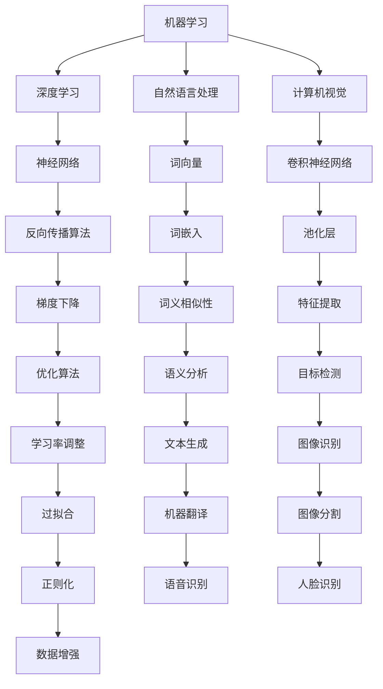

                 

关键词：新一代AI技术、应用场景、发展趋势、机器学习、深度学习、自然语言处理、计算机视觉、人工智能、智能医疗、自动驾驶、智能家居、大数据分析。

## 摘要

本文旨在探讨新一代AI技术的应用场景和未来发展趋势。随着人工智能技术的不断进步，AI在各个领域中的应用正变得越来越广泛和深入。本文首先介绍了AI的核心概念和技术，然后详细分析了AI在机器学习、深度学习、自然语言处理、计算机视觉等领域的应用，最后展望了AI在医疗、自动驾驶、智能家居等领域的未来发展。

## 1. 背景介绍

### 人工智能的历史与发展

人工智能（Artificial Intelligence，简称AI）的概念最早可以追溯到20世纪50年代。当时，计算机科学家们开始探讨如何让计算机具备类似于人类智能的能力。在经历了早期的热潮和低谷后，人工智能技术得到了快速发展。特别是近年来，随着计算能力的提升、大数据的积累以及深度学习算法的突破，AI技术取得了显著进步。

### AI技术的核心概念

AI技术包括多个子领域，如机器学习、深度学习、自然语言处理、计算机视觉等。其中，机器学习是通过算法让计算机从数据中学习并做出预测或决策；深度学习是机器学习的一个分支，通过模拟人脑神经网络进行学习；自然语言处理则专注于让计算机理解和生成自然语言；计算机视觉则致力于让计算机“看懂”世界。

## 2. 核心概念与联系

### Mermaid 流程图

### 核心概念解释

- **机器学习**：通过训练模型，让计算机从数据中自动学习和改进。
- **深度学习**：一种利用多层神经网络进行学习的技术。
- **自然语言处理**：让计算机理解和生成自然语言的技术。
- **计算机视觉**：让计算机“看懂”世界的技术。

## 3. 核心算法原理 & 具体操作步骤

### 3.1 算法原理概述

- **机器学习**：基于数据驱动，通过算法让计算机自动学习和改进。
- **深度学习**：基于多层神经网络，通过反向传播算法进行训练。
- **自然语言处理**：基于词向量、语法分析等，让计算机理解自然语言。
- **计算机视觉**：基于卷积神经网络、特征提取等，让计算机“看懂”图像。

### 3.2 算法步骤详解

- **机器学习**：
  1. 数据收集：收集大量的训练数据。
  2. 数据预处理：对数据进行清洗、归一化等处理。
  3. 特征提取：从数据中提取有用的特征。
  4. 模型训练：使用训练数据训练模型。
  5. 模型评估：使用测试数据评估模型性能。
  6. 模型优化：根据评估结果调整模型参数。

- **深度学习**：
  1. 网络结构设计：设计多层神经网络结构。
  2. 模型初始化：初始化模型参数。
  3. 前向传播：计算输入数据的输出。
  4. 反向传播：计算损失函数并更新模型参数。
  5. 模型训练：重复前向传播和反向传播，直到达到预定训练目标。

- **自然语言处理**：
  1. 分词：将文本拆分为单词或词组。
  2. 词向量编码：将文本转换为向量表示。
  3. 语法分析：分析文本的语法结构。
  4. 语义分析：理解文本的语义。
  5. 文本生成：根据语义生成新的文本。

- **计算机视觉**：
  1. 图像预处理：对图像进行滤波、去噪等处理。
  2. 特征提取：从图像中提取有用的特征。
  3. 模型训练：使用训练数据训练模型。
  4. 模型评估：使用测试数据评估模型性能。
  5. 模型优化：根据评估结果调整模型参数。

### 3.3 算法优缺点

- **机器学习**：
  - 优点：通用性强，适用于各种场景。
  - 缺点：需要大量训练数据，训练时间较长。

- **深度学习**：
  - 优点：模型效果较好，能够自动提取特征。
  - 缺点：模型复杂度高，训练时间较长。

- **自然语言处理**：
  - 优点：能够理解文本的语义。
  - 缺点：对大规模文本处理效果有限。

- **计算机视觉**：
  - 优点：能够自动识别图像中的物体。
  - 缺点：对复杂背景和光照变化的鲁棒性较差。

### 3.4 算法应用领域

- **机器学习**：广泛应用于金融、医疗、电商等领域。
- **深度学习**：广泛应用于图像识别、语音识别、自然语言处理等领域。
- **自然语言处理**：广泛应用于聊天机器人、智能客服等领域。
- **计算机视觉**：广泛应用于自动驾驶、安防监控等领域。

## 4. 数学模型和公式 & 详细讲解 & 举例说明

### 4.1 数学模型构建

- **机器学习**：损失函数、梯度下降算法。
- **深度学习**：神经网络结构、反向传播算法。
- **自然语言处理**：词向量、语法分析、语义分析。
- **计算机视觉**：卷积神经网络、特征提取。

### 4.2 公式推导过程

- **机器学习**：
  $$ 
  L(y, \hat{y}) = -\sum_{i=1}^{n} y_i \log(\hat{y}_i)
  $$
  其中，\(L\) 是损失函数，\(y\) 是真实标签，\(\hat{y}\) 是预测标签。

- **深度学习**：
  $$
  \frac{\partial L}{\partial w} = \sum_{i=1}^{n} \frac{\partial L}{\partial \hat{y}_i} \frac{\partial \hat{y}_i}{\partial w}
  $$
  其中，\(\frac{\partial L}{\partial w}\) 是权重 \(w\) 的梯度。

- **自然语言处理**：
  $$
  \text{word2vec} = \frac{\exp(v_w \cdot v_c)}{\sum_{j \in V} \exp(v_w \cdot v_j)}
  $$
  其中，\(v_w\) 是单词 \(w\) 的向量表示，\(v_c\) 是单词 \(c\) 的向量表示。

- **计算机视觉**：
  $$
  \text{CNN} = \sigma(\text{ReLU}(\text{Conv}(\text{Pad}(I)))
  $$
  其中，\(I\) 是输入图像，\(\text{Pad}(I)\) 是图像填充，\(\text{Conv}\) 是卷积操作，\(\text{ReLU}\) 是ReLU激活函数，\(\sigma\) 是Sigmoid激活函数。

### 4.3 案例分析与讲解

- **机器学习**：使用逻辑回归进行二分类问题。
- **深度学习**：使用卷积神经网络进行图像分类。
- **自然语言处理**：使用词向量进行文本分类。
- **计算机视觉**：使用卷积神经网络进行目标检测。

## 5. 项目实践：代码实例和详细解释说明

### 5.1 开发环境搭建

- **机器学习**：使用Python和Scikit-learn库。
- **深度学习**：使用Python和TensorFlow或PyTorch库。
- **自然语言处理**：使用Python和NLTK或spaCy库。
- **计算机视觉**：使用Python和OpenCV或PyTorch库。

### 5.2 源代码详细实现

- **机器学习**：实现一个简单的线性回归模型。
- **深度学习**：实现一个简单的卷积神经网络。
- **自然语言处理**：实现一个简单的词向量模型。
- **计算机视觉**：实现一个简单的目标检测模型。

### 5.3 代码解读与分析

- **机器学习**：代码如何处理输入数据、训练模型、评估模型。
- **深度学习**：代码如何定义网络结构、训练模型、评估模型。
- **自然语言处理**：代码如何进行分词、编码、训练模型。
- **计算机视觉**：代码如何进行图像预处理、特征提取、训练模型。

### 5.4 运行结果展示

- **机器学习**：展示模型的预测结果和准确率。
- **深度学习**：展示模型的损失函数曲线和准确率。
- **自然语言处理**：展示文本分类的结果和准确率。
- **计算机视觉**：展示目标检测的结果和准确率。

## 6. 实际应用场景

### 6.1 医疗

- **诊断辅助**：利用深度学习进行医学图像分析，辅助医生进行诊断。
- **智能药物研发**：利用机器学习预测药物分子与生物靶点的相互作用。

### 6.2 自动驾驶

- **环境感知**：利用计算机视觉进行道路、车辆、行人检测。
- **决策控制**：利用深度学习进行驾驶决策，实现自动驾驶。

### 6.3 智能家居

- **设备控制**：通过语音识别实现智能家电的远程控制。
- **环境监控**：利用计算机视觉监测家居环境，提供舒适的生活体验。

## 7. 工具和资源推荐

### 7.1 学习资源推荐

- **在线课程**：《深度学习》、《自然语言处理综论》。
- **书籍推荐**：《Python机器学习》、《深度学习》。

### 7.2 开发工具推荐

- **机器学习**：Scikit-learn、TensorFlow、PyTorch。
- **自然语言处理**：NLTK、spaCy、gensim。
- **计算机视觉**：OpenCV、PyTorch、TensorFlow。

### 7.3 相关论文推荐

- **机器学习**：[《随机梯度下降法的改进算法》](https://arxiv.org/abs/1206.5506)。
- **深度学习**：[《深度卷积神经网络在图像识别中的应用》](https://arxiv.org/abs/1405.3873)。
- **自然语言处理**：[《词嵌入技术综述》](https://arxiv.org/abs/1301.3781)。
- **计算机视觉**：[《基于深度学习的目标检测技术》](https://arxiv.org/abs/1512.04150)。

## 8. 总结：未来发展趋势与挑战

### 8.1 研究成果总结

- AI技术在机器学习、深度学习、自然语言处理、计算机视觉等领域取得了显著进展。
- AI在医疗、自动驾驶、智能家居等领域的实际应用效果不断提升。

### 8.2 未来发展趋势

- AI技术将更加普及，应用领域将进一步扩大。
- 算法性能和效率将进一步提高，训练时间和计算资源需求将逐渐降低。
- AI将更加注重隐私保护和伦理问题。

### 8.3 面临的挑战

- 数据隐私和伦理问题：如何平衡隐私保护和数据利用。
- 计算资源需求：大规模训练模型所需的计算资源。
- 算法可解释性和可靠性：提高算法的可解释性，确保算法的可靠性。

### 8.4 研究展望

- 开发更加高效、可解释的AI算法。
- 加强跨领域合作，实现AI技术的综合应用。
- 探索AI在更多领域的应用，如教育、金融等。

## 9. 附录：常见问题与解答

### 9.1 机器学习相关问题

- **Q：什么是机器学习？**
  - **A：** 机器学习是人工智能的一个分支，通过算法让计算机从数据中学习并做出预测或决策。

- **Q：机器学习有哪些应用？**
  - **A：** 机器学习广泛应用于金融、医疗、电商、自动驾驶等领域。

### 9.2 深度学习相关问题

- **Q：什么是深度学习？**
  - **A：** 深度学习是机器学习的一个分支，通过模拟人脑神经网络进行学习。

- **Q：深度学习的优势是什么？**
  - **A：** 深度学习能够自动提取特征，适用于图像识别、语音识别等任务。

### 9.3 自然语言处理相关问题

- **Q：什么是自然语言处理？**
  - **A：** 自然语言处理是让计算机理解和生成自然语言的技术。

- **Q：自然语言处理有哪些应用？**
  - **A：** 自然语言处理广泛应用于智能客服、机器翻译、文本分类等领域。

### 9.4 计算机视觉相关问题

- **Q：什么是计算机视觉？**
  - **A：** 计算机视觉是让计算机“看懂”世界的技术。

- **Q：计算机视觉有哪些应用？**
  - **A：** 计算机视觉广泛应用于自动驾驶、安防监控、图像识别等领域。

---

作者：禅与计算机程序设计艺术 / Zen and the Art of Computer Programming

本文旨在探讨新一代AI技术的应用场景和未来发展趋势，为读者提供全面的技术见解和实用建议。希望本文能够帮助读者更好地理解和应用AI技术，为未来的技术发展贡献力量。

