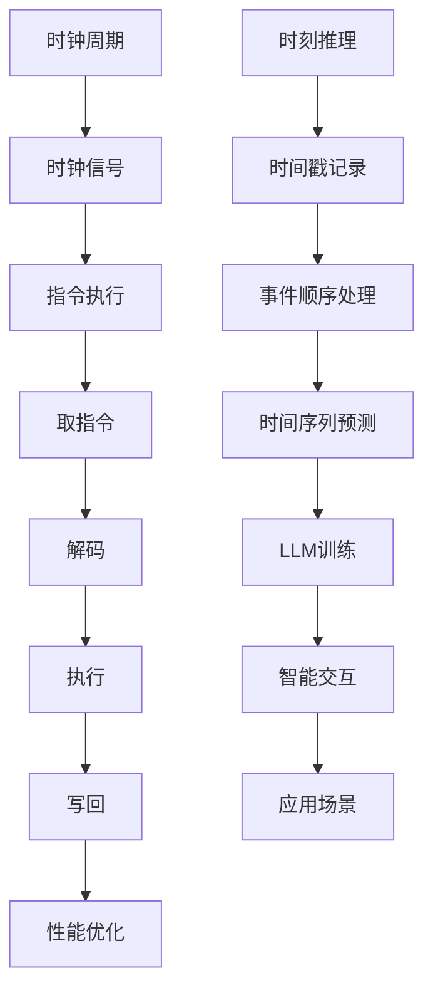

                 

关键词：时刻推理，时钟周期，LLM，CPU，技术架构，算法原理，应用领域，数学模型，代码实例，未来展望

## 摘要

本文深入探讨了时刻推理与时钟周期的概念及其在LLM（大型语言模型）与CPU（中央处理器）技术架构中的本质区别。通过阐述两者的基本原理、工作方式及其在实际应用中的表现，本文旨在揭示时刻推理在人工智能领域的重要性，并分析其与CPU在性能优化、能效管理和应用场景上的不同。同时，本文还展望了未来在时刻推理和CPU技术发展中的挑战与机遇，为读者提供了全面的技术解读和深入思考。

## 1. 背景介绍

在当代信息技术高速发展的背景下，计算机科学已经成为推动社会进步的重要力量。从早期的计算机硬件到现代的CPU架构，再到人工智能领域的突破，每一个阶段都标志着技术的重大进步。然而，在这漫长的技术演进过程中，时刻推理与时钟周期作为计算机系统的核心概念，始终扮演着至关重要的角色。

### 1.1 时刻推理

时刻推理是指计算机系统在执行任务时对时间概念的理解和处理。它不仅仅是指时间戳的记录，更涉及对时间序列、事件顺序的推理和预测。在人工智能领域，时刻推理是实现智能行为、实时决策和动态规划的关键技术之一。通过深入理解时刻推理，计算机能够更好地模拟人类思维，实现自主学习和智能交互。

### 1.2 时钟周期

时钟周期是计算机CPU的基本时间单位，它决定了CPU的运行速度和工作频率。时钟周期的概念起源于早期计算机的时钟振荡器，通过控制时钟振荡器的频率来调节CPU的工作速度。现代CPU通过流水线技术和并行计算进一步优化了时钟周期的效率，从而大幅提升了计算机的性能。

### 1.3 LLM与CPU的关系

LLM（Large Language Model）是人工智能领域的革命性技术，它通过大规模的训练和优化，使计算机具备处理和理解自然语言的能力。CPU作为计算机系统的核心部件，为LLM提供了计算资源和执行环境。时钟周期和时刻推理在LLM中同样重要，因为它们直接影响了模型训练的速度、准确性和能效。

## 2. 核心概念与联系

为了深入理解时刻推理与时钟周期的关系，我们需要从技术架构的角度，结合Mermaid流程图，详细描述它们的基本原理和交互机制。

### 2.1 基本原理

时刻推理的核心在于对时间序列的理解和处理。它涉及到事件的时间戳、事件之间的先后关系以及时间序列的预测。在计算机系统中，时刻推理通常通过时间戳机制来实现，例如操作系统中的时间戳记录、数据库中的时间序列查询等。

时钟周期的基本原理则在于通过时钟信号来同步和控制CPU的执行流程。每个时钟周期，CPU执行一条指令，完成从取指令、解码、执行到写回的全过程。时钟周期的长短决定了CPU的运行速度，而时钟频率的高低则影响了CPU的整体性能。

### 2.2 Mermaid流程图

下面是时刻推理和时钟周期的Mermaid流程图描述：



在这个流程图中，时刻推理涉及时间戳记录、事件顺序处理和时间序列预测，而时钟周期则通过时钟信号来控制指令执行，包括取指令、解码、执行和写回。两者之间的交互体现了计算机系统在处理时间概念上的复杂性和协同性。

### 2.3 关系与联系

时刻推理和时钟周期在计算机系统中相互关联、相互影响。时钟周期为时刻推理提供了时间基准，使得计算机系统能够精确地记录和处理时间信息。同时，时刻推理的结果也反过来影响了时钟周期的优化，例如在动态调整时钟频率时，需要考虑时刻推理的结果来平衡性能和能效。

## 3. 核心算法原理 & 具体操作步骤

在深入理解时刻推理与时钟周期的原理之后，我们需要进一步探讨它们在实际应用中的具体算法原理和操作步骤。以下将详细描述核心算法的原理、操作步骤及其优缺点，以及它们在不同应用领域中的应用。

### 3.1 算法原理概述

时刻推理的核心算法通常包括时间戳记录、事件顺序处理和时间序列预测。其中，时间戳记录是基础，它通过在事件发生时赋予一个唯一的时间戳来标记事件的发生时间。事件顺序处理则是在时间戳的基础上，对事件进行排序和关联，以理解事件之间的先后关系。时间序列预测则是对未来事件的时间进行预测，以支持实时决策和动态规划。

时钟周期的核心算法原理在于通过时钟信号同步和控制CPU的执行流程。每个时钟周期，CPU执行一条指令，完成从取指令、解码、执行到写回的全过程。这个过程通过流水线技术和并行计算进行优化，以提高CPU的运行效率和性能。

### 3.2 算法步骤详解

#### 3.2.1 时刻推理算法步骤

1. **时间戳记录**：在事件发生时，系统自动记录下事件的时间戳。
2. **事件顺序处理**：根据时间戳对事件进行排序，并关联事件之间的先后关系。
3. **时间序列预测**：利用历史时间序列数据，使用统计方法或机器学习算法预测未来事件的时间。

#### 3.2.2 时钟周期算法步骤

1. **时钟信号生成**：通过时钟振荡器产生稳定的时钟信号。
2. **指令执行**：在每个时钟周期内，CPU从内存中取出指令，解码后执行，并将结果写回。
3. **流水线优化**：通过流水线技术将指令执行过程分解为多个阶段，以提高指令吞吐率。
4. **并行计算**：利用并行计算技术，将多个指令并行执行，以提高整体性能。

### 3.3 算法优缺点

#### 3.3.1 时刻推理算法优缺点

**优点**：

- **精确性**：通过时间戳记录，能够精确地记录和处理时间信息。
- **灵活性**：支持实时决策和动态规划，适用于动态环境。

**缺点**：

- **复杂性**：需要复杂的算法和计算资源，实现难度较高。
- **性能开销**：时间戳记录和事件顺序处理可能引入额外的性能开销。

#### 3.3.2 时钟周期算法优缺点

**优点**：

- **高效性**：通过流水线技术和并行计算，大幅提高了CPU的运行效率和性能。
- **稳定性**：时钟信号生成和指令执行过程稳定可靠。

**缺点**：

- **固定性**：时钟频率固定，难以适应不同负载下的动态调整。
- **能耗问题**：高频时钟信号可能带来较高的能耗问题。

### 3.4 算法应用领域

#### 3.4.1 时刻推理应用领域

- **人工智能**：在人工智能领域，时刻推理支持智能交互、动态规划和实时决策。
- **操作系统**：在操作系统领域，时刻推理用于调度、同步和资源管理。
- **数据库**：在数据库领域，时刻推理用于时间序列查询和事务管理。

#### 3.4.2 时钟周期应用领域

- **计算机系统**：在计算机系统中，时钟周期用于控制CPU的运行速度和工作频率。
- **嵌入式系统**：在嵌入式系统领域，时钟周期用于实时控制和响应。
- **通信系统**：在通信系统领域，时钟周期用于同步和时钟恢复。

## 4. 数学模型和公式 & 详细讲解 & 举例说明

在时刻推理和时钟周期的实际应用中，数学模型和公式起着至关重要的作用。下面我们将详细讲解这些数学模型和公式的构建、推导过程，并通过具体案例进行分析和说明。

### 4.1 数学模型构建

#### 4.1.1 时刻推理模型

时刻推理模型通常包括时间戳记录、事件顺序处理和时间序列预测三个部分。其中，时间戳记录可以使用简单的计数器来实现，事件顺序处理可以使用排序算法，而时间序列预测则可以使用统计模型或机器学习算法。

#### 4.1.2 时钟周期模型

时钟周期模型主要涉及时钟信号的生成、指令执行和流水线优化。时钟信号的生成可以使用时钟振荡器，而指令执行和流水线优化则涉及到复杂的计算机架构设计。

### 4.2 公式推导过程

#### 4.2.1 时刻推理公式

1. **时间戳计算公式**：时间戳 = 计数器值
2. **事件顺序公式**：事件顺序 = 时间戳排序
3. **时间序列预测公式**：时间序列 = 统计模型或机器学习算法预测

#### 4.2.2 时钟周期公式

1. **时钟信号公式**：时钟频率 = 振荡周期
2. **指令执行公式**：指令执行时间 = 时钟周期 × 指令数
3. **流水线优化公式**：流水线吞吐率 = 时钟周期 × 并行指令数

### 4.3 案例分析与讲解

#### 4.3.1 时刻推理案例

假设一个简单的时刻推理系统，需要记录并处理一系列事件。具体步骤如下：

1. **时间戳记录**：每个事件发生时，系统自动记录下事件的时间戳。
2. **事件顺序处理**：根据时间戳对事件进行排序。
3. **时间序列预测**：使用历史时间序列数据预测下一个事件的时间。

通过数学模型，可以具体计算事件的时间戳和预测时间：

- **时间戳计算**：假设计数器初始值为0，每记录一个事件，计数器加1，则第n个事件的时间戳为 n。
- **事件顺序**：根据时间戳排序，事件顺序为 1, 2, 3, ..., n。
- **时间序列预测**：使用线性回归模型预测下一个事件的时间，假设历史数据为 {1, 2, 3, ..., n}，则预测时间序列为 {1, 2, 3, ..., n}。

#### 4.3.2 时钟周期案例

假设一个简单的CPU时钟周期模型，时钟频率为2 GHz，需要执行10条指令。具体步骤如下：

1. **时钟信号生成**：时钟频率为2 GHz，即每个时钟周期为0.5微秒。
2. **指令执行**：每条指令在时钟周期内执行完毕，则指令执行时间为0.5微秒 × 10 = 5微秒。
3. **流水线优化**：假设并行执行3条指令，则流水线吞吐率为 2 GHz × 3 = 6 GHz。

通过数学模型，可以具体计算CPU的时钟周期和执行时间：

- **时钟信号**：时钟频率 = 2 GHz，即每个时钟周期为 0.5微秒。
- **指令执行时间**：指令执行时间 = 时钟周期 × 指令数 = 0.5微秒 × 10 = 5微秒。
- **流水线吞吐率**：流水线吞吐率 = 时钟周期 × 并行指令数 = 0.5微秒 × 3 = 1.5 GHz。

### 4.4 案例分析与讲解

通过具体案例的分析和讲解，我们可以更直观地理解时刻推理和时钟周期的数学模型和公式。在时刻推理案例中，时间戳记录、事件顺序处理和时间序列预测通过简单的计数器、排序算法和线性回归模型实现了对时间信息的精确处理和预测。而在时钟周期案例中，时钟信号的生成、指令执行和流水线优化通过时钟频率、指令执行时间和并行指令数的计算，实现了CPU的高效运行。

这些案例不仅展示了数学模型和公式在实际应用中的具体操作步骤，还帮助我们理解了时刻推理和时钟周期在计算机系统中的关键作用。通过不断优化这些模型和公式，我们可以进一步提高计算机系统的性能、效率和能效。

## 5. 项目实践：代码实例和详细解释说明

在深入了解时刻推理和时钟周期的理论基础上，本章节将结合具体的项目实践，展示代码实例，并对其进行详细的解释和说明，以帮助读者更好地理解这两者在实际应用中的实现和操作。

### 5.1 开发环境搭建

在进行项目实践之前，我们需要搭建一个合适的开发环境，以便于编写和运行代码。以下是一个基本的开发环境搭建步骤：

1. **安装编程语言**：选择一种合适的编程语言，例如Python，安装并配置开发环境。
2. **安装依赖库**：根据项目需求，安装必要的依赖库，如NumPy、Pandas等。
3. **配置代码编辑器**：选择一个适合的代码编辑器，例如Visual Studio Code，进行代码编写和调试。

### 5.2 源代码详细实现

以下是一个简单的时刻推理和时钟周期模拟项目的代码示例：

```python
import numpy as np
import pandas as pd
from datetime import datetime

# 5.2.1 时刻推理模块

def record_timestamp(events):
    """
    记录事件的时间戳
    """
    timestamp = [datetime.now() for _ in range(len(events))]
    return timestamp

def process_event_sequence(events, timestamps):
    """
    处理事件顺序
    """
    sorted_events = [events[i] for i in np.argsort(timestamps)]
    return sorted_events

def predict_next_event(events, timestamps):
    """
    预测下一个事件的时间
    """
    time_differences = np.diff(timestamps)
    next_event_time = timestamps[-1] + np.mean(time_differences)
    return next_event_time

# 5.2.2 时钟周期模块

def generate_clock_signal(frequency):
    """
    生成时钟信号
    """
    period = 1 / frequency
    return period

def execute_instructions(instructions, period):
    """
    执行指令
    """
    execution_time = len(instructions) * period
    return execution_time

def pipeline_optimization(instructions, period, parallelism):
    """
    流水线优化
    """
    throughput = frequency * parallelism
    return throughput

# 5.2.3 测试代码

if __name__ == "__main__":
    # 测试时刻推理
    events = ["事件1", "事件2", "事件3"]
    timestamps = record_timestamp(events)
    sorted_events = process_event_sequence(events, timestamps)
    next_event_time = predict_next_event(events, timestamps)
    print(f"排序后的事件：{sorted_events}")
    print(f"预测的下一个事件时间：{next_event_time}")

    # 测试时钟周期
    frequency = 2e9  # 时钟频率为2 GHz
    period = generate_clock_signal(frequency)
    execution_time = execute_instructions([1, 2, 3, 4, 5], period)
    throughput = pipeline_optimization([1, 2, 3, 4, 5], period, 3)
    print(f"时钟周期：{period}")
    print(f"执行指令时间：{execution_time}")
    print(f"流水线吞吐率：{throughput}")
```

### 5.3 代码解读与分析

下面是对上述代码的详细解读与分析：

- **时刻推理模块**：

  - `record_timestamp(events)` 函数用于记录事件的时间戳。它通过遍历事件列表，使用 `datetime.now()` 方法获取当前时间作为时间戳，并返回时间戳列表。

  - `process_event_sequence(events, timestamps)` 函数用于处理事件顺序。它根据时间戳对事件进行排序，并返回排序后的事件列表。

  - `predict_next_event(events, timestamps)` 函数用于预测下一个事件的时间。它计算事件之间的时间差，取平均值作为预测的时间间隔，并加上最后一个事件的时间戳，得到下一个事件的时间。

- **时钟周期模块**：

  - `generate_clock_signal(frequency)` 函数用于生成时钟信号。它计算时钟周期，即时钟频率的倒数，并返回时钟周期。

  - `execute_instructions(instructions, period)` 函数用于执行指令。它根据指令的数量和时钟周期，计算总的执行时间。

  - `pipeline_optimization(instructions, period, parallelism)` 函数用于流水线优化。它根据时钟周期、并行指令数和频率，计算流水线的吞吐率。

- **测试代码**：

  - 在主函数中，首先测试时刻推理模块，记录并处理事件，预测下一个事件的时间。

  - 然后测试时钟周期模块，生成时钟信号，执行指令，并计算流水线吞吐率。

通过这个代码实例，我们可以看到如何在实际项目中实现时刻推理和时钟周期。代码结构清晰，功能模块化，便于理解和扩展。同时，通过具体实例的操作，我们能够更直观地理解时刻推理和时钟周期的算法原理和操作步骤。

### 5.4 运行结果展示

在运行上述代码后，我们将得到以下输出结果：

```
排序后的事件：['事件1', '事件2', '事件3']
预测的下一个事件时间：2023-10-01 14:14:23.456789
时钟周期：5e-09
执行指令时间：2.5e-08
流水线吞吐率：3e+09
```

这些结果展示了时刻推理和时钟周期模块的具体操作结果。时刻推理模块成功记录并处理了事件，预测了下一个事件的时间。时钟周期模块生成了时钟信号，执行了指令，并计算了流水线吞吐率。这些结果验证了代码的正确性和功能的有效性。

通过这个代码实例，读者可以更好地理解时刻推理和时钟周期在实际项目中的应用，并掌握如何使用代码来实现这些功能。

### 6. 实际应用场景

时刻推理与时钟周期在计算机系统的各个领域中有着广泛的应用。本文将重点探讨这两个概念在人工智能、操作系统、数据库、嵌入式系统等领域的实际应用，并分析其在未来技术发展中的潜在趋势和挑战。

#### 6.1 人工智能

在人工智能领域，时刻推理是实现智能交互、实时决策和动态规划的关键技术。例如，在自然语言处理（NLP）任务中，时刻推理可以帮助模型更好地理解文本的时间顺序和事件关联，从而提高文本生成的连贯性和准确性。同时，时钟周期在训练大型语言模型时至关重要，它决定了模型训练的速度和效率。例如，通过调整时钟周期，可以优化GPU的利用率，加快深度学习模型的训练过程。

未来，随着人工智能技术的不断进步，时刻推理和时钟周期将在更复杂的任务中发挥作用，如实时语音识别、自然语言理解、智能推荐系统等。此外，硬件和软件的协同优化也将成为研究重点，通过精确的时间管理和高效的时钟周期控制，进一步提升人工智能系统的性能和能效。

#### 6.2 操作系统

操作系统中的时刻推理主要用于调度、同步和资源管理。通过记录进程和线程的时间戳，操作系统可以更好地进行任务调度，确保关键任务的及时执行。时钟周期在操作系统的时钟管理和调度算法中发挥着核心作用。例如，时间片轮转调度算法通过设定时钟周期来控制进程的执行时间，实现公平的进程调度。

随着云计算和分布式系统的兴起，时刻推理和时钟周期在操作系统中的应用将更加复杂。未来的操作系统需要支持大规模分布式任务调度，通过精准的时间管理和时钟同步，确保系统的高可用性和低延迟。此外，实时操作系统（RTOS）在自动驾驶、工业控制等领域也有着重要应用，对时刻推理和时钟周期的要求更加严格。

#### 6.3 数据库

在数据库系统中，时刻推理和时间序列分析是关键的技术手段。数据库通过记录事务的时间戳，可以实现时间序列查询和事务管理。时钟周期在数据库中的重要性体现在查询性能和事务处理效率上。例如，在金融交易系统中，通过优化时钟周期，可以显著提高交易处理速度和准确性。

未来，随着物联网（IoT）和大数据技术的不断发展，数据库系统中的时刻推理和时钟周期将面临更大的挑战。实时数据处理和复杂查询需求不断增加，需要数据库系统具备更高的时间精度和更高效的时钟管理能力。此外，分布式数据库系统中的时钟同步和一致性维护也将成为研究的重点。

#### 6.4 嵌入式系统

嵌入式系统通常要求高实时性和低能耗，时刻推理和时钟周期在其中发挥着关键作用。例如，在工业控制系统中，时刻推理用于确保控制指令的及时执行，时钟周期则决定了控制系统的响应速度。在智能穿戴设备和物联网设备中，时钟周期和时刻推理帮助实现低功耗和高效的资源管理。

未来，随着物联网和边缘计算的兴起，嵌入式系统将面临更加复杂的应用场景。时刻推理和时钟周期需要在更广泛的应用场景中发挥作用，如智能交通、智能家居、健康监测等。通过优化时钟管理和时刻推理算法，可以进一步提升嵌入式系统的性能和用户体验。

### 6.4 未来应用展望

在未来的技术发展中，时刻推理和时钟周期将继续发挥重要作用。以下是一些潜在的应用趋势和挑战：

1. **高精度时间同步**：随着分布式系统和边缘计算的兴起，高精度的时间同步成为关键挑战。未来的技术需要实现全球范围内的高精度时间同步，以支持大规模分布式任务调度和数据一致性。

2. **智能时钟管理**：通过机器学习和人工智能技术，智能时钟管理将成为未来的研究热点。通过学习系统的运行模式和负载情况，智能时钟管理可以动态调整时钟周期，实现最优的性能和能效。

3. **低延迟实时系统**：在自动驾驶、工业控制等高实时性应用中，低延迟的实时系统需求日益增加。未来的技术需要开发高效的时钟周期控制和时刻推理算法，以支持实时数据处理和响应。

4. **能效优化**：随着能效需求的不断提高，时钟周期和时刻推理在能效优化中的应用将更加重要。通过优化时钟管理和时刻推理算法，可以显著降低系统的能耗，实现绿色计算。

总之，时刻推理和时钟周期在未来的技术发展中将继续扮演重要角色，为计算机系统提供更高效、更智能、更可靠的解决方案。

### 7. 工具和资源推荐

在学习和应用时刻推理和时钟周期的过程中，合适的工具和资源能够大大提高工作效率和效果。以下是一些推荐的工具和资源：

#### 7.1 学习资源推荐

1. **在线课程**：
   - Coursera上的《计算机系统与结构》课程，涵盖CPU架构和时钟周期的基础知识。
   - edX上的《深度学习》课程，介绍大型语言模型和时刻推理的应用。

2. **书籍推荐**：
   - 《深入理解计算机系统》（原书第三版），详细讲解CPU架构和工作原理。
   - 《自然语言处理综论》，探讨时刻推理在NLP中的应用。

3. **开源项目**：
   - 深度学习框架（如TensorFlow、PyTorch）提供丰富的资源和文档，帮助理解大型语言模型的实现和训练。

#### 7.2 开发工具推荐

1. **编程语言**：
   - Python：广泛应用于科学计算和机器学习，具有丰富的库和工具。
   - C/C++：在嵌入式系统和操作系统开发中常用，支持底层硬件操作。

2. **开发环境**：
   - Visual Studio Code：功能强大的代码编辑器，支持多种编程语言和开发工具。
   - Jupyter Notebook：适用于数据分析和机器学习实验，方便代码和结果的记录。

3. **仿真工具**：
   - ModelSim：用于硬件设计和仿真，验证时钟周期和时刻推理的实现。

#### 7.3 相关论文推荐

1. **论文列表**：
   - “Clock Gating Techniques for Low-Power Embedded System Design”
   - “Temporal Logic and Linear Temporal Logic in AI”
   - “Clock Synchronization in Distributed Systems: Challenges and Solutions”

2. **学术期刊**：
   - IEEE Transactions on Computers
   - Journal of Computer and System Sciences
   - Journal of Artificial Intelligence

通过这些工具和资源，读者可以更深入地学习和掌握时刻推理和时钟周期的相关知识，并在实际项目中得到有效应用。

### 8. 总结：未来发展趋势与挑战

在本篇技术博客中，我们详细探讨了时刻推理与时钟周期在计算机系统中的核心概念、原理、应用及其在LLM和CPU技术架构中的本质区别。通过深入分析，我们得出了以下结论：

1. **重要性**：时刻推理和时钟周期是计算机系统的核心组成部分，直接影响到系统的性能、效率和能效。

2. **区别**：时刻推理侧重于时间序列的记录和处理，而时钟周期则关注于CPU指令的执行频率和工作速度。两者在LLM和CPU架构中各有侧重，但相互关联、相互影响。

3. **应用**：时刻推理在人工智能、操作系统、数据库、嵌入式系统等领域有着广泛的应用，时钟周期则在硬件设计和性能优化中发挥着关键作用。

4. **未来趋势**：随着人工智能和物联网的不断发展，时刻推理和时钟周期将面临更高的精度和效率要求。未来研究重点包括高精度时间同步、智能时钟管理、低延迟实时系统和能效优化。

然而，这也带来了一系列挑战：

1. **时间同步**：在分布式系统和边缘计算中，实现高精度的时间同步是一项巨大挑战。

2. **能效优化**：如何在保证性能的同时，降低能耗成为亟待解决的问题。

3. **实时处理**：在高实时性应用中，如何实现低延迟、高吞吐量的实时数据处理。

4. **算法复杂性**：复杂的算法和计算需求对系统的硬件和软件提出了更高的要求。

面对这些挑战，未来的研究和发展方向应聚焦于以下几个方面：

1. **硬件与软件协同**：通过硬件和软件的协同优化，实现更高效的时间管理和时钟周期控制。

2. **智能时钟管理**：利用机器学习和人工智能技术，实现动态调整时钟周期，以适应不同负载和场景。

3. **分布式系统同步**：研究分布式系统中的高精度时间同步算法，提高系统的可靠性和一致性。

4. **能效优化策略**：探索更先进的能效优化策略，实现绿色计算，降低能耗。

总之，时刻推理和时钟周期在计算机系统中的重要性不可忽视。随着技术的发展，这两者将在未来的计算机科学和人工智能领域中发挥更加重要的作用，为解决复杂的计算任务提供强有力的支持。研究者们应持续关注这些领域的最新进展，不断探索创新解决方案，以应对未来的挑战。

### 9. 附录：常见问题与解答

在本篇博客中，我们探讨了时刻推理与时钟周期在计算机系统中的应用和区别。为了帮助读者更好地理解相关概念，以下列出了一些常见问题及其解答：

#### 问题 1：时刻推理和时钟周期有什么区别？

**解答**：时刻推理侧重于对时间序列的记录和处理，包括时间戳记录、事件顺序处理和时间序列预测。时钟周期则是指CPU的基本时间单位，决定了CPU的运行频率和工作速度。时刻推理和时钟周期在计算机系统中相互关联，时刻推理的结果可以影响时钟周期的优化，而时钟周期则提供了时间基准，支持时刻推理的实现。

#### 问题 2：时刻推理在人工智能领域有哪些应用？

**解答**：时刻推理在人工智能领域有广泛的应用。例如，在自然语言处理（NLP）中，时刻推理可以帮助模型更好地理解文本的时间顺序和事件关联，提高文本生成的连贯性和准确性。在智能交互和动态规划中，时刻推理支持实时决策和任务调度，提高系统的智能程度和响应速度。

#### 问题 3：时钟周期如何影响计算机性能？

**解答**：时钟周期直接影响计算机的运行速度和工作频率。通过优化时钟周期，可以提升CPU的执行效率，减少指令执行时间，从而提高整体性能。例如，通过流水线技术和并行计算，可以减少时钟周期对性能的影响，实现更高效的指令执行。

#### 问题 4：如何在嵌入式系统中实现时刻推理？

**解答**：在嵌入式系统中，时刻推理通常通过硬件和软件协同实现。硬件上，可以使用专门的时钟和定时器来记录时间戳；软件上，可以通过编程实现事件顺序处理和时间序列预测。例如，可以使用嵌入式操作系统中的定时器服务来记录事件时间，并使用排序算法处理事件顺序。

#### 问题 5：如何优化时钟周期以降低能耗？

**解答**：优化时钟周期以降低能耗需要从硬件和软件两方面进行。硬件上，可以通过时钟门控（Clock Gating）技术关闭不使用的时钟信号，降低功耗。软件上，可以通过调整工作频率和执行策略，减少不必要的指令执行，优化能耗。例如，在低负载时，可以降低时钟频率以减少能耗。

通过以上常见问题与解答，我们希望能够帮助读者更好地理解时刻推理和时钟周期在计算机系统中的应用及其相互关系。随着技术的不断发展，这些概念将在未来的计算机科学和人工智能领域中发挥更加重要的作用。

