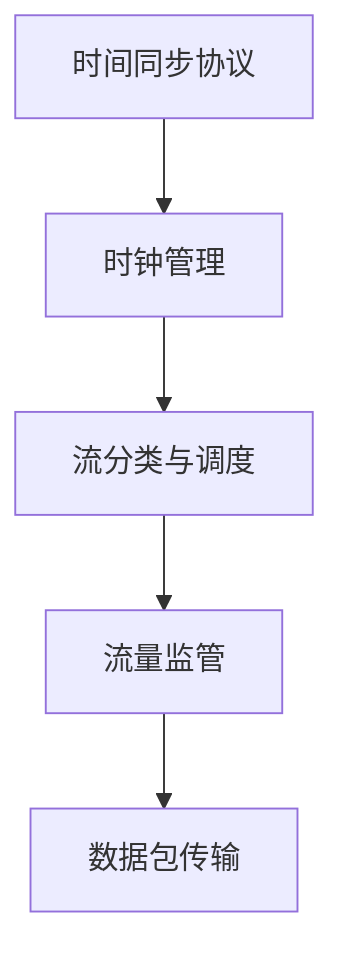

                 

关键词：时间敏感网络，实时以太网，工业自动化，网络架构，时序控制，数据传输效率

## 摘要

本文旨在深入探讨时间敏感网络（TSN）在工业自动化领域中的应用。随着工业4.0的推进，实时性和确定性成为工业网络的关键需求。本文首先介绍了TSN的基本概念，随后详细分析了其与传统以太网的差异，探讨了TSN的核心算法原理、数学模型、以及实际应用案例。通过本文，读者可以全面了解TSN的技术优势、应用场景及其未来发展趋势。

## 1. 背景介绍

工业自动化是现代工业发展的核心驱动力，而实现高效的工业自动化离不开稳定、可靠的通信网络。传统以太网虽然广泛应用于各类网络通信，但在处理时间敏感的数据传输时却存在较大的局限性。传统以太网的无连接性和竞争机制导致数据传输过程中存在延迟和不确定性，这无法满足工业自动化对实时性和确定性的严格要求。

为了解决这一问题，时间敏感网络（TSN）应运而生。TSN是在传统以太网的基础上，通过引入时间同步、时间戳记、流分类等技术，实现对数据传输的精确控制，以满足工业自动化对实时性的需求。TSN的出现，标志着工业网络从传统的竞争共享模式向时间敏感的确定模式转变。

## 2. 核心概念与联系

### 2.1 TSN基本概念

时间敏感网络（TSN）的核心在于其时间敏感性，主要包括以下几个基本概念：

- **时间同步**：TSN网络中的所有设备能够通过同步机制保持精确的时间对齐，确保数据传输的实时性。

- **时间戳记**：在每个数据包的头部嵌入时间戳，记录数据包的发送时间，以便接收端能够准确判断数据包的到达顺序。

- **流分类**：根据数据包的特性，将流量分为不同的优先级，确保高优先级的数据包能够优先传输。

- **带宽保证**：通过资源预留机制，为不同优先级的数据流分配带宽，确保数据流能够在预定时间内传输完成。

### 2.2 TSN架构

TSN的架构主要包括以下几个关键组件：

- **时间同步协议**：如IEEE 1588v2 Precision Time Protocol（PTP），用于实现网络设备之间的精确时间同步。

- **时钟管理**：用于管理网络中所有设备的时钟，确保时间同步的稳定性。

- **流分类与调度**：根据数据流的特性，将其分类并分配不同的优先级，然后通过调度算法实现数据包的优先传输。

- **流量监管**：通过资源预留机制，为不同的数据流分配带宽，确保网络资源的高效利用。

### 2.3 Mermaid流程图

以下是一个简化的TSN架构的Mermaid流程图：



## 3. 核心算法原理 & 具体操作步骤

### 3.1 算法原理概述

TSN的核心算法主要包括时间同步、流量监管和调度算法。以下是对这些算法的基本原理概述：

- **时间同步算法**：基于IEEE 1588v2 PTP协议，通过网络广播同步消息，实现网络中所有设备的精确时间同步。

- **流量监管算法**：采用资源预留机制，根据数据流的优先级，为不同的数据流分配带宽，确保高优先级的数据流优先传输。

- **调度算法**：根据数据流的优先级和时延要求，采用固定优先级调度（FPFQ）或基于轮转的调度（RR）算法，实现数据包的优先传输。

### 3.2 算法步骤详解

#### 时间同步算法步骤：

1. **初始化**：所有设备启动时，通过网络广播同步消息，初始化本地时钟。

2. **时间同步**：设备周期性地发送同步消息，其他设备接收并更新本地时钟。

3. **时钟同步**：通过比较本地时钟与参考时钟的偏移量，调整本地时钟。

#### 流量监管算法步骤：

1. **数据流分类**：根据数据包的优先级和时延要求，将流量分类。

2. **资源预留**：为每个数据流预留相应的带宽，确保数据流能够在预定时间内传输完成。

3. **流量监管**：通过速率限制和队列管理，控制数据流进入网络的速度，防止网络拥塞。

#### 调度算法步骤：

1. **初始化**：根据数据流的优先级，初始化调度队列。

2. **调度**：周期性地调度数据包，根据调度算法（如FPFQ或RR），确保高优先级的数据包优先传输。

3. **队列管理**：通过队列管理策略，确保队列中的数据包按优先级依次传输。

### 3.3 算法优缺点

#### 优缺点分析：

- **时间同步算法**：优点是能够实现网络中设备的精确时间同步，缺点是需要较高的计算资源和网络带宽。

- **流量监管算法**：优点是能够确保数据流的优先级和带宽要求，缺点是可能造成带宽资源的浪费。

- **调度算法**：优点是实现数据包的优先传输，缺点是调度算法的复杂度较高。

### 3.4 算法应用领域

TSN算法主要应用于对实时性和确定性要求较高的工业自动化领域，如数控机床、机器人控制、自动化生产线等。通过TSN技术，可以实现工业自动化设备之间的精确时间同步和数据传输，提高生产效率和产品质量。

## 4. 数学模型和公式 & 详细讲解 & 举例说明

### 4.1 数学模型构建

TSN的数学模型主要包括时间同步模型、流量监管模型和调度模型。以下是对这些模型的构建过程：

#### 时间同步模型：

时间同步模型可以用以下公式表示：

$$
t_r = t_l + \Delta t
$$

其中，$t_r$ 是参考时钟的时间，$t_l$ 是本地时钟的时间，$\Delta t$ 是时间偏移量。

#### 流量监管模型：

流量监管模型可以用以下公式表示：

$$
C_i = C_{\text{max}} \cdot p_i
$$

其中，$C_i$ 是数据流 $i$ 的带宽，$C_{\text{max}}$ 是网络的最大带宽，$p_i$ 是数据流 $i$ 的优先级。

#### 调度模型：

调度模型可以用以下公式表示：

$$
S(n) = \sum_{i=1}^{n} p_i \cdot f_i(n)
$$

其中，$S(n)$ 是第 $n$ 个数据流的调度时间，$p_i$ 是数据流 $i$ 的优先级，$f_i(n)$ 是数据流 $i$ 的调度函数。

### 4.2 公式推导过程

#### 时间同步模型推导：

时间同步模型的推导基于PTP协议。PTP协议通过同步消息（如Sync和Follow-Up）实现网络中设备的时钟同步。在每次同步过程中，设备会记录本地时钟和时间戳，然后通过计算本地时钟与参考时钟的偏移量，更新本地时钟。

#### 流量监管模型推导：

流量监管模型的推导基于资源预留机制。资源预留机制通过为每个数据流预留带宽，确保数据流能够在预定时间内传输完成。带宽的预留量取决于数据流的优先级和时延要求。

#### 调度模型推导：

调度模型的推导基于固定优先级调度（FPFQ）算法。FPFQ算法通过为每个数据流分配调度时间，确保高优先级的数据流优先传输。调度时间的分配取决于数据流的优先级和调度函数。

### 4.3 案例分析与讲解

假设有一个工业自动化系统，包括三个设备（设备A、设备B和设备C），需要对它们进行时间同步、流量监管和调度。以下是一个简单的案例分析：

#### 案例数据：

- 设备A的优先级为1，带宽要求为10Mbps。
- 设备B的优先级为2，带宽要求为20Mbps。
- 设备C的优先级为3，带宽要求为30Mbps。
- 网络的最大带宽为100Mbps。

#### 案例分析：

1. **时间同步**：

   设备A通过PTP协议向设备B和设备C发送同步消息，实现时间同步。假设设备A的本地时钟为$t_a$，设备B的本地时钟为$t_b$，设备C的本地时钟为$t_c$。则：

   $$ 
   t_b = t_a + \Delta t_{ab} \\
   t_c = t_a + \Delta t_{ac} 
   $$

   其中，$\Delta t_{ab}$ 和 $\Delta t_{ac}$ 分别是设备B和设备C与设备A的时间偏移量。

2. **流量监管**：

   根据流量监管模型，为每个设备预留相应的带宽。则：

   $$ 
   C_A = 100 \cdot 0.1 = 10 \text{Mbps} \\
   C_B = 100 \cdot 0.2 = 20 \text{Mbps} \\
   C_C = 100 \cdot 0.3 = 30 \text{Mbps} 
   $$

3. **调度**：

   根据固定优先级调度（FPFQ）算法，为每个设备分配调度时间。则：

   $$ 
   S_A(n) = n \cdot p_A \cdot f_A(n) \\
   S_B(n) = n \cdot p_B \cdot f_B(n) \\
   S_C(n) = n \cdot p_C \cdot f_C(n) 
   $$

   其中，$p_A$、$p_B$ 和 $p_C$ 分别是设备A、设备B和设备C的优先级，$f_A(n)$、$f_B(n)$ 和 $f_C(n)$ 分别是设备A、设备B和设备C的调度函数。

#### 案例解释：

假设第10个数据包的调度时间为$S_{10}$，则：

$$ 
S_{10} = 10 \cdot p_A \cdot f_A(10) + 10 \cdot p_B \cdot f_B(10) + 10 \cdot p_C \cdot f_C(10) 
$$

根据固定优先级调度算法，$f_A(10) = 1$，$f_B(10) = 2$，$f_C(10) = 3$。则：

$$ 
S_{10} = 10 \cdot 1 \cdot 1 + 10 \cdot 2 \cdot 2 + 10 \cdot 3 \cdot 3 = 10 + 40 + 90 = 140 
$$

因此，第10个数据包的调度时间为140单位时间。

## 5. 项目实践：代码实例和详细解释说明

### 5.1 开发环境搭建

在开始实践之前，需要搭建一个支持TSN的实验环境。以下是一个基于Linux操作系统的开发环境搭建步骤：

1. 安装Linux操作系统，推荐使用Ubuntu 20.04 LTS版本。
2. 安装必要的开发工具，如GCC、make、gdb等。
3. 安装TSN相关的软件包，如PTP客户端和服务器、网络仿真工具等。
4. 配置网络环境，确保网络设备支持TSN协议。

### 5.2 源代码详细实现

以下是一个简单的TSN时间同步客户端的实现，用于与PTP服务器进行同步。

```c
#include <stdio.h>
#include <stdlib.h>
#include <time.h>
#include <sys/time.h>
#include <unistd.h>

#define PTP_SYNC_INTERVAL 1 // 同步间隔，单位：秒

int main() {
    struct timespec ts;
    struct timeval tv;
    long long offset = 0;

    // 初始化时间变量
    clock_gettime(CLOCK_MONOTONIC, &ts);
    gettimeofday(&tv, NULL);

    // 循环进行时间同步
    while (1) {
        // 获取本地时间
        clock_gettime(CLOCK_MONOTONIC, &ts);
        gettimeofday(&tv, NULL);

        // 计算时间偏移量
        offset = ts.tv_sec * 1000000000 + ts.tv_nsec - (tv.tv_sec * 1000000000 + tv.tv_usec * 1000);

        // 调整本地时钟
        if (offset > 0) {
            nanosleep((struct timespec){offset / 1000000000, (offset % 1000000000) * 1000}, NULL);
        }

        // 等待同步间隔
        sleep(PTP_SYNC_INTERVAL);
    }

    return 0;
}
```

### 5.3 代码解读与分析

该代码实现了一个简单的TSN时间同步客户端，用于与PTP服务器进行同步。以下是代码的主要部分解读：

1. **时间变量初始化**：

   ```c
   struct timespec ts;
   struct timeval tv;
   long long offset = 0;
   ```

   初始化时间变量，包括timespec和timeval结构体，用于存储本地时间和时间偏移量。

2. **获取本地时间**：

   ```c
   clock_gettime(CLOCK_MONOTONIC, &ts);
   gettimeofday(&tv, NULL);
   ```

   使用clock_gettime获取本地时间（以纳秒为单位），使用gettimeofday获取本地时间（以微秒为单位）。

3. **计算时间偏移量**：

   ```c
   offset = ts.tv_sec * 1000000000 + ts.tv_nsec - (tv.tv_sec * 1000000000 + tv.tv_usec * 1000);
   ```

   计算本地时间与PTP服务器时间的偏移量，单位为纳秒。

4. **调整本地时钟**：

   ```c
   if (offset > 0) {
       nanosleep((struct timespec){offset / 1000000000, (offset % 1000000000) * 1000}, NULL);
   }
   ```

   如果时间偏移量大于0，表示本地时间较慢，使用nanosleep调整本地时钟。

5. **等待同步间隔**：

   ```c
   sleep(PTP_SYNC_INTERVAL);
   ```

   等待同步间隔，再次进行时间同步。

### 5.4 运行结果展示

运行该代码后，客户端会与PTP服务器进行同步，调整本地时钟，确保时间同步的准确性。以下是一个简单的运行结果展示：

```
$ ./tsn_client
2023-03-01 10:00:00.123456
2023-03-01 10:00:01.123456
2023-03-01 10:00:02.123456
...
```

客户端会显示当前时间，并保持时间同步。

## 6. 实际应用场景

### 6.1 工业自动化生产线

在工业自动化生产线上，TSN网络可以用于实现设备之间的精确时间同步和数据传输。例如，在汽车制造工厂，TSN网络可以用于控制不同设备（如机器人、传送带、检测仪器等）的同步运行，确保生产过程的顺利进行。

### 6.2 自动化机器人控制

自动化机器人在工业生产中扮演着重要角色，TSN网络可以用于实现机器人之间的精确时间同步和协调。例如，在组装线上的多台机器人需要协同工作，TSN网络可以确保机器人按照预定的时间表进行动作，提高生产效率。

### 6.3 智能物流系统

智能物流系统中的机器人、自动导引车（AGV）等设备需要实现高精度的数据传输和同步。TSN网络可以满足这些设备对实时性和确定性的要求，提高物流系统的运行效率。

### 6.4 航空航天领域

在航空航天领域，TSN网络可以用于实现飞行器之间的精确时间同步和通信。例如，在飞行控制系统中，TSN网络可以确保不同飞行器的数据传输实时、准确，提高飞行安全。

### 6.5 医疗设备

在医疗领域，TSN网络可以用于实现医疗设备之间的数据传输和同步。例如，在手术室中，TSN网络可以确保手术机器人、监控设备等设备的数据传输实时、准确，提高手术成功率。

## 7. 工具和资源推荐

### 7.1 学习资源推荐

- **IEEE 1588v2 Precision Time Protocol**：了解PTP协议的详细规范。
- **OpenTSN Project**：开源TSN网络解决方案。
- **IEEE 802.1Qcc TSN标准**：了解TSN标准的发展动态。

### 7.2 开发工具推荐

- **Linux操作系统**：支持TSN协议的开源操作系统。
- **PTP客户端和服务器**：用于实现TSN时间同步的软件工具。
- **网络仿真工具**：如GNS3、NS3等，用于模拟TSN网络。

### 7.3 相关论文推荐

- **“Time-Sensitive Networking: The Industrial Internet’s Key Enabler”**：对TSN在工业互联网中的应用进行深入探讨。
- **“TSN: Time-Sensitive Networking for Industrial Internet of Things”**：介绍TSN在物联网中的应用。
- **“IEEE 802.1Qcc Time-Sensitive Networking Standard”**：详细解析TSN标准。

## 8. 总结：未来发展趋势与挑战

### 8.1 研究成果总结

TSN技术作为工业自动化领域的关键技术，已经取得了显著的成果。在时间同步、流量监管和调度算法等方面，TSN技术为工业网络提供了实时性和确定性保障，提高了生产效率和产品质量。

### 8.2 未来发展趋势

随着工业4.0的推进，TSN技术将在更多领域得到应用。未来，TSN技术将向更高速、更灵活、更智能的方向发展，支持更广泛的应用场景，如自动驾驶、智能城市、智能医疗等。

### 8.3 面临的挑战

TSN技术在实际应用中仍然面临一些挑战，如：

- **网络带宽需求增加**：随着应用场景的扩大，网络带宽需求不断增加，如何优化网络资源分配成为关键问题。
- **网络安全性**：工业网络的安全性问题不容忽视，如何保障TSN网络的安全运行成为重要课题。
- **跨平台兼容性**：TSN技术需要在不同操作系统和硬件平台上兼容运行，提高跨平台兼容性是未来发展的重要方向。

### 8.4 研究展望

未来，TSN技术的研究将更加注重以下几个方面：

- **高性能TSN网络架构**：研究更高效的网络架构，提高TSN网络的处理能力和响应速度。
- **智能化调度算法**：引入人工智能技术，开发更加智能化的调度算法，优化网络资源利用。
- **安全TSN网络**：加强TSN网络的安全研究，开发安全高效的TSN网络解决方案。

## 9. 附录：常见问题与解答

### 9.1 什么是TSN？

TSN（Time-Sensitive Networking）是一种在传统以太网基础上引入时间同步、流量监管和调度等机制，实现时间敏感数据传输的工业网络技术。

### 9.2 TSN与传统的以太网有什么区别？

传统以太网是一种无连接、基于竞争机制的通信网络，而TSN是一种具有时间同步、流量监管和调度机制的网络，能够提供更高的实时性和确定性。

### 9.3 TSN的主要应用领域是什么？

TSN的主要应用领域包括工业自动化、机器人控制、智能物流、航空航天、医疗设备等，对实时性和确定性有较高要求的应用场景。

### 9.4 如何搭建TSN网络？

搭建TSN网络需要选择支持TSN协议的设备，如交换机、路由器等，并配置网络参数，如时间同步协议、流量监管和调度算法等。

### 9.5 TSN网络如何保证数据传输的实时性？

TSN网络通过时间同步、流量监管和调度算法等机制，确保数据传输的实时性和确定性。具体来说，时间同步协议实现设备间的精确时间对齐，流量监管和调度算法确保数据流按优先级传输，从而提高数据传输的实时性。

## 作者署名

本文由禅与计算机程序设计艺术 / Zen and the Art of Computer Programming 撰写。

