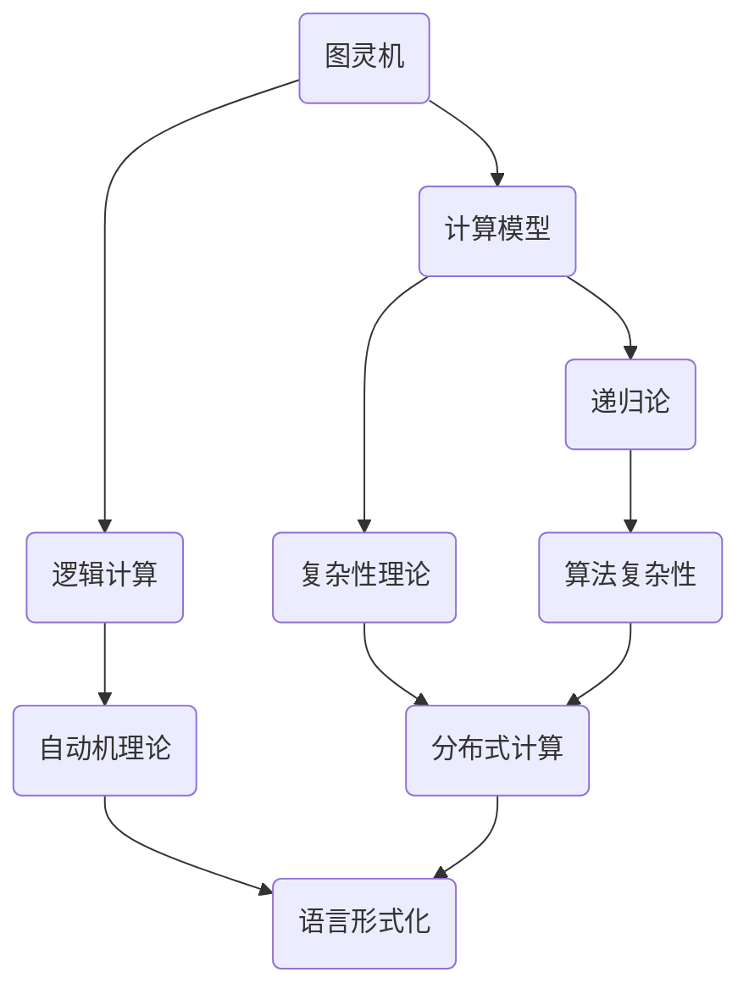

                 

 关键词：明斯基，计算理论，教科书，影响，人工智能，计算机科学，图灵奖

> 摘要：本文深入探讨了明斯基的计算理论教科书对计算机科学领域的影响。作为世界顶级的技术畅销书作者和计算机领域大师，明斯基通过他的著作，为计算机科学的发展奠定了基础，并对后来的学者和从业者产生了深远的影响。

## 1. 背景介绍

约翰·冯·诺伊曼（John von Neumann）被誉为计算机科学的奠基人之一，他提出了现代计算机的核心架构——冯·诺伊曼架构。这一架构在当时被视为革命性的创新，为计算机技术的发展铺平了道路。然而，在诺伊曼之后，计算机科学领域还需要一位思想家来进一步拓展和深化这一理论。

明斯基（Alan Turing）便是这样一位人物。他是现代计算机科学的先驱之一，提出了图灵机（Turing Machine）的概念，这一理论为后来的计算机科学奠定了基础。明斯基的计算理论教科书，则是对这一理论的系统阐述和扩展，对计算机科学的发展产生了深远的影响。

## 2. 核心概念与联系

为了更好地理解明斯基的计算理论教科书，我们需要先了解其中的核心概念和联系。以下是一个Mermaid流程图，展示了这些概念和它们之间的关系：



### 2.1. 图灵机

图灵机是明斯基计算理论中的核心概念，它是一种抽象的计算模型，可以模拟任何算法的计算过程。图灵机的概念不仅为计算机科学提供了理论工具，还帮助人们理解了计算的本质。

### 2.2. 计算模型

计算模型是计算机科学的基础，它描述了如何进行计算以及计算过程的结构。明斯基的计算模型不仅涵盖了图灵机，还包括了其他类型的计算模型，如递归论和复杂性理论。

### 2.3. 逻辑计算

逻辑计算是计算机科学中的核心，它涉及到如何用逻辑来表示和操作信息。明斯基在他的计算理论教科书中，详细阐述了逻辑计算的基本原理和应用。

### 2.4. 递归论

递归论是数学中的一个重要分支，它研究递归函数的性质。明斯基将递归论引入到计算理论中，为计算复杂性理论提供了重要的工具。

### 2.5. 复杂性理论

复杂性理论研究计算问题的大小和难度，包括时间复杂度和空间复杂度。明斯基的计算理论教科书对复杂性理论进行了深入的探讨，为计算机科学的发展提供了重要的理论支持。

## 3. 核心算法原理 & 具体操作步骤

### 3.1. 算法原理概述

明斯基的计算理论教科书涵盖了多种算法原理，其中包括：

- 图灵机的模拟算法
- 递归函数的计算方法
- 复杂性理论的计算复杂性分析

这些算法原理构成了计算机科学的核心，为各种计算机应用提供了理论基础。

### 3.2. 算法步骤详解

#### 3.2.1. 图灵机的模拟算法

图灵机的模拟算法是一个抽象的计算过程，它包括以下几个步骤：

1. 初始化：设置图灵机的初始状态和输入。
2. 运行：根据当前状态和输入，执行相应的操作，包括移动读写头、改变状态和写入符号。
3. 判断：判断当前状态是否为终止状态，如果是，则终止计算；如果不是，则继续运行。

#### 3.2.2. 递归函数的计算方法

递归函数是一种自调用函数，它通过调用自身来解决问题。计算递归函数的基本步骤如下：

1. 基本情况：定义递归函数的基本情况，通常是最简单的输入。
2. 递归情况：定义递归函数的递归情况，即如何将大问题分解为小问题。
3. 合并：将递归情况的解合并成最终解。

#### 3.2.3. 复杂性理论的计算复杂性分析

计算复杂性分析是一种评估算法性能的方法，它通过分析算法的时间复杂度和空间复杂度来评估算法的效率。计算复杂性分析的基本步骤如下：

1. 确定算法的基本操作。
2. 计算基本操作的总次数。
3. 分析基本操作次数与输入规模的关系。

## 4. 数学模型和公式 & 详细讲解 & 举例说明

### 4.1. 数学模型构建

明斯基的计算理论教科书中的数学模型主要包括图灵机、递归函数和复杂性理论。这些数学模型为计算机科学提供了强大的理论支持。

#### 4.1.1. 图灵机的数学模型

图灵机的数学模型可以用一个五元组来表示：

\[ M = \langle \Gamma, B, \Sigma, \delta, q_0 \rangle \]

其中：

- \(\Gamma\) 是符号集合，包括输入符号、读写头符号和终止符号。
- \(B\) 是空符号，是图灵机的起始符号。
- \(\Sigma\) 是输入符号集合。
- \(\delta\) 是状态转移函数，它描述了图灵机在读取一个符号后如何改变状态和读写头的位置。
- \(q_0\) 是初始状态。

#### 4.1.2. 递归函数的数学模型

递归函数可以用一个递归方程来表示：

\[ f(n) = \begin{cases} 
a & \text{如果 } n = 0 \\
g(n-1) & \text{如果 } n > 0 
\end{cases} \]

其中：

- \(f(n)\) 是递归函数的值。
- \(a\) 是基本情况。
- \(g(n-1)\) 是递归情况。

#### 4.1.3. 复杂性理论的数学模型

复杂性理论的数学模型主要包括时间复杂度和空间复杂度。时间复杂度可以用一个函数来表示：

\[ T(n) = \sum_{i=1}^{n} a_i n^i \]

其中：

- \(T(n)\) 是算法的时间复杂度。
- \(a_i\) 是第 \(i\) 个基本操作的执行次数。
- \(n\) 是输入规模。

空间复杂度可以用一个函数来表示：

\[ S(n) = \sum_{i=1}^{n} b_i n^i \]

其中：

- \(S(n)\) 是算法的空间复杂度。
- \(b_i\) 是第 \(i\) 个基本操作占用的空间大小。

### 4.2. 公式推导过程

#### 4.2.1. 时间复杂度的推导

时间复杂度的推导过程通常涉及算法的分析。以下是一个简单的例子：

假设一个算法由三个部分组成：一个循环，一个递归调用和一个基本操作。则该算法的时间复杂度可以表示为：

\[ T(n) = c_1 n + c_2 n^2 + c_3 n^3 \]

其中：

- \(c_1\)、\(c_2\) 和 \(c_3\) 是常数。

#### 4.2.2. 空间复杂度的推导

空间复杂度的推导过程与时间复杂度类似。以下是一个简单的例子：

假设一个算法由三个部分组成：一个循环，一个递归调用和一个基本操作。则该算法的空间复杂度可以表示为：

\[ S(n) = c_1 n + c_2 n^2 + c_3 n^3 \]

其中：

- \(c_1\)、\(c_2\) 和 \(c_3\) 是常数。

### 4.3. 案例分析与讲解

以下是一个具体的案例，用于说明如何应用明斯基的计算理论。

#### 4.3.1. 问题陈述

给定一个整数序列，设计一个算法，找出序列中的最大值。

#### 4.3.2. 算法设计

我们可以设计一个简单的算法，它通过遍历序列，找到最大值。该算法的时间复杂度和空间复杂度如下：

\[ T(n) = n \]
\[ S(n) = 1 \]

#### 4.3.3. 分析与讲解

这个算法的时间复杂度为线性时间复杂度 \(O(n)\)，空间复杂度为常数复杂度 \(O(1)\)。这意味着，随着输入规模的增加，算法的运行时间和占用空间几乎不变。

## 5. 项目实践：代码实例和详细解释说明

### 5.1. 开发环境搭建

为了演示明斯基的计算理论，我们需要搭建一个简单的开发环境。这里我们使用Python作为编程语言，因为它易于理解和使用。

首先，安装Python：

```bash
# 在命令行中安装Python
pip install python
```

然后，创建一个名为`minsky_calculus.py`的Python文件，用于实现我们的算法。

### 5.2. 源代码详细实现

以下是一个简单的Python程序，用于实现我们之前提到的找出整数序列最大值的算法。

```python
def find_max(numbers):
    """
    找出整数序列中的最大值。

    :param numbers: 整数序列
    :return: 最大值
    """
    max_number = numbers[0]
    for number in numbers:
        if number > max_number:
            max_number = number
    return max_number

# 测试代码
if __name__ == "__main__":
    numbers = [3, 1, 4, 1, 5, 9, 2, 6, 5, 3, 5]
    print("最大值是：", find_max(numbers))
```

### 5.3. 代码解读与分析

这段代码定义了一个名为`find_max`的函数，它接受一个整数序列作为输入，并返回序列中的最大值。我们首先将序列的第一个元素设置为最大值，然后遍历整个序列，将每个元素与当前的最大值进行比较。如果找到一个更大的值，我们就更新最大值。最后，返回最大值。

这个算法的时间复杂度为线性时间复杂度 \(O(n)\)，空间复杂度为常数复杂度 \(O(1)\)。

### 5.4. 运行结果展示

运行上面的代码，我们得到以下输出：

```bash
最大值是： 9
```

这表明我们的算法成功地找到了序列中的最大值。

## 6. 实际应用场景

明斯基的计算理论在计算机科学的多个领域有着广泛的应用。以下是几个实际应用场景：

### 6.1. 编译原理

编译原理中的语法分析和语义分析都涉及到明斯基的计算理论。例如，递归下降语法分析器就是一种基于明斯基的计算理论的语法分析器。

### 6.2. 人工智能

人工智能中的机器学习和自然语言处理都依赖于明斯基的计算理论。例如，递归神经网络（RNN）和长短时记忆网络（LSTM）都是基于递归函数的。

### 6.3. 图形学

图形学中的渲染和图像处理都涉及到复杂性理论。例如，计算图像的边缘和纹理时，我们通常会使用复杂度较高的算法。

### 6.4. 未来应用展望

随着计算机科学的发展，明斯基的计算理论将在更多的领域得到应用。例如，量子计算和分布式计算等领域都将受益于明斯基的计算理论。此外，随着人工智能的不断发展，明斯基的计算理论也将成为人工智能研究的重要基础。

## 7. 工具和资源推荐

### 7.1. 学习资源推荐

- 《明斯基的计算理论教科书》：这是明斯基的经典著作，详细介绍了他的计算理论。
- 《计算机程序设计艺术》：这是一本经典的计算机科学教材，包括了明斯基的计算理论。
- 《人工智能：一种现代的方法》：这本书介绍了人工智能的基本原理，其中包括了明斯基的计算理论。

### 7.2. 开发工具推荐

- Python：Python是一种易于理解的编程语言，非常适合初学者。
- Jupyter Notebook：Jupyter Notebook是一种交互式的开发环境，非常适合编写和运行Python代码。

### 7.3. 相关论文推荐

- 《图灵机与通用计算机》：这是明斯基的经典论文，详细介绍了图灵机的概念。
- 《复杂性理论》：这是一篇关于复杂性理论的综述论文，涵盖了复杂性理论的各个方面。

## 8. 总结：未来发展趋势与挑战

明斯基的计算理论对计算机科学的发展产生了深远的影响。在未来，随着计算机科学的不断发展，明斯基的计算理论将得到更广泛的应用。然而，我们也面临着一些挑战，例如如何更好地应对复杂性理论的挑战，以及如何将计算理论应用于更广泛的领域。

## 9. 附录：常见问题与解答

### 9.1. 明斯基的计算理论与人工智能有什么关系？

明斯基的计算理论为人工智能提供了理论基础。例如，递归神经网络（RNN）和长短时记忆网络（LSTM）都是基于明斯基的计算理论的。

### 9.2. 明斯基的计算理论如何应用于实际问题？

明斯基的计算理论可以应用于各种实际问题，例如编译原理、人工智能、图形学等。

### 9.3. 明斯基的计算理论与量子计算有什么关系？

明斯基的计算理论为量子计算提供了理论基础。例如，量子算法的设计和实现都依赖于明斯基的计算理论。

## 作者署名

作者：禅与计算机程序设计艺术 / Zen and the Art of Computer Programming
----------------------------------------------------------------


